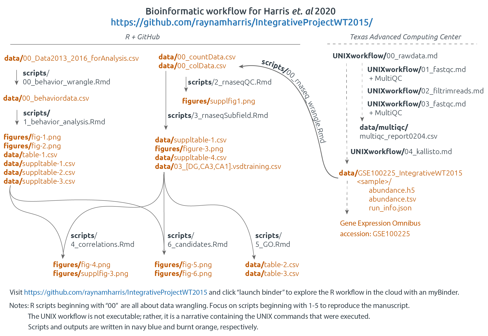
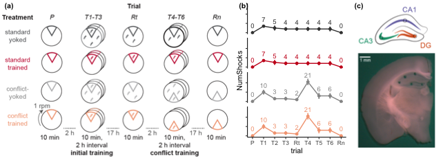
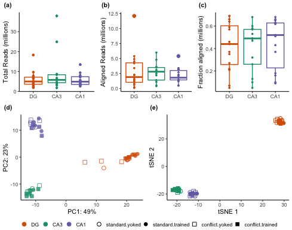
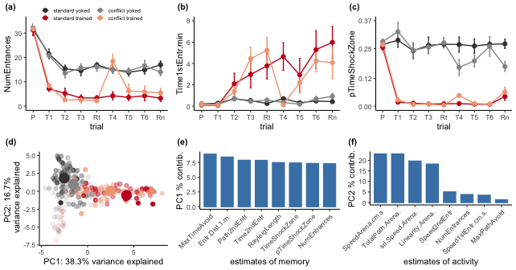
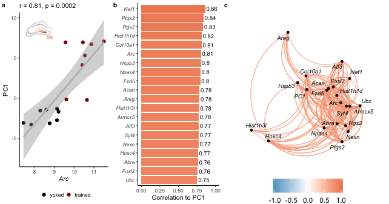

```{r setup, include=FALSE}
library(knitr)
library(kableExtra)

knitr::opts_chunk$set(echo = F)
```

[](https://mybinder.org/v2/gh/raynamharris/IntegrativeProjectWT2015/master)
*Click the button to launch a Binder R session. Navigate to the
`scripts` directory and open any `.Rmd` file.*

# IntegrativeProjectWT2015

This repo contains the experiment that I like to call "IntegrativeProjectWT2015" because it is an **integrative** analysis of behavior, electrophysiology, and RNA-seq data collected from **wild type** mice in **2015**. 

## Bioinformatics Workflow

This project is organized into five main subdirectories: 
- [`scripts`](scripts): contains all the `knitr`-based R workflows for statistical analyses and data visualization (source code is in the `.Rmd` files, and `.md` files are used to visualize the code and the results
- [`UNIXworkflow`](UNIXworkflow): contains and explanation and all the UNIX commands used to process the raw sequencing data on the Stampede cluster at the Texas Advanced Computing Facility
- [`figures`](figures): all the figures created from the scripts 
- [`data`](data): all the input data and the results
- [`docs`](docs): presentations generated using R 

This workflow below describes the order in which scripts are used to process and analyze behavioral data (part 1), RNA-seq data (part 2), electrophysiology data (part 3). Finally, the last step (part 4) was to integrate across all three levels of analysis. 

- **Part 1: Behavioral analysis**	
  - [scripts/00_behavior_wrangle](scripts/00_behavior_wrangle.md): behavior data wrangling,
	- [scripts/01_behavior_analysis](scripts/01_behavior_analysis.md): behavior statistics and data visualization
- **Part 2: RNA sequencing analysis**
  - **UNIX-based**
	  - [UNIXworkflow/00_rawdata](UNIXworkflow/00_rawdata.md): Download the data to scratch on Stampede with `00_gsaf_download.sh`. 
	  - [UNIXworkflow/01_fastqc](UNIXworkflow/01_fastqc.md): Evaluate the quality of the reads using the program FastQC.
	  - [UNIXworkflow/02_filtrimreads](UNIXworkflow/02_filtrimreads.md): Filter low quality reads and trim adapters using the program cutadapt.
  	- [UNIXworkflow/03_fastqc](UNIXworkflow/03_fastqc.md): Evaluate the quality of the processed reads
	  - [UNIXworkflow04_kallisto](UNIXworkflow04_kallisto.md): Quantify transcript-level expression using Kallisto
	 
  - **R-based**
	  - [scripts/00_rnaseq_wrangle](scripts/00_rnaseq_wrangle.md): converting the kallisto transcript counts to gene counts 
	  - [scripts/02_rnaseqQC](scripts/02_rnaseqQC.md): analyzing all the RNA-seq data together
	  - [scripts/03_rnaseqSubfield](scripts/03_rnaseqSubfield.md): analyzing the data for each hippocampal subfield separately
	  - [scripts/04_correlations.Rmd](scripts/04_correlations.md): correlations between genes and beahvior
	  - [scripts/05_GO](scripts/05_GO.md) an analysis of gene ontology. 
	  

	  
	  
## Figures and Tables

### Figure 1: Experimental Design




### Supplementary Figure 1: RNA-seq Quality Control



### Figure 2: Avoidance Behavior



### Table 1: Avoidance Behavior Statistics

```{r}
table1 <- read.csv("./data/01_APA.csv")
kable(table1)
```

### Figure 3: Subfield-specific gene expression


### Table 2: Hypothesis-driven Anlaysis of Gene Ontology of Differential Gene Expression

```{r}
table2 <- read.csv("./data/05_GO_DEGsSanesLichtman.csv")
kable(table2)
```

### Figure 4



### Table 3: Data-driven analysis of Gene Ontology related to Behavior

```{r}
table3 <- read.csv("./data/05_GO_PC1.csv")
kable(table3)
```


