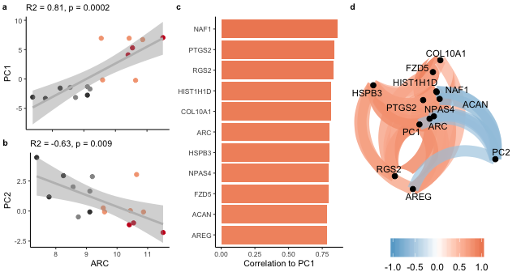

*Click the button to launch a Binder R session. Navigate to the
`scripts` directory and open any `.Rmd` file.*

# IntegrativeProjectWT2015

This repo contains the experiment that I like to call "IntegrativeProjectWT2015" because it is an **integrative** analysis of behavior, electrophysiology, and RNA-seq data collected from **wild type** mice in **2015**. 

## Bioinformatics Workflow

This project is organized into five main subdirectories: 
- [`scripts`](scripts): contains all the `knitr`-based R workflows for statistical analyses and data visualization (source code is in the `.Rmd` files, and `.md` files are used to visualize the code and the results
- [`UNIXworkflow`](UNIXworkflow): contains and explanation and all the UNIX commands used to process the raw sequencing data on the Stampede cluster at the Texas Advanced Computing Facility
- [`figures`](figures): all the figures created from the scripts 
- [`data`](data): all the input data and the results
- [`docs`](docs): presentations generated using R 

This workflow below describes the order in which scripts are used to process and analyze behavioral data (part 1), RNA-seq data (part 2), electrophysiology data (part 3). Finally, the last step (part 4) was to integrate across all three levels of analysis. 

- **Part 1: Behavioral analysis**	
  - [scripts/00_behavior_wrangle](scripts/00_behavior_wrangle.md): behavior data wrangling,
	- [scripts/01a_behavior_analysis](scripts/01a_behavior_analysis.md): behavior statistics and data visualization
- **Part 2: RNA sequencing analysis**
  - **UNIX-based**
	  - [UNIXworkflow/00_rawdata](UNIXworkflow/00_rawdata.md): Download the data to scratch on Stampede with `00_gsaf_download.sh`. 
	  - [UNIXworkflow/01_fastqc](UNIXworkflow/01_fastqc.md): Evaluate the quality of the reads using the program FastQC.
	  - [UNIXworkflow/02_filtrimreads](UNIXworkflow/02_filtrimreads.md): Filter low quality reads and trim adapters using the program cutadapt.
  	- [UNIXworkflow/03_fastqc](UNIXworkflow/03_fastqc.md): Evaluate the quality of the processed reads
	  - [UNIXworkflow04_kallisto](UNIXworkflow04_kallisto.md): Quantify transcript-level expression using Kallisto
  - **R-based**
	  - [scripts/00_kallistoCounts](scripts/00_kallistoCounts.md): converting the kallisto transcript counts to gene counts 
	  - [scripts/02a_rnaseq_makedfs](scripts/02a_rnaseq_makedfs.md): wrangling the categorical data about the samples and the count data
	  - [scripts/02b_rnaseqQC](scripts/02b_rnaseqALL.md): analyzing all the RNA-seq data together
	  - [scripts/02c_rnaseqSubfield](scripts/02c_rnaseqSubfield.md): analyzing the data for each hippocampal subfield separately
	  - [scripts/02d_correlations.Rmd](scripts/02d_correlations.md): correlations between genes and beahvior
	  - [scripts/02e_GO](scripts/02e_GO.md_) an analysis of gene ontology. 
	  
	  
## Figures and Tables

### Figure 1

### Supplementary Figure 1

### Figure 2

### Figure 3

### Figure 4

### Data

This directory contains both raw and intermediate data files. 
- Intermediate data files have alphanumeric prefixes that correspond to the R script that created them. 
- Raw files have only numeric prefix (aka lack an alphabetical character) that indicates whether it is for behavior (01), RNA-seq (02), or ephys (03). 
- Files with more descriptive names were created for public repositories
