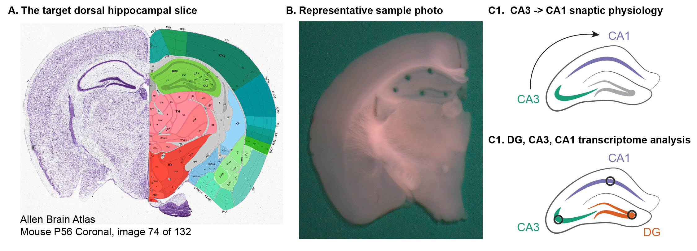
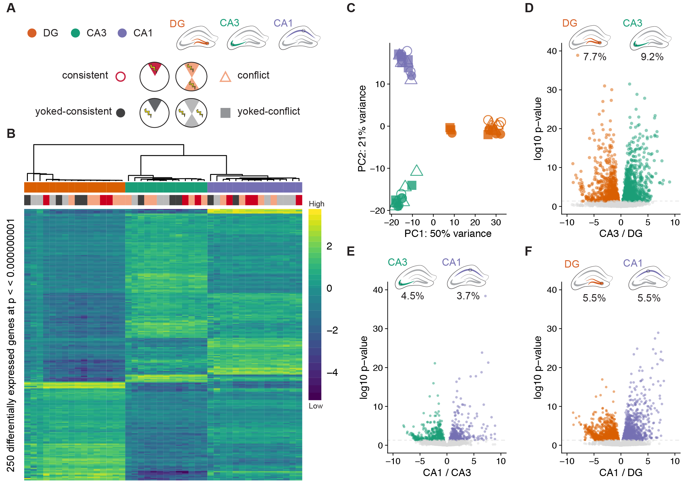
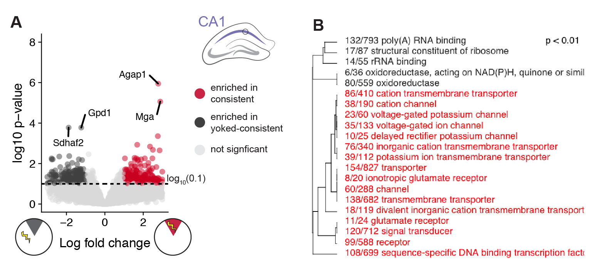
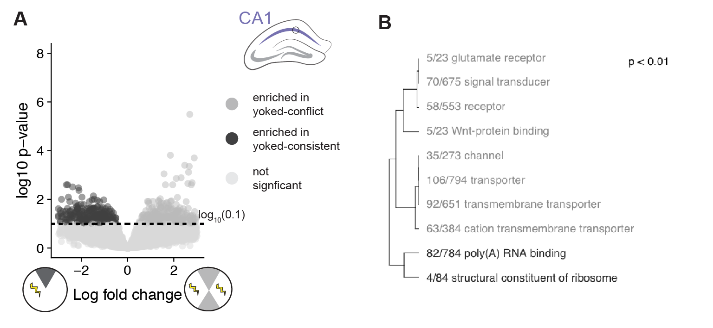

*Click the button to launch a Binder R session. Navigate to the
`scripts` directory and open any `.Rmd` file.*

# IntegrativeProjectWT2015

This repo contains the experiment that I like to call "IntegrativeProjectWT2015" because it is an **integrative** analysis of behavior, electrophysiology, and RNA-seq data collected from **wild type** mice in **2015**. 

## Organization

Three are four main directories for the scripts, UNIX workflow, figures, and data. All .Rmd and related .md files are in the scripts directory. All .md files descripting the UNIX workflow are in the UNIXworkflow directory. 

The file names were chosen to indicated their order of execution in the workflow and provide a brief description of the contents.

### Workflow

This workflow below describes the order in which scripts are used to anlayze data. Below, I have linked the correspond markdown file. For source code, replace `.md` with `.Rmd` in the hyperlink. 

- Part 1: Behavior	
	- [scripts/01a_behavior_analysis](scripts/01a_behavior_analysis.md): behavior data wrangling, statistics, and data visualization
- Part 2.1: UNIX for RNA-seq
	-  UNIX workflow 
Initial processing of RNA sequencing was performed on the Stampede cluster at the Texas Advanced Computing Facility. My workflow for this is described in the 'UNIXworkflow' directory. 
	- [UNIXworkflow/00_rawdata](UNIXworkflow/00_rawdata.md): Download the data to scratch on Stampede with `00_gsaf_download.sh`. 
	- [UNIXworkflow/01_fastqc](UNIXworkflow/01_fastqc.md): Evaluate the quality of the reads using the program FastQC.
	- [UNIXworkflow/02_filtrimreads](UNIXworkflow/02_filtrimreads.md): Filter low quality reads and trim adapters using the program cutadapt.
	- [UNIXworkflow/03_fastqc](UNIXworkflow/03_fastqc.md): Evaluate the quality of the processed reads
	- [UNIXworkflow04_kallisto](UNIXworkflow04_kallisto.md): Quantify transcript-level expression using Kallisto
- Part 2.2: R for RNA-seq
	- [scripts/00_kallistoCounts](scripts/00_kallistoCounts.md): converting the kallisto transcript counts to gene counts 
	- [scripts/02a_rnaseq_makedfs](scripts/02a_rnaseq_makedfs.md): wrangling the categorical data about the samples and the count data
	- [scripts/02b_rnaseqALL](scripts/02b_rnaseqALL.md): analyzing all the RNA-seq data together
	- [scripts/02c_rnaseqSubfield](scripts/02c_rnaseqSubfield.md): analyzing the data for each hippocampal subfield separately
	- [scripts/02d_rnaseqAvoidance](scripts/02d_rnaseqAvoidance.md): combining the two yoked group and the two training groups before analyzing and then analyzing each subfield separately
	- [scripts/02e_GO_MWU](scripts/02e_GO_MWU/GO_MWU.md_)** an analysis of gene ontology. Note: this directory contains scripts and data
- Part 3: Electrophysiology
	- [scripts/03_ephys](scripts/03_ephys.md): analysis of electrophysiology data	
- Part 4: Integrative analysis
	- [scripts/04_integration](scripts/04_integration.md): correlations across levels, mostly using PCA data
	
### Approach

Here is a graphical overview of the experimental design

A) Mice were assigned to one of four groups: consistently-trained (red, n=8), yoked-consistent (dark grey, n=8), conflict-trained (peach, n=9), or yoked-conflict (light grey, n=9). Mice were placed on the rotating arena (1 rpm) for training sessions that lasted 10 min and was separated by 2-hour intersession interval or overnight (~17 hrs). Behavior was recorded during the Pre-training, Training (T1-T6), Retest, and Retention session. In the active place avoidance schematics, the shaded pie-shaped region is the behaviorally relevant region used for counting the number of entrances into the shock zone. The shocking of yoked mice is not spatially limited to the dark-grey pie-shaped zone, but consistent and conflict trained mice only receive shocks in the red and peach-shaded regions, respectively. B) A representative photo shows the size and location of tissue samples collected for RNA-sequencing.  C) Graphical illustration of hippocampal tissues sequenced and sample sizes for each treatment group and hippocampal subfield.

#### Results

1. Cognitive training induces avoidance behavior in conflict and consistently trained animals. 

A) Consistently trained (red lines) mice make fewer entrances into the shock zone than yoked-mice (dark grey lines) on all training (T1-T6), restest, and retention (Reten.) sessions but not during the pre-training session (Pre.). Conflict-trained mice (peach) and their yoked controls (light grey) show a similar pattern except for that mean number of differences between T1 and T4 do not differ between conflict-trained mice. B) Time to second shock zone entrance shows a pattern that is reciprocal to the mean number of entrances. C) A principal component analysis estimates that cognitive training explains 36% of the observed variation in behavior (red and peach versus dark grey and light grey). Among the top five contributing 

1. RNA sequencing confirms large differences in DG, CA3, and CA1 hippocampal subfields  

A) I compared gene expression in three hippocampal subfields from our four treatment groups (DG: orange, CA3: green, CA1: purple, yoked-consistent: filled circle, consistent: open square, yoked-conflict: filled square, conflict: open square). B) Hierarchical clustering of differentially expressed genes shows variation between subfields is much greater than variation induced by treatment. C) A principal component analysis estimates that over 50 % of the variation is capture in PC1 and P3, which visually separate the three hippocampal subfields. D) 3000 are differentially expressed in a symmetric pattern between DG and CA. E, F) Fewer genes are up-regulated in CA1 compared to both DG and CA3, but the magnitude of expression differences in greater between DG-CA1 than between CA3-CA1. For volcano plots, dots are partially transparent to aid visualization of density.

1. Table 1: Numbers of differentially expressed genes by two-way contrast when all data is included in the normalization and quantificaiton. 

| contrast | up | down | total |
| --- | --- | --- | --- |
CA3	vs. DG | 1625 | 1361 | 2986
CA1	vs. DG | 968 | 956 | 1924
CA1	vs. CA3 | 651 | 791 | 1442
consistent vs.	yoked consistent | 113 | 7 | 120
yoked conflict vs. yoked consistent | 30 | 1 | 31
conflict vs. yoked conflict | 15 | 24 | 39
conflict vs. consistent | 0 | 0 | 0

1. Place avoidance is associated with up-regulation genes involved in regulation of transcription.  

A) In the dentate gyrus (DG) 116 genes are upregulated in the consistently training group compared to the yoked samples (FDR = 0.1). An analysis of enrichment in gene ontology categories shows an enrichment in molecular function processes related to promoter binding and nuclear sequence binding (p < 0.05).  B) Genes and GO categories are colored according to enrichment in trained (red) or yoked (black). The active place avoidance schematics, the shaded pie-shaped region is the behaviorally relevant region for counting a number of entrances into the shock zone. Trained (red) mice are shocked in this zone, but the shocking of yoked mice is not spatially limited to the dark-grey pie-shaped zone.

1. Place avoidance is associated with increased expression of genes that regulate synaptic activity in CA1   

A) In the CA1, 253 genes are upregulated in the consistently training group while only 255 are downregulated (FDR = 0.1). B) An analysis of enrichment in gene ontology (GO) categories shows an enrichment in molecular function processes related to ion channel transport and activity (p < 0.05). Genes and GO categories are colored according to enrichment in trained (red) or yoked (black)  

1.  Additional punishment also influences gene expression in CA1  

A) In the CA1, 409 genes are differentially expressed in between yoked groups that received different amounts of punishment.  (FDR = 0.1). B) An analysis of enrichment in gene ontology (GO) categories shows an enrichment in molecular function processes related to ion channel transport and synaptic activity (p < 0.05). Genes and GO categories are colored according to enrichment in yoked-conflict (light grey) or yoked-consistent (dark-grey).  

### Data

This directory contains both raw and intermediate data files. 
- Intermediate data files have alphanumeric prefixes that correspond to the R script that created them. 
- Raw files have only numeric prefix (aka lack an alphabetical character) that indicates whether it is for behavior (01), RNA-seq (02), or ephys (03). 
- Files with more general names were created for public repositories
