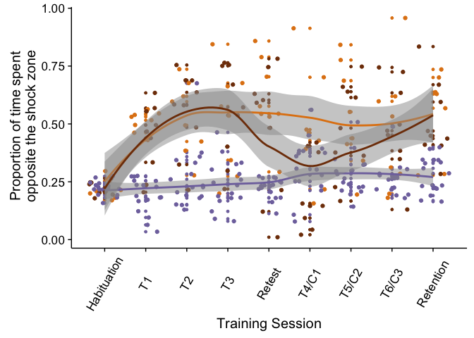
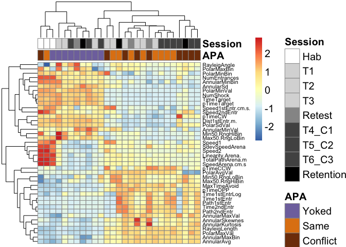

This repo contains the experiment that I like to call "Integrative Wild Type 2015" because it reflect that behavior, electrophysiology, and RNAseq data were collected from WT mice in 2015 and analyzed in an integrative fashion. The title of the paper is: 

The R markdown files to reproducible run the code are saved in [the  RmdFiles subdirectory](./RmdFiles). Rather than have a single Rmd file for the entire project, the workflow is broken down into pieces. The workflows to recreated the figures are specified by the figure name. 

- Figure 1
- Figure 2
- Figure 3

Individual figures were combined into one panel using Adobe Illustrator. The workflows to reproduce the tidy data are outlined in separate files for behavior, physiology, and gene expression. 

- Behavior Data Tidying
- Transcript quantification with Kallisto
- Differential gene expression quantification with DESeq2 

### Talk figures

In a talk for the eisen lab, I presented some slide with the following figures:

 avoid the shock zone")

 avoid the shock zone")
