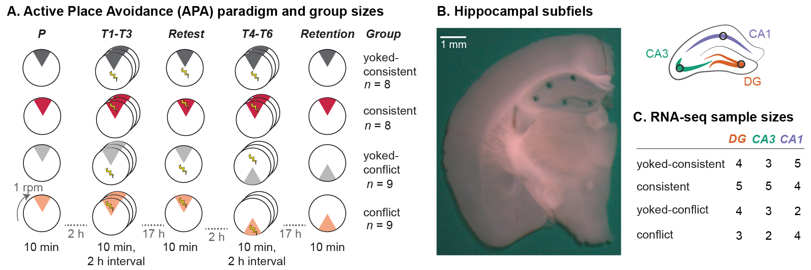
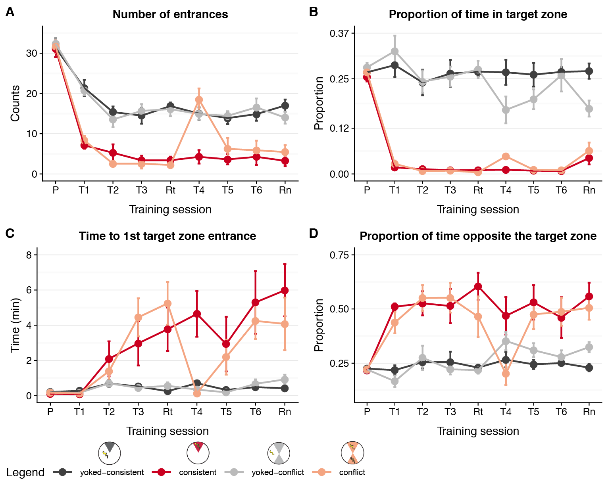
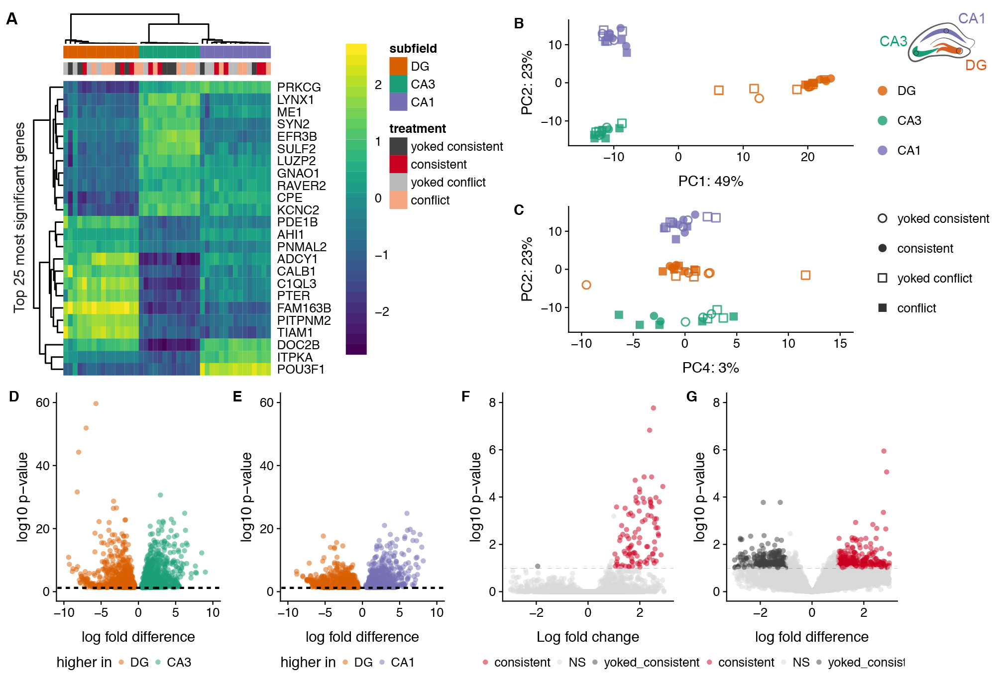
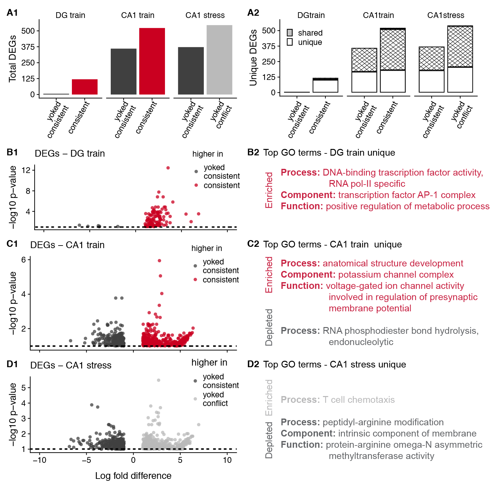
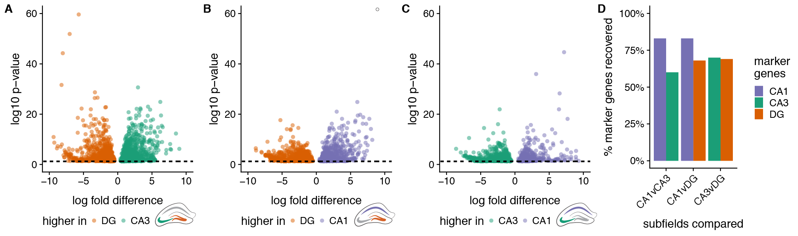

*Click the button to launch a Binder R session. Navigate to the
`scripts` directory and open any `.Rmd` file.*

# IntegrativeProjectWT2015

This repo contains the experiment that I like to call "IntegrativeProjectWT2015" because it is an **integrative** analysis of behavior, electrophysiology, and RNA-seq data collected from **wild type** mice in **2015**. 

### Bioinformatics Workflow

This project is organized into five main subdirectories: 
- [`scripts`](scripts): contains all the `knitr`-based R workflows for statistical analyses and data visualization (source code is in the `.Rmd` files, and `.md` files are used to visualize the code and the results
- [`UNIXworkflow`](UNIXworkflow): contains and explanation and all the UNIX commands used to process the raw sequencing data on the Stampede cluster at the Texas Advanced Computing Facility
- [`figures`](figures): all the figures created from the scripts 
- [`data`](data): all the input data and the results
- [`docs`](docs): presentations generated using R 

This workflow below describes the order in which scripts are used to process and analyze behavioral data (part 1), RNA-seq data (part 2), electrophysiology data (part 3). Finally, the last step (part 4) was to integrate across all three levels of analysis. 

- **Part 1: Behavioral analysis**	
	- [scripts/01a_behavior_analysis](scripts/01a_behavior_analysis.md): behavior data wrangling, statistics, and data visualization
- **Part 2: RNA sequencing analysis**
	- [UNIXworkflow/00_rawdata](UNIXworkflow/00_rawdata.md): Download the data to scratch on Stampede with `00_gsaf_download.sh`. 
	- [UNIXworkflow/01_fastqc](UNIXworkflow/01_fastqc.md): Evaluate the quality of the reads using the program FastQC.
	- [UNIXworkflow/02_filtrimreads](UNIXworkflow/02_filtrimreads.md): Filter low quality reads and trim adapters using the program cutadapt.
	- [UNIXworkflow/03_fastqc](UNIXworkflow/03_fastqc.md): Evaluate the quality of the processed reads
	- [UNIXworkflow04_kallisto](UNIXworkflow04_kallisto.md): Quantify transcript-level expression using Kallisto
	- [scripts/00_kallistoCounts](scripts/00_kallistoCounts.md): converting the kallisto transcript counts to gene counts 
	- [scripts/02a_rnaseq_makedfs](scripts/02a_rnaseq_makedfs.md): wrangling the categorical data about the samples and the count data
	- [scripts/02b_rnaseqALL](scripts/02b_rnaseqALL.md): analyzing all the RNA-seq data together
	- [scripts/02c_rnaseqSubfield](scripts/02c_rnaseqSubfield.md): analyzing the data for each hippocampal subfield separately
	- [scripts/02d_rnaseqAvoidance](scripts/02d_rnaseqAvoidance.md): combining the two yoked group and the two training groups before analyzing and then analyzing each subfield separately
	- [scripts/02e_GO_MWU](scripts/02e_GO_MWU/GO_MWU.md_) an analysis of gene ontology. Note: this directory contains scripts and data
- **Part 3: Electrophysiological analysis**
	- [scripts/03_ephys](scripts/03_ephys.md): analysis of electrophysiology data	
- **Part 4: Integrative analysis**
	- [scripts/04_integration](scripts/04_integration.md): correlations across levels, mostly using PCA data
	
### Figures and Tables

**Fig 1. Experimental Design.** A) Mice were assigned to one of four groups: consistently-trained (red, n=8), yoked-consistent (dark grey, n=8), conflict-trained (peach, n=9), or yoked-conflict (light grey, n=9). Mice were placed on the rotating arena (1 rpm) for training sessions that lasted 10 min and was separated by 2-hour intersession interval or overnight (~17 hrs). Behavior was recorded during the Pre-training, Training (T1-T6), Retest, and Retention session. In the active place avoidance schematics, the shaded pie-shaped region is the behaviorally relevant region used for counting the number of entrances into the shock zone. The shocking of yoked mice is not spatially limited to the dark-grey pie-shaped zone, but consistent and conflict trained mice only receive shocks in the red and peach-shaded regions, respectively. B) A representative photo shows the size and location of tissue samples collected for RNA-sequencing.  C) Graphical illustration of hippocampal tissues sequenced and sample sizes for each treatment group and hippocampal subfield.

**Fig 2. Cognitive training induces avoidance behavior in conflict and consistently trained animals.** A) Consistently trained (red lines) mice make fewer entrances into the shock zone than yoked-mice (dark grey lines) on all training (T1-T6), restest, and retention (Reten.) sessions but not during the pre-training session (Pre.). Conflict-trained mice (peach) and their yoked controls (light grey) show a similar pattern except for that mean number of differences between T1 and T4 do not differ between conflict-trained mice. B) Time to second shock zone entrance shows a pattern that is reciprocal to the mean number of entrances. C) A principal component analysis estimates that cognitive training explains 36% of the observed variation in behavior (red and peach versus dark grey and light grey). Among the top five contributing 

**Fig. 3. 10x more vaiartion across tissues than treatment groups** A) I compared gene expression in three hippocampal subfields from our four treatment groups (DG: orange, CA3: green, CA1: purple, yoked-consistent: filled circle, consistent: open square, yoked-conflict: filled square, conflict: open square). B) Hierarchical clustering of differentially expressed genes shows variation between subfields is much greater than variation induced by treatment. C) A principal component analysis estimates that over 50 % of the variation is capture in PC1 and P3, which visually separate the three hippocampal subfields. D) 3000 are differentially expressed in a symmetric pattern between DG and CA. E, F) Fewer genes are up-regulated in CA1 compared to both DG and CA3, but the magnitude of expression differences in greater between DG-CA1 than between CA3-CA1. For volcano plots, dots are partially transparent to aid visualization of density.

**Fig. 4. Variation in gene expression and GO terms"**

| **Subfield** | **Treatment comparisons** | **Up** | **Down** | **Total** |
|----------|-------------------------------------|-----|------|-------|
| DG | consistent vs. yoked-consistent | 119 | 6 | 125 |
| DG | conflict vs. yoked-conflict | 8 | 2 | 10 |
| DG | conflict vs. consistent | 0 | 1 | 1 |
| DG | yoked-conflict vs. yoked-consistent | 3 | 0 | 3 |
| CA3 | consistent vs. yoked-consistent | 1 | 0 | 1 |
| CA3 | conflict vs. yoked-conflict | 0 | 0 | 0 |
| CA3 | conflict vs. consistent | 0 | 0 | 0 |
| CA3 | yoked-conflict vs. yoked-consistent | 1 | 1 | 2 |
| CA1 | consistent vs. yoked-consistent | 522 | 360 | 882 |
| CA1 | conflict vs. yoked-conflict | 1 | 3 | 0 |
| CA1 | conflict vs. consistent | 0 | 0 | 0 |
| CA1 | yoked-conflict vs. yoked-consistent | 545 | 372 | 917 |

**Table 1: Numbers of differentially expressed genes by two-way contrast when all data is included in the normalization and quantificaiton (adjusted p-value < 0.1).** Consistent training increases expression of over 100 genes in the DG relative to yoked controls, but conflict training and increased punishment have almost no effect on gene expression in the DG. In the CA3, there only 3 genes changes expression in all pair-wise comparisons. In the CA1, both consistent training and additional punishment (yoked comparison) alter the expression of nearly 1000 genes.  

**Figure about Ephys**

**Figure with top marker genes**

### Data

This directory contains both raw and intermediate data files. 
- Intermediate data files have alphanumeric prefixes that correspond to the R script that created them. 
- Raw files have only numeric prefix (aka lack an alphabetical character) that indicates whether it is for behavior (01), RNA-seq (02), or ephys (03). 
- Files with more descriptive names were created for public repositories
