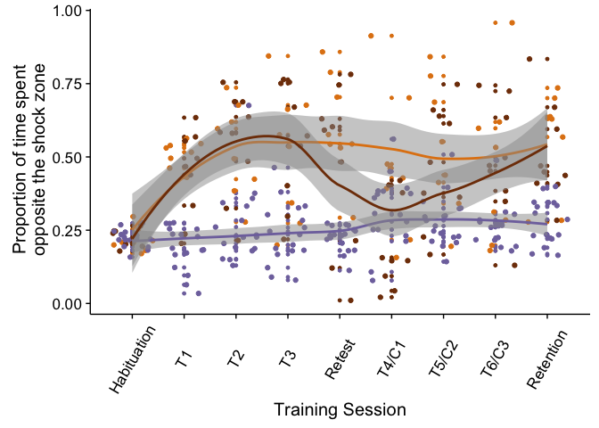
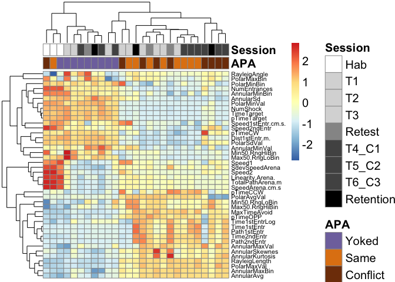

This repo contains the experiment for one chapter of my thesis, which will be published as one research publication.
- data: contains all the relevant data 
- bin: contains the R scripts, functions, and R markdown files are in bin.
- bin/figures: contains the Rmd output .png files

The R markdown file to reproducible run the code [is here](./bin/01_behavior.Rmd). View the resulting [markdown file here](./bin/01_behavior.md). 

In a talk for the eisen lab, I presented some slide with the following figures:

### Spatially trained mice (orange & browns boxes) avoid the shock zone

 avoid the shock zone")

