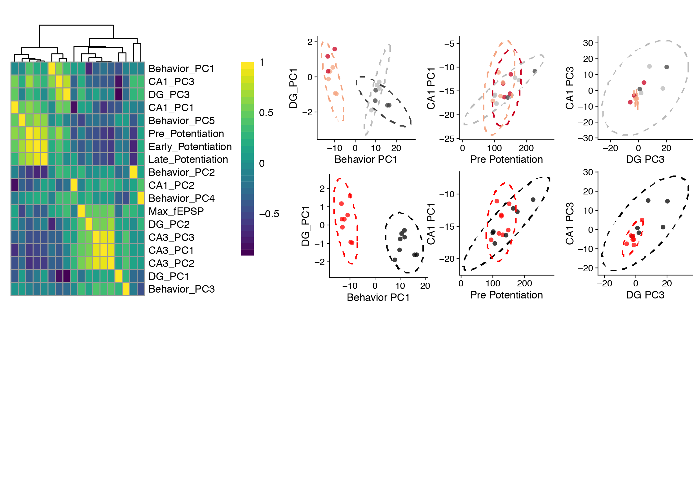
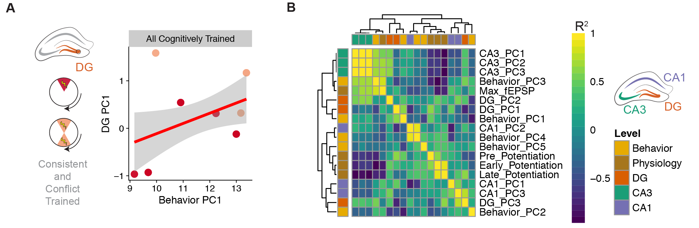

# IntegrativeProjectWT2015

This repo contains the experiment that I like to call "IntegrativeProjectWT2015" because it is an **integrative** analysis of behavior, electrophysiology, and RNA-seq data collected from **wild type** mice in **2015**. 

## Organization

Three are three main directories for the scripts, figures, and data. The file names were chosen to indicated their order of execution in the workflow and provide a brief description.

### scripts
The R markdown files used reproducible run the analysis and the output md files are saved here. 

- Overview
	- **00_methods:** a description of the behavior, electrophysiology, and RNA-seq methods 
- Part 1: Behavior	
	- **01a_behavior_create_dfs:** wrangling the behavior data
	- **01b_behavior_figures:** statistical analysis and behavior data visualization
- Part 2: RNA-seq
	- **02a_rnaseq_makedfs:** converting the Kallisto transcript counts to gene counts and wrangling the categorical data about the samples
	- **02b_rnaseqALL:** analyzing all the RNA-seq data together
	- **02c_rnaseqSubfield:** analyzing the data for each hippocampal subfield separately
	- **02d_rnaseqAvoidance:** combining the two yoked group and the two training groups before analyzing and then analyzing each subfield separately
	- **02e_GO_MWU** an analysis of gene ontology. Note: this directory contains scripts and data
- Part 3: Electrophysiology
	- **03_ephys:** analysis of electrophysiology data	
- Part 4: Integrative analysis
	- **04_integration:** correlations across levels, mostly using PCA data

## Results

### Quick view of the overall results from 02b_rnaseqALL

| Contrast | up | down | total |
| --- | --- | --- | --- |
CA3	DG | 1625 | 1361 | 2986
CA1	DG | 968 | 956 | 1924
CA1	CA3 | 651 | 791 | 1442
consistent	yoked consistent | 113 | 7 | 120
yoked conflict	yoked consistent | 30 | 1 | 31
conflict yoked conflict | 15 | 24 | 39
conflict consistent | 0 | 0 | 0

### Figure 1: Experimental overview 

### Figure 2: Cognitive training induces avoidance behavior in conflict and consisently trained animals

### Figure 3: RNA sequencing confirms large differences in DG, CA3, and CA1 hippocampal subfields  

### Figure 4: Cognitive training alters gene expression in DG and CA1 but not CA3

### Figure 5: Training has little effect on electrophysiology

### Figure 6: Correlations across levels of biological organization

## Data

This directory contains both raw and intermediate data files. 
- Intermediate data files have alphanumeric prefixes that correspond to the R script that created them. 
- Raw files have a numeric prefix (aka lack an alphabetical character) that indicates whether it is for behavior, ephys, or RNAseq. 
- Files with more genearl names were created for NCBI or another public repository