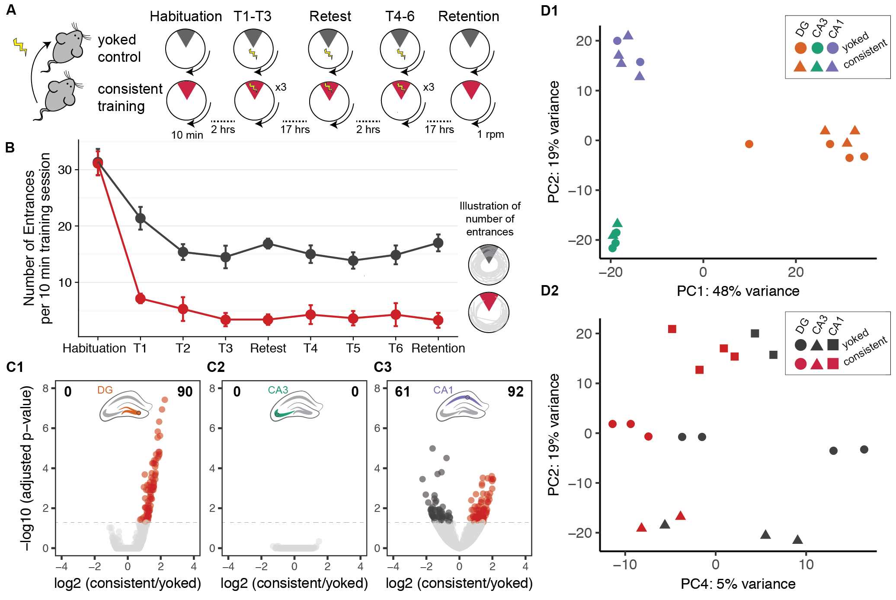
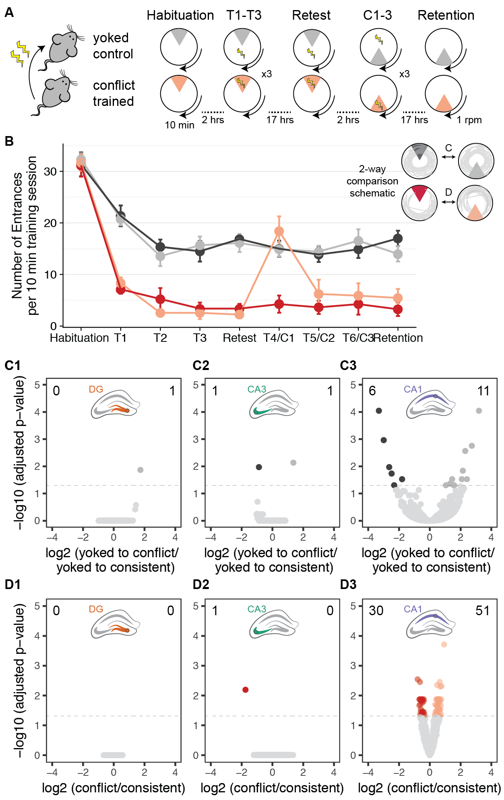

This repo contains the experiment that I like to call "Integrative Wild Type 2015" because it reflect that behavior, electrophysiology, and RNAseq data were collected from WT mice in 2015 and analyzed in an integrative fashion. The R markdown files to reproducible run the code are saved in the  RmdFiles subdirectory. Rather than have a single Rmd file for the entire project, the workflow is broken down into pieces. The workflows to recreated the figures are specified by the figure name. All the files are ordered from 00 to 04 to indicate the order of execution.

## Figure 1: Effect of consistent training on behavior and subfield-specific hippocampal gene expression

## Figure 2: Differences between consistently training and conflict trained and yoked animals in  behavior and subfield-specific hippocampal gene expression

