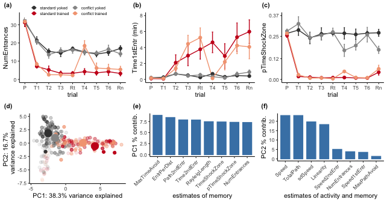

*Click the button to launch a Binder R session. Navigate to the
`scripts` directory and open any `.Rmd` file.*

IntegrativeProjectWT2015
========================

This repo contains the experiment that I like to call
“IntegrativeProjectWT2015” because it is an **integrative** analysis of
behavior, electrophysiology, and RNA-seq data collected from **wild
type** mice in **2015**.

Bioinformatics Workflow
-----------------------

This project is organized into five main subdirectories: -
[`scripts`](scripts): contains all the `knitr`-based R workflows for
statistical analyses and data visualization (source code is in the
`.Rmd` files, and `.md` files are used to visualize the code and the
results - [`UNIXworkflow`](UNIXworkflow): contains and explanation and
all the UNIX commands used to process the raw sequencing data on the
Stampede cluster at the Texas Advanced Computing Facility -
[`figures`](figures): all the figures created from the scripts -
[`data`](data): all the input data and the results - [`docs`](docs):
presentations generated using R

-   **Part 1: Behavioral analysis**
    -   [scripts/00\_behavior\_wrangle](scripts/00_behavior_wrangle.md):
        behavior data wrangling
    -   [scripts/01\_behavior\_analysis](scripts/01_behavior_analysis.md):
        behavior statistics and data visualization
-   **Part 2: RNA sequencing analysis**
    -   **UNIX-based**
        -   [UNIXworkflow/00\_rawdata](UNIXworkflow/00_rawdata.md):
            Download the data to scratch on Stampede with
            `00_gsaf_download.sh`.
        -   [UNIXworkflow/01\_fastqc](UNIXworkflow/01_fastqc.md):
            Evaluate the quality of the reads using the program FastQC.
        -   [UNIXworkflow/02\_filtrimreads](UNIXworkflow/02_filtrimreads.md):
            Filter low quality reads and trim adapters using the program
            cutadapt.
        -   [UNIXworkflow/03\_fastqc](UNIXworkflow/03_fastqc.md):
            Evaluate the quality of the processed reads
        -   [UNIXworkflow04\_kallisto](UNIXworkflow04_kallisto.md):
            Quantify transcript-level expression using Kallisto
    -   **R-based**
        -   [scripts/00\_rnaseq\_wrangle](scripts/00_rnaseq_wrangle.md):
            converting the kallisto transcript counts to gene counts
        -   [scripts/02\_rnaseqQC](scripts/02_rnaseqQC.md): analyzing
            all the RNA-seq data together
        -   [scripts/03\_rnaseqSubfield](scripts/03_rnaseqSubfield.md):
            analyzing the data for each hippocampal subfield separately
        -   [scripts/04\_correlations.Rmd](scripts/04_correlations.md):
            correlations between genes and beahvior
        -   [scripts/05\_GO](scripts/05_GO.md) an analysis of gene
            ontology.
        -   [scripts/06\_candidates](scripts/05_candidates.md) an
            analysis of candidate memory genes.

Figures and Tables
------------------

### Figure 1: Experimental Design

### Supplementary Figure 1: RNA-seq Quality Control

### Figure 2: Avoidance Behavior

### Table 1: Avoidance Behavior Statistics

<table>
<thead>
<tr>
<th style="text-align:left;">
trials
</th>
<th style="text-align:left;">
ANOVA
</th>
<th style="text-align:left;">
Predictor
</th>
<th style="text-align:left;">
df
</th>
<th style="text-align:right;">
F
</th>
<th style="text-align:right;">
p
</th>
<th style="text-align:left;">
sig
</th>
</tr>
</thead>
<tbody>
<tr>
<td style="text-align:left;">
Pre-training (Pre)
</td>
<td style="text-align:left;">
NumEntrances ~ treatment
</td>
<td style="text-align:left;">
treatment
</td>
<td style="text-align:left;">
3, 30
</td>
<td style="text-align:right;">
0.09
</td>
<td style="text-align:right;">
0.967
</td>
<td style="text-align:left;">
</td>
</tr>
<tr>
<td style="text-align:left;">
Pre-training (Pre)
</td>
<td style="text-align:left;">
pTimeShockZone ~ treatment
</td>
<td style="text-align:left;">
treatment
</td>
<td style="text-align:left;">
3, 30
</td>
<td style="text-align:right;">
0.78
</td>
<td style="text-align:right;">
0.512
</td>
<td style="text-align:left;">
</td>
</tr>
<tr>
<td style="text-align:left;">
Pre-training (Pre)
</td>
<td style="text-align:left;">
Time1stEntr ~ treatment
</td>
<td style="text-align:left;">
treatment
</td>
<td style="text-align:left;">
3, 30
</td>
<td style="text-align:right;">
0.80
</td>
<td style="text-align:right;">
0.506
</td>
<td style="text-align:left;">
</td>
</tr>
<tr>
<td style="text-align:left;">
Initial training (T1 - T3)
</td>
<td style="text-align:left;">
NumEntrances ~ treatment \* trial
</td>
<td style="text-align:left;">
treatment
</td>
<td style="text-align:left;">
3, 90
</td>
<td style="text-align:right;">
26.42
</td>
<td style="text-align:right;">
0.000
</td>
<td style="text-align:left;">
\*\*\*
</td>
</tr>
<tr>
<td style="text-align:left;">
Initial training (T1 - T3)
</td>
<td style="text-align:left;">
NumEntrances ~ treatment \* trial
</td>
<td style="text-align:left;">
trial
</td>
<td style="text-align:left;">
2, 90
</td>
<td style="text-align:right;">
5.88
</td>
<td style="text-align:right;">
0.004
</td>
<td style="text-align:left;">
\*\*
</td>
</tr>
<tr>
<td style="text-align:left;">
Initial training (T1 - T3)
</td>
<td style="text-align:left;">
NumEntrances ~ treatment \* trial
</td>
<td style="text-align:left;">
treatment x trial
</td>
<td style="text-align:left;">
6, 90
</td>
<td style="text-align:right;">
0.72
</td>
<td style="text-align:right;">
0.631
</td>
<td style="text-align:left;">
</td>
</tr>
<tr>
<td style="text-align:left;">
Initial training (T1 - T3)
</td>
<td style="text-align:left;">
pTimeShockZone ~ treatment \* trial
</td>
<td style="text-align:left;">
treatment
</td>
<td style="text-align:left;">
3, 90
</td>
<td style="text-align:right;">
48.26
</td>
<td style="text-align:right;">
0.000
</td>
<td style="text-align:left;">
\*\*\*
</td>
</tr>
<tr>
<td style="text-align:left;">
Initial training (T1 - T3)
</td>
<td style="text-align:left;">
pTimeShockZone ~ treatment \* trial
</td>
<td style="text-align:left;">
trial
</td>
<td style="text-align:left;">
2, 90
</td>
<td style="text-align:right;">
0.88
</td>
<td style="text-align:right;">
0.419
</td>
<td style="text-align:left;">
</td>
</tr>
<tr>
<td style="text-align:left;">
Initial training (T1 - T3)
</td>
<td style="text-align:left;">
pTimeShockZone ~ treatment \* trial
</td>
<td style="text-align:left;">
treatment x trial
</td>
<td style="text-align:left;">
6, 90
</td>
<td style="text-align:right;">
0.59
</td>
<td style="text-align:right;">
0.736
</td>
<td style="text-align:left;">
</td>
</tr>
<tr>
<td style="text-align:left;">
Initial training (T1 - T3)
</td>
<td style="text-align:left;">
Time1stEntr ~ treatment \* trial
</td>
<td style="text-align:left;">
treatment
</td>
<td style="text-align:left;">
3, 90
</td>
<td style="text-align:right;">
0.02
</td>
<td style="text-align:right;">
0.997
</td>
<td style="text-align:left;">
</td>
</tr>
<tr>
<td style="text-align:left;">
Initial training (T1 - T3)
</td>
<td style="text-align:left;">
Time1stEntr ~ treatment \* trial
</td>
<td style="text-align:left;">
trial
</td>
<td style="text-align:left;">
2, 90
</td>
<td style="text-align:right;">
0.11
</td>
<td style="text-align:right;">
0.895
</td>
<td style="text-align:left;">
</td>
</tr>
<tr>
<td style="text-align:left;">
Initial training (T1 - T3)
</td>
<td style="text-align:left;">
Time1stEntr ~ treatment \* trial
</td>
<td style="text-align:left;">
treatment x trial
</td>
<td style="text-align:left;">
6, 90
</td>
<td style="text-align:right;">
3.24
</td>
<td style="text-align:right;">
0.006
</td>
<td style="text-align:left;">
\*\*
</td>
</tr>
<tr>
<td style="text-align:left;">
Initial recall (Rt)
</td>
<td style="text-align:left;">
NumEntrances ~ treatment
</td>
<td style="text-align:left;">
treatment
</td>
<td style="text-align:left;">
3, 30
</td>
<td style="text-align:right;">
45.44
</td>
<td style="text-align:right;">
0.000
</td>
<td style="text-align:left;">
\*\*\*
</td>
</tr>
<tr>
<td style="text-align:left;">
Initial recall (Rt)
</td>
<td style="text-align:left;">
pTimeShockZone ~ treatment
</td>
<td style="text-align:left;">
treatment
</td>
<td style="text-align:left;">
3, 30
</td>
<td style="text-align:right;">
129.49
</td>
<td style="text-align:right;">
0.000
</td>
<td style="text-align:left;">
\*\*\*
</td>
</tr>
<tr>
<td style="text-align:left;">
Initial recall (Rt)
</td>
<td style="text-align:left;">
Time1stEntr ~ treatment
</td>
<td style="text-align:left;">
treatment
</td>
<td style="text-align:left;">
3, 30
</td>
<td style="text-align:right;">
7.96
</td>
<td style="text-align:right;">
0.000
</td>
<td style="text-align:left;">
\*\*\*
</td>
</tr>
<tr>
<td style="text-align:left;">
Conflict training (T4 - T6)
</td>
<td style="text-align:left;">
NumEntrances ~ treatment \* trial
</td>
<td style="text-align:left;">
treatment
</td>
<td style="text-align:left;">
3, 90
</td>
<td style="text-align:right;">
9.37
</td>
<td style="text-align:right;">
0.000
</td>
<td style="text-align:left;">
\*\*\*
</td>
</tr>
<tr>
<td style="text-align:left;">
Conflict training (T4 - T6)
</td>
<td style="text-align:left;">
NumEntrances ~ treatment \* trial
</td>
<td style="text-align:left;">
trial
</td>
<td style="text-align:left;">
2, 90
</td>
<td style="text-align:right;">
0.09
</td>
<td style="text-align:right;">
0.913
</td>
<td style="text-align:left;">
</td>
</tr>
<tr>
<td style="text-align:left;">
Conflict training (T4 - T6)
</td>
<td style="text-align:left;">
NumEntrances ~ treatment \* trial
</td>
<td style="text-align:left;">
treatment x trial
</td>
<td style="text-align:left;">
6, 90
</td>
<td style="text-align:right;">
3.43
</td>
<td style="text-align:right;">
0.004
</td>
<td style="text-align:left;">
\*\*
</td>
</tr>
<tr>
<td style="text-align:left;">
Conflict training (T4 - T6)
</td>
<td style="text-align:left;">
pTimeShockZone ~ treatment \* trial
</td>
<td style="text-align:left;">
treatment
</td>
<td style="text-align:left;">
3, 90
</td>
<td style="text-align:right;">
25.26
</td>
<td style="text-align:right;">
0.000
</td>
<td style="text-align:left;">
\*\*\*
</td>
</tr>
<tr>
<td style="text-align:left;">
Conflict training (T4 - T6)
</td>
<td style="text-align:left;">
pTimeShockZone ~ treatment \* trial
</td>
<td style="text-align:left;">
trial
</td>
<td style="text-align:left;">
2, 90
</td>
<td style="text-align:right;">
0.03
</td>
<td style="text-align:right;">
0.972
</td>
<td style="text-align:left;">
</td>
</tr>
<tr>
<td style="text-align:left;">
Conflict training (T4 - T6)
</td>
<td style="text-align:left;">
pTimeShockZone ~ treatment \* trial
</td>
<td style="text-align:left;">
treatment x trial
</td>
<td style="text-align:left;">
6, 90
</td>
<td style="text-align:right;">
1.54
</td>
<td style="text-align:right;">
0.174
</td>
<td style="text-align:left;">
</td>
</tr>
<tr>
<td style="text-align:left;">
Conflict training (T4 - T6)
</td>
<td style="text-align:left;">
Time1stEntr ~ treatment \* trial
</td>
<td style="text-align:left;">
treatment
</td>
<td style="text-align:left;">
3, 90
</td>
<td style="text-align:right;">
6.03
</td>
<td style="text-align:right;">
0.001
</td>
<td style="text-align:left;">
\*\*
</td>
</tr>
<tr>
<td style="text-align:left;">
Conflict training (T4 - T6)
</td>
<td style="text-align:left;">
Time1stEntr ~ treatment \* trial
</td>
<td style="text-align:left;">
trial
</td>
<td style="text-align:left;">
2, 90
</td>
<td style="text-align:right;">
0.05
</td>
<td style="text-align:right;">
0.954
</td>
<td style="text-align:left;">
</td>
</tr>
<tr>
<td style="text-align:left;">
Conflict training (T4 - T6)
</td>
<td style="text-align:left;">
Time1stEntr ~ treatment \* trial
</td>
<td style="text-align:left;">
treatment x trial
</td>
<td style="text-align:left;">
6, 90
</td>
<td style="text-align:right;">
1.74
</td>
<td style="text-align:right;">
0.120
</td>
<td style="text-align:left;">
</td>
</tr>
<tr>
<td style="text-align:left;">
Conflict recall (Rn)
</td>
<td style="text-align:left;">
NumEntrances ~ treatment
</td>
<td style="text-align:left;">
treatment
</td>
<td style="text-align:left;">
3, 30
</td>
<td style="text-align:right;">
18.01
</td>
<td style="text-align:right;">
0.000
</td>
<td style="text-align:left;">
\*\*\*
</td>
</tr>
<tr>
<td style="text-align:left;">
Conflict recall (Rn)
</td>
<td style="text-align:left;">
pTimeShockZone ~ treatment
</td>
<td style="text-align:left;">
treatment
</td>
<td style="text-align:left;">
3, 30
</td>
<td style="text-align:right;">
26.90
</td>
<td style="text-align:right;">
0.000
</td>
<td style="text-align:left;">
\*\*\*
</td>
</tr>
<tr>
<td style="text-align:left;">
Conflict recall (Rn)
</td>
<td style="text-align:left;">
Time1stEntr ~ treatment
</td>
<td style="text-align:left;">
treatment
</td>
<td style="text-align:left;">
3, 30
</td>
<td style="text-align:right;">
5.97
</td>
<td style="text-align:right;">
0.003
</td>
<td style="text-align:left;">
\*\*
</td>
</tr>
<tr>
<td style="text-align:left;">
All trials
</td>
<td style="text-align:left;">
PC1 ~ treatment
</td>
<td style="text-align:left;">
treatment
</td>
<td style="text-align:left;">
3, 302
</td>
<td style="text-align:right;">
91.83
</td>
<td style="text-align:right;">
0.000
</td>
<td style="text-align:left;">
\*\*\*
</td>
</tr>
<tr>
<td style="text-align:left;">
All trails
</td>
<td style="text-align:left;">
PC2 ~ treatment
</td>
<td style="text-align:left;">
treatment
</td>
<td style="text-align:left;">
3, 302
</td>
<td style="text-align:right;">
10.76
</td>
<td style="text-align:right;">
0.000
</td>
<td style="text-align:left;">
\*\*\*
</td>
</tr>
<tr>
<td style="text-align:left;">
Retention (Rn)
</td>
<td style="text-align:left;">
PC1 ~ treatment
</td>
<td style="text-align:left;">
treatment
</td>
<td style="text-align:left;">
3, 30
</td>
<td style="text-align:right;">
15.18
</td>
<td style="text-align:right;">
0.000
</td>
<td style="text-align:left;">
\*\*\*
</td>
</tr>
<tr>
<td style="text-align:left;">
Retention
</td>
<td style="text-align:left;">
PC2 ~ treatment
</td>
<td style="text-align:left;">
treatment
</td>
<td style="text-align:left;">
3, 30
</td>
<td style="text-align:right;">
3.25
</td>
<td style="text-align:right;">
0.035
</td>
<td style="text-align:left;">

-   </td>
    </tr>
    </tbody>
    </table>

### Figure 3: Subfield-specific gene expression

### Table 2: Hypothesis-driven Anlaysis of Gene Ontology of Differential Gene Expression

<table>
<thead>
<tr>
<th style="text-align:left;">
GO.terms
</th>
<th style="text-align:left;">
DG.DEGs
</th>
<th style="text-align:left;">
Candidate.genes
</th>
<th style="text-align:left;">
LTP.genes
</th>
</tr>
</thead>
<tbody>
<tr>
<td style="text-align:left;">
Response to stimulus (<a href="GO:0050896" class="uri">GO:0050896</a>)
</td>
<td style="text-align:left;">
Abhd2 Adrb1 Ahr Ankrd27 Apaf1 Arc Arid5b Arl13b Arpp21 Atf3 B3gnt2 Bach1
BC048403 Bmt2 Btg2 C2cd4b Ccnk Cited2 Fbxw7 Fermt2 Flrt3 Fos Fosb Fosl2
Foxg1 Foxo1 Fzd4 Fzd5 Gadd45g Gnaz Gpi1 Gpr19 Hmgcr Homer1 Hspa1a Hsph1
Il16 Ing2 Irs1 Irs2 Jun Junb Jund Kdm6b Kitl Klf2 Klf6 Klkb1 Lbh Lemd3
Lmna Mc1r Mest Myc Nedd9 Nfil3 Npas4 Nptx2 Nr4a1 Nr4a2 Nr4a3 Ppp1r15a
Slc16a1 Slc25a25 Slitrk5 Smad7 Sox9 Srf Srgap1 Stac2 Syt4 Thbs1 Tiparp
Tnip2 Tra2b Trib1 Tsc22d2 Zbtb33 Zfand5
</td>
<td style="text-align:left;">
Camk2a Fmr1 Gria2 Igf2 Mtor Wwc1
</td>
<td style="text-align:left;">
Adcy1 Adra2a Adra2b Adra2c Adrb1 Adrb2 Adrb3 Cacna1a Cacna1b Cacna1c
Cacna1d Cacna1e Cacna1f Cacna1s Calb1 Calm1 Calm2 Calm3 Camk1 Camk4
Capn1 Capn10 Capn2 Capn3 Ccr7 Cd47 Cdh1 Cdh2 Chrm1 Chrm2 Chrm3 Chrm4
Chrm5 Chrna1 Chrna3 Chrna7 Chrnb1 Chrnb2 Chrnb3 Cnga2 Fgf2 Fyn Gabbr1
Gabra1 Gabra2 Gabra3 Gabra5 Gabra6 Gabrb1 Gabrb2 Gabrb3 Gabrr1 Gap43
Gfap Gria1 Gria2 Grin1 Grin2a Grin2d Grm1 Grm4 Grm5 Grm7 Gucy1a2 Gucy1b2
Gucy2c Gucy2d Gucy2e Gucy2g Homer1 Homer2 Homer3 Htr1a Htr1b Htr1f Htr2a
Htr2b Htr2c Htr3a Htr3b Htr4 Htr5a Htr5b Htr6 Htr7 Il1b Inhba Itga1
Itga10 Itga11 Itga2 Itga2b Itga3 Itga4 Itga5 Itga6 Itga7 Itga8 Itga9
Itgad Itgae Itgal Itgam Itgav Itgax Itgb1 Itgb1bp1 Itgb2 Itgb2l Itgb3
Itgb4 Itgb5 Itgb6 Itgb7 Itgb8 Itgbl1 Itpkb L1cam Mapk1 Mapk11 Mapk12
Mapk14 Mapk3 Mapk4 Mapk6 Mapk7 Mapk8 Mapk9 Mas1 Ncam1 Ngf Nos1 Nos3 Nrg1
Nrg2 Nrg3 Nrgn Pnoc Sptbn1 Src Stx1b Syp Th Thy1 Tnc Ube3a Vamp2 Vamp3
Vamp4 Vamp8
</td>
</tr>
<tr>
<td style="text-align:left;">
Translation (<a href="GO:0006412" class="uri">GO:0006412</a>)
</td>
<td style="text-align:left;">
Cpeb4 Eif5
</td>
<td style="text-align:left;">
Fmr1 Mtor
</td>
<td style="text-align:left;">
NA
</td>
</tr>
<tr>
<td style="text-align:left;">
Synapse organization (<a href="GO:0050808" class="uri">GO:0050808</a>)
</td>
<td style="text-align:left;">
Amigo2 Arc Bdnf Flrt3 Fzd5 Homer1 Lrrtm2 Npas4 Pcdh8 Slitrk5
</td>
<td style="text-align:left;">
Fmr1 Pick1
</td>
<td style="text-align:left;">
Ache Bdnf Cacna1a Cacna1s Camk1 Cdh1 Cdh2 Chrna1 Chrna7 Chrnb1 Chrnb2
Dlg4 Drd1 Efna5 Epha5 Erbb4 Fyn Gabra1 Gabrb2 Gabrb3 Gap43 Grin1 Grin2a
Grm5 Homer1 Htr1a Itga3 Itgam Itpka L1cam Mapk14 Nrg1 Nrg2 Ntrk2 Ptn
Rab3a Syn1 Tnc Ube3a
</td>
</tr>
<tr>
<td style="text-align:left;">
Learning or memory (<a href="GO:0007611" class="uri">GO:0007611</a>)
</td>
<td style="text-align:left;">
Adrb1 Arc Bdnf Btg2 Egr1 Hmgcr Jun Npas4 Nptx2 Pak6 Plk2 Ptgs2 Sgk1 Srf
Syt4
</td>
<td style="text-align:left;">
Igf2 Mtor Prkcz
</td>
<td style="text-align:left;">
Adcy1 Adrb1 Adrb2 Bdnf Cacna1c Cacna1e Calb1 Camk4 Chrna7 Chrnb2 Cnr1
Creb1 Drd1 Egr1 Gabra5 Gria1 Grin1 Grin2a Grm4 Grm5 Grm7 Htr2a Htr6 Htr7
Il1b Itga3 Itga5 Itga8 Itgb1 Ncam1 Ngf Ntrk2 Oprl1 Pla2g6 Plcb1 Prkar1b
Prkcz Ptn S100b Snap25 Th
</td>
</tr>
</tbody>
</table>

### Figure 4: Top twently genes whose expression in DG is correlations to the principle compenent of behavioral variation in avoidance learning

### Table 3: Data-driven analysis of Gene Ontology related to Behavior

<table>
<thead>
<tr>
<th style="text-align:left;">
Domain
</th>
<th style="text-align:left;">
Functional.Category
</th>
<th style="text-align:left;">
gene
</th>
</tr>
</thead>
<tbody>
<tr>
<td style="text-align:left;">
BP
</td>
<td style="text-align:left;">
Memory
</td>
<td style="text-align:left;">
Arc Bdnf Egr1 Kcnk10 Npas4 Plk2 Ptgs2 Sgk1 Syt4
</td>
</tr>
<tr>
<td style="text-align:left;">
BP
</td>
<td style="text-align:left;">
Learning or memory
</td>
<td style="text-align:left;">
Arc Bdnf Btg2 Egr1 Kcnk10 Npas4 Plk2 Ptgs2 Sgk1 Syt4
</td>
</tr>
<tr>
<td style="text-align:left;">
BP
</td>
<td style="text-align:left;">
Tissue development
</td>
<td style="text-align:left;">
Acan Arc Areg Atf3 Bdnf Btg2 Col10a1 Egr1 Errfi1 Fosl2 Frmd6 Fzd5 Homer1
Hoxc4 Nr4a3 Pcdh8 Ptgs2 Rgs2 Slc25a25 Smad7 Tiparp
</td>
</tr>
<tr>
<td style="text-align:left;">
BP
</td>
<td style="text-align:left;">
Cognition
</td>
<td style="text-align:left;">
Arc Bdnf Btg2 Egr1 Kcnk10 Npas4 Plk2 Ptgs2 Sgk1 Syt4
</td>
</tr>
<tr>
<td style="text-align:left;">
BP
</td>
<td style="text-align:left;">
Behavior
</td>
<td style="text-align:left;">
Arc Bdnf Btg2 Egr1 Homer1 Kcnk10 Npas4 Nr4a3 Plk2 Ptgs2 Sgk1 Slc16a1
Syt4
</td>
</tr>
<tr>
<td style="text-align:left;">
CC
</td>
<td style="text-align:left;">
Neuron projection
</td>
<td style="text-align:left;">
Acan Arc Bdnf Cpeb4 Fzd5 Homer1 Nexn Pcdh8 Plk2 Ptgs2 Rgs2 Sgk1 Syt4
</td>
</tr>
<tr>
<td style="text-align:left;">
CC
</td>
<td style="text-align:left;">
Cell junction
</td>
<td style="text-align:left;">
Arc Cpeb4 Frmd6 Fzd5 Homer1 Nexn Pcdh8 Slc16a1 Smad7 Syt4
</td>
</tr>
<tr>
<td style="text-align:left;">
CC
</td>
<td style="text-align:left;">
Dendrite
</td>
<td style="text-align:left;">
Arc Bdnf Cpeb4 Fzd5 Homer1 Pcdh8 Plk2 Syt4
</td>
</tr>
<tr>
<td style="text-align:left;">
CC
</td>
<td style="text-align:left;">
Dendritic tree
</td>
<td style="text-align:left;">
Arc Bdnf Cpeb4 Fzd5 Homer1 Pcdh8 Plk2 Syt4
</td>
</tr>
<tr>
<td style="text-align:left;">
CC
</td>
<td style="text-align:left;">
Somatodendritic compartment
</td>
<td style="text-align:left;">
Acan Arc Bdnf Cpeb4 Fzd5 Homer1 Pcdh8 Plk2 Syt4
</td>
</tr>
<tr>
<td style="text-align:left;">
MF
</td>
<td style="text-align:left;">
Regulatory region nucleic acid binding
</td>
<td style="text-align:left;">
Atf3 Egr1 Egr4 Fosl2 Hoxc4 Nfil3 Npas4 Nr4a3 Per1 Smad7 Tiparp
</td>
</tr>
<tr>
<td style="text-align:left;">
MF
</td>
<td style="text-align:left;">
Transcription regulatory region DNA binding
</td>
<td style="text-align:left;">
Atf3 Egr1 Egr4 Fosl2 Hoxc4 Nfil3 Npas4 Nr4a3 Per1 Smad7 Tiparp
</td>
</tr>
<tr>
<td style="text-align:left;">
MF
</td>
<td style="text-align:left;">
RNA polymerase II regulatory region sequence-specific DNA binding
</td>
<td style="text-align:left;">
Atf3 Egr1 Egr4 Fosl2 Hoxc4 Nfil3 Npas4 Nr4a3 Per1
</td>
</tr>
<tr>
<td style="text-align:left;">
MF
</td>
<td style="text-align:left;">
DNA-binding transcription factor activity, RNA polymerase II-specific
</td>
<td style="text-align:left;">
Atf3 Btg2 Egr1 Egr4 Fosl2 Hoxc4 Nfil3 Npas4 Nr4a3
</td>
</tr>
<tr>
<td style="text-align:left;">
MF
</td>
<td style="text-align:left;">
RNA polymerase II regulatory region DNA binding
</td>
<td style="text-align:left;">
Atf3 Egr1 Egr4 Fosl2 Hoxc4 Nfil3 Npas4 Nr4a3 Per1
</td>
</tr>
</tbody>
</table>

### Figure 5: Very few candidate memory genes are correlated with behavior or with each other in hippocampal subfields

### Figure 6: Many astrocytic genes are are positively correlated with behavioral principal component 1 or with each other in hippocampal subfields.

### Supplemental Figure 3: More correlations

