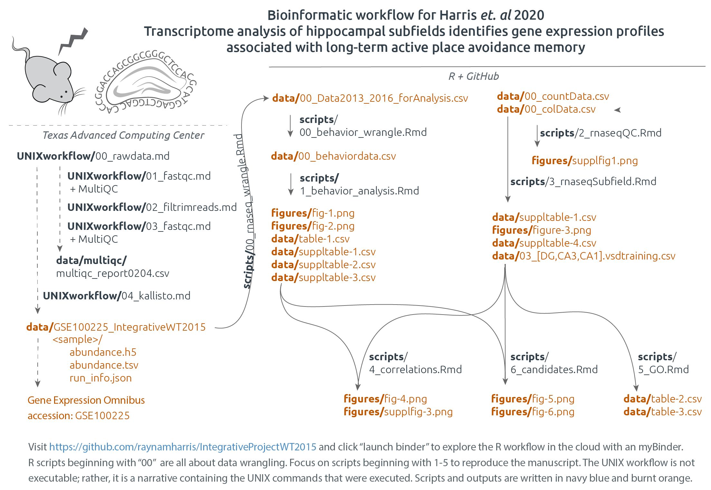
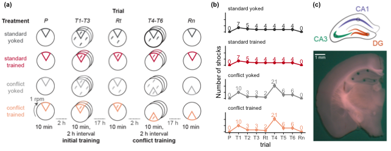

*Click the button to launch a Binder R session. Navigate to the
`scripts` directory and open any `.Rmd` file.*

IntegrativeProjectWT2015
========================

This repo contains the experiment that I like to call
“IntegrativeProjectWT2015” because it is an **integrative** analysis of
behavior, electrophysiology, and RNA-seq data collected from **wild
type** mice in **2015**.

Bioinformatics Workflow
-----------------------

This project is organized into five main subdirectories: -
[`scripts`](scripts): contains all the `knitr`-based R workflows for
statistical analyses and data visualization (source code is in the
`.Rmd` files, and `.md` files are used to visualize the code and the
results - [`UNIXworkflow`](UNIXworkflow): contains and explanation and
all the UNIX commands used to process the raw sequencing data on the
Stampede cluster at the Texas Advanced Computing Facility -
[`figures`](figures): all the figures created from the scripts -
[`data`](data): all the input data and the results - [`docs`](docs):
presentations generated using R

-   **Part 1: Behavioral analysis**
    -   [scripts/00\_behavior\_wrangle](scripts/00_behavior_wrangle.md):
        behavior data wrangling
    -   [scripts/01\_behavior\_analysis](scripts/01_behavior_analysis.md):
        behavior statistics and data visualization
-   **Part 2: RNA sequencing analysis**
    -   **UNIX-based**
        -   [UNIXworkflow/00\_rawdata](UNIXworkflow/00_rawdata.md):
            Download the data to scratch on Stampede with
            `00_gsaf_download.sh`.
        -   [UNIXworkflow/01\_fastqc](UNIXworkflow/01_fastqc.md):
            Evaluate the quality of the reads using the program FastQC.
        -   [UNIXworkflow/02\_filtrimreads](UNIXworkflow/02_filtrimreads.md):
            Filter low quality reads and trim adapters using the program
            cutadapt.
        -   [UNIXworkflow/03\_fastqc](UNIXworkflow/03_fastqc.md):
            Evaluate the quality of the processed reads
        -   [UNIXworkflow04\_kallisto](UNIXworkflow04_kallisto.md):
            Quantify transcript-level expression using Kallisto
    -   **R-based**
        -   [scripts/00\_rnaseq\_wrangle](scripts/00_rnaseq_wrangle.md):
            converting the kallisto transcript counts to gene counts
        -   [scripts/02\_rnaseqQC](scripts/02_rnaseqQC.md): analyzing
            all the RNA-seq data together
        -   [scripts/03\_rnaseqSubfield](scripts/03_rnaseqSubfield.md):
            analyzing the data for each hippocampal subfield separately
        -   [scripts/04\_correlations.Rmd](scripts/04_correlations.md):
            correlations between genes and beahvior
        -   [scripts/05\_GO](scripts/05_GO.md) an analysis of gene
            ontology.

Figures and Tables
------------------

### Figure 1: Experimental Design

### Supplementary Figure 1: RNA-seq Quality Control

### Figure 2: Avoidance Behavior

### Table 1: Avoidance Behavior Statistics

<table>
<thead>
<tr>
<th style="text-align:left;">
trials
</th>
<th style="text-align:left;">
ANOVA
</th>
<th style="text-align:left;">
Predictor
</th>
<th style="text-align:left;">
df
</th>
<th style="text-align:right;">
F
</th>
<th style="text-align:right;">
p
</th>
</tr>
</thead>
<tbody>
<tr>
<td style="text-align:left;">
Pre-training (Pre)
</td>
<td style="text-align:left;">
NumEntrances ~ treatment
</td>
<td style="text-align:left;">
treatment
</td>
<td style="text-align:left;">
3, 30
</td>
<td style="text-align:right;">
0.09
</td>
<td style="text-align:right;">
0.967
</td>
</tr>
<tr>
<td style="text-align:left;">
Pre-training (Pre)
</td>
<td style="text-align:left;">
pTimeShockZone ~ treatment
</td>
<td style="text-align:left;">
treatment
</td>
<td style="text-align:left;">
3, 30
</td>
<td style="text-align:right;">
0.78
</td>
<td style="text-align:right;">
0.512
</td>
</tr>
<tr>
<td style="text-align:left;">
Pre-training (Pre)
</td>
<td style="text-align:left;">
Time1stEntr ~ treatment
</td>
<td style="text-align:left;">
treatment
</td>
<td style="text-align:left;">
3, 30
</td>
<td style="text-align:right;">
0.80
</td>
<td style="text-align:right;">
0.506
</td>
</tr>
<tr>
<td style="text-align:left;">
Initial training (T1 - T3)
</td>
<td style="text-align:left;">
NumEntrances ~ treatment \* trial
</td>
<td style="text-align:left;">
treatment
</td>
<td style="text-align:left;">
3, 90
</td>
<td style="text-align:right;">
26.42
</td>
<td style="text-align:right;">
0.000
</td>
</tr>
<tr>
<td style="text-align:left;">
Initial training (T1 - T3)
</td>
<td style="text-align:left;">
NumEntrances ~ treatment \* trial
</td>
<td style="text-align:left;">
trial
</td>
<td style="text-align:left;">
2, 90
</td>
<td style="text-align:right;">
5.88
</td>
<td style="text-align:right;">
0.004
</td>
</tr>
<tr>
<td style="text-align:left;">
Initial training (T1 - T3)
</td>
<td style="text-align:left;">
NumEntrances ~ treatment \* trial
</td>
<td style="text-align:left;">
treatment x trial
</td>
<td style="text-align:left;">
6, 90
</td>
<td style="text-align:right;">
0.72
</td>
<td style="text-align:right;">
0.631
</td>
</tr>
<tr>
<td style="text-align:left;">
Initial training (T1 - T3)
</td>
<td style="text-align:left;">
pTimeShockZone ~ treatment \* trial
</td>
<td style="text-align:left;">
treatment
</td>
<td style="text-align:left;">
3, 90
</td>
<td style="text-align:right;">
48.26
</td>
<td style="text-align:right;">
0.000
</td>
</tr>
<tr>
<td style="text-align:left;">
Initial training (T1 - T3)
</td>
<td style="text-align:left;">
pTimeShockZone ~ treatment \* trial
</td>
<td style="text-align:left;">
trial
</td>
<td style="text-align:left;">
2, 90
</td>
<td style="text-align:right;">
0.88
</td>
<td style="text-align:right;">
0.419
</td>
</tr>
<tr>
<td style="text-align:left;">
Initial training (T1 - T3)
</td>
<td style="text-align:left;">
pTimeShockZone ~ treatment \* trial
</td>
<td style="text-align:left;">
treatment x trial
</td>
<td style="text-align:left;">
6, 90
</td>
<td style="text-align:right;">
0.59
</td>
<td style="text-align:right;">
0.736
</td>
</tr>
<tr>
<td style="text-align:left;">
Initial training (T1 - T3)
</td>
<td style="text-align:left;">
Time1stEntr ~ treatment \* trial
</td>
<td style="text-align:left;">
treatment
</td>
<td style="text-align:left;">
3, 90
</td>
<td style="text-align:right;">
0.02
</td>
<td style="text-align:right;">
0.997
</td>
</tr>
<tr>
<td style="text-align:left;">
Initial training (T1 - T3)
</td>
<td style="text-align:left;">
Time1stEntr ~ treatment \* trial
</td>
<td style="text-align:left;">
trial
</td>
<td style="text-align:left;">
2, 90
</td>
<td style="text-align:right;">
0.11
</td>
<td style="text-align:right;">
0.895
</td>
</tr>
<tr>
<td style="text-align:left;">
Initial training (T1 - T3)
</td>
<td style="text-align:left;">
Time1stEntr ~ treatment \* trial
</td>
<td style="text-align:left;">
treatment x trial
</td>
<td style="text-align:left;">
6, 90
</td>
<td style="text-align:right;">
3.24
</td>
<td style="text-align:right;">
0.006
</td>
</tr>
<tr>
<td style="text-align:left;">
Initial recall (Rt)
</td>
<td style="text-align:left;">
NumEntrances ~ treatment
</td>
<td style="text-align:left;">
treatment
</td>
<td style="text-align:left;">
3, 30
</td>
<td style="text-align:right;">
45.44
</td>
<td style="text-align:right;">
0.000
</td>
</tr>
<tr>
<td style="text-align:left;">
Initial recall (Rt)
</td>
<td style="text-align:left;">
pTimeShockZone ~ treatment
</td>
<td style="text-align:left;">
treatment
</td>
<td style="text-align:left;">
3, 30
</td>
<td style="text-align:right;">
129.49
</td>
<td style="text-align:right;">
0.000
</td>
</tr>
<tr>
<td style="text-align:left;">
Initial recall (Rt)
</td>
<td style="text-align:left;">
Time1stEntr ~ treatment
</td>
<td style="text-align:left;">
treatment
</td>
<td style="text-align:left;">
3, 30
</td>
<td style="text-align:right;">
7.96
</td>
<td style="text-align:right;">
0.000
</td>
</tr>
<tr>
<td style="text-align:left;">
Conflict training (T4 - T6)
</td>
<td style="text-align:left;">
NumEntrances ~ treatment \* trial
</td>
<td style="text-align:left;">
treatment
</td>
<td style="text-align:left;">
3, 90
</td>
<td style="text-align:right;">
9.37
</td>
<td style="text-align:right;">
0.000
</td>
</tr>
<tr>
<td style="text-align:left;">
Conflict training (T4 - T6)
</td>
<td style="text-align:left;">
NumEntrances ~ treatment \* trial
</td>
<td style="text-align:left;">
trial
</td>
<td style="text-align:left;">
2, 90
</td>
<td style="text-align:right;">
0.09
</td>
<td style="text-align:right;">
0.913
</td>
</tr>
<tr>
<td style="text-align:left;">
Conflict training (T4 - T6)
</td>
<td style="text-align:left;">
NumEntrances ~ treatment \* trial
</td>
<td style="text-align:left;">
treatment x trial
</td>
<td style="text-align:left;">
6, 90
</td>
<td style="text-align:right;">
3.43
</td>
<td style="text-align:right;">
0.004
</td>
</tr>
<tr>
<td style="text-align:left;">
Conflict training (T4 - T6)
</td>
<td style="text-align:left;">
pTimeShockZone ~ treatment \* trial
</td>
<td style="text-align:left;">
treatment
</td>
<td style="text-align:left;">
3, 90
</td>
<td style="text-align:right;">
25.26
</td>
<td style="text-align:right;">
0.000
</td>
</tr>
<tr>
<td style="text-align:left;">
Conflict training (T4 - T6)
</td>
<td style="text-align:left;">
pTimeShockZone ~ treatment \* trial
</td>
<td style="text-align:left;">
trial
</td>
<td style="text-align:left;">
2, 90
</td>
<td style="text-align:right;">
0.03
</td>
<td style="text-align:right;">
0.972
</td>
</tr>
<tr>
<td style="text-align:left;">
Conflict training (T4 - T6)
</td>
<td style="text-align:left;">
pTimeShockZone ~ treatment \* trial
</td>
<td style="text-align:left;">
treatment x trial
</td>
<td style="text-align:left;">
6, 90
</td>
<td style="text-align:right;">
1.54
</td>
<td style="text-align:right;">
0.174
</td>
</tr>
<tr>
<td style="text-align:left;">
Conflict training (T4 - T6)
</td>
<td style="text-align:left;">
Time1stEntr ~ treatment \* trial
</td>
<td style="text-align:left;">
treatment
</td>
<td style="text-align:left;">
3, 90
</td>
<td style="text-align:right;">
6.03
</td>
<td style="text-align:right;">
0.001
</td>
</tr>
<tr>
<td style="text-align:left;">
Conflict training (T4 - T6)
</td>
<td style="text-align:left;">
Time1stEntr ~ treatment \* trial
</td>
<td style="text-align:left;">
trial
</td>
<td style="text-align:left;">
2, 90
</td>
<td style="text-align:right;">
0.05
</td>
<td style="text-align:right;">
0.954
</td>
</tr>
<tr>
<td style="text-align:left;">
Conflict training (T4 - T6)
</td>
<td style="text-align:left;">
Time1stEntr ~ treatment \* trial
</td>
<td style="text-align:left;">
treatment x trial
</td>
<td style="text-align:left;">
6, 90
</td>
<td style="text-align:right;">
1.74
</td>
<td style="text-align:right;">
0.120
</td>
</tr>
<tr>
<td style="text-align:left;">
Conflict recall (Rn)
</td>
<td style="text-align:left;">
NumEntrances ~ treatment
</td>
<td style="text-align:left;">
treatment
</td>
<td style="text-align:left;">
3, 30
</td>
<td style="text-align:right;">
18.01
</td>
<td style="text-align:right;">
0.000
</td>
</tr>
<tr>
<td style="text-align:left;">
Conflict recall (Rn)
</td>
<td style="text-align:left;">
pTimeShockZone ~ treatment
</td>
<td style="text-align:left;">
treatment
</td>
<td style="text-align:left;">
3, 30
</td>
<td style="text-align:right;">
26.90
</td>
<td style="text-align:right;">
0.000
</td>
</tr>
<tr>
<td style="text-align:left;">
Conflict recall (Rn)
</td>
<td style="text-align:left;">
Time1stEntr ~ treatment
</td>
<td style="text-align:left;">
treatment
</td>
<td style="text-align:left;">
3, 30
</td>
<td style="text-align:right;">
5.97
</td>
<td style="text-align:right;">
0.003
</td>
</tr>
<tr>
<td style="text-align:left;">
All trials
</td>
<td style="text-align:left;">
PC1 ~ treatment
</td>
<td style="text-align:left;">
treatment
</td>
<td style="text-align:left;">
3, 302
</td>
<td style="text-align:right;">
91.83
</td>
<td style="text-align:right;">
0.000
</td>
</tr>
<tr>
<td style="text-align:left;">
All trails
</td>
<td style="text-align:left;">
PC2 ~ treatment
</td>
<td style="text-align:left;">
treatment
</td>
<td style="text-align:left;">
3, 302
</td>
<td style="text-align:right;">
10.76
</td>
<td style="text-align:right;">
0.000
</td>
</tr>
<tr>
<td style="text-align:left;">
Retention (Rn)
</td>
<td style="text-align:left;">
PC1 ~ treatment
</td>
<td style="text-align:left;">
treatment
</td>
<td style="text-align:left;">
3, 30
</td>
<td style="text-align:right;">
17.69
</td>
<td style="text-align:right;">
0.000
</td>
</tr>
<tr>
<td style="text-align:left;">
Retention
</td>
<td style="text-align:left;">
PC2 ~ treatment
</td>
<td style="text-align:left;">
treatment
</td>
<td style="text-align:left;">
3, 30
</td>
<td style="text-align:right;">
0.39
</td>
<td style="text-align:right;">
0.761
</td>
</tr>
</tbody>
</table>

### Figure 3: Subfield-specific gene expression

### Table 2: Hypothesis-driven Anlaysis of Gene Ontology of Differential Gene Expression

<table>
<thead>
<tr>
<th style="text-align:left;">
GO
</th>
<th style="text-align:left;">
Differentially.expressed.in.DG
</th>
<th style="text-align:left;">
Molecules.associated.with.LTP
</th>
</tr>
</thead>
<tbody>
<tr>
<td style="text-align:left;">

1.  Response to Stimulus
    (<a href="GO:0050896" class="uri">GO:0050896</a>)
    </td>
    <td style="text-align:left;">
    ABHD2, ADRB1, AHR, APAF1, ARC, ARID5B, ARL13B, ARPP21, ATF3, B3GNT2,
    BACH1, BTG2, C2CD4B, CCNK, CITED2, FBXW7, FERMT2, FLRT3, FOS, FOSB,
    FOSL2, FOXG1, FOXO1, FZD4, FZD5, GADD45G, GPR19, HMGCR, HOMER1,
    HSPA1A, HSPH1, IL16, ING2, IRS1, IRS2, JUN, JUNB, JUND, KDM6B, KITL,
    KLF2, KLF6, LBH, LEMD3, LMNA, MEST, MYC, NEDD9, NFIL3, NPAS4, NPTX2,
    NR4A1, NR4A2, NR4A3, PPP1R15A, SLC16A1, SLC25A25, SLITRK5, SMAD7,
    SOX9, SRF, SYT4, THBS1, TIPARP, TNIP2, TRA2B, TRIB1, TSC22D2,
    ZBTB33, ZFAND5
    </td>
    <td style="text-align:left;">
    ADCY1, ADRA2A, ADRA2B, ADRA2C, ADRB1, ADRB2, ADRB3, CACNA1A,
    CACNA1B, CACNA1C, CACNA1D, CACNA1E, CACNA1F, CACNA1S, CALB1, CALM1,
    CALM2, CALM3, CAMK1, CAMK4, CAPN1, CAPN10, CAPN2, CAPN3, CCR7, CD47,
    CDH1, CDH2, CHRM1, CHRM2, CHRM3, CHRM4, CHRM5, CHRNA1, CHRNA3,
    CHRNA7, CHRNB1, CHRNB2, CHRNB3, CNGA2, FGF2, FYN, GABBR1, GABRA1,
    GABRA2, GABRA3, GABRA5, GABRA6, GABRB1, GABRB2, GABRB3, GABRR1,
    GAP43, GFAP, GRIA1, GRIA2, GRIN1, GRIN2A, GRIN2D, GRM1, GRM4, GRM5,
    GRM7, GUCY1A2, GUCY1B2, GUCY2C, GUCY2D, GUCY2E, GUCY2G, HOMER1,
    HOMER2, HOMER3, HTR1A, HTR1B, HTR1F, HTR2A, HTR2B, HTR2C, HTR3A,
    HTR3B, HTR4, HTR5A, HTR5B, HTR6, HTR7, IL1B, INHBA, ITGA1, ITGA10,
    ITGA11, ITGA2, ITGA2B, ITGA3, ITGA4, ITGA5, ITGA6, ITGA7, ITGA8,
    ITGA9, ITGAD, ITGAE, ITGAL, ITGAM, ITGAV, ITGAX, ITGB1, ITGB1BP1,
    ITGB2, ITGB2L, ITGB3, ITGB4, ITGB5, ITGB6, ITGB7, ITGB8, ITGBL1,
    ITPKB, L1CAM, MAPK1, MAPK11, MAPK12, MAPK14, MAPK3, MAPK4, MAPK6,
    MAPK7, MAPK8, MAPK9, MAS1, NCAM1, NGF, NOS1, NOS3, NRG1, NRG2, NRG3,
    NRGN, PNOC, SPTBN1, SRC, STX1B, SYP, TH, THY1, TNC, UBE3A, VAMP2,
    VAMP3, VAMP4, VAMP8
    </td>
    </tr>
    <tr>
    <td style="text-align:left;">

    1.  Translation (<a href="GO:0006412" class="uri">GO:0006412</a>)
        </td>
        <td style="text-align:left;">
        CPEB4, EIF5
        </td>
        <td style="text-align:left;">
        NA
        </td>
        </tr>
        <tr>
        <td style="text-align:left;">

        1.  Synapse Organization
            (<a href="GO:0050808" class="uri">GO:0050808</a>)
            </td>
            <td style="text-align:left;">
            AMIGO2, ARC, BDNF, FLRT3, FZD5, HOMER1, LRRTM2, NPAS4,
            PCDH8, SLITRK5
            </td>
            <td style="text-align:left;">
            ACHE, BDNF, CACNA1A, CACNA1S, CAMK1, CDH1, CDH2, CHRNA1,
            CHRNA7, CHRNB1, CHRNB2, DLG4, DRD1, EFNA5, EPHA5, ERBB4,
            FYN, GABRA1, GABRB2, GABRB3, GAP43, GRIN1, GRIN2A, GRM5,
            HOMER1, HTR1A, ITGA3, ITGAM, ITPKA, L1CAM, MAPK14, NRG1,
            NRG2, NTRK2, PTN, RAB3A, SYN1, TNC, UBE3A
            </td>
            </tr>
            <tr>
            <td style="text-align:left;">

            1.  Learning or Memory
                (<a href="GO:0007611" class="uri">GO:0007611</a>)
                </td>
                <td style="text-align:left;">
                ADRB1, ARC, BDNF, BTG2, EGR1, HMGCR, JUN, NPAS4, NPTX2,
                PAK6, PLK2, PTGS2, SGK1, SRF, SYT4
                </td>
                <td style="text-align:left;">
                ADCY1, ADRB1, ADRB2, BDNF, CACNA1C, CACNA1E, CALB1,
                CAMK4, CHRNA7, CHRNB2, CNR1, CREB1, DRD1, EGR1, GABRA5,
                GRIA1, GRIN1, GRIN2A, GRM4, GRM5, GRM7, HTR2A, HTR6,
                HTR7, IL1B, ITGA3, ITGA5, ITGA8, ITGB1, NCAM1, NGF,
                NTRK2, OPRL1, PLA2G6, PLCB1, PRKAR1B, PRKCZ, PTN, S100B,
                SNAP25, TH
                </td>
                </tr>
                </tbody>
                </table>

### Figure 4

### Table 3: Data-driven analysis of Gene Ontology related to Behavior

<table>
<thead>
<tr>
<th style="text-align:left;">
Domain
</th>
<th style="text-align:left;">
Functional.Category
</th>
<th style="text-align:right;">
Total.genes
</th>
<th style="text-align:right;">
Genes.in.list
</th>
<th style="text-align:left;">
Genes
</th>
</tr>
</thead>
<tbody>
<tr>
<td style="text-align:left;">
BP
</td>
<td style="text-align:left;">
Memory
</td>
<td style="text-align:right;">
145
</td>
<td style="text-align:right;">
9
</td>
<td style="text-align:left;">
ARC BDNF EGR1 KCNK10 NPAS4 PLK2 PTGS2 SGK1 SYT4
</td>
</tr>
<tr>
<td style="text-align:left;">
BP
</td>
<td style="text-align:left;">
Learning or memory
</td>
<td style="text-align:right;">
286
</td>
<td style="text-align:right;">
10
</td>
<td style="text-align:left;">
ARC BDNF BTG2 EGR1 KCNK10 NPAS4 PLK2 PTGS2 SGK1 SYT4
</td>
</tr>
<tr>
<td style="text-align:left;">
BP
</td>
<td style="text-align:left;">
Tissue development
</td>
<td style="text-align:right;">
1855
</td>
<td style="text-align:right;">
21
</td>
<td style="text-align:left;">
ACAN ARC AREG ATF3 BDNF BTG2 COL10A1 EGR1 ERRFI1 FOSL2 FRMD6 FZD5 HOMER1
HOXC4 NR4A3 PCDH8 PTGS2 RGS2 SLC25A25 SMAD7 TIPARP
</td>
</tr>
<tr>
<td style="text-align:left;">
BP
</td>
<td style="text-align:left;">
Cognition
</td>
<td style="text-align:right;">
317
</td>
<td style="text-align:right;">
10
</td>
<td style="text-align:left;">
ARC BDNF BTG2 EGR1 KCNK10 NPAS4 PLK2 PTGS2 SGK1 SYT4
</td>
</tr>
<tr>
<td style="text-align:left;">
BP
</td>
<td style="text-align:left;">
Behavior
</td>
<td style="text-align:right;">
693
</td>
<td style="text-align:right;">
13
</td>
<td style="text-align:left;">
ARC BDNF BTG2 EGR1 HOMER1 KCNK10 NPAS4 NR4A3 PLK2 PTGS2 SGK1 SLC16A1
SYT4
</td>
</tr>
<tr>
<td style="text-align:left;">
CC
</td>
<td style="text-align:left;">
Neuron projection
</td>
<td style="text-align:right;">
1486
</td>
<td style="text-align:right;">
13
</td>
<td style="text-align:left;">
ACAN ARC BDNF CPEB4 FZD5 HOMER1 NEXN PCDH8 PLK2 PTGS2 RGS2 SGK1 SYT4
</td>
</tr>
<tr>
<td style="text-align:left;">
CC
</td>
<td style="text-align:left;">
Cell junction
</td>
<td style="text-align:right;">
1095
</td>
<td style="text-align:right;">
10
</td>
<td style="text-align:left;">
ARC CPEB4 FRMD6 FZD5 HOMER1 NEXN PCDH8 SLC16A1 SMAD7 SYT4
</td>
</tr>
<tr>
<td style="text-align:left;">
CC
</td>
<td style="text-align:left;">
Dendrite
</td>
<td style="text-align:right;">
736
</td>
<td style="text-align:right;">
8
</td>
<td style="text-align:left;">
ARC BDNF CPEB4 FZD5 HOMER1 PCDH8 PLK2 SYT4
</td>
</tr>
<tr>
<td style="text-align:left;">
CC
</td>
<td style="text-align:left;">
Dendritic tree
</td>
<td style="text-align:right;">
738
</td>
<td style="text-align:right;">
8
</td>
<td style="text-align:left;">
ARC BDNF CPEB4 FZD5 HOMER1 PCDH8 PLK2 SYT4
</td>
</tr>
<tr>
<td style="text-align:left;">
CC
</td>
<td style="text-align:left;">
Somatodendritic compartment
</td>
<td style="text-align:right;">
1035
</td>
<td style="text-align:right;">
9
</td>
<td style="text-align:left;">
ACAN ARC BDNF CPEB4 FZD5 HOMER1 PCDH8 PLK2 SYT4
</td>
</tr>
<tr>
<td style="text-align:left;">
MF
</td>
<td style="text-align:left;">
Regulatory region nucleic acid binding
</td>
<td style="text-align:right;">
949
</td>
<td style="text-align:right;">
11
</td>
<td style="text-align:left;">
ATF3 EGR1 EGR4 FOSL2 HOXC4 NFIL3 NPAS4 NR4A3 PER1 SMAD7 TIPARP
</td>
</tr>
<tr>
<td style="text-align:left;">
MF
</td>
<td style="text-align:left;">
Transcription regulatory region DNA binding
</td>
<td style="text-align:right;">
946
</td>
<td style="text-align:right;">
11
</td>
<td style="text-align:left;">
ATF3 EGR1 EGR4 FOSL2 HOXC4 NFIL3 NPAS4 NR4A3 PER1 SMAD7 TIPARP
</td>
</tr>
<tr>
<td style="text-align:left;">
MF
</td>
<td style="text-align:left;">
RNA polymerase II regulatory region sequence-specific DNA binding
</td>
<td style="text-align:right;">
782
</td>
<td style="text-align:right;">
9
</td>
<td style="text-align:left;">
ATF3 EGR1 EGR4 FOSL2 HOXC4 NFIL3 NPAS4 NR4A3 PER1
</td>
</tr>
<tr>
<td style="text-align:left;">
MF
</td>
<td style="text-align:left;">
DNA-binding transcription factor activity, RNA polymerase II-specific
</td>
<td style="text-align:right;">
738
</td>
<td style="text-align:right;">
9
</td>
<td style="text-align:left;">
ATF3 BTG2 EGR1 EGR4 FOSL2 HOXC4 NFIL3 NPAS4 NR4A3
</td>
</tr>
<tr>
<td style="text-align:left;">
MF
</td>
<td style="text-align:left;">
RNA polymerase II regulatory region DNA binding
</td>
<td style="text-align:right;">
788
</td>
<td style="text-align:right;">
9
</td>
<td style="text-align:left;">
ATF3 EGR1 EGR4 FOSL2 HOXC4 NFIL3 NPAS4 NR4A3 PER1
</td>
</tr>
</tbody>
</table>
