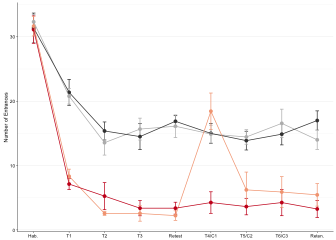
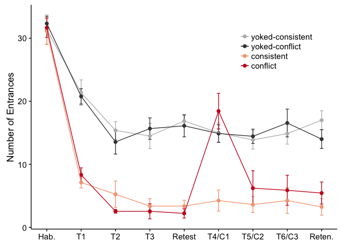
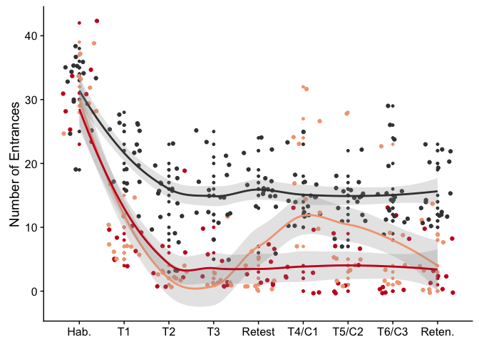
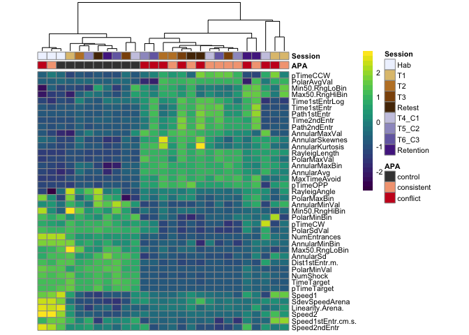
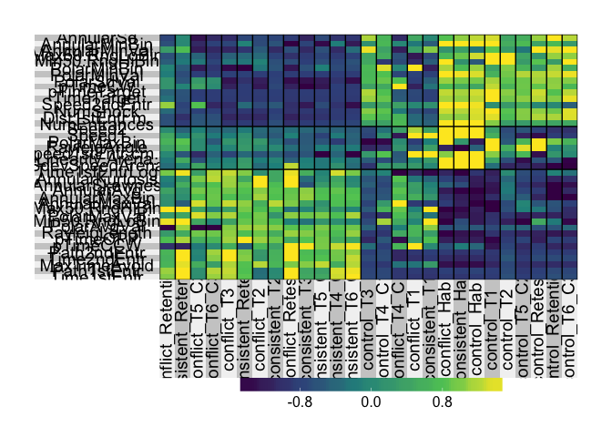
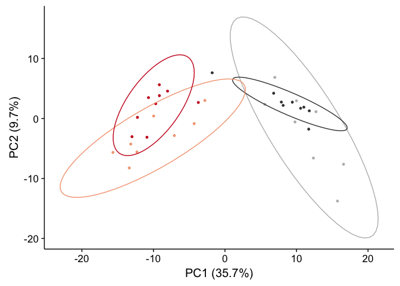
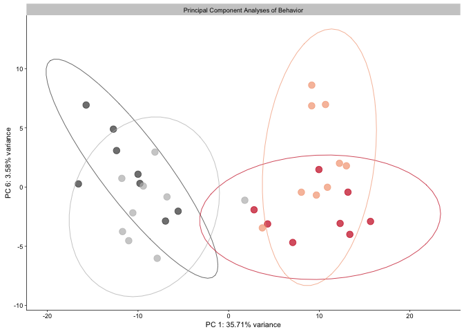
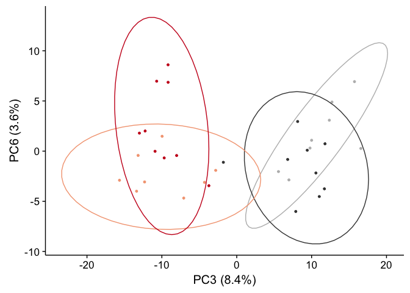
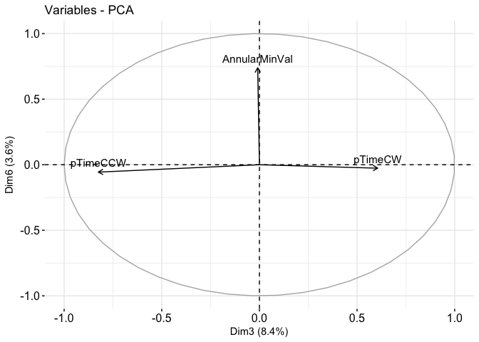

After wrangling the behaivoral data in the previous script ([01a\_beahvior\_create\_dfs.Rmd](./01a_beahvior_create_dfs.Rmd)), conducted the analyses descirbed in this scipt. All plots are generate as **.png** files for markdown viewing and as **.pdf** files for incorporation to Adobe Illustrator.


``` r
library(ggplot2) ## for awesome plots!
library(cowplot) ## for some easy to use themes
library(dplyr) ## for filtering and selecting rows
library(factoextra)  ##pca with vectors
library(car) ## stats
library(superheat) # for kmeans clustered heatmap
library(pheatmap)  # for pretty heatmap
library(viridis) # for awesome color pallette
library(reshape2) ## for melting dataframe
library(tidyr) ## for respahing data
library(plyr)


## load user-written functions 
source("functions_behavior.R")
source("figureoptions.R")


## set output file for figures 
knitr::opts_chunk$set(fig.path = '../figures/01_behavior/')
```

To help make production of these figures more reproducible, I first import some intermediate data files that I cleaned and manipulated for data vizualization. I also relevel factors here to overide the defalut alphabetical plotting.

``` r
behavior <- read.csv("../data/01a_behavior.csv", header = T)
retention <- read.csv("../data/01a_retention.csv", header = T) 
behaviorsummaryNum <- read.csv("../data/01a_behaviorsummaryNum.csv", header = T)
behaviorsummaryNumAPA2 <- read.csv("../data/01a_behaviorsummaryNumAPA2.csv", header = T)
scoresdf <- read.csv("../data/01a_scoresdf.csv", header = T)
rotationdf <- read.csv("../data/01a_rotationdf.csv", header = T, row.names = 1)
behaviormatrix <- read.csv("../data/01a_behaviormatrix.csv", header = T, row.names = 1)

#set factor levels
behavior$APA <- factor(behavior$APA, levels = c("control", "conflict", "consistent"))
behaviorsummaryNum$APA <- factor(behaviorsummaryNum$APA, levels = c("control",  "conflict","consistent"))
behaviorsummaryNumAPA2$APA2 <- factor(behaviorsummaryNumAPA2$APA2, levels = c( "yoked-conflict", "yoked-consistent" , "conflict","consistent"))
scoresdf$APA <- NULL
scoresdf$APA2 <- factor(scoresdf$APA2, levels = c( "yoked-conflict" ,"yoked-consistent","conflict", "consistent"))

levels(behaviorsummaryNumAPA2$APA2)
```

    ## [1] "yoked-conflict"   "yoked-consistent" "conflict"        
    ## [4] "consistent"

Figure 1B: Standard vizualization of mean avoidance beavior
-----------------------------------------------------------

First, I visualze the group mean and standard error for the time it takes before an individual mouse enters the spatial region marked "schock zone" or equivilent (Fig. 1A).

``` r
# plotting mean and se for time to total number of entrances
numentrance1 <- ggplot(behaviorsummaryNumAPA2, aes(x=, TrainSessionComboNum, y=m, color=APA2)) + 
    geom_errorbar(aes(ymin=m-se, ymax=m+se, color=APA2), width=.1) +
    geom_point(size = 1) +
   geom_line() +
    scale_y_continuous(name="Number of Entrances\nper 10 min training session") +
    scale_x_continuous(name = NULL, 
                       breaks = c(1, 2, 3, 4, 5, 6, 7, 8, 9),
                       labels=c("1" = "Hab.", "2" = "T1", "3" = "T2", 
                                "4" = "T3", "5" = "Retest", "6" = "T4/C1",
                                "7" = "T5/C2", "8" = "T6/C3", "9"= "Reten.")) +
  theme_cowplot(font_size = 8, line_size = 0.25) +
  background_grid(major = "y", minor = "y") +
  scale_color_manual(values = colorvalAPA2) + 
  #theme(legend.position=c(0.7, 0.8))  +
  theme(legend.title=element_blank()) +
  theme(legend.position="none")
numentrance1
```



``` r
pdf(file="../figures/01_behavior/numentrance1.pdf", width=3.5, height=1.75)
plot(numentrance1)
dev.off()
```

    ## quartz_off_screen 
    ##                 2

``` r
# plotting mean and se for time to total number of entrances
numentrance2 <- behaviorsummaryNumAPA2 %>%
  filter(APA2 %in% c("consistent", "yoked-consistent")) %>%
  ggplot(aes(x=, TrainSessionComboNum, y=m, color=APA2)) + 
    geom_errorbar(aes(ymin=m-se, ymax=m+se, color=APA2), width=.1) +
    geom_point(size = 1) +
   geom_line() +
    scale_y_continuous(name="Number of Entrances\nper 10 min training session") +
    scale_x_continuous(name = NULL, 
                       breaks = c(1, 2, 3, 4, 5, 6, 7, 8, 9),
                       labels=c("1" = "Hab.", "2" = "T1", "3" = "T2", 
                                "4" = "T3", "5" = "Retest", "6" = "T4/C1",
                                "7" = "T5/C2", "8" = "T6/C3", "9"= "Reten.")) +
  theme_cowplot(font_size = 8, line_size = 0.25) +
  background_grid(major = "y", minor = "y") +
  scale_color_manual(values = colorvalAPA5) + 
  #theme(legend.position=c(0.8, 0.8))  + 
  theme(legend.title=element_blank()) +
  theme(legend.position="none")
numentrance2
```



``` r
pdf(file="../figures/01_behavior/numentrance2.pdf", width=3.5, height=1.75)
plot(numentrance2)
dev.off()
```

    ## quartz_off_screen 
    ##                 2

### Supplemnentary time series plot

Here I visualze the individual data points for each annimal then use a linar model to fit a 95% confidence internal for the time it take a mouse to enter the "schock zone" or equivilent .

``` r
# plotting all data points and linear model smoothing for number of entrances
numentrance3 <- onebehavior(data=behavior, 
                            xcol="TrainSessionComboNum", ycol="NumEntrances",
                  yaxislabel="Number of Entrances",
                  colorcode="APA")

numentrance2
```



``` r
pdf(file="../figures/01_behavior/numentrance3.pdf", width=6, height=3)
plot(numentrance3)
dev.off()
```

    ## quartz_off_screen 
    ##                 2

Figure 1C: Hierarchical clusering of time series behavioral data
----------------------------------------------------------------

Here I use heirarhical cluster to identify patterns in the behavioral data. On the y axis see three distinct clusters of behaviors that are 1) higher in trained animals, 2) higher in yoked animals, and 3) measures of speed (Fig. 1C). The row dendrogram helps visuzlise the interaction between treatment group and (grey: control, pink: consistent, red: conflict) and training session (white: habitutation, shades of brown: training sessino 1-3, dark down: retest, shades of purple: training session 4-6 or conflict session 1-3, dark purple: retention).

``` r
## make annotation df and ann_colors for pheatmap
scaledaveragedata <- as.data.frame(makescaledaveragedata(behavior))

# create a rubric for the color coding and load the colors from figureoptions.R
df <- as.data.frame(makecolumnannotations(scaledaveragedata))
ann_colors = APAsession  # includes color for session & APA


# set color breaks
paletteLength <- 30
myBreaks <- c(seq(min(scaledaveragedata), 0, length.out=ceiling(paletteLength/2) + 1), 
              seq(max(scaledaveragedata)/paletteLength, max(scaledaveragedata), length.out=floor(paletteLength/2)))

## pheatmap for markdown
pheatmap(scaledaveragedata, show_colnames=F, show_rownames = F,
         annotation_col=df, annotation_colors = ann_colors,
         treeheight_row = 0, treeheight_col = 50,
         fontsize = 8, 
         #width=4.5, height=3,
         border_color = "grey60" ,
         color = viridis(30),
         cellwidth = 10, 
         clustering_method="average",
         breaks=myBreaks,
         clustering_distance_cols="correlation" 
         )
```



``` r
# pheatmapfor adobe
pheatmap(scaledaveragedata, show_colnames=F, show_rownames = F,
         annotation_col=df, annotation_colors = ann_colors,
         treeheight_row = 0, treeheight_col = 50,
         fontsize = 8, 
         border_color = "grey60" ,
         color = viridis(30),
         cellwidth = 7, 
         clustering_method="average",
         breaks=myBreaks,
         clustering_distance_cols="correlation",
         filename = "../figures/01_behavior/pheatmap.pdf"
         )
```

Now with 4 treatment groups

``` r
## make annotation df and ann_colors for pheatmap
scaledaveragedata2 <- as.data.frame(makescaledaveragedata2(behavior))

# create a rubric for the color coding and load the colors from figureoptions.R
df2 <- as.data.frame(makecolumnannotations(scaledaveragedata2))
ann_colors = APAsession2  # includes color for session & APA

# set color breaks
paletteLength <- 30
myBreaks <- c(seq(min(scaledaveragedata2), 0, length.out=ceiling(paletteLength/2) + 1), 
              seq(max(scaledaveragedata2)/paletteLength, max(scaledaveragedata2), length.out=floor(paletteLength/2)))

## pheatmap for markdown
pheatmap(scaledaveragedata2, show_colnames=F, show_rownames = T,
         annotation_col=df2, 
         annotation_colors = ann_colors,
         treeheight_row = 0, treeheight_col = 50,
         fontsize = 8, 
         #width=4.5, height=3,
         border_color = "grey60" ,
         color = viridis(30),
         cellwidth = 10, 
         clustering_method="average",
         breaks=myBreaks,
         clustering_distance_cols="correlation" 
         )
```


``` r
# pheatmapfor adobe
pheatmap(scaledaveragedata2, show_colnames=F, show_rownames = F,
         annotation_col=df2, annotation_colors = ann_colors,
         treeheight_row = 0, treeheight_col = 25,
         fontsize = 6, 
         border_color = "grey60" ,
         color = viridis(30),
         cellwidth = 6,
         cellheight = 6,
         clustering_method="average",
         breaks=myBreaks,
         clustering_distance_cols="correlation",
         filename = "../figures/01_behavior/pheatmap2.pdf",
         legend = TRUE,
         annotation_legend = FALSE
         )
```

### Supplmentary heatmap

The next image shows how all the behaviors measured change over time. Here, the data are normalized to a z-score with more positive values shown the viridis color scheme with yellow being positive and purple being negative. Each row contains value for each behavioral measurement. Each column is the average value for a group of animals as specific by APA group and training session.

This particular graph clusters the data according to a kmean of 3 rather than by heriarchical clustering. I use the R package superheat.

``` r
scaledaveragedatatranposed <- t(scaledaveragedata)

superheat(scaledaveragedata,
          # change the size of the labels
          left.label.size = 0.3, 
          bottom.label.size = 0.4,
          bottom.label.text.angle = 90, 
          # cluster rows and add dendrogram
          pretty.order.cols = TRUE,
          n.clusters.rows = 3,
          left.label = 'variable',
          heat.lim = c(-1.5, 1.5), 
          extreme.values.na = FALSE)
```



### Figure 1D1 and 1D2: Principle component analysis

Next, I next reduced the dimentionality of the data with a PCA anlaysis. PC1 explains 35% of the variation in the data. All other PCs explain less than 10% of the variation.

``` r
## data wraningly for pca anlysis
behaviormatrix %>% 
  scale() %>%                 # scale to 0 mean and unit variance
  prcomp() ->                 # do PCA
  pca                         # store result as `pca`
percent <- 100*pca$sdev^2/sum(pca$sdev^2)
perc_data <- data.frame(percent=percent, PC=1:length(percent))
res.pca <- prcomp(behaviormatrix,  scale = TRUE)

# plot of percent contribution
ggplot(perc_data, aes(x=PC, y=percent)) + 
  geom_bar(stat="identity") + 
  geom_text(aes(label=round(percent, 2)), size=4, vjust=-.5) + 
  xlim(0, 10)
```

    ## Warning: Removed 29 rows containing missing values (position_stack).

    ## Warning: Removed 29 rows containing missing values (geom_text).


### Figure 1D1: 35% of behaivor variance (PC1) separates yoked from trained

PC1 encompases differences between yoked trained indivdual but does not significantly differ between consistent and conflict trained aniamls. To confirm statistical significance of this visual pattern, we conducted a two-way treatment x region ANOVA and confirmed a significant effect of region (F2,31= 101.39; p = 2.5e-14). Post hoc Tukey tests confirmed conflict = consistent &lt; control). The major contibutors to this variation are number of shocks and distance to first entrance.

``` r
pca12 <- makepcaplotwithpercent(data=scoresdf,xcol="PC1",ycol="PC2",colorcode="APA2", newxlab = "PC1 (35.7%)", newylab = "PC2 (9.7%)")
pca12
```



``` r
pdf(file="../figures/01_behavior/pca12.pdf", width=3, height=3)
plot(pca12)
dev.off()
```

    ## quartz_off_screen 
    ##                 2

``` r
## statistics
aov1 <- aov(PC1 ~ APA2, data=scoresdf)
summary(aov1) # p = 1.01e-13
```

    ##             Df Sum Sq Mean Sq F value   Pr(>F)    
    ## APA2         3   3247  1082.5   70.92 1.01e-13 ***
    ## Residuals   30    458    15.3                     
    ## ---
    ## Signif. codes:  0 '***' 0.001 '**' 0.01 '*' 0.05 '.' 0.1 ' ' 1

``` r
TukeyHSD(aov1, which = "APA2") # p<< 0.001 for both control comparisions
```

    ##   Tukey multiple comparisons of means
    ##     95% family-wise confidence level
    ## 
    ## Fit: aov(formula = PC1 ~ APA2, data = scoresdf)
    ## 
    ## $APA2
    ##                                        diff        lwr        upr
    ## yoked-consistent-yoked-conflict   2.8209039  -2.341020   7.982828
    ## conflict-yoked-conflict         -18.0169437 -23.024745 -13.009142
    ## consistent-yoked-conflict       -18.2278994 -23.389823 -13.065976
    ## conflict-yoked-consistent       -20.8378476 -25.999771 -15.675924
    ## consistent-yoked-consistent     -21.0488034 -26.360379 -15.737228
    ## consistent-conflict              -0.2109558  -5.372879   4.950968
    ##                                     p adj
    ## yoked-consistent-yoked-conflict 0.4582117
    ## conflict-yoked-conflict         0.0000000
    ## consistent-yoked-conflict       0.0000000
    ## conflict-yoked-consistent       0.0000000
    ## consistent-yoked-consistent     0.0000000
    ## consistent-conflict             0.9994975

``` r
aov2 <- aov(PC2 ~ APA2, data=scoresdf)
summary(aov2) # p = 0.0295 *
```

    ##             Df Sum Sq Mean Sq F value Pr(>F)  
    ## APA2         3  188.7   62.89   3.427 0.0295 *
    ## Residuals   30  550.6   18.35                 
    ## ---
    ## Signif. codes:  0 '***' 0.001 '**' 0.01 '*' 0.05 '.' 0.1 ' ' 1

``` r
TukeyHSD(aov2, which = "APA2") # p > 0.05
```

    ##   Tukey multiple comparisons of means
    ##     95% family-wise confidence level
    ## 
    ## Fit: aov(formula = PC2 ~ APA2, data = scoresdf)
    ## 
    ## $APA2
    ##                                       diff        lwr       upr     p adj
    ## yoked-consistent-yoked-conflict -4.4155199 -10.075776 1.2447361 0.1695436
    ## conflict-yoked-conflict         -0.6594291  -6.150684 4.8318258 0.9877336
    ## consistent-yoked-conflict       -5.5120442 -11.172300 0.1482119 0.0585081
    ## conflict-yoked-consistent        3.7560908  -1.904165 9.4163469 0.2911558
    ## consistent-yoked-consistent     -1.0965242  -6.920880 4.7278312 0.9556089
    ## consistent-conflict             -4.8526151 -10.512871 0.8076410 0.1134571

``` r
fviz12 <- fviz_pca_var(res.pca, select.var = list(contrib = 3), axes = c(1, 2))
fviz12
```



``` r
pdf(file="../figures/01_behavior/fviz12.pdf", width=3, height=3)
plot(fviz12)
dev.off()
```

    ## quartz_off_screen 
    ##                 2

``` r
aov3 <- aov(PC3 ~ APA2, data=scoresdf)
summary(aov3) # p = 0.117
```

    ##             Df Sum Sq Mean Sq F value Pr(>F)
    ## APA2         3  102.5   34.17   2.135  0.117
    ## Residuals   30  480.0   16.00

``` r
TukeyHSD(aov3, which = "APA") # p = 0.0557503 for conflict-consistent 
```

    ## Warning in qtukey(conf.level, length(means), x$df.residual): NaNs produced

    ##   Tukey multiple comparisons of means
    ##     95% family-wise confidence level
    ## 
    ## Fit: aov(formula = PC3 ~ APA2, data = scoresdf)
    ## 
    ## $<NA>
    ##      diff lwr upr p adj

``` r
pca36 <-makepcaplotwithpercent(data=scoresdf,xcol="PC1",ycol="PC6",colorcode="APA2", newxlab = "PC3 (8.4%)", newylab = "PC6 (3.6%)")
pca36
```



``` r
pdf(file="../figures/01_behavior/pca36.pdf", width=3, height=3)
plot(pca36)
dev.off()
```

    ## quartz_off_screen 
    ##                 2

``` r
fviz36 <- fviz_pca_var(res.pca, select.var = list(contrib = 3), axes = c(3, 6))
fviz36
```



``` r
pdf(file="../figures/01_behavior/fviz36.pdf", width=3, height=3)
plot(fviz36)
dev.off()
```

    ## quartz_off_screen 
    ##                 2

PC2 and 9 also difference by p &lt; 0.01.

``` r
aov9 <- aov(PC9 ~ APA2, data=scoresdf)
summary(aov9) # p =  0.018
```

    ##             Df Sum Sq Mean Sq F value Pr(>F)  
    ## APA2         3  105.2   35.05   3.916  0.018 *
    ## Residuals   30  268.5    8.95                 
    ## ---
    ## Signif. codes:  0 '***' 0.001 '**' 0.01 '*' 0.05 '.' 0.1 ' ' 1

``` r
TukeyHSD(aov9, which = "APA") # p = 0.0939973 for conflict-consistent 
```

    ## Warning in qtukey(conf.level, length(means), x$df.residual): NaNs produced

    ##   Tukey multiple comparisons of means
    ##     95% family-wise confidence level
    ## 
    ## Fit: aov(formula = PC9 ~ APA2, data = scoresdf)
    ## 
    ## $<NA>
    ##      diff lwr upr p adj

Here are some stats modeling combinatorail PCs. I'm really not sure if this makes sense. I should probabaly model some behavior time interaction....

``` r
lm1 <- lm(PC1~APA2, data=scoresdf)
summary(lm1)
```

    ## 
    ## Call:
    ## lm(formula = PC1 ~ APA2, data = scoresdf)
    ## 
    ## Residuals:
    ##     Min      1Q  Median      3Q     Max 
    ## -10.180  -2.252  -0.098   2.518   7.026 
    ## 
    ## Coefficients:
    ##                      Estimate Std. Error t value Pr(>|t|)    
    ## (Intercept)             8.394      1.302   6.446 4.04e-07 ***
    ## APA2yoked-consistent    2.821      1.898   1.486    0.148    
    ## APA2conflict          -18.017      1.842  -9.783 7.61e-11 ***
    ## APA2consistent        -18.228      1.898  -9.602 1.17e-10 ***
    ## ---
    ## Signif. codes:  0 '***' 0.001 '**' 0.01 '*' 0.05 '.' 0.1 ' ' 1
    ## 
    ## Residual standard error: 3.907 on 30 degrees of freedom
    ## Multiple R-squared:  0.8764, Adjusted R-squared:  0.8641 
    ## F-statistic: 70.92 on 3 and 30 DF,  p-value: 1.009e-13

``` r
lm16 <- lm(PC1+PC6~APA2, data=scoresdf)
summary(lm16)
```

    ## 
    ## Call:
    ## lm(formula = PC1 + PC6 ~ APA2, data = scoresdf)
    ## 
    ## Residuals:
    ##     Min      1Q  Median      3Q     Max 
    ## -9.6653 -3.1977 -0.1108  4.0493  9.9851 
    ## 
    ## Coefficients:
    ##                      Estimate Std. Error t value Pr(>|t|)    
    ## (Intercept)             6.766      1.721   3.932  0.00046 ***
    ## APA2yoked-consistent    5.905      2.508   2.354  0.02533 *  
    ## APA2conflict          -13.983      2.434  -5.746 2.84e-06 ***
    ## APA2consistent        -18.929      2.508  -7.546 2.06e-08 ***
    ## ---
    ## Signif. codes:  0 '***' 0.001 '**' 0.01 '*' 0.05 '.' 0.1 ' ' 1
    ## 
    ## Residual standard error: 5.162 on 30 degrees of freedom
    ## Multiple R-squared:  0.8073, Adjusted R-squared:  0.788 
    ## F-statistic: 41.88 on 3 and 30 DF,  p-value: 7.628e-11

``` r
lm136 <- lm(PC1+PC3+PC6~APA2, data=scoresdf)
summary(lm136)
```

    ## 
    ## Call:
    ## lm(formula = PC1 + PC3 + PC6 ~ APA2, data = scoresdf)
    ## 
    ## Residuals:
    ##     Min      1Q  Median      3Q     Max 
    ## -12.156  -3.382  -1.010   4.361  13.919 
    ## 
    ## Coefficients:
    ##                      Estimate Std. Error t value Pr(>|t|)    
    ## (Intercept)             5.816      2.133   2.727  0.01058 *  
    ## APA2yoked-consistent    7.236      3.109   2.327  0.02689 *  
    ## APA2conflict          -10.522      3.016  -3.489  0.00152 ** 
    ## APA2consistent        -20.116      3.109  -6.470 3.78e-07 ***
    ## ---
    ## Signif. codes:  0 '***' 0.001 '**' 0.01 '*' 0.05 '.' 0.1 ' ' 1
    ## 
    ## Residual standard error: 6.399 on 30 degrees of freedom
    ## Multiple R-squared:  0.7404, Adjusted R-squared:  0.7144 
    ## F-statistic: 28.52 on 3 and 30 DF,  p-value: 6.395e-09
