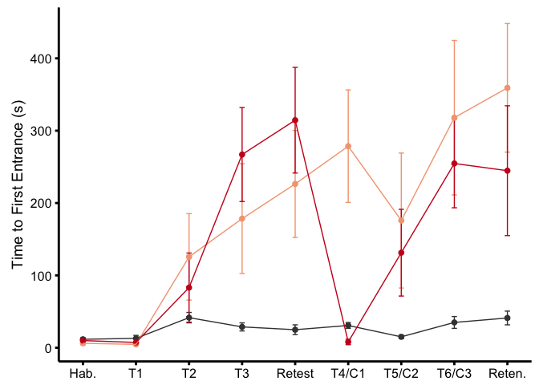
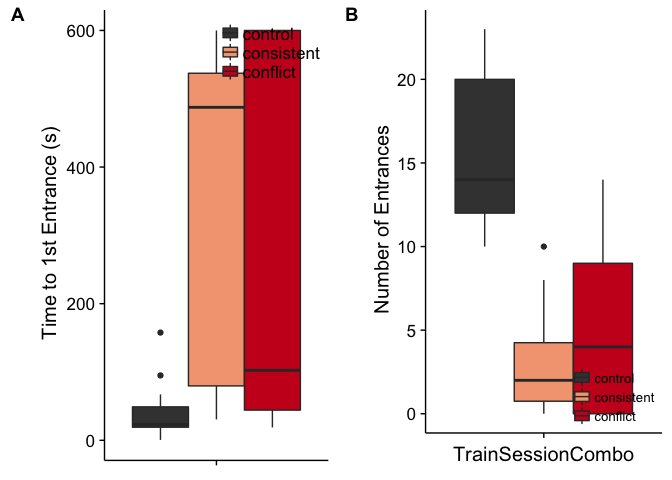
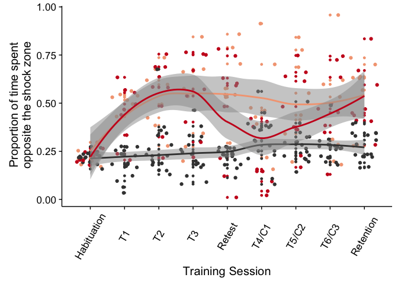
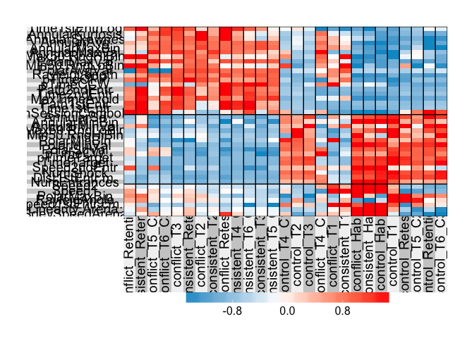
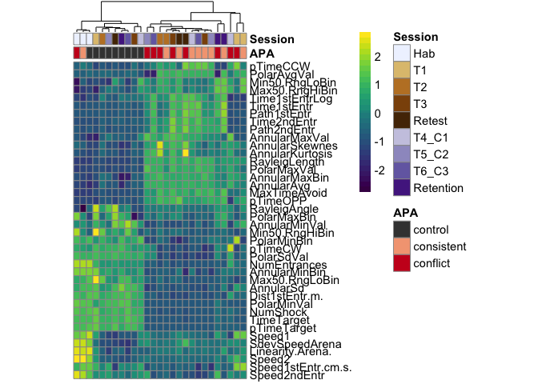
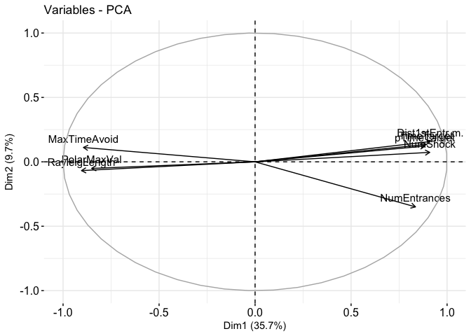
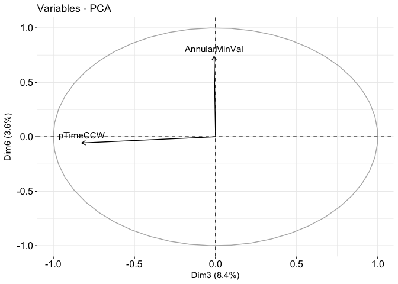

These analyses combined can be summarized in this figure:


``` r
library(ggplot2) ## for awesome plots!
```

    ## Warning: package 'ggplot2' was built under R version 3.3.2

``` r
library(cowplot) ## for some easy to use themes
library(dplyr) ## for filtering and selecting rows
library(factoextra)  ##pca with vectors
```

    ## Warning: package 'factoextra' was built under R version 3.3.2

``` r
library(car) ## stats
```

    ## Warning: package 'car' was built under R version 3.3.2

``` r
library(superheat) # for kmeans clustered heatmap
library(pheatmap)  # for pretty heatmap
library(viridis) # for awesome color pallette

## load functions 
source("functions_behavior.R")
source("figureoptions.R")

## set output file for figures 
knitr::opts_chunk$set(fig.path = '../figures/01_behavior/')
```

``` r
behavior <- read.csv("../data/01a_behavior.csv", header = T)
retention <- read.csv("../data/01a_retention.csv", header = T) 
behaviorsummaryTime <- read.csv("../data/01a_behaviorsummaryTime.csv", header = T)
behaviorsummaryNum <- read.csv("../data/01a_behaviorsummaryNum.csv", header = T)
scaledaveragedata <- read.csv("../data/01a_scaledaveragedata.csv", header = T, row.names = 1)
columnannotations <- read.csv("../data/01a_columnannotations.csv", header = T, row.names = 1)
scoresdf <- read.csv("../data/01a_scoresdf.csv", header = T)
rotationdf <- read.csv("../data/01a_rotationdf.csv", header = T, row.names = 1)
behaviormatrix <- read.csv("../data/01a_behaviormatrix.csv", header = T, row.names = 1)

#set factor levels
levels(behavior$APA)
```

    ## [1] "conflict"   "consistent" "control"

``` r
behavior$APA <- factor(behavior$APA, levels = c("control", "consistent", "conflict"))
behaviorsummaryTime$APA <- factor(behaviorsummaryTime$APA, levels = c("control", "consistent", "conflict"))
behaviorsummaryNum$APA <- factor(behaviorsummaryNum$APA, levels = c("control", "consistent", "conflict"))
scoresdf$APA <- factor(scoresdf$APA, levels = c("control", "consistent", "conflict"))
```

``` r
# plotting mean and se for time to first entrance
firstentrance <- ggplot(behaviorsummaryTime, aes(x=, TrainSessionComboNum, y=m, color=APA)) + 
    geom_errorbar(aes(ymin=m-se, ymax=m+se, color=APA), width=.1) +
    geom_point(size = 2) +
   geom_line() +
    scale_y_continuous(name="Time to First Entrance (s)") +
    scale_x_continuous(name = NULL, 
                       breaks = c(1, 2, 3, 4, 5, 6, 7, 8, 9),
                       labels=c("1" = "Hab.", "2" = "T1", "3" = "T2", 
                                "4" = "T3", "5" = "Retest", "6" = "T4/C1",
                                "7" = "T5/C2", "8" = "T6/C3", "9"= "Reten.")) +
  theme_cowplot(font_size = 14, line_size = 1) +
  background_grid(major = "none", minor = "none") +
  scale_color_manual(values = colorvalAPA) + 
  theme(legend.position="none") 

firstentrance
```



``` r
pdf(file="../figures/01_behavior/firstentrance.pdf", width=6, height=3)
plot(firstentrance)
dev.off()
```

    ## quartz_off_screen 
    ##                 2

``` r
# plotting mean and se for time to total number of entrances
numentrance1 <- ggplot(behaviorsummaryNum, aes(x=, TrainSessionComboNum, y=m, color=APA)) + 
    geom_errorbar(aes(ymin=m-se, ymax=m+se, color=APA), width=.1) +
    geom_point(size = 2) +
   geom_line() +
    scale_y_continuous(name="Number of Entrances") +
    scale_x_continuous(name = NULL, 
                       breaks = c(1, 2, 3, 4, 5, 6, 7, 8, 9),
                       labels=c("1" = "Hab.", "2" = "T1", "3" = "T2", 
                                "4" = "T3", "5" = "Retest", "6" = "T4/C1",
                                "7" = "T5/C2", "8" = "T6/C3", "9"= "Reten.")) +
  theme_cowplot(font_size = 14, line_size = 0.5) +
  background_grid(major = "none", minor = "none") +
  scale_color_manual(values = colorvalAPA) + 
  theme(legend.position=c(0.8, 0.8))  + 
  theme(legend.title=element_blank())

numentrance1
```



``` r
pdf(file="../figures/01_behavior/numentrance1.pdf", width=6, height=3)
plot(numentrance1)
dev.off()
```

    ## quartz_off_screen 
    ##                 2

``` r
# plotting all data points and linear model smoothing for number of entrances
numentrance2 <- onebehavior(data=behavior, 
                            xcol="TrainSessionComboNum", ycol="NumEntrances",
                  yaxislabel="Number of Entrances",
                  colorcode="APA")

numentrance2
```



``` r
pdf(file="../figures/01_behavior/numentrance2.pdf", width=6, height=3)
plot(numentrance2)
dev.off()
```

    ## quartz_off_screen 
    ##                 2

### Heatmap

The next image shows how all the behaviors measured change over time. Here, the data are normalized to a z-score with more positive values shown in red and negative values show in blue. Each row contains value for each behavioral measurement. Each column is the average value for a group of animals as specific by APA group (purple, orange, brown) and training session (from white to black according to increasing time spend in the active place avoidance group).

``` r
scaledaveragedatatranposed <- t(scaledaveragedata)

superheat(scaledaveragedata,
          # change the size of the labels
          left.label.size = 0.3, 
          bottom.label.size = 0.4,
          bottom.label.text.angle = 90, 
          # cluster rows and add dendrogram
          pretty.order.cols = TRUE,
          n.clusters.rows = 3,
          left.label = 'variable',
          heat.lim = c(-1.5, 1.5), 
          extreme.values.na = FALSE)
```



``` r
## make annotation df and ann_colors for pheatmap
df <- columnannotations
ann_colors = session_colors 

# set color breaks
paletteLength <- 30
myBreaks <- c(seq(min(scaledaveragedata), 0, length.out=ceiling(paletteLength/2) + 1), 
              seq(max(scaledaveragedata)/paletteLength, max(scaledaveragedata), length.out=floor(paletteLength/2)))

## pheatmap for markdown
pheatmap(scaledaveragedata, show_colnames=F, show_rownames = T,
         annotation_col=df, annotation_colors = ann_colors,
         treeheight_row = 0, treeheight_col = 25,
         fontsize = 11, 
         #width=4.5, height=3,
         border_color = "grey60" ,
         color = viridis(30),
         cellwidth = 6, 
         clustering_method="average",
         breaks=myBreaks,
         clustering_distance_cols="correlation" 
         )
```



``` r
# pheatmapfor adobe
pheatmap(scaledaveragedata, show_colnames=F, show_rownames = T,
         annotation_col=df, annotation_colors = ann_colors,
         treeheight_row = 0, treeheight_col = 50,
         fontsize = 10, 
         border_color = "grey60" ,
         color = viridis(30),
         cellwidth = 8, 
         clustering_method="average",
         breaks=myBreaks,
         clustering_distance_cols="correlation",
         filename = "../figures/01_behavior/pheatmap.pdf"
         )
```

### Principle component analysis (PCA)

Given the correlational structure of the data, I next reduced the dimentionality with a PCA anlaysis. You can see that PC1 speparates trained and untraned animals (D,E) but neither PC2 (D) nor PC3 (E) separate same and conflict aniamls. Elipses show 95% confidence interval.

``` r
## pca anlysis
behaviormatrix %>% 
  scale() %>%                 # scale to 0 mean and unit variance
  prcomp() ->                 # do PCA
  pca                         # store result as `pca`
percent <- 100*pca$sdev^2/sum(pca$sdev^2)
perc_data <- data.frame(percent=percent, PC=1:length(percent))
ggplot(perc_data, aes(x=PC, y=percent)) + 
  geom_bar(stat="identity") + 
  geom_text(aes(label=round(percent, 2)), size=4, vjust=-.5) + 
  xlim(0, 10)
```

    ## Warning: Removed 29 rows containing missing values (position_stack).

    ## Warning: Removed 29 rows containing missing values (geom_text).


``` r
## statistics
aov1 <- aov(PC1 ~ APA, data=scoresdf)
summary(aov1) # p = 2.53e-14
```

    ##             Df Sum Sq Mean Sq F value   Pr(>F)    
    ## APA          2   3214  1606.8   101.3 2.53e-14 ***
    ## Residuals   31    492    15.9                     
    ## ---
    ## Signif. codes:  0 '***' 0.001 '**' 0.01 '*' 0.05 '.' 0.1 ' ' 1

``` r
TukeyHSD(aov1, which = "APA") # p<< 0.001 for both control comparisions
```

    ##   Tukey multiple comparisons of means
    ##     95% family-wise confidence level
    ## 
    ## Fit: aov(formula = PC1 ~ APA, data = scoresdf)
    ## 
    ## $APA
    ##                            diff        lwr        upr     p adj
    ## consistent-control  -19.5553836 -23.757552 -15.353215 0.0000000
    ## conflict-control    -19.3444279 -23.384730 -15.304125 0.0000000
    ## conflict-consistent   0.2109558  -4.551502   4.973413 0.9934703

``` r
aov2 <- aov(PC2 ~ APA, data=scoresdf)
summary(aov2) # p = 0.0906
```

    ##             Df Sum Sq Mean Sq F value Pr(>F)  
    ## APA          2  106.1   53.05   2.597 0.0906 .
    ## Residuals   31  633.2   20.42                 
    ## ---
    ## Signif. codes:  0 '***' 0.001 '**' 0.01 '*' 0.05 '.' 0.1 ' ' 1

``` r
TukeyHSD(aov2, which = "APA") # p = 0.0852578 for conflict-consistent 
```

    ##   Tukey multiple comparisons of means
    ##     95% family-wise confidence level
    ## 
    ## Fit: aov(formula = PC2 ~ APA, data = scoresdf)
    ## 
    ## $APA
    ##                          diff        lwr       upr     p adj
    ## consistent-control  -3.434152 -8.2030827  1.334778 0.1955003
    ## conflict-control     1.418463 -3.1667701  6.003695 0.7290903
    ## conflict-consistent  4.852615 -0.5521726 10.257403 0.0852578

``` r
aov3 <- aov(PC3 ~ APA, data=scoresdf)
summary(aov3) # p = 0.0633
```

    ##             Df Sum Sq Mean Sq F value Pr(>F)  
    ## APA          2   95.0   47.50    3.02 0.0633 .
    ## Residuals   31  487.5   15.73                 
    ## ---
    ## Signif. codes:  0 '***' 0.001 '**' 0.01 '*' 0.05 '.' 0.1 ' ' 1

``` r
TukeyHSD(aov3, which = "APA") # p = 0.0557503 for conflict-consistent 
```

    ##   Tukey multiple comparisons of means
    ##     95% family-wise confidence level
    ## 
    ## Fit: aov(formula = PC3 ~ APA, data = scoresdf)
    ## 
    ## $APA
    ##                          diff         lwr      upr     p adj
    ## consistent-control  -1.812712 -5.99726370 2.371839 0.5417745
    ## conflict-control     2.833634 -1.18973029 6.856997 0.2090687
    ## conflict-consistent  4.646346 -0.09614557 9.388837 0.0557503

``` r
aov6 <- aov(PC6 ~ APA, data=scoresdf)
summary(aov6) # p = 0.0226
```

    ##             Df Sum Sq Mean Sq F value Pr(>F)  
    ## APA          2   96.1   48.03   4.293 0.0226 *
    ## Residuals   31  346.9   11.19                 
    ## ---
    ## Signif. codes:  0 '***' 0.001 '**' 0.01 '*' 0.05 '.' 0.1 ' ' 1

``` r
TukeyHSD(aov6, which = "APA") # p = 0.0175577 for conflict-consistent 
```

    ##   Tukey multiple comparisons of means
    ##     95% family-wise confidence level
    ## 
    ## Fit: aov(formula = PC6 ~ APA, data = scoresdf)
    ## 
    ## $APA
    ##                          diff        lwr      upr     p adj
    ## consistent-control  -2.152715 -5.6824153 1.376985 0.3043094
    ## conflict-control     2.583185 -0.8105525 5.976922 0.1633660
    ## conflict-consistent  4.735900  0.7355730 8.736227 0.0175577

``` r
aov9 <- aov(PC9 ~ APA, data=scoresdf)
summary(aov9) # p =  0.0584
```

    ##             Df Sum Sq Mean Sq F value Pr(>F)  
    ## APA          2  62.55   31.28   3.117 0.0584 .
    ## Residuals   31 311.07   10.04                 
    ## ---
    ## Signif. codes:  0 '***' 0.001 '**' 0.01 '*' 0.05 '.' 0.1 ' ' 1

``` r
TukeyHSD(aov9, which = "APA") # p = 0.0722837 for conflict-consistent 
```

    ##   Tukey multiple comparisons of means
    ##     95% family-wise confidence level
    ## 
    ## Fit: aov(formula = PC9 ~ APA, data = scoresdf)
    ## 
    ## $APA
    ##                           diff        lwr      upr     p adj
    ## consistent-control  -0.7833752 -4.1260684 2.559318 0.8334263
    ## conflict-control     2.7406860 -0.4732478 5.954620 0.1065599
    ## conflict-consistent  3.5240612 -0.2643244 7.312447 0.0722837

``` r
lm1 <- lm(PC1~APA, data=scoresdf)
summary(lm1)
```

    ## 
    ## Call:
    ## lm(formula = PC1 ~ APA, data = scoresdf)
    ## 
    ## Residuals:
    ##      Min       1Q   Median       3Q      Max 
    ## -11.5071  -2.5761   0.0012   2.0463   7.0257 
    ## 
    ## Coefficients:
    ##               Estimate Std. Error t value Pr(>|t|)    
    ## (Intercept)     9.7219     0.9658   10.07 2.74e-11 ***
    ## APAconsistent -19.5554     1.7074  -11.45 1.14e-12 ***
    ## APAconflict   -19.3444     1.6416  -11.78 5.54e-13 ***
    ## ---
    ## Signif. codes:  0 '***' 0.001 '**' 0.01 '*' 0.05 '.' 0.1 ' ' 1
    ## 
    ## Residual standard error: 3.982 on 31 degrees of freedom
    ## Multiple R-squared:  0.8673, Adjusted R-squared:  0.8588 
    ## F-statistic: 101.3 on 2 and 31 DF,  p-value: 2.531e-14

``` r
lm16 <- lm(PC1+PC6~APA, data=scoresdf)
summary(lm16)
```

    ## 
    ## Call:
    ## lm(formula = PC1 + PC6 ~ APA, data = scoresdf)
    ## 
    ## Residuals:
    ##      Min       1Q   Median       3Q      Max 
    ## -12.4439  -3.4814  -0.5956   3.6301  13.1110 
    ## 
    ## Coefficients:
    ##               Estimate Std. Error t value Pr(>|t|)    
    ## (Intercept)      9.545      1.341   7.119 5.33e-08 ***
    ## APAconsistent  -21.708      2.370  -9.160 2.50e-10 ***
    ## APAconflict    -16.761      2.279  -7.356 2.79e-08 ***
    ## ---
    ## Signif. codes:  0 '***' 0.001 '**' 0.01 '*' 0.05 '.' 0.1 ' ' 1
    ## 
    ## Residual standard error: 5.528 on 31 degrees of freedom
    ## Multiple R-squared:  0.7717, Adjusted R-squared:  0.7569 
    ## F-statistic: 52.38 on 2 and 31 DF,  p-value: 1.143e-10

``` r
lm136 <- lm(PC1+PC3+PC6~APA, data=scoresdf)
summary(lm136)
```

    ## 
    ## Call:
    ## lm(formula = PC1 + PC3 + PC6 ~ APA, data = scoresdf)
    ## 
    ## Residuals:
    ##     Min      1Q  Median      3Q     Max 
    ## -10.755  -4.705  -1.010   3.253  17.750 
    ## 
    ## Coefficients:
    ##               Estimate Std. Error t value Pr(>|t|)    
    ## (Intercept)      9.221      1.659   5.559 4.32e-06 ***
    ## APAconsistent  -23.521      2.932  -8.021 4.67e-09 ***
    ## APAconflict    -13.928      2.819  -4.940 2.55e-05 ***
    ## ---
    ## Signif. codes:  0 '***' 0.001 '**' 0.01 '*' 0.05 '.' 0.1 ' ' 1
    ## 
    ## Residual standard error: 6.839 on 31 degrees of freedom
    ## Multiple R-squared:  0.6935, Adjusted R-squared:  0.6737 
    ## F-statistic: 35.07 on 2 and 31 DF,  p-value: 1.096e-08

``` r
pca12 <- makepcaplotwithpercent(data=scoresdf,xcol="PC1",ycol="PC2",colorcode="APA", newxlab = "PC1 (35.7%)", newylab = "PC2 (9.7%)")
pca12
```


``` r
pdf(file="../figures/01_behavior/pca12.pdf", width=3, height=3)
plot(pca12)
dev.off()
```

    ## quartz_off_screen 
    ##                 2

``` r
pca36 <-makepcaplotwithpercent(data=scoresdf,xcol="PC3",ycol="PC6",colorcode="APA", newxlab = "PC3 (8.4%)", newylab = "PC6 (3.6%)")
pca36
```


``` r
pdf(file="../figures/01_behavior/pca36.pdf", width=3, height=3)
plot(pca36)
dev.off()
```

    ## quartz_off_screen 
    ##                 2

``` r
res.pca <- prcomp(behaviormatrix,  scale = TRUE)

fviz12 <- fviz_pca_var(res.pca, select.var = list(contrib = 2), axes = c(1, 2))
fviz12
```



``` r
pdf(file="../figures/01_behavior/fviz12.pdf", width=3, height=3)
plot(fviz12)
dev.off()
```

    ## quartz_off_screen 
    ##                 2

``` r
fviz36 <- fviz_pca_var(res.pca, select.var = list(contrib = 2), axes = c(3, 6))
fviz36
```



``` r
pdf(file="../figures/01_behavior/fviz36.pdf", width=3, height=3)
plot(fviz36)
dev.off()
```

    ## quartz_off_screen 
    ##                 2
