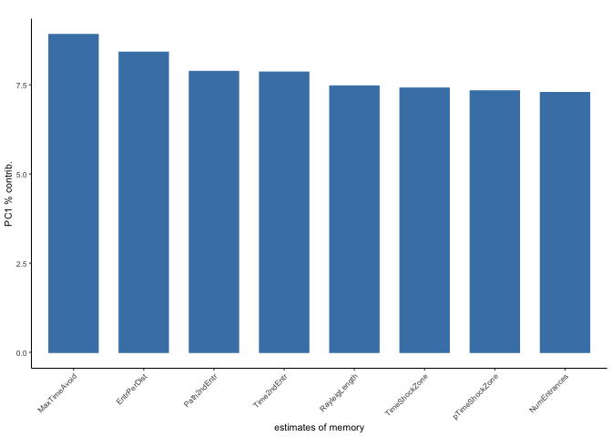
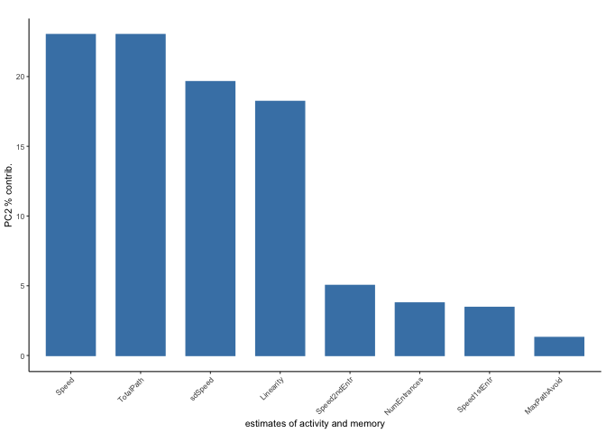

``` r
library(ggplot2) ## for awesome plots!
```

    ## Warning: package 'ggplot2' was built under R version 3.3.2

``` r
library(cowplot) ## for some easy to use themes
library(dplyr) ## for filtering and selecting rows
library(factoextra)  ##pca with vectors
```

    ## Warning: package 'factoextra' was built under R version 3.3.2

``` r
library(car) ## stats
```

    ## Warning: package 'car' was built under R version 3.3.2

``` r
## load functions 
source("functions_behavior.R")
source("figureoptions.R")

## set output file for figures 
knitr::opts_chunk$set(fig.path = '../figures/01_behavior/')
```

``` r
behavior <- read.csv("../data/01a_behavior.csv", header = T)
retention <- read.csv("../data/01a_retention.csv", header = T) 
behaviorsummaryTime <- read.csv("../data/01a_behaviorsummaryTime.csv", header = T)
behaviorsummaryNum <- read.csv("../data/01a_behaviorsummaryNum.csv", header = T)
scaledaveragedata <- read.csv("../data/01a_scaledaveragedata.csv", header = T, row.names = 1)
columnannotations <- read.csv("../data/01a_columnannotations.csv", header = T, row.names = 1)
scoresdf <- read.csv("../data/01a_scoresdf.csv", header = T)
rotationdf <- read.csv("../data/01a_rotationdf.csv", header = T, row.names = 1)
behaviormatrix <- read.csv("../data/01a_behaviormatrix.csv", header = T, row.names = 1)
```

``` r
behavior$APA <- factor(behavior$APA, levels = c("control", "consistent", "conflict"))
behaviorsummaryTime$APA <- factor(behaviorsummaryTime$APA, levels = c("control", "consistent", "conflict"))
behaviorsummaryNum$APA <- factor(behaviorsummaryNum$APA, levels = c("control", "consistent", "conflict"))
scoresdf$APA <- factor(scoresdf$APA, levels = c("control", "consistent", "conflict"))
```

``` r
A <- ggplot(behaviorsummaryTime, aes(x=APA, y=m, color=APA)) + 
    geom_errorbar(aes(ymin=m-se, ymax=m+se, color=APA), width=.1) +
    geom_point(size = 2) +
    scale_y_continuous(name="Time to First Entrance (s)") +
    scale_x_discrete(name=NULL) +
  theme_cowplot(font_size = 14, line_size = 1) +
  background_grid(major = "xy", minor = "none") +
  scale_color_manual(values = colorvalAPA) +
theme(legend.justification=c(1,0), legend.position=c(1,0), legend.title = element_blank()) + 
theme(axis.ticks = element_blank(), axis.text.x = element_blank())

B <- ggplot(behaviorsummaryNum, aes(x=APA, y=m, color=APA)) + 
    geom_errorbar(aes(ymin=m-se, ymax=m+se), width=.1) +
    geom_point(size = 2) + 
    scale_y_continuous(name="Number of Entrances") +
    scale_x_discrete(name=NULL) +
  theme_cowplot(font_size = 14, line_size = 1) +
  background_grid(major = "xy", minor = "none") +
  scale_color_manual(values = colorvalAPA) +
theme(legend.justification=c(1,1), legend.position=c(1,1), legend.title = element_blank()) + theme(axis.ticks = element_blank(), axis.text.x = element_blank())


plot_grid(A,B, nrow=1, labels=c("A", "B"), rel_widths = c(1, 1))
```


``` r
meansem <- plot_grid(A,B, nrow=1, labels=c("A", "B"), rel_widths = c(1, 1))


pdf(file="../figures/01_behavior/avoidancebehavior-1.pdf", width=6, height=3)
plot(meansem)
dev.off()
```

    ## quartz_off_screen 
    ##                 2

``` r
A <- myboxplotlegendtop(data = behavior,xcol = "TrainSessionCombo", 
                ycol = "Time1stEntr", colorcode = "APA", session ="Retention",
                yaxislabel="\n Time to 1st Entrance (s)")

B <- myboxplotlegendbottom(data = behavior, xcol = "TrainSessionCombo", 
                ycol = "NumEntrances", colorcode = "APA", 
                session ="Retention",
                yaxislabel="\n Number of Entrances") 

plot_grid(A,B, nrow=1,  labels=c("A", "B"))
```


``` r
boxplot <- plot_grid(A,B, nrow=1, labels=c("A", "B"))

pdf(file="../figures/01_behavior/avoidancebehavior-2.pdf", width=8.5, height=3)
plot(boxplot)
dev.off()
```

    ## quartz_off_screen 
    ##                 2

``` r
onebehavior(data=behavior, xcol="TrainSessionComboNum", ycol="pTimeOPP",
                  yaxislabel=" Proportion of time spent\n opposite the shock zone",
                  colorcode="APA")
```


``` r
timeopp <- onebehavior(data=behavior, xcol="TrainSessionComboNum", ycol="pTimeOPP",
                  yaxislabel=" Proportion of time spent\n opposite the shock zone",
                  colorcode="APA")

pdf(file="../figures/01_behavior/avoidancebehavior-3.pdf", width=6, height=4)
plot(timeopp)
dev.off()
```

    ## quartz_off_screen 
    ##                 2

``` r
## hab to retest
habtoretest <- behavior %>% 
  filter(TrainSessionCombo %in% c("Hab", "Retest", "T1", "T3", "T2")) %>% droplevels()
onebehaviorhabtoretest(data=habtoretest, xcol="TrainSessionComboNum", ycol="pTimeOPP",
                  yaxislabel=" Proportion of time spent\n opposite the shock zone",
                  colorcode="APA")
```

    ## `geom_smooth()` using method = 'loess'


``` r
## c4 to rentetion
c4toretention <- behavior %>% 
  filter(TrainSessionCombo %in% c("Retention", "T4_C1", "T5_C2", "T6_C3")) %>% droplevels()
onebehaviorc4toRentention(data=c4toretention, xcol="TrainSessionComboNum", ycol="pTimeOPP",
                  yaxislabel=" Proportion of time spent\n opposite the shock zone",
                  colorcode="APA")
```

    ## Warning in simpleLoess(y, x, w, span, degree = degree, parametric =
    ## parametric, : pseudoinverse used at 5.985

    ## Warning in simpleLoess(y, x, w, span, degree = degree, parametric =
    ## parametric, : neighborhood radius 2.015

    ## Warning in simpleLoess(y, x, w, span, degree = degree, parametric =
    ## parametric, : reciprocal condition number 4.896e-17

    ## Warning in simpleLoess(y, x, w, span, degree = degree, parametric =
    ## parametric, : There are other near singularities as well. 4.0602

    ## Warning in predLoess(object$y, object$x, newx = if
    ## (is.null(newdata)) object$x else if (is.data.frame(newdata))
    ## as.matrix(model.frame(delete.response(terms(object)), : pseudoinverse used
    ## at 5.985

    ## Warning in predLoess(object$y, object$x, newx = if
    ## (is.null(newdata)) object$x else if (is.data.frame(newdata))
    ## as.matrix(model.frame(delete.response(terms(object)), : neighborhood radius
    ## 2.015

    ## Warning in predLoess(object$y, object$x, newx = if
    ## (is.null(newdata)) object$x else if (is.data.frame(newdata))
    ## as.matrix(model.frame(delete.response(terms(object)), : reciprocal
    ## condition number 4.896e-17

    ## Warning in predLoess(object$y, object$x, newx = if
    ## (is.null(newdata)) object$x else if (is.data.frame(newdata))
    ## as.matrix(model.frame(delete.response(terms(object)), : There are other
    ## near singularities as well. 4.0602

    ## Warning in simpleLoess(y, x, w, span, degree = degree, parametric =
    ## parametric, : pseudoinverse used at 5.985

    ## Warning in simpleLoess(y, x, w, span, degree = degree, parametric =
    ## parametric, : neighborhood radius 2.015

    ## Warning in simpleLoess(y, x, w, span, degree = degree, parametric =
    ## parametric, : reciprocal condition number 4.5798e-17

    ## Warning in simpleLoess(y, x, w, span, degree = degree, parametric =
    ## parametric, : There are other near singularities as well. 4.0602

    ## Warning in predLoess(object$y, object$x, newx = if
    ## (is.null(newdata)) object$x else if (is.data.frame(newdata))
    ## as.matrix(model.frame(delete.response(terms(object)), : pseudoinverse used
    ## at 5.985

    ## Warning in predLoess(object$y, object$x, newx = if
    ## (is.null(newdata)) object$x else if (is.data.frame(newdata))
    ## as.matrix(model.frame(delete.response(terms(object)), : neighborhood radius
    ## 2.015

    ## Warning in predLoess(object$y, object$x, newx = if
    ## (is.null(newdata)) object$x else if (is.data.frame(newdata))
    ## as.matrix(model.frame(delete.response(terms(object)), : reciprocal
    ## condition number 4.5798e-17

    ## Warning in predLoess(object$y, object$x, newx = if
    ## (is.null(newdata)) object$x else if (is.data.frame(newdata))
    ## as.matrix(model.frame(delete.response(terms(object)), : There are other
    ## near singularities as well. 4.0602

    ## Warning in simpleLoess(y, x, w, span, degree = degree, parametric =
    ## parametric, : pseudoinverse used at 5.985

    ## Warning in simpleLoess(y, x, w, span, degree = degree, parametric =
    ## parametric, : neighborhood radius 2.015

    ## Warning in simpleLoess(y, x, w, span, degree = degree, parametric =
    ## parametric, : reciprocal condition number 4.896e-17

    ## Warning in simpleLoess(y, x, w, span, degree = degree, parametric =
    ## parametric, : There are other near singularities as well. 4.0602

    ## Warning in predLoess(object$y, object$x, newx = if
    ## (is.null(newdata)) object$x else if (is.data.frame(newdata))
    ## as.matrix(model.frame(delete.response(terms(object)), : pseudoinverse used
    ## at 5.985

    ## Warning in predLoess(object$y, object$x, newx = if
    ## (is.null(newdata)) object$x else if (is.data.frame(newdata))
    ## as.matrix(model.frame(delete.response(terms(object)), : neighborhood radius
    ## 2.015

    ## Warning in predLoess(object$y, object$x, newx = if
    ## (is.null(newdata)) object$x else if (is.data.frame(newdata))
    ## as.matrix(model.frame(delete.response(terms(object)), : reciprocal
    ## condition number 4.896e-17

    ## Warning in predLoess(object$y, object$x, newx = if
    ## (is.null(newdata)) object$x else if (is.data.frame(newdata))
    ## as.matrix(model.frame(delete.response(terms(object)), : There are other
    ## near singularities as well. 4.0602


``` r
levels(behavior$TrainSessionCombo)
```

    ## [1] "Hab"       "Retention" "Retest"    "T1"        "T2"        "T3"       
    ## [7] "T4_C1"     "T5_C2"     "T6_C3"

### Heatmap

The next image shows how all the behaviors measured change over time. Here, the data are normalized to a z-score with more positive values shown in red and negative values show in blue. Each row contains value for each behavioral measurement. Each column is the average value for a group of animals as specific by APA group (purple, orange, brown) and training session (from white to black according to increasing time spend in the active place avoidance group).

``` r
library(superheat)

superheat(scaledaveragedata,
          # change the size of the labels
          left.label.size = 0.3, 
          bottom.label.size = 0.4,
          bottom.label.text.angle = 90, 
          # cluster rows and add dendrogram
          pretty.order.cols = TRUE,
          n.clusters.rows = 3,
          left.label = 'variable',
          # change color
          heat.pal = c("Deep Sky Blue 3", "white", "red"),
          # These two lines help you darken the color
          heat.lim = c(-1.5, 1.5), 
          extreme.values.na = FALSE)
```


``` r
scaledaveragedatatranposed <- t(scaledaveragedata)

superheat(scaledaveragedatatranposed,
          # change the size of the labels
          left.label.size = 0.25, 
          bottom.label.size = 0.45,
          bottom.label.text.angle = 90, 
          # cluster rows and add dendrogram
          pretty.order.cols = TRUE,
          n.clusters.rows = 4,
          left.label = 'variable',
          # change color
          heat.pal = c("Deep Sky Blue 3", "white", "red"),
          # These two lines darken the color
          heat.lim = c(-1.5, 1.5), 
          extreme.values.na = FALSE)
```


``` r
superheat(scaledaveragedatatranposed,
          # change the size of the labels
          left.label.size = 0.25, 
          bottom.label.size = 0.45,
          bottom.label.text.angle = 90, 
          # cluster rows and add dendrogram
          pretty.order.cols = TRUE,
          n.clusters.rows = 3,
          left.label = 'variable',
          # change color
          #heat.pal = c("Deep Sky Blue 3", "white", "red"),
          # These two lines darken the color
          heat.lim = c(-1.5, 1.5), 
          extreme.values.na = FALSE,
          bottom.label.text.size = 6,
          left.label.text.size = 6)
```


### Principle component analysis (PCA)

Given the correlational structure of the data, I next reduced the dimentionality with a PCA anlaysis. You can see that PC1 speparates trained and untraned animals (D,E) but neither PC2 (D) nor PC3 (E) separate same and conflict aniamls. Elipses show 95% confidence interval.

``` r
## pca anlysis
behaviormatrix %>% 
  scale() %>%                 # scale to 0 mean and unit variance
  prcomp() ->                 # do PCA
  pca                         # store result as `pca`
percent <- 100*pca$sdev^2/sum(pca$sdev^2)
perc_data <- data.frame(percent=percent, PC=1:length(percent))
ggplot(perc_data, aes(x=PC, y=percent)) + 
  geom_bar(stat="identity") + 
  geom_text(aes(label=round(percent, 2)), size=4, vjust=-.5) + 
  xlim(0, 10)
```

    ## Warning: Removed 29 rows containing missing values (position_stack).

    ## Warning: Removed 29 rows containing missing values (geom_text).


``` r
makepcaplot(data=scoresdf,xcol="PC1",ycol="PC2",colorcode="APA")
```


``` r
## statistics
aov1 <- aov(PC1 ~ APA, data=scoresdf)
summary(aov1) # p = 2.53e-14
```

    ##             Df Sum Sq Mean Sq F value   Pr(>F)    
    ## APA          2   3214  1606.8   101.3 2.53e-14 ***
    ## Residuals   31    492    15.9                     
    ## ---
    ## Signif. codes:  0 '***' 0.001 '**' 0.01 '*' 0.05 '.' 0.1 ' ' 1

``` r
TukeyHSD(aov1, which = "APA") # p<< 0.001 for both control comparisions
```

    ##   Tukey multiple comparisons of means
    ##     95% family-wise confidence level
    ## 
    ## Fit: aov(formula = PC1 ~ APA, data = scoresdf)
    ## 
    ## $APA
    ##                            diff        lwr        upr     p adj
    ## consistent-control  -19.5553836 -23.757552 -15.353215 0.0000000
    ## conflict-control    -19.3444279 -23.384730 -15.304125 0.0000000
    ## conflict-consistent   0.2109558  -4.551502   4.973413 0.9934703

``` r
aov2 <- aov(PC2 ~ APA, data=scoresdf)
summary(aov2) # p = 0.0906
```

    ##             Df Sum Sq Mean Sq F value Pr(>F)  
    ## APA          2  106.1   53.05   2.597 0.0906 .
    ## Residuals   31  633.2   20.42                 
    ## ---
    ## Signif. codes:  0 '***' 0.001 '**' 0.01 '*' 0.05 '.' 0.1 ' ' 1

``` r
TukeyHSD(aov2, which = "APA") # p = 0.0852578 for conflict
```

    ##   Tukey multiple comparisons of means
    ##     95% family-wise confidence level
    ## 
    ## Fit: aov(formula = PC2 ~ APA, data = scoresdf)
    ## 
    ## $APA
    ##                          diff        lwr       upr     p adj
    ## consistent-control  -3.434152 -8.2030827  1.334778 0.1955003
    ## conflict-control     1.418463 -3.1667701  6.003695 0.7290903
    ## conflict-consistent  4.852615 -0.5521726 10.257403 0.0852578

``` r
aov3 <- aov(PC3 ~ APA, data=scoresdf)
summary(aov3) # p = 0.0633
```

    ##             Df Sum Sq Mean Sq F value Pr(>F)  
    ## APA          2   95.0   47.50    3.02 0.0633 .
    ## Residuals   31  487.5   15.73                 
    ## ---
    ## Signif. codes:  0 '***' 0.001 '**' 0.01 '*' 0.05 '.' 0.1 ' ' 1

``` r
TukeyHSD(aov3, which = "APA") # p = 0.0557503 for conflict
```

    ##   Tukey multiple comparisons of means
    ##     95% family-wise confidence level
    ## 
    ## Fit: aov(formula = PC3 ~ APA, data = scoresdf)
    ## 
    ## $APA
    ##                          diff         lwr      upr     p adj
    ## consistent-control  -1.812712 -5.99726370 2.371839 0.5417745
    ## conflict-control     2.833634 -1.18973029 6.856997 0.2090687
    ## conflict-consistent  4.646346 -0.09614557 9.388837 0.0557503

``` r
aov6 <- aov(PC6 ~ APA, data=scoresdf)
summary(aov6) # p = 0.0226
```

    ##             Df Sum Sq Mean Sq F value Pr(>F)  
    ## APA          2   96.1   48.03   4.293 0.0226 *
    ## Residuals   31  346.9   11.19                 
    ## ---
    ## Signif. codes:  0 '***' 0.001 '**' 0.01 '*' 0.05 '.' 0.1 ' ' 1

``` r
TukeyHSD(aov6, which = "APA") # p = 0.0175577 for conflict
```

    ##   Tukey multiple comparisons of means
    ##     95% family-wise confidence level
    ## 
    ## Fit: aov(formula = PC6 ~ APA, data = scoresdf)
    ## 
    ## $APA
    ##                          diff        lwr      upr     p adj
    ## consistent-control  -2.152715 -5.6824153 1.376985 0.3043094
    ## conflict-control     2.583185 -0.8105525 5.976922 0.1633660
    ## conflict-consistent  4.735900  0.7355730 8.736227 0.0175577

``` r
lm1 <- lm(PC1~APA, data=scoresdf)
summary(lm1)
```

    ## 
    ## Call:
    ## lm(formula = PC1 ~ APA, data = scoresdf)
    ## 
    ## Residuals:
    ##      Min       1Q   Median       3Q      Max 
    ## -11.5071  -2.5761   0.0012   2.0463   7.0257 
    ## 
    ## Coefficients:
    ##               Estimate Std. Error t value Pr(>|t|)    
    ## (Intercept)     9.7219     0.9658   10.07 2.74e-11 ***
    ## APAconsistent -19.5554     1.7074  -11.45 1.14e-12 ***
    ## APAconflict   -19.3444     1.6416  -11.78 5.54e-13 ***
    ## ---
    ## Signif. codes:  0 '***' 0.001 '**' 0.01 '*' 0.05 '.' 0.1 ' ' 1
    ## 
    ## Residual standard error: 3.982 on 31 degrees of freedom
    ## Multiple R-squared:  0.8673, Adjusted R-squared:  0.8588 
    ## F-statistic: 101.3 on 2 and 31 DF,  p-value: 2.531e-14

``` r
lm16 <- lm(PC1+PC6~APA, data=scoresdf)
summary(lm16)
```

    ## 
    ## Call:
    ## lm(formula = PC1 + PC6 ~ APA, data = scoresdf)
    ## 
    ## Residuals:
    ##      Min       1Q   Median       3Q      Max 
    ## -12.4439  -3.4814  -0.5956   3.6301  13.1110 
    ## 
    ## Coefficients:
    ##               Estimate Std. Error t value Pr(>|t|)    
    ## (Intercept)      9.545      1.341   7.119 5.33e-08 ***
    ## APAconsistent  -21.708      2.370  -9.160 2.50e-10 ***
    ## APAconflict    -16.761      2.279  -7.356 2.79e-08 ***
    ## ---
    ## Signif. codes:  0 '***' 0.001 '**' 0.01 '*' 0.05 '.' 0.1 ' ' 1
    ## 
    ## Residual standard error: 5.528 on 31 degrees of freedom
    ## Multiple R-squared:  0.7717, Adjusted R-squared:  0.7569 
    ## F-statistic: 52.38 on 2 and 31 DF,  p-value: 1.143e-10

``` r
makepcaplot(data=scoresdf,xcol="PC1",ycol="PC3",colorcode="APA")
```



``` r
makepcaplot(data=scoresdf,xcol="PC1",ycol="PC4",colorcode="APA")
```



``` r
makepcaplot(data=scoresdf,xcol="PC2",ycol="PC4",colorcode="APA")
```


``` r
makepcaplot(data=scoresdf,xcol="PC1",ycol="PC6",colorcode="APA")
```


``` r
## statistics
aov6 <- aov(PC6 ~ APA, data=scoresdf)
summary(aov6) # p = 0.0584 
```

    ##             Df Sum Sq Mean Sq F value Pr(>F)  
    ## APA          2   96.1   48.03   4.293 0.0226 *
    ## Residuals   31  346.9   11.19                 
    ## ---
    ## Signif. codes:  0 '***' 0.001 '**' 0.01 '*' 0.05 '.' 0.1 ' ' 1

``` r
TukeyHSD(aov6, which = "APA") # consistent-conflict p= 0.0175577
```

    ##   Tukey multiple comparisons of means
    ##     95% family-wise confidence level
    ## 
    ## Fit: aov(formula = PC6 ~ APA, data = scoresdf)
    ## 
    ## $APA
    ##                          diff        lwr      upr     p adj
    ## consistent-control  -2.152715 -5.6824153 1.376985 0.3043094
    ## conflict-control     2.583185 -0.8105525 5.976922 0.1633660
    ## conflict-consistent  4.735900  0.7355730 8.736227 0.0175577

``` r
res.pca <- prcomp(behaviormatrix,  scale = TRUE)
fviz_pca_var(res.pca, select.var = list(contrib = 8), axes = c(1, 2))
```


``` r
fviz_pca_var(res.pca, select.var = list(contrib = 8), axes = c(1, 6))
```


``` r
fviz_pca_var(res.pca, select.var = list(contrib = 8), axes = c(1, 9))
```


``` r
library(ggfortify)
```

    ## Warning: package 'ggfortify' was built under R version 3.3.2

``` r
df <- behaviormatrix
autoplot(prcomp(df))
```


``` r
autoplot(prcomp(df), data = behavior, colour = 'APA', loadings = TRUE, loadings.label = TRUE, loadings.label.size = 5, scale = 0)
```


``` r
library(cluster)
autoplot(clara(behaviormatrix, 3))
```


``` r
autoplot(fanny(behaviormatrix, 2), frame = TRUE)
```

    ## Warning in fanny(behaviormatrix, 2): the memberships are all very close to
    ## 1/k. Maybe decrease 'memb.exp' ?


``` r
# capture the rotation matrix in a data frame
rotation_data <- rotationdf
# define a pleasing arrow style
arrow_style <- arrow(length = unit(0.05, "inches"),
                     type = "closed")
# now plot, using geom_segment() for arrows and geom_text for labels
ggplot(rotation_data) + 
  geom_segment(aes(xend=PC1, yend=PC2), x=0, y=0, arrow=arrow_style) + 
  geom_text(aes(x=PC1, y=PC2, label=variable), hjust=0, size=3, color='red')
```


