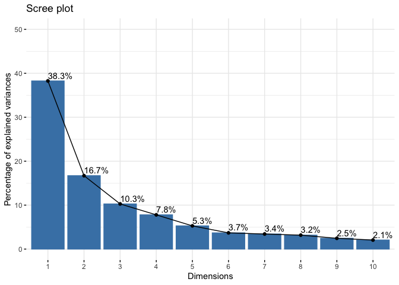
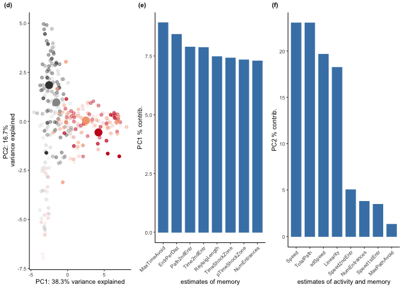

``` r
library(ggplot2) ## for awesome plots!
```

    ## Warning: package 'ggplot2' was built under R version 3.3.2

``` r
library(cowplot) ## for some easy to use themes
library(dplyr) ## for filtering and selecting rows
library(factoextra)
```

    ## Warning: package 'factoextra' was built under R version 3.3.2

``` r
## load functions 
source("functions_behavior.R")
source("figureoptions.R")

## set output file for figures 
knitr::opts_chunk$set(fig.path = '../figures/01_behavior/')
```

``` r
behavior <- read.csv("../data/01a_behavior.csv", header = T)
retention <- read.csv("../data/01a_retention.csv", header = T) 
behaviorsummaryTime <- read.csv("../data/01a_behaviorsummaryTime.csv", header = T)
behaviorsummaryNum <- read.csv("../data/01a_behaviorsummaryNum.csv", header = T)
scaledaveragedata <- read.csv("../data/01a_scaledaveragedata.csv", header = T)
columnannotations <- read.csv("../data/01a_columnannotations.csv", header = T)
scoresdf <- read.csv("../data/01a_scoresdf.csv", header = T)
rotationdf <- read.csv("../data/01a_rotationdf.csv", header = T)
behaviormatrix <- read.csv("../data/01a_behaviormatrix.csv", header = T)
```

``` r
behaviorsummaryTime$APA <- factor(behaviorsummaryTime$APA, levels = c("control", "consistent", "conflict"))
behaviorsummaryNum$APA <- factor(behaviorsummaryNum$APA, levels = c("control", "consistent", "conflict"))

A <- ggplot(behaviorsummaryTime, aes(x=APA, y=m, color=APA)) + 
    geom_errorbar(aes(ymin=m-se, ymax=m+se, color=APA), width=.1) +
    geom_point(size = 2) +
    scale_y_continuous(name="Time to First Entrance (s)") +
    scale_x_discrete(name=NULL) +
  theme_cowplot(font_size = 14, line_size = 1) +
  background_grid(major = "xy", minor = "none") +
  scale_color_manual(values = colorvalAPA) +
theme(legend.justification=c(1,0), legend.position=c(1,0), legend.title = element_blank()) + 
theme(axis.ticks = element_blank(), axis.text.x = element_blank())

B <- ggplot(behaviorsummaryNum, aes(x=APA, y=m, color=APA)) + 
    geom_errorbar(aes(ymin=m-se, ymax=m+se), width=.1) +
    geom_point(size = 2) +
    scale_y_continuous(name="Number of Entrances") +
    scale_x_discrete(name=NULL) +
  theme_cowplot(font_size = 14, line_size = 1) +
  background_grid(major = "xy", minor = "none") +
  scale_color_manual(values = colorvalAPA) +
theme(legend.justification=c(1,1), legend.position=c(1,1), legend.title = element_blank()) + theme(axis.ticks = element_blank(), axis.text.x = element_blank())


plot_grid(A,B, nrow=1, labels=c("A", "B"), rel_widths = c(1, 1))
```


``` r
meansem <- plot_grid(A,B, nrow=1, labels=c("A", "B"), rel_widths = c(1, 1))


pdf(file="../figures/01_behavior/avoidancebehavior-1.pdf", width=6, height=3)
plot(meansem)
dev.off()
```

    ## quartz_off_screen 
    ##                 2

``` r
A <- myboxplotlegendtop(data = behavior,xcol = "TrainSessionCombo", 
                ycol = "Time1stEntr", colorcode = "APA", session ="Retention",
                yaxislabel="\n Time to 1st Entrance (s)")

B <- myboxplotlegendbottom(data = behavior, xcol = "TrainSessionCombo", 
                ycol = "NumEntrances", colorcode = "APA", 
                session ="Retention",
                yaxislabel="\n Number of Entrances") 

plot_grid(A,B, nrow=1,  labels=c("A", "B"))
```


``` r
boxplot <- plot_grid(A,B, nrow=1, labels=c("A", "B"))

pdf(file="../figures/01_behavior/avoidancebehavior-2.pdf", width=8.5, height=3)
plot(boxplot)
dev.off()
```

    ## quartz_off_screen 
    ##                 2

``` r
onebehavior(data=behavior, xcol="TrainSessionComboNum", ycol="pTimeOPP",
                  yaxislabel=" Proportion of time spent\n opposite the shock zone",
                  colorcode="APA")
```

    ## `geom_smooth()` using method = 'loess'


``` r
timeopp <- onebehavior(data=behavior, xcol="TrainSessionComboNum", ycol="pTimeOPP",
                  yaxislabel=" Proportion of time spent\n opposite the shock zone",
                  colorcode="APA")

pdf(file="../figures/01_behavior/avoidancebehavior-3.pdf", width=6, height=4)
plot(timeopp)
```

    ## `geom_smooth()` using method = 'loess'

``` r
dev.off()
```

    ## quartz_off_screen 
    ##                 2

### Heatmap

The next image shows how all the behaviors measured change over time. Here, the data are normalized to a z-score with more positive values shown in red and negative values show in blue. Each row contains value for each behavioral measurement. Each column is the average value for a group of animals as specific by APA group (purple, orange, brown) and training session (from white to black according to increasing time spend in the active place avoidance group).

``` r
## see the makesessionheatmap documentataion for data tidying and plot specifications
#makesessionheatmap(behavior)
```

### Principle component analysis (PCA)

Given the correlational structure of the data, I next reduced the dimentionality with a PCA anlaysis. You can see that PC1 speparates trained and untraned animals (D,E) but neither PC2 (D) nor PC3 (E) separate same and conflict aniamls. Elipses show 95% confidence interval.

``` r
makepcaplot(data=scoresdf,xcol="PC1",ycol="PC2",colorcode="APA")
```


``` r
makepcaplot(data=scoresdf,xcol="PC1",ycol="PC3",colorcode="APA")
```



``` r
makepcaplot(data=scoresdf,xcol="PC1",ycol="PC4",colorcode="APA")
```


``` r
makepcaplot(data=scoresdf,xcol="PC1",ycol="PC5",colorcode="APA")
```


``` r
makepcaplot(data=scoresdf,xcol="PC1",ycol="PC6",colorcode="APA")
```



``` r
makepcaplot(data=scoresdf,xcol="PC1",ycol="PC7",colorcode="APA")
```


``` r
makepcaplot(data=scoresdf,xcol="PC1",ycol="PC8",colorcode="APA")
```


``` r
makepcaplot(data=scoresdf,xcol="PC1",ycol="PC9",colorcode="APA")
```


``` r
makepcaplot(data=scoresdf,xcol="PC1",ycol="PC10",colorcode="APA")
```


``` r
res.pca <- prcomp(behaviormatrix,  scale = TRUE)

fviz_pca_var(res.pca, select.var = list(contrib = 8), axes = c(1, 2))
```


``` r
fviz_pca_var(res.pca, select.var = list(contrib = 8), axes = c(2, 3))
```


