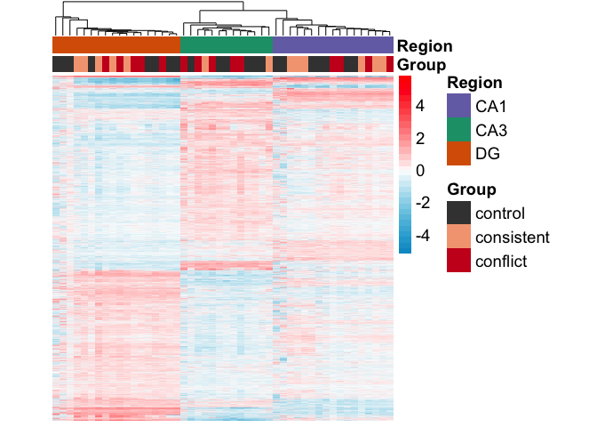
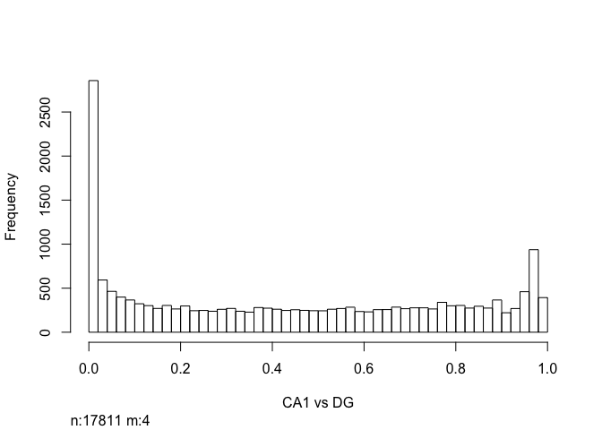
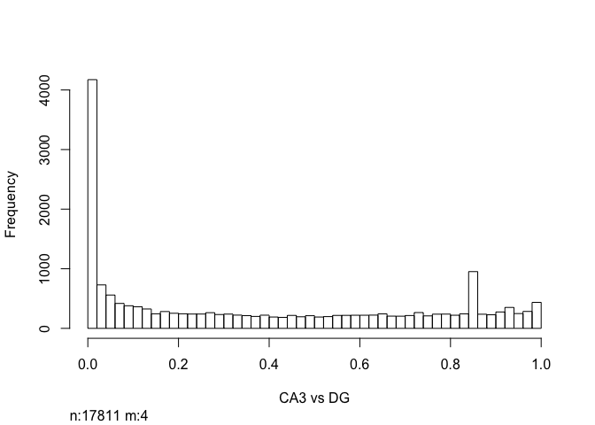
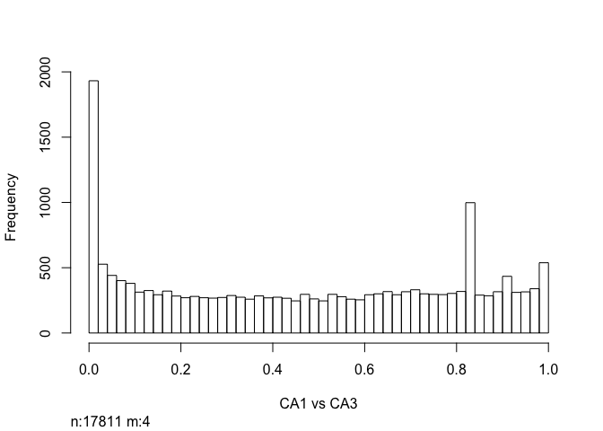
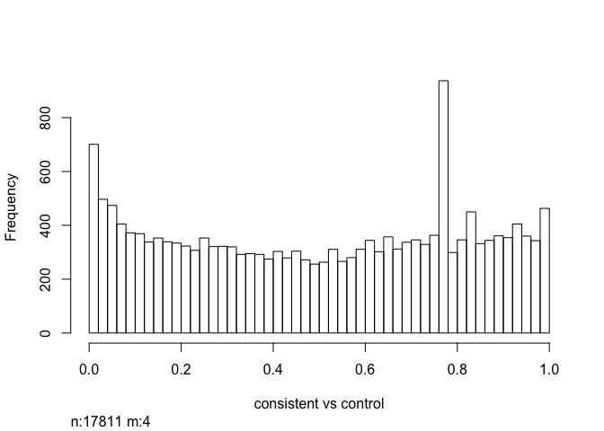
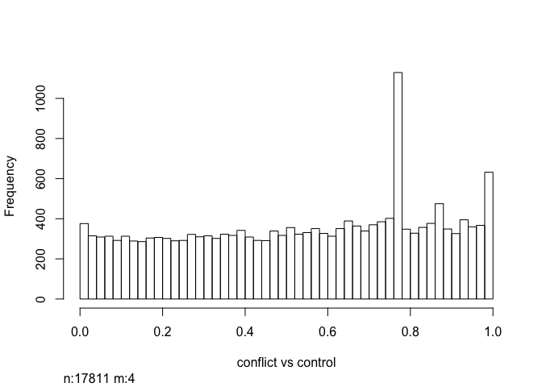
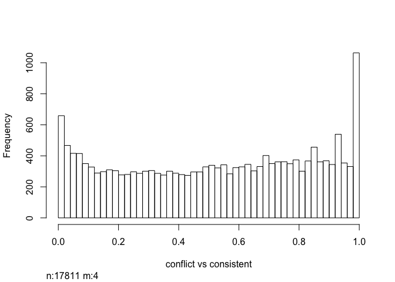
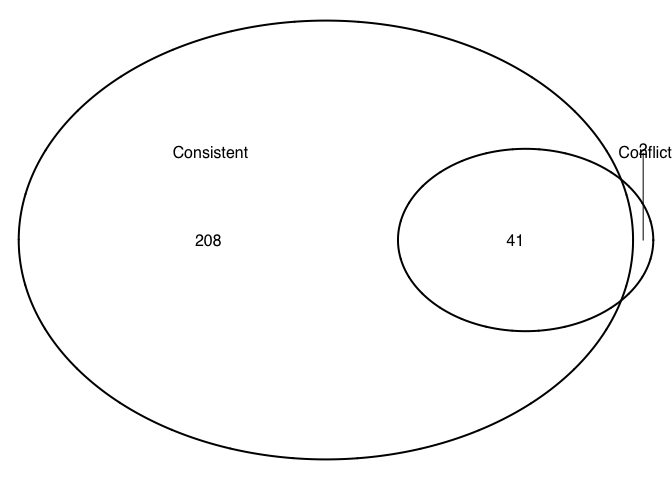

    ##         Group    Region  
    ##  conflict  :14   CA1:17  
    ##  consistent:13   CA3:13  
    ##  control   :21   DG :18

### Differential gene expresssion analysis

Raw reads were downloaded from the Amazon cloud server to the Stampede
Cluster at the Texas Advanced Computing Facility for processing and
analysis. RNA quality was checked using the bioinformatic program FASTQC
(citation). Low quality reads and adapter sequences were removed using
the program Cutadapt (Martin, 2011). Kallisto was use for fast read
mapping and counting (Bray et al., 2016). Transcript from a single gene
were combined into a count total for each gene. In the end, we meausred
the expression of 22,485 genes in 48 samples.

    ## [1] 22485    48

We used DESeq2 (Love et al., 2014) for gene expression normalization and
quantification using the following experimental design:
`Group + Region + Group * Region`. Genes with less than 2 counts across
all samples were filtered, leaving us with 17815 genes for analysis of
differntial expression.

    dim(rld)

    FALSE [1] 17815    48

We identified 423 genes were differentially expressed between the yoked
control and cognitively trained animals, 3485 genes that were
differentially expressed across subfields, and 324 showed an interaction
at FDR p &lt; 0.05 (Fig. 4B). We see a large effect of brain region on
gene expression, with 20% of detectable genes begin differentially
expressed between one or more brain-region comparisons (3485
differentially expressed genes /17320 measured genes). This is an order
of magnitude greater than the 2% of the transcriptome that changed in
response to learning (423 DEGs /17320 genes measured).

Hierarchical clustering of the differentially expressed genes separates
samples by both subfield and treatment (Fig. 4C).

Then, we visuazlied the data as a heatmap showing the relative log fold
change of gene expression across samples. Genes were filtered for a
minimimum adjust p value &lt; 0.05 in any two-way contrast. The row mean
for each gene was subtracted for the raw value to allow for analysis of
fold change rather than raw magnitudes. The samples cluster primarily by
brain region with some small treatment-driven.

    #result <- pvclust(DEGes, method.dist="cor", method.hclust="average", nboot=1000)
    #plot(result)

A principal component analysis ....

    aov1 <- aov(PC1 ~ Region, data=pcadata)
    summary(aov1) 

    FALSE             Df Sum Sq Mean Sq F value Pr(>F)    
    FALSE Region       2  21655   10828   342.9 <2e-16 ***
    FALSE Residuals   45   1421      32                   
    FALSE ---
    FALSE Signif. codes:  0 '***' 0.001 '**' 0.01 '*' 0.05 '.' 0.1 ' ' 1

    TukeyHSD(aov1, which = "Region")

    FALSE   Tukey multiple comparisons of means
    FALSE     95% family-wise confidence level
    FALSE 
    FALSE Fit: aov(formula = PC1 ~ Region, data = pcadata)
    FALSE 
    FALSE $Region
    FALSE              diff       lwr       upr     p adj
    FALSE CA3-CA1  3.438726 -1.579084  8.456535 0.2313388
    FALSE DG-CA1  45.275615 40.669625 49.881605 0.0000000
    FALSE DG-CA3  41.836890 36.879848 46.793932 0.0000000

    aov2 <- aov(PC2 ~ Region, data=pcadata)
    summary(aov2) 

    FALSE             Df Sum Sq Mean Sq F value Pr(>F)    
    FALSE Region       2   8702    4351   811.4 <2e-16 ***
    FALSE Residuals   45    241       5                   
    FALSE ---
    FALSE Signif. codes:  0 '***' 0.001 '**' 0.01 '*' 0.05 '.' 0.1 ' ' 1

    TukeyHSD(aov2, which = "Region") 

    FALSE   Tukey multiple comparisons of means
    FALSE     95% family-wise confidence level
    FALSE 
    FALSE Fit: aov(formula = PC2 ~ Region, data = pcadata)
    FALSE 
    FALSE $Region
    FALSE              diff       lwr       upr p adj
    FALSE CA3-CA1  34.32630  32.25848  36.39411     0
    FALSE DG-CA1   13.47645  11.57835  15.37456     0
    FALSE DG-CA3  -20.84985 -22.89262 -18.80707     0

    aov3 <- aov(PC3 ~ Group, data=pcadata)
    summary(aov3) 

    FALSE             Df Sum Sq Mean Sq F value  Pr(>F)   
    FALSE Group        2    377  188.51   5.215 0.00919 **
    FALSE Residuals   45   1627   36.15                   
    FALSE ---
    FALSE Signif. codes:  0 '***' 0.001 '**' 0.01 '*' 0.05 '.' 0.1 ' ' 1

    aov4 <- aov(PC4 ~ Group, data=pcadata)
    summary(aov4) 

    FALSE             Df Sum Sq Mean Sq F value   Pr(>F)    
    FALSE Group        2  305.2  152.60    9.55 0.000349 ***
    FALSE Residuals   45  719.0   15.98                     
    FALSE ---
    FALSE Signif. codes:  0 '***' 0.001 '**' 0.01 '*' 0.05 '.' 0.1 ' ' 1

    myhistogram(contrastvector = c('Region', 'CA1', 'DG'), mypval = 0.05)

    ## [1] 1

    myhistogram(contrastvector = c('Region', 'CA3', 'DG'), mypval = 0.05)

    ## [1] 1

    myhistogram(contrastvector = c('Region', 'CA1', 'CA3'), mypval = 0.05)

    ## [1] 1

    myhistogram(contrastvector = c('Group', 'consistent', 'control'), mypval = 0.05)

    ## [1] 1

    myhistogram(contrastvector = c('Group', 'conflict', 'control'), mypval = 0.05)

    ## [1] 1

    myhistogram(contrastvector = c('Group', 'conflict', 'consistent'), mypval = 0.05)

    ## [1] 1

    colData <- colData %>%
      filter(Region == "DG") 
    savecols <- as.character(colData$RNAseqID) #selects all good samples
    savecols <- as.vector(savecols) # make it a vector
    countData <- countData %>% select(one_of(savecols)) # keep good samples

    dds <- DESeqDataSetFromMatrix(countData = countData,
                                  colData = colData,
                                  design = ~ Group )

    ## it appears that the last variable in the design formula, 'Group',
    ##   has a factor level, 'control', which is not the reference level. we recommend
    ##   to use factor(...,levels=...) or relevel() to set this as the reference level
    ##   before proceeding. for more information, please see the 'Note on factor levels'
    ##   in vignette('DESeq2').

    dds <- dds[ rowSums(counts(dds)) > 2, ] ## filter genes with 0 counts
    dds <- DESeq(dds) # Differential expression analysis

    ## estimating size factors

    ## estimating dispersions

    ## gene-wise dispersion estimates

    ## mean-dispersion relationship

    ## final dispersion estimates

    ## fitting model and testing

    ## -- replacing outliers and refitting for 411 genes
    ## -- DESeq argument 'minReplicatesForReplace' = 7 
    ## -- original counts are preserved in counts(dds)

    ## estimating dispersions

    ## fitting model and testing

    rld <- rlog(dds, blind=FALSE) # log transform data
    dim(rld)

    ## [1] 16882    18

    contrast4 <- resvals(contrastvector = c('Group', 'consistent', 'control'), mypval = 0.05)

    ## [1] 249

    contrast5 <- resvals(contrastvector = c('Group', 'conflict', 'control'), mypval = 0.05)

    ## [1] 43

    contrast6 <- resvals(contrastvector = c('Group', 'conflict', 'consistent'), mypval = 0.05)

    ## [1] 0

    rldpvals <- assay(rld)
    rldpvals <- cbind(rldpvals, contrast4, contrast5)
    rldpvals <- as.data.frame(rldpvals)
    rldpvals <- rldpvals[ , grepl( "padj|pval" , names( rldpvals ) ) ]

    # venn with padj values
    venn1 <- row.names(rldpvals[rldpvals[2] <0.05 & !is.na(rldpvals[2]),])
    venn2 <- row.names(rldpvals[rldpvals[4] <0.05 & !is.na(rldpvals[4]),])
    venn1

    ##   [1] "1190002N15Rik" "5031439G07Rik" "A830010M20Rik" "Abca5"        
    ##   [5] "Abhd2"         "Acan"          "Aff1"          "Ahr"          
    ##   [9] "Amigo2"        "Ankrd13a"      "Ankrd28"       "Ankrd33b"     
    ##  [13] "Ankrd34a"      "Apaf1"         "Arc"           "Arid1a"       
    ##  [17] "Arid5b"        "Arih2"         "Arl13b"        "Arl4a"        
    ##  [21] "Arl4d"         "Arl5b"         "Armcx4"        "Armcx5"       
    ##  [25] "Aste1"         "Atf3"          "B230217C12Rik" "Bach1"        
    ##  [29] "Bdnf"          "Borcs8"        "Btaf1"         "Btg2"         
    ##  [33] "C2cd4b"        "Calm3"         "Calu"          "Ccdc85b"      
    ##  [37] "Ccnk"          "Ccnl1"         "Cdk11b"        "Chchd10"      
    ##  [41] "Chd1"          "Chd2"          "Chd9"          "Ciart"        
    ##  [45] "Clcn3"         "Cnnm1"         "Cnot8"         "Cox7a2"       
    ##  [49] "Cpeb2"         "Cpeb4"         "Ctnnd1"        "Cwc25"        
    ##  [53] "Cxadr"         "Cyc1"          "Cyp51"         "Dbpht2"       
    ##  [57] "Dclk1"         "Ddx27"         "Ddx3x"         "Dgkd"         
    ##  [61] "Dnaja1"        "Dnajb1"        "Dnajb4"        "Dnajb5"       
    ##  [65] "Dnajc3"        "Dpysl2"        "Dusp16"        "Dusp4"        
    ##  [69] "Dusp6"         "Dusp8"         "Egr1"          "Egr3"         
    ##  [73] "Egr4"          "Ehd1"          "Eif3a"         "Eif5"         
    ##  [77] "Eprs"          "Erf"           "Errfi1"        "Etv3"         
    ##  [81] "Etv5"          "Fam107b"       "Fam118a"       "Fbxo33"       
    ##  [85] "Fbxw7"         "Fermt2"        "Fosb"          "Fosl2"        
    ##  [89] "Frmd6"         "Fzd5"          "Gad1"          "Gadd45g"      
    ##  [93] "Gch1"          "Gm12258"       "Gm13889"       "Gm1818"       
    ##  [97] "Gmeb2"         "Gnb2"          "Gng10"         "Gpr19"        
    ## [101] "Heca"          "Hipk3"         "Hivep3"        "Hmgcr"        
    ## [105] "Homer1"        "Hras"          "Hspa14"        "Hsph1"        
    ## [109] "Il16"          "Iqgap1"        "Irs1"          "Irs2"         
    ## [113] "Ivns1abp"      "Jmjd1c"        "Jun"           "Junb"         
    ## [117] "Jund"          "Kcna4"         "Kcnf1"         "Kcnj2"        
    ## [121] "Kdm6b"         "Kdm7a"         "Kif18a"        "Kitl"         
    ## [125] "Klf2"          "Klf7"          "Kpna1"         "Lbh"          
    ## [129] "Lemd3"         "Lgr4"          "Lmna"          "Lonrf1"       
    ## [133] "Lonrf3"        "Mapre1"        "March11"       "Mest"         
    ## [137] "Mex3b"         "Micall1"       "Mn1"           "Mrpl52"       
    ## [141] "Mtmr12"        "Myl12b"        "Ndfip2"        "Ndufs4"       
    ## [145] "Nefm"          "Neurod2"       "Nfatc2"        "Nfil3"        
    ## [149] "Npas4"         "Nptx2"         "Nr4a1"         "Nr4a2"        
    ## [153] "Nr4a3"         "Nup153"        "Odc1"          "Olfml2b"      
    ## [157] "Otud1"         "Ovca2"         "P4ha1"         "Pak6"         
    ## [161] "Pcdh8"         "Pcdh9"         "Pcmt1"         "Peg10"        
    ## [165] "Peg3"          "Peli1"         "Per1"          "Per2"         
    ## [169] "Piga"          "Plagl1"        "Plch2"         "Plk2"         
    ## [173] "Plk3"          "Pou3f3"        "Ppp1r15a"      "Ppp1r15b"     
    ## [177] "Prkaca"        "Prkx"          "Prpf38b"       "Psmc3"        
    ## [181] "Ptgs2"         "Ptp4a1"        "Ptprn"         "Pvalb"        
    ## [185] "Ranbp2"        "Raph1"         "Rasd1"         "Rasl11a"      
    ## [189] "Rc3h1"         "Rela"          "Rfx2"          "Rgs2"         
    ## [193] "Rgs4"          "Rnf217"        "Rtl1"          "Rtn4r"        
    ## [197] "Scg2"          "Sf3b1"         "Sgk1"          "Shc4"         
    ## [201] "Shfm1"         "Siah2"         "Sirt1"         "Slc16a1"      
    ## [205] "Slc16a10"      "Slc25a11"      "Slc25a25"      "Slc2a3"       
    ## [209] "Slc31a1"       "Slc6a6"        "Slc7a1"        "Slk"          
    ## [213] "Smad7"         "Snx18"         "Sos1"          "Sowahc"       
    ## [217] "Sox9"          "Spty2d1"       "Srek1ip1"      "Srf"          
    ## [221] "Stat3"         "Stmn3"         "Stmn4"         "Suz12"        
    ## [225] "Synpo"         "Syt4"          "Tfrc"          "Tiam2"        
    ## [229] "Tiparp"        "Tnip2"         "Tra2b"         "Trak1"        
    ## [233] "Trib1"         "Tsc22d2"       "Tsen34"        "Tubb4a"       
    ## [237] "Tulp4"         "Ubc"           "Ubn2"          "Uqcr10"       
    ## [241] "Usp27x"        "Vcl"           "Ypel3"         "Zbtb11"       
    ## [245] "Zdbf2"         "Zfand5"        "Zfp275"        "Zfp654"       
    ## [249] "Zfp711"

    venn2

    ##  [1] "1190002N15Rik" "A830010M20Rik" "Acan"          "Adamts1"      
    ##  [5] "Arc"           "Bdnf"          "C2cd4b"        "Dbpht2"       
    ##  [9] "Egr4"          "Errfi1"        "Fbxo33"        "Fosl2"        
    ## [13] "Frmd6"         "Fzd4"          "Fzd5"          "Gadd45g"      
    ## [17] "Irs1"          "Irs2"          "Jun"           "Kcnj2"        
    ## [21] "Kitl"          "Lonrf1"        "Mest"          "Mn1"          
    ## [25] "Nfil3"         "Npas4"         "Nptx2"         "Otud1"        
    ## [29] "Pcdh8"         "Plagl1"        "Plk2"          "Ppp1r15a"     
    ## [33] "Ptgs2"         "Rasd1"         "Rgs2"          "Sgk1"         
    ## [37] "Slc16a1"       "Smad7"         "Snx18"         "Spty2d1"      
    ## [41] "Tiparp"        "Ubc"           "Zdbf2"

    candidates <- list("Consistent" = venn1, "Conflict" = venn2)

    prettyvenn <- venn.diagram(
      scaled=T,
      x = candidates, filename=NULL, 
      col = "black",
      fill = c( "white", "white"),
      alpha = 0.5,
      cex = 1, fontfamily = "sans", #fontface = "bold",
      cat.default.pos = "text",
      cat.dist = c(0.08, 0.08), cat.pos = 1,
      cat.cex = 1, cat.fontfamily = "sans")
    #dev.off()
    grid.draw(prettyvenn)

    colData <- read.csv('../data/WT2015ColData.csv')
    rownames(colData) <- colData$RNAseqID
    countData <-  read.csv('../data/WT2015CountData.csv', check.names = F, row.names = 1)

    colData <- colData %>%
      filter(Region == "CA1") 
    savecols <- as.character(colData$RNAseqID) #selects all good samples
    savecols <- as.vector(savecols) # make it a vector
    countData <- countData %>% select(one_of(savecols)) # keep good samples

    dds <- DESeqDataSetFromMatrix(countData = countData,
                                  colData = colData,
                                  design = ~ Group )

    ## it appears that the last variable in the design formula, 'Group',
    ##   has a factor level, 'control', which is not the reference level. we recommend
    ##   to use factor(...,levels=...) or relevel() to set this as the reference level
    ##   before proceeding. for more information, please see the 'Note on factor levels'
    ##   in vignette('DESeq2').

    dds <- dds[ rowSums(counts(dds)) > 2, ] ## filter genes with 0 counts
    dds <- DESeq(dds) # Differential expression analysis

    ## estimating size factors

    ## estimating dispersions

    ## gene-wise dispersion estimates

    ## mean-dispersion relationship

    ## final dispersion estimates

    ## fitting model and testing

    ## -- replacing outliers and refitting for 519 genes
    ## -- DESeq argument 'minReplicatesForReplace' = 7 
    ## -- original counts are preserved in counts(dds)

    ## estimating dispersions

    ## fitting model and testing

    rld <- rlog(dds, blind=FALSE) # log transform data
    dim(rld)

    ## [1] 16831    17

    contrast4 <- resvals(contrastvector = c('Group', 'consistent', 'control'), mypval = 0.05)

    ## [1] 10

    contrast5 <- resvals(contrastvector = c('Group', 'conflict', 'control'), mypval = 0.05)

    ## [1] 0

    contrast6 <- resvals(contrastvector = c('Group', 'conflict', 'consistent'), mypval = 0.05)

    ## [1] 0

    rldpvals <- assay(rld)
    rldpvals <- cbind(rldpvals, contrast4)
    rldpvals <- as.data.frame(rldpvals)
    rldpvals <- rldpvals[ , grepl( "padj|pval" , names( rldpvals ) ) ]

    # venn with padj values
    venn1 <- row.names(rldpvals[rldpvals[2] <0.05 & !is.na(rldpvals[2]),])
    venn1

    ##  [1] "Actl6b"  "Ankrd52" "Glcci1"  "Gnaz"    "Hecw2"   "Il4ra"   "Klkb1"  
    ##  [8] "Stox2"   "Uckl1"   "Zfp821"

    colData <- read.csv('../data/WT2015ColData.csv')
    rownames(colData) <- colData$RNAseqID
    countData <-  read.csv('../data/WT2015CountData.csv', check.names = F, row.names = 1)

    colData <- colData %>%
      filter(Region == "CA3") 
    savecols <- as.character(colData$RNAseqID) #selects all good samples
    savecols <- as.vector(savecols) # make it a vector
    countData <- countData %>% select(one_of(savecols)) # keep good samples

    dds <- DESeqDataSetFromMatrix(countData = countData,
                                  colData = colData,
                                  design = ~ Group )

    ## it appears that the last variable in the design formula, 'Group',
    ##   has a factor level, 'control', which is not the reference level. we recommend
    ##   to use factor(...,levels=...) or relevel() to set this as the reference level
    ##   before proceeding. for more information, please see the 'Note on factor levels'
    ##   in vignette('DESeq2').

    dds <- dds[ rowSums(counts(dds)) > 2, ] ## filter genes with 0 counts
    dds <- DESeq(dds) # Differential expression analysis

    ## estimating size factors

    ## estimating dispersions

    ## gene-wise dispersion estimates

    ## mean-dispersion relationship

    ## final dispersion estimates

    ## fitting model and testing

    rld <- rlog(dds, blind=FALSE) # log transform data
    dim(rld)

    ## [1] 16292    13

    contrast4 <- resvals(contrastvector = c('Group', 'consistent', 'control'), mypval = 0.05)

    ## [1] 0

    contrast5 <- resvals(contrastvector = c('Group', 'conflict', 'control'), mypval = 0.05)

    ## [1] 0

    contrast6 <- resvals(contrastvector = c('Group', 'conflict', 'consistent'), mypval = 0.05)

    ## [1] 0
