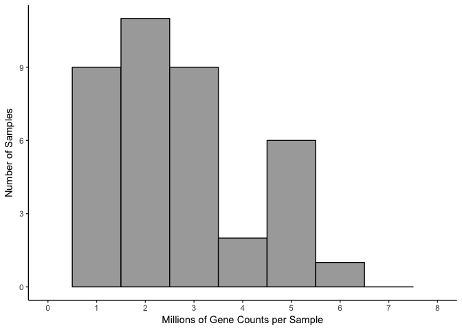

RNAseq gene expression analysis with DESeq2
-------------------------------------------

This workflow was modified from the DESeq2 tutorial found at: <https://www.bioconductor.org/packages/release/bioc/vignettes/DESeq2/inst/doc/DESeq2.pdf>

First I load a handful of packages for data wrangling, gene expression analysis, data visualization, and statistics.

``` r
library(dplyr) ## for filtering and selecting rows
library(plyr) ## for renmaing factors
library(reshape2) ## for melting dataframe
library(DESeq2) ## for gene expression analysis
library(edgeR)  ## for basic read counts status
library(magrittr) ## to use the weird pipe
library(genefilter)  ## for PCA fuction
library(ggplot2)

## Functions
source("functions_RNAseq.R")
source("resvalsfunction.R")

## set output file for figures 
knitr::opts_chunk$set(fig.path = '../figures/02_RNAseq/')
```

Now, I create data frames from three csv files - count: Contains counts for all transcripts generated from the program Kallisto. This data can be reproducibed from the file kallisto.Rmd - geneids: Contains the ensemble ids and gene names for all the transcripts in the counts data frame. This file will be used to convert transcipt counts to gene counts. This file was also created via kallisto.Rmd file - Traits: This file contains all the information I collected for each sample that was sequenced. Not all columns will be needed, so some are removed later.

``` r
count <- read.csv("../data/02_count.csv", row.names=1, check.names=FALSE )
geneids <- read.csv("../data/02_geneids.csv")
Traits <- read.csv("../data/02_JA16444samples.csv", sep=",", header = TRUE, stringsAsFactors=FALSE, na.string = "NA")
```

Rather than analyze transcript level counts, I want to examine gene-level counts. In this next section, I do some data wrangling to tidy the data and summarize the counts for all transcripts belonging to the same gene.

``` r
countbygene <- full_join(geneids, count) # merge count and gene id dataframes
```

    ## Joining, by = "id"

``` r
countbygene <- countbygene[-c(1:6,8:12)] # remove unnecesary columns (aka, keep gene name and counts for samples)
countbygene <- melt(countbygene, id=c("gene")) # lenghten 
countbygene$variable <- gsub('.{4}$', '', countbygene$variable) # string split to remove last for characters aka "_S##"
countbygene$variable <- gsub("\\_", "-", countbygene$variable) #replace _ with - in name
countbygene  <- dcast(countbygene, gene ~ variable, value.var= "value", fun.aggregate=mean) # widen by sum
row.names(countbygene) <- countbygene$gene # make gene the row name 
countbygene[1] <- NULL # now remove the gene name from the df
countbygene <- round(countbygene) # round all value to nearest 1s place
```

In this next section, I tidy the trait data for each sample so that I can calculate differential gene expression for the traits of interest. I also remove some samples for reasons described within the code blocks.

``` r
rownames(Traits) <- Traits$RNAseqID    # set $genoAPAsessionInd as rownames
Traits <- Traits[c(1,3,5:6,10:11)]  #keeping informative volumns
Traits <- Traits %>% dplyr::filter(!grepl("100|101|147-|148-|147D-CA1-1|145B-CA3-1|146C-CA3-4", RNAseqID))  
# remove 100, 100, 147, and 148:  homecage animals
# Remove 147D_CA1_1 and 145B_CA3_1: bad samples with no reads.
# Remove 146C-CA3-4: outlier on all pc analyses
Traits$APAconflict <- as.factor(paste(Traits$APA, Traits$Conflict, sep="_")) # adding combinatorial traits columns
Traits$ID <- gsub("[[:punct:]]", "", Traits$Mouse) #make a column that thas id without the dash
row.names(Traits) <- Traits$RNAseqID # make gene the row name 
Traits$APA <- NULL ## delete old APA column
names(Traits)[names(Traits)=="APAconflict"] <- "APA3" #rename  APA3 to match color scheme

# rename factors & group all Control animals into 1 group
Traits$APA <- Traits$APA3 
Traits$APA <- revalue(Traits$APA, c("Trained_Conflict" = "Conflict")) 
Traits$APA <- revalue(Traits$APA, c("Trained_NoConflict" = "Consistent")) 
Traits$APA <- revalue(Traits$APA, c("Yoked_Conflict" = "Control")) 
Traits$APA <- revalue(Traits$APA, c("Yoked_NoConflict" = "Control")) 

Traits$APA2 <- Traits$APA3 
Traits$APA2 <- revalue(Traits$APA2, c("Trained_Conflict" = "conflict")) 
Traits$APA2 <- revalue(Traits$APA2, c("Trained_NoConflict" = "consistent")) 
Traits$APA2 <- revalue(Traits$APA2, c("Yoked_Conflict" = "yoked_conflict")) 
Traits$APA2 <- revalue(Traits$APA2, c("Yoked_NoConflict" = "yoked_consistent")) 

# reorder 
Traits <- Traits[c(1:5,7:9)]
head(Traits)
```

    ##              RNAseqID   Mouse   Conflict Punch Slice     ID        APA
    ## 143A-CA3-1 143A-CA3-1 15-143A   Conflict   CA3     1 15143A   Conflict
    ## 143A-DG-1   143A-DG-1 15-143A   Conflict    DG     1 15143A   Conflict
    ## 143B-CA1-1 143B-CA1-1 15-143B   Conflict   CA1     1 15143B    Control
    ## 143B-DG-1   143B-DG-1 15-143B   Conflict    DG     1 15143B    Control
    ## 143C-CA1-1 143C-CA1-1 15-143C NoConflict   CA1     1 15143C Consistent
    ## 143D-CA1-3 143D-CA1-3 15-143D NoConflict   CA1     3 15143D    Control
    ##                        APA2
    ## 143A-CA3-1         conflict
    ## 143A-DG-1          conflict
    ## 143B-CA1-1   yoked_conflict
    ## 143B-DG-1    yoked_conflict
    ## 143C-CA1-1       consistent
    ## 143D-CA1-3 yoked_consistent

Now, we are ready to calculate differential gene expression using the DESeq package. For simplicity, I will use the standard nameing of "countData" and "colData" for the gene counts and gene information, respectively.

``` r
countData <- countbygene #set the countdata to be the countbygene df
colData <- Traits %>% arrange(RNAseqID) #set the coldata to be the countbygene df

## colData and countData must contain the exact same sample. I'll use the next three lines to make that happen
savecols <- as.character(colData$RNAseqID) #select the sample name column that corresponds to row names
savecols <- as.vector(savecols) # make it a vector
countData <- countData %>% dplyr::select(one_of(savecols)) # select just the columns that match the samples in colData


# colData must be factors
cols = c(1:8)
colData[,cols] %<>% lapply(function(x) as.factor(as.character(x)))

# summary data
colData %>% select(APA,Punch)  %>%  summary()
```

    ##          APA     Punch   
    ##  Conflict  :14   CA1:15  
    ##  Consistent: 9   CA3:13  
    ##  Control   :21   DG :16

``` r
colData %>% select(APA2,Punch)  %>%  summary()
```

    ##                APA2    Punch   
    ##  conflict        :14   CA1:15  
    ##  consistent      : 9   CA3:13  
    ##  yoked_conflict  :12   DG :16  
    ##  yoked_consistent: 9

``` r
dim(countData)
```

    ## [1] 22485    44

Total Gene Counts Per Sample
----------------------------

this could say something about data before normalization

``` r
## stats
counts <- countData
dim( counts )
```

    ## [1] 22485    44

``` r
colSums( counts ) / 1e06  # in millions of reads
```

    ## 143A-CA3-1  143A-DG-1 143B-CA1-1  143B-DG-1 143C-CA1-1 143D-CA1-3 
    ##   1.600535   2.662497   0.874614   1.019113   1.086358   0.540738 
    ##  143D-DG-3 144A-CA1-2 144A-CA3-2  144A-DG-2 144B-CA1-1 144B-CA3-1 
    ##   0.500935   1.504457   0.228021   1.575766   1.275137   0.506698 
    ## 144C-CA1-2 144C-CA3-2  144C-DG-2 144D-CA3-2  144D-DG-2 145A-CA1-2 
    ##   1.613785   0.647568   1.083336   1.209306   2.254320   2.375356 
    ## 145A-CA3-2  145A-DG-2 145B-CA1-1  145B-DG-1 146A-CA1-2 146A-CA3-2 
    ##   0.179967   0.690882   1.034066   0.720798   0.878270   1.511881 
    ##  146A-DG-2 146B-CA1-2 146B-CA3-2  146B-DG-2 146C-CA1-4  146C-DG-4 
    ##   0.591933   0.506014   1.056001   0.055549   0.662938   0.237419 
    ## 146D-CA1-3 146D-CA3-3  146D-DG-3 147C-CA1-3 147C-CA3-3  147C-DG-3 
    ##   0.194359   1.467877   0.043490   1.506436   3.020727   2.118624 
    ## 147D-CA3-1  147D-DG-1 148A-CA1-3 148A-CA3-3  148A-DG-3 148B-CA1-4 
    ##   2.377445   5.618550   2.590815   1.353197   1.917857   0.185637 
    ## 148B-CA3-4  148B-DG-4 
    ##   1.724144   0.398258

``` r
table( rowSums( counts ) )[ 1:30 ] # Number of genes with low counts
```

    ## 
    ##    0    1    2    3    4    5    6    7    8    9   10   11   12   13   14 
    ## 4392  419  329  252  212  196  152  143  124  103   93   78   90   97   79 
    ##   15   16   17   18   19   20   21   22   23   24   25   26   27   28   29 
    ##   60   71   83   67   65   61   70   55   56   62   56   50   44   37   40

``` r
rowsum <- as.data.frame(colSums( counts ) / 1e06 )
names(rowsum)[1] <- "millioncounts"
rowsum$sample <- row.names(rowsum)

ggplot(rowsum, aes(x=millioncounts)) + 
  geom_histogram(binwidth = 1, colour = "black", fill = "darkgrey") +
  theme_classic() +
  scale_x_continuous(name = "Millions of Gene Counts per Sample",
                     breaks = seq(0, 8, 1),
                     limits=c(0, 8)) +
  scale_y_continuous(name = "Number of Samples")
```



``` r
write.csv(colData, file = "../data/02a_colData.csv", row.names = F)
write.csv(countData, file = "../data/02a_countData.csv", row.names = T)
```
