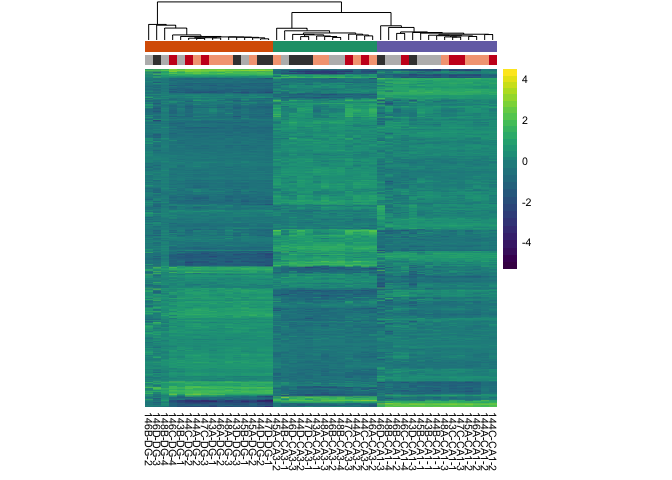

The figures made from this script were compiled in Adobe.

    library(ggplot2) ## for awesome plots!
    library(cowplot) ## for some easy to use themes
    library(dplyr) ## for filtering and selecting rows
    library(car) ## stats
    library(VennDiagram) ## venn diagrams
    library(pheatmap) ## awesome heatmaps
    library(viridis) # for awesome color pallette
    library(reshape2) ## for melting dataframe
    library(DESeq2) ## for gene expression analysis
    library(edgeR)  ## for basic read counts status
    library(magrittr) ## to use the weird pipe
    library(genefilter)  ## for PCA fuction
    library(ggrepel) ## for labeling volcano plot
    library(colorblindr) # simulates color-blind viewing 

    ## load functions 
    source("figureoptions.R")
    source("functions_RNAseq.R")

    ## set output file for figures 
    knitr::opts_chunk$set(fig.path = '../figures/02b_RNAseqAll/')

Design
------

The major comparision here is Hippocampal subfield: "DG","CA3", "CA1"
Behavioral Groups: "conflict", "consistent"

    ##                APA2    Punch   
    ##  conflict        :14   CA1:15  
    ##  consistent      : 9   CA3:13  
    ##  yoked_conflict  :12   DG :16  
    ##  yoked_consistent: 9

    ## class: DESeqDataSet 
    ## dim: 22485 44 
    ## metadata(1): version
    ## assays(1): counts
    ## rownames(22485): 0610007P14Rik 0610009B22Rik ... Zzef1 Zzz3
    ## rowData names(0):
    ## colnames(44): 143A-CA3-1 143A-DG-1 ... 148B-CA3-4 148B-DG-4
    ## colData names(8): RNAseqID Mouse ... APA APA2

    ## class: DESeqDataSet 
    ## dim: 17674 44 
    ## metadata(1): version
    ## assays(1): counts
    ## rownames(17674): 0610007P14Rik 0610009B22Rik ... Zzef1 Zzz3
    ## rowData names(0):
    ## colnames(44): 143A-CA3-1 143A-DG-1 ... 148B-CA3-4 148B-DG-4
    ## colData names(8): RNAseqID Mouse ... APA APA2

    ## [1] 1159

    ## [1] 771

    ## [1] 2122

Principle component analysis
----------------------------

    ## [1] 50 21  5  3  2  1  1  1  1

    ##             Df Sum Sq Mean Sq F value Pr(>F)    
    ## Punch        2  15879    7939   256.2 <2e-16 ***
    ## Residuals   41   1270      31                   
    ## ---
    ## Signif. codes:  0 '***' 0.001 '**' 0.01 '*' 0.05 '.' 0.1 ' ' 1

    ##   Tukey multiple comparisons of means
    ##     95% family-wise confidence level
    ## 
    ## Fit: aov(formula = PC1 ~ Punch, data = pcadata)
    ## 
    ## $Punch
    ##               diff        lwr       upr    p adj
    ## CA3-DG  -40.241740 -45.295804 -35.18768 0.000000
    ## CA1-DG  -38.806018 -43.670635 -33.94140 0.000000
    ## CA1-CA3   1.435721  -3.693307   6.56475 0.775999

    ##             Df Sum Sq Mean Sq F value Pr(>F)    
    ## Punch        2   7153    3576    1030 <2e-16 ***
    ## Residuals   41    142       3                   
    ## ---
    ## Signif. codes:  0 '***' 0.001 '**' 0.01 '*' 0.05 '.' 0.1 ' ' 1

    ##   Tukey multiple comparisons of means
    ##     95% family-wise confidence level
    ## 
    ## Fit: aov(formula = PC2 ~ Punch, data = pcadata)
    ## 
    ## $Punch
    ##              diff       lwr       upr p adj
    ## CA3-DG  -16.21577 -17.90743 -14.52411     0
    ## CA1-DG   15.81186  14.18361  17.44011     0
    ## CA1-CA3  32.02763  30.31088  33.74438     0

    ##             Df Sum Sq Mean Sq F value Pr(>F)
    ## APA2         3  231.4   77.13   1.854  0.153
    ## Residuals   40 1664.1   41.60

    ##             Df Sum Sq Mean Sq F value   Pr(>F)    
    ## APA2         3  495.0  165.01   12.01 9.57e-06 ***
    ## Residuals   40  549.5   13.74                     
    ## ---
    ## Signif. codes:  0 '***' 0.001 '**' 0.01 '*' 0.05 '.' 0.1 ' ' 1

    ##             Df Sum Sq Mean Sq F value Pr(>F)
    ## APA2         3   17.9   5.965   0.424  0.737
    ## Residuals   40  563.3  14.083

    ##             Df Sum Sq Mean Sq F value Pr(>F)
    ## APA2         3   31.2   10.41   0.963   0.42
    ## Residuals   40  432.4   10.81

    ## quartz_off_screen 
    ##                 2

    ## quartz_off_screen 
    ##                 2

Number of differentially expressed genes per two-way contrast
=============================================================

    contrast1 <- resvals(contrastvector = c("Punch", "CA1", "DG"), mypval = 0.05) # 2685

    ## [1] 1159

    contrast2 <- resvals(contrastvector = c("Punch", "CA1", "CA3"), mypval = 0.05) # 1411

    ## [1] 771

    contrast3 <- resvals(contrastvector = c("Punch", "CA3", "DG"), mypval = 0.05) # 3902

    ## [1] 2122

venn diagrams
-------------

Volcanos plots and and gene lists
---------------------------------
