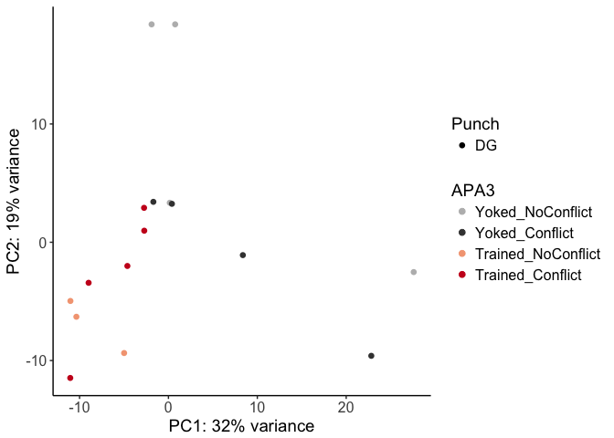
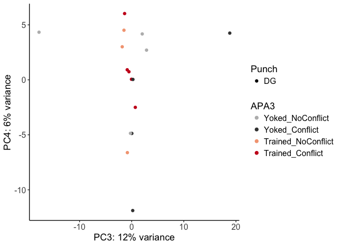

The figures made from this script were compiled in Adobe.

    library(ggplot2) ## for awesome plots!

    ## Warning: package 'ggplot2' was built under R version 3.3.2

    library(cowplot) ## for some easy to use themes
    library(dplyr) ## for filtering and selecting rows
    library(car) ## stats

    ## Warning: package 'car' was built under R version 3.3.2

    library(VennDiagram) ## venn diagrams
    library(pheatmap) ## awesome heatmaps
    library(viridis) # for awesome color pallette
    library(reshape2) ## for melting dataframe
    library(DESeq2) ## for gene expression analysis

    ## Warning: package 'DESeq2' was built under R version 3.3.2

    ## Warning: package 'S4Vectors' was built under R version 3.3.2

    ## Warning: package 'GenomicRanges' was built under R version 3.3.2

    ## Warning: package 'GenomeInfoDb' was built under R version 3.3.2

    library(edgeR)  ## for basic read counts status

    ## Warning: package 'edgeR' was built under R version 3.3.2

    ## Warning: package 'limma' was built under R version 3.3.2

    library(magrittr) ## to use the weird pipe
    library(genefilter)  ## for PCA fuction
    library(ggrepel) ## for labeling volcano plot

    ## Warning: package 'ggrepel' was built under R version 3.3.2

    library(colorblindr)

    ## load functions 
    source("figureoptions.R")
    source("functions_RNAseq.R")
    source("resvalsfunction.R")

    ## set output file for figures 
    knitr::opts_chunk$set(fig.path = '../figures/02_RNAseq/')

Design
------

The major comparision here is Hippocampal subfield: "DG","CA3", "CA1"
Behavioral Groups: "Yoked\_NoConflict", "Yoked\_Conflict",
"Trained\_NoConflict", "Trained\_Conflict"

    colData <- read.csv("../data/02a_colData.csv", header = T)
    countData <- read.csv("../data/02a_countData.csv", header = T, check.names = F, row.names = 1)

    ## create DESeq object using the factors Punch and APA
    dds <- DESeqDataSetFromMatrix(countData = countData,
                                  colData = colData,
                                  design = ~ Punch + APA3 + Punch*APA3)

    ## DESeq2 1.3.7 specify the factor levels
    dds$Punch <- factor(dds$Punch, levels=c("DG","CA3", "CA1"))
    dds$APA3 <- factor(dds$APA3, levels=c("Yoked_NoConflict", "Yoked_Conflict", "Trained_NoConflict", "Trained_Conflict"))

    dds # view the DESeq object - note numnber of genes

    ## class: DESeqDataSet 
    ## dim: 22485 44 
    ## metadata(1): version
    ## assays(1): counts
    ## rownames(22485): 0610007P14Rik 0610009B22Rik ... Zzef1 Zzz3
    ## rowData names(0):
    ## colnames(44): 143A-CA3-1 143A-DG-1 ... 148B-CA3-4 148B-DG-4
    ## colData names(8): RNAseqID Mouse ... APA APA3

    ## DESeq2 1.3.6 Pre-filtering genes with 0 counts
    dds <- dds[ rowSums(counts(dds)) > 1, ] 

    dds # view the DESeq object - note numnber of genes

    ## class: DESeqDataSet 
    ## dim: 17674 44 
    ## metadata(1): version
    ## assays(1): counts
    ## rownames(17674): 0610007P14Rik 0610009B22Rik ... Zzef1 Zzz3
    ## rowData names(0):
    ## colnames(44): 143A-CA3-1 143A-DG-1 ... 148B-CA3-4 148B-DG-4
    ## colData names(8): RNAseqID Mouse ... APA APA3

    # dim: 17674 44
    # 17,647 genes and 44 samples

    ## DESeq2 1.4  Differential expression analysi
    dds <- DESeq(dds)

    ## estimating size factors

    ## estimating dispersions

    ## gene-wise dispersion estimates

    ## mean-dispersion relationship

    ## final dispersion estimates

    ## fitting model and testing

    ## for variance stablized gene expression and log transformed data
    rld <- rlog(dds, blind=FALSE)

    contrast1 <- resvals(contrastvector = c("Punch", "CA1", "DG"), mypval = 0.05) #1159 (less than #2497)

    ## [1] 1159

    contrast2 <- resvals(contrastvector = c("Punch", "CA1", "CA3"), mypval = 0.05) #771 (less than #1803)

    ## [1] 771

    contrast3 <- resvals(contrastvector = c("Punch", "CA3", "DG"), mypval = 0.05) #2122 (less than #3445)

    ## [1] 2122

    contrast4 <- resvals(contrastvector = c("APA3", "Trained_NoConflict", "Yoked_NoConflict"), mypval = 0.05) #84 (less than #95)

    ## [1] 84

    contrast5 <- resvals(contrastvector = c("APA3", "Trained_Conflict", "Yoked_Conflict"), mypval = 0.05) #15 (less than #42)

    ## [1] 15

    contrast6 <- resvals(contrastvector = c("APA3", "Yoked_Conflict", "Yoked_NoConflict"), mypval = 0.05) #12 (more than 0)

    ## [1] 12

    contrast7 <- resvals(contrastvector = c("APA3", "Trained_Conflict", "Trained_NoConflict"), mypval = 0.05) #0 (same)

    ## [1] 0

    #create a new DF with the gene counts
    ## note: contrast1 had 0 differentially expressed genes, so it is not included 
    rldpadjs <- assay(rld)
    rldpadjs <- cbind(rldpadjs, contrast1, contrast2, contrast3, contrast4, contrast5, contrast6)
    rldpadjs <- as.data.frame(rldpadjs)
    rldpadjs <- rldpadjs[ , grepl( "padj" , names( rldpadjs ) ) ]
    head(rldpadjs)

    ##               padjPunchCA1DG padjPunchCA1CA3 padjPunchCA3DG
    ## 0610007P14Rik      1.0000000       0.9835488      0.5836819
    ## 0610009B22Rik      1.0000000       0.7858596      0.8185849
    ## 0610009L18Rik      0.3284587       0.4139070      0.9742717
    ## 0610009O20Rik      0.3330352       0.7812567      0.6674118
    ## 0610010F05Rik      1.0000000       0.8588004      0.5318662
    ## 0610010K14Rik      0.9639317       0.3508086      0.3359634
    ##               padjAPA3Trained_NoConflictYoked_NoConflict
    ## 0610007P14Rik                                          1
    ## 0610009B22Rik                                          1
    ## 0610009L18Rik                                          1
    ## 0610009O20Rik                                          1
    ## 0610010F05Rik                                          1
    ## 0610010K14Rik                                          1
    ##               padjAPA3Trained_ConflictYoked_Conflict
    ## 0610007P14Rik                                      1
    ## 0610009B22Rik                                      1
    ## 0610009L18Rik                                      1
    ## 0610009O20Rik                                      1
    ## 0610010F05Rik                                      1
    ## 0610010K14Rik                                      1
    ##               padjAPA3Yoked_ConflictYoked_NoConflict
    ## 0610007P14Rik                                      1
    ## 0610009B22Rik                                      1
    ## 0610009L18Rik                                      1
    ## 0610009O20Rik                                      1
    ## 0610010F05Rik                                      1
    ## 0610010K14Rik                                      1

    countData <- read.csv("../data/02a_countData.csv", header = T, check.names = F, row.names = 1)
    colData <- read.csv("../data/02a_colData.csv", header = T)
    colData$APA3 <- factor(colData$APA3, levels=c("Yoked_NoConflict", "Yoked_Conflict", "Trained_NoConflict", "Trained_Conflict"))

    colData <- colData %>% 
      filter(Punch == "DG") 
    savecols <- as.character(colData$RNAseqID) 
    savecols <- as.vector(savecols) 
    countData <- countData %>% dplyr::select(one_of(savecols)) 

    dds <- DESeqDataSetFromMatrix(countData = countData,
                                  colData = colData,
                                  design = ~ APA3 )

    dds$APA3 <- factor(dds$APA3, levels=c("Yoked_NoConflict", "Yoked_Conflict", "Trained_NoConflict", "Trained_Conflict"))

    dds <- dds[ rowSums(counts(dds)) > 1, ] 
    dds # dim: 16658 16  

    ## class: DESeqDataSet 
    ## dim: 16658 16 
    ## metadata(1): version
    ## assays(1): counts
    ## rownames(16658): 0610007P14Rik 0610009B22Rik ... Zzef1 Zzz3
    ## rowData names(0):
    ## colnames(16): 143A-DG-1 143B-DG-1 ... 148A-DG-3 148B-DG-4
    ## colData names(8): RNAseqID Mouse ... APA APA3

    dds <- DESeq(dds)

    ## estimating size factors

    ## estimating dispersions

    ## gene-wise dispersion estimates

    ## mean-dispersion relationship

    ## final dispersion estimates

    ## fitting model and testing

    rld <- rlog(dds, blind=FALSE)

    contrast4 <- resvals(contrastvector = c("APA3", "Trained_NoConflict", "Yoked_NoConflict"), mypval = 0.05) #74

    ## [1] 74

    contrast5 <- resvals(contrastvector = c("APA3", "Trained_Conflict", "Yoked_Conflict"), mypval = 0.05) #2

    ## [1] 2

    contrast6 <- resvals(contrastvector = c("APA3", "Yoked_Conflict", "Yoked_NoConflict"), mypval = 0.05) #0

    ## [1] 2

    contrast7 <- resvals(contrastvector = c("APA3", "Trained_Conflict", "Trained_NoConflict"), mypval = 0.05) #0 

    ## [1] 0

    pcadata <- pcadataframe(rld, intgroup=c("Punch","APA3"), returnData=TRUE)
    percentVar <- round(100 * attr(pcadata, "percentVar"))
    percentVar

    ## [1] 32 19 12  6  6  4  4  3  3

    aov1 <- aov(PC1 ~ APA3, data=pcadata)
    summary(aov1) 

    ##             Df Sum Sq Mean Sq F value Pr(>F)  
    ## APA3         3  813.7   271.2   3.132 0.0656 .
    ## Residuals   12 1039.2    86.6                 
    ## ---
    ## Signif. codes:  0 '***' 0.001 '**' 0.01 '*' 0.05 '.' 0.1 ' ' 1

    TukeyHSD(aov1, which = "APA3") 

    ##   Tukey multiple comparisons of means
    ##     95% family-wise confidence level
    ## 
    ## Fit: aov(formula = PC1 ~ APA3, data = pcadata)
    ## 
    ## $APA3
    ##                                            diff       lwr       upr
    ## Yoked_Conflict-Yoked_NoConflict       0.8207787 -18.71526 20.356818
    ## Trained_NoConflict-Yoked_NoConflict -15.4443530 -36.54569  5.656981
    ## Trained_Conflict-Yoked_NoConflict   -12.6753558 -31.20887  5.858158
    ## Trained_NoConflict-Yoked_Conflict   -16.2651317 -37.36647  4.836202
    ## Trained_Conflict-Yoked_Conflict     -13.4961346 -32.02965  5.037379
    ## Trained_Conflict-Trained_NoConflict   2.7689971 -17.40774 22.945732
    ##                                         p adj
    ## Yoked_Conflict-Yoked_NoConflict     0.9992658
    ## Trained_NoConflict-Yoked_NoConflict 0.1859964
    ## Trained_Conflict-Yoked_NoConflict   0.2305853
    ## Trained_NoConflict-Yoked_Conflict   0.1553505
    ## Trained_Conflict-Yoked_Conflict     0.1891702
    ## Trained_Conflict-Trained_NoConflict 0.9761261

    aov2 <- aov(PC2 ~ APA3, data=pcadata)
    summary(aov2) 

    ##             Df Sum Sq Mean Sq F value Pr(>F)  
    ## APA3         3  534.4  178.15   3.646 0.0446 *
    ## Residuals   12  586.4   48.87                 
    ## ---
    ## Signif. codes:  0 '***' 0.001 '**' 0.01 '*' 0.05 '.' 0.1 ' ' 1

    TukeyHSD(aov2, which = "APA3") 

    ##   Tukey multiple comparisons of means
    ##     95% family-wise confidence level
    ## 
    ## Fit: aov(formula = PC2 ~ APA3, data = pcadata)
    ## 
    ## $APA3
    ##                                           diff       lwr       upr
    ## Yoked_Conflict-Yoked_NoConflict     -10.421479 -25.09682  4.253863
    ## Trained_NoConflict-Yoked_NoConflict -16.292191 -32.14337 -0.441010
    ## Trained_Conflict-Yoked_NoConflict   -12.020080 -25.94233  1.902172
    ## Trained_NoConflict-Yoked_Conflict    -5.870712 -21.72189  9.980469
    ## Trained_Conflict-Yoked_Conflict      -1.598600 -15.52085 12.323652
    ## Trained_Conflict-Trained_NoConflict   4.272112 -10.88452 19.428740
    ##                                         p adj
    ## Yoked_Conflict-Yoked_NoConflict     0.2052640
    ## Trained_NoConflict-Yoked_NoConflict 0.0433400
    ## Trained_Conflict-Yoked_NoConflict   0.0994976
    ## Trained_NoConflict-Yoked_Conflict   0.6964793
    ## Trained_Conflict-Yoked_Conflict     0.9856949
    ## Trained_Conflict-Trained_NoConflict 0.8360728

    pcadata$APA3 <- factor(pcadata$APA3, levels=c("Yoked_NoConflict", "Yoked_Conflict", "Trained_NoConflict", "Trained_Conflict"))

    plotPCs(pcadata, 1, 2, aescolor = pcadata$APA3, colorname = "APA3", aesshape = pcadata$Punch, shapename = "Punch",  colorvalues = colorvalAPA3)

    ## Don't know how to automatically pick scale for object of type data.frame. Defaulting to continuous.

    ## Don't know how to automatically pick scale for object of type data.frame. Defaulting to continuous.

    plotPCs(pcadata, 3, 4, aescolor = pcadata$APA3, colorname = "APA3", aesshape = pcadata$Punch, shapename = "Punch",  colorvalues = colorvalAPA3)

    ## Don't know how to automatically pick scale for object of type data.frame. Defaulting to continuous.
    ## Don't know how to automatically pick scale for object of type data.frame. Defaulting to continuous.

    #write.csv(rldpadjs, file = "../data/02c_rldpadjs.csv", row.names = T)
    #write.csv(DEGes, file = "../data/02c_DEGes.csv", row.names = T)
    #write.csv(df, file = "../data/02c_df.csv", row.names = F)
    #write.csv(pcadata, file = "../data/02c_pcadata.csv", row.names = F)
    #write.table(percentVar, file = "../data/02c_percentVar.txt")
