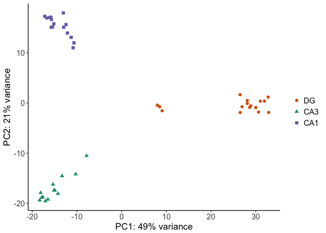
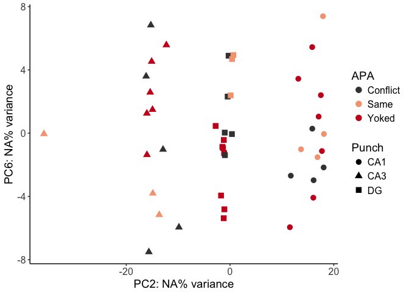
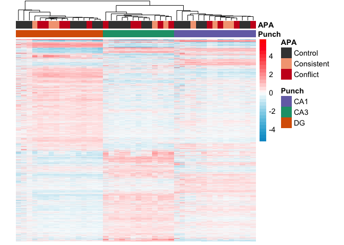

The figures made from this script were compiled in Adobe.

    library(ggplot2) ## for awesome plots!

    ## Warning: package 'ggplot2' was built under R version 3.3.2

    library(cowplot) ## for some easy to use themes
    library(dplyr) ## for filtering and selecting rows
    library(car) ## stats

    ## Warning: package 'car' was built under R version 3.3.2

    library(VennDiagram) ## venn diagrams
    library(pheatmap) ## awesome heatmaps
    library(viridis) # for awesome color pallette
    library(reshape2) ## for melting dataframe
    library(DESeq2) ## for gene expression analysis

    ## Warning: package 'DESeq2' was built under R version 3.3.2

    ## Warning: package 'S4Vectors' was built under R version 3.3.2

    ## Warning: package 'GenomicRanges' was built under R version 3.3.2

    ## Warning: package 'GenomeInfoDb' was built under R version 3.3.2

    library(edgeR)  ## for basic read counts status

    ## Warning: package 'edgeR' was built under R version 3.3.2

    ## Warning: package 'limma' was built under R version 3.3.2

    library(magrittr) ## to use the weird pipe
    library(genefilter)  ## for PCA fuction
    library(ggrepel) ## for labeling volcano plot

    ## Warning: package 'ggrepel' was built under R version 3.3.2

    library(colorblindr)

    ## load functions 
    source("figureoptions.R")
    source("functions_RNAseq.R")
    source("resvalsfunction.R")

    ## set output file for figures 
    knitr::opts_chunk$set(fig.path = '../figures/02_RNAseq/')

Design
------

The major comparision here is Hippocampal subfield: "DG","CA3", "CA1"
Behavioral Groups: "Yoked\_NoConflict", "Yoked\_Conflict",
"Trained\_NoConflict", "Trained\_Conflict"

    colData <- read.csv("../data/02a_colData.csv", header = T)
    countData <- read.csv("../data/02a_countData.csv", header = T, check.names = F, row.names = 1)

    ## create DESeq object using the factors Punch and APA
    dds <- DESeqDataSetFromMatrix(countData = countData,
                                  colData = colData,
                                  design = ~ Punch + APA3 + Punch*APA3)

    dds$Punch <- factor(dds$Punch, levels=c("DG","CA3", "CA1")) ## specify the factor levels
    dds$APA3 <- factor(dds$APA3, levels=c("Yoked_NoConflict", "Yoked_Conflict", "Trained_NoConflict", "Trained_Conflict")) ## specify the factor levels

    dds # view the DESeq object - note numnber of genes

    ## class: DESeqDataSet 
    ## dim: 22485 44 
    ## metadata(1): version
    ## assays(1): counts
    ## rownames(22485): 0610007P14Rik 0610009B22Rik ... Zzef1 Zzz3
    ## rowData names(0):
    ## colnames(44): 143A-CA3-1 143A-DG-1 ... 148B-CA3-4 148B-DG-4
    ## colData names(8): RNAseqID Mouse ... APA APA3

    dds <- dds[ rowSums(counts(dds)) > 1, ]  # DESeq2 1.3.6 Pre-filtering genes with 0 counts
    dds # view number of genes afternormalization and the number of samples

    ## class: DESeqDataSet 
    ## dim: 17674 44 
    ## metadata(1): version
    ## assays(1): counts
    ## rownames(17674): 0610007P14Rik 0610009B22Rik ... Zzef1 Zzz3
    ## rowData names(0):
    ## colnames(44): 143A-CA3-1 143A-DG-1 ... 148B-CA3-4 148B-DG-4
    ## colData names(8): RNAseqID Mouse ... APA APA3

    dds <- DESeq(dds) # Differential expression analysis

    ## estimating size factors

    ## estimating dispersions

    ## gene-wise dispersion estimates

    ## mean-dispersion relationship

    ## final dispersion estimates

    ## fitting model and testing

    rld <- rlog(dds, blind=FALSE) ## log transformed data

    #calculate significance of all two way comparisions
    contrast1 <- resvals(contrastvector = c("Punch", "CA1", "DG"), mypval = 0.05) 

    ## [1] 1159

    contrast2 <- resvals(contrastvector = c("Punch", "CA1", "CA3"), mypval = 0.05) 

    ## [1] 771

    contrast3 <- resvals(contrastvector = c("Punch", "CA3", "DG"), mypval = 0.05) 

    ## [1] 2122

    contrast4 <- resvals(contrastvector = c("APA3", "Trained_Conflict", "Yoked_NoConflict"), mypval = 0.05) 

    ## [1] 44

    res <- results(dds, contrast =c("APA3", "Trained_Conflict", "Yoked_NoConflict"), independentFiltering = F)
    resOrdered <- res[order(res$padj),]
    head(resOrdered, 10)

    ## log2 fold change (MLE): APA3 Trained_Conflict vs Yoked_NoConflict 
    ## Wald test p-value: APA3 Trained Conflict vs Yoked NoConflict 
    ## DataFrame with 10 rows and 6 columns
    ##         baseMean log2FoldChange     lfcSE      stat       pvalue
    ##        <numeric>      <numeric> <numeric> <numeric>    <numeric>
    ## Plk2   697.03923       1.755842 0.2654311  6.615057 3.714089e-11
    ## Arc    436.24502       2.319203 0.3620524  6.405712 1.496688e-10
    ## Smad7   25.81154       2.791659 0.4583514  6.090654 1.124505e-09
    ## Rasd1  105.85587       2.753659 0.4659285  5.910047 3.420104e-09
    ## Sgk1    27.18260       1.832578 0.3303984  5.546571 2.913259e-08
    ## Tiparp  48.63238       2.547994 0.4573295  5.571463 2.526094e-08
    ## Errfi1  75.94706       1.720348 0.3187191  5.397692 6.750354e-08
    ## Zdbf2   20.03179       1.889145 0.3550314  5.321065 1.031616e-07
    ## Frmd6  116.84596       2.209681 0.4233851  5.219081 1.798129e-07
    ## Junb   514.04985       1.726998 0.3338080  5.173628 2.295917e-07
    ##                padj
    ##           <numeric>
    ## Plk2   6.561681e-07
    ## Arc    1.322100e-06
    ## Smad7  6.622208e-06
    ## Rasd1  1.510574e-05
    ## Sgk1   8.578090e-05
    ## Tiparp 8.578090e-05
    ## Errfi1 1.703693e-04
    ## Zdbf2  2.278195e-04
    ## Frmd6  3.529728e-04
    ## Junb   4.056196e-04

    contrast5 <- resvals(contrastvector = c("APA3", "Trained_NoConflict", "Yoked_NoConflict"), mypval = 0.05) 

    ## [1] 84

    res <- results(dds, contrast =c("APA3", "Trained_NoConflict", "Yoked_NoConflict"), independentFiltering = F)
    resOrdered <- res[order(res$padj),]
    head(resOrdered, 10)

    ## log2 fold change (MLE): APA3 Trained_NoConflict vs Yoked_NoConflict 
    ## Wald test p-value: APA3 Trained NoConflict vs Yoked NoConflict 
    ## DataFrame with 10 rows and 6 columns
    ##         baseMean log2FoldChange     lfcSE      stat       pvalue
    ##        <numeric>      <numeric> <numeric> <numeric>    <numeric>
    ## Plk2   697.03923       2.352508 0.2999148  7.843919 4.366988e-15
    ## Arc    436.24502       2.932892 0.4081472  7.185868 6.678147e-13
    ## Frmd6  116.84596       3.294066 0.4749978  6.934908 4.064851e-12
    ## Dnaja1 106.22420       1.151488 0.1680492  6.852091 7.277826e-12
    ## Smad7   25.81154       3.476292 0.5075848  6.848691 7.452852e-12
    ## Lmna    26.32554       2.384168 0.3565015  6.687681 2.267346e-11
    ## Sgk1    27.18260       2.432382 0.3678629  6.612196 3.786597e-11
    ## Junb   514.04985       2.401985 0.3775447  6.362122 1.989857e-10
    ## Fbxo33  74.39061       2.984504 0.4886561  6.107576 1.011557e-09
    ## Ubc    469.30786       1.141296 0.1871946  6.096844 1.081828e-09
    ##                padj
    ##           <numeric>
    ## Plk2   7.715158e-11
    ## Arc    5.899141e-09
    ## Frmd6  2.393791e-08
    ## Dnaja1 2.633391e-08
    ## Smad7  2.633391e-08
    ## Lmna   6.676200e-08
    ## Sgk1   9.556829e-08
    ## Junb   4.394351e-07
    ## Fbxo33 1.911265e-06
    ## Ubc    1.911265e-06

    contrast6 <- resvals(contrastvector = c("APA3", "Yoked_Conflict", "Yoked_NoConflict"), mypval = 0.05)  

    ## [1] 12

    res <- results(dds, contrast =c("APA3", "Yoked_NoConflict", "Yoked_Conflict"), independentFiltering = F)
    resOrdered <- res[order(res$padj),]
    head(resOrdered, 10)

    ## log2 fold change (MLE): APA3 Yoked_NoConflict vs Yoked_Conflict 
    ## Wald test p-value: APA3 Yoked_NoConflict vs Yoked_Conflict 
    ## DataFrame with 10 rows and 6 columns
    ##           baseMean log2FoldChange     lfcSE      stat       pvalue
    ##          <numeric>      <numeric> <numeric> <numeric>    <numeric>
    ## Kcnc2    145.09714     -3.8170020 0.5808500 -6.571407 4.984192e-11
    ## Gm2115   250.24766     -3.4698844 0.6316131 -5.493686 3.936297e-08
    ## St8sia5   34.65231     -4.1709096 0.7707730 -5.411333 6.255716e-08
    ## Cnr1     176.42633     -3.8490675 0.7741110 -4.972243 6.618279e-07
    ## Dner      57.09091     -1.7593101 0.3740379 -4.703561 2.556629e-06
    ## Spock1    79.66333     -3.0533707 0.6697536 -4.558946 5.141097e-06
    ## Slc32a1   91.68713     -3.9723836 0.9097520 -4.366447 1.262841e-05
    ## Cpe     3074.70125     -0.9845432 0.2352792 -4.184574 2.857010e-05
    ## Me1       44.02835     -1.8032867 0.4263382 -4.229709 2.339937e-05
    ## Pou3f1   219.85725     -2.1494860 0.5143322 -4.179178 2.925641e-05
    ##                 padj
    ##            <numeric>
    ## Kcnc2   8.805571e-07
    ## Gm2115  3.477128e-04
    ## St8sia5 3.683991e-04
    ## Cnr1    2.923128e-03
    ## Dner    9.033594e-03
    ## Spock1  1.513796e-02
    ## Slc32a1 3.187231e-02
    ## Cpe     4.307275e-02
    ## Me1     4.307275e-02
    ## Pou3f1  4.307275e-02

    contrast7 <- resvals(contrastvector = c("APA3", "Trained_NoConflict", "Trained_Conflict"), mypval = 0.05) 

    ## [1] 0

    res <- results(dds, contrast = c("APA3", "Trained_NoConflict", "Trained_Conflict"), independentFiltering = F)
    resOrdered <- res[order(res$padj),]
    head(resOrdered, 10)

    ## log2 fold change (MLE): APA3 Trained_NoConflict vs Trained_Conflict 
    ## Wald test p-value: APA3 Trained_NoConflict vs Trained_Conflict 
    ## DataFrame with 10 rows and 6 columns
    ##                 baseMean log2FoldChange     lfcSE        stat    pvalue
    ##                <numeric>      <numeric> <numeric>   <numeric> <numeric>
    ## 0610007P14Rik 21.5461759     0.05019271 0.3742306  0.13412240 0.8933058
    ## 0610009B22Rik  6.4277426     0.76243785 0.6582895  1.15821053 0.2467781
    ## 0610009L18Rik  3.9008693    -0.53613979 1.1080722 -0.48384914 0.6284929
    ## 0610009O20Rik 48.6140661    -0.25676554 0.3790443 -0.67740248 0.4981506
    ## 0610010F05Rik  8.1466102     0.27012199 0.3928997  0.68750873 0.4917622
    ## 0610010K14Rik  1.9324187    -0.79827392 1.0021639 -0.79655024 0.4257123
    ## 0610012G03Rik 61.5516314    -0.11916134 0.3437908 -0.34661003 0.7288843
    ## 0610030E20Rik 39.9081366     0.10853833 0.4965014  0.21860629 0.8269568
    ## 0610037L13Rik  7.6331581    -0.04250870 0.4686990 -0.09069511 0.9277349
    ## 0610040J01Rik  0.9055227     0.92499512 1.2783405  0.72359054 0.4693172
    ##                    padj
    ##               <numeric>
    ## 0610007P14Rik         1
    ## 0610009B22Rik         1
    ## 0610009L18Rik         1
    ## 0610009O20Rik         1
    ## 0610010F05Rik         1
    ## 0610010K14Rik         1
    ## 0610012G03Rik         1
    ## 0610030E20Rik         1
    ## 0610037L13Rik         1
    ## 0610040J01Rik         1

    # depends on the previous chunch
    # saves pvalues in object for following chuncks
    rldpadjs <- assay(rld)
    rldpadjs <- cbind(rldpadjs, contrast1, contrast2, contrast3, contrast4, contrast5, contrast6)
    rldpadjs <- as.data.frame(rldpadjs)
    rldpadjs <- rldpadjs[ , grepl( "padj" , names( rldpadjs ) ) ]

Principle component analysis
----------------------------

    # create the dataframe using my function pcadataframe
    pcadata <- pcadataframe(rld, intgroup=c("Punch","APA3"), returnData=TRUE)
    percentVar <- round(100 * attr(pcadata, "percentVar"))
    percentVar

    ## [1] 50 21  5  3  2  1  1  1  1

    aov1 <- aov(PC1 ~ Punch, data=pcadata)
    summary(aov1) 

    ##             Df Sum Sq Mean Sq F value Pr(>F)    
    ## Punch        2  15879    7939   256.2 <2e-16 ***
    ## Residuals   41   1270      31                   
    ## ---
    ## Signif. codes:  0 '***' 0.001 '**' 0.01 '*' 0.05 '.' 0.1 ' ' 1

    TukeyHSD(aov1, which = "Punch") 

    ##   Tukey multiple comparisons of means
    ##     95% family-wise confidence level
    ## 
    ## Fit: aov(formula = PC1 ~ Punch, data = pcadata)
    ## 
    ## $Punch
    ##               diff        lwr       upr    p adj
    ## CA3-DG  -40.241740 -45.295804 -35.18768 0.000000
    ## CA1-DG  -38.806018 -43.670635 -33.94140 0.000000
    ## CA1-CA3   1.435721  -3.693307   6.56475 0.775999

    aov2 <- aov(PC2 ~ Punch, data=pcadata)
    summary(aov2) 

    ##             Df Sum Sq Mean Sq F value Pr(>F)    
    ## Punch        2   7153    3576    1030 <2e-16 ***
    ## Residuals   41    142       3                   
    ## ---
    ## Signif. codes:  0 '***' 0.001 '**' 0.01 '*' 0.05 '.' 0.1 ' ' 1

    TukeyHSD(aov2, which = "Punch") 

    ##   Tukey multiple comparisons of means
    ##     95% family-wise confidence level
    ## 
    ## Fit: aov(formula = PC2 ~ Punch, data = pcadata)
    ## 
    ## $Punch
    ##              diff       lwr       upr p adj
    ## CA3-DG  -16.21577 -17.90743 -14.52411     0
    ## CA1-DG   15.81186  14.18361  17.44011     0
    ## CA1-CA3  32.02763  30.31088  33.74438     0

    aov3 <- aov(PC3 ~ APA3, data=pcadata)
    summary(aov3) 

    ##             Df Sum Sq Mean Sq F value Pr(>F)
    ## APA3         3  231.4   77.13   1.854  0.153
    ## Residuals   40 1664.1   41.60

    TukeyHSD(aov3, which = "APA3")

    ##   Tukey multiple comparisons of means
    ##     95% family-wise confidence level
    ## 
    ## Fit: aov(formula = PC3 ~ APA3, data = pcadata)
    ## 
    ## $APA3
    ##                                            diff        lwr      upr
    ## Yoked_Conflict-Yoked_NoConflict      0.35729566  -7.266245 7.980836
    ## Trained_NoConflict-Yoked_NoConflict -4.43405326 -12.583961 3.715854
    ## Trained_Conflict-Yoked_NoConflict   -4.34540192 -11.731883 3.041079
    ## Trained_NoConflict-Yoked_Conflict   -4.79134892 -12.414890 2.832192
    ## Trained_Conflict-Yoked_Conflict     -4.70269759 -11.503983 2.098588
    ## Trained_Conflict-Trained_NoConflict  0.08865134  -7.297830 7.475132
    ##                                         p adj
    ## Yoked_Conflict-Yoked_NoConflict     0.9992793
    ## Trained_NoConflict-Yoked_NoConflict 0.4716167
    ## Trained_Conflict-Yoked_NoConflict   0.4030198
    ## Trained_NoConflict-Yoked_Conflict   0.3449927
    ## Trained_Conflict-Yoked_Conflict     0.2642615
    ## Trained_Conflict-Trained_NoConflict 0.9999878

    aov4 <- aov(PC4 ~ APA3, data=pcadata)
    summary(aov4) 

    ##             Df Sum Sq Mean Sq F value   Pr(>F)    
    ## APA3         3  495.0  165.01   12.01 9.57e-06 ***
    ## Residuals   40  549.5   13.74                     
    ## ---
    ## Signif. codes:  0 '***' 0.001 '**' 0.01 '*' 0.05 '.' 0.1 ' ' 1

    TukeyHSD(aov4, which = "APA3") 

    ##   Tukey multiple comparisons of means
    ##     95% family-wise confidence level
    ## 
    ## Fit: aov(formula = PC4 ~ APA3, data = pcadata)
    ## 
    ## $APA3
    ##                                          diff        lwr       upr
    ## Yoked_Conflict-Yoked_NoConflict      5.070513  0.6895431  9.451482
    ## Trained_NoConflict-Yoked_NoConflict  9.692828  5.0093745 14.376281
    ## Trained_Conflict-Yoked_NoConflict    7.680378  3.4356380 11.925118
    ## Trained_NoConflict-Yoked_Conflict    4.622315  0.2413459  9.003285
    ## Trained_Conflict-Yoked_Conflict      2.609865 -1.2985838  6.518315
    ## Trained_Conflict-Trained_NoConflict -2.012450 -6.2571898  2.232290
    ##                                         p adj
    ## Yoked_Conflict-Yoked_NoConflict     0.0177388
    ## Trained_NoConflict-Yoked_NoConflict 0.0000119
    ## Trained_Conflict-Yoked_NoConflict   0.0001090
    ## Trained_NoConflict-Yoked_Conflict   0.0352172
    ## Trained_Conflict-Yoked_Conflict     0.2931019
    ## Trained_Conflict-Trained_NoConflict 0.5864683

    lm4 <- lm(PC4~APA3*Punch, data=pcadata)
    summary(lm4)

    ## 
    ## Call:
    ## lm(formula = PC4 ~ APA3 * Punch, data = pcadata)
    ## 
    ## Residuals:
    ##     Min      1Q  Median      3Q     Max 
    ## -8.5450 -1.4830 -0.2901  1.2838  7.6813 
    ## 
    ## Coefficients:
    ##                                 Estimate Std. Error t value Pr(>|t|)    
    ## (Intercept)                       -8.319      1.872  -4.445 9.89e-05 ***
    ## APA3Yoked_Conflict                 7.960      2.647   3.007   0.0051 ** 
    ## APA3Trained_NoConflict            13.289      2.859   4.648 5.51e-05 ***
    ## APA3Trained_Conflict              11.515      2.511   4.586 6.60e-05 ***
    ## PunchCA3                           5.520      2.859   1.931   0.0624 .  
    ## PunchCA1                           3.015      3.242   0.930   0.3593    
    ## APA3Yoked_Conflict:PunchCA3       -6.809      4.043  -1.684   0.1019    
    ## APA3Trained_NoConflict:PunchCA3   -4.316      4.456  -0.969   0.3399    
    ## APA3Trained_Conflict:PunchCA3     -7.175      3.712  -1.933   0.0621 .  
    ## APA3Yoked_Conflict:PunchCA1       -3.154      4.101  -0.769   0.4475    
    ## APA3Trained_NoConflict:PunchCA1   -6.060      4.322  -1.402   0.1705    
    ## APA3Trained_Conflict:PunchCA1     -5.583      4.101  -1.362   0.1828    
    ## ---
    ## Signif. codes:  0 '***' 0.001 '**' 0.01 '*' 0.05 '.' 0.1 ' ' 1
    ## 
    ## Residual standard error: 3.743 on 32 degrees of freedom
    ## Multiple R-squared:  0.5707, Adjusted R-squared:  0.4232 
    ## F-statistic: 3.868 on 11 and 32 DF,  p-value: 0.001328

    anova(lm4) 

    ## Analysis of Variance Table
    ## 
    ## Response: PC4
    ##            Df Sum Sq Mean Sq F value    Pr(>F)    
    ## APA3        3 495.03 165.010 11.7756 2.328e-05 ***
    ## Punch       2  14.63   7.316  0.5221    0.5982    
    ## APA3:Punch  6  86.49  14.416  1.0287    0.4249    
    ## Residuals  32 448.41  14.013                      
    ## ---
    ## Signif. codes:  0 '***' 0.001 '**' 0.01 '*' 0.05 '.' 0.1 ' ' 1

    lm124 <- lm(PC1+PC2+PC4~APA3*Punch, data=pcadata)
    summary(lm124)

    ## 
    ## Call:
    ## lm(formula = PC1 + PC2 + PC4 ~ APA3 * Punch, data = pcadata)
    ## 
    ## Residuals:
    ##      Min       1Q   Median       3Q      Max 
    ## -14.0706  -2.5664  -0.0396   2.2012  19.3616 
    ## 
    ## Coefficients:
    ##                                 Estimate Std. Error t value Pr(>|t|)    
    ## (Intercept)                       14.554      3.533   4.119 0.000250 ***
    ## APA3Yoked_Conflict                 1.777      4.997   0.356 0.724416    
    ## APA3Trained_NoConflict            21.281      5.397   3.943 0.000411 ***
    ## APA3Trained_Conflict              16.934      4.740   3.572 0.001145 ** 
    ## PunchCA3                         -51.775      5.397  -9.593  6.2e-11 ***
    ## PunchCA1                         -18.413      6.120  -3.009 0.005081 ** 
    ## APA3Yoked_Conflict:PunchCA3        1.870      7.633   0.245 0.808019    
    ## APA3Trained_NoConflict:PunchCA3   -9.688      8.411  -1.152 0.257923    
    ## APA3Trained_Conflict:PunchCA3     -8.681      7.007  -1.239 0.224421    
    ## APA3Yoked_Conflict:PunchCA1        3.025      7.741   0.391 0.698602    
    ## APA3Trained_NoConflict:PunchCA1  -13.014      8.160  -1.595 0.120568    
    ## APA3Trained_Conflict:PunchCA1    -11.735      7.741  -1.516 0.139342    
    ## ---
    ## Signif. codes:  0 '***' 0.001 '**' 0.01 '*' 0.05 '.' 0.1 ' ' 1
    ## 
    ## Residual standard error: 7.067 on 32 degrees of freedom
    ## Multiple R-squared:  0.9373, Adjusted R-squared:  0.9158 
    ## F-statistic: 43.49 on 11 and 32 DF,  p-value: 4.385e-16

    anova(lm124)

    ## Analysis of Variance Table
    ## 
    ## Response: PC1 + PC2 + PC4
    ##            Df  Sum Sq Mean Sq  F value    Pr(>F)    
    ## APA3        3  1123.7   374.6   7.5011 0.0006154 ***
    ## Punch       2 22355.0 11177.5 223.8329 < 2.2e-16 ***
    ## APA3:Punch  6   411.8    68.6   1.3744 0.2548174    
    ## Residuals  32  1598.0    49.9                       
    ## ---
    ## Signif. codes:  0 '***' 0.001 '**' 0.01 '*' 0.05 '.' 0.1 ' ' 1

    pcadata$Punch <- factor(pcadata$Punch, levels=c("DG","CA3", "CA1"))
    pcadata$APA3 <- factor(pcadata$APA3, levels=c("Yoked_NoConflict", "Yoked_Conflict", "Trained_NoConflict", "Trained_Conflict"))

    plotPCs(pcadata, 2, 1, aescolor = pcadata$Punch, colorname = " ", aesshape = pcadata$Punch, shapename = " ",  colorvalues = colorvalPunch)

    ## Don't know how to automatically pick scale for object of type data.frame. Defaulting to continuous.
    ## Don't know how to automatically pick scale for object of type data.frame. Defaulting to continuous.

    plotPCs(pcadata, 1, 2, aescolor = pcadata$Punch, colorname = " ", aesshape = pcadata$Punch, shapename = " ",  colorvalues = colorvalPunch)

    ## Don't know how to automatically pick scale for object of type data.frame. Defaulting to continuous.
    ## Don't know how to automatically pick scale for object of type data.frame. Defaulting to continuous.

    plotPCs(pcadata, 4, 2, aescolor = pcadata$APA3, colorname = "APA3", aesshape = pcadata$Punch, shapename = "Punch",  colorvalues = colorvalAPA3)

    ## Don't know how to automatically pick scale for object of type data.frame. Defaulting to continuous.
    ## Don't know how to automatically pick scale for object of type data.frame. Defaulting to continuous.

heatmap
-------

    DEGes <- assay(rld)
    DEGes <- cbind(DEGes, contrast1, contrast2, contrast3, contrast4, contrast5, contrast6)
    DEGes <- as.data.frame(DEGes) # convert matrix to dataframe
    DEGes$rownames <- rownames(DEGes)  # add the rownames to the dataframe
    DEGes$padjmin <- with(DEGes, pmin(padjPunchCA1DG, padjPunchCA1CA3, padjPunchCA3DG, padjAPA3Trained_ConflictYoked_NoConflict, padjAPA3Trained_NoConflictYoked_NoConflict, padjAPA3Yoked_ConflictYoked_NoConflict)) 

    # create new col with min padj
    DEGes <- DEGes %>% filter(padjmin < 0.05)
    rownames(DEGes) <- DEGes$rownames
    drop.cols <-colnames(DEGes[,grep("padj|pval|rownames", colnames(DEGes))])
    DEGes <- DEGes %>% dplyr::select(-one_of(drop.cols))
    DEGes <- as.matrix(DEGes)
    DEGes <- DEGes - rowMeans(DEGes)
    head(DEGes)

    ##               143A-CA3-1   143A-DG-1  143B-CA1-1    143B-DG-1  143C-CA1-1
    ## 1110002E22Rik -1.0833310  1.09447575  0.11277087  1.536234214 -0.64208869
    ## 1190002N15Rik -1.6930115  0.86460666  0.87864960 -0.822167650  1.30725720
    ## 1700001L19Rik -0.3629614  0.04033542  0.07176535 -0.759675984  0.09149434
    ## 1700017B05Rik  1.2818973 -0.22770474 -0.81637649 -1.126171964 -0.63622070
    ## 1700025G04Rik -0.4285671  0.58267847 -0.33973657  0.002434446 -0.10255070
    ## 1700037H04Rik -0.2953360 -0.27160511  0.26467233 -0.229394719  0.08128465
    ##                143D-CA1-3  143D-DG-3 144A-CA1-2 144A-CA3-2    144A-DG-2
    ## 1110002E22Rik -0.52326649  1.2343402 -0.5269637 -0.4767183  1.332378108
    ## 1190002N15Rik  0.81677529  0.3685900  0.9729953 -2.0051544  2.025624972
    ## 1700001L19Rik  1.50472242  0.1609843  0.1480979 -0.1581453  0.166567431
    ## 1700017B05Rik  0.03333658 -1.2199645 -0.5447895  0.9312447  0.001643379
    ## 1700025G04Rik -0.78851623  0.3123011 -0.7731302  0.3843327  0.711696891
    ## 1700037H04Rik  0.33973297 -0.5304398  0.3526040  0.3338690 -0.398840481
    ##               144B-CA1-1  144B-CA3-1  144C-CA1-2  144C-CA3-2   144C-DG-2
    ## 1110002E22Rik -0.8462465 -0.75733093 -0.57711876 -0.33240748  1.33933017
    ## 1190002N15Rik  1.0252397 -1.21352968  0.33427052 -1.07748217  1.76830286
    ## 1700001L19Rik  0.2145950 -0.51396172  0.08079859 -0.77031928 -0.25252644
    ## 1700017B05Rik -0.4343375 -0.29069624 -0.46029811  1.18410951  0.05409183
    ## 1700025G04Rik -0.9691764 -0.30707866 -0.07667259  0.01536310  0.57091971
    ## 1700037H04Rik  0.5031622 -0.02800135  0.24910597  0.01808521 -0.17529056
    ##               144D-CA3-2  144D-DG-2 145A-CA1-2   145A-CA3-2   145A-DG-2
    ## 1110002E22Rik -0.9759447  0.8846281 -0.6430767 -0.004731382  0.09353827
    ## 1190002N15Rik -0.9892065 -0.3148591  0.9701397 -1.085475953  0.58845745
    ## 1700001L19Rik -0.1434028  0.1479701  0.6483403 -0.071423219 -0.64665723
    ## 1700017B05Rik  0.8553547 -0.2487362 -0.9048225 -0.078963937  0.27009299
    ## 1700025G04Rik  0.1208559  0.7110799 -0.7535978  0.937082748  0.24592672
    ## 1700037H04Rik  0.2210108 -0.3462928  0.4420789  0.460904998 -0.34582234
    ##               145B-CA1-1   145B-DG-1 146A-CA1-2 146A-CA3-2  146A-DG-2
    ## 1110002E22Rik -0.9442638  1.46555001 -0.9122876  0.4307859  1.1732265
    ## 1190002N15Rik  0.5915005 -0.01099638  0.7674245 -0.8695557  0.8157229
    ## 1700001L19Rik  0.5135281  0.05634693  0.3376673 -0.5485689  0.2679224
    ## 1700017B05Rik -0.3010995 -0.58440474 -0.1054121  0.5548562 -0.5790899
    ## 1700025G04Rik -0.3377799  0.47393430 -0.3113572  0.1334224  0.3468764
    ## 1700037H04Rik -0.3436999 -0.35364299  0.5278358  0.2031772 -0.1399296
    ##                146B-CA1-2  146B-CA3-2  146B-DG-2 146C-CA1-4   146C-DG-4
    ## 1110002E22Rik  0.81713044 -0.97002899  0.3446434  0.6408431 -0.55970909
    ## 1190002N15Rik  1.36829262 -0.89851294  1.0855661  1.2613900  1.24292804
    ## 1700001L19Rik  0.87571795  0.07732964 -0.1957861  0.6454030 -0.26998651
    ## 1700017B05Rik  0.38076363  1.02956421 -0.3088562  0.1772477 -0.27524196
    ## 1700025G04Rik -0.35644090  0.06531223  0.1712367 -0.8345887  0.59007627
    ## 1700037H04Rik -0.05236455 -0.06192740 -0.1962746  0.2980729 -0.02812915
    ##               146D-CA1-3  146D-CA3-3  146D-DG-3 147C-CA1-3 147C-CA3-3
    ## 1110002E22Rik -0.4658754 -1.04999782 -0.1214219 -0.2687207 -0.6112710
    ## 1190002N15Rik -0.1793628 -2.10158033 -1.0363639  0.9422704 -1.0133232
    ## 1700001L19Rik -0.4848017 -0.44302142 -0.1622427  0.2825472 -0.1750383
    ## 1700017B05Rik -1.3905242  1.69865031 -0.6695956 -0.7342882  0.6909482
    ## 1700025G04Rik -0.8363397 -0.08978917  0.7602526 -0.4772916  0.2923989
    ## 1700037H04Rik  0.1280606  0.13029668 -0.1631452  0.1945667  0.3943687
    ##                147C-DG-3 147D-CA3-1  147D-DG-1 148A-CA1-3  148A-CA3-3
    ## 1110002E22Rik  1.8060036 -1.1475118  1.1515731 -0.8780319 -0.23376752
    ## 1190002N15Rik  1.1320310 -1.8428623 -0.3908881  1.1522448 -2.15942992
    ## 1700001L19Rik  0.1973363 -0.2882133 -0.1076160  0.6499761  0.07512853
    ## 1700017B05Rik -0.2505296  0.5147122  0.1371877 -0.3959151  0.75662979
    ## 1700025G04Rik  0.6960441  0.5472922  0.2828157 -0.2778967 -0.20677484
    ## 1700037H04Rik -0.5404735  0.3192227 -0.4063242  0.2925692 -0.16401329
    ##                148A-DG-3 148B-CA1-4  148B-CA3-4   148B-DG-4
    ## 1110002E22Rik  1.5286846 -0.3909821 -1.08271690  0.03967486
    ## 1190002N15Rik  0.2693212 -0.1914015 -1.29937904 -1.35505822
    ## 1700001L19Rik -0.4162493 -0.4144141 -0.29871376  0.22915087
    ## 1700017B05Rik -0.4375145  0.9805281  1.09284920  0.39584580
    ## 1700025G04Rik  0.5739416 -1.0853577 -0.09306877 -0.08256382
    ## 1700037H04Rik -0.3063140 -0.4094021 -0.18407194  0.21605402

    ## the heatmap annotation file
    df <- as.data.frame(colData(dds)[,c("Punch","APA3")]) ## matrix to df

    rownames(df) <- names(countData)
    ann_colors <- ann_colors3 #use 

    # make sure the data is a matrix
    DEGes <- as.matrix(DEGes) 

    # set color breaks
    paletteLength <- 30
    myBreaks <- c(seq(min(DEGes), 0, length.out=ceiling(paletteLength/2) + 1), 
                  seq(max(DEGes)/paletteLength, max(DEGes), length.out=floor(paletteLength/2)))

    pheatmap(DEGes, show_colnames=T, show_rownames = F,
             annotation_col=df, annotation_colors = ann_colors,
             treeheight_row = 0, treeheight_col = 25,
             fontsize = 11, 
             #width=4.5, height=3,
             border_color = "grey60" ,
             color = viridis(30),
             cellwidth = 8, 
             clustering_method="average",
             breaks=myBreaks,
             clustering_distance_cols="correlation" 
             )

    # for adobe
    pheatmap(DEGes, show_colnames=F, show_rownames = F,
             annotation_col=df, annotation_colors = ann_colors,
             treeheight_row = 0, treeheight_col = 50,
             fontsize = 10, 
             #width=4.5, height=3,
             border_color = "grey60" ,
             color = viridis(30),
             cellwidth = 8, 
             clustering_method="average",
             breaks=myBreaks,
             clustering_distance_cols="correlation",
             filename = "../figures/02_RNAseq/heatmap02b.pdf"
             )

    #write.csv(rldpadjs, file = "../data/02b_rldpadjs.csv", row.names = T)
    #write.csv(DEGes, file = "../data/02b_DEGes.csv", row.names = T)
    #write.csv(df, file = "../data/02b_df.csv", row.names = F)
    #write.csv(pcadata, file = "../data/02b_pcadata.csv", row.names = F)
    #write.table(percentVar, file = "../data/02b_percentVar.txt")
