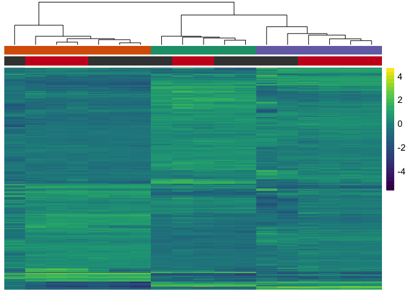

The figures made from this script were compiled in Adobe.

    library(ggplot2) ## for awesome plots!
    library(cowplot) ## for some easy to use themes
    library(dplyr) ## for filtering and selecting rows
    library(car) ## stats
    library(VennDiagram) ## venn diagrams
    library(pheatmap) ## awesome heatmaps
    library(viridis) # for awesome color pallette
    library(reshape2) ## for melting dataframe
    library(DESeq2) ## for gene expression analysis
    library(edgeR)  ## for basic read counts status
    library(magrittr) ## to use the weird pipe
    library(genefilter)  ## for PCA fuction
    library(ggrepel) ## for labeling volcano plot
    library(colorblindr) # simulates color-blind viewing 

    ## load functions 
    source("figureoptions.R")
    source("functions_RNAseq.R")

    ## set output file for figures 
    knitr::opts_chunk$set(fig.path = '../figures/02_RNAseq_ConsistentYoked/')

Design
------

The major comparision here is Hippocampal subfield: "DG","CA3", "CA1"
Behavioral Groups: "yoked\_consistent", "consistent"

    ##                APA2   Punch  
    ##  consistent      :9   CA1:6  
    ##  yoked_consistent:9   CA3:5  
    ##                       DG :7

Overall differential Gene Expression analysis
---------------------------------------------

    ## class: DESeqDataSet 
    ## dim: 22485 18 
    ## metadata(1): version
    ## assays(1): counts
    ## rownames(22485): 0610007P14Rik 0610009B22Rik ... Zzef1 Zzz3
    ## rowData names(0):
    ## colnames(18): 143C-CA1-1 143D-CA1-3 ... 147D-CA3-1 147D-DG-1
    ## colData names(8): RNAseqID Mouse ... APA APA2

    ## class: DESeqDataSet 
    ## dim: 17023 18 
    ## metadata(1): version
    ## assays(1): counts
    ## rownames(17023): 0610007P14Rik 0610009B22Rik ... Zzef1 Zzz3
    ## rowData names(0):
    ## colnames(18): 143C-CA1-1 143D-CA1-3 ... 147D-CA3-1 147D-DG-1
    ## colData names(8): RNAseqID Mouse ... APA APA2

    ## estimating size factors

    ## estimating dispersions

    ## gene-wise dispersion estimates

    ## mean-dispersion relationship

    ## final dispersion estimates

    ## fitting model and testing

Principle component analysis
----------------------------

    ## [1] 48 19  8  5  3  3  2  2  2

    ##             Df Sum Sq Mean Sq F value   Pr(>F)    
    ## Punch        2   8783    4391   148.3 1.32e-10 ***
    ## Residuals   15    444      30                     
    ## ---
    ## Signif. codes:  0 '***' 0.001 '**' 0.01 '*' 0.05 '.' 0.1 ' ' 1

    ##   Tukey multiple comparisons of means
    ##     95% family-wise confidence level
    ## 
    ## Fit: aov(formula = PC1 ~ Punch, data = pcadata)
    ## 
    ## $Punch
    ##               diff        lwr       upr     p adj
    ## CA3-DG  -46.734931 -55.011766 -38.45810 0.0000000
    ## CA1-DG  -44.030613 -51.894816 -36.16641 0.0000000
    ## CA1-CA3   2.704319  -5.855083  11.26372 0.6963686

    ##             Df Sum Sq Mean Sq F value   Pr(>F)    
    ## Punch        2   3598  1798.8   306.5 6.86e-13 ***
    ## Residuals   15     88     5.9                     
    ## ---
    ## Signif. codes:  0 '***' 0.001 '**' 0.01 '*' 0.05 '.' 0.1 ' ' 1

    ##   Tukey multiple comparisons of means
    ##     95% family-wise confidence level
    ## 
    ## Fit: aov(formula = PC2 ~ Punch, data = pcadata)
    ## 
    ## $Punch
    ##              diff       lwr       upr p adj
    ## CA3-DG  -18.59068 -22.27528 -14.90609     0
    ## CA1-DG   17.69727  14.19637  21.19818     0
    ## CA1-CA3  36.28796  32.47757  40.09834     0

    ##             Df Sum Sq Mean Sq F value Pr(>F)  
    ## APA2         1  334.3   334.3   4.606 0.0475 *
    ## Residuals   16 1161.1    72.6                 
    ## ---
    ## Signif. codes:  0 '***' 0.001 '**' 0.01 '*' 0.05 '.' 0.1 ' ' 1

    ##             Df Sum Sq Mean Sq F value  Pr(>F)   
    ## APA2         1  427.5   427.5   11.09 0.00424 **
    ## Residuals   16  616.6    38.5                   
    ## ---
    ## Signif. codes:  0 '***' 0.001 '**' 0.01 '*' 0.05 '.' 0.1 ' ' 1

    ## quartz_off_screen 
    ##                 2

    ## quartz_off_screen 
    ##                 2

Number of differentially expressed genes per two-way contrast
=============================================================

    #calculate significance of all two way comparisions
    # see source "functions_RNAseq.R" 

    contrast1 <- resvals(contrastvector = c("Punch", "CA1", "DG"), mypval = 0.05) # 1087

    ## [1] 1087

    contrast2 <- resvals(contrastvector = c("Punch", "CA1", "CA3"), mypval = 0.05) # 738

    ## [1] 738

    contrast3 <- resvals(contrastvector = c("Punch", "CA3", "DG"), mypval = 0.05) # 1964

    ## [1] 1964

    contrast5 <- resvals(contrastvector = c("APA2", "consistent", "yoked_consistent"), mypval = 0.05) # 90

    ## [1] 90

venn diagrams
-------------

    candidates <- list("consistent vs yoked" = venn5 , "DG vs CA3" = venn3,  "CA3 vs CA1" = venn2, "DG vs CA1" = venn1 )

    prettyvenn <- venn.diagram(
      scaled=T,
      x = candidates, filename=NULL, 
      col = "black",
      fill = c( "white", "white", "white", "white"),
      alpha = 0.5,
      cex = 1, fontfamily = "sans", #fontface = "bold",
      cat.default.pos = "text",
      #cat.dist = c(0.08, 0.08, 0.08), cat.pos = 1,
      cat.cex = 1, cat.fontfamily = "sans")
    grid.draw(prettyvenn)

heatmap
-------

Volcanos plots and and gene lists
---------------------------------

DG only
-------

    ##                APA2   Punch 
    ##  consistent      :3   DG:7  
    ##  yoked_consistent:4

    ## class: DESeqDataSet 
    ## dim: 16046 7 
    ## metadata(1): version
    ## assays(1): counts
    ## rownames(16046): 0610007P14Rik 0610009B22Rik ... Zzef1 Zzz3
    ## rowData names(0):
    ## colnames(7): 143D-DG-3 144C-DG-2 ... 147C-DG-3 147D-DG-1
    ## colData names(8): RNAseqID Mouse ... APA APA2

    ## 
    ## out of 16046 with nonzero total read count
    ## adjusted p-value < 0.05
    ## LFC > 0 (up)     : 80, 0.5% 
    ## LFC < 0 (down)   : 0, 0% 
    ## outliers [1]     : 63, 0.39% 
    ## low counts [2]   : 4950, 31% 
    ## (mean count < 3)
    ## [1] see 'cooksCutoff' argument of ?results
    ## [2] see 'independentFiltering' argument of ?results

    ## log2 fold change (MAP): APA2 consistent vs yoked_consistent 
    ## Wald test p-value: APA2 consistent vs yoked_consistent 
    ## DataFrame with 10 rows and 6 columns
    ##         baseMean log2FoldChange     lfcSE      stat       pvalue
    ##        <numeric>      <numeric> <numeric> <numeric>    <numeric>
    ## Fosl2  666.39006       2.299759 0.2760222  8.331790 7.962919e-17
    ## Frmd6  261.86447       2.668276 0.3282861  8.127897 4.368026e-16
    ## Smad7   49.01610       2.651115 0.3489383  7.597662 3.015288e-14
    ## Egr4   871.89135       2.553042 0.3424629  7.454945 8.990526e-14
    ## Rgs2   100.07527       2.197778 0.3203207  6.861181 6.829375e-12
    ## Rasd1   72.25591       2.388383 0.3504855  6.814499 9.459298e-12
    ## Arc    503.90876       2.310592 0.3450256  6.696870 2.129310e-11
    ## Fbxo33 173.47159       2.314393 0.3479031  6.652407 2.883379e-11
    ## Homer1  80.60137       2.300618 0.3486729  6.598213 4.161432e-11
    ## Ranbp2 669.89801       1.702832 0.2597470  6.555733 5.536906e-11
    ##                padj
    ##           <numeric>
    ## Fosl2  8.785489e-13
    ## Frmd6  2.409622e-12
    ## Smad7  1.108923e-10
    ## Egr4   2.479812e-10
    ## Rgs2   1.506970e-08
    ## Rasd1  1.739407e-08
    ## Arc    3.356097e-08
    ## Fbxo33 3.976541e-08
    ## Homer1 5.101453e-08
    ## Ranbp2 6.108869e-08

    ## quartz_off_screen 
    ##                 2

CA3 only
--------

    ##                APA2   Punch  
    ##  consistent      :2   CA3:5  
    ##  yoked_consistent:3

    ## class: DESeqDataSet 
    ## dim: 15425 5 
    ## metadata(1): version
    ## assays(1): counts
    ## rownames(15425): 0610007P14Rik 0610009B22Rik ... Zzef1 Zzz3
    ## rowData names(0):
    ## colnames(5): 144C-CA3-2 144D-CA3-2 146D-CA3-3 147C-CA3-3
    ##   147D-CA3-1
    ## colData names(8): RNAseqID Mouse ... APA APA2

    ## log2 fold change (MAP): APA2 consistent vs yoked_consistent 
    ## Wald test p-value: APA2 consistent vs yoked_consistent 
    ## DataFrame with 10 rows and 6 columns
    ##          baseMean log2FoldChange     lfcSE      stat       pvalue
    ##         <numeric>      <numeric> <numeric> <numeric>    <numeric>
    ## Thbs1    21.54899      1.9539977 0.3689553  5.296028 1.183486e-07
    ## Sco2     15.77736      1.6527159 0.3479284  4.750161 2.032546e-06
    ## Btg2    204.96368      1.3563999 0.2944856  4.605998 4.104932e-06
    ## Daam2   308.99371      1.1830436 0.2574477  4.595278 4.321737e-06
    ## Id2     102.05993      1.3318181 0.2985413  4.461085 8.154567e-06
    ## Ccl9     24.03364      1.5774882 0.3689723  4.275356 1.908318e-05
    ## Epas1   766.52508      0.9692344 0.2279431  4.252089 2.117858e-05
    ## Gpr37l1 472.80164      0.9260359 0.2178796  4.250218 2.135629e-05
    ## Tjp2     97.30247      1.2358028 0.3016649  4.096608 4.192483e-05
    ## Gm20517  16.85856     -1.4201604 0.3610495 -3.933423 8.374478e-05
    ##                padj
    ##           <numeric>
    ## Thbs1   0.001824817
    ## Sco2    0.015669915
    ## Btg2    0.016659215
    ## Daam2   0.016659215
    ## Id2     0.025147053
    ## Ccl9    0.041161572
    ## Epas1   0.041161572
    ## Gpr37l1 0.041161572
    ## Tjp2    0.071826545
    ## Gm20517 0.111760956

    ## 
    ## out of 15425 with nonzero total read count
    ## adjusted p-value < 0.05
    ## LFC > 0 (up)     : 8, 0.052% 
    ## LFC < 0 (down)   : 0, 0% 
    ## outliers [1]     : 6, 0.039% 
    ## low counts [2]   : 0, 0% 
    ## (mean count < 0)
    ## [1] see 'cooksCutoff' argument of ?results
    ## [2] see 'independentFiltering' argument of ?results

    ## quartz_off_screen 
    ##                 2

CA1 only
--------

    ##                APA2   Punch  
    ##  consistent      :4   CA1:6  
    ##  yoked_consistent:2

    ## class: DESeqDataSet 
    ## dim: 15390 6 
    ## metadata(1): version
    ## assays(1): counts
    ## rownames(15390): 0610007P14Rik 0610009B22Rik ... Zzef1 Zzz3
    ## rowData names(0):
    ## colnames(6): 143C-CA1-1 143D-CA1-3 ... 146D-CA1-3 147C-CA1-3
    ## colData names(8): RNAseqID Mouse ... APA APA2

    ## log2 fold change (MAP): APA2 consistent vs yoked_consistent 
    ## Wald test p-value: APA2 consistent vs yoked_consistent 
    ## DataFrame with 10 rows and 6 columns
    ##          baseMean log2FoldChange     lfcSE      stat       pvalue
    ##         <numeric>      <numeric> <numeric> <numeric>    <numeric>
    ## Gm6768   14.89428      -4.023894 0.5894382 -6.826659 8.691494e-12
    ## Hspa1a  385.85472       2.282090 0.3372582  6.766596 1.318474e-11
    ## Hspa1b  476.99747       1.583964 0.2664930  5.943738 2.785950e-09
    ## Inhbb    21.24564      -2.837061 0.5064082 -5.602321 2.115003e-08
    ## Adamts1  41.68130       2.549344 0.4625896  5.511027 3.567455e-08
    ## Srprb    24.80664       3.035137 0.5640424  5.381045 7.405484e-08
    ## Gad2    100.51894       2.371680 0.4480075  5.293841 1.197738e-07
    ## Grin2b  339.48179       1.317473 0.2493059  5.284565 1.260035e-07
    ## Prps2    30.62174       2.648062 0.5095705  5.196655 2.029062e-07
    ## Plxna4  478.83565       1.348057 0.2613733  5.157590 2.501486e-07
    ##                 padj
    ##            <numeric>
    ## Gm6768  6.201441e-08
    ## Hspa1a  6.201441e-08
    ## Hspa1b  8.735809e-06
    ## Inhbb   4.973958e-05
    ## Adamts1 6.711809e-05
    ## Srprb   1.161056e-04
    ## Gad2    1.481644e-04
    ## Grin2b  1.481644e-04
    ## Prps2   2.120820e-04
    ## Plxna4  2.353148e-04

    ## 
    ## out of 15390 with nonzero total read count
    ## adjusted p-value < 0.05
    ## LFC > 0 (up)     : 120, 0.78% 
    ## LFC < 0 (down)   : 46, 0.3% 
    ## outliers [1]     : 25, 0.16% 
    ## low counts [2]   : 5958, 39% 
    ## (mean count < 6)
    ## [1] see 'cooksCutoff' argument of ?results
    ## [2] see 'independentFiltering' argument of ?results

    ## quartz_off_screen 
    ##                 2
