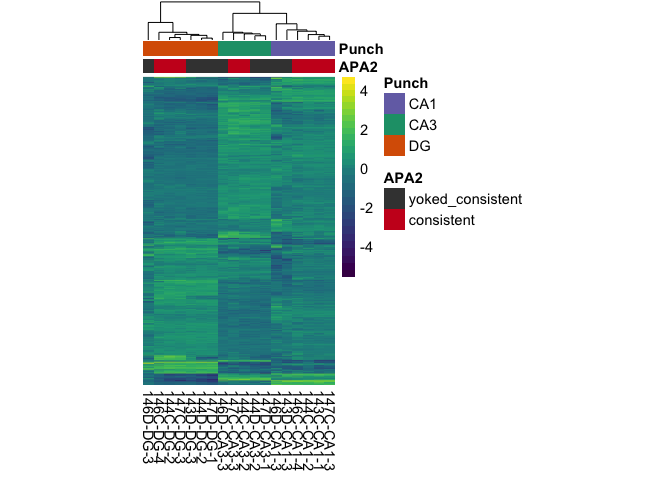
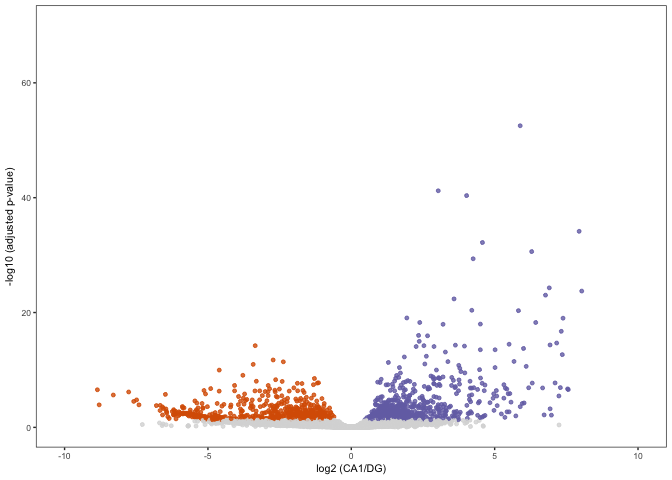
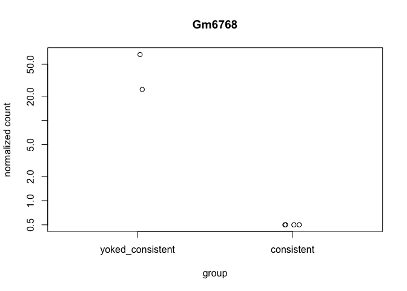
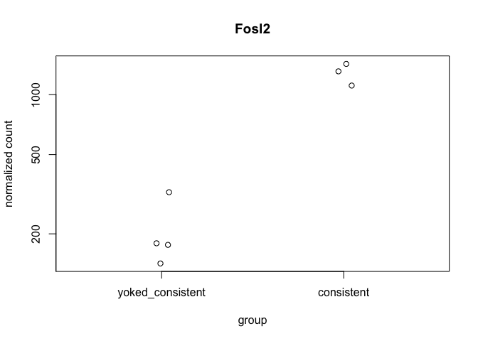
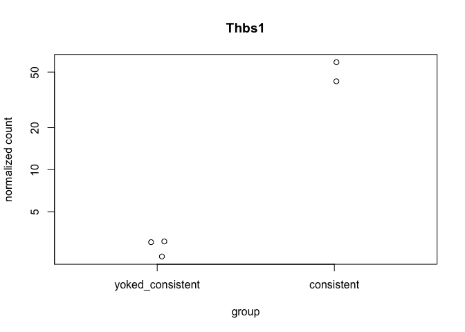

The figures made from this script were compiled in Adobe.

    library(ggplot2) ## for awesome plots!
    library(cowplot) ## for some easy to use themes
    library(dplyr) ## for filtering and selecting rows
    library(car) ## stats
    library(VennDiagram) ## venn diagrams
    library(pheatmap) ## awesome heatmaps
    library(viridis) # for awesome color pallette
    library(reshape2) ## for melting dataframe
    library(DESeq2) ## for gene expression analysis
    library(edgeR)  ## for basic read counts status
    library(magrittr) ## to use the weird pipe
    library(genefilter)  ## for PCA fuction
    library(ggrepel) ## for labeling volcano plot
    library(colorblindr) # simulates color-blind viewing 

    ## load functions 
    source("figureoptions.R")
    source("functions_RNAseq.R")

    ## set output file for figures 
    knitr::opts_chunk$set(fig.path = '../figures/02_RNAseq_ConsistentYoked/')

    colData <- read.csv("../data/02a_colData.csv", header = T)
    countData <- read.csv("../data/02a_countData.csv", header = T, check.names = F, row.names = 1)

Design
------

The major comparision here is Hippocampal subfield: "DG","CA3", "CA1"
Behavioral Groups: "yoked\_consistent", "consistent"

    colData <- colData %>% 
      filter(APA2 %in% c("consistent", "yoked_consistent" ))  %>% 
      droplevels()

    savecols <- as.character(colData$RNAseqID) 
    savecols <- as.vector(savecols) 
    countData <- countData %>% dplyr::select(one_of(savecols)) 

    colData %>% select(APA2,Punch)  %>%  summary()

    ##                APA2   Punch  
    ##  consistent      :9   CA1:6  
    ##  yoked_consistent:9   CA3:5  
    ##                       DG :7

    ## create DESeq object using the factors Punch and APA
    dds <- DESeqDataSetFromMatrix(countData = countData,
                                  colData = colData,
                                  design = ~ Punch + APA2 + Punch*APA2)

    dds$Punch <- factor(dds$Punch, levels=c("DG","CA3", "CA1")) ## specify the factor levels
    dds$APA2 <- factor(dds$APA2, levels=c("yoked_consistent", "consistent")) ## specify the factor levels

    dds # view the DESeq object - note numnber of genes

    ## class: DESeqDataSet 
    ## dim: 22485 18 
    ## metadata(1): version
    ## assays(1): counts
    ## rownames(22485): 0610007P14Rik 0610009B22Rik ... Zzef1 Zzz3
    ## rowData names(0):
    ## colnames(18): 143C-CA1-1 143D-CA1-3 ... 147D-CA3-1 147D-DG-1
    ## colData names(8): RNAseqID Mouse ... APA APA2

    dds <- dds[ rowSums(counts(dds)) > 1, ]  # Pre-filtering genes with 0 counts
    dds # view number of genes afternormalization and the number of samples

    ## class: DESeqDataSet 
    ## dim: 17023 18 
    ## metadata(1): version
    ## assays(1): counts
    ## rownames(17023): 0610007P14Rik 0610009B22Rik ... Zzef1 Zzz3
    ## rowData names(0):
    ## colnames(18): 143C-CA1-1 143D-CA1-3 ... 147D-CA3-1 147D-DG-1
    ## colData names(8): RNAseqID Mouse ... APA APA2

    dds <- DESeq(dds) # Differential expression analysis

    ## estimating size factors

    ## estimating dispersions

    ## gene-wise dispersion estimates

    ## mean-dispersion relationship

    ## final dispersion estimates

    ## fitting model and testing

    rld <- rlog(dds, blind=FALSE) ## log transformed data

Principle component analysis
----------------------------

    # create the dataframe using my function pcadataframe
    pcadata <- pcadataframe(rld, intgroup=c("Punch","APA2"), returnData=TRUE)
    percentVar <- round(100 * attr(pcadata, "percentVar"))
    percentVar

    ## [1] 48 19  8  5  3  3  2  2  2

    aov1 <- aov(PC1 ~ Punch, data=pcadata)
    summary(aov1) 

    ##             Df Sum Sq Mean Sq F value   Pr(>F)    
    ## Punch        2   8783    4391   148.3 1.32e-10 ***
    ## Residuals   15    444      30                     
    ## ---
    ## Signif. codes:  0 '***' 0.001 '**' 0.01 '*' 0.05 '.' 0.1 ' ' 1

    TukeyHSD(aov1, which = "Punch") 

    ##   Tukey multiple comparisons of means
    ##     95% family-wise confidence level
    ## 
    ## Fit: aov(formula = PC1 ~ Punch, data = pcadata)
    ## 
    ## $Punch
    ##               diff        lwr       upr     p adj
    ## CA3-DG  -46.734931 -55.011766 -38.45810 0.0000000
    ## CA1-DG  -44.030613 -51.894816 -36.16641 0.0000000
    ## CA1-CA3   2.704319  -5.855083  11.26372 0.6963686

    aov2 <- aov(PC2 ~ Punch, data=pcadata)
    summary(aov2) 

    ##             Df Sum Sq Mean Sq F value   Pr(>F)    
    ## Punch        2   3598  1798.8   306.5 6.86e-13 ***
    ## Residuals   15     88     5.9                     
    ## ---
    ## Signif. codes:  0 '***' 0.001 '**' 0.01 '*' 0.05 '.' 0.1 ' ' 1

    TukeyHSD(aov2, which = "Punch") 

    ##   Tukey multiple comparisons of means
    ##     95% family-wise confidence level
    ## 
    ## Fit: aov(formula = PC2 ~ Punch, data = pcadata)
    ## 
    ## $Punch
    ##              diff       lwr       upr p adj
    ## CA3-DG  -18.59068 -22.27528 -14.90609     0
    ## CA1-DG   17.69727  14.19637  21.19818     0
    ## CA1-CA3  36.28796  32.47757  40.09834     0

    aov3 <- aov(PC3 ~ APA2, data=pcadata)
    summary(aov3) 

    ##             Df Sum Sq Mean Sq F value Pr(>F)  
    ## APA2         1  334.3   334.3   4.606 0.0475 *
    ## Residuals   16 1161.1    72.6                 
    ## ---
    ## Signif. codes:  0 '***' 0.001 '**' 0.01 '*' 0.05 '.' 0.1 ' ' 1

    aov4 <- aov(PC4 ~ APA2, data=pcadata)
    summary(aov4) 

    ##             Df Sum Sq Mean Sq F value  Pr(>F)   
    ## APA2         1  427.5   427.5   11.09 0.00424 **
    ## Residuals   16  616.6    38.5                   
    ## ---
    ## Signif. codes:  0 '***' 0.001 '**' 0.01 '*' 0.05 '.' 0.1 ' ' 1

    lm4 <- lm(PC4~APA2*Punch, data=pcadata)
    summary(lm4)

    ## 
    ## Call:
    ## lm(formula = PC4 ~ APA2 * Punch, data = pcadata)
    ## 
    ## Residuals:
    ##     Min      1Q  Median      3Q     Max 
    ## -9.7725 -2.1121  0.5228  2.4339 10.3556 
    ## 
    ## Coefficients:
    ##                         Estimate Std. Error t value Pr(>|t|)   
    ## (Intercept)               6.0438     3.1381   1.926  0.07813 . 
    ## APA2consistent          -15.4423     4.7935  -3.222  0.00733 **
    ## PunchCA3                 -3.0562     4.7935  -0.638  0.53573   
    ## PunchCA1                 -0.6821     5.4353  -0.125  0.90221   
    ## APA2consistent:PunchCA3   6.4199     7.4701   0.859  0.40695   
    ## APA2consistent:PunchCA1   9.1814     7.2471   1.267  0.22922   
    ## ---
    ## Signif. codes:  0 '***' 0.001 '**' 0.01 '*' 0.05 '.' 0.1 ' ' 1
    ## 
    ## Residual standard error: 6.276 on 12 degrees of freedom
    ## Multiple R-squared:  0.5473, Adjusted R-squared:  0.3587 
    ## F-statistic: 2.901 on 5 and 12 DF,  p-value: 0.06061

    anova(lm4) 

    ## Analysis of Variance Table
    ## 
    ## Response: PC4
    ##            Df Sum Sq Mean Sq F value   Pr(>F)   
    ## APA2        1 427.52  427.52 10.8535 0.006406 **
    ## Punch       2  75.74   37.87  0.9614 0.409962   
    ## APA2:Punch  2  68.20   34.10  0.8657 0.445469   
    ## Residuals  12 472.68   39.39                    
    ## ---
    ## Signif. codes:  0 '***' 0.001 '**' 0.01 '*' 0.05 '.' 0.1 ' ' 1

    lm124 <- lm(PC1+PC2+PC4~APA2*Punch, data=pcadata)
    summary(lm124)

    ## 
    ## Call:
    ## lm(formula = PC1 + PC2 + PC4 ~ APA2 * Punch, data = pcadata)
    ## 
    ## Residuals:
    ##      Min       1Q   Median       3Q      Max 
    ## -24.4069  -3.3341   0.6963   3.2422  17.9994 
    ## 
    ## Coefficients:
    ##                         Estimate Std. Error t value Pr(>|t|)    
    ## (Intercept)              29.8746     5.0177   5.954 6.67e-05 ***
    ## APA2consistent           -8.2253     7.6646  -1.073   0.3043    
    ## PunchCA3                -66.2260     7.6646  -8.640 1.69e-06 ***
    ## PunchCA1                -22.7556     8.6909  -2.618   0.0225 *  
    ## APA2consistent:PunchCA3   1.5460    11.9445   0.129   0.8992    
    ## APA2consistent:PunchCA1   0.2143    11.5879   0.018   0.9856    
    ## ---
    ## Signif. codes:  0 '***' 0.001 '**' 0.01 '*' 0.05 '.' 0.1 ' ' 1
    ## 
    ## Residual standard error: 10.04 on 12 degrees of freedom
    ## Multiple R-squared:  0.9134, Adjusted R-squared:  0.8773 
    ## F-statistic: 25.32 on 5 and 12 DF,  p-value: 5.506e-06

    anova(lm124)

    ## Analysis of Variance Table
    ## 
    ## Response: PC1 + PC2 + PC4
    ##            Df  Sum Sq Mean Sq F value    Pr(>F)    
    ## APA2        1   135.4   135.4  1.3443    0.2688    
    ## Punch       2 12610.9  6305.5 62.6109 4.472e-07 ***
    ## APA2:Punch  2     1.9     0.9  0.0092    0.9909    
    ## Residuals  12  1208.5   100.7                      
    ## ---
    ## Signif. codes:  0 '***' 0.001 '**' 0.01 '*' 0.05 '.' 0.1 ' ' 1

    pcadata$Punch <- factor(pcadata$Punch, levels=c("DG","CA3", "CA1"))
    pcadata$APA2 <- factor(pcadata$APA2, levels=c("yoked_consistent", "consistent"))

    PCA12 <- plotPCs(pcadata, 1, 2, aescolor = pcadata$Punch, colorname = " ", aesshape = pcadata$APA, shapename = " ",  colorvalues = colorvalPunch)
    PCA12

    ## Don't know how to automatically pick scale for object of type data.frame. Defaulting to continuous.
    ## Don't know how to automatically pick scale for object of type data.frame. Defaulting to continuous.

    PCA32 <- plotPCs(pcadata, 3, 4, aescolor = pcadata$APA2, colorname = "APA2", aesshape = pcadata$Punch, shapename = "Punch",  colorvalues = colorvalAPA5)
    PCA32

    ## Don't know how to automatically pick scale for object of type data.frame. Defaulting to continuous.
    ## Don't know how to automatically pick scale for object of type data.frame. Defaulting to continuous.

    PCA42 <- plotPCs(pcadata, 4, 2, aescolor = pcadata$APA2, colorname = "APA2", aesshape = pcadata$Punch, shapename = "Punch",  colorvalues = colorvalAPA5)
    PCA42

    ## Don't know how to automatically pick scale for object of type data.frame. Defaulting to continuous.
    ## Don't know how to automatically pick scale for object of type data.frame. Defaulting to continuous.

    # pdf the same pca plots descripbed above of the above
    pdf(file="../figures/02_RNAseq_ConsistentYoked/PCA12.pdf", width=3, height=2.5)
    plot(PCA12)

    ## Don't know how to automatically pick scale for object of type data.frame. Defaulting to continuous.
    ## Don't know how to automatically pick scale for object of type data.frame. Defaulting to continuous.

    dev.off()

    ## quartz_off_screen 
    ##                 2

    pdf(file="../figures/02_RNAseq_ConsistentYoked/PCA42.pdf", width=3, height=2.5)
    plot(PCA42)

    ## Don't know how to automatically pick scale for object of type data.frame. Defaulting to continuous.
    ## Don't know how to automatically pick scale for object of type data.frame. Defaulting to continuous.

    dev.off()

    ## quartz_off_screen 
    ##                 2

Number of differentially expressed genes per two-way contrast
=============================================================

    #calculate significance of all two way comparisions
    # see source "functions_RNAseq.R" 

    contrast1 <- resvals(contrastvector = c("Punch", "CA1", "DG"), mypval = 0.05) # 1087

    ## [1] 1087

    contrast2 <- resvals(contrastvector = c("Punch", "CA1", "CA3"), mypval = 0.05) # 738

    ## [1] 738

    contrast3 <- resvals(contrastvector = c("Punch", "CA3", "DG"), mypval = 0.05) # 21964

    ## [1] 1964

    contrast5 <- resvals(contrastvector = c("APA2", "consistent", "yoked_consistent"), mypval = 0.05) # 90

    ## [1] 90

venn diagrams
-------------

    rldpadjs <- assay(rld)
    rldpadjs <- cbind(rldpadjs, contrast1, contrast2, contrast3, contrast5)
    rldpadjs <- as.data.frame(rldpadjs)
    rldpadjs <- rldpadjs[ , grepl( "padj" , names( rldpadjs ) ) ]

    venn1 <- row.names(rldpadjs[rldpadjs[1] <0.05 & !is.na(rldpadjs[1]),]) # CA1 DG
    venn2 <- row.names(rldpadjs[rldpadjs[2] <0.05 & !is.na(rldpadjs[2]),]) # CA1 CA3
    venn3 <- row.names(rldpadjs[rldpadjs[3] <0.05 & !is.na(rldpadjs[3]),]) # CA3 DG

    # note, column 4 has venn 5. special for this subset
    venn5 <- row.names(rldpadjs[rldpadjs[4] <0.05 & !is.na(rldpadjs[4]),]) # consistent consistentyoked

    candidates <- list("consistent vs yoked" = venn5 , "DG vs CA3" = venn3,  "CA3 vs CA1" = venn2, "DG vs CA1" = venn1 )

    prettyvenn <- venn.diagram(
      scaled=T,
      x = candidates, filename=NULL, 
      col = "black",
      fill = c( "white", "white", "white", "white"),
      alpha = 0.5,
      cex = 1, fontfamily = "sans", #fontface = "bold",
      cat.default.pos = "text",
      #cat.dist = c(0.08, 0.08, 0.08), cat.pos = 1,
      cat.cex = 1, cat.fontfamily = "sans")
    grid.draw(prettyvenn)

heatmap
-------

    DEGes <- assay(rld)
    DEGes <- cbind(DEGes, contrast1, contrast2, contrast3,  contrast5)
    DEGes <- as.data.frame(DEGes) # convert matrix to dataframe
    DEGes$rownames <- rownames(DEGes)  # add the rownames to the dataframe
    DEGes$padjmin <- with(DEGes, pmin(padjPunchCA1DG, padjPunchCA1CA3, padjPunchCA3DG, padjAPA2consistentyoked_consistent)) 

    # create new col with min padj
    DEGes <- DEGes %>% filter(padjmin < 0.05)
    rownames(DEGes) <- DEGes$rownames
    drop.cols <-colnames(DEGes[,grep("padj|pval|rownames", colnames(DEGes))])
    DEGes <- DEGes %>% dplyr::select(-one_of(drop.cols))
    DEGes <- as.matrix(DEGes)
    DEGes <- DEGes - rowMeans(DEGes)
    head(DEGes)

    ##                143C-CA1-1  143D-CA1-3  143D-DG-3 144C-CA1-2  144C-CA3-2
    ## 1110002E22Rik -0.74518423 -0.61100329  1.5386392 -0.6411958 -0.33412296
    ## 1190002N15Rik  1.37752575  0.85306011  0.3817878  0.3714492 -1.12666835
    ## 1700017B05Rik -0.62540958  0.09320754 -1.3456040 -0.4252158  1.34925547
    ## 1700025G04Rik -0.19354412 -0.96990972  0.2320331 -0.1647198 -0.06312660
    ## 1700028J19Rik  0.02222171 -0.24399628 -0.2448069 -0.1793455  0.68136451
    ## 1700037H04Rik  0.10832407  0.41504853 -0.7235158  0.3151519  0.02954272
    ##                 144C-DG-2 144D-CA3-2  144D-DG-2  146C-CA1-4   146C-DG-4
    ## 1110002E22Rik  1.66565782 -1.2560444  1.1501353  0.88462833 -0.69785242
    ## 1190002N15Rik  1.84842924 -1.0254928 -0.3177308  1.33459313  1.29999379
    ## 1700017B05Rik  0.13200107  0.9921177 -0.2036102  0.27110427 -0.25732247
    ## 1700025G04Rik  0.52590300  0.0434052  0.6652755 -0.99968169  0.54386230
    ## 1700028J19Rik  0.02000603  0.4602349 -0.3173602 -0.01181409 -0.14931935
    ## 1700037H04Rik -0.22162245  0.2779807 -0.4523735  0.37766028 -0.04047413
    ##                146D-CA1-3 146D-CA3-3  146D-DG-3 147C-CA1-3 147C-CA3-3
    ## 1110002E22Rik -0.58203005 -1.3640591 -0.1575342 -0.2300081 -0.6873135
    ## 1190002N15Rik -0.20217899 -2.2241148 -1.3392975  0.9936629 -1.0502175
    ## 1700017B05Rik -1.66780061  1.8894958 -0.8836701 -0.7372431  0.8092402
    ## 1700025G04Rik -1.05652528 -0.1782451  0.6757735 -0.6070796  0.2195147
    ## 1700028J19Rik -0.08714385  0.2536426  0.1557811 -0.1698463  0.1083446
    ## 1700037H04Rik  0.15523921  0.1701561 -0.2589634  0.2439784  0.4809515
    ##                147C-DG-3 147D-CA3-1  147D-DG-1
    ## 1110002E22Rik  2.1492315 -1.5170802  1.4351361
    ## 1190002N15Rik  1.1656583 -1.9288104 -0.4116490
    ## 1700017B05Rik -0.2219679  0.6305906  0.2008310
    ## 1700025G04Rik  0.6324723  0.5015025  0.1930897
    ## 1700028J19Rik -0.1283314  0.1660527 -0.3356843
    ## 1700037H04Rik -0.7336916  0.3978487 -0.5412411

    ## the heatmap annotation file
    df <- as.data.frame(colData(dds)[,c("Punch","APA2")]) ## matrix to df
    rownames(df) <- names(countData)

    ann_colors <- ann_colors5 # see color options 

    # make sure the data is a matrix
    DEGes <- as.matrix(DEGes) 

    # set color breaks
    paletteLength <- 30
    myBreaks <- c(seq(min(DEGes), 0, length.out=ceiling(paletteLength/2) + 1), 
                  seq(max(DEGes)/paletteLength, max(DEGes), length.out=floor(paletteLength/2)))

    pheatmap(DEGes, show_colnames=T, show_rownames = F,
             annotation_col=df, annotation_colors = ann_colors,
             treeheight_row = 0, treeheight_col = 25,
             fontsize = 11, 
             #width=4.5, height=3,
             border_color = "grey60" ,
             color = viridis(30),
             cellwidth = 8, 
             clustering_method="average",
             breaks=myBreaks,
             clustering_distance_cols="correlation" 
             )

    # for adobe
    pheatmap(DEGes, show_colnames=F, show_rownames = F,
             annotation_col=df, annotation_colors = ann_colors,
             treeheight_row = 0, treeheight_col = 50,
             fontsize = 10, 
             #width=4.5, height=3,
             border_color = "grey60" ,
             color = viridis(30),
             cellwidth = 8, 
             clustering_method="average",
             breaks=myBreaks,
             clustering_distance_cols="correlation",
             filename = "../figures/02_RNAseq_ConsistentYoked/pheatmap.pdf"
             )

    # no legends just the heatmap
    pheatmap(DEGes, show_colnames=F, show_rownames = F,
             annotation_col=df, annotation_colors = ann_colors, 
             annotation_row = NA, 
             annotation_legend = FALSE,
             annotation_names_row = FALSE, annotation_names_col = FALSE,
             treeheight_row = 0, treeheight_col = 50,
             fontsize = 11, 
             border_color = "grey60" ,
             color = viridis(30),
             #cellwidth = 7, 
             clustering_method="average",
             breaks=myBreaks,
             clustering_distance_cols="correlation" 
             )

    pheatmap(DEGes, show_colnames=F, show_rownames = F,
             annotation_col=df, annotation_colors = ann_colors, 
             annotation_row = NA, 
             annotation_legend = FALSE,
             annotation_names_row = FALSE, annotation_names_col = FALSE,
             treeheight_row = 0, treeheight_col = 50,
             fontsize = 11, 
             border_color = "grey60" ,
             color = viridis(30),
             #cellwidth = 7, 
             clustering_method="average",
             breaks=myBreaks,
             clustering_distance_cols="correlation", 
             filename = "../figures/02_RNAseq_ConsistentYoked/pheatmap_minimal.pdf"
             )

Volcanos plots and and gene lists
---------------------------------

    # gene lists
    res <- results(dds, contrast =c("Punch", "CA1", "DG"), independentFiltering = F)
    resOrdered <- res[order(res$padj),]
    head(resOrdered, 10)

    ## log2 fold change (MLE): Punch CA1 vs DG 
    ## Wald test p-value: Punch CA1 vs DG 
    ## DataFrame with 10 rows and 6 columns
    ##           baseMean log2FoldChange     lfcSE      stat       pvalue
    ##          <numeric>      <numeric> <numeric> <numeric>    <numeric>
    ## Pou3f1   244.23657       5.891005 0.3692945  15.95205 2.756863e-57
    ## Prkcg    521.36410       3.032829 0.2138305  14.18333 1.161982e-45
    ## Khdrbs3  321.78358       4.021442 0.2868738  14.01816 1.207078e-44
    ## Tmem200a  52.83424       7.946761 0.6141160  12.94016 2.670627e-38
    ## Fibcd1   378.12371       4.573788 0.3637801  12.57295 2.974271e-36
    ## Wfs1     197.61357       6.291547 0.5128622  12.26752 1.353354e-34
    ## Dkk3     687.29871       4.250978 0.3536740  12.01948 2.807339e-33
    ## Mpped1    27.39282       6.905369 0.6276373  11.00217 3.730649e-28
    ## Lefty1    37.73326       8.037179 0.7391080  10.87416 1.530575e-27
    ## Gm2115   256.59069       6.773725 0.6322416  10.71382 8.766372e-27
    ##                  padj
    ##             <numeric>
    ## Pou3f1   4.687495e-53
    ## Prkcg    9.878589e-42
    ## Khdrbs3  6.841318e-41
    ## Tmem200a 1.135217e-34
    ## Fibcd1   1.011431e-32
    ## Wfs1     3.835179e-31
    ## Dkk3     6.819027e-30
    ## Mpped1   7.929027e-25
    ## Lefty1   2.891597e-24
    ## Gm2115   1.490546e-23

    data <- data.frame(gene = row.names(res), pvalue = -log10(res$padj), lfc = res$log2FoldChange)
    data <- na.omit(data)
    data <- data %>%
      mutate(color = ifelse(data$lfc > 0 & data$pvalue > 1.3, 
                            yes = "CA1", 
                            no = ifelse(data$lfc < 0 & data$pvalue > 1.3, 
                                        yes = "DG", 
                                        no = "none")))
    top_labelled <- top_n(data, n = 3, wt = pvalue)

    # Color corresponds to fold change directionality
    colored <- ggplot(data, aes(x = lfc, y = pvalue)) + 
      geom_point(aes(color = factor(color)), size = 1, alpha = 0.8, na.rm = T) + # add gene points
      theme_bw(base_size = 8) + # clean up theme
      theme(legend.position = "none") + # remove legend 
      scale_color_manual(values = c("CA1" = "#7570b3",
                                    "DG" = "#d95f02", 
                                    "none" = "#d9d9d9")) + theme(panel.grid.minor=element_blank(),
               panel.grid.major=element_blank()) + 
      scale_x_continuous(name="log2 (CA1/DG)",
                         limits=c(-10, 10)) +
      scale_y_continuous(name="-log10 (adjusted p-value",
                        limits= c(0, 70)) 
    colored

    #cvd_grid(colored) # to view plot for color blind 
    pdf(file="../figures/02_RNAseq_ConsistentYoked/AllCA1DG.pdf", width=1.5, height=1.75)
    plot(colored)
    dev.off()

    ## quartz_off_screen 
    ##                 2

    res <- results(dds, contrast =c("Punch", "CA1", "CA3"), independentFiltering = F)
    resOrdered <- res[order(res$padj),]
    head(resOrdered, 10)

    ## log2 fold change (MLE): Punch CA1 vs CA3 
    ## Wald test p-value: Punch CA1 vs CA3 
    ## DataFrame with 10 rows and 6 columns
    ##         baseMean log2FoldChange     lfcSE      stat       pvalue
    ##        <numeric>      <numeric> <numeric> <numeric>    <numeric>
    ## Fibcd1 378.12371       7.633525 0.4426503  17.24505 1.219114e-66
    ## Pou3f1 244.23657       6.459926 0.3982492  16.22082 3.593908e-59
    ## Itpka  706.70394       3.046134 0.2370525  12.85004 8.596770e-38
    ## Doc2b  385.36892       7.086794 0.5637250  12.57137 3.034271e-36
    ## Lct    284.11262       5.555775 0.4575038  12.14367 6.198368e-34
    ## Nptxr  960.28339      -2.530334 0.2150015 -11.76891 5.644698e-32
    ## C1ql3  363.67170       6.363125 0.5965736  10.66612 1.466229e-26
    ## Wfs1   197.61357       5.335301 0.4996927  10.67716 1.301888e-26
    ## Syn2   378.25728      -2.264132 0.2142948 -10.56550 4.306529e-26
    ## Sertm1  81.35642       4.295019 0.4070530  10.55150 4.999351e-26
    ##                padj
    ##           <numeric>
    ## Fibcd1 2.072860e-62
    ## Pou3f1 3.055361e-55
    ## Itpka  4.872363e-34
    ## Doc2b  1.289793e-32
    ## Lct    2.107817e-30
    ## Nptxr  1.599613e-28
    ## C1ql3  3.116286e-23
    ## Wfs1   3.116286e-23
    ## Syn2   8.135989e-23
    ## Sertm1 8.500396e-23

    data <- data.frame(gene = row.names(res), pvalue = -log10(res$padj), lfc = res$log2FoldChange)
    data <- na.omit(data)
    head(data)

    ##            gene     pvalue        lfc
    ## 1 0610007P14Rik 0.01835863  0.2855565
    ## 2 0610009B22Rik 0.06467891 -1.1315125
    ## 3 0610009L18Rik 0.38858637 -3.2982940
    ## 4 0610009O20Rik 0.14828447 -0.5500017
    ## 5 0610010F05Rik 0.06452742 -0.6724929
    ## 6 0610010K14Rik 0.33663317  2.5741682

    data <- data %>%
      mutate(color = ifelse(data$lfc > 0 & data$pvalue > 1.3, 
                            yes = "CA1", 
                            no = ifelse(data$lfc < 0 & data$pvalue > 1.3, 
                                        yes = "CA3", 
                                        no = "none")))
    top_labelled <- top_n(data, n = 3, wt = pvalue)
    colored <- ggplot(data, aes(x = lfc, y = pvalue)) + 
      geom_point(aes(color = factor(color)), size = 1, alpha = 0.8, na.rm = T) + # add gene points
      theme_bw(base_size = 8) + # clean up theme
      theme(legend.position = "none") + # remove legend 
      scale_color_manual(values = c("CA1" = "#7570b3",
                                    "CA3" = "#1b9e77", 
                                    "none" = "#d9d9d9")) + theme(panel.grid.minor=element_blank(),
               panel.grid.major=element_blank()) + 
      scale_x_continuous(name="log2 (CA1/CA3)",
                         limits=c(-10, 10)) +
      scale_y_continuous(name="-log10 (adjusted p-value",
                        limits= c(0, 70)) 
    colored

    pdf(file="../figures/02_RNAseq_ConsistentYoked/AllCA1CA3.pdf", width=1.5, height=1.75)
    plot(colored)
    dev.off()

    ## quartz_off_screen 
    ##                 2

    res <- results(dds, contrast =c("Punch", "CA3", "DG"), independentFiltering = F)
    resOrdered <- res[order(res$padj),]
    head(resOrdered, 10)

    ## log2 fold change (MLE): Punch CA3 vs DG 
    ## Wald test p-value: Punch CA3 vs DG 
    ## DataFrame with 10 rows and 6 columns
    ##           baseMean log2FoldChange     lfcSE      stat       pvalue
    ##          <numeric>      <numeric> <numeric> <numeric>    <numeric>
    ## Lynx1    328.14361       2.855064 0.1737508  16.43195 1.129672e-60
    ## C1ql3    363.67170      -7.987358 0.5373770 -14.86360 5.678809e-50
    ## Lct      284.11262      -5.886513 0.4009470 -14.68152 8.466499e-49
    ## Khdrbs3  321.78358       3.615843 0.2530946  14.28653 2.655299e-46
    ## Fam163b  750.08021      -5.610412 0.3958763 -14.17213 1.362937e-45
    ## Doc2b    385.36892      -6.913312 0.5035105 -13.73022 6.692638e-43
    ## Marcksl1 154.43942      -3.494755 0.2552409 -13.69199 1.133674e-42
    ## Dkk3     687.29871       4.233191 0.3143102  13.46820 2.406744e-41
    ## Sulf2     66.78366       4.688297 0.3525869  13.29686 2.414063e-40
    ## Kcnc2    156.18038       6.232500 0.4721352  13.20067 8.695989e-40
    ##                  padj
    ##             <numeric>
    ## Lynx1    1.920782e-56
    ## C1ql3    4.827839e-46
    ## Lct      4.798530e-45
    ## Khdrbs3  1.128701e-42
    ## Fam163b  4.634804e-42
    ## Doc2b    1.896582e-39
    ## Marcksl1 2.753694e-39
    ## Dkk3     5.115234e-38
    ## Sulf2    4.560702e-37
    ## Kcnc2    1.478579e-36

    data <- data.frame(gene = row.names(res), pvalue = -log10(res$padj), lfc = res$log2FoldChange)
    data <- na.omit(data)
    head(data)

    ##            gene      pvalue        lfc
    ## 1 0610007P14Rik 0.178792202 -0.4571332
    ## 2 0610009B22Rik 0.076022067  0.6572633
    ## 3 0610009L18Rik 0.008232483 -0.1600789
    ## 4 0610009O20Rik 0.243857526 -0.4028608
    ## 5 0610010F05Rik 0.159391664  0.5043148
    ## 6 0610010K14Rik 0.302477970 -1.7593951

    data <- data %>%
      mutate(color = ifelse(data$lfc > 0 & data$pvalue > 1.3, 
                            yes = "CA3", 
                            no = ifelse(data$lfc < 0 & data$pvalue > 1.3, 
                                        yes = "DG", 
                                        no = "none")))
    top_labelled <- top_n(data, n = 3, wt = pvalue)
    colored <- ggplot(data, aes(x = lfc, y = pvalue)) + 
      geom_point(aes(color = factor(color)), size = 1, alpha = 0.8, na.rm = T) + # add gene points
      theme_bw(base_size = 8) + # clean up theme
      theme(legend.position = "none") + # remove legend 
      scale_color_manual(values = c("CA3" = "#1b9e77",
                                    "DG" = "#d95f02", 
                                    "none" = "#d9d9d9")) + theme(panel.grid.minor=element_blank(),
               panel.grid.major=element_blank()) + 
      scale_x_continuous(name="log2 (CA3/DG)",
                         limits=c(-10, 10)) +
      scale_y_continuous(name="-log10 (adjusted p-value",
                        limits= c(0, 70)) 

    colored

    #cvd_grid(colored)
    pdf(file="../figures/02_RNAseq_ConsistentYoked/AllDGCA3.pdf", width=1.5, height=1.75)
    plot(colored)
    dev.off()

    ## quartz_off_screen 
    ##                 2

    res <- results(dds, contrast =c("APA2", "consistent", "yoked_consistent"), independentFiltering = F)
    resOrdered <- res[order(res$padj),]
    head(resOrdered, 10)

    ## log2 fold change (MLE): APA2 consistent vs yoked_consistent 
    ## Wald test p-value: APA2 consistent vs yoked consistent 
    ## DataFrame with 10 rows and 6 columns
    ##         baseMean log2FoldChange     lfcSE      stat       pvalue
    ##        <numeric>      <numeric> <numeric> <numeric>    <numeric>
    ## Smad7   31.62837       3.464195 0.4070930  8.509592 1.745466e-17
    ## Frmd6  151.88839       3.318502 0.4093255  8.107246 5.177991e-16
    ## Fosl2  360.52001       2.622232 0.3311076  7.919575 2.383243e-15
    ## Rgs4   162.75837       1.770968 0.2265978  7.815468 5.475920e-15
    ## Rgs2    54.56923       2.716807 0.3619649  7.505719 6.109236e-14
    ## Plk2   775.83613       2.391061 0.3398796  7.035024 1.992271e-12
    ## Sgk1    32.48376       2.440007 0.3521227  6.929421 4.225658e-12
    ## Fbxo33  97.30130       2.994555 0.4443692  6.738890 1.596017e-11
    ## Homer1  57.03021       3.034069 0.4597307  6.599666 4.120848e-11
    ## Tiparp  51.60331       3.024005 0.4606953  6.564003 5.238216e-11
    ##                padj
    ##           <numeric>
    ## Smad7  2.967816e-13
    ## Frmd6  4.402069e-12
    ## Fosl2  1.350743e-11
    ## Rgs4   2.327677e-11
    ## Rgs2   2.077507e-10
    ## Plk2   5.645765e-09
    ## Sgk1   1.026412e-08
    ## Fbxo33 3.392134e-08
    ## Homer1 7.785198e-08
    ## Tiparp 8.906539e-08

    data <- data.frame(gene = row.names(res),
                       pvalue = -log10(res$padj), 
                       lfc = res$log2FoldChange)
    data <- na.omit(data)
    data <- data %>%
      mutate(color = ifelse(data$lfc > 0 & data$pvalue > 1.3, 
                            yes = "consistent", 
                            no = ifelse(data$lfc < 0 & data$pvalue > 1.3, 
                                        yes = "yoked_consistent", 
                                        no = "none")))
    top_labelled <- top_n(data, n = 3, wt = pvalue)
    # Color corresponds to fold change directionality
    colored <- ggplot(data, aes(x = lfc, y = pvalue)) + 
      geom_point(aes(color = factor(color)), size = 0.5, alpha = 0.8, na.rm = T) + # add gene points
      theme_bw(base_size = 8) + # clean up theme
      theme(legend.position = "none") + # remove legend 
      scale_color_manual(values = volcano1) + 
      theme(panel.grid.minor=element_blank(),
               panel.grid.major=element_blank()) + 
      scale_x_continuous(name="log2 (consistent/yoked)",
                         limits=c(-10, 10)) +
      scale_y_continuous(name="-log10 (adjusted p-value",
                        limits= c(0, 15)) +
      draw_image(imgHippo, scale = 9, x=-6.5, y=13)

    colored

    #cvd_grid(colored) # to view plot for color blind 
    pdf(file="../figures/02_RNAseq_ConsistentYoked/Allconsistentyoked.pdf", width=1.5, height=1.75)
    plot(colored)
    dev.off()

    ## quartz_off_screen 
    ##                 2

    colData <- read.csv("../data/02a_colData.csv", header = T)
    countData <- read.csv("../data/02a_countData.csv", header = T, check.names = F, row.names = 1)

    colData <- colData %>% 
      filter(APA2 %in% c("consistent", "yoked_consistent" ))  %>%
      filter(Punch %in% c( "CA1")) %>%
      droplevels()

    savecols <- as.character(colData$RNAseqID) 
    savecols <- as.vector(savecols) 
    countData <- countData %>% dplyr::select(one_of(savecols)) 

    colData %>% select(APA2,Punch)  %>%  summary()

    ##                APA2   Punch  
    ##  consistent      :4   CA1:6  
    ##  yoked_consistent:2

    dds <- DESeqDataSetFromMatrix(countData = countData,
                                  colData = colData,
                                  design = ~ APA2 )

    dds$APA2 <- factor(dds$APA2, levels=c("yoked_consistent", "consistent")) ## specify the factor levels

    dds # view the DESeq object - note numnber of genes

    ## class: DESeqDataSet 
    ## dim: 22485 6 
    ## metadata(1): version
    ## assays(1): counts
    ## rownames(22485): 0610007P14Rik 0610009B22Rik ... Zzef1 Zzz3
    ## rowData names(0):
    ## colnames(6): 143C-CA1-1 143D-CA1-3 ... 146D-CA1-3 147C-CA1-3
    ## colData names(8): RNAseqID Mouse ... APA APA2

    dds <- dds[ rowSums(counts(dds)) > 1, ]  # Pre-filtering genes with 0 counts
    dds # view number of genes afternormalization and the number of samples

    ## class: DESeqDataSet 
    ## dim: 15390 6 
    ## metadata(1): version
    ## assays(1): counts
    ## rownames(15390): 0610007P14Rik 0610009B22Rik ... Zzef1 Zzz3
    ## rowData names(0):
    ## colnames(6): 143C-CA1-1 143D-CA1-3 ... 146D-CA1-3 147C-CA1-3
    ## colData names(8): RNAseqID Mouse ... APA APA2

    dds <- DESeq(dds) # Differential expression analysis

    res <- results(dds, contrast =c("APA2", "consistent", "yoked_consistent"), independentFiltering = F)
    resOrdered <- res[order(res$padj),]
    head(resOrdered, 10)

    ## log2 fold change (MAP): APA2 consistent vs yoked_consistent 
    ## Wald test p-value: APA2 consistent vs yoked_consistent 
    ## DataFrame with 10 rows and 6 columns
    ##          baseMean log2FoldChange     lfcSE      stat       pvalue
    ##         <numeric>      <numeric> <numeric> <numeric>    <numeric>
    ## Gm6768   14.89428      -4.023894 0.5894382 -6.826659 8.691494e-12
    ## Hspa1a  385.85472       2.282090 0.3372582  6.766596 1.318474e-11
    ## Hspa1b  476.99747       1.583964 0.2664930  5.943738 2.785950e-09
    ## Inhbb    21.24564      -2.837061 0.5064082 -5.602321 2.115003e-08
    ## Adamts1  41.68130       2.549344 0.4625896  5.511027 3.567455e-08
    ## Srprb    24.80664       3.035137 0.5640424  5.381045 7.405484e-08
    ## Gad2    100.51894       2.371680 0.4480075  5.293841 1.197738e-07
    ## Grin2b  339.48179       1.317473 0.2493059  5.284565 1.260035e-07
    ## Prps2    30.62174       2.648062 0.5095705  5.196655 2.029062e-07
    ## Plxna4  478.83565       1.348057 0.2613733  5.157590 2.501486e-07
    ##                 padj
    ##            <numeric>
    ## Gm6768  1.012917e-07
    ## Hspa1a  1.012917e-07
    ## Hspa1b  1.426871e-05
    ## Inhbb   8.124254e-05
    ## Adamts1 1.096279e-04
    ## Srprb   1.896421e-04
    ## Gad2    2.420055e-04
    ## Grin2b  2.420055e-04
    ## Prps2   3.464059e-04
    ## Plxna4  3.843533e-04

    data <- data.frame(gene = row.names(res),
                       pvalue = -log10(res$padj), 
                       lfc = res$log2FoldChange)
    data <- na.omit(data)
    data <- data %>%
      mutate(color = ifelse(data$lfc > 0 & data$pvalue > 1.3, 
                            yes = "consistent", 
                            no = ifelse(data$lfc < 0 & data$pvalue > 1.3, 
                                        yes = "yoked_consistent", 
                                        no = "none")))
    top_labelled <- top_n(data, n = 3, wt = pvalue)
    # Color corresponds to fold change directionality
    colored <- ggplot(data, aes(x = lfc, y = pvalue)) + 
      geom_point(aes(color = factor(color)), size = 0.5, alpha = 0.8, na.rm = T) + # add gene points
      theme_bw(base_size = 8) + # clean up theme
      theme(legend.position = "none") + # remove legend 
      scale_color_manual(values = volcano1) + 
      theme(panel.grid.minor=element_blank(),
               panel.grid.major=element_blank()) + 
      scale_x_continuous(name="log2 (consistent/yoked)",
                         limits=c(-10, 10)) +
      scale_y_continuous(name="-log10 (adjusted p-value",
                        limits= c(0, 15))  +  
      draw_image(imgCA1, scale = 9, x=-6, y=12.75)

    colored

    #cvd_grid(colored) # to view plot for color blind 
    pdf(file="../figures/02_RNAseq_ConsistentYoked/CA1consistentyoked.pdf", width=1.5, height=1.75)
    plot(colored)
    dev.off()

    ## quartz_off_screen 
    ##                 2

    colData <- read.csv("../data/02a_colData.csv", header = T)
    countData <- read.csv("../data/02a_countData.csv", header = T, check.names = F, row.names = 1)

    colData <- colData %>% 
      filter(APA2 %in% c("consistent", "yoked_consistent" ))  %>%
      filter(Punch %in% c( "DG")) %>%
      droplevels()

    savecols <- as.character(colData$RNAseqID) 
    savecols <- as.vector(savecols) 
    countData <- countData %>% dplyr::select(one_of(savecols)) 

    colData %>% select(APA2,Punch)  %>%  summary()

    ##                APA2   Punch 
    ##  consistent      :3   DG:7  
    ##  yoked_consistent:4

    dds <- DESeqDataSetFromMatrix(countData = countData,
                                  colData = colData,
                                  design = ~ APA2 )

    dds$APA2 <- factor(dds$APA2, levels=c("yoked_consistent", "consistent")) ## specify the factor levels

    dds # view the DESeq object - note numnber of genes

    ## class: DESeqDataSet 
    ## dim: 22485 7 
    ## metadata(1): version
    ## assays(1): counts
    ## rownames(22485): 0610007P14Rik 0610009B22Rik ... Zzef1 Zzz3
    ## rowData names(0):
    ## colnames(7): 143D-DG-3 144C-DG-2 ... 147C-DG-3 147D-DG-1
    ## colData names(8): RNAseqID Mouse ... APA APA2

    dds <- dds[ rowSums(counts(dds)) > 1, ]  # Pre-filtering genes with 0 counts
    dds # view number of genes afternormalization and the number of samples

    ## class: DESeqDataSet 
    ## dim: 16046 7 
    ## metadata(1): version
    ## assays(1): counts
    ## rownames(16046): 0610007P14Rik 0610009B22Rik ... Zzef1 Zzz3
    ## rowData names(0):
    ## colnames(7): 143D-DG-3 144C-DG-2 ... 147C-DG-3 147D-DG-1
    ## colData names(8): RNAseqID Mouse ... APA APA2

    dds <- DESeq(dds) # Differential expression analysis

    res <- results(dds, contrast =c("APA2", "consistent", "yoked_consistent"), independentFiltering = F)
    resOrdered <- res[order(res$padj),]
    head(resOrdered, 10)

    ## log2 fold change (MAP): APA2 consistent vs yoked_consistent 
    ## Wald test p-value: APA2 consistent vs yoked_consistent 
    ## DataFrame with 10 rows and 6 columns
    ##         baseMean log2FoldChange     lfcSE      stat       pvalue
    ##        <numeric>      <numeric> <numeric> <numeric>    <numeric>
    ## Fosl2  666.39006       2.299759 0.2760222  8.331790 7.962919e-17
    ## Frmd6  261.86447       2.668276 0.3282861  8.127897 4.368026e-16
    ## Smad7   49.01610       2.651115 0.3489383  7.597662 3.015288e-14
    ## Egr4   871.89135       2.553042 0.3424629  7.454945 8.990526e-14
    ## Rgs2   100.07527       2.197778 0.3203207  6.861181 6.829375e-12
    ## Rasd1   72.25591       2.388383 0.3504855  6.814499 9.459298e-12
    ## Arc    503.90876       2.310592 0.3450256  6.696870 2.129310e-11
    ## Fbxo33 173.47159       2.314393 0.3479031  6.652407 2.883379e-11
    ## Homer1  80.60137       2.300618 0.3486729  6.598213 4.161432e-11
    ## Ranbp2 669.89801       1.702832 0.2597470  6.555733 5.536906e-11
    ##                padj
    ##           <numeric>
    ## Fosl2  1.272713e-12
    ## Frmd6  3.490708e-12
    ## Smad7  1.606445e-10
    ## Egr4   3.592389e-10
    ## Rgs2   2.183078e-08
    ## Rasd1  2.519799e-08
    ## Arc    4.861823e-08
    ## Fbxo33 5.760632e-08
    ## Homer1 7.390240e-08
    ## Ranbp2 8.849637e-08

    data <- data.frame(gene = row.names(res),
                       pvalue = -log10(res$padj), 
                       lfc = res$log2FoldChange)
    data <- na.omit(data)
    data <- data %>%
      mutate(color = ifelse(data$lfc > 0 & data$pvalue > 1.3, 
                            yes = "consistent", 
                            no = ifelse(data$lfc < 0 & data$pvalue > 1.3, 
                                        yes = "yoked_consistent", 
                                        no = "none")))
    top_labelled <- top_n(data, n = 3, wt = pvalue)
    # Color corresponds to fold change directionality
    colored <- ggplot(data, aes(x = lfc, y = pvalue)) + 
      geom_point(aes(color = factor(color)), size = 0.5, alpha = 0.8, na.rm = T) + # add gene points
      theme_bw(base_size = 8) + # clean up theme
      theme(legend.position = "none") + # remove legend 
      scale_color_manual(values = volcano1) + 
      theme(panel.grid.minor=element_blank(),
               panel.grid.major=element_blank()) + 
      scale_x_continuous(name="log2 (consistent/yoked)",
                         limits=c(-10, 10)) +
      scale_y_continuous(name="-log10 (adjusted p-value",
                        limits= c(0, 15)) +
      draw_image(imgDG, scale = 9, x=-6, y=12.75)

    colored

    #cvd_grid(colored) # to view plot for color blind 
    pdf(file="../figures/02_RNAseq_ConsistentYoked/DGconsistentyoked.pdf", width=1.5, height=1.75)
    plot(colored)
    dev.off()

    ## quartz_off_screen 
    ##                 2

    colData <- read.csv("../data/02a_colData.csv", header = T)
    countData <- read.csv("../data/02a_countData.csv", header = T, check.names = F, row.names = 1)

    colData <- colData %>% 
      filter(APA2 %in% c("consistent", "yoked_consistent" ))  %>%
      filter(Punch %in% c( "CA3")) %>%
      droplevels()

    savecols <- as.character(colData$RNAseqID) 
    savecols <- as.vector(savecols) 
    countData <- countData %>% dplyr::select(one_of(savecols)) 

    colData %>% select(APA2,Punch)  %>%  summary()

    ##                APA2   Punch  
    ##  consistent      :2   CA3:5  
    ##  yoked_consistent:3

    dds <- DESeqDataSetFromMatrix(countData = countData,
                                  colData = colData,
                                  design = ~ APA2 )

    dds$APA2 <- factor(dds$APA2, levels=c("yoked_consistent", "consistent")) ## specify the factor levels

    dds # view the DESeq object - note numnber of genes

    ## class: DESeqDataSet 
    ## dim: 22485 5 
    ## metadata(1): version
    ## assays(1): counts
    ## rownames(22485): 0610007P14Rik 0610009B22Rik ... Zzef1 Zzz3
    ## rowData names(0):
    ## colnames(5): 144C-CA3-2 144D-CA3-2 146D-CA3-3 147C-CA3-3
    ##   147D-CA3-1
    ## colData names(8): RNAseqID Mouse ... APA APA2

    dds <- dds[ rowSums(counts(dds)) > 1, ]  # Pre-filtering genes with 0 counts
    dds # view number of genes afternormalization and the number of samples

    ## class: DESeqDataSet 
    ## dim: 15425 5 
    ## metadata(1): version
    ## assays(1): counts
    ## rownames(15425): 0610007P14Rik 0610009B22Rik ... Zzef1 Zzz3
    ## rowData names(0):
    ## colnames(5): 144C-CA3-2 144D-CA3-2 146D-CA3-3 147C-CA3-3
    ##   147D-CA3-1
    ## colData names(8): RNAseqID Mouse ... APA APA2

    dds <- DESeq(dds) # Differential expression analysis

    res <- results(dds, contrast =c("APA2", "consistent", "yoked_consistent"), independentFiltering = F)
    resOrdered <- res[order(res$padj),]
    head(resOrdered, 10)

    ## log2 fold change (MAP): APA2 consistent vs yoked_consistent 
    ## Wald test p-value: APA2 consistent vs yoked_consistent 
    ## DataFrame with 10 rows and 6 columns
    ##          baseMean log2FoldChange     lfcSE      stat       pvalue
    ##         <numeric>      <numeric> <numeric> <numeric>    <numeric>
    ## Thbs1    21.54899      1.9539977 0.3689553  5.296028 1.183486e-07
    ## Sco2     15.77736      1.6527159 0.3479284  4.750161 2.032546e-06
    ## Btg2    204.96368      1.3563999 0.2944856  4.605998 4.104932e-06
    ## Daam2   308.99371      1.1830436 0.2574477  4.595278 4.321737e-06
    ## Id2     102.05993      1.3318181 0.2985413  4.461085 8.154567e-06
    ## Ccl9     24.03364      1.5774882 0.3689723  4.275356 1.908318e-05
    ## Epas1   766.52508      0.9692344 0.2279431  4.252089 2.117858e-05
    ## Gpr37l1 472.80164      0.9260359 0.2178796  4.250218 2.135629e-05
    ## Tjp2     97.30247      1.2358028 0.3016649  4.096608 4.192483e-05
    ## Gm20517  16.85856     -1.4201604 0.3610495 -3.933423 8.374478e-05
    ##                padj
    ##           <numeric>
    ## Thbs1   0.001824817
    ## Sco2    0.015669915
    ## Btg2    0.016659215
    ## Daam2   0.016659215
    ## Id2     0.025147053
    ## Ccl9    0.041161572
    ## Epas1   0.041161572
    ## Gpr37l1 0.041161572
    ## Tjp2    0.071826545
    ## Gm20517 0.111760956

    data <- data.frame(gene = row.names(res),
                       pvalue = -log10(res$padj), 
                       lfc = res$log2FoldChange)
    data <- na.omit(data)
    data <- data %>%
      mutate(color = ifelse(data$lfc > 0 & data$pvalue > 1.3, 
                            yes = "consistent", 
                            no = ifelse(data$lfc < 0 & data$pvalue > 1.3, 
                                        yes = "yoked_consistent", 
                                        no = "none")))
    top_labelled <- top_n(data, n = 3, wt = pvalue)
    # Color corresponds to fold change directionality
    colored <- ggplot(data, aes(x = lfc, y = pvalue)) + 
      geom_point(aes(color = factor(color)), size = 0.5, alpha = 0.8, na.rm = T) + # add gene points
      theme_bw(base_size = 8) + # clean up theme
      theme(legend.position = "none") + # remove legend 
      scale_color_manual(values = volcano1) + 
      theme(panel.grid.minor=element_blank(),
               panel.grid.major=element_blank()) + 
      scale_x_continuous(name="log2 (consistent/yoked)",
                         limits=c(-10, 10)) +
      scale_y_continuous(name="-log10 (adjusted p-value",
                        limits= c(0, 15)) +
      draw_image(imgCA3, scale = 9, x=-6.5, y=13)

    colored

    #cvd_grid(colored) # to view plot for color blind 
    pdf(file="../figures/02_RNAseq_ConsistentYoked/CA3consistentyoked.pdf", width=1.5, height=1.75)
    plot(colored)
    dev.off()

    ## quartz_off_screen 
    ##                 2

    #write.csv(rldpadjs, file = "../data/02b_rldpadjs.csv", row.names = T)
    #write.csv(DEGes, file = "../data/02b_DEGes.csv", row.names = T)
    #write.csv(df, file = "../data/02b_df.csv", row.names = F)
    #write.csv(pcadata, file = "../data/02b_pcadata.csv", row.names = F)
    #write.table(percentVar, file = "../data/02b_percentVar.txt")
