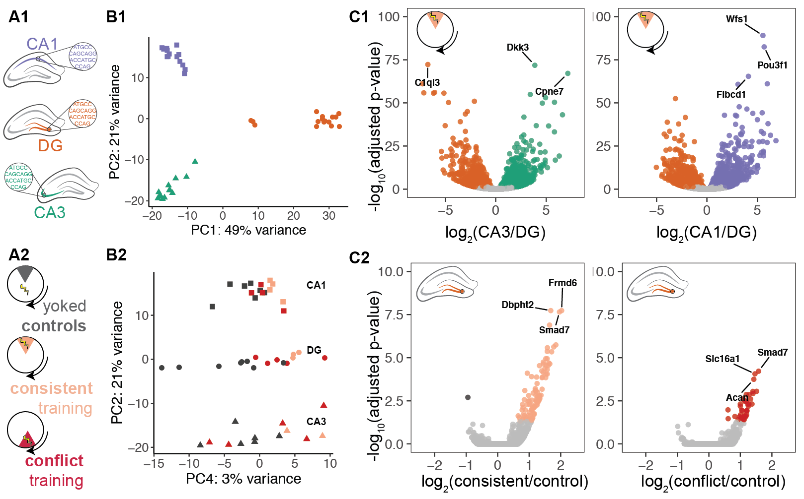

The figures made from this script were compiled in Adobe.




```{r setup, message=F}
library(ggplot2) ## for awesome plots!
library(cowplot) ## for some easy to use themes
library(dplyr) ## for filtering and selecting rows
library(car) ## stats
library(VennDiagram) ## venn diagrams
library(pheatmap) ## awesome heatmaps
library(viridis) # for awesome color pallette
library(reshape2) ## for melting dataframe
library(DESeq2) ## for gene expression analysis
library(edgeR)  ## for basic read counts status
library(magrittr) ## to use the weird pipe
library(genefilter)  ## for PCA fuction
library(ggrepel) ## for labeling volcano plot
library(colorblindr)

## load functions 
source("figureoptions.R")
source("functions_RNAseq.R")
source("resvalsfunction.R")

## set output file for figures 
knitr::opts_chunk$set(fig.path = '../figures/02_RNAseq/')
```

```{r data, message=F, warning=F}
colData <- read.csv("../data/02a_colData.csv", header = T)
countData <- read.csv("../data/02a_countData.csv", header = T, check.names = F, row.names = 1)
```

Now, we are create differential gene expression object and remove genes with 0 counts. Before filtering, there are 22,485 genes in the object. After filtering genes with 0 counts, we will be left with 17,746 genes that are expressed in a least 1 sample. Then, we can caluate the size factors, estimate gene dispersion estimates, fit a model, test for outliers, and remove outliers.

```{r DESeq2_PunchAPA}
## create DESeq object using the factors Punch and APA
dds <- DESeqDataSetFromMatrix(countData = countData,
                              colData = colData,
                              design = ~ Punch + APA + Punch*APA)

## DESeq2 1.3.7 specify the factor levels
dds$Punch <- factor(dds$Punch, levels=c("DG","CA3", "CA1"))
dds$APA <- factor(dds$APA, levels=c("Control", "Consistent", "Conflict"))


dds # view the DESeq object - note numnber of genes

## DESeq2 1.3.6 Pre-filtering genes with 0 counts
dds <- dds[ rowSums(counts(dds)) > 1, ] 

dds # view the DESeq object - note numnber of genes
# dim: 17674 44 
# 17,674 genes and 44 samples

## DESeq2 1.4  Differential expression analysi
dds <- DESeq(dds)

## for variance stablized gene expression and log transformed data
rld <- rlog(dds, blind=FALSE)
#vsd <- varianceStabilizingTransformation(dds, blind=FALSE)
#vsd.fast <- vst(dds, blind=FALSE)

contrast1 <- resvals(contrastvector = c("Punch", "CA1", "DG"), mypval = 0.05) #2497
contrast2 <- resvals(contrastvector = c("Punch", "CA1", "CA3"), mypval = 0.05) #1803
contrast3 <- resvals(contrastvector = c("Punch", "CA3", "DG"), mypval = 0.05) #3445
contrast4 <- resvals(contrastvector = c("APA", "Consistent", "Control"), mypval = 0.05) #95
contrast5 <- resvals(contrastvector = c("APA", "Conflict", "Control"), mypval = 0.05) #42
contrast6 <- resvals(contrastvector = c("APA", "Conflict", "Consistent"), mypval = 0.05) # 0 

#create a new DF with the gene counts
## note: contrast1 had 0 differentially expressed genes, so it is not included 
rldpadjs <- assay(rld)
rldpadjs <- cbind(rldpadjs, contrast1, contrast2, contrast3, contrast4, contrast5, contrast6)
rldpadjs <- as.data.frame(rldpadjs)
rldpadjs <- rldpadjs[ , grepl( "padj" , names( rldpadjs ) ) ]
head(rldpadjs)
```


## Supplementray P-value distributions
Here, the goal is the analyze the distribution of pvalues to see if they are randomly distributed or if that is a tendency towards and increase or decrease of low pvalues. There, I'm showing the pval and adjusted pvale (padj) for all for two-way comparision. 

```{r pvaluedistribution, include=FALSE}
ggplot(rldpadjs, aes(x = padjPunchCA1DG)) + geom_histogram(binwidth = 0.05) + scale_y_log10()
ggplot(rldpadjs, aes(x = padjPunchCA1CA3)) + geom_histogram(binwidth = 0.05) + scale_y_log10()
ggplot(rldpadjs, aes(x = padjPunchCA3DG)) + geom_histogram(binwidth = 0.05) + scale_y_log10()
ggplot(rldpadjs, aes(x = padjAPAConsistentControl)) + geom_histogram(binwidth = 0.05) + scale_y_log10()
ggplot(rldpadjs, aes(x = padjAPAConflictControl)) + geom_histogram(binwidth = 0.05) + scale_y_log10()
```

## Venn Diagrams of DEgenes
Now, we count the number of differnetially expressed genes (according to padj) and plot some venn diagrams.

```{r venndiagrams}
venn1 <- row.names(rldpadjs[rldpadjs[1] <0.1 & !is.na(rldpadjs[1]),])
venn2 <- row.names(rldpadjs[rldpadjs[2] <0.1 & !is.na(rldpadjs[2]),])
venn3 <- row.names(rldpadjs[rldpadjs[3] <0.1 & !is.na(rldpadjs[3]),])
venn4 <- row.names(rldpadjs[rldpadjs[4] <0.1 & !is.na(rldpadjs[4]),])
venn5 <- row.names(rldpadjs[rldpadjs[5] <0.1 & !is.na(rldpadjs[5]),])
```

```{r venndiagram4}
candidates <- list("Control vs Consistent" = venn4, "DG vs CA3" = venn3  ,"Control vs Conflict" = venn5, "DG vs CA1" = venn1 )

prettyvenn <- venn.diagram(
  scaled=T,
  x = candidates, filename=NULL, 
  col = "black",
  fill = c( "white", "white", "white", "white"),
  alpha = 0.5,
  cex = 1, fontfamily = "sans", #fontface = "bold",
  cat.default.pos = "text",
  #cat.dist = c(0.08, 0.08, 0.08), cat.pos = 1,
  cat.cex = 1, cat.fontfamily = "sans")
grid.draw(prettyvenn)

```

```{r venndiagram3}
## other 3 way

candidates <- list("DG vs CA1" = venn1, "Control vs Consistent" = venn4,"DG vs CA3" = venn3,  "CA3 vs CA1" = venn2)

prettyvenn <- venn.diagram(
  scaled=T,
  x = candidates, filename=NULL, 
  col = "black",
  fill = c( "white", "white", "white", "white"),
  alpha = 0.5,
  cex = 1, fontfamily = "sans", #fontface = "bold",
  cat.default.pos = "text",
  #cat.dist = c(0.08, 0.08, 0.08), cat.pos = 1,
  cat.cex = 1, cat.fontfamily = "sans")
grid.draw(prettyvenn)
```

```{r venndiagram3brainregions} 
candidates <- list("DG vs CA1" = venn1, "DG vs CA3" = venn3,  "CA3 vs CA1" = venn2)

prettyvenn <- venn.diagram(
  scaled=T,
  x = candidates, filename=NULL, 
  col = "black",
  fill = c( "white", "white", "white"),
  alpha = 0.5,
  cex = 1, fontfamily = "sans", #fontface = "bold",
  cat.default.pos = "text",
  #cat.dist = c(0.08, 0.08, 0.08), cat.pos = 1,
  cat.cex = 1, cat.fontfamily = "sans")
grid.draw(prettyvenn)
```

## Heatmaps

```{r heatmap}
rownames(df) <- names(countData)
ann_colors <- ann_colors2 #use 

# make sure the data is a matrix
DEGes <- as.matrix(DEGes) 

# set color breaks
paletteLength <- 30
myBreaks <- c(seq(min(DEGes), 0, length.out=ceiling(paletteLength/2) + 1), 
              seq(max(DEGes)/paletteLength, max(DEGes), length.out=floor(paletteLength/2)))

pheatmap(DEGes, show_colnames=T, show_rownames = F,
         annotation_col=df, annotation_colors = ann_colors,
         treeheight_row = 0, treeheight_col = 25,
         fontsize = 11, 
         #width=4.5, height=3,
         border_color = "grey60" ,
         color = viridis(30),
         cellwidth = 8, 
         clustering_method="average",
         breaks=myBreaks,
         clustering_distance_cols="correlation" 
         )

# for adobe
pheatmap(DEGes, show_colnames=F, show_rownames = F,
         annotation_col=df, annotation_colors = ann_colors,
         treeheight_row = 0, treeheight_col = 50,
         fontsize = 10, 
         #width=4.5, height=3,
         border_color = "grey60" ,
         color = viridis(30),
         cellwidth = 8, 
         clustering_method="average",
         breaks=myBreaks,
         clustering_distance_cols="correlation",
         filename = "../figures/02_RNAseq/HeatmapPadj-1.pdf"
         )
```

## Principle component analysis

```{r pca}

# create the dataframe using my function pcadataframe
pcadata <- pcadataframe(rld, intgroup=c("Punch","APA"), returnData=TRUE)
percentVar <- round(100 * attr(pcadata, "percentVar"))
percentVar

aov1 <- aov(PC1 ~ Punch, data=pcadata)
summary(aov1) 
TukeyHSD(aov1, which = "Punch") 

aov2 <- aov(PC2 ~ Punch, data=pcadata)
summary(aov2) 
TukeyHSD(aov2, which = "Punch") 

aov3 <- aov(PC3 ~ APA, data=pcadata)
summary(aov3) 
TukeyHSD(aov3, which = "APA")

aov4 <- aov(PC4 ~ APA, data=pcadata)
summary(aov4) 
TukeyHSD(aov4, which = "APA") 

lm4 <- lm(PC4~APA*Punch, data=pcadata)
summary(lm4)
anova(lm4) 

lm124 <- lm(PC1+PC2+PC4~APA*Punch, data=pcadata)
summary(lm124)
anova(lm124)

pcadata$Punch <- factor(pcadata$Punch, levels=c("DG","CA3", "CA1"))
pcadata$APA <- factor(pcadata$APA, levels=c("Control", "Consistent", "Conflict"))

plotPCs(pcadata, 2, 1, aescolor = pcadata$Punch, colorname = " ", aesshape = pcadata$Punch, shapename = " ",  colorvalues = colorvalPunch)

plotPCs(pcadata, 1, 2, aescolor = pcadata$Punch, colorname = " ", aesshape = pcadata$Punch, shapename = " ",  colorvalues = colorvalPunch)

plotPCs(pcadata, 4, 2, aescolor = pcadata$APA, colorname = "APA", aesshape = pcadata$Punch, shapename = "Punch",  colorvalues = colorvalAPA)


# pdf the same pca plots descripbed above of the above
pdf(file="../figures/02_RNAseq/PCA12.pdf", width=4.5, height=3)
PCA12 <- plotPCs(pcadata, 1, 2, aescolor = pcadata$Punch, colorname = " ", aesshape = pcadata$Punch, shapename = " ",  colorvalues = colorvalPunch)
plot(PCA12)
dev.off()

pdf(file="../figures/02_RNAseq/PCA25.pdf", width=4.5, height=3)
PCA25 <- plotPCs(pcadata, 4, 2, aescolor = pcadata$APA, colorname = "APA", aesshape = pcadata$Punch, shapename = "Punch",  colorvalues = colorvalAPA)
plot(PCA25)
dev.off()
```


## Total Gene Counts Per Sample

```{r totalRNAseqcounts}
## stats
counts <- countData
dim( counts )
colSums( counts ) / 1e06  # in millions of reads
table( rowSums( counts ) )[ 1:30 ] # Number of genes with low counts

rowsum <- as.data.frame(colSums( counts ) / 1e06 )
names(rowsum)[1] <- "millioncounts"
rowsum$sample <- row.names(rowsum)

ggplot(rowsum, aes(x=millioncounts)) + 
  geom_histogram(binwidth = 1, colour = "black", fill = "darkgrey") +
  theme_classic() +
  scale_x_continuous(name = "Millions of Gene Counts per Sample",
                     breaks = seq(0, 8, 1),
                     limits=c(0, 8)) +
  scale_y_continuous(name = "Number of Samples")
```

## Heatmap

```{r heatmap}
DEGes <- assay(rld)
DEGes <- cbind(DEGes, contrast1, contrast2, contrast3, contrast4, contrast5, contrast6)
DEGes <- as.data.frame(DEGes) # convert matrix to dataframe
DEGes$rownames <- rownames(DEGes)  # add the rownames to the dataframe
DEGes$padjmin <- with(DEGes, pmin(padjPunchCA1DG, padjPunchCA1CA3, padjPunchCA3DG, padjAPAConsistentControl, padjAPAConflictControl, padjAPAConflictConsistent)) # create new col with min padj
DEGes <- DEGes %>% filter(padjmin < 0.05)
rownames(DEGes) <- DEGes$rownames
drop.cols <-colnames(DEGes[,grep("padj|pval|rownames", colnames(DEGes))])
DEGes <- DEGes %>% dplyr::select(-one_of(drop.cols))
DEGes <- as.matrix(DEGes)
DEGes <- DEGes - rowMeans(DEGes)
head(DEGes)

## the heatmap annotation file
df <- as.data.frame(colData(dds)[,c("Punch","APA")]) ## matrix to df

```


## CA1 only differential gene expression
This DESeq2 analysis of CA1 tissue only reveals that there are 0 differentially expression between the three active place avoidance treatment groups. 

```{r CA1only}
countData <- read.csv("../data/02a_countData.csv", header = T, check.names = F, row.names = 1)
colData <- read.csv("../data/02a_colData.csv", header = T)
colData$APA <- factor(colData$APA, levels=c("Control", "Consistent", "Conflict"))

colData <- colData %>% 
  filter(Punch == "CA1") 
savecols <- as.character(colData$RNAseqID) 
savecols <- as.vector(savecols) 
countData <- countData %>% dplyr::select(one_of(savecols)) 

dds <- DESeqDataSetFromMatrix(countData = countData,
                              colData = colData,
                              design = ~ APA )
dds$APA <- factor(dds$APA, levels=c("Control", "Consistent", "Conflict"))
dds <- dds[ rowSums(counts(dds)) > 1, ] 
dds # dim: 16467 15  
dds <- DESeq(dds)
rld <- rlog(dds, blind=FALSE)

contrast4 <- resvals(contrastvector = c("APA", "Consistent", "Control"), mypval = 0.05) #0
contrast5 <- resvals(contrastvector = c("APA", "Conflict", "Control"), mypval = 0.05) #0
contrast6 <- resvals(contrastvector = c("APA", "Conflict", "Consistent"), mypval = 0.05) # 0 

res <- results(dds, contrast =c("APA", "Consistent", "Control"), independentFiltering = F)
resOrdered <- res[order(res$padj),]
head(resOrdered)

res <- results(dds, contrast =c("APA", "Conflict", "Control"), independentFiltering = F)
resOrdered <- res[order(res$padj),]
head(resOrdered)

res <- results(dds, contrast =c("APA", "Conflict", "Consistent"), independentFiltering = F)
resOrdered <- res[order(res$padj),]
head(resOrdered)
```

## CA3 only differential gene expression
This DESeq2 analysis shows that in the CA3, only 3 genes are differentially expressed between conflict and consistently trained animals. These 3 genes are Opioid Receptor Delta 1 (Oprd1), Crooked Neck Pre- MRNA Splicing Factor 1, (Crnkl1), and Solute Carrier Family 9 Member A2 (Slc9a2).

```{r CA3only}
countData <- read.csv("../data/02a_countData.csv", header = T, check.names = F, row.names = 1)
colData <- read.csv("../data/02a_colData.csv", header = T)
colData$APA <- factor(colData$APA, levels=c("Control", "Consistent", "Conflict"))

colData <- colData %>% 
  filter(Punch == "CA3") 
savecols <- as.character(colData$RNAseqID) 
savecols <- as.vector(savecols) 
countData <- countData %>% dplyr::select(one_of(savecols)) 

dds <- DESeqDataSetFromMatrix(countData = countData,
                              colData = colData,
                              design = ~ APA )
dds$APA <- factor(dds$APA, levels=c("Control", "Consistent", "Conflict"))
dds <- dds[ rowSums(counts(dds)) > 1, ] 
dds # dim: 16658 16   
dds <- DESeq(dds)
rld <- rlog(dds, blind=FALSE)

contrast4 <- resvals(contrastvector = c("APA", "Consistent", "Control"), mypval = 0.05) #0
contrast5 <- resvals(contrastvector = c("APA", "Conflict", "Control"), mypval = 0.05) #0
contrast6 <- resvals(contrastvector = c("APA", "Conflict", "Consistent"), mypval = 0.05) # 3 

res <- results(dds, contrast = c("APA", "Conflict", "Consistent"), independentFiltering = F)
resOrdered <- res[order(res$padj),]
head(resOrdered)

# Oprd1 = Opioid Receptor Delta 1
# Crnkl1 = Crooked Neck Pre- MRNA Splicing Factor 1
# Slc9a2 = Solute Carrier Family 9 Member A2

res <- results(dds, contrast =c("APA", "Consistent", "Control"), independentFiltering = F)
resOrdered <- res[order(res$padj),]
head(resOrdered)

res <- results(dds, contrast =c("APA", "Conflict", "Control"), independentFiltering = F)
resOrdered <- res[order(res$padj),]
head(resOrdered)

res <- results(dds, contrast =c("APA", "Conflict", "Consistent"), independentFiltering = F)
resOrdered <- res[order(res$padj),]
head(resOrdered)

data <- data.frame(gene = row.names(res), pvalue = -log10(res$padj), lfc = res$log2FoldChange)
data <- na.omit(data)
data <- data %>%
  mutate(color = ifelse(data$lfc > 0 & data$pvalue > 1.3, 
                        yes = "Conflict", 
                        no = ifelse(data$lfc < 0 & data$pvalue > 1.3, 
                                    yes = "Consistent", 
                                    no = "none")))
top_labelled <- top_n(data, n = 3, wt = pvalue)
colored <- ggplot(data, aes(x = lfc, y = pvalue)) + 
  geom_point(aes(color = factor(color)), size = 1.75, alpha = 0.8, na.rm = T) + # add gene points
  theme_bw(base_size = 16) + # clean up theme
  theme(legend.position = "none") + # remove legend 
  xlim(c(-2.5, 2.5)) +  ylim(c(0, 3)) +  
  scale_color_manual(values = c("Consistent" = "#f4a582",
                                "Conflict" = "#ca0020", 
                                "none" = "#bdbdbd")) + theme(panel.grid.minor=element_blank(),
           panel.grid.major=element_blank()) + 
  labs(x = "log2(conflict/control)") + 
  labs(y = "-log10(adjusted p-value)") + 
  geom_text_repel(data = top_labelled, 
                          mapping = aes(label = gene), 
                          size = 3,fontface = 'bold', 
                          color = 'black',
                          box.padding = unit(0.5, "lines"),
                          point.padding = unit(0.5, "lines"))

colored
```


## DG only
Now, I focus on the DG, which is where the magic happens.

```{r DGonly}
countData <- read.csv("../data/02a_countData.csv", header = T, check.names = F, row.names = 1)
colData <- read.csv("../data/02a_colData.csv", header = T)
colData$APA <- factor(colData$APA, levels=c("Control", "Consistent", "Conflict"))

colData <- colData %>% 
  filter(Punch == "DG") 
savecols <- as.character(colData$RNAseqID) 
savecols <- as.vector(savecols) 
countData <- countData %>% dplyr::select(one_of(savecols)) 

dds <- DESeqDataSetFromMatrix(countData = countData,
                              colData = colData,
                              design = ~ APA )
dds$APA <- factor(dds$APA, levels=c("Control", "Consistent", "Conflict"))
dds <- dds[ rowSums(counts(dds)) > 1, ] 
dds # dim: 16658 16  
dds <- DESeq(dds)
rld <- rlog(dds, blind=FALSE)

contrast4 <- resvals(contrastvector = c("APA", "Consistent", "Control"), mypval = 0.05) #101 
contrast5 <- resvals(contrastvector = c("APA", "Conflict", "Control"), mypval = 0.05) #39 
contrast6 <- resvals(contrastvector = c("APA", "Conflict", "Consistent"), mypval = 0.05) # 0 

pcadata <- pcadataframe(rld, intgroup=c("Punch","APA"), returnData=TRUE)
percentVar <- round(100 * attr(pcadata, "percentVar"))
percentVar

aov1 <- aov(PC1 ~ APA, data=pcadata)
summary(aov1) 
TukeyHSD(aov1, which = "APA") 

aov2 <- aov(PC2 ~ APA, data=pcadata)
summary(aov2) 
TukeyHSD(aov2, which = "APA") 

pcadata$APA <- factor(pcadata$APA, levels=c("Control", "Consistent", "Conflict"))

plotPCs(pcadata, 1, 2, aescolor = pcadata$APA, colorname = "APA", aesshape = pcadata$Punch, shapename = "Punch",  colorvalues = colorvalAPA)
plotPCs(pcadata, 3, 4, aescolor = pcadata$APA, colorname = "APA", aesshape = pcadata$Punch, shapename = "Punch",  colorvalues = colorvalAPA)
```


###  DG Consistent versus Control
This volcano plot shows the sricking pattern of upregulation of gene experssion in DG with consistent training.

```{r DGConsistentControl}
res <- results(dds, contrast =c("APA", "Consistent", "Control"), independentFiltering = F)
resOrdered <- res[order(res$padj),]
head(resOrdered)

data <- data.frame(gene = row.names(res),
                   pvalue = -log10(res$padj), 
                   lfc = res$log2FoldChange)
data <- na.omit(data)
data <- data %>%
  mutate(color = ifelse(data$lfc > 0 & data$pvalue > 1.3, 
                        yes = "Consistent", 
                        no = ifelse(data$lfc < 0 & data$pvalue > 1.3, 
                                    yes = "Control", 
                                    no = "none")))
top_labelled <- top_n(data, n = 3, wt = pvalue)
# Color corresponds to fold change directionality
colored <- ggplot(data, aes(x = lfc, y = pvalue)) + 
  geom_point(aes(color = factor(color)), size = 1.75, alpha = 0.8, na.rm = T) + # add gene points
  theme_bw(base_size = 16) + # clean up theme
  theme(legend.position = "none") + # remove legend 
  xlim(c(-2.5, 2.5)) +  
  ylim(c(0, 10)) +  
  scale_color_manual(values = c("Consistent" = "#f4a582",
                                "Control" = "#404040", 
                                "none" = "#bdbdbd")) + theme(panel.grid.minor=element_blank(),
           panel.grid.major=element_blank()) + 
  theme(axis.title.x = element_blank())+ 
  theme(axis.title.y = element_blank()) + 
  geom_text_repel(data = top_labelled, 
                          mapping = aes(label = gene), 
                          size = 3,
                          fontface = 'bold', 
                          color = 'black',
                          box.padding = unit(0.5, "lines"),
                          point.padding = unit(0.5, "lines"))

colored
cvd_grid(colored) # to view plot for color blind 
 

pdf(file="../figures/02_RNAseq/DGConsistentControl.pdf", width=3, height=3)
plot(colored)
dev.off()
```

### DG Conflict vs. Control
This volcano plot shows the sricking pattern of upregulation of gene experssion in DG with conflict training. The direction is the same but the magitude is reduced compared to that of the consistenly trained group. 

```{r DGConflictControl}
res <- results(dds, contrast =c("APA", "Conflict", "Control"), independentFiltering = F)
resOrdered <- res[order(res$padj),]
head(resOrdered)


# more complicated but beautiful ggplot from https://twbattaglia.github.io/2016/12/17/volcano-plot/
# Add gene names Add the -log10 pvalue Add the pre-calculated log2 fold change
data <- data.frame(gene = row.names(res),
                   pvalue = -log10(res$padj), 
                   lfc = res$log2FoldChange)
data <- na.omit(data)
head(data)

# Modify dataset to add new coloumn of colors
data <- data %>%
  mutate(color = ifelse(data$lfc > 0 & data$pvalue > 1.3, 
                        yes = "Conflict", 
                        no = ifelse(data$lfc < 0 & data$pvalue > 1.3, 
                                    yes = "Control", 
                                    no = "none")))
top_labelled <- top_n(data, n = 3, wt = pvalue)


# Color corresponds to fold change directionality
colored <- ggplot(data, aes(x = lfc, y = pvalue)) + 
  geom_point(aes(color = factor(color)), size = 1.75, alpha = 0.8, na.rm = T) + # add gene points
  theme_bw(base_size = 16) + # clean up theme
  theme(legend.position = "none") + # remove legend 
  #ggtitle(label = "Volcano Plot", subtitle = "Colored by directionality") +  # add title
  #xlab(expression(log[2]("Conflict" / "Control"))) + # x-axis label
  #ylab(expression(-log[10]("adjusted p-value"))) + # y-axis label
  #geom_vline(xintercept = 0, colour = "black") + # add line at 0
  #geom_hline(yintercept = 1.3, colour = "black") + # p(0.05) = 1.3
  xlim(c(-2.5, 2.5)) +  
  ylim(c(0, 10)) +    
  scale_color_manual(values = c("Conflict" = "#ca0020", 
                                "Control" = "#404040", 
                                "none" = "#bdbdbd")) + theme(panel.grid.minor=element_blank(),
           panel.grid.major=element_blank()) + 
  theme(axis.title.x = element_blank())+ 
  theme(axis.title.y = element_blank()) + 
  geom_text_repel(data = top_labelled, 
                          mapping = aes(label = gene), 
                          size = 3,
                          fontface = 'bold', 
                          color = 'black',
                          box.padding = unit(0.5, "lines"),
                          point.padding = unit(0.5, "lines"))

colored
cvd_grid(colored) # to view plot for color blind 

pdf(file="../figures/02_RNAseq/DGConflictControl.pdf", width=3, height=3)
plot(colored)
dev.off()

```

This venn diagram shows the 37 of the 39 conflict trained differentially expressed gene are shared with the 101 consistently trained differentially expressed genes.

```{r DGvenn}
## VennDiagram
rldpvals <- assay(rld)
rldpvals <- cbind(rldpvals, contrast4, contrast5, contrast6)
rldpvals <- as.data.frame(rldpvals)
rldpvals <- rldpvals[ , grepl( "padj|pval" , names( rldpvals ) ) ]
venn1 <- row.names(rldpvals[rldpvals[2] <0.05 & !is.na(rldpvals[2]),])
venn2 <- row.names(rldpvals[rldpvals[4] <0.05 & !is.na(rldpvals[4]),])
venn3 <- row.names(rldpvals[rldpvals[6] <0.05 & !is.na(rldpvals[6]),])
venn12 <- union(venn1,venn2)
venn123 <- union(venn12,venn3)
venn1minus2 <- setdiff(venn1,venn2)
# save files for big venn diagram
write(venn123, "../data/20c_vennDGAll.txt")
write(venn1, "../data/20c_vennDGControlConsistent.txt")
write(venn2, "../data/20c_vennDGControlConflict.txt")
write(venn1minus2, "../data/20c_vennDGControlminusConsistent.txt")
# setting for image
candidates <- list("Control-Consistent" = venn1, "Control-Conflict" = venn2,"Consistent-Conflict" = venn3)
prettyvenn <- venn.diagram(
  scaled=T,
  x = candidates, filename=NULL, 
  col = "black",
  fill = c( "white", "white", "white"),
  alpha = 0.5,
  cex = 1, fontfamily = "sans", #fontface = "bold",
  cat.default.pos = "text",
  cat.dist = c(0.06, 0.06, 0.05), cat.pos = 1,
  cat.cex = 1, cat.fontfamily = "sans")
grid.draw(prettyvenn)
```

### DG Conflict Consistent
For completeness sake, there were no significant differentially expressed genes between the two treatements.

```{r DGConflictConsistent}
res <- results(dds, contrast =c("APA", "Conflict", "Consistent"), independentFiltering = F)
resOrdered <- res[order(res$padj),]


data <- data.frame(gene = row.names(res),
                   pvalue = -log10(res$padj), 
                   lfc = res$log2FoldChange)
data <- na.omit(data)

```


### This section produces files for GO analysis of DG only

```{r GOMWUpreparation}
## contrast =c("APA", "Consistent", "Control")
res <- results(dds, contrast =c("APA", "Consistent", "Control"), independentFiltering = F)
table(res$padj<0.05)
table(res$pvalue<0.05)
logs <- data.frame(cbind("gene"=row.names(res),"logP"=round(-log(res$pvalue+1e-10,10),1)))
logs$logP <- as.numeric(as.character(logs$logP))
sign <- rep(1,nrow(logs))
sign[res$log2FoldChange<0]=-1  ##change to correct model
table(sign)
logs$logP <- logs$logP*sign
write.csv(logs, file = "./02d_GO_MWU/padjAPAConsistentControlDG.csv", row.names = F)

## contrast = c("APA", "Conflict", "Control")
res <- results(dds, contrast =c("APA", "Conflict", "Control"), independentFiltering = F)
table(res$padj<0.05)
table(res$pvalue<0.05)
logs <- data.frame(cbind("gene"=row.names(res),"logP"=round(-log(res$pvalue+1e-10,10),1)))
logs$logP <- as.numeric(as.character(logs$logP))
sign <- rep(1,nrow(logs))
sign[res$log2FoldChange<0]=-1  ##change to correct model
table(sign)
logs$logP <- logs$logP*sign
write.csv(logs, file = "./02d_GO_MWU/padjAPAConflictControlDG.csv", row.names = F)
```


## Here, I examine only Conflict trained animals to show brain region differences.

```{r ConflictOnly}
countData <- read.csv("../data/02a_countData.csv", header = T, check.names = F, row.names = 1)
colData <- read.csv("../data/02a_colData.csv", header = T)

colData <- colData %>% 
  filter(APA == "Conflict") 
savecols <- as.character(colData$RNAseqID) 
savecols <- as.vector(savecols) 
countData <- countData %>% dplyr::select(one_of(savecols)) 

dds <- DESeqDataSetFromMatrix(countData = countData,
                              colData = colData,
                              design = ~ Punch )

dds <- dds[ rowSums(counts(dds)) > 1, ] 
dds # dim: 16576 14    
dds <- DESeq(dds)
dds$APA <- factor(dds$Punch, levels=c("DG", "CA3", "CA1"))
rld <- rlog(dds, blind=FALSE)

contrast1 <- resvals(contrastvector = c("Punch", "CA1", "DG"), mypval = 0.05) #2526
contrast2 <- resvals(contrastvector = c("Punch", "CA1", "CA3"), mypval = 0.05) #1318
contrast3 <- resvals(contrastvector = c("Punch", "CA3", "DG"), mypval = 0.05) #3776


res <- results(dds, contrast =c("Punch", "CA1", "DG"), independentFiltering = F)
with(res, plot(log2FoldChange, -log10(pvalue), pch=20, main="Conflict: DG - CA1", xlim=c(-8,8), ylim=c(0,100)))
with(subset(res, log2FoldChange>0), points(log2FoldChange, -log10(pvalue), pch=20, col=c("#7570b3")))
with(subset(res, log2FoldChange<0), points(log2FoldChange, -log10(pvalue), pch=20, col=c("#d95f02")))
with(subset(res, padj>.05 ), points(log2FoldChange, -log10(pvalue), pch=20, col="grey"))
resOrdered <- res[order(res$padj),]
head(resOrdered)

res <- results(dds, contrast =c("Punch", "CA1", "CA3"), independentFiltering = F)
with(res, plot(log2FoldChange, -log10(pvalue), pch=20, main="Conflict: CA3 - CA1", xlim=c(-8,8), ylim=c(0,100)))
with(subset(res, log2FoldChange>0), points(log2FoldChange, -log10(pvalue), pch=20, col=c("#7570b3")))
with(subset(res, log2FoldChange<0), points(log2FoldChange, -log10(pvalue), pch=20, col=c("#1b9e77")))
with(subset(res, padj>.05 ), points(log2FoldChange, -log10(pvalue), pch=20, col="grey"))
resOrdered <- res[order(res$padj),]
head(resOrdered)

res <- results(dds, contrast =c("Punch", "CA3", "DG"), independentFiltering = F)
with(res, plot(log2FoldChange, -log10(pvalue), pch=20, main="Conflict: DG - CA3", xlim=c(-8,8), ylim=c(0,100)))
with(subset(res, log2FoldChange>0), points(log2FoldChange, -log10(pvalue), pch=20, col=c("#1b9e77")))
with(subset(res, log2FoldChange<0), points(log2FoldChange, -log10(pvalue), pch=20, col=c("#d95f02")))
with(subset(res, padj>.05 ), points(log2FoldChange, -log10(pvalue), pch=20, col="grey"))
resOrdered <- res[order(res$padj),]
head(resOrdered)
```

```{r ControlOnly}
countData <- read.csv("../data/02a_countData.csv", header = T, check.names = F, row.names = 1)
colData <- read.csv("../data/02a_colData.csv", header = T)

colData <- colData %>% 
  filter(APA == "Control") 
savecols <- as.character(colData$RNAseqID) 
savecols <- as.vector(savecols) 
countData <- countData %>% dplyr::select(one_of(savecols)) 

dds <- DESeqDataSetFromMatrix(countData = countData,
                              colData = colData,
                              design = ~ Punch )

dds <- dds[ rowSums(counts(dds)) > 1, ] 
dds # dim: 16716 21     
dds <- DESeq(dds)
dds$APA <- factor(dds$Punch, levels=c("DG", "CA3", "CA1"))

rld <- rlog(dds, blind=FALSE)
contrast1 <- resvals(contrastvector = c("Punch", "CA1", "DG"), mypval = 0.05) #2013
contrast2 <- resvals(contrastvector = c("Punch", "CA1", "CA3"), mypval = 0.05) #1391
contrast3 <- resvals(contrastvector = c("Punch", "CA3", "DG"), mypval = 0.05) #2728

res <- results(dds, contrast =c("Punch", "CA1", "DG"), independentFiltering = F)
resOrdered <- res[order(res$padj),]
head(resOrdered)


data <- data.frame(gene = row.names(res), pvalue = -log10(res$padj), lfc = res$log2FoldChange)
data <- na.omit(data)
data <- data %>%
  mutate(color = ifelse(data$lfc > 0 & data$pvalue > 1.3, 
                        yes = "CA1", 
                        no = ifelse(data$lfc < 0 & data$pvalue > 1.3, 
                                    yes = "DG", 
                                    no = "none")))
top_labelled <- top_n(data, n = 3, wt = pvalue)

# Color corresponds to fold change directionality
colored <- ggplot(data, aes(x = lfc, y = pvalue)) + 
  geom_point(aes(color = factor(color)), size = 1.75, alpha = 0.8, na.rm = T) + # add gene points
  theme_bw(base_size = 16) + # clean up theme
  theme(legend.position = "none") + # remove legend 
  #ggtitle(label = "Volcano Plot", subtitle = "Colored by directionality") +  # add title
  #xlab(expression(log[2]("Consistent" / "Control"))) + # x-axis label
  #ylab(expression(-log[10]("adjusted p-value"))) + # y-axis label
  #geom_vline(xintercept = 0, colour = "black") + # add line at 0
  #geom_hline(yintercept = 1.3, colour = "black") + # p(0.05) = 1.3
  xlim(c(-8, 8)) +  
  ylim(c(0, 100)) +   
  scale_color_manual(values = c("CA1" = "#7570b3",
                                "DG" = "#d95f02", 
                                "none" = "#bdbdbd")) + theme(panel.grid.minor=element_blank(),
           panel.grid.major=element_blank()) + 
  theme(axis.title.x = element_blank())+ 
  theme(axis.title.y = element_blank()) + 
  geom_text_repel(data = top_labelled, 
                          mapping = aes(label = gene), 
                          size = 3,
                          fontface = 'bold', 
                          color = 'black',
                          box.padding = unit(0.5, "lines"),
                          point.padding = unit(0.5, "lines"))

colored

cvd_grid(colored) # to view plot for color blind 


pdf(file="../figures/02_RNAseq/ControlDGCA1.pdf", width=3, height=3)
plot(colored)
dev.off()


res <- results(dds, contrast =c("Punch", "CA1", "CA3"), independentFiltering = F)
resOrdered <- res[order(res$padj),]
head(resOrdered)

res <- results(dds, contrast =c("Punch", "CA3", "DG"), independentFiltering = F)
resOrdered <- res[order(res$padj),]
head(resOrdered)

data <- data.frame(gene = row.names(res), pvalue = -log10(res$padj), lfc = res$log2FoldChange)
data <- na.omit(data)
head(data)

data <- data %>%
  mutate(color = ifelse(data$lfc > 0 & data$pvalue > 1.3, 
                        yes = "CA3", 
                        no = ifelse(data$lfc < 0 & data$pvalue > 1.3, 
                                    yes = "DG", 
                                    no = "none")))
top_labelled <- top_n(data, n = 3, wt = pvalue)

# Color corresponds to fold change directionality
colored <- ggplot(data, aes(x = lfc, y = pvalue)) + 
  geom_point(aes(color = factor(color)), size = 1.75, alpha = 0.8, na.rm = T) + # add gene points
  theme_bw(base_size = 16) + # clean up theme
  theme(legend.position = "none") + # remove legend 
  xlim(c(-8, 8)) +  
  ylim(c(0, 100)) +  
  scale_color_manual(values = c("CA3" = "#1b9e77",
                                "DG" = "#d95f02", 
                                "none" = "#bdbdbd")) + theme(panel.grid.minor=element_blank(),
           panel.grid.major=element_blank()) + 
  theme(axis.title.x = element_blank()) + 
  theme(axis.title.y = element_blank()) + 
  geom_text_repel(data = top_labelled, 
                          mapping = aes(label = gene), 
                          size = 3,
                          fontface = 'bold', 
                          color = 'black',
                          box.padding = unit(0.5, "lines"),
                          point.padding = unit(0.5, "lines"))

colored

pdf(file="../figures/02_RNAseq/ControlDGCA3.pdf", width=3, height=3)
plot(colored)
dev.off()

```


```{r ConsistentOnly}
countData <- read.csv("../data/02a_countData.csv", header = T, check.names = F, row.names = 1)
colData <- read.csv("../data/02a_colData.csv", header = T)

colData <- colData %>% 
  filter(APA == "Consistent") 
savecols <- as.character(colData$RNAseqID) 
savecols <- as.vector(savecols) 
countData <- countData %>% dplyr::select(one_of(savecols)) 

dds <- DESeqDataSetFromMatrix(countData = countData,
                              colData = colData,
                              design = ~ Punch )

dds <- dds[ rowSums(counts(dds)) > 1, ] 
dds # dim: 16716 21     
dds <- DESeq(dds)
dds$APA <- factor(dds$Punch, levels=c("DG", "CA3", "CA1"))

rld <- rlog(dds, blind=FALSE)
contrast1 <- resvals(contrastvector = c("Punch", "CA1", "DG"), mypval = 0.05) #1683
contrast2 <- resvals(contrastvector = c("Punch", "CA1", "CA3"), mypval = 0.05) #1212
contrast3 <- resvals(contrastvector = c("Punch", "CA3", "DG"), mypval = 0.05) #2107

res <- results(dds, contrast =c("Punch", "CA1", "DG"), independentFiltering = F)
resOrdered <- res[order(res$padj),]
head(resOrdered)


data <- data.frame(gene = row.names(res), pvalue = -log10(res$padj), lfc = res$log2FoldChange)
data <- na.omit(data)
data <- data %>%
  mutate(color = ifelse(data$lfc > 0 & data$pvalue > 1.3, 
                        yes = "CA1", 
                        no = ifelse(data$lfc < 0 & data$pvalue > 1.3, 
                                    yes = "DG", 
                                    no = "none")))
top_labelled <- top_n(data, n = 5, wt = pvalue)


# Color corresponds to fold change directionality
colored <- ggplot(data, aes(x = lfc, y = pvalue)) + 
  geom_point(aes(color = factor(color)), size = 1.75, alpha = 0.8, na.rm = T) + # add gene points
  theme_bw(base_size = 16) + # clean up theme
  theme(legend.position = "none") + # remove legend 
  xlim(c(-8, 8)) +  
  ylim(c(0, 100)) +   
  scale_color_manual(values = c("CA1" = "#7570b3",
                                "DG" = "#d95f02", 
                                "none" = "#bdbdbd")) + theme(panel.grid.minor=element_blank(),
                                                             panel.grid.major=element_blank()) + 
  theme(axis.title.x = element_blank()) + 
  theme(axis.title.y = element_blank()) + 
  geom_text_repel(data = top_labelled, 
                          mapping = aes(label = gene), 
                          size = 3,
                          fontface = 'bold', 
                          color = 'black',
                          box.padding = unit(0.5, "lines"),
                          point.padding = unit(0.5, "lines"))

colored

pdf(file="../figures/02_RNAseq/ConsistentDGCA1.pdf", width=3, height=3)
plot(colored)
dev.off()


res <- results(dds, contrast =c("Punch", "CA1", "CA3"), independentFiltering = F)
resOrdered <- res[order(res$padj),]
head(resOrdered)

res <- results(dds, contrast =c("Punch", "CA3", "DG"), independentFiltering = F)
resOrdered <- res[order(res$padj),]
head(resOrdered)

data <- data.frame(gene = row.names(res), pvalue = -log10(res$padj), lfc = res$log2FoldChange)
data <- na.omit(data)
data <- data %>%
  mutate(color = ifelse(data$lfc > 0 & data$pvalue > 1.3, 
                        yes = "CA3", 
                        no = ifelse(data$lfc < 0 & data$pvalue > 1.3, 
                                    yes = "DG", 
                                    no = "none")))
top_labelled <- top_n(data, n = 3, wt = pvalue)

# Color corresponds to fold change directionality
colored <- ggplot(data, aes(x = lfc, y = pvalue)) + 
  geom_point(aes(color = factor(color)), size = 1.75, alpha = 0.8, na.rm = T) + # add gene points
  theme_bw(base_size = 16) + # clean up theme
  theme(legend.position = "none") + # remove legend 
  xlim(c(-8, 8)) +  
  ylim(c(0, 100)) +  
  scale_color_manual(values = c("CA3" = "#1b9e77",
                                "DG" = "#d95f02", 
                                "none" = "#bdbdbd")) + theme(panel.grid.minor=element_blank(),
                                                             panel.grid.major=element_blank()) + 
  theme(axis.title.x = element_blank()) + 
  theme(axis.title.y = element_blank()) + 
  geom_text_repel(data = top_labelled, 
                          mapping = aes(label = gene), 
                          size = 3,
                          fontface = 'bold', 
                          color = 'black',
                          box.padding = unit(0.5, "lines"),
                          point.padding = unit(0.5, "lines"))
colored

pdf(file="../figures/02_RNAseq/ConsistentDGCA3.pdf", width=3, height=3)
plot(colored)
dev.off()
```


```{r writecsv}
#write.csv(rldpadjs, file = "../data/02b_rldpadjs.csv", row.names = T)
#write.csv(DEGes, file = "../data/02b_DEGes.csv", row.names = T)
#write.csv(df, file = "../data/02b_df.csv", row.names = F)
#write.csv(pcadata, file = "../data/02b_pcadata.csv", row.names = F)
#write.table(percentVar, file = "../data/02b_percentVar.txt")
```