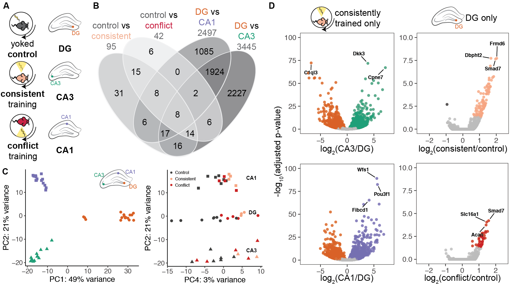

The figures made from this script were compiled in Adobe.



```{r setup, message=F, warning=F}
library(ggplot2) ## for awesome plots!
library(cowplot) ## for some easy to use themes
library(dplyr) ## for filtering and selecting rows
library(car) ## stats
library(VennDiagram) ## venn diagrams
library(pheatmap) ## awesome heatmaps
library(viridis) # for awesome color pallette
library(DESeq2) ## for gene expression analysis

## Functions
source("functions_RNAseq.R")
source("resvalsfunction.R")
source("figureoptions.R")

## set output file for figures 
knitr::opts_chunk$set(fig.path = '../figures/02_RNAseq/')
```

## CA1 only differential gene expression
This DESeq2 analysis of CA1 tissue only reveals that there are 0 differentially expression between the three active place avoidance treatment groups. 

```{r CA1only}
countData <- read.csv("../data/02a_countData.csv", header = T, check.names = F, row.names = 1)
colData <- read.csv("../data/02a_colData.csv", header = T)
colData$APA <- factor(colData$APA, levels=c("Control", "Consistent", "Conflict"))

colData <- colData %>% 
  filter(Punch == "CA1") 
savecols <- as.character(colData$RNAseqID) 
savecols <- as.vector(savecols) 
countData <- countData %>% dplyr::select(one_of(savecols)) 

dds <- DESeqDataSetFromMatrix(countData = countData,
                              colData = colData,
                              design = ~ APA )
dds$APA <- factor(dds$APA, levels=c("Control", "Consistent", "Conflict"))
dds <- dds[ rowSums(counts(dds)) > 1, ] 
dds # dim: 16467 15  
dds <- DESeq(dds)
rld <- rlog(dds, blind=FALSE)

contrast4 <- resvals(contrastvector = c("APA", "Consistent", "Control"), mypval = 0.05) #0
contrast5 <- resvals(contrastvector = c("APA", "Conflict", "Control"), mypval = 0.05) #0
contrast6 <- resvals(contrastvector = c("APA", "Conflict", "Consistent"), mypval = 0.05) # 0 

res <- results(dds, contrast =c("APA", "Consistent", "Control"), independentFiltering = F)
with(res, plot(log2FoldChange, -log10(pvalue), pch=20, main="CA1 Control - Consistent", xlim=c(-8,8), ylim=c(0,14)))
with(subset(res, log2FoldChange>0), points(log2FoldChange, -log10(pvalue), pch=20, col=c("#f4a582")))
with(subset(res, log2FoldChange<0), points(log2FoldChange, -log10(pvalue), pch=20, col=c("#404040")))
with(subset(res, padj>.05 ), points(log2FoldChange, -log10(pvalue), pch=20, col="grey"))
resOrdered <- res[order(res$padj),]
head(resOrdered)

res <- results(dds, contrast =c("APA", "Conflict", "Control"), independentFiltering = F)

with(res, plot(log2FoldChange, -log10(pvalue), pch=20, main="CA1 Control - Conflict", xlim=c(-8,8), ylim=c(0,14)))
with(subset(res, log2FoldChange>0), points(log2FoldChange, -log10(pvalue), pch=20, col=c("#ca0020")))
with(subset(res, log2FoldChange<0), points(log2FoldChange, -log10(pvalue), pch=20, col=c("#404040")))
with(subset(res, padj>.05 ), points(log2FoldChange, -log10(pvalue), pch=20, col="grey"))

resOrdered <- res[order(res$padj),]
head(resOrdered)

res <- results(dds, contrast =c("APA", "Conflict", "Consistent"), independentFiltering = F)
with(res, plot(log2FoldChange, -log10(pvalue), pch=20, main="CA1 Consistent - Conflict", xlim=c(-8,8), ylim=c(0,14)))
with(subset(res, log2FoldChange>0), points(log2FoldChange, -log10(pvalue), pch=20, col=c("#ca0020")))
with(subset(res, log2FoldChange<0), points(log2FoldChange, -log10(pvalue), pch=20, col=c("#f4a582")))
with(subset(res, padj>.05 ), points(log2FoldChange, -log10(pvalue), pch=20, col="grey"))
resOrdered <- res[order(res$padj),]
head(resOrdered)
```

## CA3 only differential gene expression
This DESeq2 analysis shows that in the CA3, only 3 genes are differentially expressed between conflict and consistently trained animals. These 3 genes are Opioid Receptor Delta 1 (Oprd1), Crooked Neck Pre- MRNA Splicing Factor 1, (Crnkl1), and Solute Carrier Family 9 Member A2 (Slc9a2).

```{r CA3only}
countData <- read.csv("../data/02a_countData.csv", header = T, check.names = F, row.names = 1)
colData <- read.csv("../data/02a_colData.csv", header = T)
colData$APA <- factor(colData$APA, levels=c("Control", "Consistent", "Conflict"))

colData <- colData %>% 
  filter(Punch == "CA3") 
savecols <- as.character(colData$RNAseqID) 
savecols <- as.vector(savecols) 
countData <- countData %>% dplyr::select(one_of(savecols)) 

dds <- DESeqDataSetFromMatrix(countData = countData,
                              colData = colData,
                              design = ~ APA )
dds$APA <- factor(dds$APA, levels=c("Control", "Consistent", "Conflict"))
dds <- dds[ rowSums(counts(dds)) > 1, ] 
dds # dim: 16658 16   
dds <- DESeq(dds)
rld <- rlog(dds, blind=FALSE)

contrast4 <- resvals(contrastvector = c("APA", "Consistent", "Control"), mypval = 0.05) #0
contrast5 <- resvals(contrastvector = c("APA", "Conflict", "Control"), mypval = 0.05) #0
contrast6 <- resvals(contrastvector = c("APA", "Conflict", "Consistent"), mypval = 0.05) # 3 

res <- results(dds, contrast = c("APA", "Conflict", "Consistent"), independentFiltering = F)
resOrdered <- res[order(res$padj),]
head(resOrdered)

# Oprd1 = Opioid Receptor Delta 1
# Crnkl1 = Crooked Neck Pre- MRNA Splicing Factor 1
# Slc9a2 = Solute Carrier Family 9 Member A2

res <- results(dds, contrast =c("APA", "Consistent", "Control"), independentFiltering = F)
with(res, plot(log2FoldChange, -log10(pvalue), pch=20, main="CA3 Control - Consistent", xlim=c(-8,8), ylim=c(0,14)))
with(subset(res, log2FoldChange>0), points(log2FoldChange, -log10(pvalue), pch=20, col=c("#f4a582")))
with(subset(res, log2FoldChange<0), points(log2FoldChange, -log10(pvalue), pch=20, col=c("#404040")))
with(subset(res, padj>.05 ), points(log2FoldChange, -log10(pvalue), pch=20, col="grey"))
resOrdered <- res[order(res$padj),]
head(resOrdered)

res <- results(dds, contrast =c("APA", "Conflict", "Control"), independentFiltering = F)
with(res, plot(log2FoldChange, -log10(pvalue), pch=20, main="CA3 Control - Conflict", xlim=c(-8,8), ylim=c(0,14)))
with(subset(res, log2FoldChange>0), points(log2FoldChange, -log10(pvalue), pch=20, col=c("#ca0020")))
with(subset(res, log2FoldChange<0), points(log2FoldChange, -log10(pvalue), pch=20, col=c("#404040")))
with(subset(res, padj>.05 ), points(log2FoldChange, -log10(pvalue), pch=20, col="grey"))
resOrdered <- res[order(res$padj),]
head(resOrdered)

res <- results(dds, contrast =c("APA", "Conflict", "Consistent"), independentFiltering = F)
with(res, plot(log2FoldChange, -log10(pvalue), pch=20, main="CA3 Consistent - Conflict", xlim=c(-8,8), ylim=c(0,14)))
with(subset(res, log2FoldChange>0), points(log2FoldChange, -log10(pvalue), pch=20, col=c("#ca0020")))
with(subset(res, log2FoldChange<0), points(log2FoldChange, -log10(pvalue), pch=20, col=c("#f4a582")))
with(subset(res, padj>.05 ), points(log2FoldChange, -log10(pvalue), pch=20, col="grey"))
resOrdered <- res[order(res$padj),]
head(resOrdered)

data <- data.frame(gene = row.names(res), pvalue = -log10(res$padj), lfc = res$log2FoldChange)
data <- na.omit(data)
data <- data %>%
  mutate(color = ifelse(data$lfc > 0 & data$pvalue > 1.3, 
                        yes = "Conflict", 
                        no = ifelse(data$lfc < 0 & data$pvalue > 1.3, 
                                    yes = "Consistent", 
                                    no = "none")))
top_labelled <- top_n(data, n = 3, wt = pvalue)
colored <- ggplot(data, aes(x = lfc, y = pvalue)) + 
  geom_point(aes(color = factor(color)), size = 1.75, alpha = 0.8, na.rm = T) + # add gene points
  theme_bw(base_size = 16) + # clean up theme
  theme(legend.position = "none") + # remove legend 
  xlim(c(-2.5, 2.5)) +  ylim(c(0, 3)) +  
  scale_color_manual(values = c("Consistent" = "#f4a582",
                                "Conflict" = "#ca0020", 
                                "none" = "#bdbdbd")) + theme(panel.grid.minor=element_blank(),
           panel.grid.major=element_blank()) + 
  labs(x = "log2(conflict/control)") + 
  labs(y = "-log10(adjusted p-value)") + 
  geom_text_repel(data = top_labelled, 
                          mapping = aes(label = gene), 
                          size = 3,fontface = 'bold', 
                          color = 'black',
                          box.padding = unit(0.5, "lines"),
                          point.padding = unit(0.5, "lines"))

colored


```


## DG only
Now, I focus on the DG, which is where the magic happens.

```{r DGonly}
countData <- read.csv("../data/02a_countData.csv", header = T, check.names = F, row.names = 1)
colData <- read.csv("../data/02a_colData.csv", header = T)
colData$APA <- factor(colData$APA, levels=c("Control", "Consistent", "Conflict"))

colData <- colData %>% 
  filter(Punch == "DG") 
savecols <- as.character(colData$RNAseqID) 
savecols <- as.vector(savecols) 
countData <- countData %>% dplyr::select(one_of(savecols)) 

dds <- DESeqDataSetFromMatrix(countData = countData,
                              colData = colData,
                              design = ~ APA )
dds$APA <- factor(dds$APA, levels=c("Control", "Consistent", "Conflict"))
dds <- dds[ rowSums(counts(dds)) > 1, ] 
dds # dim: 16658 16  
dds <- DESeq(dds)
rld <- rlog(dds, blind=FALSE)

contrast4 <- resvals(contrastvector = c("APA", "Consistent", "Control"), mypval = 0.05) #101 
contrast5 <- resvals(contrastvector = c("APA", "Conflict", "Control"), mypval = 0.05) #39 
contrast6 <- resvals(contrastvector = c("APA", "Conflict", "Consistent"), mypval = 0.05) # 0 
```

###  DG Consistent versus Control
This volcano plot shows the sricking pattern of upregulation of gene experssion in DG with consistent training.

```{r DGConsistentControl}
res <- results(dds, contrast =c("APA", "Consistent", "Control"), independentFiltering = F)
resOrdered <- res[order(res$padj),]
head(resOrdered)

data <- data.frame(gene = row.names(res),
                   pvalue = -log10(res$padj), 
                   lfc = res$log2FoldChange)
data <- na.omit(data)
data <- data %>%
  mutate(color = ifelse(data$lfc > 0 & data$pvalue > 1.3, 
                        yes = "Consistent", 
                        no = ifelse(data$lfc < 0 & data$pvalue > 1.3, 
                                    yes = "Control", 
                                    no = "none")))
top_labelled <- top_n(data, n = 3, wt = pvalue)
# Color corresponds to fold change directionality
colored <- ggplot(data, aes(x = lfc, y = pvalue)) + 
  geom_point(aes(color = factor(color)), size = 1.75, alpha = 0.8, na.rm = T) + # add gene points
  theme_bw(base_size = 16) + # clean up theme
  theme(legend.position = "none") + # remove legend 
  xlim(c(-2.5, 2.5)) +  
  ylim(c(0, 10)) +  
  scale_color_manual(values = c("Consistent" = "#f4a582",
                                "Control" = "#404040", 
                                "none" = "#bdbdbd")) + theme(panel.grid.minor=element_blank(),
           panel.grid.major=element_blank()) + 
  theme(axis.title.x = element_blank())+ 
  theme(axis.title.y = element_blank()) + 
  geom_text_repel(data = top_labelled, 
                          mapping = aes(label = gene), 
                          size = 3,
                          fontface = 'bold', 
                          color = 'black',
                          box.padding = unit(0.5, "lines"),
                          point.padding = unit(0.5, "lines"))

colored

pdf(file="../figures/02_RNAseq/DGConsistentControl.pdf", width=3, height=3)
plot(colored)
dev.off()
```

### DG Conflict vs. Control
This volcano plot shows the sricking pattern of upregulation of gene experssion in DG with conflict training. The direction is the same but the magitude is reduced compared to that of the consistenly trained group. 

```{r DGConflictControl}
res <- results(dds, contrast =c("APA", "Conflict", "Control"), independentFiltering = F)
resOrdered <- res[order(res$padj),]
head(resOrdered)


# more complicated but beautiful ggplot from https://twbattaglia.github.io/2016/12/17/volcano-plot/
# Add gene names Add the -log10 pvalue Add the pre-calculated log2 fold change
data <- data.frame(gene = row.names(res),
                   pvalue = -log10(res$padj), 
                   lfc = res$log2FoldChange)
data <- na.omit(data)
head(data)

# Modify dataset to add new coloumn of colors
data <- data %>%
  mutate(color = ifelse(data$lfc > 0 & data$pvalue > 1.3, 
                        yes = "Conflict", 
                        no = ifelse(data$lfc < 0 & data$pvalue > 1.3, 
                                    yes = "Control", 
                                    no = "none")))
top_labelled <- top_n(data, n = 3, wt = pvalue)


# Color corresponds to fold change directionality
colored <- ggplot(data, aes(x = lfc, y = pvalue)) + 
  geom_point(aes(color = factor(color)), size = 1.75, alpha = 0.8, na.rm = T) + # add gene points
  theme_bw(base_size = 16) + # clean up theme
  theme(legend.position = "none") + # remove legend 
  #ggtitle(label = "Volcano Plot", subtitle = "Colored by directionality") +  # add title
  #xlab(expression(log[2]("Conflict" / "Control"))) + # x-axis label
  #ylab(expression(-log[10]("adjusted p-value"))) + # y-axis label
  #geom_vline(xintercept = 0, colour = "black") + # add line at 0
  #geom_hline(yintercept = 1.3, colour = "black") + # p(0.05) = 1.3
  xlim(c(-2.5, 2.5)) +  
  ylim(c(0, 10)) +    
  scale_color_manual(values = c("Conflict" = "#ca0020", 
                                "Control" = "#404040", 
                                "none" = "#bdbdbd")) + theme(panel.grid.minor=element_blank(),
           panel.grid.major=element_blank()) + 
  theme(axis.title.x = element_blank())+ 
  theme(axis.title.y = element_blank()) + 
  geom_text_repel(data = top_labelled, 
                          mapping = aes(label = gene), 
                          size = 3,
                          fontface = 'bold', 
                          color = 'black',
                          box.padding = unit(0.5, "lines"),
                          point.padding = unit(0.5, "lines"))

colored

pdf(file="../figures/02_RNAseq/DGConflictControl.pdf", width=3, height=3)
plot(colored)
dev.off()

```

This venn diagram shows the 37 of the 39 conflict trained differentially expressed gene are shared with the 101 consistently trained differentially expressed genes.

```{r DGvenn}
## VennDiagram
rldpvals <- assay(rld)
rldpvals <- cbind(rldpvals, contrast4, contrast5, contrast6)
rldpvals <- as.data.frame(rldpvals)
rldpvals <- rldpvals[ , grepl( "padj|pval" , names( rldpvals ) ) ]
venn1 <- row.names(rldpvals[rldpvals[2] <0.05 & !is.na(rldpvals[2]),])
venn2 <- row.names(rldpvals[rldpvals[4] <0.05 & !is.na(rldpvals[4]),])
venn3 <- row.names(rldpvals[rldpvals[6] <0.05 & !is.na(rldpvals[6]),])
venn12 <- union(venn1,venn2)
venn123 <- union(venn12,venn3)
venn1minus2 <- setdiff(venn1,venn2)
# save files for big venn diagram
write(venn123, "../data/20c_vennDGAll.txt")
write(venn1, "../data/20c_vennDGControlConsistent.txt")
write(venn2, "../data/20c_vennDGControlConflict.txt")
write(venn1minus2, "../data/20c_vennDGControlminusConsistent.txt")
# setting for image
candidates <- list("Control-Consistent" = venn1, "Control-Conflict" = venn2,"Consistent-Conflict" = venn3)
prettyvenn <- venn.diagram(
  scaled=T,
  x = candidates, filename=NULL, 
  col = "black",
  fill = c( "white", "white", "white"),
  alpha = 0.5,
  cex = 1, fontfamily = "sans", #fontface = "bold",
  cat.default.pos = "text",
  cat.dist = c(0.06, 0.06, 0.05), cat.pos = 1,
  cat.cex = 1, cat.fontfamily = "sans")
grid.draw(prettyvenn)
```

### DG Conflict Consistent
For completeness sake, there were no significant differentially expressed genes between the two treatements.

```{r DGConflictConsistent}
res <- results(dds, contrast =c("APA", "Conflict", "Consistent"), independentFiltering = F)
resOrdered <- res[order(res$padj),]


data <- data.frame(gene = row.names(res),
                   pvalue = -log10(res$padj), 
                   lfc = res$log2FoldChange)
data <- na.omit(data)

```


### This section produces files for GO analysis of DG only

```{r GOMWUpreparation}
## contrast =c("APA", "Consistent", "Control")
res <- results(dds, contrast =c("APA", "Consistent", "Control"), independentFiltering = F)
table(res$padj<0.05)
table(res$pvalue<0.05)
logs <- data.frame(cbind("gene"=row.names(res),"logP"=round(-log(res$pvalue+1e-10,10),1)))
logs$logP <- as.numeric(as.character(logs$logP))
sign <- rep(1,nrow(logs))
sign[res$log2FoldChange<0]=-1  ##change to correct model
table(sign)
logs$logP <- logs$logP*sign
write.csv(logs, file = "./02d_GO_MWU/padjAPAConsistentControlDG.csv", row.names = F)

## contrast = c("APA", "Conflict", "Control")
res <- results(dds, contrast =c("APA", "Conflict", "Control"), independentFiltering = F)
table(res$padj<0.05)
table(res$pvalue<0.05)
logs <- data.frame(cbind("gene"=row.names(res),"logP"=round(-log(res$pvalue+1e-10,10),1)))
logs$logP <- as.numeric(as.character(logs$logP))
sign <- rep(1,nrow(logs))
sign[res$log2FoldChange<0]=-1  ##change to correct model
table(sign)
logs$logP <- logs$logP*sign
write.csv(logs, file = "./02d_GO_MWU/padjAPAConflictControlDG.csv", row.names = F)
```


## Here, I examine only Conflict trained animals to show brain region differences.

```{r ConflictOnly}
countData <- read.csv("../data/02a_countData.csv", header = T, check.names = F, row.names = 1)
colData <- read.csv("../data/02a_colData.csv", header = T)

colData <- colData %>% 
  filter(APA == "Conflict") 
savecols <- as.character(colData$RNAseqID) 
savecols <- as.vector(savecols) 
countData <- countData %>% dplyr::select(one_of(savecols)) 

dds <- DESeqDataSetFromMatrix(countData = countData,
                              colData = colData,
                              design = ~ Punch )

dds <- dds[ rowSums(counts(dds)) > 1, ] 
dds # dim: 16576 14    
dds <- DESeq(dds)
dds$APA <- factor(dds$Punch, levels=c("DG", "CA3", "CA1"))
rld <- rlog(dds, blind=FALSE)

contrast1 <- resvals(contrastvector = c("Punch", "CA1", "DG"), mypval = 0.05) #2526
contrast2 <- resvals(contrastvector = c("Punch", "CA1", "CA3"), mypval = 0.05) #1318
contrast3 <- resvals(contrastvector = c("Punch", "CA3", "DG"), mypval = 0.05) #3776


res <- results(dds, contrast =c("Punch", "CA1", "DG"), independentFiltering = F)
with(res, plot(log2FoldChange, -log10(pvalue), pch=20, main="Conflict: DG - CA1", xlim=c(-8,8), ylim=c(0,100)))
with(subset(res, log2FoldChange>0), points(log2FoldChange, -log10(pvalue), pch=20, col=c("#7570b3")))
with(subset(res, log2FoldChange<0), points(log2FoldChange, -log10(pvalue), pch=20, col=c("#d95f02")))
with(subset(res, padj>.05 ), points(log2FoldChange, -log10(pvalue), pch=20, col="grey"))
resOrdered <- res[order(res$padj),]
head(resOrdered)

res <- results(dds, contrast =c("Punch", "CA1", "CA3"), independentFiltering = F)
with(res, plot(log2FoldChange, -log10(pvalue), pch=20, main="Conflict: CA3 - CA1", xlim=c(-8,8), ylim=c(0,100)))
with(subset(res, log2FoldChange>0), points(log2FoldChange, -log10(pvalue), pch=20, col=c("#7570b3")))
with(subset(res, log2FoldChange<0), points(log2FoldChange, -log10(pvalue), pch=20, col=c("#1b9e77")))
with(subset(res, padj>.05 ), points(log2FoldChange, -log10(pvalue), pch=20, col="grey"))
resOrdered <- res[order(res$padj),]
head(resOrdered)

res <- results(dds, contrast =c("Punch", "CA3", "DG"), independentFiltering = F)
with(res, plot(log2FoldChange, -log10(pvalue), pch=20, main="Conflict: DG - CA3", xlim=c(-8,8), ylim=c(0,100)))
with(subset(res, log2FoldChange>0), points(log2FoldChange, -log10(pvalue), pch=20, col=c("#1b9e77")))
with(subset(res, log2FoldChange<0), points(log2FoldChange, -log10(pvalue), pch=20, col=c("#d95f02")))
with(subset(res, padj>.05 ), points(log2FoldChange, -log10(pvalue), pch=20, col="grey"))
resOrdered <- res[order(res$padj),]
head(resOrdered)
```

```{r ControlOnly}
countData <- read.csv("../data/02a_countData.csv", header = T, check.names = F, row.names = 1)
colData <- read.csv("../data/02a_colData.csv", header = T)

colData <- colData %>% 
  filter(APA == "Control") 
savecols <- as.character(colData$RNAseqID) 
savecols <- as.vector(savecols) 
countData <- countData %>% dplyr::select(one_of(savecols)) 

dds <- DESeqDataSetFromMatrix(countData = countData,
                              colData = colData,
                              design = ~ Punch )

dds <- dds[ rowSums(counts(dds)) > 1, ] 
dds # dim: 16716 21     
dds <- DESeq(dds)
dds$APA <- factor(dds$Punch, levels=c("DG", "CA3", "CA1"))

rld <- rlog(dds, blind=FALSE)
contrast1 <- resvals(contrastvector = c("Punch", "CA1", "DG"), mypval = 0.05) #2013
contrast2 <- resvals(contrastvector = c("Punch", "CA1", "CA3"), mypval = 0.05) #1391
contrast3 <- resvals(contrastvector = c("Punch", "CA3", "DG"), mypval = 0.05) #2728

res <- results(dds, contrast =c("Punch", "CA1", "DG"), independentFiltering = F)
resOrdered <- res[order(res$padj),]
head(resOrdered)


data <- data.frame(gene = row.names(res), pvalue = -log10(res$padj), lfc = res$log2FoldChange)
data <- na.omit(data)
data <- data %>%
  mutate(color = ifelse(data$lfc > 0 & data$pvalue > 1.3, 
                        yes = "CA1", 
                        no = ifelse(data$lfc < 0 & data$pvalue > 1.3, 
                                    yes = "DG", 
                                    no = "none")))
top_labelled <- top_n(data, n = 3, wt = pvalue)

# Color corresponds to fold change directionality
colored <- ggplot(data, aes(x = lfc, y = pvalue)) + 
  geom_point(aes(color = factor(color)), size = 1.75, alpha = 0.8, na.rm = T) + # add gene points
  theme_bw(base_size = 16) + # clean up theme
  theme(legend.position = "none") + # remove legend 
  #ggtitle(label = "Volcano Plot", subtitle = "Colored by directionality") +  # add title
  #xlab(expression(log[2]("Consistent" / "Control"))) + # x-axis label
  #ylab(expression(-log[10]("adjusted p-value"))) + # y-axis label
  #geom_vline(xintercept = 0, colour = "black") + # add line at 0
  #geom_hline(yintercept = 1.3, colour = "black") + # p(0.05) = 1.3
  xlim(c(-8, 8)) +  
  ylim(c(0, 100)) +   
  scale_color_manual(values = c("CA1" = "#7570b3",
                                "DG" = "#d95f02", 
                                "none" = "#bdbdbd")) + theme(panel.grid.minor=element_blank(),
           panel.grid.major=element_blank()) + 
  theme(axis.title.x = element_blank())+ 
  theme(axis.title.y = element_blank()) + 
  geom_text_repel(data = top_labelled, 
                          mapping = aes(label = gene), 
                          size = 3,
                          fontface = 'bold', 
                          color = 'black',
                          box.padding = unit(0.5, "lines"),
                          point.padding = unit(0.5, "lines"))

colored

pdf(file="../figures/02_RNAseq/ControlDGCA1.pdf", width=3, height=3)
plot(colored)
dev.off()


res <- results(dds, contrast =c("Punch", "CA1", "CA3"), independentFiltering = F)
resOrdered <- res[order(res$padj),]
head(resOrdered)

res <- results(dds, contrast =c("Punch", "CA3", "DG"), independentFiltering = F)
resOrdered <- res[order(res$padj),]
head(resOrdered)

data <- data.frame(gene = row.names(res), pvalue = -log10(res$padj), lfc = res$log2FoldChange)
data <- na.omit(data)
head(data)

data <- data %>%
  mutate(color = ifelse(data$lfc > 0 & data$pvalue > 1.3, 
                        yes = "CA3", 
                        no = ifelse(data$lfc < 0 & data$pvalue > 1.3, 
                                    yes = "DG", 
                                    no = "none")))
top_labelled <- top_n(data, n = 3, wt = pvalue)

# Color corresponds to fold change directionality
colored <- ggplot(data, aes(x = lfc, y = pvalue)) + 
  geom_point(aes(color = factor(color)), size = 1.75, alpha = 0.8, na.rm = T) + # add gene points
  theme_bw(base_size = 16) + # clean up theme
  theme(legend.position = "none") + # remove legend 
  xlim(c(-8, 8)) +  
  ylim(c(0, 100)) +  
  scale_color_manual(values = c("CA3" = "#1b9e77",
                                "DG" = "#d95f02", 
                                "none" = "#bdbdbd")) + theme(panel.grid.minor=element_blank(),
           panel.grid.major=element_blank()) + 
  theme(axis.title.x = element_blank()) + 
  theme(axis.title.y = element_blank()) + 
  geom_text_repel(data = top_labelled, 
                          mapping = aes(label = gene), 
                          size = 3,
                          fontface = 'bold', 
                          color = 'black',
                          box.padding = unit(0.5, "lines"),
                          point.padding = unit(0.5, "lines"))

colored

pdf(file="../figures/02_RNAseq/ControlDGCA3.pdf", width=3, height=3)
plot(colored)
dev.off()

```


```{r ConsistentOnly}
countData <- read.csv("../data/02a_countData.csv", header = T, check.names = F, row.names = 1)
colData <- read.csv("../data/02a_colData.csv", header = T)

colData <- colData %>% 
  filter(APA == "Consistent") 
savecols <- as.character(colData$RNAseqID) 
savecols <- as.vector(savecols) 
countData <- countData %>% dplyr::select(one_of(savecols)) 

dds <- DESeqDataSetFromMatrix(countData = countData,
                              colData = colData,
                              design = ~ Punch )

dds <- dds[ rowSums(counts(dds)) > 1, ] 
dds # dim: 16716 21     
dds <- DESeq(dds)
dds$APA <- factor(dds$Punch, levels=c("DG", "CA3", "CA1"))

rld <- rlog(dds, blind=FALSE)
contrast1 <- resvals(contrastvector = c("Punch", "CA1", "DG"), mypval = 0.05) #1683
contrast2 <- resvals(contrastvector = c("Punch", "CA1", "CA3"), mypval = 0.05) #1212
contrast3 <- resvals(contrastvector = c("Punch", "CA3", "DG"), mypval = 0.05) #2107

res <- results(dds, contrast =c("Punch", "CA1", "DG"), independentFiltering = F)
resOrdered <- res[order(res$padj),]
head(resOrdered)


data <- data.frame(gene = row.names(res), pvalue = -log10(res$padj), lfc = res$log2FoldChange)
data <- na.omit(data)
data <- data %>%
  mutate(color = ifelse(data$lfc > 0 & data$pvalue > 1.3, 
                        yes = "CA1", 
                        no = ifelse(data$lfc < 0 & data$pvalue > 1.3, 
                                    yes = "DG", 
                                    no = "none")))
top_labelled <- top_n(data, n = 5, wt = pvalue)


# Color corresponds to fold change directionality
colored <- ggplot(data, aes(x = lfc, y = pvalue)) + 
  geom_point(aes(color = factor(color)), size = 1.75, alpha = 0.8, na.rm = T) + # add gene points
  theme_bw(base_size = 16) + # clean up theme
  theme(legend.position = "none") + # remove legend 
  xlim(c(-8, 8)) +  
  ylim(c(0, 100)) +   
  scale_color_manual(values = c("CA1" = "#7570b3",
                                "DG" = "#d95f02", 
                                "none" = "#bdbdbd")) + theme(panel.grid.minor=element_blank(),
                                                             panel.grid.major=element_blank()) + 
  theme(axis.title.x = element_blank()) + 
  theme(axis.title.y = element_blank()) + 
  geom_text_repel(data = top_labelled, 
                          mapping = aes(label = gene), 
                          size = 3,
                          fontface = 'bold', 
                          color = 'black',
                          box.padding = unit(0.5, "lines"),
                          point.padding = unit(0.5, "lines"))

colored

pdf(file="../figures/02_RNAseq/ConsistentDGCA1.pdf", width=3, height=3)
plot(colored)
dev.off()


res <- results(dds, contrast =c("Punch", "CA1", "CA3"), independentFiltering = F)
resOrdered <- res[order(res$padj),]
head(resOrdered)

res <- results(dds, contrast =c("Punch", "CA3", "DG"), independentFiltering = F)
resOrdered <- res[order(res$padj),]
head(resOrdered)

data <- data.frame(gene = row.names(res), pvalue = -log10(res$padj), lfc = res$log2FoldChange)
data <- na.omit(data)
data <- data %>%
  mutate(color = ifelse(data$lfc > 0 & data$pvalue > 1.3, 
                        yes = "CA3", 
                        no = ifelse(data$lfc < 0 & data$pvalue > 1.3, 
                                    yes = "DG", 
                                    no = "none")))
top_labelled <- top_n(data, n = 3, wt = pvalue)

# Color corresponds to fold change directionality
colored <- ggplot(data, aes(x = lfc, y = pvalue)) + 
  geom_point(aes(color = factor(color)), size = 1.75, alpha = 0.8, na.rm = T) + # add gene points
  theme_bw(base_size = 16) + # clean up theme
  theme(legend.position = "none") + # remove legend 
  xlim(c(-8, 8)) +  
  ylim(c(0, 100)) +  
  scale_color_manual(values = c("CA3" = "#1b9e77",
                                "DG" = "#d95f02", 
                                "none" = "#bdbdbd")) + theme(panel.grid.minor=element_blank(),
                                                             panel.grid.major=element_blank()) + 
  theme(axis.title.x = element_blank())+ 
  theme(axis.title.y = element_blank()) + 
  geom_text_repel(data = top_labelled, 
                          mapping = aes(label = gene), 
                          size = 3,
                          fontface = 'bold', 
                          color = 'black',
                          box.padding = unit(0.5, "lines"),
                          point.padding = unit(0.5, "lines"))
colored

pdf(file="../figures/02_RNAseq/ConsistentDGCA3.pdf", width=3, height=3)
plot(colored)
dev.off()
```
