The figures made from this script were compiled in Adobe.

    library(dplyr) ## for filtering and selecting rows
    library(plyr) ## for renmaing factors
    library(reshape2) ## for melting dataframe
    library(DESeq2) ## for gene expression analysis
    library(edgeR)  ## for basic read counts status
    library(magrittr) ## to use the weird pipe
    library(genefilter)  ## for PCA fuction
    library(ggplot2) ## for awesome plots!
    library(pheatmap) ## awesome heatmaps
    library(VennDiagram)

    ## Functions
    source("functions_RNAseq.R")
    source("resvalsfunction.R")
    source("figureoptions.R")

    ## set output file for figures 
    knitr::opts_chunk$set(fig.path = '../figures/02_RNAseq/')

CA1 only differential gene expression
-------------------------------------

Zero genes have padj &lt; 0.05

    countData <- read.csv("../data/02a_countData.csv", header = T, check.names = F, row.names = 1)
    colData <- read.csv("../data/02a_colData.csv", header = T)
    colData$APA <- factor(colData$APA, levels=c("Control", "Consistent", "Conflict"))

    colData <- colData %>% 
      filter(Punch == "CA1") 
    savecols <- as.character(colData$RNAseqID) 
    savecols <- as.vector(savecols) 
    countData <- countData %>% dplyr::select(one_of(savecols)) 

    dds <- DESeqDataSetFromMatrix(countData = countData,
                                  colData = colData,
                                  design = ~ APA )
    dds$APA <- factor(dds$APA, levels=c("Control", "Consistent", "Conflict"))
    dds <- dds[ rowSums(counts(dds)) > 1, ] 
    dds # dim: 16467 15  

    ## class: DESeqDataSet 
    ## dim: 16467 15 
    ## metadata(1): version
    ## assays(1): counts
    ## rownames(16467): 0610007P14Rik 0610009B22Rik ... Zzef1 Zzz3
    ## rowData names(0):
    ## colnames(15): 143B-CA1-1 143C-CA1-1 ... 148A-CA1-3 148B-CA1-4
    ## colData names(7): RNAseqID Mouse ... APA ID

    dds <- DESeq(dds)

    ## estimating size factors

    ## estimating dispersions

    ## gene-wise dispersion estimates

    ## mean-dispersion relationship

    ## final dispersion estimates

    ## fitting model and testing

    ## -- replacing outliers and refitting for 334 genes
    ## -- DESeq argument 'minReplicatesForReplace' = 7 
    ## -- original counts are preserved in counts(dds)

    ## estimating dispersions

    ## fitting model and testing

    rld <- rlog(dds, blind=FALSE)

    contrast4 <- resvals(contrastvector = c("APA", "Consistent", "Control"), mypval = 0.05) #0

    ## [1] 0

    contrast5 <- resvals(contrastvector = c("APA", "Conflict", "Control"), mypval = 0.05) #0

    ## [1] 0

    contrast6 <- resvals(contrastvector = c("APA", "Conflict", "Consistent"), mypval = 0.05) # 0 

    ## [1] 0

    res <- results(dds, contrast =c("APA", "Consistent", "Control"), independentFiltering = F)
    with(res, plot(log2FoldChange, -log10(pvalue), pch=20, main="CA1 Control - Consistent", xlim=c(-8,8), ylim=c(0,14)))
    with(subset(res, log2FoldChange>0), points(log2FoldChange, -log10(pvalue), pch=20, col=c("#f4a582")))
    with(subset(res, log2FoldChange<0), points(log2FoldChange, -log10(pvalue), pch=20, col=c("#404040")))
    with(subset(res, padj>.05 ), points(log2FoldChange, -log10(pvalue), pch=20, col="grey"))

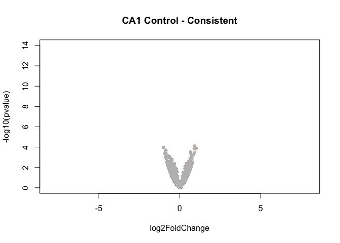

    resOrdered <- res[order(res$padj),]
    head(resOrdered)

    ## log2 fold change (MAP): APA Consistent vs Control 
    ## Wald test p-value: APA Consistent vs Control 
    ## DataFrame with 6 rows and 6 columns
    ##         baseMean log2FoldChange     lfcSE      stat       pvalue      padj
    ##        <numeric>      <numeric> <numeric> <numeric>    <numeric> <numeric>
    ## Glcci1  5.602879      1.0177457 0.2662372  3.822702 1.319970e-04 0.3922617
    ## Inhbb  18.952241     -1.0058674 0.2595364 -3.875631 1.063488e-04 0.3922617
    ## Iqub    2.478759      0.8935553 0.2350271  3.801925 1.435764e-04 0.3922617
    ## Tgm3    3.319002      0.9249198 0.2338192  3.955705 7.630939e-05 0.3922617
    ## Zfp128  5.388675      1.0090286 0.2655825  3.799304 1.451030e-04 0.3922617
    ## Zfp72   5.205219      0.9384218 0.2465670  3.805950 1.412609e-04 0.3922617

    res <- results(dds, contrast =c("APA", "Conflict", "Control"), independentFiltering = F)

    with(res, plot(log2FoldChange, -log10(pvalue), pch=20, main="CA1 Control - Conflict", xlim=c(-8,8), ylim=c(0,14)))
    with(subset(res, log2FoldChange>0), points(log2FoldChange, -log10(pvalue), pch=20, col=c("#ca0020")))
    with(subset(res, log2FoldChange<0), points(log2FoldChange, -log10(pvalue), pch=20, col=c("#404040")))
    with(subset(res, padj>.05 ), points(log2FoldChange, -log10(pvalue), pch=20, col="grey"))

    resOrdered <- res[order(res$padj),]
    head(resOrdered)

    ## log2 fold change (MAP): APA Conflict vs Control 
    ## Wald test p-value: APA Conflict vs Control 
    ## DataFrame with 6 rows and 6 columns
    ##           baseMean log2FoldChange     lfcSE      stat       pvalue
    ##          <numeric>      <numeric> <numeric> <numeric>    <numeric>
    ## Golt1b   56.322500     -0.7054837 0.1660531 -4.248542 2.151663e-05
    ## Otulin   14.218996      1.0407084 0.2431337  4.280396 1.865613e-05
    ## Ctcfl    42.289654     -1.0613954 0.2585936 -4.104493 4.052032e-05
    ## Dolk     15.738734      0.9483241 0.2526001  3.754251 1.738605e-04
    ## Gnaz   2111.356747     -0.9156856 0.2431812 -3.765446 1.662524e-04
    ## Itga10    9.836368     -1.0273637 0.2641075 -3.889946 1.002667e-04
    ##             padj
    ##        <numeric>
    ## Golt1b 0.1744999
    ## Otulin 0.1744999
    ## Ctcfl  0.2190799
    ## Dolk   0.3525021
    ## Gnaz   0.3525021
    ## Itga10 0.3525021

    res <- results(dds, contrast =c("APA", "Conflict", "Consistent"), independentFiltering = F)
    with(res, plot(log2FoldChange, -log10(pvalue), pch=20, main="CA1 Consistent - Conflict", xlim=c(-8,8), ylim=c(0,14)))
    with(subset(res, log2FoldChange>0), points(log2FoldChange, -log10(pvalue), pch=20, col=c("#ca0020")))
    with(subset(res, log2FoldChange<0), points(log2FoldChange, -log10(pvalue), pch=20, col=c("#f4a582")))
    with(subset(res, padj>.05 ), points(log2FoldChange, -log10(pvalue), pch=20, col="grey"))

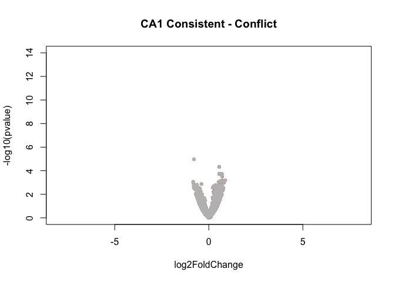

    resOrdered <- res[order(res$padj),]
    head(resOrdered)

    ## log2 fold change (MAP): APA Conflict vs Consistent 
    ## Wald test p-value: APA Conflict vs Consistent 
    ## DataFrame with 6 rows and 6 columns
    ##                baseMean log2FoldChange     lfcSE       stat       pvalue
    ##               <numeric>      <numeric> <numeric>  <numeric>    <numeric>
    ## Csmd2         143.98509     -0.7886069 0.1791680 -4.4014939 1.075081e-05
    ## Atp6v0c       236.46491      0.5569021 0.1369149  4.0675064 4.751891e-05
    ## Pebp1         233.46432      0.5517977 0.1473922  3.7437369 1.813035e-04
    ## Rps3           82.17330      0.6916195 0.1848090  3.7423473 1.823093e-04
    ## Psmb3          79.90954      0.7068087 0.1957780  3.6102559 3.058951e-04
    ## 0610007P14Rik  20.26220      0.1695772 0.2300323  0.7371886 4.610077e-01
    ##                    padj
    ##               <numeric>
    ## Csmd2         0.1743781
    ## Atp6v0c       0.3853784
    ## Pebp1         0.7392642
    ## Rps3          0.7392642
    ## Psmb3         0.9923237
    ## 0610007P14Rik 1.0000000

CA3 only differential gene expression
-------------------------------------

    countData <- read.csv("../data/02a_countData.csv", header = T, check.names = F, row.names = 1)
    colData <- read.csv("../data/02a_colData.csv", header = T)
    colData$APA <- factor(colData$APA, levels=c("Control", "Consistent", "Conflict"))

    colData <- colData %>% 
      filter(Punch == "CA3") 
    savecols <- as.character(colData$RNAseqID) 
    savecols <- as.vector(savecols) 
    countData <- countData %>% dplyr::select(one_of(savecols)) 

    dds <- DESeqDataSetFromMatrix(countData = countData,
                                  colData = colData,
                                  design = ~ APA )
    dds$APA <- factor(dds$APA, levels=c("Control", "Consistent", "Conflict"))
    dds <- dds[ rowSums(counts(dds)) > 1, ] 
    dds # dim: 16658 16   

    ## class: DESeqDataSet 
    ## dim: 16208 13 
    ## metadata(1): version
    ## assays(1): counts
    ## rownames(16208): 0610007P14Rik 0610009B22Rik ... Zzef1 Zzz3
    ## rowData names(0):
    ## colnames(13): 143A-CA3-1 144A-CA3-2 ... 148A-CA3-3 148B-CA3-4
    ## colData names(7): RNAseqID Mouse ... APA ID

    dds <- DESeq(dds)

    ## estimating size factors

    ## estimating dispersions

    ## gene-wise dispersion estimates

    ## mean-dispersion relationship

    ## final dispersion estimates

    ## fitting model and testing

    rld <- rlog(dds, blind=FALSE)

    contrast4 <- resvals(contrastvector = c("APA", "Consistent", "Control"), mypval = 0.05) #0

    ## [1] 0

    contrast5 <- resvals(contrastvector = c("APA", "Conflict", "Control"), mypval = 0.05) #0

    ## [1] 0

    contrast6 <- resvals(contrastvector = c("APA", "Conflict", "Consistent"), mypval = 0.05) # 3 

    ## [1] 3

    res <- results(dds, contrast = c("APA", "Conflict", "Consistent"), independentFiltering = F)
    resOrdered <- res[order(res$padj),]
    head(resOrdered)

    ## log2 fold change (MAP): APA Conflict vs Consistent 
    ## Wald test p-value: APA Conflict vs Consistent 
    ## DataFrame with 6 rows and 6 columns
    ##         baseMean log2FoldChange     lfcSE      stat       pvalue
    ##        <numeric>      <numeric> <numeric> <numeric>    <numeric>
    ## Oprd1   32.67546      -1.702574 0.3310140 -5.143512 2.696499e-07
    ## Crnkl1  21.85210       1.493098 0.3359650  4.444206 8.821700e-06
    ## Slc9a2  55.35987       1.212602 0.2693665  4.501680 6.741829e-06
    ## Mkrn2   67.46938       1.175035 0.2857154  4.112605 3.912190e-05
    ## Vps52   88.93894       0.858954 0.2124660  4.042783 5.282041e-05
    ## Lrrk2   41.08331      -1.290874 0.3239656 -3.984601 6.759371e-05
    ##               padj
    ##          <numeric>
    ## Oprd1  0.004336779
    ## Crnkl1 0.047293136
    ## Slc9a2 0.047293136
    ## Mkrn2  0.157299361
    ## Vps52  0.169902130
    ## Lrrk2  0.181184928

    # Oprd1 = Opioid Receptor Delta 1
    # Crnkl1 = Crooked Neck Pre- MRNA Splicing Factor 1
    # Slc9a2 = Solute Carrier Family 9 Member A2

    res <- results(dds, contrast =c("APA", "Consistent", "Control"), independentFiltering = F)
    with(res, plot(log2FoldChange, -log10(pvalue), pch=20, main="CA3 Control - Consistent", xlim=c(-8,8), ylim=c(0,14)))
    with(subset(res, log2FoldChange>0), points(log2FoldChange, -log10(pvalue), pch=20, col=c("#f4a582")))
    with(subset(res, log2FoldChange<0), points(log2FoldChange, -log10(pvalue), pch=20, col=c("#404040")))
    with(subset(res, padj>.05 ), points(log2FoldChange, -log10(pvalue), pch=20, col="grey"))

    resOrdered <- res[order(res$padj),]
    head(resOrdered)

    ## log2 fold change (MAP): APA Consistent vs Control 
    ## Wald test p-value: APA Consistent vs Control 
    ## DataFrame with 6 rows and 6 columns
    ##                 baseMean log2FoldChange     lfcSE      stat       pvalue
    ##                <numeric>      <numeric> <numeric> <numeric>    <numeric>
    ## Rhpn2           5.547833      1.5696323 0.3440295  4.562493 5.054968e-06
    ## Slc9a2         55.359865     -1.1656652 0.2598634 -4.485684 7.268025e-06
    ## Sod3           23.106068      1.3263207 0.3031901  4.374552 1.216823e-05
    ## Gsr            49.332636     -1.0682644 0.2804942 -3.808508 1.398079e-04
    ## Timm8a1        20.715590     -1.2706030 0.3398954 -3.738218 1.853295e-04
    ## 2900026A02Rik 119.066102     -0.8481215 0.2336842 -3.629350 2.841359e-04
    ##                     padj
    ##                <numeric>
    ## Rhpn2         0.05844582
    ## Slc9a2        0.05844582
    ## Sod3          0.06523388
    ## Gsr           0.56213244
    ## Timm8a1       0.59613085
    ## 2900026A02Rik 0.70385437

    res <- results(dds, contrast =c("APA", "Conflict", "Control"), independentFiltering = F)
    with(res, plot(log2FoldChange, -log10(pvalue), pch=20, main="CA3 Control - Conflict", xlim=c(-8,8), ylim=c(0,14)))
    with(subset(res, log2FoldChange>0), points(log2FoldChange, -log10(pvalue), pch=20, col=c("#ca0020")))
    with(subset(res, log2FoldChange<0), points(log2FoldChange, -log10(pvalue), pch=20, col=c("#404040")))
    with(subset(res, padj>.05 ), points(log2FoldChange, -log10(pvalue), pch=20, col="grey"))

    resOrdered <- res[order(res$padj),]
    head(resOrdered)

    ## log2 fold change (MAP): APA Conflict vs Control 
    ## Wald test p-value: APA Conflict vs Control 
    ## DataFrame with 6 rows and 6 columns
    ##                baseMean log2FoldChange     lfcSE       stat     pvalue
    ##               <numeric>      <numeric> <numeric>  <numeric>  <numeric>
    ## 0610007P14Rik 24.841302     0.14578018 0.2792956  0.5219566 0.60170057
    ## 0610009B22Rik 10.482645    -0.08970333 0.3416280 -0.2625760 0.79287737
    ## 0610009L18Rik  5.960207     0.15455867 0.3456736  0.4471232 0.65478613
    ## 0610009O20Rik 55.086602     0.53006956 0.2117222  2.5036087 0.01229339
    ## 0610010F05Rik 10.326053    -0.11174704 0.2983520 -0.3745476 0.70799691
    ## 0610010K14Rik  1.461658     0.17646004 0.3116177  0.5662709 0.57120967
    ##                    padj
    ##               <numeric>
    ## 0610007P14Rik         1
    ## 0610009B22Rik         1
    ## 0610009L18Rik         1
    ## 0610009O20Rik         1
    ## 0610010F05Rik         1
    ## 0610010K14Rik         1

    res <- results(dds, contrast =c("APA", "Conflict", "Consistent"), independentFiltering = F)
    with(res, plot(log2FoldChange, -log10(pvalue), pch=20, main="CA3 Consistent - Conflict", xlim=c(-8,8), ylim=c(0,14)))
    with(subset(res, log2FoldChange>0), points(log2FoldChange, -log10(pvalue), pch=20, col=c("#ca0020")))
    with(subset(res, log2FoldChange<0), points(log2FoldChange, -log10(pvalue), pch=20, col=c("#f4a582")))
    with(subset(res, padj>.05 ), points(log2FoldChange, -log10(pvalue), pch=20, col="grey"))

    resOrdered <- res[order(res$padj),]
    head(resOrdered)

    ## log2 fold change (MAP): APA Conflict vs Consistent 
    ## Wald test p-value: APA Conflict vs Consistent 
    ## DataFrame with 6 rows and 6 columns
    ##         baseMean log2FoldChange     lfcSE      stat       pvalue
    ##        <numeric>      <numeric> <numeric> <numeric>    <numeric>
    ## Oprd1   32.67546      -1.702574 0.3310140 -5.143512 2.696499e-07
    ## Crnkl1  21.85210       1.493098 0.3359650  4.444206 8.821700e-06
    ## Slc9a2  55.35987       1.212602 0.2693665  4.501680 6.741829e-06
    ## Mkrn2   67.46938       1.175035 0.2857154  4.112605 3.912190e-05
    ## Vps52   88.93894       0.858954 0.2124660  4.042783 5.282041e-05
    ## Lrrk2   41.08331      -1.290874 0.3239656 -3.984601 6.759371e-05
    ##               padj
    ##          <numeric>
    ## Oprd1  0.004336779
    ## Crnkl1 0.047293136
    ## Slc9a2 0.047293136
    ## Mkrn2  0.157299361
    ## Vps52  0.169902130
    ## Lrrk2  0.181184928

    pcadata <- pcadataframe(rld, intgroup=c("Punch","APA"), returnData=TRUE)
    percentVar <- round(100 * attr(pcadata, "percentVar"))
    percentVar

    ## [1] 40 13 10  8  7  4  4  3  3

    pcadata <- pcadataframe(rld, intgroup=c("Punch","APA"), returnData=TRUE)
    percentVar <- round(100 * attr(pcadata, "percentVar"))
    aov1 <- aov(PC1 ~ APA, data=pcadata)
    summary(aov1) 

    ##             Df Sum Sq Mean Sq F value Pr(>F)
    ## APA          2  226.5  113.26   1.765  0.221
    ## Residuals   10  641.7   64.17

    TukeyHSD(aov1, which = "APA")

    ##   Tukey multiple comparisons of means
    ##     95% family-wise confidence level
    ## 
    ## Fit: aov(formula = PC1 ~ APA, data = pcadata)
    ## 
    ## $APA
    ##                          diff        lwr      upr     p adj
    ## Consistent-Control  12.036734  -5.892737 29.96621 0.2062884
    ## Conflict-Control     4.738558  -8.558293 18.03541 0.6069867
    ## Conflict-Consistent -7.298176 -25.670417 11.07406 0.5417691

    pcadata$Punch <- factor(pcadata$APA, levels=c("Control", "Consistent", "Conflict"))
    plotPCs(pcadata, 1, 2, aescolor = pcadata$APA, colorname = "APA", aesshape = pcadata$APA, shapename = "APA",  colorvalues = colorvalAPA)

    ## Don't know how to automatically pick scale for object of type data.frame. Defaulting to continuous.
    ## Don't know how to automatically pick scale for object of type data.frame. Defaulting to continuous.

    DEGes <- assay(rld)
    DEGes <- cbind(DEGes, contrast4, contrast5, contrast6)
    DEGes <- as.data.frame(DEGes) 
    DEGes$rownames <- rownames(DEGes)  
    DEGes$padjmin <- with(DEGes, pmin(padjAPAConsistentControl, padjAPAConflictControl, padjAPAConflictConsistent)) 
    DEGes <- DEGes %>% filter(padjmin < 0.05)
    rownames(DEGes) <- DEGes$rownames
    drop.cols <-colnames(DEGes[,grep("padj|pval|rownames", colnames(DEGes))])
    DEGes <- DEGes %>% dplyr::select(-one_of(drop.cols))
    DEGes <- as.matrix(DEGes)
    DEGes <- DEGes - rowMeans(DEGes)
    df <- as.data.frame(colData(dds)[,c("APA", "Punch")]) #
    rownames(df) <- names(countData)
    ann_colors = ann_colors1 
    DEGes <- as.matrix(DEGes) 
    paletteLength <- 30
    myBreaks <- c(seq(min(DEGes), 0, length.out=ceiling(paletteLength/2) + 1), 
                  seq(max(DEGes)/paletteLength, max(DEGes), length.out=floor(paletteLength/2)))
    pheatmap(DEGes, show_colnames=T, show_rownames = F,
             annotation_col=df, annotation_colors = ann_colors,
             treeheight_row = 0, treeheight_col = 25,
             fontsize = 11, 
             #width=4.5, height=3,
             border_color = "grey60" ,
             color = colorpalette,
             cellwidth = 8,
             cellheight = 2,
             clustering_method="average",
             breaks=myBreaks,
             clustering_distance_cols="correlation" 
             )

    rldpvals <- assay(rld)
    rldpvals <- cbind(rldpvals, contrast4, contrast5, contrast6)
    rldpvals <- as.data.frame(rldpvals)
    rldpvals <- rldpvals[ , grepl( "padj|pval" , names( rldpvals ) ) ]

    # venn with padj values
    venn1 <- row.names(rldpvals[rldpvals[2] <0.05 & !is.na(rldpvals[2]),])
    venn2 <- row.names(rldpvals[rldpvals[4] <0.05 & !is.na(rldpvals[4]),])
    venn3 <- row.names(rldpvals[rldpvals[6] <0.05 & !is.na(rldpvals[6]),])
    venn12 <- union(venn1,venn2)
    venn123 <- union(venn12,venn3)
    venn1minus2 <- setdiff(venn1,venn2)
    # save files for big venn diagram
    write(venn123, "../data/20c_vennDGAll.txt")
    write(venn1, "../data/20c_vennDGControlConsistent.txt")
    write(venn2, "../data/20c_vennDGControlConflict.txt")
    write(venn1minus2, "../data/20c_vennDGControlminusConsistent.txt")

    ## check order for correctness
    candidates <- list("Control-Consistent" = venn1, "Control-Conflict" = venn2,"Consistent-Conflict" = venn3)

    prettyvenn <- venn.diagram(
      scaled=T,
      x = candidates, filename=NULL, 
      col = "black",
      fill = c( "white", "white", "white"),
      alpha = 0.5,
      cex = 1, fontfamily = "sans", #fontface = "bold",
      cat.default.pos = "text",
      cat.dist = c(0.06, 0.06, 0.05), cat.pos = 1,
      cat.cex = 1, cat.fontfamily = "sans")
    #dev.off()
    grid.draw(prettyvenn)

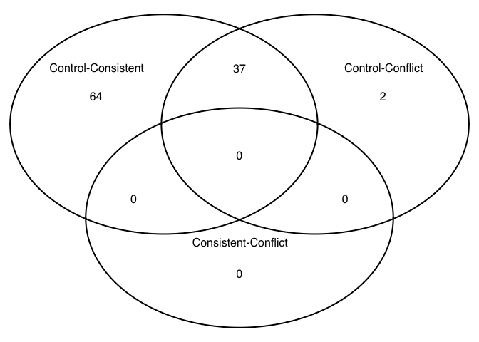

    res <- results(dds, contrast =c("APA", "Consistent", "Control"), independentFiltering = F)
    table(res$padj<0.05)

    ## 
    ## FALSE 
    ## 16083

    table(res$pvalue<0.05)

    ## 
    ## FALSE  TRUE 
    ## 15426   657

    logs <- data.frame(cbind("gene"=row.names(res),"logP"=round(-log(res$pvalue+1e-10,10),1)))
    logs$logP <- as.numeric(as.character(logs$logP))
    sign <- rep(1,nrow(logs))
    sign[res$log2FoldChange<0]=-1  ##change to correct model
    table(sign)

    ## sign
    ##   -1    1 
    ## 7787 8421

    logs$logP <- logs$logP*sign
    write.csv(logs, file = "./02d_GO_MWU/padjAPAConsistentControlDG.csv", row.names = F)

    res <- results(dds, contrast =c("APA", "Conflict", "Control"), independentFiltering = F)
    table(res$padj<0.05)

    ## 
    ## FALSE 
    ## 16083

    table(res$pvalue<0.05)

    ## 
    ## FALSE  TRUE 
    ## 15514   569

    logs <- data.frame(cbind("gene"=row.names(res),"logP"=round(-log(res$pvalue+1e-10,10),1)))
    logs$logP <- as.numeric(as.character(logs$logP))
    sign <- rep(1,nrow(logs))
    sign[res$log2FoldChange<0]=-1  ##change to correct model
    table(sign)

    ## sign
    ##   -1    1 
    ## 7597 8611

    logs$logP <- logs$logP*sign
    write.csv(logs, file = "./02d_GO_MWU/padjAPAConflictControlDG.csv", row.names = F)

    countData <- read.csv("../data/02a_countData.csv", header = T, check.names = F, row.names = 1)
    colData <- read.csv("../data/02a_colData.csv", header = T)

    colData <- colData %>% 
      filter(APA == "Conflict") 
    savecols <- as.character(colData$RNAseqID) 
    savecols <- as.vector(savecols) 
    countData <- countData %>% dplyr::select(one_of(savecols)) 

    dds <- DESeqDataSetFromMatrix(countData = countData,
                                  colData = colData,
                                  design = ~ Punch )

    dds <- dds[ rowSums(counts(dds)) > 1, ] 
    dds # dim: 16576 14    

    ## class: DESeqDataSet 
    ## dim: 16576 14 
    ## metadata(1): version
    ## assays(1): counts
    ## rownames(16576): 0610007P14Rik 0610009B22Rik ... Zzef1 Zzz3
    ## rowData names(0):
    ## colnames(14): 143A-CA3-1 143A-DG-1 ... 148A-CA3-3 148A-DG-3
    ## colData names(7): RNAseqID Mouse ... APA ID

    dds <- DESeq(dds)

    ## estimating size factors

    ## estimating dispersions

    ## gene-wise dispersion estimates

    ## mean-dispersion relationship

    ## final dispersion estimates

    ## fitting model and testing

    dds$APA <- factor(dds$Punch, levels=c("DG", "CA3", "CA1"))
    rld <- rlog(dds, blind=FALSE)

    contrast1 <- resvals(contrastvector = c("Punch", "CA1", "DG"), mypval = 0.05) #2526

    ## [1] 2526

    contrast2 <- resvals(contrastvector = c("Punch", "CA1", "CA3"), mypval = 0.05) #1318

    ## [1] 1318

    contrast3 <- resvals(contrastvector = c("Punch", "CA3", "DG"), mypval = 0.05) #3776

    ## [1] 3776

    res <- results(dds, contrast =c("Punch", "CA1", "DG"), independentFiltering = F)
    with(res, plot(log2FoldChange, -log10(pvalue), pch=20, main="Conflict: DG - CA1", xlim=c(-8,8), ylim=c(0,100)))
    with(subset(res, log2FoldChange>0), points(log2FoldChange, -log10(pvalue), pch=20, col=c("#7570b3")))
    with(subset(res, log2FoldChange<0), points(log2FoldChange, -log10(pvalue), pch=20, col=c("#d95f02")))
    with(subset(res, padj>.05 ), points(log2FoldChange, -log10(pvalue), pch=20, col="grey"))

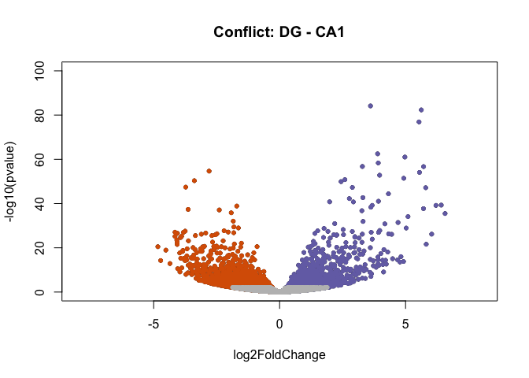

    resOrdered <- res[order(res$padj),]
    head(resOrdered)

    ## log2 fold change (MAP): Punch CA1 vs DG 
    ## Wald test p-value: Punch CA1 vs DG 
    ## DataFrame with 6 rows and 6 columns
    ##          baseMean log2FoldChange     lfcSE      stat       pvalue
    ##         <numeric>      <numeric> <numeric> <numeric>    <numeric>
    ## Stmn2    635.0074       3.607199 0.1847806  19.52152 7.205791e-85
    ## Neurod6  436.8957       5.624931 0.2913316  19.30766 4.631032e-83
    ## Wfs1     203.5509       5.533648 0.2966880  18.65141 1.229967e-77
    ## Cck      602.8712       3.890345 0.2318081  16.78261 3.271210e-63
    ## Gm2115   273.6611       4.973517 0.2999401  16.58170 9.451234e-62
    ## Khdrbs3  416.1697       3.915947 0.2415860  16.20933 4.332690e-59
    ##                 padj
    ##            <numeric>
    ## Stmn2   1.181533e-80
    ## Neurod6 3.796752e-79
    ## Wfs1    6.722591e-74
    ## Cck     1.340951e-59
    ## Gm2115  3.099438e-58
    ## Khdrbs3 1.184052e-55

    res <- results(dds, contrast =c("Punch", "CA1", "CA3"), independentFiltering = F)
    with(res, plot(log2FoldChange, -log10(pvalue), pch=20, main="Conflict: CA3 - CA1", xlim=c(-8,8), ylim=c(0,100)))
    with(subset(res, log2FoldChange>0), points(log2FoldChange, -log10(pvalue), pch=20, col=c("#7570b3")))
    with(subset(res, log2FoldChange<0), points(log2FoldChange, -log10(pvalue), pch=20, col=c("#1b9e77")))
    with(subset(res, padj>.05 ), points(log2FoldChange, -log10(pvalue), pch=20, col="grey"))

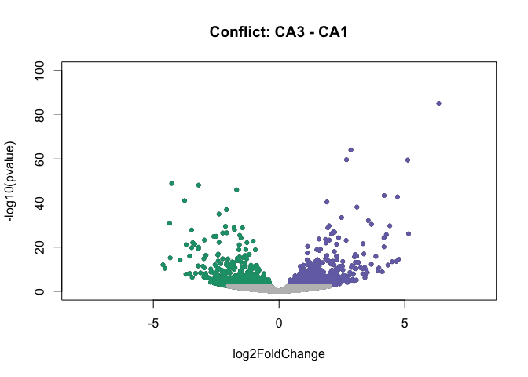

    resOrdered <- res[order(res$padj),]
    head(resOrdered)

    ## log2 fold change (MAP): Punch CA1 vs CA3 
    ## Wald test p-value: Punch CA1 vs CA3 
    ## DataFrame with 6 rows and 6 columns
    ##         baseMean log2FoldChange     lfcSE      stat       pvalue
    ##        <numeric>      <numeric> <numeric> <numeric>    <numeric>
    ## Doc2b  417.54425       6.352406 0.3236889  19.62504 9.450525e-86
    ## Adcy1 3571.11259       2.856500 0.1680295  16.99999 8.213549e-65
    ## Itpka  893.89613       2.682391 0.1636019  16.39584 2.047928e-60
    ## Wfs1   203.55086       5.116992 0.3125175  16.37346 2.959168e-60
    ## Bok     83.72915      -4.269617 0.2883193 -14.80864 1.288203e-49
    ## Neto1  249.78404      -3.200822 0.2179199 -14.68806 7.687873e-49
    ##               padj
    ##          <numeric>
    ## Doc2b 1.549603e-81
    ## Adcy1 6.733878e-61
    ## Itpka 1.119329e-56
    ## Wfs1  1.213037e-56
    ## Bok   4.224534e-46
    ## Neto1 2.100967e-45

    res <- results(dds, contrast =c("Punch", "CA3", "DG"), independentFiltering = F)
    with(res, plot(log2FoldChange, -log10(pvalue), pch=20, main="Conflict: DG - CA3", xlim=c(-8,8), ylim=c(0,100)))
    with(subset(res, log2FoldChange>0), points(log2FoldChange, -log10(pvalue), pch=20, col=c("#1b9e77")))
    with(subset(res, log2FoldChange<0), points(log2FoldChange, -log10(pvalue), pch=20, col=c("#d95f02")))
    with(subset(res, padj>.05 ), points(log2FoldChange, -log10(pvalue), pch=20, col="grey"))

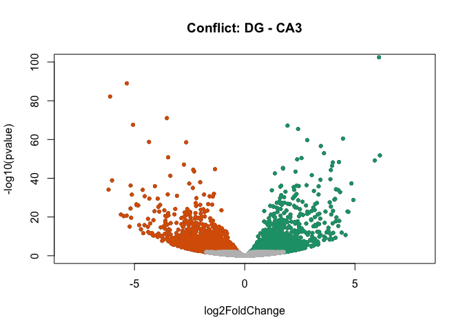

    resOrdered <- res[order(res$padj),]
    head(resOrdered)

    ## log2 fold change (MAP): Punch CA3 vs DG 
    ## Wald test p-value: Punch CA3 vs DG 
    ## DataFrame with 6 rows and 6 columns
    ##          baseMean log2FoldChange     lfcSE      stat        pvalue
    ##         <numeric>      <numeric> <numeric> <numeric>     <numeric>
    ## Stmn2    635.0074       5.379389 0.1775006  30.30632 9.463133e-202
    ## Adcy1   3571.1126      -4.672532 0.1594125 -29.31096 7.519651e-189
    ## Neurod6  436.8957       6.089515 0.2823393  21.56807 3.583206e-103
    ## Fam163b  839.9362      -5.347787 0.2662799 -20.08333  1.032357e-89
    ## Doc2b    417.5442      -6.105896 0.3165350 -19.28980  6.542772e-83
    ## Pitpnm2  212.7116      -3.530919 0.1971005 -17.91431  9.119041e-72
    ##                  padj
    ##             <numeric>
    ## Stmn2   1.551670e-197
    ## Adcy1   6.164986e-185
    ## Neurod6  1.958461e-99
    ## Fam163b  4.231891e-86
    ## Doc2b    2.145636e-79
    ## Pitpnm2  2.492082e-68

    countData <- read.csv("../data/02a_countData.csv", header = T, check.names = F, row.names = 1)
    colData <- read.csv("../data/02a_colData.csv", header = T)

    colData <- colData %>% 
      filter(APA == "Control") 
    savecols <- as.character(colData$RNAseqID) 
    savecols <- as.vector(savecols) 
    countData <- countData %>% dplyr::select(one_of(savecols)) 

    dds <- DESeqDataSetFromMatrix(countData = countData,
                                  colData = colData,
                                  design = ~ Punch )

    dds <- dds[ rowSums(counts(dds)) > 1, ] 
    dds # dim: 16716 21     

    ## class: DESeqDataSet 
    ## dim: 16716 21 
    ## metadata(1): version
    ## assays(1): counts
    ## rownames(16716): 0610007P14Rik 0610009B22Rik ... Zzef1 Zzz3
    ## rowData names(0):
    ## colnames(21): 143B-CA1-1 143B-DG-1 ... 148B-CA3-4 148B-DG-4
    ## colData names(7): RNAseqID Mouse ... APA ID

    dds <- DESeq(dds)

    ## estimating size factors

    ## estimating dispersions

    ## gene-wise dispersion estimates

    ## mean-dispersion relationship

    ## final dispersion estimates

    ## fitting model and testing

    ## -- replacing outliers and refitting for 224 genes
    ## -- DESeq argument 'minReplicatesForReplace' = 7 
    ## -- original counts are preserved in counts(dds)

    ## estimating dispersions

    ## fitting model and testing

    dds$APA <- factor(dds$Punch, levels=c("DG", "CA3", "CA1"))

    rld <- rlog(dds, blind=FALSE)
    contrast1 <- resvals(contrastvector = c("Punch", "CA1", "DG"), mypval = 0.05) #2013

    ## [1] 2013

    contrast2 <- resvals(contrastvector = c("Punch", "CA1", "CA3"), mypval = 0.05) #1391

    ## [1] 1391

    contrast3 <- resvals(contrastvector = c("Punch", "CA3", "DG"), mypval = 0.05) #2728

    ## [1] 2728

    res <- results(dds, contrast =c("Punch", "CA1", "DG"), independentFiltering = F)
    with(res, plot(log2FoldChange, -log10(pvalue), pch=20, main="Control: DG - CA1", xlim=c(-8,8), ylim=c(0,100)))
    with(subset(res, log2FoldChange>0), points(log2FoldChange, -log10(pvalue), pch=20, col=c("#7570b3")))
    with(subset(res, log2FoldChange<0), points(log2FoldChange, -log10(pvalue), pch=20, col=c("#d95f02")))
    with(subset(res, padj>.05 ), points(log2FoldChange, -log10(pvalue), pch=20, col="grey"))

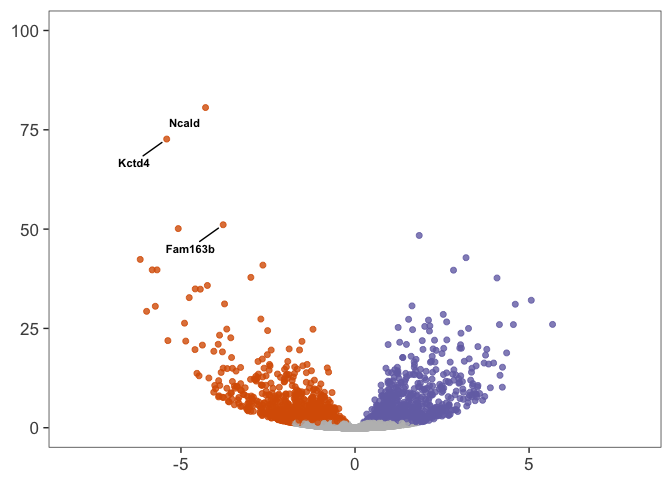

    resOrdered <- res[order(res$padj),]
    head(resOrdered)

    ## log2 fold change (MAP): Punch CA1 vs DG 
    ## Wald test p-value: Punch CA1 vs DG 
    ## DataFrame with 6 rows and 6 columns
    ##          baseMean log2FoldChange     lfcSE      stat       pvalue
    ##         <numeric>      <numeric> <numeric> <numeric>    <numeric>
    ## Ncald   102.77845      -4.293895 0.2190587 -19.60157 1.499188e-85
    ## Kctd4    87.21767      -5.409615 0.2906505 -18.61210 2.563906e-77
    ## Fam163b 494.20098      -3.786996 0.2411539 -15.70365 1.427937e-55
    ## Stxbp6   48.54075      -5.077638 0.3266725 -15.54351 1.760579e-54
    ## Actr3b  114.60165       1.844193 0.1207630  15.27118 1.189935e-52
    ## Pex5l    35.38824       3.188539 0.2215074  14.39473 5.584640e-47
    ##                 padj
    ##            <numeric>
    ## Ncald   2.499147e-81
    ## Kctd4   2.137016e-73
    ## Fam163b 7.934571e-52
    ## Stxbp6  7.337212e-51
    ## Actr3b  3.967245e-49
    ## Pex5l   1.551599e-43

    data <- data.frame(gene = row.names(res), pvalue = -log10(res$padj), lfc = res$log2FoldChange)
    data <- na.omit(data)
    head(data)

    ##            gene     pvalue         lfc
    ## 1 0610007P14Rik 0.00000000  0.03360084
    ## 2 0610009B22Rik 0.04562690  0.33439597
    ## 3 0610009L18Rik 0.11626224 -0.57236943
    ## 4 0610009O20Rik 0.09729335 -0.29471017
    ## 5 0610010F05Rik 0.09846403 -0.31706029
    ## 6 0610010K14Rik 0.00000000 -0.11024369

    data <- data %>%
      mutate(color = ifelse(data$lfc > 0 & data$pvalue > 1.3, 
                            yes = "CA1", 
                            no = ifelse(data$lfc < 0 & data$pvalue > 1.3, 
                                        yes = "DG", 
                                        no = "none")))

    # Color corresponds to fold change directionality
    colored <- ggplot(data, aes(x = lfc, y = pvalue)) + 
      geom_point(aes(color = factor(color)), size = 1.75, alpha = 0.8, na.rm = T) + # add gene points
      theme_bw(base_size = 16) + # clean up theme
      theme(legend.position = "none") + # remove legend 
      #ggtitle(label = "Volcano Plot", subtitle = "Colored by directionality") +  # add title
      #xlab(expression(log[2]("Consistent" / "Control"))) + # x-axis label
      #ylab(expression(-log[10]("adjusted p-value"))) + # y-axis label
      #geom_vline(xintercept = 0, colour = "black") + # add line at 0
      #geom_hline(yintercept = 1.3, colour = "black") + # p(0.05) = 1.3
      xlim(c(-8, 8)) +  
      ylim(c(0, 100)) +   
      scale_color_manual(values = c("CA1" = "#7570b3",
                                    "DG" = "#d95f02", 
                                    "none" = "#bdbdbd")) + theme(panel.grid.minor=element_blank(),
               panel.grid.major=element_blank()) + 
      theme(axis.title.x = element_blank())+ 
      theme(axis.title.y = element_blank())

    colored

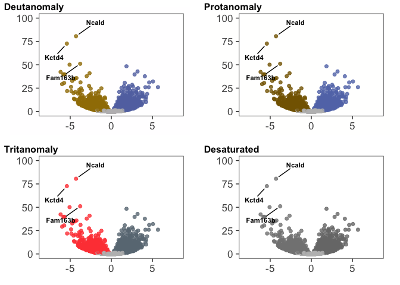

    pdf(file="../figures/02_RNAseq/ControlDGCA1.pdf", width=3, height=3)
    plot(colored)
    dev.off()

    ## quartz_off_screen 
    ##                 2

    res <- results(dds, contrast =c("Punch", "CA1", "CA3"), independentFiltering = F)
    with(res, plot(log2FoldChange, -log10(pvalue), pch=20, main="Control: CA3 - CA1", xlim=c(-8,8), ylim=c(0,100)))
    with(subset(res, log2FoldChange>0), points(log2FoldChange, -log10(pvalue), pch=20, col=c("#7570b3")))
    with(subset(res, log2FoldChange<0), points(log2FoldChange, -log10(pvalue), pch=20, col=c("#1b9e77")))
    with(subset(res, padj>.05 ), points(log2FoldChange, -log10(pvalue), pch=20, col="grey"))

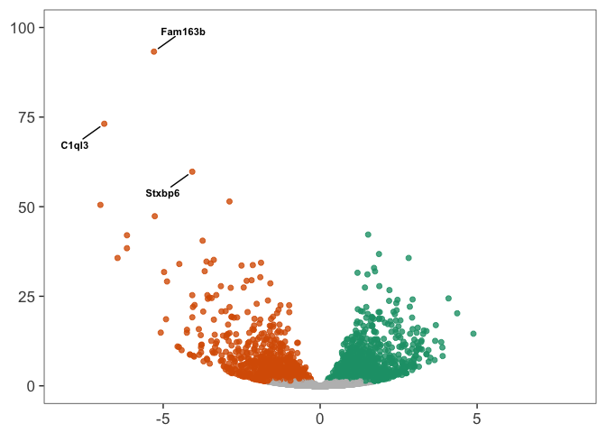

    resOrdered <- res[order(res$padj),]
    head(resOrdered)

    ## log2 fold change (MAP): Punch CA1 vs CA3 
    ## Wald test p-value: Punch CA1 vs CA3 
    ## DataFrame with 6 rows and 6 columns
    ##         baseMean log2FoldChange     lfcSE      stat       pvalue
    ##        <numeric>      <numeric> <numeric> <numeric>    <numeric>
    ## Itpka  552.19533       2.833217 0.1406084  20.14970 2.707693e-90
    ## Fibcd1 307.21960       6.736320 0.3356504  20.06945 1.365001e-89
    ## Ncald  102.77845      -4.090027 0.2198669 -18.60229 3.078810e-77
    ## Nptxr  783.30036      -2.635561 0.1454049 -18.12567 1.999071e-73
    ## Kctd4   87.21767      -4.769426 0.2920732 -16.32956 6.082363e-60
    ## Doc2b  267.97255       5.740528 0.3543529  16.20003 5.040052e-59
    ##                padj
    ##           <numeric>
    ## Itpka  4.513723e-86
    ## Fibcd1 1.137728e-85
    ## Ncald  1.710792e-73
    ## Nptxr  8.331127e-70
    ## Kctd4  2.027860e-56
    ## Doc2b  1.400295e-55

    res <- results(dds, contrast =c("Punch", "CA3", "DG"), independentFiltering = F)
    with(res, plot(log2FoldChange, -log10(pvalue), pch=20, main="Control: DG - CA3", xlim=c(-8,8), ylim=c(0,100)))
    with(subset(res, log2FoldChange>0), points(log2FoldChange, -log10(pvalue), pch=20, col=c("#1b9e77")))
    with(subset(res, log2FoldChange<0), points(log2FoldChange, -log10(pvalue), pch=20, col=c("#d95f02")))
    with(subset(res, padj>.05 ), points(log2FoldChange, -log10(pvalue), pch=20, col="grey"))

    resOrdered <- res[order(res$padj),]
    head(resOrdered)

    ## log2 fold change (MAP): Punch CA3 vs DG 
    ## Wald test p-value: Punch CA3 vs DG 
    ## DataFrame with 6 rows and 6 columns
    ##          baseMean log2FoldChange     lfcSE      stat       pvalue
    ##         <numeric>      <numeric> <numeric> <numeric>    <numeric>
    ## Fam163b 494.20098      -5.293706 0.2516780 -21.03365 3.228482e-98
    ## C1ql3   188.90951      -6.876556 0.3683186 -18.67013 8.664531e-78
    ## Stxbp6   48.54075      -4.073782 0.2407414 -16.92181 3.107183e-64
    ## Pitpnm2 118.25428      -2.888456 0.1835521 -15.73643 8.510688e-56
    ## Plk5     43.29762      -6.999293 0.4491666 -15.58284 9.522247e-55
    ## Doc2b   267.97255      -5.267664 0.3488636 -15.09949 1.631791e-51
    ##                 padj
    ##            <numeric>
    ## Fam163b 5.381879e-94
    ## C1ql3   7.221887e-74
    ## Stxbp6  1.726558e-60
    ## Pitpnm2 3.546829e-52
    ## Plk5    3.174717e-51
    ## Doc2b   4.533659e-48

    data <- data.frame(gene = row.names(res), pvalue = -log10(res$padj), lfc = res$log2FoldChange)
    data <- na.omit(data)
    head(data)

    ##            gene      pvalue         lfc
    ## 1 0610007P14Rik 0.005462893  0.03088043
    ## 2 0610009B22Rik 0.731381817  0.98676726
    ## 3 0610009L18Rik 0.008202783  0.09922997
    ## 4 0610009O20Rik 0.182410061 -0.34261420
    ## 5 0610010F05Rik 0.221985919  0.35620693
    ## 6 0610010K14Rik 0.380072216 -0.82692064

    data <- data %>%
      mutate(color = ifelse(data$lfc > 0 & data$pvalue > 1.3, 
                            yes = "CA3", 
                            no = ifelse(data$lfc < 0 & data$pvalue > 1.3, 
                                        yes = "DG", 
                                        no = "none")))

    # Color corresponds to fold change directionality
    colored <- ggplot(data, aes(x = lfc, y = pvalue)) + 
      geom_point(aes(color = factor(color)), size = 1.75, alpha = 0.8, na.rm = T) + # add gene points
      theme_bw(base_size = 16) + # clean up theme
      theme(legend.position = "none") + # remove legend 
      #ggtitle(label = "Volcano Plot", subtitle = "Colored by directionality") +  # add title
      #xlab(expression(log[2]("Consistent" / "Control"))) + # x-axis label
      #ylab(expression(-log[10]("adjusted p-value"))) + # y-axis label
      #geom_vline(xintercept = 0, colour = "black") + # add line at 0
      #geom_hline(yintercept = 1.3, colour = "black") + # p(0.05) = 1.3
      xlim(c(-8, 8)) +  
      ylim(c(0, 100)) +  
      scale_color_manual(values = c("CA3" = "#1b9e77",
                                    "DG" = "#d95f02", 
                                    "none" = "#bdbdbd")) + theme(panel.grid.minor=element_blank(),
               panel.grid.major=element_blank()) + 
      theme(axis.title.x = element_blank())+ 
      theme(axis.title.y = element_blank())

    colored

    pdf(file="../figures/02_RNAseq/ControlDGCA3.pdf", width=3, height=3)
    plot(colored)
    dev.off()

    ## quartz_off_screen 
    ##                 2

    countData <- read.csv("../data/02a_countData.csv", header = T, check.names = F, row.names = 1)
    colData <- read.csv("../data/02a_colData.csv", header = T)

    colData <- colData %>% 
      filter(APA == "Consistent") 
    savecols <- as.character(colData$RNAseqID) 
    savecols <- as.vector(savecols) 
    countData <- countData %>% dplyr::select(one_of(savecols)) 

    dds <- DESeqDataSetFromMatrix(countData = countData,
                                  colData = colData,
                                  design = ~ Punch )

    dds <- dds[ rowSums(counts(dds)) > 1, ] 
    dds # dim: 16716 21     

    ## class: DESeqDataSet 
    ## dim: 16435 9 
    ## metadata(1): version
    ## assays(1): counts
    ## rownames(16435): 0610007P14Rik 0610009B22Rik ... Zzef1 Zzz3
    ## rowData names(0):
    ## colnames(9): 143C-CA1-1 144C-CA1-2 ... 147C-CA3-3 147C-DG-3
    ## colData names(7): RNAseqID Mouse ... APA ID

    dds <- DESeq(dds)

    ## estimating size factors

    ## estimating dispersions

    ## gene-wise dispersion estimates

    ## mean-dispersion relationship

    ## final dispersion estimates

    ## fitting model and testing

    dds$APA <- factor(dds$Punch, levels=c("DG", "CA3", "CA1"))

    rld <- rlog(dds, blind=FALSE)
    contrast1 <- resvals(contrastvector = c("Punch", "CA1", "DG"), mypval = 0.05) #2013

    ## [1] 1683

    contrast2 <- resvals(contrastvector = c("Punch", "CA1", "CA3"), mypval = 0.05) #1391

    ## [1] 1212

    contrast3 <- resvals(contrastvector = c("Punch", "CA3", "DG"), mypval = 0.05) #2728

    ## [1] 2107

    res <- results(dds, contrast =c("Punch", "CA1", "DG"), independentFiltering = F)
    with(res, plot(log2FoldChange, -log10(pvalue), pch=20, main="Consistent: DG - CA1", xlim=c(-8,8), ylim=c(0,100)))
    with(subset(res, log2FoldChange>0), points(log2FoldChange, -log10(pvalue), pch=20, col=c("#7570b3")))
    with(subset(res, log2FoldChange<0), points(log2FoldChange, -log10(pvalue), pch=20, col=c("#d95f02")))
    with(subset(res, padj>.05 ), points(log2FoldChange, -log10(pvalue), pch=20, col="grey"))

    resOrdered <- res[order(res$padj),]
    head(resOrdered)

    ## log2 fold change (MAP): Punch CA1 vs DG 
    ## Wald test p-value: Punch CA1 vs DG 
    ## DataFrame with 6 rows and 6 columns
    ##          baseMean log2FoldChange     lfcSE      stat        pvalue
    ##         <numeric>      <numeric> <numeric> <numeric>     <numeric>
    ## Dkk3     895.8230       4.526971 0.1847608  24.50179 1.413504e-132
    ## Gm2115   400.2670       5.720196 0.2502937  22.85394 1.335480e-115
    ## Wfs1     312.5904       5.555131 0.2707270  20.51931  1.447595e-93
    ## Pou3f1   353.2435       5.679073 0.2875507  19.74981  8.051865e-87
    ## Fibcd1   549.4555       4.115181 0.2332721  17.64112  1.190824e-69
    ## Neurod6  309.0811       5.990503 0.3512197  17.05628  3.138966e-65
    ##                  padj
    ##             <numeric>
    ## Dkk3    2.311079e-128
    ## Gm2115  1.091755e-111
    ## Wfs1     7.889393e-90
    ## Pou3f1   3.291200e-83
    ## Fibcd1   3.893994e-66
    ## Neurod6  8.553683e-62

    data <- data.frame(gene = row.names(res), pvalue = -log10(res$padj), lfc = res$log2FoldChange)
    data <- na.omit(data)
    head(data)

    ##            gene      pvalue        lfc
    ## 1 0610007P14Rik 0.006917519 -0.1519072
    ## 2 0610009B22Rik 0.021233607 -0.3818998
    ## 3 0610009L18Rik 0.013555589  0.4131756
    ## 4 0610009O20Rik 0.031193755 -0.2268451
    ## 5 0610010F05Rik 0.021731460 -0.3416711
    ## 6 0610010K14Rik 0.017542662  0.4627727

    data <- data %>%
      mutate(color = ifelse(data$lfc > 0 & data$pvalue > 1.3, 
                            yes = "CA1", 
                            no = ifelse(data$lfc < 0 & data$pvalue > 1.3, 
                                        yes = "DG", 
                                        no = "none")))

    # Color corresponds to fold change directionality
    colored <- ggplot(data, aes(x = lfc, y = pvalue)) + 
      geom_point(aes(color = factor(color)), size = 1.75, alpha = 0.8, na.rm = T) + # add gene points
      theme_bw(base_size = 16) + # clean up theme
      theme(legend.position = "none") + # remove legend 
      #ggtitle(label = "Volcano Plot", subtitle = "Colored by directionality") +  # add title
      #xlab(expression(log[2]("Consistent" / "Control"))) + # x-axis label
      #ylab(expression(-log[10]("adjusted p-value"))) + # y-axis label
      #geom_vline(xintercept = 0, colour = "black") + # add line at 0
      #geom_hline(yintercept = 1.3, colour = "black") + # p(0.05) = 1.3
      xlim(c(-8, 8)) +  
      ylim(c(0, 100)) +   
      scale_color_manual(values = c("CA1" = "#7570b3",
                                    "DG" = "#d95f02", 
                                    "none" = "#bdbdbd")) + theme(panel.grid.minor=element_blank(),
                                                                 panel.grid.major=element_blank()) + 
      theme(axis.title.x = element_blank())+ 
      theme(axis.title.y = element_blank())

    colored

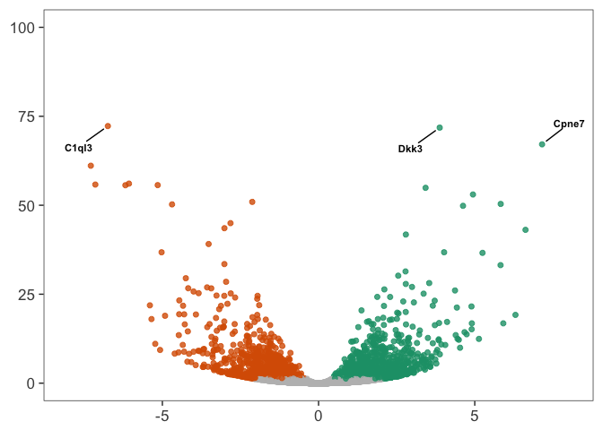

    pdf(file="../figures/02_RNAseq/ConsistentDGCA1.pdf", width=3, height=3)
    plot(colored)
    dev.off()

    ## quartz_off_screen 
    ##                 2

    res <- results(dds, contrast =c("Punch", "CA1", "CA3"), independentFiltering = F)
    with(res, plot(log2FoldChange, -log10(pvalue), pch=20, main="Consistent: CA3 - CA1", xlim=c(-8,8), ylim=c(0,100)))
    with(subset(res, log2FoldChange>0), points(log2FoldChange, -log10(pvalue), pch=20, col=c("#7570b3")))
    with(subset(res, log2FoldChange<0), points(log2FoldChange, -log10(pvalue), pch=20, col=c("#1b9e77")))
    with(subset(res, padj>.05 ), points(log2FoldChange, -log10(pvalue), pch=20, col="grey"))

    resOrdered <- res[order(res$padj),]
    head(resOrdered)

    ## log2 fold change (MAP): Punch CA1 vs CA3 
    ## Wald test p-value: Punch CA1 vs CA3 
    ## DataFrame with 6 rows and 6 columns
    ##         baseMean log2FoldChange     lfcSE      stat       pvalue
    ##        <numeric>      <numeric> <numeric> <numeric>    <numeric>
    ## Fibcd1  549.4555       5.826608 0.3004258  19.39450 8.588171e-84
    ## Wfs1    312.5904       5.082187 0.2746683  18.50300 1.953040e-76
    ## Doc2b   506.4223       7.388551 0.4218699  17.51381 1.124089e-68
    ## Pou3f1  353.2435       4.921683 0.2858065  17.22033 1.869170e-66
    ## Atp2b1 3325.8107       2.299362 0.1375359  16.71827 9.648541e-63
    ## Gm2115  400.2670       2.929397 0.1956911  14.96949 1.162076e-50
    ##                padj
    ##           <numeric>
    ## Fibcd1 1.404166e-79
    ## Wfs1   1.596610e-72
    ## Doc2b  6.126283e-65
    ## Pou3f1 7.640234e-63
    ## Atp2b1 3.155073e-59
    ## Gm2115 3.166657e-47

    res <- results(dds, contrast =c("Punch", "CA3", "DG"), independentFiltering = F)
    with(res, plot(log2FoldChange, -log10(pvalue), pch=20, main="Consistent: DG - CA3", xlim=c(-8,8), ylim=c(0,100)))
    with(subset(res, log2FoldChange>0), points(log2FoldChange, -log10(pvalue), pch=20, col=c("#1b9e77")))
    with(subset(res, log2FoldChange<0), points(log2FoldChange, -log10(pvalue), pch=20, col=c("#d95f02")))
    with(subset(res, padj>.05 ), points(log2FoldChange, -log10(pvalue), pch=20, col="grey"))

    resOrdered <- res[order(res$padj),]
    head(resOrdered)

    ## log2 fold change (MAP): Punch CA3 vs DG 
    ## Wald test p-value: Punch CA3 vs DG 
    ## DataFrame with 6 rows and 6 columns
    ##        baseMean log2FoldChange     lfcSE      stat       pvalue
    ##       <numeric>      <numeric> <numeric> <numeric>    <numeric>
    ## C1ql3  442.9018      -6.744794 0.3626855 -18.59681 3.409907e-77
    ## Dkk3   895.8230       3.877978 0.2095721  18.50426 1.907644e-76
    ## Cpne7  342.1539       7.154973 0.3999470  17.88980 1.416045e-71
    ## Doc2b  506.4223      -7.290686 0.4267249 -17.08521 1.912439e-65
    ## Npas4 2021.2741      -6.070518 0.3705434 -16.38275 2.540063e-60
    ## Lct    334.1662      -7.146334 0.4375191 -16.33377 5.676887e-60
    ##               padj
    ##          <numeric>
    ## C1ql3 5.575198e-73
    ## Dkk3  1.559499e-72
    ## Cpne7 7.717443e-68
    ## Doc2b 7.817096e-62
    ## Npas4 8.306005e-57
    ## Lct   1.546952e-56

    data <- data.frame(gene = row.names(res), pvalue = -log10(res$padj), lfc = res$log2FoldChange)
    data <- na.omit(data)
    head(data)

    ##            gene      pvalue       lfc
    ## 1 0610007P14Rik 0.034169323 0.1885209
    ## 2 0610009B22Rik 0.051744658 0.3736352
    ## 3 0610009L18Rik 0.086102774 0.5826211
    ## 4 0610009O20Rik 0.110858432 0.3065070
    ## 5 0610010F05Rik 0.044281826 0.2810195
    ## 6 0610010K14Rik 0.008700811 0.1434965

    data <- data %>%
      mutate(color = ifelse(data$lfc > 0 & data$pvalue > 1.3, 
                            yes = "CA3", 
                            no = ifelse(data$lfc < 0 & data$pvalue > 1.3, 
                                        yes = "DG", 
                                        no = "none")))

    # Color corresponds to fold change directionality
    colored <- ggplot(data, aes(x = lfc, y = pvalue)) + 
      geom_point(aes(color = factor(color)), size = 1.75, alpha = 0.8, na.rm = T) + # add gene points
      theme_bw(base_size = 16) + # clean up theme
      theme(legend.position = "none") + # remove legend 
      #ggtitle(label = "Volcano Plot", subtitle = "Colored by directionality") +  # add title
      #xlab(expression(log[2]("Consistent" / "Control"))) + # x-axis label
      #ylab(expression(-log[10]("adjusted p-value"))) + # y-axis label
      #geom_vline(xintercept = 0, colour = "black") + # add line at 0
      #geom_hline(yintercept = 1.3, colour = "black") + # p(0.05) = 1.3
      xlim(c(-8, 8)) +  
      ylim(c(0, 100)) +  
      scale_color_manual(values = c("CA3" = "#1b9e77",
                                    "DG" = "#d95f02", 
                                    "none" = "#bdbdbd")) + theme(panel.grid.minor=element_blank(),
                                                                 panel.grid.major=element_blank()) + 
      theme(axis.title.x = element_blank())+ 
      theme(axis.title.y = element_blank())

    colored

    pdf(file="../figures/02_RNAseq/ConsistentDGCA3.pdf", width=3, height=3)
    plot(colored)
    dev.off()

    ## quartz_off_screen 
    ##                 2

    countData <- read.csv("../data/02a_countData.csv", header = T, check.names = F, row.names = 1)
    colData <- read.csv("../data/02a_colData.csv", header = T)
    colData$APA <- factor(colData$APA, levels=c("Control", "Consistent", "Conflict"))

    colData <- colData %>% 
      filter(Punch == "DG") 
    savecols <- as.character(colData$RNAseqID) 
    savecols <- as.vector(savecols) 
    countData <- countData %>% dplyr::select(one_of(savecols)) 

    dds <- DESeqDataSetFromMatrix(countData = countData,
                                  colData = colData,
                                  design = ~ APA )
    dds$APA <- factor(dds$APA, levels=c("Control", "Consistent", "Conflict"))
    dds <- dds[ rowSums(counts(dds)) > 1, ] 
    dds # dim: 16658 16  

    ## class: DESeqDataSet 
    ## dim: 16658 16 
    ## metadata(1): version
    ## assays(1): counts
    ## rownames(16658): 0610007P14Rik 0610009B22Rik ... Zzef1 Zzz3
    ## rowData names(0):
    ## colnames(16): 143A-DG-1 143B-DG-1 ... 148A-DG-3 148B-DG-4
    ## colData names(7): RNAseqID Mouse ... APA ID

    dds <- DESeq(dds)

    ## estimating size factors

    ## estimating dispersions

    ## gene-wise dispersion estimates

    ## mean-dispersion relationship

    ## final dispersion estimates

    ## fitting model and testing

    ## -- replacing outliers and refitting for 217 genes
    ## -- DESeq argument 'minReplicatesForReplace' = 7 
    ## -- original counts are preserved in counts(dds)

    ## estimating dispersions

    ## fitting model and testing

    rld <- rlog(dds, blind=FALSE)

    contrast4 <- resvals(contrastvector = c("APA", "Consistent", "Control"), mypval = 0.05) #101 or 105 106

    ## [1] 101

    contrast5 <- resvals(contrastvector = c("APA", "Conflict", "Control"), mypval = 0.05) #39 # or 34 or 49

    ## [1] 39

    contrast6 <- resvals(contrastvector = c("APA", "Conflict", "Consistent"), mypval = 0.05) # 0 

    ## [1] 0

DG Consistent versus Control

    res <- results(dds, contrast =c("APA", "Consistent", "Control"), independentFiltering = F)
    resOrdered <- res[order(res$padj),]
    head(resOrdered)

    ## log2 fold change (MAP): APA Consistent vs Control 
    ## Wald test p-value: APA Consistent vs Control 
    ## DataFrame with 6 rows and 6 columns
    ##         baseMean log2FoldChange     lfcSE      stat       pvalue
    ##        <numeric>      <numeric> <numeric> <numeric>    <numeric>
    ## Dbpht2 181.53137       1.683569 0.2398804  7.018368 2.244744e-12
    ## Frmd6  198.12270       2.028448 0.2851703  7.113109 1.134573e-12
    ## Smad7   43.60596       1.959971 0.2825822  6.935932 4.035513e-12
    ## Nptx2  290.83992       1.645930 0.2478177  6.641696 3.100944e-11
    ## Fzd5    13.76731       1.845721 0.2974478  6.205192 5.463003e-10
    ## Fbxo33 136.27874       1.778941 0.2900217  6.133819 8.579438e-10
    ##                padj
    ##           <numeric>
    ## Dbpht2 1.856178e-08
    ## Frmd6  1.856178e-08
    ## Smad7  2.224644e-08
    ## Nptx2  1.282085e-07
    ## Fzd5   1.806943e-06
    ## Fbxo33 2.364779e-06

    data <- data.frame(gene = row.names(res),
                       pvalue = -log10(res$padj), 
                       lfc = res$log2FoldChange)
    data <- na.omit(data)
    head(data)

    ##            gene pvalue         lfc
    ## 1 0610007P14Rik      0 -0.03291479
    ## 2 0610009B22Rik      0  0.33035450
    ## 3 0610009L18Rik      0 -0.19518724
    ## 4 0610009O20Rik      0  0.07372248
    ## 5 0610010F05Rik      0  0.13789974
    ## 6 0610010K14Rik      0 -0.30478554

    data <- data %>%
      mutate(color = ifelse(data$lfc > 0 & data$pvalue > 1.3, 
                            yes = "Consistent", 
                            no = ifelse(data$lfc < 0 & data$pvalue > 1.3, 
                                        yes = "Control", 
                                        no = "none")))

    # Color corresponds to fold change directionality
    colored <- ggplot(data, aes(x = lfc, y = pvalue)) + 
      geom_point(aes(color = factor(color)), size = 1.75, alpha = 0.8, na.rm = T) + # add gene points
      theme_bw(base_size = 16) + # clean up theme
      theme(legend.position = "none") + # remove legend 
      #ggtitle(label = "Volcano Plot", subtitle = "Colored by directionality") +  # add title
      #xlab(expression(log[2]("Consistent" / "Control"))) + # x-axis label
      #ylab(expression(-log[10]("adjusted p-value"))) + # y-axis label
      #geom_vline(xintercept = 0, colour = "black") + # add line at 0
      #geom_hline(yintercept = 1.3, colour = "black") + # p(0.05) = 1.3
      xlim(c(-2.5, 2.5)) +  
      ylim(c(0, 10)) +  
      scale_color_manual(values = c("Consistent" = "#f4a582",
                                    "Control" = "#404040", 
                                    "none" = "#bdbdbd")) + theme(panel.grid.minor=element_blank(),
               panel.grid.major=element_blank()) + 
      theme(axis.title.x = element_blank())+ 
      theme(axis.title.y = element_blank())

    colored

    pdf(file="../figures/02_RNAseq/DGConsistentControl.pdf", width=3, height=3)
    plot(colored)
    dev.off()

    ## quartz_off_screen 
    ##                 2

DG Conflict vs. Control

    res <- results(dds, contrast =c("APA", "Conflict", "Control"), independentFiltering = F)
    resOrdered <- res[order(res$padj),]
    head(resOrdered)

    ## log2 fold change (MAP): APA Conflict vs Control 
    ## Wald test p-value: APA Conflict vs Control 
    ## DataFrame with 6 rows and 6 columns
    ##          baseMean log2FoldChange     lfcSE      stat       pvalue
    ##         <numeric>      <numeric> <numeric> <numeric>    <numeric>
    ## Smad7    43.60596       1.577382 0.2674566  5.897714 3.685717e-09
    ## Slc16a1  52.06814       1.462991 0.2556169  5.723373 1.044295e-08
    ## Acan     24.88123       1.426065 0.2579754  5.527911 3.240663e-08
    ## Fzd5     13.76731       1.514113 0.2920253  5.184868 2.161674e-07
    ## Frmd6   198.12270       1.396548 0.2716736  5.140537 2.739540e-07
    ## Ptgs2   108.75785       1.400222 0.2770016  5.054925 4.305609e-07
    ##                 padj
    ##            <numeric>
    ## Smad7   6.095439e-05
    ## Slc16a1 8.635273e-05
    ## Acan    1.786469e-04
    ## Fzd5    8.937443e-04
    ## Frmd6   9.061303e-04
    ## Ptgs2   1.186769e-03

    # more complicated but beautiful ggplot from https://twbattaglia.github.io/2016/12/17/volcano-plot/
    # Add gene names Add the -log10 pvalue Add the pre-calculated log2 fold change
    data <- data.frame(gene = row.names(res),
                       pvalue = -log10(res$padj), 
                       lfc = res$log2FoldChange)
    data <- na.omit(data)
    head(data)

    ##            gene pvalue         lfc
    ## 1 0610007P14Rik      0 -0.08607642
    ## 2 0610009B22Rik      0  0.06203906
    ## 3 0610009L18Rik      0 -0.12910088
    ## 4 0610009O20Rik      0  0.26619780
    ## 5 0610010F05Rik      0 -0.03799577
    ## 6 0610010K14Rik      0 -0.17209938

    # Modify dataset to add new coloumn of colors
    data <- data %>%
      mutate(color = ifelse(data$lfc > 0 & data$pvalue > 1.3, 
                            yes = "Conflict", 
                            no = ifelse(data$lfc < 0 & data$pvalue > 1.3, 
                                        yes = "Control", 
                                        no = "none")))

    # Color corresponds to fold change directionality
    colored <- ggplot(data, aes(x = lfc, y = pvalue)) + 
      geom_point(aes(color = factor(color)), size = 1.75, alpha = 0.8, na.rm = T) + # add gene points
      theme_bw(base_size = 16) + # clean up theme
      theme(legend.position = "none") + # remove legend 
      #ggtitle(label = "Volcano Plot", subtitle = "Colored by directionality") +  # add title
      #xlab(expression(log[2]("Conflict" / "Control"))) + # x-axis label
      #ylab(expression(-log[10]("adjusted p-value"))) + # y-axis label
      #geom_vline(xintercept = 0, colour = "black") + # add line at 0
      #geom_hline(yintercept = 1.3, colour = "black") + # p(0.05) = 1.3
      xlim(c(-2.5, 2.5)) +  
      ylim(c(0, 10)) +    
      scale_color_manual(values = c("Conflict" = "#ca0020", 
                                    "Control" = "#404040", 
                                    "none" = "#bdbdbd")) + theme(panel.grid.minor=element_blank(),
               panel.grid.major=element_blank()) + 
      theme(axis.title.x = element_blank())+ 
      theme(axis.title.y = element_blank())

    colored

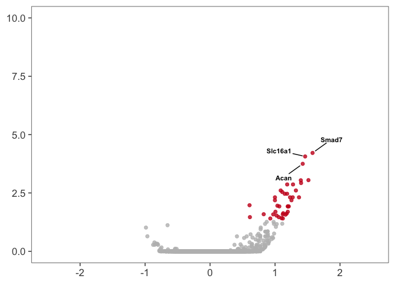

    pdf(file="../figures/02_RNAseq/DGConflictControl.pdf", width=3, height=3)
    plot(colored)
    dev.off()

    ## quartz_off_screen 
    ##                 2

    res <- results(dds, contrast =c("APA", "Conflict", "Consistent"), independentFiltering = F)
    resOrdered <- res[order(res$padj),]
    head(resOrdered)

    ## log2 fold change (MAP): APA Conflict vs Consistent 
    ## Wald test p-value: APA Conflict vs Consistent 
    ## DataFrame with 6 rows and 6 columns
    ##                baseMean log2FoldChange     lfcSE       stat    pvalue
    ##               <numeric>      <numeric> <numeric>  <numeric> <numeric>
    ## 0610007P14Rik 19.985725    -0.05316163 0.2729119 -0.1947941 0.8455541
    ## 0610009B22Rik  3.905466    -0.26831543 0.2860755 -0.9379182 0.3482864
    ## 0610009L18Rik  2.662007     0.06608636 0.2351167  0.2810790 0.7786498
    ## 0610009O20Rik 48.633267     0.19247532 0.2253767  0.8540160 0.3930961
    ## 0610010F05Rik  7.709806    -0.17589551 0.2913225 -0.6037829 0.5459880
    ## 0610010K14Rik  2.232061     0.13268616 0.2603819  0.5095829 0.6103437
    ##                    padj
    ##               <numeric>
    ## 0610007P14Rik         1
    ## 0610009B22Rik         1
    ## 0610009L18Rik         1
    ## 0610009O20Rik         1
    ## 0610010F05Rik         1
    ## 0610010K14Rik         1

    data <- data.frame(gene = row.names(res),
                       pvalue = -log10(res$padj), 
                       lfc = res$log2FoldChange)
    data <- na.omit(data)
    head(data)

    ##            gene pvalue         lfc
    ## 1 0610007P14Rik      0 -0.05316163
    ## 2 0610009B22Rik      0 -0.26831543
    ## 3 0610009L18Rik      0  0.06608636
    ## 4 0610009O20Rik      0  0.19247532
    ## 5 0610010F05Rik      0 -0.17589551
    ## 6 0610010K14Rik      0  0.13268616

    data <- data %>%
      mutate(color = ifelse(data$lfc > 0 & data$pvalue > 1.3, 
                            yes = "Conflict", 
                            no = ifelse(data$lfc < 0 & data$pvalue > 1.3, 
                                        yes = "Consistent", 
                                        no = "none")))

    # Color corresponds to fold change directionality
    colored <- ggplot(data, aes(x = lfc, y = pvalue)) + 
      geom_point(aes(color = factor(color)), size = 1.75, alpha = 0.8, na.rm = T) + # add gene points
      theme_bw(base_size = 16) + # clean up theme
      theme(legend.position = "none") + # remove legend 
      #ggtitle(label = "Volcano Plot", subtitle = "Colored by directionality") +  # add title
      #xlab(expression(log[2]("Conflict" / "Consistent"))) + # x-axis label
      #ylab(expression(-log[10]("adjusted p-value"))) + # y-axis label
      #geom_vline(xintercept = 0, colour = "black") + # add line at 0
      #geom_hline(yintercept = 1.3, colour = "black") + # p(0.05) = 1.3
      xlim(c(-2.5, 2.5)) +  
      ylim(c(0, 10)) +  
      scale_color_manual(values = c("Conflict" = "#ca0020", 
                                    "Consistent" = "#f4a582", 
                                    "none" = "#bdbdbd")) +
      theme(panel.grid.minor=element_blank(),
               panel.grid.major=element_blank()) + 
      theme(axis.title.x = element_blank())+ 
      theme(axis.title.y = element_blank())

    colored

    pdf(file="../figures/02_RNAseq/DGConflictConsistent.pdf", width=3, height=3)
    plot(colored)
    dev.off()

    ## quartz_off_screen 
    ##                 2

    pcadata <- pcadataframe(rld, intgroup=c("Punch","APA"), returnData=TRUE)
    percentVar <- round(100 * attr(pcadata, "percentVar"))
    percentVar

    ## [1] 31 20 11  6  6  5  4  3  3

    pcadata <- pcadataframe(rld, intgroup=c("Punch","APA"), returnData=TRUE)
    percentVar <- round(100 * attr(pcadata, "percentVar"))
    aov1 <- aov(PC1 ~ APA, data=pcadata)
    summary(aov1) 

    ##             Df Sum Sq Mean Sq F value  Pr(>F)   
    ## APA          2  891.8   445.9   7.525 0.00675 **
    ## Residuals   13  770.3    59.3                   
    ## ---
    ## Signif. codes:  0 '***' 0.001 '**' 0.01 '*' 0.05 '.' 0.1 ' ' 1

    TukeyHSD(aov1, which = "APA")

    ##   Tukey multiple comparisons of means
    ##     95% family-wise confidence level
    ## 
    ## Fit: aov(formula = PC1 ~ APA, data = pcadata)
    ## 
    ## $APA
    ##                           diff       lwr       upr     p adj
    ## Consistent-Control  -16.911835 -30.67185 -3.151817 0.0163925
    ## Conflict-Control    -13.437796 -25.02477 -1.850824 0.0230507
    ## Conflict-Consistent   3.474039 -11.36916 18.317242 0.8129880

    pcadata$Punch <- factor(pcadata$APA, levels=c("Control", "Consistent", "Conflict"))
    plotPCs(pcadata, 1, 2, aescolor = pcadata$APA, colorname = "APA", aesshape = pcadata$APA, shapename = "APA",  colorvalues = colorvalAPA)

    ## Don't know how to automatically pick scale for object of type data.frame. Defaulting to continuous.
    ## Don't know how to automatically pick scale for object of type data.frame. Defaulting to continuous.

