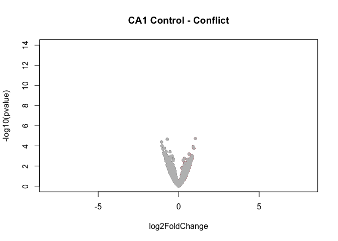
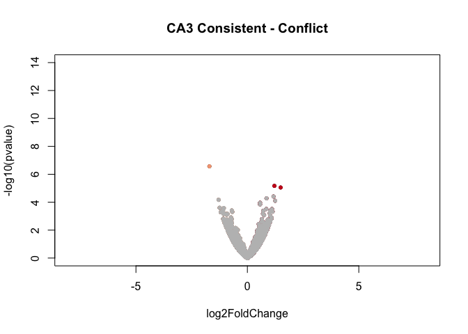

    library(dplyr) ## for filtering and selecting rows
    library(plyr) ## for renmaing factors
    library(reshape2) ## for melting dataframe
    library(DESeq2) ## for gene expression analysis
    library(edgeR)  ## for basic read counts status
    library(magrittr) ## to use the weird pipe
    library(genefilter)  ## for PCA fuction
    library(ggplot2) ## for awesome plots!
    library(pheatmap) ## awesome heatmaps

    ## Functions
    source("functions_RNAseq.R")
    source("resvalsfunction.R")
    source("figureoptions.R")

    ## set output file for figures 
    knitr::opts_chunk$set(fig.path = '../figures/02_RNAseq/')

CA1 only differential gene expression
-------------------------------------

Zero genes have padj &lt; 0.05

    countData <- read.csv("../data/02a_countData.csv", header = T, check.names = F, row.names = 1)
    colData <- read.csv("../data/02a_colData.csv", header = T)
    colData$APA <- factor(colData$APA, levels=c("Control", "Consistent", "Conflict"))

    colData <- colData %>% 
      filter(Punch == "CA1") 
    savecols <- as.character(colData$RNAseqID) 
    savecols <- as.vector(savecols) 
    countData <- countData %>% dplyr::select(one_of(savecols)) 

    dds <- DESeqDataSetFromMatrix(countData = countData,
                                  colData = colData,
                                  design = ~ APA )
    dds$APA <- factor(dds$APA, levels=c("Control", "Consistent", "Conflict"))
    dds <- dds[ rowSums(counts(dds)) > 1, ] 
    dds # dim: 16467 15  

    ## class: DESeqDataSet 
    ## dim: 16467 15 
    ## metadata(1): version
    ## assays(1): counts
    ## rownames(16467): 0610007P14Rik 0610009B22Rik ... Zzef1 Zzz3
    ## rowData names(0):
    ## colnames(15): 143B-CA1-1 143C-CA1-1 ... 148A-CA1-3 148B-CA1-4
    ## colData names(7): RNAseqID Mouse ... APA ID

    dds <- DESeq(dds)

    ## estimating size factors

    ## estimating dispersions

    ## gene-wise dispersion estimates

    ## mean-dispersion relationship

    ## final dispersion estimates

    ## fitting model and testing

    ## -- replacing outliers and refitting for 334 genes
    ## -- DESeq argument 'minReplicatesForReplace' = 7 
    ## -- original counts are preserved in counts(dds)

    ## estimating dispersions

    ## fitting model and testing

    rld <- rlog(dds, blind=FALSE)

    contrast4 <- resvals(contrastvector = c("APA", "Consistent", "Control"), mypadj = 0.05) #0

    ## [1] 0

    contrast5 <- resvals(contrastvector = c("APA", "Conflict", "Control"), mypadj = 0.05) #0

    ## [1] 0

    contrast6 <- resvals(contrastvector = c("APA", "Conflict", "Consistent"), mypadj = 0.05) # 0 

    ## [1] 0

    res <- results(dds, contrast =c("APA", "Consistent", "Control"), independentFiltering = F)
    with(res, plot(log2FoldChange, -log10(pvalue), pch=20, main="DG Control - Consistent", xlim=c(-2,2), ylim=c(0,12)))
    with(subset(res, log2FoldChange>0), points(log2FoldChange, -log10(pvalue), pch=20, col=c("#f4a582")))
    with(subset(res, log2FoldChange<0), points(log2FoldChange, -log10(pvalue), pch=20, col=c("#404040")))
    with(subset(res, padj>.05 ), points(log2FoldChange, -log10(pvalue), pch=20, col="grey"))

    resOrdered <- res[order(res$padj),]
    head(resOrdered)

    ## log2 fold change (MAP): APA Consistent vs Control 
    ## Wald test p-value: APA Consistent vs Control 
    ## DataFrame with 6 rows and 6 columns
    ##         baseMean log2FoldChange     lfcSE      stat       pvalue      padj
    ##        <numeric>      <numeric> <numeric> <numeric>    <numeric> <numeric>
    ## Glcci1  5.602879      1.0177457 0.2662372  3.822702 1.319970e-04 0.3922617
    ## Inhbb  18.952241     -1.0058674 0.2595364 -3.875631 1.063488e-04 0.3922617
    ## Iqub    2.478759      0.8935553 0.2350271  3.801925 1.435764e-04 0.3922617
    ## Tgm3    3.319002      0.9249198 0.2338192  3.955705 7.630939e-05 0.3922617
    ## Zfp128  5.388675      1.0090286 0.2655825  3.799304 1.451030e-04 0.3922617
    ## Zfp72   5.205219      0.9384218 0.2465670  3.805950 1.412609e-04 0.3922617

    res <- results(dds, contrast =c("APA", "Conflict", "Control"), independentFiltering = F)
    with(res, plot(log2FoldChange, -log10(pvalue), pch=20, main="DG Control - Conflict", xlim=c(-2,2), ylim=c(0,12)))
    with(subset(res, log2FoldChange>0), points(log2FoldChange, -log10(pvalue), pch=20, col=c("#ca0020")))
    with(subset(res, log2FoldChange<0), points(log2FoldChange, -log10(pvalue), pch=20, col=c("#404040")))
    with(subset(res, padj>.05 ), points(log2FoldChange, -log10(pvalue), pch=20, col="grey"))

    resOrdered <- res[order(res$padj),]
    head(resOrdered)

    ## log2 fold change (MAP): APA Conflict vs Control 
    ## Wald test p-value: APA Conflict vs Control 
    ## DataFrame with 6 rows and 6 columns
    ##           baseMean log2FoldChange     lfcSE      stat       pvalue
    ##          <numeric>      <numeric> <numeric> <numeric>    <numeric>
    ## Golt1b   56.322500     -0.7054837 0.1660531 -4.248542 2.151663e-05
    ## Otulin   14.218996      1.0407084 0.2431337  4.280396 1.865613e-05
    ## Ctcfl    42.289654     -1.0613954 0.2585936 -4.104493 4.052032e-05
    ## Dolk     15.738734      0.9483241 0.2526001  3.754251 1.738605e-04
    ## Gnaz   2111.356747     -0.9156856 0.2431812 -3.765446 1.662524e-04
    ## Itga10    9.836368     -1.0273637 0.2641075 -3.889946 1.002667e-04
    ##             padj
    ##        <numeric>
    ## Golt1b 0.1744999
    ## Otulin 0.1744999
    ## Ctcfl  0.2190799
    ## Dolk   0.3525021
    ## Gnaz   0.3525021
    ## Itga10 0.3525021

    res <- results(dds, contrast =c("APA", "Conflict", "Consistent"), independentFiltering = F)
    with(res, plot(log2FoldChange, -log10(pvalue), pch=20, main="DG Consistent - Conflict", xlim=c(-2,2), ylim=c(0,12)))
    with(subset(res, log2FoldChange>0), points(log2FoldChange, -log10(pvalue), pch=20, col=c("#ca0020")))
    with(subset(res, log2FoldChange<0), points(log2FoldChange, -log10(pvalue), pch=20, col=c("#f4a582")))
    with(subset(res, padj>.05 ), points(log2FoldChange, -log10(pvalue), pch=20, col="grey"))

    resOrdered <- res[order(res$padj),]
    head(resOrdered)

    ## log2 fold change (MAP): APA Conflict vs Consistent 
    ## Wald test p-value: APA Conflict vs Consistent 
    ## DataFrame with 6 rows and 6 columns
    ##                baseMean log2FoldChange     lfcSE       stat       pvalue
    ##               <numeric>      <numeric> <numeric>  <numeric>    <numeric>
    ## Csmd2         143.98509     -0.7886069 0.1791680 -4.4014939 1.075081e-05
    ## Atp6v0c       236.46491      0.5569021 0.1369149  4.0675064 4.751891e-05
    ## Pebp1         233.46432      0.5517977 0.1473922  3.7437369 1.813035e-04
    ## Rps3           82.17330      0.6916195 0.1848090  3.7423473 1.823093e-04
    ## Psmb3          79.90954      0.7068087 0.1957780  3.6102559 3.058951e-04
    ## 0610007P14Rik  20.26220      0.1695772 0.2300323  0.7371886 4.610077e-01
    ##                    padj
    ##               <numeric>
    ## Csmd2         0.1743781
    ## Atp6v0c       0.3853784
    ## Pebp1         0.7392642
    ## Rps3          0.7392642
    ## Psmb3         0.9923237
    ## 0610007P14Rik 1.0000000

CA3 only differential gene expression
-------------------------------------

    countData <- read.csv("../data/02a_countData.csv", header = T, check.names = F, row.names = 1)
    colData <- read.csv("../data/02a_colData.csv", header = T)
    colData$APA <- factor(colData$APA, levels=c("Control", "Consistent", "Conflict"))

    colData <- colData %>% 
      filter(Punch == "CA3") 
    savecols <- as.character(colData$RNAseqID) 
    savecols <- as.vector(savecols) 
    countData <- countData %>% dplyr::select(one_of(savecols)) 

    dds <- DESeqDataSetFromMatrix(countData = countData,
                                  colData = colData,
                                  design = ~ APA )
    dds$APA <- factor(dds$APA, levels=c("Control", "Consistent", "Conflict"))
    dds <- dds[ rowSums(counts(dds)) > 1, ] 
    dds # dim: 16658 16   

    ## class: DESeqDataSet 
    ## dim: 16208 13 
    ## metadata(1): version
    ## assays(1): counts
    ## rownames(16208): 0610007P14Rik 0610009B22Rik ... Zzef1 Zzz3
    ## rowData names(0):
    ## colnames(13): 143A-CA3-1 144A-CA3-2 ... 148A-CA3-3 148B-CA3-4
    ## colData names(7): RNAseqID Mouse ... APA ID

    dds <- DESeq(dds)

    ## estimating size factors

    ## estimating dispersions

    ## gene-wise dispersion estimates

    ## mean-dispersion relationship

    ## final dispersion estimates

    ## fitting model and testing

    rld <- rlog(dds, blind=FALSE)

    contrast4 <- resvals(contrastvector = c("APA", "Consistent", "Control"), mypadj = 0.05) #0

    ## [1] 0

    contrast5 <- resvals(contrastvector = c("APA", "Conflict", "Control"), mypadj = 0.05) #0

    ## [1] 0

    contrast6 <- resvals(contrastvector = c("APA", "Conflict", "Consistent"), mypadj = 0.05) # 3 

    ## [1] 3

    res <- results(dds, contrast = c("APA", "Conflict", "Consistent"), independentFiltering = F)
    resOrdered <- res[order(res$padj),]
    head(resOrdered)

    ## log2 fold change (MAP): APA Conflict vs Consistent 
    ## Wald test p-value: APA Conflict vs Consistent 
    ## DataFrame with 6 rows and 6 columns
    ##         baseMean log2FoldChange     lfcSE      stat       pvalue
    ##        <numeric>      <numeric> <numeric> <numeric>    <numeric>
    ## Oprd1   32.67546      -1.702574 0.3310140 -5.143512 2.696499e-07
    ## Crnkl1  21.85210       1.493098 0.3359650  4.444206 8.821700e-06
    ## Slc9a2  55.35987       1.212602 0.2693665  4.501680 6.741829e-06
    ## Mkrn2   67.46938       1.175035 0.2857154  4.112605 3.912190e-05
    ## Vps52   88.93894       0.858954 0.2124660  4.042783 5.282041e-05
    ## Lrrk2   41.08331      -1.290874 0.3239656 -3.984601 6.759371e-05
    ##               padj
    ##          <numeric>
    ## Oprd1  0.004336779
    ## Crnkl1 0.047293136
    ## Slc9a2 0.047293136
    ## Mkrn2  0.157299361
    ## Vps52  0.169902130
    ## Lrrk2  0.181184928

    # Oprd1 = Opioid Receptor Delta 1
    # Crnkl1 = Crooked Neck Pre- MRNA Splicing Factor 1
    # Slc9a2 = Solute Carrier Family 9 Member A2

    res <- results(dds, contrast =c("APA", "Consistent", "Control"), independentFiltering = F)
    with(res, plot(log2FoldChange, -log10(pvalue), pch=20, main="DG Control - Consistent", xlim=c(-2,2), ylim=c(0,12)))
    with(subset(res, log2FoldChange>0), points(log2FoldChange, -log10(pvalue), pch=20, col=c("#f4a582")))
    with(subset(res, log2FoldChange<0), points(log2FoldChange, -log10(pvalue), pch=20, col=c("#404040")))
    with(subset(res, padj>.05 ), points(log2FoldChange, -log10(pvalue), pch=20, col="grey"))

    resOrdered <- res[order(res$padj),]
    head(resOrdered)

    ## log2 fold change (MAP): APA Consistent vs Control 
    ## Wald test p-value: APA Consistent vs Control 
    ## DataFrame with 6 rows and 6 columns
    ##                 baseMean log2FoldChange     lfcSE      stat       pvalue
    ##                <numeric>      <numeric> <numeric> <numeric>    <numeric>
    ## Rhpn2           5.547833      1.5696323 0.3440295  4.562493 5.054968e-06
    ## Slc9a2         55.359865     -1.1656652 0.2598634 -4.485684 7.268025e-06
    ## Sod3           23.106068      1.3263207 0.3031901  4.374552 1.216823e-05
    ## Gsr            49.332636     -1.0682644 0.2804942 -3.808508 1.398079e-04
    ## Timm8a1        20.715590     -1.2706030 0.3398954 -3.738218 1.853295e-04
    ## 2900026A02Rik 119.066102     -0.8481215 0.2336842 -3.629350 2.841359e-04
    ##                     padj
    ##                <numeric>
    ## Rhpn2         0.05844582
    ## Slc9a2        0.05844582
    ## Sod3          0.06523388
    ## Gsr           0.56213244
    ## Timm8a1       0.59613085
    ## 2900026A02Rik 0.70385437

    res <- results(dds, contrast =c("APA", "Conflict", "Control"), independentFiltering = F)
    with(res, plot(log2FoldChange, -log10(pvalue), pch=20, main="DG Control - Conflict", xlim=c(-2,2), ylim=c(0,12)))
    with(subset(res, log2FoldChange>0), points(log2FoldChange, -log10(pvalue), pch=20, col=c("#ca0020")))
    with(subset(res, log2FoldChange<0), points(log2FoldChange, -log10(pvalue), pch=20, col=c("#404040")))
    with(subset(res, padj>.05 ), points(log2FoldChange, -log10(pvalue), pch=20, col="grey"))

    resOrdered <- res[order(res$padj),]
    head(resOrdered)

    ## log2 fold change (MAP): APA Conflict vs Control 
    ## Wald test p-value: APA Conflict vs Control 
    ## DataFrame with 6 rows and 6 columns
    ##                baseMean log2FoldChange     lfcSE       stat     pvalue
    ##               <numeric>      <numeric> <numeric>  <numeric>  <numeric>
    ## 0610007P14Rik 24.841302     0.14578018 0.2792956  0.5219566 0.60170057
    ## 0610009B22Rik 10.482645    -0.08970333 0.3416280 -0.2625760 0.79287737
    ## 0610009L18Rik  5.960207     0.15455867 0.3456736  0.4471232 0.65478613
    ## 0610009O20Rik 55.086602     0.53006956 0.2117222  2.5036087 0.01229339
    ## 0610010F05Rik 10.326053    -0.11174704 0.2983520 -0.3745476 0.70799691
    ## 0610010K14Rik  1.461658     0.17646004 0.3116177  0.5662709 0.57120967
    ##                    padj
    ##               <numeric>
    ## 0610007P14Rik         1
    ## 0610009B22Rik         1
    ## 0610009L18Rik         1
    ## 0610009O20Rik         1
    ## 0610010F05Rik         1
    ## 0610010K14Rik         1

    res <- results(dds, contrast =c("APA", "Conflict", "Consistent"), independentFiltering = F)
    with(res, plot(log2FoldChange, -log10(pvalue), pch=20, main="DG Consistent - Conflict", xlim=c(-2,2), ylim=c(0,12)))
    with(subset(res, log2FoldChange>0), points(log2FoldChange, -log10(pvalue), pch=20, col=c("#ca0020")))
    with(subset(res, log2FoldChange<0), points(log2FoldChange, -log10(pvalue), pch=20, col=c("#f4a582")))
    with(subset(res, padj>.05 ), points(log2FoldChange, -log10(pvalue), pch=20, col="grey"))

    resOrdered <- res[order(res$padj),]
    head(resOrdered)

    ## log2 fold change (MAP): APA Conflict vs Consistent 
    ## Wald test p-value: APA Conflict vs Consistent 
    ## DataFrame with 6 rows and 6 columns
    ##         baseMean log2FoldChange     lfcSE      stat       pvalue
    ##        <numeric>      <numeric> <numeric> <numeric>    <numeric>
    ## Oprd1   32.67546      -1.702574 0.3310140 -5.143512 2.696499e-07
    ## Crnkl1  21.85210       1.493098 0.3359650  4.444206 8.821700e-06
    ## Slc9a2  55.35987       1.212602 0.2693665  4.501680 6.741829e-06
    ## Mkrn2   67.46938       1.175035 0.2857154  4.112605 3.912190e-05
    ## Vps52   88.93894       0.858954 0.2124660  4.042783 5.282041e-05
    ## Lrrk2   41.08331      -1.290874 0.3239656 -3.984601 6.759371e-05
    ##               padj
    ##          <numeric>
    ## Oprd1  0.004336779
    ## Crnkl1 0.047293136
    ## Slc9a2 0.047293136
    ## Mkrn2  0.157299361
    ## Vps52  0.169902130
    ## Lrrk2  0.181184928

    countData <- read.csv("../data/02a_countData.csv", header = T, check.names = F, row.names = 1)
    colData <- read.csv("../data/02a_colData.csv", header = T)
    colData$APA <- factor(colData$APA, levels=c("Control", "Consistent", "Conflict"))

    colData <- colData %>% 
      filter(Punch == "DG") 
    savecols <- as.character(colData$RNAseqID) 
    savecols <- as.vector(savecols) 
    countData <- countData %>% dplyr::select(one_of(savecols)) 

    dds <- DESeqDataSetFromMatrix(countData = countData,
                                  colData = colData,
                                  design = ~ APA )
    dds$APA <- factor(dds$APA, levels=c("Control", "Consistent", "Conflict"))
    dds <- dds[ rowSums(counts(dds)) > 1, ] 
    dds # dim: 16658 16  

    ## class: DESeqDataSet 
    ## dim: 16658 16 
    ## metadata(1): version
    ## assays(1): counts
    ## rownames(16658): 0610007P14Rik 0610009B22Rik ... Zzef1 Zzz3
    ## rowData names(0):
    ## colnames(16): 143A-DG-1 143B-DG-1 ... 148A-DG-3 148B-DG-4
    ## colData names(7): RNAseqID Mouse ... APA ID

    dds <- DESeq(dds)

    ## estimating size factors

    ## estimating dispersions

    ## gene-wise dispersion estimates

    ## mean-dispersion relationship

    ## final dispersion estimates

    ## fitting model and testing

    ## -- replacing outliers and refitting for 217 genes
    ## -- DESeq argument 'minReplicatesForReplace' = 7 
    ## -- original counts are preserved in counts(dds)

    ## estimating dispersions

    ## fitting model and testing

    rld <- rlog(dds, blind=FALSE)

    contrast4 <- resvals(contrastvector = c("APA", "Consistent", "Control"), mypadj = 0.05) #101

    ## [1] 101

    contrast5 <- resvals(contrastvector = c("APA", "Conflict", "Control"), mypadj = 0.05) #39

    ## [1] 39

    contrast6 <- resvals(contrastvector = c("APA", "Conflict", "Consistent"), mypadj = 0.05) # 0 

    ## [1] 0

    resOrdered <- res[order(res$padj),]
    head(resOrdered)

    ## log2 fold change (MAP): APA Conflict vs Consistent 
    ## Wald test p-value: APA Conflict vs Consistent 
    ## DataFrame with 6 rows and 6 columns
    ##         baseMean log2FoldChange     lfcSE      stat       pvalue
    ##        <numeric>      <numeric> <numeric> <numeric>    <numeric>
    ## Oprd1   32.67546      -1.702574 0.3310140 -5.143512 2.696499e-07
    ## Crnkl1  21.85210       1.493098 0.3359650  4.444206 8.821700e-06
    ## Slc9a2  55.35987       1.212602 0.2693665  4.501680 6.741829e-06
    ## Mkrn2   67.46938       1.175035 0.2857154  4.112605 3.912190e-05
    ## Vps52   88.93894       0.858954 0.2124660  4.042783 5.282041e-05
    ## Lrrk2   41.08331      -1.290874 0.3239656 -3.984601 6.759371e-05
    ##               padj
    ##          <numeric>
    ## Oprd1  0.004336779
    ## Crnkl1 0.047293136
    ## Slc9a2 0.047293136
    ## Mkrn2  0.157299361
    ## Vps52  0.169902130
    ## Lrrk2  0.181184928

    res <- results(dds, contrast =c("APA", "Consistent", "Control"), independentFiltering = F)
    with(res, plot(log2FoldChange, -log10(pvalue), pch=20, main="DG Control - Consistent", xlim=c(-2,2), ylim=c(0,12)))
    with(subset(res, log2FoldChange>0), points(log2FoldChange, -log10(pvalue), pch=20, col=c("#f4a582")))
    with(subset(res, log2FoldChange<0), points(log2FoldChange, -log10(pvalue), pch=20, col=c("#404040")))
    with(subset(res, padj>.05 ), points(log2FoldChange, -log10(pvalue), pch=20, col="grey"))

    resOrdered <- res[order(res$padj),]
    head(resOrdered)

    ## log2 fold change (MAP): APA Consistent vs Control 
    ## Wald test p-value: APA Consistent vs Control 
    ## DataFrame with 6 rows and 6 columns
    ##         baseMean log2FoldChange     lfcSE      stat       pvalue
    ##        <numeric>      <numeric> <numeric> <numeric>    <numeric>
    ## Dbpht2 181.53137       1.683569 0.2398804  7.018368 2.244744e-12
    ## Frmd6  198.12270       2.028448 0.2851703  7.113109 1.134573e-12
    ## Smad7   43.60596       1.959971 0.2825822  6.935932 4.035513e-12
    ## Nptx2  290.83992       1.645930 0.2478177  6.641696 3.100944e-11
    ## Fzd5    13.76731       1.845721 0.2974478  6.205192 5.463003e-10
    ## Fbxo33 136.27874       1.778941 0.2900217  6.133819 8.579438e-10
    ##                padj
    ##           <numeric>
    ## Dbpht2 1.856178e-08
    ## Frmd6  1.856178e-08
    ## Smad7  2.224644e-08
    ## Nptx2  1.282085e-07
    ## Fzd5   1.806943e-06
    ## Fbxo33 2.364779e-06

    res <- results(dds, contrast =c("APA", "Conflict", "Control"), independentFiltering = F)
    with(res, plot(log2FoldChange, -log10(pvalue), pch=20, main="DG Control - Conflict", xlim=c(-2,2), ylim=c(0,12)))
    with(subset(res, log2FoldChange>0), points(log2FoldChange, -log10(pvalue), pch=20, col=c("#ca0020")))
    with(subset(res, log2FoldChange<0), points(log2FoldChange, -log10(pvalue), pch=20, col=c("#404040")))
    with(subset(res, padj>.05 ), points(log2FoldChange, -log10(pvalue), pch=20, col="grey"))

    resOrdered <- res[order(res$padj),]
    head(resOrdered)

    ## log2 fold change (MAP): APA Conflict vs Control 
    ## Wald test p-value: APA Conflict vs Control 
    ## DataFrame with 6 rows and 6 columns
    ##          baseMean log2FoldChange     lfcSE      stat       pvalue
    ##         <numeric>      <numeric> <numeric> <numeric>    <numeric>
    ## Smad7    43.60596       1.577382 0.2674566  5.897714 3.685717e-09
    ## Slc16a1  52.06814       1.462991 0.2556169  5.723373 1.044295e-08
    ## Acan     24.88123       1.426065 0.2579754  5.527911 3.240663e-08
    ## Fzd5     13.76731       1.514113 0.2920253  5.184868 2.161674e-07
    ## Frmd6   198.12270       1.396548 0.2716736  5.140537 2.739540e-07
    ## Ptgs2   108.75785       1.400222 0.2770016  5.054925 4.305609e-07
    ##                 padj
    ##            <numeric>
    ## Smad7   6.095439e-05
    ## Slc16a1 8.635273e-05
    ## Acan    1.786469e-04
    ## Fzd5    8.937443e-04
    ## Frmd6   9.061303e-04
    ## Ptgs2   1.186769e-03

    res <- results(dds, contrast =c("APA", "Conflict", "Consistent"), independentFiltering = F)
    with(res, plot(log2FoldChange, -log10(pvalue), pch=20, main="DG Consistent - Conflict", xlim=c(-2,2), ylim=c(0,12)))
    with(subset(res, log2FoldChange>0), points(log2FoldChange, -log10(pvalue), pch=20, col=c("#ca0020")))
    with(subset(res, log2FoldChange<0), points(log2FoldChange, -log10(pvalue), pch=20, col=c("#f4a582")))
    with(subset(res, padj>.05 ), points(log2FoldChange, -log10(pvalue), pch=20, col="grey"))

    resOrdered <- res[order(res$padj),]
    head(resOrdered)

    ## log2 fold change (MAP): APA Conflict vs Consistent 
    ## Wald test p-value: APA Conflict vs Consistent 
    ## DataFrame with 6 rows and 6 columns
    ##                baseMean log2FoldChange     lfcSE       stat    pvalue
    ##               <numeric>      <numeric> <numeric>  <numeric> <numeric>
    ## 0610007P14Rik 19.985725    -0.05316163 0.2729119 -0.1947941 0.8455541
    ## 0610009B22Rik  3.905466    -0.26831543 0.2860755 -0.9379182 0.3482864
    ## 0610009L18Rik  2.662007     0.06608636 0.2351167  0.2810790 0.7786498
    ## 0610009O20Rik 48.633267     0.19247532 0.2253767  0.8540160 0.3930961
    ## 0610010F05Rik  7.709806    -0.17589551 0.2913225 -0.6037829 0.5459880
    ## 0610010K14Rik  2.232061     0.13268616 0.2603819  0.5095829 0.6103437
    ##                    padj
    ##               <numeric>
    ## 0610007P14Rik         1
    ## 0610009B22Rik         1
    ## 0610009L18Rik         1
    ## 0610009O20Rik         1
    ## 0610010F05Rik         1
    ## 0610010K14Rik         1

    pcadata <- pcadataframe(rld, intgroup=c("Punch","APA"), returnData=TRUE)
    percentVar <- round(100 * attr(pcadata, "percentVar"))
    percentVar

    ## [1] 31 20 11  6  6  5  4  3  3

    pcadata <- pcadataframe(rld, intgroup=c("Punch","APA"), returnData=TRUE)
    percentVar <- round(100 * attr(pcadata, "percentVar"))
    aov1 <- aov(PC1 ~ APA, data=pcadata)
    summary(aov1) 

    ##             Df Sum Sq Mean Sq F value  Pr(>F)   
    ## APA          2  891.8   445.9   7.525 0.00675 **
    ## Residuals   13  770.3    59.3                   
    ## ---
    ## Signif. codes:  0 '***' 0.001 '**' 0.01 '*' 0.05 '.' 0.1 ' ' 1

    TukeyHSD(aov1, which = "APA")

    ##   Tukey multiple comparisons of means
    ##     95% family-wise confidence level
    ## 
    ## Fit: aov(formula = PC1 ~ APA, data = pcadata)
    ## 
    ## $APA
    ##                           diff       lwr       upr     p adj
    ## Consistent-Control  -16.911835 -30.67185 -3.151817 0.0163925
    ## Conflict-Control    -13.437796 -25.02477 -1.850824 0.0230507
    ## Conflict-Consistent   3.474039 -11.36916 18.317242 0.8129880

    pcadata$Punch <- factor(pcadata$APA, levels=c("Control", "Consistent", "Conflict"))
    plotPCs(pcadata, 1, 2, aescolor = pcadata$APA, colorname = "APA", aesshape = pcadata$APA, shapename = "APA",  colorvalues = colorvalAPA)

    ## Don't know how to automatically pick scale for object of type data.frame. Defaulting to continuous.

    ## Don't know how to automatically pick scale for object of type data.frame. Defaulting to continuous.

    DEGes <- assay(rld)
    DEGes <- cbind(DEGes, contrast4, contrast5, contrast6)
    DEGes <- as.data.frame(DEGes) 
    DEGes$rownames <- rownames(DEGes)  
    DEGes$padjmin <- with(DEGes, pmin(padjAPAConsistentControl, padjAPAConflictControl, padjAPAConflictConsistent)) 
    DEGes <- DEGes %>% filter(padjmin < 0.05)
    rownames(DEGes) <- DEGes$rownames
    drop.cols <-colnames(DEGes[,grep("padj|pval|rownames", colnames(DEGes))])
    DEGes <- DEGes %>% dplyr::select(-one_of(drop.cols))
    DEGes <- as.matrix(DEGes)
    DEGes <- DEGes - rowMeans(DEGes)
    df <- as.data.frame(colData(dds)[,c("APA", "Punch")]) #
    rownames(df) <- names(countData)
    ann_colors = ann_colors1 
    DEGes <- as.matrix(DEGes) 
    paletteLength <- 30
    myBreaks <- c(seq(min(DEGes), 0, length.out=ceiling(paletteLength/2) + 1), 
                  seq(max(DEGes)/paletteLength, max(DEGes), length.out=floor(paletteLength/2)))
    pheatmap(DEGes, show_colnames=F, show_rownames = F,
             annotation_col=df, annotation_colors = ann_colors,
             treeheight_row = 0, treeheight_col = 25,
             fontsize = 11, 
             #width=4.5, height=3,
             border_color = "grey60" ,
             color = colorpalette,
             cellwidth = 8,
             cellheight = 2,
             clustering_method="average",
             breaks=myBreaks,
             clustering_distance_cols="correlation" 
             )

