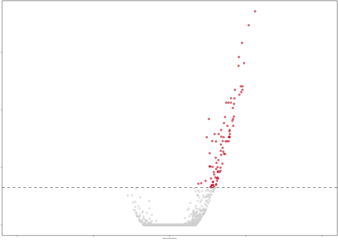
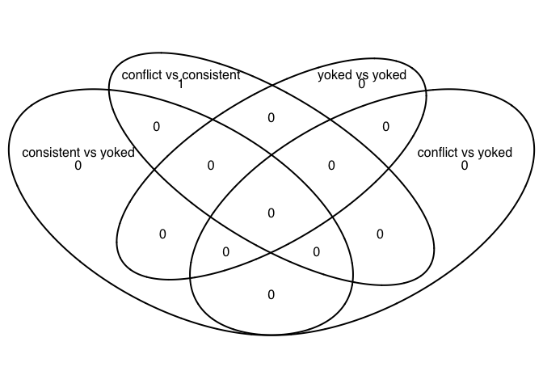

    library(ggplot2) ## for awesome plots!
    library(cowplot) ## for some easy to use themes
    library(dplyr) ## for filtering and selecting rows
    library(car) ## stats
    library(VennDiagram) ## venn diagrams
    library(pheatmap) ## awesome heatmaps
    library(viridis) # for awesome color pallette
    library(reshape2) ## for melting dataframe
    library(DESeq2) ## for gene expression analysis
    library(edgeR)  ## for basic read counts status
    library(magrittr) ## to use the weird pipe
    library(genefilter)  ## for PCA fuction

    ## load functions 
    source("figureoptions.R")
    source("functions_RNAseq.R")

    ## set output file for figures 
    knitr::opts_chunk$set(fig.path = '../figures/02c_rnaseqSubfield/')

DG
--

    colData <- read.csv("../data/02a_colData.csv", header = T)
    countData <- read.csv("../data/02a_countData.csv", header = T, check.names = F, row.names = 1)

    colData <- colData %>% 
      filter(Punch %in% c("DG"))  %>% 
      droplevels()

    savecols <- as.character(colData$RNAseqID) 
    savecols <- as.vector(savecols) 
    countData <- countData %>% dplyr::select(one_of(savecols)) 

    colData %>% select(APA2,Punch)  %>%  summary()

    ##                APA2   Punch  
    ##  conflict        :5   DG:16  
    ##  consistent      :3          
    ##  yoked_conflict  :4          
    ##  yoked_consistent:4

    ## create DESeq object using the factors Punch and APA
    dds <- DESeqDataSetFromMatrix(countData = countData,
                                  colData = colData,
                                  design = ~ APA2)

    dds # view the DESeq object - note numnber of genes

    ## class: DESeqDataSet 
    ## dim: 22485 16 
    ## metadata(1): version
    ## assays(1): counts
    ## rownames(22485): 0610007P14Rik 0610009B22Rik ... Zzef1 Zzz3
    ## rowData names(0):
    ## colnames(16): 143A-DG-1 143B-DG-1 ... 148A-DG-3 148B-DG-4
    ## colData names(8): RNAseqID Mouse ... APA APA2

    dds <- dds[ rowSums(counts(dds)) > 1, ]  # Pre-filtering genes with 0 counts
    dds # view number of genes afternormalization and the number of samples

    ## class: DESeqDataSet 
    ## dim: 16658 16 
    ## metadata(1): version
    ## assays(1): counts
    ## rownames(16658): 0610007P14Rik 0610009B22Rik ... Zzef1 Zzz3
    ## rowData names(0):
    ## colnames(16): 143A-DG-1 143B-DG-1 ... 148A-DG-3 148B-DG-4
    ## colData names(8): RNAseqID Mouse ... APA APA2

    dds <- DESeq(dds) # Differential expression analysis
    rld <- rlog(dds, blind=FALSE) ## log transformed data

    # create the dataframe using my function pcadataframe
    pcadata <- pcadataframe(rld, intgroup=c("Punch","APA2"), returnData=TRUE)
    percentVar <- round(100 * attr(pcadata, "percentVar"))
    percentVar

    ## [1] 32 19 12  6  6  4  4  3  3

    summary(aov(PC1 ~ APA2, data=pcadata)) 

    ##             Df Sum Sq Mean Sq F value Pr(>F)  
    ## APA2         3  813.7   271.2   3.132 0.0656 .
    ## Residuals   12 1039.2    86.6                 
    ## ---
    ## Signif. codes:  0 '***' 0.001 '**' 0.01 '*' 0.05 '.' 0.1 ' ' 1

    TukeyHSD((aov(PC1 ~ APA2, data=pcadata)) , which = "APA2") 

    ##   Tukey multiple comparisons of means
    ##     95% family-wise confidence level
    ## 
    ## Fit: aov(formula = PC1 ~ APA2, data = pcadata)
    ## 
    ## $APA2
    ##                                       diff        lwr      upr     p adj
    ## consistent-conflict             -2.7689971 -22.945732 17.40774 0.9761261
    ## yoked_conflict-conflict         13.4961346  -5.037379 32.02965 0.1891702
    ## yoked_consistent-conflict       12.6753558  -5.858158 31.20887 0.2305853
    ## yoked_conflict-consistent       16.2651317  -4.836202 37.36647 0.1553505
    ## yoked_consistent-consistent     15.4443530  -5.656981 36.54569 0.1859964
    ## yoked_consistent-yoked_conflict -0.8207787 -20.356818 18.71526 0.9992658

    summary(aov(PC2 ~ APA2, data=pcadata)) 

    ##             Df Sum Sq Mean Sq F value Pr(>F)  
    ## APA2         3  534.4  178.15   3.646 0.0446 *
    ## Residuals   12  586.4   48.87                 
    ## ---
    ## Signif. codes:  0 '***' 0.001 '**' 0.01 '*' 0.05 '.' 0.1 ' ' 1

    TukeyHSD((aov(PC2 ~ APA2, data=pcadata)), which = "APA2") 

    ##   Tukey multiple comparisons of means
    ##     95% family-wise confidence level
    ## 
    ## Fit: aov(formula = PC2 ~ APA2, data = pcadata)
    ## 
    ## $APA2
    ##                                      diff        lwr      upr     p adj
    ## consistent-conflict             -4.272112 -19.428740 10.88452 0.8360728
    ## yoked_conflict-conflict          1.598600 -12.323652 15.52085 0.9856949
    ## yoked_consistent-conflict       12.020080  -1.902172 25.94233 0.0994976
    ## yoked_conflict-consistent        5.870712  -9.980469 21.72189 0.6964793
    ## yoked_consistent-consistent     16.292191   0.441010 32.14337 0.0433400
    ## yoked_consistent-yoked_conflict 10.421479  -4.253863 25.09682 0.2052640

    summary(aov(PC3 ~ APA2, data=pcadata)) 

    ##             Df Sum Sq Mean Sq F value Pr(>F)
    ## APA2         3  142.6   47.55   1.039   0.41
    ## Residuals   12  549.1   45.76

    summary(aov(PC4 ~ APA2, data=pcadata)) 

    ##             Df Sum Sq Mean Sq F value Pr(>F)
    ## APA2         3  54.68   18.23     0.7   0.57
    ## Residuals   12 312.56   26.05

    pcadata$APA2 <- factor(pcadata$APA2, levels=c("yoked_consistent", "consistent", "yoked_conflict", "conflict"))
    pcadata$wrap <- "Principle Compent Analysis"

    #calculate significance of all two way comparisions
    # see source "functions_RNAseq.R" 
    contrast1 <- resvals(contrastvector = c("APA2", "consistent", "yoked_consistent"), mypval = 0.1) # 95

    ## [1] 95

    contrast2 <- resvals(contrastvector = c("APA2", "conflict", "yoked_conflict"), mypval = 0.1) # 5

    ## [1] 5

    contrast3 <- resvals(contrastvector = c("APA2", "conflict", "consistent"), mypval = 0.1) # 0

    ## [1] 0

    contrast4 <- resvals(contrastvector = c("APA2", "yoked_conflict", "yoked_consistent"), mypval = 0.1) # 2

    ## [1] 2

    res <- results(dds, contrast =c("APA2", "consistent", "yoked_consistent"), independentFiltering = T, alpha = 0.1)
    summary(res)

    ## 
    ## out of 16658 with nonzero total read count
    ## adjusted p-value < 0.1
    ## LFC > 0 (up)     : 119, 0.71% 
    ## LFC < 0 (down)   : 2, 0.012% 
    ## outliers [1]     : 243, 1.5% 
    ## low counts [2]   : 7235, 43% 
    ## (mean count < 7)
    ## [1] see 'cooksCutoff' argument of ?results
    ## [2] see 'independentFiltering' argument of ?results

    resOrdered <- res[order(res$padj),]
    head(resOrdered, 10)

    ## log2 fold change (MAP): APA2 consistent vs yoked_consistent 
    ## Wald test p-value: APA2 consistent vs yoked_consistent 
    ## DataFrame with 10 rows and 6 columns
    ##          baseMean log2FoldChange     lfcSE      stat       pvalue
    ##         <numeric>      <numeric> <numeric> <numeric>    <numeric>
    ## Smad7    43.60596       2.243934 0.3239297  6.927226 4.291731e-12
    ## Arc     451.43709       2.074914 0.3112036  6.667386 2.604001e-11
    ## Gm13889 211.75831       1.901352 0.2973011  6.395377 1.601516e-10
    ## Plk2    837.73989       1.817581 0.2943817  6.174232 6.648583e-10
    ## Tiparp   74.00353       1.953596 0.3222962  6.061493 1.348635e-09
    ## Egr1    717.66898       1.807453 0.3013659  5.997537 2.003331e-09
    ## Egr4    693.13346       1.914386 0.3367611  5.684701 1.310414e-08
    ## Homer1   62.85577       1.868668 0.3292508  5.675517 1.382708e-08
    ## Fzd5     13.76731       1.911668 0.3420215  5.589322 2.279580e-08
    ## Lmna     31.66528       1.714228 0.3063322  5.595976 2.193845e-08
    ##                 padj
    ##            <numeric>
    ## Smad7   3.939809e-08
    ## Arc     1.195237e-07
    ## Gm13889 4.900638e-07
    ## Plk2    1.525850e-06
    ## Tiparp  2.476095e-06
    ## Egr1    3.065096e-06
    ## Egr4    1.586657e-05
    ## Homer1  1.586657e-05
    ## Fzd5    2.092654e-05
    ## Lmna    2.092654e-05

    topGene <- rownames(res)[which.min(res$padj)]
    plotCounts(dds, gene = topGene, intgroup=c("APA2"))

    data <- data.frame(gene = row.names(res),
                       pvalue = -log10(res$padj), 
                       lfc = res$log2FoldChange)
    data <- na.omit(data)
    data <- data %>%
      mutate(color = ifelse(data$lfc > 0 & data$pvalue > 1, 
                            yes = "consistent", 
                            no = ifelse(data$lfc < 0 & data$pvalue > 1, 
                                        yes = "yoked_consistent", 
                                        no = "none")))
    top_labelled <- top_n(data, n = 5, wt = lfc)

    # for faceting
    pcadata$wrap <- "DG PCA"
    data$wrap <- "DG contrasts"

    DGvolcano <- ggplot(data, aes(x = lfc, y = pvalue)) + 
      geom_point(aes(color = factor(color)), size = 1, alpha = 0.5, na.rm = T) + # add gene points
      scale_color_manual(values = volcano1)  + 
      xlab(paste0("Consistent / Yoked")) +
      ylab(paste0("log10(pvalue)")) +
      theme_cowplot(font_size = 8, line_size = 0.25) +
      geom_hline(yintercept = 1,  size = 0.25, linetype = 2 )+ 
      theme(panel.grid.minor=element_blank(),
            legend.position = "none", # remove legend 
            panel.grid.major=element_blank()) +
      facet_wrap(~wrap)
    DGvolcano

    pdf(file="../figures/02c_rnaseqSubfield/DGvolcano.pdf", width=1.5, height=2)
    plot(DGvolcano)
    dev.off()

    ## quartz_off_screen 
    ##                 2

    PCA12 <- plotPCwrap(pcadata, 1, 2, aescolor = pcadata$APA2, colorname = " ",  colorvalues = colorvalAPA00)
    PCA12

    pdf(file="../figures/02c_rnaseqSubfield/DGpca12.pdf", width=1.75, height=2)
    plot(PCA12)
    dev.off()

    ## quartz_off_screen 
    ##                 2

venn diagrams
-------------

CA3
---

    colData <- read.csv("../data/02a_colData.csv", header = T)
    countData <- read.csv("../data/02a_countData.csv", header = T, check.names = F, row.names = 1)

    colData <- colData %>% 
      filter(Punch %in% c("CA3"))  %>% 
      droplevels()
    savecols <- as.character(colData$RNAseqID) 
    savecols <- as.vector(savecols) 
    countData <- countData %>% dplyr::select(one_of(savecols)) 
    colData %>% select(APA2,Punch)  %>%  summary()

    ##                APA2   Punch   
    ##  conflict        :5   CA3:13  
    ##  consistent      :2           
    ##  yoked_conflict  :3           
    ##  yoked_consistent:3

    ## create DESeq object using the factors Punch and APA
    dds <- DESeqDataSetFromMatrix(countData = countData,
                                  colData = colData,
                                  design = ~ APA2)

    dds # view the DESeq object - note numnber of genes

    ## class: DESeqDataSet 
    ## dim: 22485 13 
    ## metadata(1): version
    ## assays(1): counts
    ## rownames(22485): 0610007P14Rik 0610009B22Rik ... Zzef1 Zzz3
    ## rowData names(0):
    ## colnames(13): 143A-CA3-1 144A-CA3-2 ... 148A-CA3-3 148B-CA3-4
    ## colData names(8): RNAseqID Mouse ... APA APA2

    dds <- dds[ rowSums(counts(dds)) > 1, ]  # Pre-filtering genes with 0 counts
    dds # view number of genes afternormalization and the number of samples

    ## class: DESeqDataSet 
    ## dim: 16208 13 
    ## metadata(1): version
    ## assays(1): counts
    ## rownames(16208): 0610007P14Rik 0610009B22Rik ... Zzef1 Zzz3
    ## rowData names(0):
    ## colnames(13): 143A-CA3-1 144A-CA3-2 ... 148A-CA3-3 148B-CA3-4
    ## colData names(8): RNAseqID Mouse ... APA APA2

    dds <- DESeq(dds) # Differential expression analysis
    rld <- rlog(dds, blind=FALSE) ## log transformed data

    # create the dataframe using my function pcadataframe
    pcadata <- pcadataframe(rld, intgroup=c("Punch","APA2"), returnData=TRUE)
    percentVar <- round(100 * attr(pcadata, "percentVar"))
    percentVar

    ## [1] 40 14 10  8  7  4  4  3  3

    summary(aov(PC1 ~ APA2, data=pcadata))

    ##             Df Sum Sq Mean Sq F value Pr(>F)
    ## APA2         3  230.7   76.91   1.147  0.382
    ## Residuals    9  603.5   67.05

    summary(aov(PC2 ~ APA2, data=pcadata))

    ##             Df Sum Sq Mean Sq F value Pr(>F)
    ## APA2         3  27.13   9.045   0.313  0.815
    ## Residuals    9 259.81  28.868

    summary(aov(PC3 ~ APA2, data=pcadata))

    ##             Df Sum Sq Mean Sq F value Pr(>F)
    ## APA2         3   7.86   2.621    0.12  0.946
    ## Residuals    9 195.88  21.764

    summary(aov(PC4 ~ APA2, data=pcadata))

    ##             Df Sum Sq Mean Sq F value Pr(>F)  
    ## APA2         3 108.42   36.14   5.252 0.0228 *
    ## Residuals    9  61.94    6.88                 
    ## ---
    ## Signif. codes:  0 '***' 0.001 '**' 0.01 '*' 0.05 '.' 0.1 ' ' 1

    summary(aov(PC5 ~ APA2, data=pcadata))

    ##             Df Sum Sq Mean Sq F value Pr(>F)
    ## APA2         3  28.88   9.628   0.775  0.537
    ## Residuals    9 111.78  12.420

    summary(aov(PC6 ~ APA2, data=pcadata))

    ##             Df Sum Sq Mean Sq F value Pr(>F)
    ## APA2         3  39.74  13.246   2.379  0.137
    ## Residuals    9  50.12   5.569

    pcadata$APA2 <- factor(pcadata$APA2, levels=c("yoked_consistent", "consistent", "yoked_conflict", "conflict"))
    pcadata$wrap <- "Principle Compent Analysis"

    PCA14 <- plotPCwrapnoe(pcadata, 1, 4, aescolor = pcadata$APA2, colorname = " ",  colorvalues = colorvalAPA2)
    PCA14

    pdf(file="../figures/02c_rnaseqSubfield/CA3pca14.pdf", width=1.75, height=2)
    plot(PCA14)
    dev.off()

    ## quartz_off_screen 
    ##                 2

    #calculate significance of all two way comparisions
    # see source "functions_RNAseq.R" 
    contrast1 <- resvals(contrastvector = c("APA2", "consistent", "yoked_consistent"), mypval = 0.1) # 0

    ## [1] 0

    contrast2 <- resvals(contrastvector = c("APA2", "conflict", "yoked_conflict"), mypval = 0.1) # 0

    ## [1] 0

    contrast3 <- resvals(contrastvector = c("APA2", "conflict", "consistent"), mypval = 0.1) # 1

    ## [1] 1

    contrast4 <- resvals(contrastvector = c("APA2", "yoked_conflict", "yoked_consistent"), mypval = 0.1) # 0

    ## [1] 0

    res <- results(dds, contrast =c("APA2", "consistent", "yoked_consistent"), independentFiltering = T, alpha = 0.1)
    summary(res)

    ## 
    ## out of 16208 with nonzero total read count
    ## adjusted p-value < 0.1
    ## LFC > 0 (up)     : 0, 0% 
    ## LFC < 0 (down)   : 0, 0% 
    ## outliers [1]     : 253, 1.6% 
    ## low counts [2]   : 0, 0% 
    ## (mean count < 0)
    ## [1] see 'cooksCutoff' argument of ?results
    ## [2] see 'independentFiltering' argument of ?results

    res <- results(dds, contrast =c("APA2", "conflict", "yoked_conflict"), independentFiltering = T, alpha = 0.1)
    summary(res)

    ## 
    ## out of 16208 with nonzero total read count
    ## adjusted p-value < 0.1
    ## LFC > 0 (up)     : 0, 0% 
    ## LFC < 0 (down)   : 0, 0% 
    ## outliers [1]     : 253, 1.6% 
    ## low counts [2]   : 0, 0% 
    ## (mean count < 0)
    ## [1] see 'cooksCutoff' argument of ?results
    ## [2] see 'independentFiltering' argument of ?results

    res <- results(dds, contrast =c("APA2", "conflict", "consistent"), independentFiltering = T, alpha = 0.1)
    summary(res)

    ## 
    ## out of 16208 with nonzero total read count
    ## adjusted p-value < 0.1
    ## LFC > 0 (up)     : 0, 0% 
    ## LFC < 0 (down)   : 1, 0.0062% 
    ## outliers [1]     : 253, 1.6% 
    ## low counts [2]   : 0, 0% 
    ## (mean count < 0)
    ## [1] see 'cooksCutoff' argument of ?results
    ## [2] see 'independentFiltering' argument of ?results

    res <- results(dds, contrast =c("APA2", "yoked_conflict", "yoked_consistent"), independentFiltering = T, alpha = 0.1)
    summary(res)

    ## 
    ## out of 16208 with nonzero total read count
    ## adjusted p-value < 0.1
    ## LFC > 0 (up)     : 0, 0% 
    ## LFC < 0 (down)   : 0, 0% 
    ## outliers [1]     : 253, 1.6% 
    ## low counts [2]   : 0, 0% 
    ## (mean count < 0)
    ## [1] see 'cooksCutoff' argument of ?results
    ## [2] see 'independentFiltering' argument of ?results

CA1
---

    colData <- read.csv("../data/02a_colData.csv", header = T)
    countData <- read.csv("../data/02a_countData.csv", header = T, check.names = F, row.names = 1)
    colData <- colData %>% 
      filter(Punch %in% c("CA1"))  %>% 
      droplevels()
    savecols <- as.character(colData$RNAseqID) 
    savecols <- as.vector(savecols) 
    countData <- countData %>% dplyr::select(one_of(savecols)) 
    colData %>% select(APA2,Punch)  %>%  summary()

    ##                APA2   Punch   
    ##  conflict        :4   CA1:15  
    ##  consistent      :4           
    ##  yoked_conflict  :5           
    ##  yoked_consistent:2

    dds <- DESeqDataSetFromMatrix(countData = countData,
                                  colData = colData,
                                  design = ~ APA2)

    dds # view the DESeq object - note numnber of genes

    ## class: DESeqDataSet 
    ## dim: 22485 15 
    ## metadata(1): version
    ## assays(1): counts
    ## rownames(22485): 0610007P14Rik 0610009B22Rik ... Zzef1 Zzz3
    ## rowData names(0):
    ## colnames(15): 143B-CA1-1 143C-CA1-1 ... 148A-CA1-3 148B-CA1-4
    ## colData names(8): RNAseqID Mouse ... APA APA2

    dds <- dds[ rowSums(counts(dds)) > 1, ]  # Pre-filtering genes with 0 counts
    dds # view number of genes afternormalization and the number of samples

    ## class: DESeqDataSet 
    ## dim: 16467 15 
    ## metadata(1): version
    ## assays(1): counts
    ## rownames(16467): 0610007P14Rik 0610009B22Rik ... Zzef1 Zzz3
    ## rowData names(0):
    ## colnames(15): 143B-CA1-1 143C-CA1-1 ... 148A-CA1-3 148B-CA1-4
    ## colData names(8): RNAseqID Mouse ... APA APA2

    dds <- DESeq(dds) # Differential expression analysis
    rld <- rlog(dds, blind=FALSE) ## log transformed data

    # PCA analysis
    pcadata <- pcadataframe(rld, intgroup=c("Punch","APA2"), returnData=TRUE)
    percentVar <- round(100 * attr(pcadata, "percentVar"))
    percentVar

    ## [1] 31 19 10  9  6  5  4  3  3

    summary(aov(PC1 ~ APA2, data=pcadata)) 

    ##             Df Sum Sq Mean Sq F value Pr(>F)
    ## APA2         3  413.5  137.84   2.451  0.118
    ## Residuals   11  618.7   56.25

    TukeyHSD((aov(PC1 ~ APA2, data=pcadata)), which = "APA2") 

    ##   Tukey multiple comparisons of means
    ##     95% family-wise confidence level
    ## 
    ## Fit: aov(formula = PC1 ~ APA2, data = pcadata)
    ## 
    ## $APA2
    ##                                      diff        lwr      upr     p adj
    ## consistent-conflict              2.178081 -13.781827 18.13799 0.9754843
    ## yoked_conflict-conflict          6.825132  -8.315767 21.96603 0.5490634
    ## yoked_consistent-conflict       16.511944  -3.034871 36.05876 0.1074012
    ## yoked_conflict-consistent        4.647051 -10.493848 19.78795 0.7930593
    ## yoked_consistent-consistent     14.333863  -5.212952 33.88068 0.1810838
    ## yoked_consistent-yoked_conflict  9.686813  -9.197205 28.57083 0.4463635

    summary(aov(PC2 ~ APA2, data=pcadata)) 

    ##             Df Sum Sq Mean Sq F value Pr(>F)
    ## APA2         3  224.3   74.78   2.129  0.154
    ## Residuals   11  386.3   35.12

    TukeyHSD((aov(PC2 ~ APA2, data=pcadata)) , which = "APA2") 

    ##   Tukey multiple comparisons of means
    ##     95% family-wise confidence level
    ## 
    ## Fit: aov(formula = PC2 ~ APA2, data = pcadata)
    ## 
    ## $APA2
    ##                                      diff        lwr       upr     p adj
    ## consistent-conflict             -2.763694 -15.374718  9.847329 0.9099928
    ## yoked_conflict-conflict         -5.396850 -17.360717  6.567017 0.5485137
    ## yoked_consistent-conflict        6.665564  -8.779722 22.110850 0.5821746
    ## yoked_conflict-consistent       -2.633156 -14.597023  9.330712 0.9089763
    ## yoked_consistent-consistent      9.429258  -6.016028 24.874544 0.3078021
    ## yoked_consistent-yoked_conflict 12.062413  -2.859150 26.983977 0.1277694

    summary(aov(PC3 ~ APA2, data=pcadata))

    ##             Df Sum Sq Mean Sq F value Pr(>F)
    ## APA2         3   74.6   24.87   1.041  0.413
    ## Residuals   11  262.8   23.89

    summary(aov(PC4 ~ APA2, data=pcadata))

    ##             Df Sum Sq Mean Sq F value Pr(>F)  
    ## APA2         3  128.2   42.73   3.088 0.0719 .
    ## Residuals   11  152.2   13.84                 
    ## ---
    ## Signif. codes:  0 '***' 0.001 '**' 0.01 '*' 0.05 '.' 0.1 ' ' 1

    pcadata$APA2 <- factor(pcadata$APA2, levels=c("yoked_consistent", "consistent", "yoked_conflict", "conflict"))

    res <- results(dds, contrast =c("APA2", "consistent", "yoked_consistent"), independentFiltering = T, alpha = 0.1)
    summary(res)

    ## 
    ## out of 16467 with nonzero total read count
    ## adjusted p-value < 0.1
    ## LFC > 0 (up)     : 202, 1.2% 
    ## LFC < 0 (down)   : 154, 0.94% 
    ## outliers [1]     : 224, 1.4% 
    ## low counts [2]   : 7141, 43% 
    ## (mean count < 8)
    ## [1] see 'cooksCutoff' argument of ?results
    ## [2] see 'independentFiltering' argument of ?results

    resOrdered <- res[order(res$padj),]
    head(resOrdered, 10)

    ## log2 fold change (MAP): APA2 consistent vs yoked_consistent 
    ## Wald test p-value: APA2 consistent vs yoked_consistent 
    ## DataFrame with 10 rows and 6 columns
    ##          baseMean log2FoldChange     lfcSE      stat       pvalue
    ##         <numeric>      <numeric> <numeric> <numeric>    <numeric>
    ## Sdhaf2   77.47573     -1.6237013 0.2671405 -6.078080 1.216304e-09
    ## Atxn10  424.62222     -0.7796777 0.1348263 -5.782831 7.345397e-09
    ## Gpd1    125.03372     -1.0809972 0.1990914 -5.429654 5.646341e-08
    ## Tmem199  46.86081     -1.3196054 0.2470488 -5.341477 9.219227e-08
    ## Scn4b   127.70755      1.9556735 0.3721138  5.255580 1.475590e-07
    ## Nek9     97.20999      1.4182583 0.2734691  5.186174 2.146587e-07
    ## Dcaf12   57.49751      1.7126952 0.3327790  5.146644 2.651880e-07
    ## Adamts1  57.33093      1.9135891 0.3767008  5.079864 3.777042e-07
    ## Fbxo32   29.74609      2.0375774 0.4031630  5.053979 4.326984e-07
    ## Inhbb    18.95224     -2.2297740 0.4421761 -5.042728 4.589410e-07
    ##                 padj
    ##            <numeric>
    ## Sdhaf2  0.0000110708
    ## Atxn10  0.0000334289
    ## Gpd1    0.0001713100
    ## Tmem199 0.0002097835
    ## Scn4b   0.0002686165
    ## Nek9    0.0003256373
    ## Dcaf12  0.0003448202
    ## Adamts1 0.0003797528
    ## Fbxo32  0.0003797528
    ## Inhbb   0.0003797528

    topGene <- rownames(res)[which.min(res$padj)]
    plotCounts(dds, gene = topGene, intgroup=c("APA2"))

    data <- data.frame(gene = row.names(res),
                       pvalue = -log10(res$padj), 
                       lfc = res$log2FoldChange)
    data <- na.omit(data)
    data <- data %>%
      mutate(color = ifelse(data$lfc > 0 & data$pvalue > 1, 
                            yes = "consistent", 
                            no = ifelse(data$lfc < 0 & data$pvalue > 1, 
                                        yes = "yoked_consistent", 
                                        no = "none")))
    top_labelled <- top_n(data, n = 5, wt = lfc)

    pcadata$wrap <- "CA1 PCA"
    data$wrap <- "CA1 contrasts"

    CA1volcano <- ggplot(data, aes(x = lfc, y = pvalue)) + 
      geom_point(aes(color = factor(color)), size = 1, alpha = 0.5, na.rm = T) + # add gene points
      scale_color_manual(values = volcano1)  + 
      xlab(paste0("Consistent / Yoked")) +
      ylab(paste0("log10(pvalue)")) +
      theme_cowplot(font_size = 8, line_size = 0.25) +
      geom_hline(yintercept = 1,  size = 0.25, linetype = 2) + 
      theme(panel.grid.minor=element_blank(),
            legend.position = "none", # remove legend 
            panel.grid.major=element_blank()) +
      facet_wrap(~wrap)
    CA1volcano

    pdf(file="../figures/02c_rnaseqSubfield/CA1volcano.pdf",  width=1.5, height=2)
    plot(CA1volcano)
    dev.off()

    ## quartz_off_screen 
    ##                 2

    res <- results(dds, contrast =c("APA2", "yoked_conflict", "yoked_consistent"), independentFiltering = T, alpha = 0.1)
    summary(res)

    ## 
    ## out of 16467 with nonzero total read count
    ## adjusted p-value < 0.1
    ## LFC > 0 (up)     : 200, 1.2% 
    ## LFC < 0 (down)   : 142, 0.86% 
    ## outliers [1]     : 224, 1.4% 
    ## low counts [2]   : 7777, 47% 
    ## (mean count < 10)
    ## [1] see 'cooksCutoff' argument of ?results
    ## [2] see 'independentFiltering' argument of ?results

    resOrdered <- res[order(res$padj),]
    head(resOrdered, 10)

    ## log2 fold change (MAP): APA2 yoked_conflict vs yoked_consistent 
    ## Wald test p-value: APA2 yoked_conflict vs yoked_consistent 
    ## DataFrame with 10 rows and 6 columns
    ##          baseMean log2FoldChange     lfcSE      stat       pvalue
    ##         <numeric>      <numeric> <numeric> <numeric>    <numeric>
    ## Srprb    46.99449       2.529191 0.3940987  6.417660 1.383848e-10
    ## Notch2   36.69887       2.399579 0.3948938  6.076517 1.228209e-09
    ## Pcdhb12  27.64061      -2.605094 0.4420604 -5.893074 3.790773e-09
    ## Gm20390  47.85241      -2.382653 0.4346132 -5.482239 4.199763e-08
    ## Tmem199  46.86081      -1.366337 0.2512065 -5.439100 5.355028e-08
    ## Ercc6    61.68620       1.961837 0.3642248  5.386335 7.190873e-08
    ## Tgoln1  255.45054       1.400754 0.2642180  5.301507 1.148506e-07
    ## Mars2    41.65167      -1.699460 0.3320317 -5.118366 3.081946e-07
    ## Scn4b   127.70755       1.854646 0.3668301  5.055871 4.284302e-07
    ## Cog3     64.12741       1.536606 0.3096145  4.962965 6.942508e-07
    ##                 padj
    ##            <numeric>
    ## Srprb   1.171565e-06
    ## Notch2  5.199009e-06
    ## Pcdhb12 1.069756e-05
    ## Gm20390 8.888798e-05
    ## Tmem199 9.067133e-05
    ## Ercc6   1.014632e-04
    ## Tgoln1  1.389036e-04
    ## Mars2   3.261470e-04
    ## Scn4b   4.030101e-04
    ## Cog3    5.877527e-04

    topGene <- rownames(res)[which.min(res$padj)]
    plotCounts(dds, gene = topGene, intgroup=c("APA2"))

    data <- data.frame(gene = row.names(res),
                       pvalue = -log10(res$padj), 
                       lfc = res$log2FoldChange)
    data <- na.omit(data)
    data <- data %>%
      mutate(color = ifelse(data$lfc > 0 & data$pvalue > 1, 
                            yes = "yoked_conflict", 
                            no = ifelse(data$lfc < 0 & data$pvalue > 1, 
                                        yes = "yoked_consistent", 
                                        no = "none")))
    top_labelled <- top_n(data, n = 5, wt = lfc)

    pcadata$wrap <- "CA1 PCA"
    data$wrap <- "CA1 contrasts"

    CA1volcano2 <- ggplot(data, aes(x = lfc, y = pvalue)) + 
      geom_point(aes(color = factor(color)), size = 1, alpha = 0.5, na.rm = T) + # add gene points
      scale_color_manual(values = volcano3)  + 
      xlab(paste0("Yoked Conflict / Yoked Consistent")) +
      ylab(paste0("log10(pvalue)")) +
      theme_cowplot(font_size = 8, line_size = 0.25) +
      geom_hline(yintercept = 1,  size = 0.25, linetype = 2) + 
      theme(panel.grid.minor=element_blank(),
            legend.position = "none", # remove legend 
            panel.grid.major=element_blank()) +
      facet_wrap(~wrap)
    CA1volcano2

    pdf(file="../figures/02c_rnaseqSubfield/CA1volcano2.pdf",  width=1.5, height=2)
    plot(CA1volcano2)
    dev.off()

    ## quartz_off_screen 
    ##                 2

    PCA12 <- plotPCwrap(pcadata, 1, 2, aescolor = pcadata$APA2, colorname = " ",  colorvalues = colorvalAPA00)
    PCA12

    pdf(file="../figures/02c_rnaseqSubfield/CA1pca12.pdf", width=1.75, height = 2)
    plot(PCA12)
    dev.off()

    ## quartz_off_screen 
    ##                 2

    PCA14 <- plotPCwrapnoe(pcadata, 1, 4, aescolor = pcadata$APA2, colorname = " ",  colorvalues = colorvalAPA00)
    PCA14

    pdf(file="../figures/02c_rnaseqSubfield/CA1pca14.pdf", width=1.75, height=2)
    plot(PCA14)
    dev.off()

    ## quartz_off_screen 
    ##                 2
