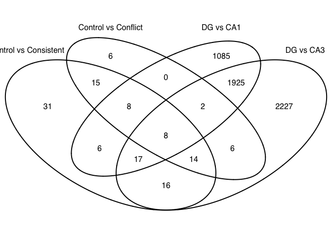
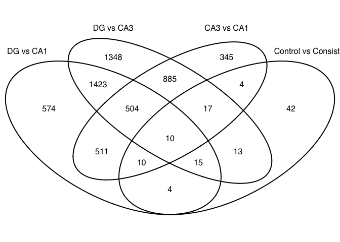
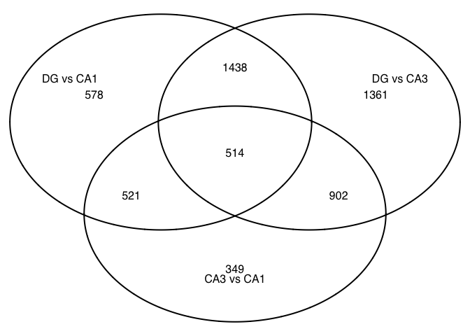
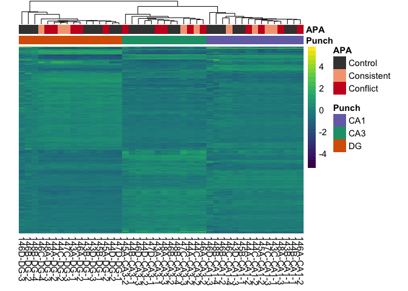

The figures made from this script were compiled in Adobe.

    library(ggplot2) ## for awesome plots!

    ## Warning: package 'ggplot2' was built under R version 3.3.2

    library(cowplot) ## for some easy to use themes
    library(dplyr) ## for filtering and selecting rows
    library(car) ## stats

    ## Warning: package 'car' was built under R version 3.3.2

    library(VennDiagram) ## venn diagrams
    library(pheatmap) ## awesome heatmaps
    library(viridis) # for awesome color pallette
    library(reshape2) ## for melting dataframe
    library(DESeq2) ## for gene expression analysis

    ## Warning: package 'DESeq2' was built under R version 3.3.2

    ## Warning: package 'S4Vectors' was built under R version 3.3.2

    ## Warning: package 'GenomicRanges' was built under R version 3.3.2

    ## Warning: package 'GenomeInfoDb' was built under R version 3.3.2

    library(edgeR)  ## for basic read counts status

    ## Warning: package 'edgeR' was built under R version 3.3.2

    ## Warning: package 'limma' was built under R version 3.3.2

    library(magrittr) ## to use the weird pipe
    library(genefilter)  ## for PCA fuction
    library(ggrepel) ## for labeling volcano plot

    ## Warning: package 'ggrepel' was built under R version 3.3.2

    library(colorblindr)

    ## load functions 
    source("figureoptions.R")
    source("functions_RNAseq.R")
    source("resvalsfunction.R")

    ## set output file for figures 
    knitr::opts_chunk$set(fig.path = '../figures/02_RNAseq/')

    colData <- read.csv("../data/02a_colData.csv", header = T)
    countData <- read.csv("../data/02a_countData.csv", header = T, check.names = F, row.names = 1)

Now, we are create differential gene expression object and remove genes
with 0 counts. Before filtering, there are 22,485 genes in the object.
After filtering genes with 0 counts, we will be left with 17,746 genes
that are expressed in a least 1 sample. Then, we can caluate the size
factors, estimate gene dispersion estimates, fit a model, test for
outliers, and remove outliers.

    ## create DESeq object using the factors Punch and APA
    dds <- DESeqDataSetFromMatrix(countData = countData,
                                  colData = colData,
                                  design = ~ Punch + APA + Punch*APA)

    ## it appears that the last variable in the design formula, 'APA',
    ##   has a factor level, 'Control', which is not the reference level. we recommend
    ##   to use factor(...,levels=...) or relevel() to set this as the reference level
    ##   before proceeding. for more information, please see the 'Note on factor levels'
    ##   in vignette('DESeq2').

    ## DESeq2 1.3.7 specify the factor levels
    dds$Punch <- factor(dds$Punch, levels=c("DG","CA3", "CA1"))
    dds$APA <- factor(dds$APA, levels=c("Control", "Consistent", "Conflict"))

    dds # view the DESeq object - note numnber of genes

    ## class: DESeqDataSet 
    ## dim: 22485 44 
    ## metadata(1): version
    ## assays(1): counts
    ## rownames(22485): 0610007P14Rik 0610009B22Rik ... Zzef1 Zzz3
    ## rowData names(0):
    ## colnames(44): 143A-CA3-1 143A-DG-1 ... 148B-CA3-4 148B-DG-4
    ## colData names(8): RNAseqID Mouse ... APA APA3

    ## DESeq2 1.3.6 Pre-filtering genes with 0 counts
    dds <- dds[ rowSums(counts(dds)) > 1, ] 

    dds # view the DESeq object - note numnber of genes

    ## class: DESeqDataSet 
    ## dim: 17674 44 
    ## metadata(1): version
    ## assays(1): counts
    ## rownames(17674): 0610007P14Rik 0610009B22Rik ... Zzef1 Zzz3
    ## rowData names(0):
    ## colnames(44): 143A-CA3-1 143A-DG-1 ... 148B-CA3-4 148B-DG-4
    ## colData names(8): RNAseqID Mouse ... APA APA3

    # dim: 17674 44 
    # 17,674 genes and 44 samples

    ## DESeq2 1.4  Differential expression analysi
    dds <- DESeq(dds)

    ## estimating size factors

    ## estimating dispersions

    ## gene-wise dispersion estimates

    ## mean-dispersion relationship

    ## final dispersion estimates

    ## fitting model and testing

    ## -- replacing outliers and refitting for 7 genes
    ## -- DESeq argument 'minReplicatesForReplace' = 7 
    ## -- original counts are preserved in counts(dds)

    ## estimating dispersions

    ## fitting model and testing

    ## for variance stablized gene expression and log transformed data
    rld <- rlog(dds, blind=FALSE)
    #vsd <- varianceStabilizingTransformation(dds, blind=FALSE)
    #vsd.fast <- vst(dds, blind=FALSE)

    contrast1 <- resvals(contrastvector = c("Punch", "CA1", "DG"), mypval = 0.05) #2497

    ## [1] 2497

    contrast2 <- resvals(contrastvector = c("Punch", "CA1", "CA3"), mypval = 0.05) #1803

    ## [1] 1803

    contrast3 <- resvals(contrastvector = c("Punch", "CA3", "DG"), mypval = 0.05) #3445

    ## [1] 3445

    contrast4 <- resvals(contrastvector = c("APA", "Consistent", "Control"), mypval = 0.05) #95

    ## [1] 95

    contrast5 <- resvals(contrastvector = c("APA", "Conflict", "Control"), mypval = 0.05) #42

    ## [1] 42

    contrast6 <- resvals(contrastvector = c("APA", "Conflict", "Consistent"), mypval = 0.05) # 0 

    ## [1] 0

    #create a new DF with the gene counts
    ## note: contrast1 had 0 differentially expressed genes, so it is not included 
    rldpadjs <- assay(rld)
    rldpadjs <- cbind(rldpadjs, contrast1, contrast2, contrast3, contrast4, contrast5, contrast6)
    rldpadjs <- as.data.frame(rldpadjs)
    rldpadjs <- rldpadjs[ , grepl( "padj" , names( rldpadjs ) ) ]
    head(rldpadjs)

    ##               padjPunchCA1DG padjPunchCA1CA3 padjPunchCA3DG
    ## 0610007P14Rik      0.9959885       1.0000000      0.9953218
    ## 0610009B22Rik      0.8920416       0.4918862      0.1034590
    ## 0610009L18Rik      0.6926063       0.6752603      0.9767398
    ## 0610009O20Rik      0.7325075       0.9860516      0.4348118
    ## 0610010F05Rik      0.7118161       0.1823768      0.3936081
    ## 0610010K14Rik      0.9959885       0.5247152      0.2851455
    ##               padjAPAConsistentControl padjAPAConflictControl
    ## 0610007P14Rik                        1                      1
    ## 0610009B22Rik                        1                      1
    ## 0610009L18Rik                        1                      1
    ## 0610009O20Rik                        1                      1
    ## 0610010F05Rik                        1                      1
    ## 0610010K14Rik                        1                      1
    ##               padjAPAConflictConsistent
    ## 0610007P14Rik                         1
    ## 0610009B22Rik                         1
    ## 0610009L18Rik                         1
    ## 0610009O20Rik                         1
    ## 0610010F05Rik                         1
    ## 0610010K14Rik                         1

Supplementray P-value distributions
-----------------------------------

Here, the goal is the analyze the distribution of pvalues to see if they
are randomly distributed or if that is a tendency towards and increase
or decrease of low pvalues. There, I'm showing the pval and adjusted
pvale (padj) for all for two-way comparision.

Venn Diagrams of DEgenes
------------------------

Now, we count the number of differnetially expressed genes (according to
padj) and plot some venn diagrams.

    venn1 <- row.names(rldpadjs[rldpadjs[1] <0.1 & !is.na(rldpadjs[1]),])
    venn2 <- row.names(rldpadjs[rldpadjs[2] <0.1 & !is.na(rldpadjs[2]),])
    venn3 <- row.names(rldpadjs[rldpadjs[3] <0.1 & !is.na(rldpadjs[3]),])
    venn4 <- row.names(rldpadjs[rldpadjs[4] <0.1 & !is.na(rldpadjs[4]),])
    venn5 <- row.names(rldpadjs[rldpadjs[5] <0.1 & !is.na(rldpadjs[5]),])

    candidates <- list("Control vs Consistent" = venn4, "DG vs CA3" = venn3  ,"Control vs Conflict" = venn5, "DG vs CA1" = venn1 )

    prettyvenn <- venn.diagram(
      scaled=T,
      x = candidates, filename=NULL, 
      col = "black",
      fill = c( "white", "white", "white", "white"),
      alpha = 0.5,
      cex = 1, fontfamily = "sans", #fontface = "bold",
      cat.default.pos = "text",
      #cat.dist = c(0.08, 0.08, 0.08), cat.pos = 1,
      cat.cex = 1, cat.fontfamily = "sans")
    grid.draw(prettyvenn)

    ## other 3 way

    candidates <- list("DG vs CA1" = venn1, "Control vs Consistent" = venn4,"DG vs CA3" = venn3,  "CA3 vs CA1" = venn2)

    prettyvenn <- venn.diagram(
      scaled=T,
      x = candidates, filename=NULL, 
      col = "black",
      fill = c( "white", "white", "white", "white"),
      alpha = 0.5,
      cex = 1, fontfamily = "sans", #fontface = "bold",
      cat.default.pos = "text",
      #cat.dist = c(0.08, 0.08, 0.08), cat.pos = 1,
      cat.cex = 1, cat.fontfamily = "sans")
    grid.draw(prettyvenn)

    candidates <- list("DG vs CA1" = venn1, "DG vs CA3" = venn3,  "CA3 vs CA1" = venn2)

    prettyvenn <- venn.diagram(
      scaled=T,
      x = candidates, filename=NULL, 
      col = "black",
      fill = c( "white", "white", "white"),
      alpha = 0.5,
      cex = 1, fontfamily = "sans", #fontface = "bold",
      cat.default.pos = "text",
      #cat.dist = c(0.08, 0.08, 0.08), cat.pos = 1,
      cat.cex = 1, cat.fontfamily = "sans")
    grid.draw(prettyvenn)

Principle component analysis
----------------------------

    # create the dataframe using my function pcadataframe
    pcadata <- pcadataframe(rld, intgroup=c("Punch","APA"), returnData=TRUE)
    percentVar <- round(100 * attr(pcadata, "percentVar"))
    percentVar

    ## [1] 49 21  5  3  2  1  1  1  1

    aov1 <- aov(PC1 ~ Punch, data=pcadata)
    summary(aov1) 

    ##             Df Sum Sq Mean Sq F value Pr(>F)    
    ## Punch        2  16378    8189     254 <2e-16 ***
    ## Residuals   41   1322      32                   
    ## ---
    ## Signif. codes:  0 '***' 0.001 '**' 0.01 '*' 0.05 '.' 0.1 ' ' 1

    TukeyHSD(aov1, which = "Punch") 

    ##   Tukey multiple comparisons of means
    ##     95% family-wise confidence level
    ## 
    ## Fit: aov(formula = PC1 ~ Punch, data = pcadata)
    ## 
    ## $Punch
    ##               diff        lwr        upr     p adj
    ## CA3-DG  -40.657971 -45.813529 -35.502413 0.0000000
    ## CA1-DG  -39.611585 -44.573891 -34.649278 0.0000000
    ## CA1-CA3   1.046387  -4.185641   6.278415 0.8781712

    aov2 <- aov(PC2 ~ Punch, data=pcadata)
    summary(aov2) 

    ##             Df Sum Sq Mean Sq F value Pr(>F)    
    ## Punch        2   7310    3655   948.1 <2e-16 ***
    ## Residuals   41    158       4                   
    ## ---
    ## Signif. codes:  0 '***' 0.001 '**' 0.01 '*' 0.05 '.' 0.1 ' ' 1

    TukeyHSD(aov2, which = "Punch") 

    ##   Tukey multiple comparisons of means
    ##     95% family-wise confidence level
    ## 
    ## Fit: aov(formula = PC2 ~ Punch, data = pcadata)
    ## 
    ## $Punch
    ##              diff       lwr       upr p adj
    ## CA3-DG  -16.60420 -18.38688 -14.82152     0
    ## CA1-DG   15.78048  14.06463  17.49634     0
    ## CA1-CA3  32.38468  30.57556  34.19380     0

    aov3 <- aov(PC3 ~ APA, data=pcadata)
    summary(aov3) 

    ##             Df Sum Sq Mean Sq F value Pr(>F)  
    ## APA          2  221.8  110.92   2.634 0.0839 .
    ## Residuals   41 1726.8   42.12                 
    ## ---
    ## Signif. codes:  0 '***' 0.001 '**' 0.01 '*' 0.05 '.' 0.1 ' ' 1

    TukeyHSD(aov3, which = "APA")

    ##   Tukey multiple comparisons of means
    ##     95% family-wise confidence level
    ## 
    ## Fit: aov(formula = PC3 ~ APA, data = pcadata)
    ## 
    ## $APA
    ##                           diff        lwr       upr     p adj
    ## Consistent-Control  -4.5144437 -10.801630 1.7727431 0.2006707
    ## Conflict-Control    -4.4831349  -9.927998 0.9617286 0.1244768
    ## Conflict-Consistent  0.0313088  -6.710948 6.7735655 0.9999297

    aov4 <- aov(PC4 ~ APA, data=pcadata)
    summary(aov4) 

    ##             Df Sum Sq Mean Sq F value  Pr(>F)    
    ## APA          2  382.4  191.18   11.35 0.00012 ***
    ## Residuals   41  690.8   16.85                    
    ## ---
    ## Signif. codes:  0 '***' 0.001 '**' 0.01 '*' 0.05 '.' 0.1 ' ' 1

    TukeyHSD(aov4, which = "APA") 

    ##   Tukey multiple comparisons of means
    ##     95% family-wise confidence level
    ## 
    ## Fit: aov(formula = PC4 ~ APA, data = pcadata)
    ## 
    ## $APA
    ##                          diff       lwr       upr     p adj
    ## Consistent-Control   6.988720  3.012118 10.965321 0.0003232
    ## Conflict-Control     4.893361  1.449523  8.337199 0.0036237
    ## Conflict-Consistent -2.095358 -6.359788  2.169072 0.4629850

    lm4 <- lm(PC4~APA*Punch, data=pcadata)
    summary(lm4)

    ## 
    ## Call:
    ## lm(formula = PC4 ~ APA * Punch, data = pcadata)
    ## 
    ## Residuals:
    ##     Min      1Q  Median      3Q     Max 
    ## -9.4323 -1.4618 -0.1373  1.9425  7.8508 
    ## 
    ## Coefficients:
    ##                        Estimate Std. Error t value Pr(>|t|)   
    ## (Intercept)             -4.4281     1.4859  -2.980  0.00521 **
    ## APAConsistent            9.4512     2.8453   3.322  0.00210 **
    ## APAConflict              7.6810     2.3960   3.206  0.00287 **
    ## PunchCA3                 2.2419     2.2698   0.988  0.33006   
    ## PunchCA1                 2.4031     2.1752   1.105  0.27678   
    ## APAConsistent:PunchCA3  -0.8595     4.4577  -0.193  0.84822   
    ## APAConflict:PunchCA3    -3.9863     3.4953  -1.140  0.26183   
    ## APAConsistent:PunchCA1  -5.3914     3.8775  -1.390  0.17317   
    ## APAConflict:PunchCA1    -4.9338     3.5609  -1.386  0.17464   
    ## ---
    ## Signif. codes:  0 '***' 0.001 '**' 0.01 '*' 0.05 '.' 0.1 ' ' 1
    ## 
    ## Residual standard error: 4.203 on 35 degrees of freedom
    ## Multiple R-squared:  0.4239, Adjusted R-squared:  0.2922 
    ## F-statistic: 3.219 on 8 and 35 DF,  p-value: 0.007569

    anova(lm4) 

    ## Analysis of Variance Table
    ## 
    ## Response: PC4
    ##           Df Sum Sq Mean Sq F value   Pr(>F)    
    ## APA        2 382.37 191.184 10.8237 0.000219 ***
    ## Punch      2   7.06   3.532  0.1999 0.819703    
    ## APA:Punch  4  65.51  16.376  0.9271 0.459370    
    ## Residuals 35 618.22  17.663                     
    ## ---
    ## Signif. codes:  0 '***' 0.001 '**' 0.01 '*' 0.05 '.' 0.1 ' ' 1

    lm124 <- lm(PC1+PC2+PC4~APA*Punch, data=pcadata)
    summary(lm124)

    ## 
    ## Call:
    ## lm(formula = PC1 + PC2 + PC4 ~ APA * Punch, data = pcadata)
    ## 
    ## Residuals:
    ##      Min       1Q   Median       3Q      Max 
    ## -14.7950  -2.6364   0.1244   2.2727  19.8373 
    ## 
    ## Coefficients:
    ##                        Estimate Std. Error t value Pr(>|t|)    
    ## (Intercept)              15.774      2.505   6.297 3.14e-07 ***
    ## APAConsistent            20.708      4.797   4.317 0.000124 ***
    ## APAConflict              16.416      4.039   4.064 0.000259 ***
    ## PunchCA3                -51.557      3.826 -13.474 2.05e-15 ***
    ## PunchCA1                -16.670      3.667  -4.546 6.27e-05 ***
    ## APAConsistent:PunchCA3  -10.584      7.515  -1.408 0.167821    
    ## APAConflict:PunchCA3     -9.754      5.892  -1.655 0.106780    
    ## APAConsistent:PunchCA1  -15.659      6.537  -2.396 0.022076 *  
    ## APAConflict:PunchCA1    -14.350      6.003  -2.390 0.022342 *  
    ## ---
    ## Signif. codes:  0 '***' 0.001 '**' 0.01 '*' 0.05 '.' 0.1 ' ' 1
    ## 
    ## Residual standard error: 7.085 on 35 degrees of freedom
    ## Multiple R-squared:  0.933,  Adjusted R-squared:  0.9177 
    ## F-statistic: 60.97 on 8 and 35 DF,  p-value: < 2.2e-16

    anova(lm124)

    ## Analysis of Variance Table
    ## 
    ## Response: PC1 + PC2 + PC4
    ##           Df  Sum Sq Mean Sq  F value    Pr(>F)    
    ## APA        2  1077.0   538.5  10.7273 0.0002325 ***
    ## Punch      2 22958.2 11479.1 228.6763 < 2.2e-16 ***
    ## APA:Punch  4   448.5   112.1   2.2339 0.0852730 .  
    ## Residuals 35  1756.9    50.2                       
    ## ---
    ## Signif. codes:  0 '***' 0.001 '**' 0.01 '*' 0.05 '.' 0.1 ' ' 1

    pcadata$Punch <- factor(pcadata$Punch, levels=c("DG","CA3", "CA1"))
    pcadata$APA <- factor(pcadata$APA, levels=c("Control", "Consistent", "Conflict"))

    plotPCs(pcadata, 2, 1, aescolor = pcadata$Punch, colorname = " ", aesshape = pcadata$Punch, shapename = " ",  colorvalues = colorvalPunch)

    ## Don't know how to automatically pick scale for object of type data.frame. Defaulting to continuous.
    ## Don't know how to automatically pick scale for object of type data.frame. Defaulting to continuous.

    plotPCs(pcadata, 1, 2, aescolor = pcadata$Punch, colorname = " ", aesshape = pcadata$Punch, shapename = " ",  colorvalues = colorvalPunch)

    ## Don't know how to automatically pick scale for object of type data.frame. Defaulting to continuous.
    ## Don't know how to automatically pick scale for object of type data.frame. Defaulting to continuous.

    plotPCs(pcadata, 4, 2, aescolor = pcadata$APA, colorname = "APA", aesshape = pcadata$Punch, shapename = "Punch",  colorvalues = colorvalAPA)

    ## Don't know how to automatically pick scale for object of type data.frame. Defaulting to continuous.
    ## Don't know how to automatically pick scale for object of type data.frame. Defaulting to continuous.

    # pdf the same pca plots descripbed above of the above
    pdf(file="../figures/02_RNAseq/PCA12.pdf", width=4.5, height=3)
    PCA12 <- plotPCs(pcadata, 1, 2, aescolor = pcadata$Punch, colorname = " ", aesshape = pcadata$Punch, shapename = " ",  colorvalues = colorvalPunch)
    plot(PCA12)

    ## Don't know how to automatically pick scale for object of type data.frame. Defaulting to continuous.
    ## Don't know how to automatically pick scale for object of type data.frame. Defaulting to continuous.

    dev.off()

    ## quartz_off_screen 
    ##                 2

    pdf(file="../figures/02_RNAseq/PCA25.pdf", width=4.5, height=3)
    PCA25 <- plotPCs(pcadata, 4, 2, aescolor = pcadata$APA, colorname = "APA", aesshape = pcadata$Punch, shapename = "Punch",  colorvalues = colorvalAPA)
    plot(PCA25)

    ## Don't know how to automatically pick scale for object of type data.frame. Defaulting to continuous.
    ## Don't know how to automatically pick scale for object of type data.frame. Defaulting to continuous.

    dev.off()

    ## quartz_off_screen 
    ##                 2

Total Gene Counts Per Sample
----------------------------

    ## stats
    counts <- countData
    dim( counts )

    ## [1] 22485    44

    colSums( counts ) / 1e06  # in millions of reads

    ## 143A-CA3-1  143A-DG-1 143B-CA1-1  143B-DG-1 143C-CA1-1 143D-CA1-3 
    ##   1.600535   2.662497   0.874614   1.019113   1.086358   0.540738 
    ##  143D-DG-3 144A-CA1-2 144A-CA3-2  144A-DG-2 144B-CA1-1 144B-CA3-1 
    ##   0.500935   1.504457   0.228021   1.575766   1.275137   0.506698 
    ## 144C-CA1-2 144C-CA3-2  144C-DG-2 144D-CA3-2  144D-DG-2 145A-CA1-2 
    ##   1.613785   0.647568   1.083336   1.209306   2.254320   2.375356 
    ## 145A-CA3-2  145A-DG-2 145B-CA1-1  145B-DG-1 146A-CA1-2 146A-CA3-2 
    ##   0.179967   0.690882   1.034066   0.720798   0.878270   1.511881 
    ##  146A-DG-2 146B-CA1-2 146B-CA3-2  146B-DG-2 146C-CA1-4  146C-DG-4 
    ##   0.591933   0.506014   1.056001   0.055549   0.662938   0.237419 
    ## 146D-CA1-3 146D-CA3-3  146D-DG-3 147C-CA1-3 147C-CA3-3  147C-DG-3 
    ##   0.194359   1.467877   0.043490   1.506436   3.020727   2.118624 
    ## 147D-CA3-1  147D-DG-1 148A-CA1-3 148A-CA3-3  148A-DG-3 148B-CA1-4 
    ##   2.377445   5.618550   2.590815   1.353197   1.917857   0.185637 
    ## 148B-CA3-4  148B-DG-4 
    ##   1.724144   0.398258

    table( rowSums( counts ) )[ 1:30 ] # Number of genes with low counts

    ## 
    ##    0    1    2    3    4    5    6    7    8    9   10   11   12   13   14 
    ## 4392  419  329  252  212  196  152  143  124  103   93   78   90   97   79 
    ##   15   16   17   18   19   20   21   22   23   24   25   26   27   28   29 
    ##   60   71   83   67   65   61   70   55   56   62   56   50   44   37   40

    rowsum <- as.data.frame(colSums( counts ) / 1e06 )
    names(rowsum)[1] <- "millioncounts"
    rowsum$sample <- row.names(rowsum)

    ggplot(rowsum, aes(x=millioncounts)) + 
      geom_histogram(binwidth = 1, colour = "black", fill = "darkgrey") +
      theme_classic() +
      scale_x_continuous(name = "Millions of Gene Counts per Sample",
                         breaks = seq(0, 8, 1),
                         limits=c(0, 8)) +
      scale_y_continuous(name = "Number of Samples")

Heatmap
-------

    DEGes <- assay(rld)
    DEGes <- cbind(DEGes, contrast1, contrast2, contrast3, contrast4, contrast5, contrast6)
    DEGes <- as.data.frame(DEGes) # convert matrix to dataframe
    DEGes$rownames <- rownames(DEGes)  # add the rownames to the dataframe
    DEGes$padjmin <- with(DEGes, pmin(padjPunchCA1DG, padjPunchCA1CA3, padjPunchCA3DG, padjAPAConsistentControl, padjAPAConflictControl, padjAPAConflictConsistent)) # create new col with min padj
    DEGes <- DEGes %>% filter(padjmin < 0.05)
    rownames(DEGes) <- DEGes$rownames
    drop.cols <-colnames(DEGes[,grep("padj|pval|rownames", colnames(DEGes))])
    DEGes <- DEGes %>% dplyr::select(-one_of(drop.cols))
    DEGes <- as.matrix(DEGes)
    DEGes <- DEGes - rowMeans(DEGes)
    head(DEGes)

    ##                143A-CA3-1   143A-DG-1 143B-CA1-1  143B-DG-1 143C-CA1-1
    ## 1110002E22Rik -1.17062965  1.16379383  0.1336557  1.6190139 -0.6782200
    ## 1110008P14Rik  0.36927931  0.08527737  0.1932882  0.3345603 -0.2305912
    ## 1110012L19Rik -1.01406115  0.15190875 -0.4999942  1.4520809  0.1372077
    ## 1190002N15Rik -1.71094068  0.87439179  0.8886826 -0.8287686  1.3205345
    ## 1700001L19Rik -0.38880277  0.04666205  0.0797948 -0.8249946  0.1009883
    ## 1700001O22Rik  0.03095492 -0.34440929  1.4238938 -1.0345635  1.0126539
    ##                143D-CA1-3  143D-DG-3 144A-CA1-2 144A-CA3-2    144A-DG-2
    ## 1110002E22Rik -0.54696368  1.3063606 -0.5532396 -0.4945070  1.409349738
    ## 1110008P14Rik  0.08968605 -0.2042056  0.1854291  1.1511067 -0.966571550
    ## 1110012L19Rik -0.75569759 -0.1356544  0.8681495  0.8474443 -1.004864720
    ## 1190002N15Rik  0.82641426  0.3743473  0.9836874 -2.0396439  2.043854141
    ## 1700001L19Rik  1.57735013  0.1742612  0.1614121 -0.1651675  0.181071220
    ## 1700001O22Rik  1.18417461  0.3604488  1.3026481 -0.5132948  0.007678619
    ##                144B-CA1-1  144B-CA3-1  144C-CA1-2 144C-CA3-2  144C-DG-2
    ## 1110002E22Rik -0.90331591 -0.79872707 -0.60823782 -0.3420103  1.4161957
    ## 1110008P14Rik -0.91125940  0.32456437 -0.21269379  0.9871236 -0.4374099
    ## 1110012L19Rik  0.05513958  0.06754007  0.62029557 -0.1587617  0.2596652
    ## 1190002N15Rik  1.03636092 -1.22646311  0.33962537 -1.0881270  1.7848510
    ## 1700001L19Rik  0.23195726 -0.54942243  0.08975955 -0.8300424 -0.2683466
    ## 1700001O22Rik  0.80736819 -0.31618449  0.54993501 -0.8464314 -0.8591813
    ##                144D-CA3-2  144D-DG-2  145A-CA1-2   145A-CA3-2  145A-DG-2
    ## 1110002E22Rik -1.04515942  0.9459104 -0.68141493  0.003149581  0.1129408
    ## 1110008P14Rik  0.57648302 -0.0829272 -0.01396450  0.865795418 -0.1037691
    ## 1110012L19Rik -0.14371378  0.3498476  0.01343134  1.181093959 -0.2921593
    ## 1190002N15Rik -0.99788302 -0.3156500  0.98076845 -1.100280568  0.5961078
    ## 1700001L19Rik -0.15054695  0.1614783  0.68929978 -0.073316637 -0.6968575
    ## 1700001O22Rik -0.01174999  0.1163171  0.76595195 -0.037995397 -0.6998790
    ##               145B-CA1-1    145B-DG-1 146A-CA1-2 146A-CA3-2   146A-DG-2
    ## 1110002E22Rik -1.0087776  1.545806825 -0.9723121  0.4703477  1.24339240
    ## 1110008P14Rik -0.9133877  0.104118151 -0.1087641  0.8081349 -0.02833311
    ## 1110012L19Rik -0.8976013  0.250077842  0.6959071  0.2851445  0.47524730
    ## 1190002N15Rik  0.5991391 -0.008861396  0.7765526 -0.8766732  0.82531605
    ## 1700001L19Rik  0.5472203  0.063293967  0.3618480 -0.5915478  0.28772501
    ## 1700001O22Rik  0.8345009 -0.518189707  1.4729829  0.5655674 -0.24786451
    ##               146B-CA1-2  146B-CA3-2  146B-DG-2 146C-CA1-4  146C-DG-4
    ## 1110002E22Rik  0.8727357 -1.03834593  0.3640463  0.6892547 -0.5833415
    ## 1110008P14Rik -1.3376166  0.62794995 -0.1849090 -0.8267128 -0.9006632
    ## 1110012L19Rik -0.1129676 -0.91956311 -0.1624537 -0.8041846  0.2800476
    ## 1190002N15Rik  1.3822158 -0.90607154  1.1001809  1.2744499  1.2563017
    ## 1700001L19Rik  0.9251486  0.08585096 -0.2031513  0.6850137 -0.2845466
    ## 1700001O22Rik  0.3916913 -0.52158600 -0.1824397  1.1653560 -0.2562017
    ##               146D-CA1-3 146D-CA3-3  146D-DG-3 147C-CA1-3 147C-CA3-3
    ## 1110002E22Rik -0.4829639 -1.1312959 -0.1209408 -0.2732693 -0.6465445
    ## 1110008P14Rik  0.2578079 -0.4310780 -0.8579243 -0.5717336  0.2038659
    ## 1110012L19Rik -0.4644786 -0.3874941 -0.1277593 -0.1296321 -0.5829517
    ## 1190002N15Rik -0.1794671 -2.1265122 -1.0563482  0.9527176 -1.0217795
    ## 1700001L19Rik -0.5115538 -0.4761342 -0.1681240  0.3040984 -0.1849206
    ## 1700001O22Rik -0.5019169 -1.1061821 -0.1467142  0.4333845 -1.2396908
    ##                147C-DG-3  147D-CA3-1  147D-DG-1  148A-CA1-3  148A-CA3-3
    ## 1110002E22Rik  1.8955758 -1.24750682  1.2232659 -0.94352026 -0.23573927
    ## 1110008P14Rik -0.4257153  0.83081817 -0.1715680 -0.02561183  1.04656762
    ## 1110012L19Rik  0.3212809 -0.06717396  0.3567257  0.01871763 -0.23589012
    ## 1190002N15Rik  1.1439133 -1.86266575 -0.3923846  1.16426445 -2.18577660
    ## 1700001L19Rik  0.2139276 -0.30761652 -0.1121860  0.69108355  0.08359638
    ## 1700001O22Rik -0.3924831 -1.20579228 -0.8352275  0.74035623 -0.89759923
    ##                 148A-DG-3 148B-CA1-4  148B-CA3-4  148B-DG-4
    ## 1110002E22Rik  1.61172630 -0.4036172 -1.16990160  0.0539803
    ## 1110008P14Rik  0.09149396  0.1377390  0.49551158  0.1808092
    ## 1110012L19Rik -0.18345983 -0.3928404 -0.09674135  0.8831455
    ## 1190002N15Rik  0.27408930 -0.1918781 -1.31171728 -1.3708738
    ## 1700001L19Rik -0.44746094 -0.4353280 -0.31880166  0.2460275
    ## 1700001O22Rik -1.05861891 -0.4230747 -0.02269119  1.0540977

    ## the heatmap annotation file
    df <- as.data.frame(colData(dds)[,c("Punch","APA")]) ## matrix to df

    rownames(df) <- names(countData)
    ann_colors <- ann_colors2 #use 

    # make sure the data is a matrix
    DEGes <- as.matrix(DEGes) 

    # set color breaks
    paletteLength <- 30
    myBreaks <- c(seq(min(DEGes), 0, length.out=ceiling(paletteLength/2) + 1), 
                  seq(max(DEGes)/paletteLength, max(DEGes), length.out=floor(paletteLength/2)))

    pheatmap(DEGes, show_colnames=T, show_rownames = F,
             annotation_col=df, annotation_colors = ann_colors,
             treeheight_row = 0, treeheight_col = 25,
             fontsize = 11, 
             #width=4.5, height=3,
             border_color = "grey60" ,
             color = viridis(30),
             cellwidth = 8, 
             clustering_method="average",
             breaks=myBreaks,
             clustering_distance_cols="correlation" 
             )

    # for adobe
    pheatmap(DEGes, show_colnames=F, show_rownames = F,
             annotation_col=df, annotation_colors = ann_colors,
             treeheight_row = 0, treeheight_col = 50,
             fontsize = 10, 
             #width=4.5, height=3,
             border_color = "grey60" ,
             color = viridis(30),
             cellwidth = 8, 
             clustering_method="average",
             breaks=myBreaks,
             clustering_distance_cols="correlation",
             filename = "../figures/02_RNAseq/HeatmapPadj-1.pdf"
             )

    rownames(df) <- names(countData)
    ann_colors <- ann_colors2 #use 

    # make sure the data is a matrix
    DEGes <- as.matrix(DEGes) 

    # set color breaks
    paletteLength <- 30
    myBreaks <- c(seq(min(DEGes), 0, length.out=ceiling(paletteLength/2) + 1), 
                  seq(max(DEGes)/paletteLength, max(DEGes), length.out=floor(paletteLength/2)))

    pheatmap(DEGes, show_colnames=T, show_rownames = F,
             annotation_col=df, annotation_colors = ann_colors,
             treeheight_row = 0, treeheight_col = 25,
             fontsize = 11, 
             #width=4.5, height=3,
             border_color = "grey60" ,
             color = viridis(30),
             cellwidth = 8, 
             clustering_method="average",
             breaks=myBreaks,
             clustering_distance_cols="correlation" 
             )

    # for adobe
    pheatmap(DEGes, show_colnames=F, show_rownames = F,
             annotation_col=df, annotation_colors = ann_colors,
             treeheight_row = 0, treeheight_col = 50,
             fontsize = 10, 
             #width=4.5, height=3,
             border_color = "grey60" ,
             color = viridis(30),
             cellwidth = 8, 
             clustering_method="average",
             breaks=myBreaks,
             clustering_distance_cols="correlation",
             filename = "../figures/02_RNAseq/HeatmapPadj-1.pdf"
             )

    #write.csv(rldpadjs, file = "../data/02c_rldpadjs.csv", row.names = T)
    #write.csv(DEGes, file = "../data/02c_DEGes.csv", row.names = T)
    #write.csv(df, file = "../data/02c_df.csv", row.names = F)
    #write.csv(pcadata, file = "../data/02c_pcadata.csv", row.names = F)
    #write.table(percentVar, file = "../data/02c_percentVar.txt")
