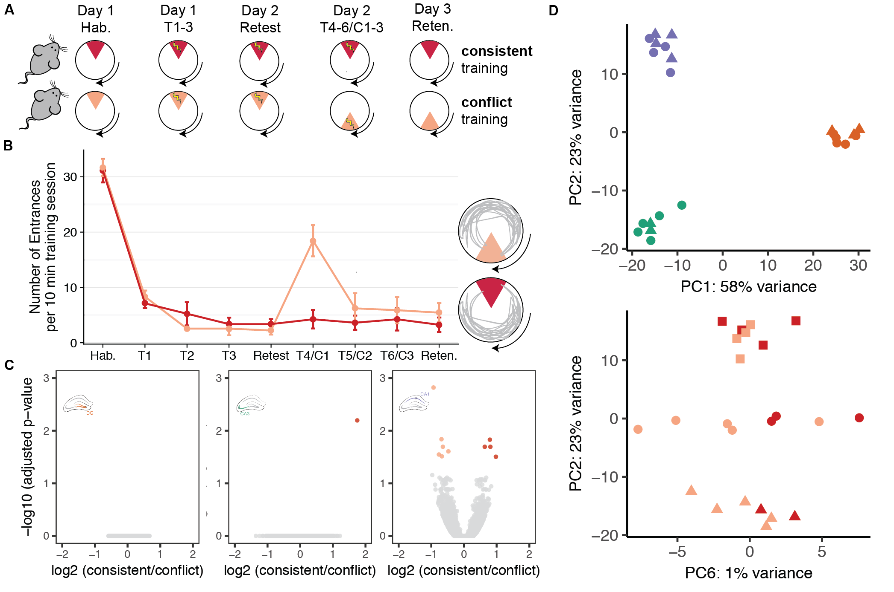

The figures made from this script were compiled in Adobe.




```{r setup, message=F}
library(ggplot2) ## for awesome plots!
library(cowplot) ## for some easy to use themes
library(dplyr) ## for filtering and selecting rows
library(car) ## stats
library(VennDiagram) ## venn diagrams
library(pheatmap) ## awesome heatmaps
library(viridis) # for awesome color pallette
library(reshape2) ## for melting dataframe
library(DESeq2) ## for gene expression analysis
library(edgeR)  ## for basic read counts status
library(magrittr) ## to use the weird pipe
library(genefilter)  ## for PCA fuction
library(ggrepel) ## for labeling volcano plot
library(colorblindr) # simulates color-blind viewing 

## load functions 
source("figureoptions.R")
source("functions_RNAseq.R")

## set output file for figures 
knitr::opts_chunk$set(fig.path = '../figures/02_RNAseq_ConsistentConflict/')

```

## Design
The major comparision here is 
Hippocampal subfield: "DG","CA3", "CA1"
Behavioral Groups: "conflict", "consistent"


```{r data, message=F, warning=F, echo=F}
colData <- read.csv("../data/02a_colData.csv", header = T)
countData <- read.csv("../data/02a_countData.csv", header = T, check.names = F, row.names = 1)

colData <- colData %>% 
  filter(APA2 %in% c("consistent", "conflict" ))  %>% 
  droplevels()

savecols <- as.character(colData$RNAseqID) 
savecols <- as.vector(savecols) 
countData <- countData %>% dplyr::select(one_of(savecols)) 

colData %>% select(APA2,Punch)  %>%  summary()
```

```{r DESeq2, echo=F}
## create DESeq object using the factors Punch and APA
dds <- DESeqDataSetFromMatrix(countData = countData,
                              colData = colData,
                              design = ~ Punch + APA2 + Punch*APA2)

dds$Punch <- factor(dds$Punch, levels=c("DG","CA3", "CA1")) ## specify the factor levels
dds$APA2 <- factor(dds$APA2, levels=c("conflict", "consistent")) ## specify the factor levels

dds # view the DESeq object - note numnber of genes
dds <- dds[ rowSums(counts(dds)) > 1, ]  # Pre-filtering genes with 0 counts
dds # view number of genes afternormalization and the number of samples
dds <- DESeq(dds) # Differential expression analysis
rld <- rlog(dds, blind=FALSE) ## log transformed data
```


## Principle component analysis

```{r pca, echo=F, message=F}
# create the dataframe using my function pcadataframe
pcadata <- pcadataframe(rld, intgroup=c("Punch","APA2"), returnData=TRUE)
percentVar <- round(100 * attr(pcadata, "percentVar"))
percentVar

aov1 <- aov(PC1 ~ Punch, data=pcadata)
summary(aov1) 
TukeyHSD(aov1, which = "Punch") 

aov2 <- aov(PC2 ~ Punch, data=pcadata)
summary(aov2) 
TukeyHSD(aov2, which = "Punch") 

aov3 <- aov(PC3 ~ APA2, data=pcadata)
summary(aov3) 

aov4 <- aov(PC4 ~ APA2, data=pcadata)
summary(aov4) 

aov5 <- aov(PC5 ~ APA2, data=pcadata)
summary(aov5) 

aov6 <- aov(PC6 ~ APA2, data=pcadata)
summary(aov6) 


pcadata$Punch <- factor(pcadata$Punch, levels=c("DG","CA3", "CA1"))
pcadata$APA2 <- factor(pcadata$APA2, levels=c("conflict", "consistent"))

PCA12 <- plotPCs(pcadata, 1, 2, aescolor = pcadata$Punch, colorname = " ", aesshape = pcadata$APA, shapename = " ",  colorvalues = colorvalPunch)
PCA12


PCA62 <- plotPCs(pcadata, 6, 2, aescolor = pcadata$APA2, colorname = "APA2", aesshape = pcadata$Punch, shapename = "Punch",  colorvalues = colorvalAPA6)
PCA62

# pdf the same pca plots descripbed above of the above
pdf(file="../figures/02_RNAseq_ConsistentConflict/PCA12.pdf", width=2.5, height=2.25)
plot(PCA12)
dev.off()

pdf(file="../figures/02_RNAseq_ConsistentConflict/PCA62.pdf", width=2.5, height=2.25)
plot(PCA62)
dev.off()


```

# Number of differentially expressed genes per two-way contrast


```{r Twowaycontrasts3}
#calculate significance of all two way comparisions
# see source "functions_RNAseq.R" 

contrast1 <- resvals(contrastvector = c("Punch", "CA1", "DG"), mypval = 0.05) # 2685
contrast2 <- resvals(contrastvector = c("Punch", "CA1", "CA3"), mypval = 0.05) # 1411
contrast3 <- resvals(contrastvector = c("Punch", "CA3", "DG"), mypval = 0.05) # 3902

contrast4 <- resvals(contrastvector = c("APA2", "consistent", "conflict"), mypval = 0.05) # 0
```


## venn diagrams

```{r venndiagrams, echo=F}
rldpadjs <- assay(rld)
rldpadjs <- cbind(rldpadjs, contrast1, contrast2, contrast3)
rldpadjs <- as.data.frame(rldpadjs)
rldpadjs <- rldpadjs[ , grepl( "padj" , names( rldpadjs ) ) ]

venn1 <- row.names(rldpadjs[rldpadjs[1] <0.05 & !is.na(rldpadjs[1]),]) # CA1 DG
venn2 <- row.names(rldpadjs[rldpadjs[2] <0.05 & !is.na(rldpadjs[2]),]) # CA1 CA3
venn3 <- row.names(rldpadjs[rldpadjs[3] <0.05 & !is.na(rldpadjs[3]),]) # CA3 DG
```


## heatmap

```{r heatmap, echo=F}
DEGes <- assay(rld)
DEGes <- cbind(DEGes, contrast1, contrast2, contrast3)
DEGes <- as.data.frame(DEGes) # convert matrix to dataframe
DEGes$rownames <- rownames(DEGes)  # add the rownames to the dataframe
DEGes$padjmin <- with(DEGes, pmin(padjPunchCA1DG, padjPunchCA1CA3, padjPunchCA3DG)) 

# create new col with min padj
DEGes <- DEGes %>% filter(padjmin < 0.05)
rownames(DEGes) <- DEGes$rownames
drop.cols <-colnames(DEGes[,grep("padj|pval|rownames", colnames(DEGes))])
DEGes <- DEGes %>% dplyr::select(-one_of(drop.cols))
DEGes <- as.matrix(DEGes)
DEGes <- DEGes - rowMeans(DEGes)

## the heatmap annotation file
df <- as.data.frame(colData(dds)[,c("Punch","APA2")]) ## matrix to df
rownames(df) <- names(countData)


ann_colors <- ann_colors6 # see color options 

# make sure the data is a matrix
DEGes <- as.matrix(DEGes) 

# set color breaks
paletteLength <- 30
myBreaks <- c(seq(min(DEGes), 0, length.out=ceiling(paletteLength/2) + 1), 
              seq(max(DEGes)/paletteLength, max(DEGes), length.out=floor(paletteLength/2)))

pheatmap(DEGes, show_colnames=T, show_rownames = F,
         annotation_col=df, annotation_colors = ann_colors,
         treeheight_row = 0, treeheight_col = 25,
         fontsize = 11, 
         #width=4.5, height=3,
         border_color = "grey60" ,
         color = viridis(30),
         cellwidth = 8, 
         clustering_method="average",
         breaks=myBreaks,
         clustering_distance_cols="correlation" 
         )

# for adobe
pheatmap(DEGes, show_colnames=F, show_rownames = F,
         annotation_col=df, annotation_colors = ann_colors,
         treeheight_row = 0, treeheight_col = 50,
         fontsize = 10, 
         #width=4.5, height=3,
         border_color = "grey60" ,
         color = viridis(30),
         cellwidth = 8, 
         clustering_method="average",
         breaks=myBreaks,
         clustering_distance_cols="correlation",
         filename = "../figures/02_RNAseq_ConsistentConflict/pheatmap.pdf"
         )

# no legends just the heatmap
pheatmap(DEGes, show_colnames=F, show_rownames = F,
         annotation_col=df, annotation_colors = ann_colors, 
         annotation_row = NA, 
         annotation_legend = FALSE,
         annotation_names_row = FALSE, annotation_names_col = FALSE,
         treeheight_row = 0, treeheight_col = 50,
         fontsize = 11, 
         border_color = "grey60" ,
         color = viridis(30),
         #cellwidth = 7, 
         clustering_method="average",
         breaks=myBreaks,
         clustering_distance_cols="correlation" 
         )

pheatmap(DEGes, show_colnames=F, show_rownames = F,
         annotation_col=df, annotation_colors = ann_colors, 
         annotation_row = NA, 
         annotation_legend = FALSE,
         annotation_names_row = FALSE, annotation_names_col = FALSE,
         treeheight_row = 0, treeheight_col = 50,
         fontsize = 11, 
         border_color = "grey60" ,
         color = viridis(30),
         #cellwidth = 7, 
         clustering_method="average",
         breaks=myBreaks,
         clustering_distance_cols="correlation", 
         filename = "../figures/02_RNAseq_ConsistentConflict/pheatmap_minimal.pdf"
         )
```


## Volcanos plots and and gene lists


```{r volcanos, include=F}

imgDG <- magick::image_read("../figures/00_schematics/DG.png")
imgCA3 <- magick::image_read("../figures/00_schematics/CA3.png")
imgCA1 <- magick::image_read("../figures/00_schematics/CA1.png")
imgHippo <- magick::image_read("../figures/00_schematics/HippoSeq.png")

# gene lists
res <- results(dds, contrast =c("Punch", "CA1", "DG"), independentFiltering = T, alpha = 0.05)
resOrdered <- res[order(res$padj),]
head(resOrdered, 10)
data <- data.frame(gene = row.names(res), pvalue = -log10(res$padj), lfc = res$log2FoldChange)
data <- na.omit(data)
data <- data %>%
  mutate(color = ifelse(data$lfc > 0 & data$pvalue > 1.3, 
                        yes = "CA1", 
                        no = ifelse(data$lfc < 0 & data$pvalue > 1.3, 
                                    yes = "DG", 
                                    no = "none")))
top_labelled <- top_n(data, n = 5, wt = lfc)

# Color corresponds to fold change directionality
colored <- ggplot(data, aes(x = lfc, y = pvalue)) + 
  geom_point(aes(color = factor(color)), size = 1, alpha = 0.8, na.rm = T) + # add gene points
  theme_bw(base_size = 8) + # clean up theme
  theme(legend.position = "none") + # remove legend 
  scale_color_manual(values = c("CA1" = "#7570b3",
                                "DG" = "#d95f02", 
                                "none" = "#d9d9d9")) + theme(panel.grid.minor=element_blank(),
           panel.grid.major=element_blank()) + 
  scale_x_continuous(name="log2 (CA1/DG)",
                     limits=c(-10, 10)) +
  scale_y_continuous(name="-log10 (adjusted p-value",
                    limits= c(0, 70)) 
colored
#cvd_grid(colored) # to view plot for color blind 
pdf(file="../figures/02_RNAseq_ConsistentConflict/AllCA1DG.pdf", width=1.5, height=1.75)
plot(colored)
dev.off()

res <- results(dds, contrast =c("Punch", "CA1", "CA3"), independentFiltering = T, alpha = 0.05)
resOrdered <- res[order(res$padj),]
head(resOrdered, 10)
data <- data.frame(gene = row.names(res), pvalue = -log10(res$padj), lfc = res$log2FoldChange)
data <- na.omit(data)
head(data)
data <- data %>%
  mutate(color = ifelse(data$lfc > 0 & data$pvalue > 1.3, 
                        yes = "CA1", 
                        no = ifelse(data$lfc < 0 & data$pvalue > 1.3, 
                                    yes = "CA3", 
                                    no = "none")))
top_labelled <- top_n(data, n = 5, wt = lfc)
colored <- ggplot(data, aes(x = lfc, y = pvalue)) + 
  geom_point(aes(color = factor(color)), size = 1, alpha = 0.8, na.rm = T) + # add gene points
  theme_bw(base_size = 8) + # clean up theme
  theme(legend.position = "none") + # remove legend 
  scale_color_manual(values = c("CA1" = "#7570b3",
                                "CA3" = "#1b9e77", 
                                "none" = "#d9d9d9")) + theme(panel.grid.minor=element_blank(),
           panel.grid.major=element_blank()) + 
  scale_x_continuous(name="log2 (CA1/CA3)",
                     limits=c(-10, 10)) +
  scale_y_continuous(name="-log10 (adjusted p-value",
                    limits= c(0, 70)) 
colored
pdf(file="../figures/02_RNAseq_ConsistentConflict/AllCA1CA3.pdf", width=1.5, height=1.75)
plot(colored)
dev.off()


res <- results(dds, contrast =c("Punch", "CA3", "DG"), independentFiltering = T, alpha = 0.05)
resOrdered <- res[order(res$padj),]
head(resOrdered, 10)
data <- data.frame(gene = row.names(res), pvalue = -log10(res$padj), lfc = res$log2FoldChange)
data <- na.omit(data)
head(data)
data <- data %>%
  mutate(color = ifelse(data$lfc > 0 & data$pvalue > 1.3, 
                        yes = "CA3", 
                        no = ifelse(data$lfc < 0 & data$pvalue > 1.3, 
                                    yes = "DG", 
                                    no = "none")))
top_labelled <- top_n(data, n = 5, wt = lfc)
colored <- ggplot(data, aes(x = lfc, y = pvalue)) + 
  geom_point(aes(color = factor(color)), size = 1, alpha = 0.8, na.rm = T) + # add gene points
  theme_bw(base_size = 8) + # clean up theme
  theme(legend.position = "none") + # remove legend 
  scale_color_manual(values = c("CA3" = "#1b9e77",
                                "DG" = "#d95f02", 
                                "none" = "#d9d9d9")) + theme(panel.grid.minor=element_blank(),
           panel.grid.major=element_blank()) + 
  scale_x_continuous(name="log2 (CA3/DG)",
                     limits=c(-10, 10)) +
  scale_y_continuous(name="-log10 (adjusted p-value",
                    limits= c(0, 70)) 

colored
#cvd_grid(colored)
pdf(file="../figures/02_RNAseq_ConsistentConflict/AllDGCA3.pdf", width=1.5, height=1.75)
plot(colored)
dev.off()


res <- results(dds, contrast =c("APA2", "consistent", "conflict"), independentFiltering = T, alpha = 0.05)
resOrdered <- res[order(res$padj),]
head(resOrdered, 10)

data <- data.frame(gene = row.names(res),
                   pvalue = -log10(res$padj), 
                   lfc = res$log2FoldChange)
data <- na.omit(data)
data <- data %>%
  mutate(color = ifelse(data$lfc > 0 & data$pvalue > 1.3, 
                        yes = "consistent", 
                        no = ifelse(data$lfc < 0 & data$pvalue > 1.3, 
                                    yes = "conflict", 
                                    no = "none")))
top_labelled <- top_n(data, n = 5, wt = lfc)
# Color corresponds to fold change directionality
colored <- ggplot(data, aes(x = lfc, y = pvalue)) + 
  geom_point(aes(color = factor(color)), size = 1, alpha = 0.8, na.rm = T) + # add gene points
  theme_bw(base_size = 8) + # clean up theme
  theme(legend.position = "none") + # remove legend 
  scale_color_manual(values = volcano2) + 
  theme(panel.grid.minor=element_blank(),
           panel.grid.major=element_blank()) + 
  scale_x_continuous(name="log2 (consistent/conflict)",
                     limits=c(-10, 10)) +
  scale_y_continuous(name="-log10 (adjusted p-value",
                    limits= c(0, 15)) +
  draw_image(imgHippo, scale = 9, x=-6.5, y=13)
colored


#cvd_grid(colored) # to view plot for color blind 
pdf(file="../figures/02_RNAseq_ConsistentConflict/Allconsistentconflict.pdf", width=1.5, height=1.75)
plot(colored)
dev.off()

```


## DG


```{r DG, message=F, warning=F, echo=F}
colData <- read.csv("../data/02a_colData.csv", header = T)
countData <- read.csv("../data/02a_countData.csv", header = T, check.names = F, row.names = 1)

colData <- colData %>% 
  filter(APA2 %in% c("consistent", "conflict" ))  %>%
  filter(Punch %in% c( "DG")) %>%
  droplevels()

savecols <- as.character(colData$RNAseqID) 
savecols <- as.vector(savecols) 
countData <- countData %>% dplyr::select(one_of(savecols)) 

colData %>% select(APA2,Punch)  %>%  summary()

dds <- DESeqDataSetFromMatrix(countData = countData,
                              colData = colData,
                              design = ~ APA2 )

dds$APA2 <- factor(dds$APA2, levels=c("conflict", "consistent")) ## specify the factor levels

dds # view the DESeq object - note numnber of genes
dds <- dds[ rowSums(counts(dds)) > 1, ]  # Pre-filtering genes with 0 counts
dds # view number of genes afternormalization and the number of samples
dds <- DESeq(dds) # Differential expression analysis


res <- results(dds, contrast =c("APA2", "consistent", "conflict"), independentFiltering = T, alpha = 0.05)
resOrdered <- res[order(res$padj),]
head(resOrdered, 10)

summary(res)
topGene <- rownames(res)[which.min(res$padj)]
plotCounts(dds, gene = topGene, intgroup=c("APA2"))

data <- data.frame(gene = row.names(res),
                   pvalue = -log10(res$padj), 
                   lfc = res$log2FoldChange)
data <- na.omit(data)
data <- data %>%
  mutate(color = ifelse(data$lfc > 0 & data$pvalue > 1.3, 
                        yes = "consistent", 
                        no = ifelse(data$lfc < 0 & data$pvalue > 1.3, 
                                    yes = "conflict", 
                                    no = "none")))
top_labelled <- top_n(data, n = 5, wt = lfc)
# Color corresponds to fold change directionality
colored <- ggplot(data, aes(x = lfc, y = pvalue)) + 
  geom_point(aes(color = factor(color)), size = 1, alpha = 0.8, na.rm = T) + # add gene points
  theme_bw(base_size = 8) + # clean up theme
  theme(legend.position = "none") + # remove legend 
  scale_color_manual(values = volcano2) + 
  theme(panel.grid.minor=element_blank(),
           panel.grid.major=element_blank()) + 
  scale_x_continuous(name="log2 (consistent/conflict)",
                     limits=c(-2, 2)) +
  scale_y_continuous(name="-log10 (adjusted p-value)",
                    limits= c(0, 5))  + 
  draw_image(imgDG, scale = 2, x=-1.6, y=4)
colored

pdf(file="../figures/02_RNAseq_ConsistentConflict/DGconsistentconflict.pdf", width=1.5, height=1.75)
plot(colored)
dev.off()

```

## CA3

```{r CA3, message=F, warning=F, echo=F}
colData <- read.csv("../data/02a_colData.csv", header = T)
countData <- read.csv("../data/02a_countData.csv", header = T, check.names = F, row.names = 1)

colData <- colData %>% 
  filter(APA2 %in% c("consistent", "conflict" ))  %>%
  filter(Punch %in% c( "CA3")) %>%
  droplevels()

savecols <- as.character(colData$RNAseqID) 
savecols <- as.vector(savecols) 
countData <- countData %>% dplyr::select(one_of(savecols)) 

colData %>% select(APA2,Punch)  %>%  summary()

dds <- DESeqDataSetFromMatrix(countData = countData,
                              colData = colData,
                              design = ~ APA2 )

dds$APA2 <- factor(dds$APA2, levels=c("conflict", "consistent")) ## specify the factor levels

dds # view the DESeq object - note numnber of genes
dds <- dds[ rowSums(counts(dds)) > 1, ]  # Pre-filtering genes with 0 counts
dds # view number of genes afternormalization and the number of samples
dds <- DESeq(dds) # Differential expression analysis


res <- results(dds, contrast =c("APA2", "consistent", "conflict"), independentFiltering = T, alpha = 0.05)
resOrdered <- res[order(res$padj),]
head(resOrdered, 10)

summary(res)

topGene <- rownames(res)[which.min(res$padj)]
plotCounts(dds, gene = topGene, intgroup=c("APA2"))

data <- data.frame(gene = row.names(res),
                   pvalue = -log10(res$padj), 
                   lfc = res$log2FoldChange)
data <- na.omit(data)
data <- data %>%
  mutate(color = ifelse(data$lfc > 0 & data$pvalue > 1.3, 
                        yes = "consistent", 
                        no = ifelse(data$lfc < 0 & data$pvalue > 1.3, 
                                    yes = "conflict", 
                                    no = "none")))
top_labelled <- top_n(data, n = 5, wt = lfc)
# Color corresponds to fold change directionality
colored <- ggplot(data, aes(x = lfc, y = pvalue)) + 
  geom_point(aes(color = factor(color)), size = 1, alpha = 0.8, na.rm = T) + # add gene points
  theme_bw(base_size = 8) + # clean up theme
  theme(legend.position = "none") + # remove legend 
  scale_color_manual(values = volcano2) + 
  theme(panel.grid.minor=element_blank(),
           panel.grid.major=element_blank()) + 
  scale_x_continuous(name="log2 (consistent/conflict)",
                     limits=c(-2, 2)) +
  scale_y_continuous(name="-log10 (adjusted p-value)",
                    limits= c(0, 5))  + 
  draw_image(imgCA3, scale = 2, x= -1.6, y=4) 
colored

pdf(file="../figures/02_RNAseq_ConsistentConflict/CA3consistentconflict.pdf", width=1.5, height=1.75)
plot(colored)
dev.off()

```


## CA1

```{r CA1, message=F, warning=F, echo=F}
colData <- read.csv("../data/02a_colData.csv", header = T)
countData <- read.csv("../data/02a_countData.csv", header = T, check.names = F, row.names = 1)

colData <- colData %>% 
  filter(APA2 %in% c("consistent", "conflict" ))  %>%
  filter(Punch %in% c( "CA1")) %>%
  droplevels()

savecols <- as.character(colData$RNAseqID) 
savecols <- as.vector(savecols) 
countData <- countData %>% dplyr::select(one_of(savecols)) 

colData %>% select(APA2,Punch)  %>%  summary()

dds <- DESeqDataSetFromMatrix(countData = countData,
                              colData = colData,
                              design = ~ APA2 )

dds$APA2 <- factor(dds$APA2, levels=c("conflict", "consistent")) ## specify the factor levels

dds <- dds[ rowSums(counts(dds)) > 1, ]  # Pre-filtering genes with 0 counts
dds # view number of genes afternormalization and the number of samples
dds <- DESeq(dds) # Differential expression analysis

res <- results(dds, contrast =c("APA2", "consistent", "conflict"), independentFiltering = T, alpha = 0.05)
resOrdered <- res[order(res$padj),]
head(resOrdered, 10)

summary(res)

topGene <- rownames(res)[which.min(res$padj)]
plotCounts(dds, gene = topGene, intgroup=c("APA2"))

data <- data.frame(gene = row.names(res),
                   pvalue = -log10(res$padj), 
                   lfc = res$log2FoldChange)
data <- na.omit(data)
data <- data %>%
  mutate(color = ifelse(data$lfc > 0 & data$pvalue > 1.3, 
                        yes = "consistent", 
                        no = ifelse(data$lfc < 0 & data$pvalue > 1.3, 
                                    yes = "conflict", 
                                    no = "none")))
top_labelled <- top_n(data, n = 5, wt = lfc)
# Color corresponds to fold change directionality
colored <- ggplot(data, aes(x = lfc, y = pvalue)) + 
  geom_point(aes(color = factor(color)), size = 1, alpha = 0.8, na.rm = T) + # add gene points
  theme_bw(base_size = 8) + # clean up theme
  theme(legend.position = "none") + # remove legend 
  scale_color_manual(values = volcano2) + 
  theme(panel.grid.minor=element_blank(),
           panel.grid.major=element_blank()) + 
  scale_x_continuous(name="log2 (consistent/conflict)",
                     limits=c(-2, 2)) +
  scale_y_continuous(name="-log10 (adjusted p-value)",
                    limits= c(0, 5))  +  
  draw_image(imgCA1, scale = 2, x=-1.6, y=3.9)
colored

#cvd_grid(colored) # to view plot for color blind 
pdf(file="../figures/02_RNAseq_ConsistentConflict/CA1consistentconflict.pdf", width=1.5, height=1.75)
plot(colored)
dev.off()

```
