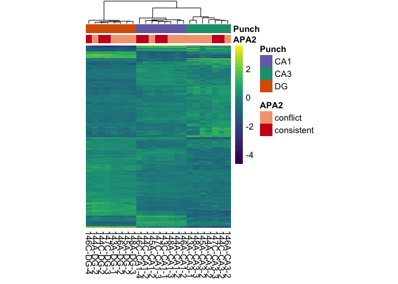
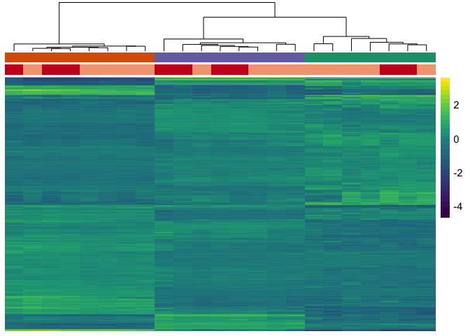
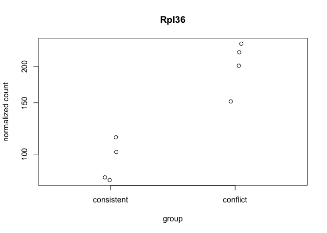
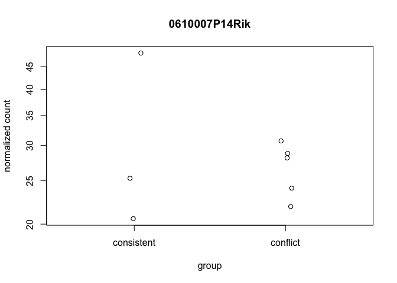

The figures made from this script were compiled in Adobe.

    library(ggplot2) ## for awesome plots!
    library(cowplot) ## for some easy to use themes
    library(dplyr) ## for filtering and selecting rows
    library(car) ## stats
    library(VennDiagram) ## venn diagrams
    library(pheatmap) ## awesome heatmaps
    library(viridis) # for awesome color pallette
    library(reshape2) ## for melting dataframe
    library(DESeq2) ## for gene expression analysis
    library(edgeR)  ## for basic read counts status
    library(magrittr) ## to use the weird pipe
    library(genefilter)  ## for PCA fuction
    library(ggrepel) ## for labeling volcano plot
    library(colorblindr) # simulates color-blind viewing 

    ## load functions 
    source("figureoptions.R")
    source("functions_RNAseq.R")

    ## set output file for figures 
    knitr::opts_chunk$set(fig.path = '../figures/02_RNAseq_ConsistentConflict/')

Design
------

The major comparision here is Hippocampal subfield: "DG","CA3", "CA1"
Behavioral Groups: "conflict", "consistent"

    colData <- read.csv("../data/02a_colData.csv", header = T)
    countData <- read.csv("../data/02a_countData.csv", header = T, check.names = F, row.names = 1)

    colData <- colData %>% 
      filter(APA2 %in% c("consistent", "conflict" ))  %>% 
      droplevels()

    savecols <- as.character(colData$RNAseqID) 
    savecols <- as.vector(savecols) 
    countData <- countData %>% dplyr::select(one_of(savecols)) 

    colData %>% select(APA2,Punch)  %>%  summary()

    ##          APA2    Punch  
    ##  conflict  :14   CA1:8  
    ##  consistent: 9   CA3:7  
    ##                  DG :8

    ## create DESeq object using the factors Punch and APA
    dds <- DESeqDataSetFromMatrix(countData = countData,
                                  colData = colData,
                                  design = ~ Punch + APA2 + Punch*APA2)

    dds$Punch <- factor(dds$Punch, levels=c("DG","CA3", "CA1")) ## specify the factor levels
    dds$APA2 <- factor(dds$APA2, levels=c("conflict", "consistent")) ## specify the factor levels

    dds # view the DESeq object - note numnber of genes

    ## class: DESeqDataSet 
    ## dim: 22485 23 
    ## metadata(1): version
    ## assays(1): counts
    ## rownames(22485): 0610007P14Rik 0610009B22Rik ... Zzef1 Zzz3
    ## rowData names(0):
    ## colnames(23): 143A-CA3-1 143A-DG-1 ... 148A-CA3-3 148A-DG-3
    ## colData names(8): RNAseqID Mouse ... APA APA2

    dds <- dds[ rowSums(counts(dds)) > 1, ]  # Pre-filtering genes with 0 counts
    dds # view number of genes afternormalization and the number of samples

    ## class: DESeqDataSet 
    ## dim: 17257 23 
    ## metadata(1): version
    ## assays(1): counts
    ## rownames(17257): 0610007P14Rik 0610009B22Rik ... Zzef1 Zzz3
    ## rowData names(0):
    ## colnames(23): 143A-CA3-1 143A-DG-1 ... 148A-CA3-3 148A-DG-3
    ## colData names(8): RNAseqID Mouse ... APA APA2

    dds <- DESeq(dds) # Differential expression analysis

    ## estimating size factors

    ## estimating dispersions

    ## gene-wise dispersion estimates

    ## mean-dispersion relationship

    ## final dispersion estimates

    ## fitting model and testing

    rld <- rlog(dds, blind=FALSE) ## log transformed data

Principle component analysis
----------------------------

    # create the dataframe using my function pcadataframe
    pcadata <- pcadataframe(rld, intgroup=c("Punch","APA2"), returnData=TRUE)
    percentVar <- round(100 * attr(pcadata, "percentVar"))
    percentVar

    ## [1] 58 23  4  2  2  1  1  1  1

    aov1 <- aov(PC1 ~ Punch, data=pcadata)
    summary(aov1) 

    ##             Df Sum Sq Mean Sq F value Pr(>F)    
    ## Punch        2   8841    4421   688.5 <2e-16 ***
    ## Residuals   20    128       6                   
    ## ---
    ## Signif. codes:  0 '***' 0.001 '**' 0.01 '*' 0.05 '.' 0.1 ' ' 1

    TukeyHSD(aov1, which = "Punch") 

    ##   Tukey multiple comparisons of means
    ##     95% family-wise confidence level
    ## 
    ## Fit: aov(formula = PC1 ~ Punch, data = pcadata)
    ## 
    ## $Punch
    ##               diff        lwr        upr     p adj
    ## CA3-DG  -42.104318 -45.422124 -38.786512 0.0000000
    ## CA1-DG  -40.289140 -43.494445 -37.083835 0.0000000
    ## CA1-CA3   1.815179  -1.502627   5.132985 0.3677355

    aov2 <- aov(PC2 ~ Punch, data=pcadata)
    summary(aov2) 

    ##             Df Sum Sq Mean Sq F value Pr(>F)    
    ## Punch        2   3435  1717.5   533.6 <2e-16 ***
    ## Residuals   20     64     3.2                   
    ## ---
    ## Signif. codes:  0 '***' 0.001 '**' 0.01 '*' 0.05 '.' 0.1 ' ' 1

    TukeyHSD(aov2, which = "Punch") 

    ##   Tukey multiple comparisons of means
    ##     95% family-wise confidence level
    ## 
    ## Fit: aov(formula = PC2 ~ Punch, data = pcadata)
    ## 
    ## $Punch
    ##              diff       lwr       upr p adj
    ## CA3-DG  -15.12552 -17.47467 -12.77637     0
    ## CA1-DG   15.18229  12.91280  17.45179     0
    ## CA1-CA3  30.30781  27.95866  32.65696     0

    aov3 <- aov(PC3 ~ APA2, data=pcadata)
    summary(aov3) 

    ##             Df Sum Sq Mean Sq F value Pr(>F)
    ## APA2         1   25.5   25.47   1.025  0.323
    ## Residuals   21  522.0   24.86

    aov4 <- aov(PC4 ~ APA2, data=pcadata)
    summary(aov4) 

    ##             Df Sum Sq Mean Sq F value Pr(>F)
    ## APA2         1   18.9   18.93   1.225  0.281
    ## Residuals   21  324.4   15.45

    aov5 <- aov(PC5 ~ APA2, data=pcadata)
    summary(aov5) 

    ##             Df Sum Sq Mean Sq F value Pr(>F)  
    ## APA2         1   36.5   36.50   3.301 0.0835 .
    ## Residuals   21  232.2   11.06                 
    ## ---
    ## Signif. codes:  0 '***' 0.001 '**' 0.01 '*' 0.05 '.' 0.1 ' ' 1

    aov6 <- aov(PC6 ~ APA2, data=pcadata)
    summary(aov6) 

    ##             Df Sum Sq Mean Sq F value Pr(>F)  
    ## APA2         1  49.69   49.69   5.877 0.0245 *
    ## Residuals   21 177.55    8.45                 
    ## ---
    ## Signif. codes:  0 '***' 0.001 '**' 0.01 '*' 0.05 '.' 0.1 ' ' 1

    pcadata$Punch <- factor(pcadata$Punch, levels=c("DG","CA3", "CA1"))
    pcadata$APA2 <- factor(pcadata$APA2, levels=c("conflict", "consistent"))

    PCA12 <- plotPCs(pcadata, 1, 2, aescolor = pcadata$Punch, colorname = " ", aesshape = pcadata$APA, shapename = " ",  colorvalues = colorvalPunch)
    PCA12

    ## Don't know how to automatically pick scale for object of type data.frame. Defaulting to continuous.
    ## Don't know how to automatically pick scale for object of type data.frame. Defaulting to continuous.

    PCA62 <- plotPCs(pcadata, 6, 2, aescolor = pcadata$APA2, colorname = "APA2", aesshape = pcadata$Punch, shapename = "Punch",  colorvalues = colorvalAPA6)
    PCA62

    ## Don't know how to automatically pick scale for object of type data.frame. Defaulting to continuous.
    ## Don't know how to automatically pick scale for object of type data.frame. Defaulting to continuous.

    # pdf the same pca plots descripbed above of the above
    pdf(file="../figures/02_RNAseq_ConsistentConflict/PCA12.pdf", width=3, height=2.5)
    plot(PCA12)

    ## Don't know how to automatically pick scale for object of type data.frame. Defaulting to continuous.
    ## Don't know how to automatically pick scale for object of type data.frame. Defaulting to continuous.

    dev.off()

    ## quartz_off_screen 
    ##                 2

    pdf(file="../figures/02_RNAseq_ConsistentConflict/PCA62.pdf", width=3, height=2.5)
    plot(PCA62)

    ## Don't know how to automatically pick scale for object of type data.frame. Defaulting to continuous.
    ## Don't know how to automatically pick scale for object of type data.frame. Defaulting to continuous.

    dev.off()

    ## quartz_off_screen 
    ##                 2

Number of differentially expressed genes per two-way contrast
=============================================================

    #calculate significance of all two way comparisions
    # see source "functions_RNAseq.R" 

    contrast1 <- resvals(contrastvector = c("Punch", "CA1", "DG"), mypval = 0.05) # 2685

    ## [1] 2685

    contrast2 <- resvals(contrastvector = c("Punch", "CA1", "CA3"), mypval = 0.05) # 1411

    ## [1] 1411

    contrast3 <- resvals(contrastvector = c("Punch", "CA3", "DG"), mypval = 0.05) # 3902

    ## [1] 3902

    contrast4 <- resvals(contrastvector = c("APA2", "consistent", "conflict"), mypval = 0.05) # 0

    ## [1] 0

venn diagrams
-------------

    rldpadjs <- assay(rld)
    rldpadjs <- cbind(rldpadjs, contrast1, contrast2, contrast3)
    rldpadjs <- as.data.frame(rldpadjs)
    rldpadjs <- rldpadjs[ , grepl( "padj" , names( rldpadjs ) ) ]

    venn1 <- row.names(rldpadjs[rldpadjs[1] <0.05 & !is.na(rldpadjs[1]),]) # CA1 DG
    venn2 <- row.names(rldpadjs[rldpadjs[2] <0.05 & !is.na(rldpadjs[2]),]) # CA1 CA3
    venn3 <- row.names(rldpadjs[rldpadjs[3] <0.05 & !is.na(rldpadjs[3]),]) # CA3 DG

heatmap
-------

    DEGes <- assay(rld)
    DEGes <- cbind(DEGes, contrast1, contrast2, contrast3)
    DEGes <- as.data.frame(DEGes) # convert matrix to dataframe
    DEGes$rownames <- rownames(DEGes)  # add the rownames to the dataframe
    DEGes$padjmin <- with(DEGes, pmin(padjPunchCA1DG, padjPunchCA1CA3, padjPunchCA3DG)) 

    # create new col with min padj
    DEGes <- DEGes %>% filter(padjmin < 0.05)
    rownames(DEGes) <- DEGes$rownames
    drop.cols <-colnames(DEGes[,grep("padj|pval|rownames", colnames(DEGes))])
    DEGes <- DEGes %>% dplyr::select(-one_of(drop.cols))
    DEGes <- as.matrix(DEGes)
    DEGes <- DEGes - rowMeans(DEGes)
    head(DEGes)

    ##               143A-CA3-1   143A-DG-1  143C-CA1-1  144A-CA1-2 144A-CA3-2
    ## 1110002E22Rik -0.9622147  0.88978827 -0.61617251 -0.55291413 -0.4108738
    ## 1110008F13Rik  0.5861442 -0.36218132  0.12304322  0.38695349 -0.1782335
    ## 1110008P14Rik  0.3517760  0.03323043 -0.22154170  0.13295775  0.9687639
    ## 1110032A03Rik  0.1679849 -0.06961431  0.08673115  0.11214509  0.3202416
    ## 1110037F02Rik -0.1847156 -0.06979185  0.17503432 -0.33149309 -0.5436510
    ## 1110051M20Rik  0.5548744 -0.27357518  0.03627470  0.04669549  0.2449790
    ##                144A-DG-2  144C-CA1-2  144C-CA3-2   144C-DG-2  145A-CA1-2
    ## 1110002E22Rik  1.1248838 -0.58534384 -0.36618112  1.13292793 -0.65230740
    ## 1110008F13Rik -0.5942801 -0.29029187  0.42286635  0.08446561  0.66869350
    ## 1110008P14Rik -0.9256313 -0.21251452  0.86947892 -0.43190945 -0.03094025
    ## 1110032A03Rik -0.1255282 -0.09891169  0.27357462 -0.32671805  0.04154565
    ## 1110037F02Rik  0.6044851 -0.10272441 -0.48093588  0.43738582 -0.24811106
    ## 1110051M20Rik -0.3300501 -0.20436990  0.04207018 -0.08318345  0.19780296
    ##                145A-CA3-2   145A-DG-2  146A-CA1-2 146A-CA3-2   146A-DG-2
    ## 1110002E22Rik -0.08180993 -0.01615375 -0.80503224  0.2424364  0.94487392
    ## 1110008F13Rik  0.49181855 -0.24730014  0.03248229  0.4703942  0.00679390
    ## 1110008P14Rik  0.67283332 -0.12556800 -0.14579322  0.6782294 -0.07429391
    ## 1110032A03Rik  0.20806523 -0.19058822  0.32866190  0.2608929 -0.13222121
    ## 1110037F02Rik -0.84948411  0.22116132  0.27310442 -0.3135085  0.30128642
    ## 1110051M20Rik -0.50494674 -0.26646302 -0.01793056  0.6490487  0.09413572
    ##               146C-CA1-4   146C-DG-4  147C-CA1-3  147C-CA3-3    147C-DG-3
    ## 1110002E22Rik  0.4796265 -0.47329693 -0.33718304 -0.65523528  1.556969349
    ## 1110008F13Rik -0.5617064 -0.11036860 -0.35371835 -0.23267585  0.004114216
    ## 1110008P14Rik -0.7588638 -0.80571362 -0.56325489  0.10786682 -0.462465051
    ## 1110032A03Rik -0.2518528 -0.35962205  0.25254247  0.02080847 -0.314473021
    ## 1110037F02Rik  0.6149059 -0.02403204 -0.04890234 -0.19296748  0.411331038
    ## 1110051M20Rik -0.1849841  0.27026908 -0.27109164  0.01582142 -0.276145998
    ##                148A-CA1-3  148A-CA3-3   148A-DG-3
    ## 1110002E22Rik -0.84020989 -0.31563674  1.29905913
    ## 1110008F13Rik -0.35518888  0.44563094 -0.43745536
    ## 1110008P14Rik -0.02946564  0.93876856  0.03405033
    ## 1110032A03Rik  0.12631290  0.10886625 -0.43884344
    ## 1110037F02Rik  0.02923068 -0.07561448  0.39800678
    ## 1110051M20Rik -0.00581086  0.54043119 -0.27385118

    ## the heatmap annotation file
    df <- as.data.frame(colData(dds)[,c("Punch","APA2")]) ## matrix to df
    rownames(df) <- names(countData)

    ann_colors <- ann_colors6 # see color options 

    # make sure the data is a matrix
    DEGes <- as.matrix(DEGes) 

    # set color breaks
    paletteLength <- 30
    myBreaks <- c(seq(min(DEGes), 0, length.out=ceiling(paletteLength/2) + 1), 
                  seq(max(DEGes)/paletteLength, max(DEGes), length.out=floor(paletteLength/2)))

    pheatmap(DEGes, show_colnames=T, show_rownames = F,
             annotation_col=df, annotation_colors = ann_colors,
             treeheight_row = 0, treeheight_col = 25,
             fontsize = 11, 
             #width=4.5, height=3,
             border_color = "grey60" ,
             color = viridis(30),
             cellwidth = 8, 
             clustering_method="average",
             breaks=myBreaks,
             clustering_distance_cols="correlation" 
             )

    # for adobe
    pheatmap(DEGes, show_colnames=F, show_rownames = F,
             annotation_col=df, annotation_colors = ann_colors,
             treeheight_row = 0, treeheight_col = 50,
             fontsize = 10, 
             #width=4.5, height=3,
             border_color = "grey60" ,
             color = viridis(30),
             cellwidth = 8, 
             clustering_method="average",
             breaks=myBreaks,
             clustering_distance_cols="correlation",
             filename = "../figures/02_RNAseq_ConsistentConflict/pheatmap.pdf"
             )

    # no legends just the heatmap
    pheatmap(DEGes, show_colnames=F, show_rownames = F,
             annotation_col=df, annotation_colors = ann_colors, 
             annotation_row = NA, 
             annotation_legend = FALSE,
             annotation_names_row = FALSE, annotation_names_col = FALSE,
             treeheight_row = 0, treeheight_col = 50,
             fontsize = 11, 
             border_color = "grey60" ,
             color = viridis(30),
             #cellwidth = 7, 
             clustering_method="average",
             breaks=myBreaks,
             clustering_distance_cols="correlation" 
             )

    pheatmap(DEGes, show_colnames=F, show_rownames = F,
             annotation_col=df, annotation_colors = ann_colors, 
             annotation_row = NA, 
             annotation_legend = FALSE,
             annotation_names_row = FALSE, annotation_names_col = FALSE,
             treeheight_row = 0, treeheight_col = 50,
             fontsize = 11, 
             border_color = "grey60" ,
             color = viridis(30),
             #cellwidth = 7, 
             clustering_method="average",
             breaks=myBreaks,
             clustering_distance_cols="correlation", 
             filename = "../figures/02_RNAseq_ConsistentConflict/pheatmap_minimal.pdf"
             )

Volcanos plots and and gene lists
---------------------------------

    imgDG <- magick::image_read("../figures/00_schematics/DG.png")
    imgCA3 <- magick::image_read("../figures/00_schematics/CA3.png")
    imgCA1 <- magick::image_read("../figures/00_schematics/CA1.png")
    imgHippo <- magick::image_read("../figures/00_schematics/HippoSeq.png")

    # gene lists
    res <- results(dds, contrast =c("Punch", "CA1", "DG"), independentFiltering = F)
    resOrdered <- res[order(res$padj),]
    head(resOrdered, 10)

    ## log2 fold change (MLE): Punch CA1 vs DG 
    ## Wald test p-value: Punch CA1 vs DG 
    ## DataFrame with 10 rows and 6 columns
    ##          baseMean log2FoldChange     lfcSE      stat        pvalue
    ##         <numeric>      <numeric> <numeric> <numeric>     <numeric>
    ## Wfs1     245.4552       5.823125 0.2702854  21.54436 5.980570e-103
    ## Neurod6  387.2547       5.952931 0.2953671  20.15434  2.465089e-90
    ## Gm2115   322.7603       5.215264 0.2842509  18.34740  3.463130e-75
    ## Stmn2    545.4457       3.692523 0.2049930  18.01292  1.542675e-72
    ## Pou3f1   274.8717       5.224173 0.2976843  17.54937  6.014041e-69
    ## Pitpnm2  203.1061      -2.822791 0.1631888 -17.29771  4.894980e-67
    ## Khdrbs3  415.7950       4.051675 0.2434491  16.64280  3.412681e-62
    ## Cck      543.5027       4.013967 0.2425772  16.54717  1.678079e-61
    ## Dkk3     851.8808       4.555158 0.2789561  16.32930  6.108343e-60
    ## Zfpm1    155.1708       3.373520 0.2129370  15.84280  1.576327e-56
    ##                 padj
    ##            <numeric>
    ## Wfs1    1.031050e-98
    ## Neurod6 2.124907e-86
    ## Gm2115  1.990145e-71
    ## Stmn2   6.648929e-69
    ## Pou3f1  2.073641e-65
    ## Pitpnm2 1.406491e-63
    ## Khdrbs3 8.404947e-59
    ## Cck     3.616261e-58
    ## Dkk3    1.170087e-56
    ## Zfpm1   2.717588e-53

    data <- data.frame(gene = row.names(res), pvalue = -log10(res$padj), lfc = res$log2FoldChange)
    data <- na.omit(data)
    data <- data %>%
      mutate(color = ifelse(data$lfc > 0 & data$pvalue > 1.3, 
                            yes = "CA1", 
                            no = ifelse(data$lfc < 0 & data$pvalue > 1.3, 
                                        yes = "DG", 
                                        no = "none")))
    top_labelled <- top_n(data, n = 3, wt = pvalue)

    # Color corresponds to fold change directionality
    colored <- ggplot(data, aes(x = lfc, y = pvalue)) + 
      geom_point(aes(color = factor(color)), size = 1, alpha = 0.8, na.rm = T) + # add gene points
      theme_bw(base_size = 8) + # clean up theme
      theme(legend.position = "none") + # remove legend 
      scale_color_manual(values = c("CA1" = "#7570b3",
                                    "DG" = "#d95f02", 
                                    "none" = "#d9d9d9")) + theme(panel.grid.minor=element_blank(),
               panel.grid.major=element_blank()) + 
      scale_x_continuous(name="log2 (CA1/DG)",
                         limits=c(-10, 10)) +
      scale_y_continuous(name="-log10 (adjusted p-value",
                        limits= c(0, 70)) 
    colored

    #cvd_grid(colored) # to view plot for color blind 
    pdf(file="../figures/02_RNAseq_ConsistentConflict/AllCA1DG.pdf", width=1.5, height=1.75)
    plot(colored)
    dev.off()

    ## quartz_off_screen 
    ##                 2

    res <- results(dds, contrast =c("Punch", "CA1", "CA3"), independentFiltering = F)
    resOrdered <- res[order(res$padj),]
    head(resOrdered, 10)

    ## log2 fold change (MLE): Punch CA1 vs CA3 
    ## Wald test p-value: Punch CA1 vs CA3 
    ## DataFrame with 10 rows and 6 columns
    ##          baseMean log2FoldChange     lfcSE      stat       pvalue
    ##         <numeric>      <numeric> <numeric> <numeric>    <numeric>
    ## Doc2b   451.35754       6.914459 0.3364850  20.54908 7.842881e-94
    ## Wfs1    245.45520       5.376215 0.2890967  18.59660 3.423745e-77
    ## Itpka   899.70854       2.703452 0.1573747  17.17845 3.850920e-66
    ## Adcy2   380.07830       1.907954 0.1214447  15.71047 1.282171e-55
    ## Pou3f1  274.87168       4.951333 0.3177426  15.58284 9.522151e-55
    ## Adcy1  3550.83117       2.877442 0.1918780  14.99621 7.773699e-51
    ## Lct     305.90031       4.413294 0.3032855  14.55161 5.704094e-48
    ## Ogfrl1  349.97622      -2.135796 0.1471719 -14.51225 1.013361e-47
    ## Bok      72.35015      -4.460891 0.3083355 -14.46765 1.939802e-47
    ## Bcr     440.71039       2.535842 0.1756989  14.43289 3.213367e-47
    ##                padj
    ##           <numeric>
    ## Doc2b  1.352113e-89
    ## Wfs1   2.951268e-73
    ## Itpka  2.212995e-62
    ## Adcy2  5.526156e-52
    ## Pou3f1 3.283238e-51
    ## Adcy1  2.233643e-47
    ## Lct    1.404837e-44
    ## Ogfrl1 2.183794e-44
    ## Bok    3.715798e-44
    ## Bcr    5.539845e-44

    data <- data.frame(gene = row.names(res), pvalue = -log10(res$padj), lfc = res$log2FoldChange)
    data <- na.omit(data)
    head(data)

    ##            gene      pvalue         lfc
    ## 1 0610007P14Rik 0.038010831 -0.20757495
    ## 2 0610009B22Rik 0.001064949  0.08228655
    ## 3 0610009L18Rik 0.000000000  0.07210977
    ## 4 0610009O20Rik 0.033151200 -0.18429484
    ## 5 0610010F05Rik 0.008587335 -0.17130802
    ## 6 0610010K14Rik 0.000000000  0.11068824

    data <- data %>%
      mutate(color = ifelse(data$lfc > 0 & data$pvalue > 1.3, 
                            yes = "CA1", 
                            no = ifelse(data$lfc < 0 & data$pvalue > 1.3, 
                                        yes = "CA3", 
                                        no = "none")))
    top_labelled <- top_n(data, n = 3, wt = pvalue)
    colored <- ggplot(data, aes(x = lfc, y = pvalue)) + 
      geom_point(aes(color = factor(color)), size = 1, alpha = 0.8, na.rm = T) + # add gene points
      theme_bw(base_size = 8) + # clean up theme
      theme(legend.position = "none") + # remove legend 
      scale_color_manual(values = c("CA1" = "#7570b3",
                                    "CA3" = "#1b9e77", 
                                    "none" = "#d9d9d9")) + theme(panel.grid.minor=element_blank(),
               panel.grid.major=element_blank()) + 
      scale_x_continuous(name="log2 (CA1/CA3)",
                         limits=c(-10, 10)) +
      scale_y_continuous(name="-log10 (adjusted p-value",
                        limits= c(0, 70)) 
    colored

    pdf(file="../figures/02_RNAseq_ConsistentConflict/AllCA1CA3.pdf", width=1.5, height=1.75)
    plot(colored)
    dev.off()

    ## quartz_off_screen 
    ##                 2

    res <- results(dds, contrast =c("Punch", "CA3", "DG"), independentFiltering = F)
    resOrdered <- res[order(res$padj),]
    head(resOrdered, 10)

    ## log2 fold change (MLE): Punch CA3 vs DG 
    ## Wald test p-value: Punch CA3 vs DG 
    ## DataFrame with 10 rows and 6 columns
    ##          baseMean log2FoldChange      lfcSE      stat        pvalue
    ##         <numeric>      <numeric>  <numeric> <numeric>     <numeric>
    ## Stmn2    545.4457       5.500555 0.19632628  28.01742 9.969082e-173
    ## Adcy1   3550.8312      -4.698792 0.18166102 -25.86571 1.619782e-147
    ## Neurod6  387.2547       6.438603 0.28695215  22.43790 1.680066e-111
    ## Doc2b    451.3575      -6.635718 0.33257646 -19.95246  1.426915e-88
    ## Pitpnm2  203.1061      -3.573575 0.18589750 -19.22336  2.359833e-82
    ## Fam163b  783.7772      -5.510313 0.29875178 -18.44445  5.777946e-76
    ## Lct      305.9003      -5.299370 0.29351214 -18.05503  7.202547e-73
    ## Tubb4a   988.6417       2.477503 0.13904275  17.81829  5.097495e-71
    ## Lynx1    383.4855       2.653326 0.14988091  17.70289  3.983096e-70
    ## Spock2   776.4623       1.407323 0.08282518  16.99149  9.494573e-65
    ##                  padj
    ##             <numeric>
    ## Stmn2   1.718670e-168
    ## Adcy1   1.396252e-143
    ## Neurod6 9.654777e-108
    ## Doc2b    6.150004e-85
    ## Pitpnm2  8.136705e-79
    ## Fam163b  1.660196e-72
    ## Lct      1.773885e-69
    ## Tubb4a   1.098510e-67
    ## Lynx1    7.629841e-67
    ## Spock2   1.636864e-61

    data <- data.frame(gene = row.names(res), pvalue = -log10(res$padj), lfc = res$log2FoldChange)
    data <- na.omit(data)
    head(data)

    ##            gene      pvalue         lfc
    ## 1 0610007P14Rik 0.236079131  0.29286286
    ## 2 0610009B22Rik 0.482903852  0.81789657
    ## 3 0610009L18Rik 0.270377355  0.95726109
    ## 4 0610009O20Rik 0.040757191 -0.10852278
    ## 5 0610010F05Rik 0.114598227  0.26347104
    ## 6 0610010K14Rik 0.003157717 -0.09025351

    data <- data %>%
      mutate(color = ifelse(data$lfc > 0 & data$pvalue > 1.3, 
                            yes = "CA3", 
                            no = ifelse(data$lfc < 0 & data$pvalue > 1.3, 
                                        yes = "DG", 
                                        no = "none")))
    top_labelled <- top_n(data, n = 3, wt = pvalue)
    colored <- ggplot(data, aes(x = lfc, y = pvalue)) + 
      geom_point(aes(color = factor(color)), size = 1, alpha = 0.8, na.rm = T) + # add gene points
      theme_bw(base_size = 8) + # clean up theme
      theme(legend.position = "none") + # remove legend 
      scale_color_manual(values = c("CA3" = "#1b9e77",
                                    "DG" = "#d95f02", 
                                    "none" = "#d9d9d9")) + theme(panel.grid.minor=element_blank(),
               panel.grid.major=element_blank()) + 
      scale_x_continuous(name="log2 (CA3/DG)",
                         limits=c(-10, 10)) +
      scale_y_continuous(name="-log10 (adjusted p-value",
                        limits= c(0, 70)) 

    colored

    #cvd_grid(colored)
    pdf(file="../figures/02_RNAseq_ConsistentConflict/AllDGCA3.pdf", width=1.5, height=1.75)
    plot(colored)
    dev.off()

    ## quartz_off_screen 
    ##                 2

    res <- results(dds, contrast =c("APA2", "consistent", "conflict"), independentFiltering = F)
    resOrdered <- res[order(res$padj),]
    head(resOrdered, 10)

    ## log2 fold change (MLE): APA2 consistent vs conflict 
    ## Wald test p-value: APA2 consistent vs conflict 
    ## DataFrame with 10 rows and 6 columns
    ##                baseMean log2FoldChange     lfcSE        stat    pvalue
    ##               <numeric>      <numeric> <numeric>   <numeric> <numeric>
    ## 0610007P14Rik 26.818914    0.004530089 0.3251642  0.01393170 0.9888845
    ## 0610009B22Rik  9.300937    0.755972513 0.6081234  1.24312351 0.2138223
    ## 0610009L18Rik  5.771289   -0.511794601 1.0597834 -0.48292378 0.6291499
    ## 0610009O20Rik 69.240059   -0.237234913 0.2941690 -0.80645783 0.4199789
    ## 0610010F05Rik 10.657129    0.269582007 0.4091465  0.65888876 0.5099672
    ## 0610010K14Rik  1.956251   -0.801769178 1.0015152 -0.80055614 0.4233887
    ## 0610012G03Rik 71.889628   -0.127413934 0.3271800 -0.38943064 0.6969576
    ## 0610030E20Rik 44.142932    0.093004091 0.4370833  0.21278345 0.8314959
    ## 0610037L13Rik  8.362567   -0.039255403 0.4465959 -0.08789916 0.9299568
    ## 0610040J01Rik  1.621591    0.956636828 1.1540952  0.82890634 0.4071574
    ##                    padj
    ##               <numeric>
    ## 0610007P14Rik 0.9999654
    ## 0610009B22Rik 0.9999654
    ## 0610009L18Rik 0.9999654
    ## 0610009O20Rik 0.9999654
    ## 0610010F05Rik 0.9999654
    ## 0610010K14Rik 0.9999654
    ## 0610012G03Rik 0.9999654
    ## 0610030E20Rik 0.9999654
    ## 0610037L13Rik 0.9999654
    ## 0610040J01Rik 0.9999654

    data <- data.frame(gene = row.names(res),
                       pvalue = -log10(res$padj), 
                       lfc = res$log2FoldChange)
    data <- na.omit(data)
    data <- data %>%
      mutate(color = ifelse(data$lfc > 0 & data$pvalue > 1.3, 
                            yes = "consistent", 
                            no = ifelse(data$lfc < 0 & data$pvalue > 1.3, 
                                        yes = "conflict", 
                                        no = "none")))
    top_labelled <- top_n(data, n = 3, wt = pvalue)
    # Color corresponds to fold change directionality
    colored <- ggplot(data, aes(x = lfc, y = pvalue)) + 
      geom_point(aes(color = factor(color)), size = 0.5, alpha = 0.8, na.rm = T) + # add gene points
      theme_bw(base_size = 8) + # clean up theme
      theme(legend.position = "none") + # remove legend 
      scale_color_manual(values = volcano2) + 
      theme(panel.grid.minor=element_blank(),
               panel.grid.major=element_blank()) + 
      scale_x_continuous(name="log2 (consistent/conflict)",
                         limits=c(-2, 2)) +
      scale_y_continuous(name="-log10 (adjusted p-value",
                        limits= c(0, 3)) +
      draw_image(imgHippo, scale = 1, x=-2, y=2)
    colored

    #cvd_grid(colored) # to view plot for color blind 
    pdf(file="../figures/02_RNAseq_ConsistentConflict/Allconsistentconflict.pdf", width=1.5, height=1.75)
    plot(colored)
    dev.off()

    ## quartz_off_screen 
    ##                 2

    colData <- read.csv("../data/02a_colData.csv", header = T)
    countData <- read.csv("../data/02a_countData.csv", header = T, check.names = F, row.names = 1)

    colData <- colData %>% 
      filter(APA2 %in% c("consistent", "conflict" ))  %>%
      filter(Punch %in% c( "CA1")) %>%
      droplevels()

    savecols <- as.character(colData$RNAseqID) 
    savecols <- as.vector(savecols) 
    countData <- countData %>% dplyr::select(one_of(savecols)) 

    colData %>% select(APA2,Punch)  %>%  summary()

    ##          APA2   Punch  
    ##  conflict  :4   CA1:8  
    ##  consistent:4

    dds <- DESeqDataSetFromMatrix(countData = countData,
                                  colData = colData,
                                  design = ~ APA2 )

    dds$APA2 <- factor(dds$APA2, levels=c("conflict", "consistent")) ## specify the factor levels

    dds # view the DESeq object - note numnber of genes

    ## class: DESeqDataSet 
    ## dim: 22485 8 
    ## metadata(1): version
    ## assays(1): counts
    ## rownames(22485): 0610007P14Rik 0610009B22Rik ... Zzef1 Zzz3
    ## rowData names(0):
    ## colnames(8): 143C-CA1-1 144A-CA1-2 ... 147C-CA1-3 148A-CA1-3
    ## colData names(8): RNAseqID Mouse ... APA APA2

    dds <- dds[ rowSums(counts(dds)) > 1, ]  # Pre-filtering genes with 0 counts
    dds # view number of genes afternormalization and the number of samples

    ## class: DESeqDataSet 
    ## dim: 16142 8 
    ## metadata(1): version
    ## assays(1): counts
    ## rownames(16142): 0610007P14Rik 0610009B22Rik ... Zzef1 Zzz3
    ## rowData names(0):
    ## colnames(8): 143C-CA1-1 144A-CA1-2 ... 147C-CA1-3 148A-CA1-3
    ## colData names(8): RNAseqID Mouse ... APA APA2

    dds <- DESeq(dds) # Differential expression analysis

    res <- results(dds, contrast =c("APA2", "consistent", "conflict"), independentFiltering = F)
    resOrdered <- res[order(res$padj),]
    head(resOrdered, 10)

    ## log2 fold change (MAP): APA2 consistent vs conflict 
    ## Wald test p-value: APA2 consistent vs conflict 
    ## DataFrame with 10 rows and 6 columns
    ##           baseMean log2FoldChange     lfcSE      stat       pvalue
    ##          <numeric>      <numeric> <numeric> <numeric>    <numeric>
    ## Rpl36    148.98493     -0.9321657 0.1746500 -5.337335 9.432268e-08
    ## Ppib     130.29516     -0.6879315 0.1441219 -4.773261 1.812664e-06
    ## Csmd2    239.84671      0.7928255 0.1691611  4.686808 2.774990e-06
    ## Fat3     373.06622      0.6368693 0.1399646  4.550216 5.359083e-06
    ## mt-Nd3  1214.32158     -0.6457575 0.1435283 -4.499165 6.822083e-06
    ## Scaper    75.10464      0.8092276 0.1807525  4.476993 7.570159e-06
    ## Tpt1     315.32087     -0.4770503 0.1084070 -4.400549 1.079772e-05
    ## Rps29    350.93793     -0.7673599 0.1767513 -4.341466 1.415355e-05
    ## Cck     1249.39398     -0.6774858 0.1576187 -4.298259 1.721451e-05
    ## Ppp1r3c   71.50777      0.9779721 0.2290287  4.270086 1.953977e-05
    ##                padj
    ##           <numeric>
    ## Rpl36   0.001510483
    ## Ppib    0.014513998
    ## Csmd2   0.014812894
    ## Fat3    0.020204754
    ## mt-Nd3  0.020204754
    ## Scaper  0.020204754
    ## Tpt1    0.024702106
    ## Rps29   0.028331865
    ## Cck     0.030630347
    ## Ppp1r3c 0.031290993

    data <- data.frame(gene = row.names(res),
                       pvalue = -log10(res$padj), 
                       lfc = res$log2FoldChange)
    data <- na.omit(data)
    data <- data %>%
      mutate(color = ifelse(data$lfc > 0 & data$pvalue > 1.3, 
                            yes = "consistent", 
                            no = ifelse(data$lfc < 0 & data$pvalue > 1.3, 
                                        yes = "conflict", 
                                        no = "none")))
    top_labelled <- top_n(data, n = 3, wt = pvalue)
    # Color corresponds to fold change directionality
    colored <- ggplot(data, aes(x = lfc, y = pvalue)) + 
      geom_point(aes(color = factor(color)), size = 0.5, alpha = 0.8, na.rm = T) + # add gene points
      theme_bw(base_size = 8) + # clean up theme
      theme(legend.position = "none") + # remove legend 
      scale_color_manual(values = volcano2) + 
      theme(panel.grid.minor=element_blank(),
               panel.grid.major=element_blank()) + 
      scale_x_continuous(name="log2 (consistent/conflict)",
                         limits=c(-2, 2)) +
      scale_y_continuous(name="-log10 (adjusted p-value",
                        limits= c(0, 3)) +
      draw_image(imgCA1, scale = 1, x=-2, y=2)
    colored

    #cvd_grid(colored) # to view plot for color blind 
    pdf(file="../figures/02_RNAseq_ConsistentConflict/CA1consistentconflict.pdf", width=1.5, height=1.75)
    plot(colored)
    dev.off()

    ## quartz_off_screen 
    ##                 2

    colData <- read.csv("../data/02a_colData.csv", header = T)
    countData <- read.csv("../data/02a_countData.csv", header = T, check.names = F, row.names = 1)

    colData <- colData %>% 
      filter(APA2 %in% c("consistent", "conflict" ))  %>%
      filter(Punch %in% c( "DG")) %>%
      droplevels()

    savecols <- as.character(colData$RNAseqID) 
    savecols <- as.vector(savecols) 
    countData <- countData %>% dplyr::select(one_of(savecols)) 

    colData %>% select(APA2,Punch)  %>%  summary()

    ##          APA2   Punch 
    ##  conflict  :5   DG:8  
    ##  consistent:3

    dds <- DESeqDataSetFromMatrix(countData = countData,
                                  colData = colData,
                                  design = ~ APA2 )

    dds$APA2 <- factor(dds$APA2, levels=c("conflict", "consistent")) ## specify the factor levels

    dds # view the DESeq object - note numnber of genes

    ## class: DESeqDataSet 
    ## dim: 22485 8 
    ## metadata(1): version
    ## assays(1): counts
    ## rownames(22485): 0610007P14Rik 0610009B22Rik ... Zzef1 Zzz3
    ## rowData names(0):
    ## colnames(8): 143A-DG-1 144A-DG-2 ... 147C-DG-3 148A-DG-3
    ## colData names(8): RNAseqID Mouse ... APA APA2

    dds <- dds[ rowSums(counts(dds)) > 1, ]  # Pre-filtering genes with 0 counts
    dds # view number of genes afternormalization and the number of samples

    ## class: DESeqDataSet 
    ## dim: 16133 8 
    ## metadata(1): version
    ## assays(1): counts
    ## rownames(16133): 0610007P14Rik 0610009B22Rik ... Zzef1 Zzz3
    ## rowData names(0):
    ## colnames(8): 143A-DG-1 144A-DG-2 ... 147C-DG-3 148A-DG-3
    ## colData names(8): RNAseqID Mouse ... APA APA2

    dds <- DESeq(dds) # Differential expression analysis

    res <- results(dds, contrast =c("APA2", "consistent", "conflict"), independentFiltering = F)
    resOrdered <- res[order(res$padj),]
    head(resOrdered, 10)

    ## log2 fold change (MAP): APA2 consistent vs conflict 
    ## Wald test p-value: APA2 consistent vs conflict 
    ## DataFrame with 10 rows and 6 columns
    ##                baseMean log2FoldChange     lfcSE       stat    pvalue
    ##               <numeric>      <numeric> <numeric>  <numeric> <numeric>
    ## 0610007P14Rik 27.967837     0.02269174 0.2136572  0.1062063 0.9154186
    ## 0610009B22Rik  7.614485     0.21515092 0.1943449  1.1070574 0.2682691
    ## 0610009L18Rik  3.658462    -0.06034407 0.1348447 -0.4475079 0.6545084
    ## 0610009O20Rik 76.463727    -0.17006907 0.2022497 -0.8408865 0.4004115
    ## 0610010F05Rik 11.501320     0.11568500 0.2110763  0.5480718 0.5836426
    ## 0610010K14Rik  1.871851    -0.08615440 0.1327530 -0.6489828 0.5163495
    ## 0610012G03Rik 60.137893    -0.08823208 0.2081213 -0.4239454 0.6716056
    ## 0610030E20Rik 64.781123     0.02713299 0.2078328  0.1305520 0.8961297
    ## 0610037L13Rik 10.287583    -0.03465832 0.2064421 -0.1678840 0.8666746
    ## 0610040J01Rik  1.086355     0.05136315 0.1004948  0.5111023 0.6092794
    ##                    padj
    ##               <numeric>
    ## 0610007P14Rik 0.9998438
    ## 0610009B22Rik 0.9998438
    ## 0610009L18Rik 0.9998438
    ## 0610009O20Rik 0.9998438
    ## 0610010F05Rik 0.9998438
    ## 0610010K14Rik 0.9998438
    ## 0610012G03Rik 0.9998438
    ## 0610030E20Rik 0.9998438
    ## 0610037L13Rik 0.9998438
    ## 0610040J01Rik 0.9998438

    data <- data.frame(gene = row.names(res),
                       pvalue = -log10(res$padj), 
                       lfc = res$log2FoldChange)
    data <- na.omit(data)
    data <- data %>%
      mutate(color = ifelse(data$lfc > 0 & data$pvalue > 1.3, 
                            yes = "consistent", 
                            no = ifelse(data$lfc < 0 & data$pvalue > 1.3, 
                                        yes = "conflict", 
                                        no = "none")))
    top_labelled <- top_n(data, n = 3, wt = pvalue)
    # Color corresponds to fold change directionality
    colored <- ggplot(data, aes(x = lfc, y = pvalue)) + 
      geom_point(aes(color = factor(color)), size = 0.5, alpha = 0.8, na.rm = T) + # add gene points
      theme_bw(base_size = 8) + # clean up theme
      theme(legend.position = "none") + # remove legend 
      scale_color_manual(values = volcano2) + 
      theme(panel.grid.minor=element_blank(),
               panel.grid.major=element_blank()) + 
      scale_x_continuous(name="log2 (consistent/conflict)",
                         limits=c(-2, 2)) +
      scale_y_continuous(name="-log10 (adjusted p-value",
                        limits= c(0, 3)) +
      draw_image(imgDG, scale = 1, x=-2, y=2)
    colored

    #cvd_grid(colored) # to view plot for color blind 
    pdf(file="../figures/02_RNAseq_ConsistentConflict/DGconsistentconflict.pdf", width=1.5, height=1.75)
    plot(colored)
    dev.off()

    ## quartz_off_screen 
    ##                 2

    colData <- read.csv("../data/02a_colData.csv", header = T)
    countData <- read.csv("../data/02a_countData.csv", header = T, check.names = F, row.names = 1)

    colData <- colData %>% 
      filter(APA2 %in% c("consistent", "conflict" ))  %>%
      filter(Punch %in% c( "CA3")) %>%
      droplevels()

    savecols <- as.character(colData$RNAseqID) 
    savecols <- as.vector(savecols) 
    countData <- countData %>% dplyr::select(one_of(savecols)) 

    colData %>% select(APA2,Punch)  %>%  summary()

    ##          APA2   Punch  
    ##  conflict  :5   CA3:7  
    ##  consistent:2

    dds <- DESeqDataSetFromMatrix(countData = countData,
                                  colData = colData,
                                  design = ~ APA2 )

    dds$APA2 <- factor(dds$APA2, levels=c("conflict", "consistent")) ## specify the factor levels

    dds # view the DESeq object - note numnber of genes

    ## class: DESeqDataSet 
    ## dim: 22485 7 
    ## metadata(1): version
    ## assays(1): counts
    ## rownames(22485): 0610007P14Rik 0610009B22Rik ... Zzef1 Zzz3
    ## rowData names(0):
    ## colnames(7): 143A-CA3-1 144A-CA3-2 ... 147C-CA3-3 148A-CA3-3
    ## colData names(8): RNAseqID Mouse ... APA APA2

    dds <- dds[ rowSums(counts(dds)) > 1, ]  # Pre-filtering genes with 0 counts
    dds # view number of genes afternormalization and the number of samples

    ## class: DESeqDataSet 
    ## dim: 15421 7 
    ## metadata(1): version
    ## assays(1): counts
    ## rownames(15421): 0610007P14Rik 0610009B22Rik ... Zzef1 Zzz3
    ## rowData names(0):
    ## colnames(7): 143A-CA3-1 144A-CA3-2 ... 147C-CA3-3 148A-CA3-3
    ## colData names(8): RNAseqID Mouse ... APA APA2

    dds <- DESeq(dds) # Differential expression analysis

    res <- results(dds, contrast =c("APA2", "consistent", "conflict"), independentFiltering = F)
    resOrdered <- res[order(res$padj),]
    head(resOrdered, 10)

    ## log2 fold change (MAP): APA2 consistent vs conflict 
    ## Wald test p-value: APA2 consistent vs conflict 
    ## DataFrame with 10 rows and 6 columns
    ##                baseMean log2FoldChange     lfcSE       stat       pvalue
    ##               <numeric>      <numeric> <numeric>  <numeric>    <numeric>
    ## Oprd1         28.514510     1.74828656 0.3453208  5.0627902 4.131644e-07
    ## 0610007P14Rik 20.869244    -0.05395985 0.3544923 -0.1522173 8.790156e-01
    ## 0610009B22Rik  8.855972     0.09887760 0.3505695  0.2820485 7.779063e-01
    ## 0610009L18Rik  5.355481    -0.12286156 0.3260220 -0.3768505 7.062847e-01
    ## 0610009O20Rik 53.476422     0.09038456 0.3132411  0.2885463 7.729286e-01
    ## 0610010F05Rik  8.045719     0.17277770 0.3635867  0.4752036 6.346419e-01
    ## 0610010K14Rik  1.356560    -0.07090745 0.2542442 -0.2788951 7.803253e-01
    ## 0610012G03Rik 56.394722    -0.02908561 0.3439003 -0.0845757 9.325987e-01
    ## 0610030E20Rik 24.467351     0.17403587 0.3644967  0.4774690 6.330282e-01
    ## 0610037L13Rik  6.058712    -0.22815935 0.3574547 -0.6382889 5.232857e-01
    ##                      padj
    ##                 <numeric>
    ## Oprd1         0.006365624
    ## 0610007P14Rik 0.999929734
    ## 0610009B22Rik 0.999929734
    ## 0610009L18Rik 0.999929734
    ## 0610009O20Rik 0.999929734
    ## 0610010F05Rik 0.999929734
    ## 0610010K14Rik 0.999929734
    ## 0610012G03Rik 0.999929734
    ## 0610030E20Rik 0.999929734
    ## 0610037L13Rik 0.999929734

    data <- data.frame(gene = row.names(res),
                       pvalue = -log10(res$padj), 
                       lfc = res$log2FoldChange)
    data <- na.omit(data)
    data <- data %>%
      mutate(color = ifelse(data$lfc > 0 & data$pvalue > 1.3, 
                            yes = "consistent", 
                            no = ifelse(data$lfc < 0 & data$pvalue > 1.3, 
                                        yes = "conflict", 
                                        no = "none")))
    top_labelled <- top_n(data, n = 3, wt = pvalue)
    # Color corresponds to fold change directionality
    colored <- ggplot(data, aes(x = lfc, y = pvalue)) + 
      geom_point(aes(color = factor(color)), size = 0.5, alpha = 0.8, na.rm = T) + # add gene points
      theme_bw(base_size = 8) + # clean up theme
      theme(legend.position = "none") + # remove legend 
      scale_color_manual(values = volcano2) + 
      theme(panel.grid.minor=element_blank(),
               panel.grid.major=element_blank()) + 
      scale_x_continuous(name="log2 (consistent/conflict)",
                         limits=c(-2, 2)) +
      scale_y_continuous(name="-log10 (adjusted p-value",
                        limits= c(0, 3)) +
      draw_image(imgCA3, scale = 1, x=-2, y=2)
    colored

    #cvd_grid(colored) # to view plot for color blind 
    pdf(file="../figures/02_RNAseq_ConsistentConflict/CA3consistentconflict.pdf", width=1.5, height=1.75)
    plot(colored)
    dev.off()

    ## quartz_off_screen 
    ##                 2

    #write.csv(rldpadjs, file = "../data/02b_rldpadjs.csv", row.names = T)
    #write.csv(DEGes, file = "../data/02b_DEGes.csv", row.names = T)
    #write.csv(df, file = "../data/02b_df.csv", row.names = F)
    #write.csv(pcadata, file = "../data/02b_pcadata.csv", row.names = F)
    #write.table(percentVar, file = "../data/02b_percentVar.txt")
