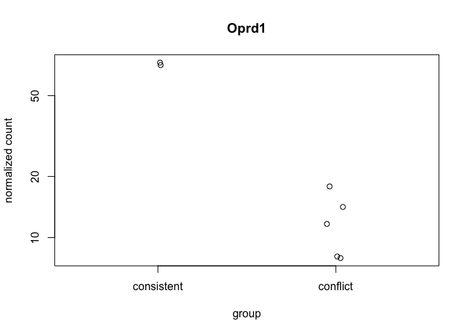

The figures made from this script were compiled in Adobe.

    library(ggplot2) ## for awesome plots!
    library(cowplot) ## for some easy to use themes
    library(dplyr) ## for filtering and selecting rows
    library(car) ## stats
    library(VennDiagram) ## venn diagrams
    library(pheatmap) ## awesome heatmaps
    library(viridis) # for awesome color pallette
    library(reshape2) ## for melting dataframe
    library(DESeq2) ## for gene expression analysis
    library(edgeR)  ## for basic read counts status
    library(magrittr) ## to use the weird pipe
    library(genefilter)  ## for PCA fuction
    library(ggrepel) ## for labeling volcano plot
    library(colorblindr) # simulates color-blind viewing 

    ## load functions 
    source("figureoptions.R")
    source("functions_RNAseq.R")

    ## set output file for figures 
    knitr::opts_chunk$set(fig.path = '../figures/02_RNAseq_ConsistentConflict/')

Design
------

The major comparision here is Hippocampal subfield: "DG","CA3", "CA1"
Behavioral Groups: "conflict", "consistent"

    ##          APA2    Punch  
    ##  conflict  :14   CA1:8  
    ##  consistent: 9   CA3:7  
    ##                  DG :8

    ## class: DESeqDataSet 
    ## dim: 22485 23 
    ## metadata(1): version
    ## assays(1): counts
    ## rownames(22485): 0610007P14Rik 0610009B22Rik ... Zzef1 Zzz3
    ## rowData names(0):
    ## colnames(23): 143A-CA3-1 143A-DG-1 ... 148A-CA3-3 148A-DG-3
    ## colData names(8): RNAseqID Mouse ... APA APA2

    ## class: DESeqDataSet 
    ## dim: 17257 23 
    ## metadata(1): version
    ## assays(1): counts
    ## rownames(17257): 0610007P14Rik 0610009B22Rik ... Zzef1 Zzz3
    ## rowData names(0):
    ## colnames(23): 143A-CA3-1 143A-DG-1 ... 148A-CA3-3 148A-DG-3
    ## colData names(8): RNAseqID Mouse ... APA APA2

    ## estimating size factors

    ## estimating dispersions

    ## gene-wise dispersion estimates

    ## mean-dispersion relationship

    ## final dispersion estimates

    ## fitting model and testing

Principle component analysis
----------------------------

    ## [1] 58 23  4  2  2  1  1  1  1

    ##             Df Sum Sq Mean Sq F value Pr(>F)    
    ## Punch        2   8841    4421   688.5 <2e-16 ***
    ## Residuals   20    128       6                   
    ## ---
    ## Signif. codes:  0 '***' 0.001 '**' 0.01 '*' 0.05 '.' 0.1 ' ' 1

    ##   Tukey multiple comparisons of means
    ##     95% family-wise confidence level
    ## 
    ## Fit: aov(formula = PC1 ~ Punch, data = pcadata)
    ## 
    ## $Punch
    ##               diff        lwr        upr     p adj
    ## CA3-DG  -42.104318 -45.422124 -38.786512 0.0000000
    ## CA1-DG  -40.289140 -43.494445 -37.083835 0.0000000
    ## CA1-CA3   1.815179  -1.502627   5.132985 0.3677355

    ##             Df Sum Sq Mean Sq F value Pr(>F)    
    ## Punch        2   3435  1717.5   533.6 <2e-16 ***
    ## Residuals   20     64     3.2                   
    ## ---
    ## Signif. codes:  0 '***' 0.001 '**' 0.01 '*' 0.05 '.' 0.1 ' ' 1

    ##   Tukey multiple comparisons of means
    ##     95% family-wise confidence level
    ## 
    ## Fit: aov(formula = PC2 ~ Punch, data = pcadata)
    ## 
    ## $Punch
    ##              diff       lwr       upr p adj
    ## CA3-DG  -15.12552 -17.47467 -12.77637     0
    ## CA1-DG   15.18229  12.91280  17.45179     0
    ## CA1-CA3  30.30781  27.95866  32.65696     0

    ##             Df Sum Sq Mean Sq F value Pr(>F)
    ## APA2         1   25.5   25.47   1.025  0.323
    ## Residuals   21  522.0   24.86

    ##             Df Sum Sq Mean Sq F value Pr(>F)
    ## APA2         1   18.9   18.93   1.225  0.281
    ## Residuals   21  324.4   15.45

    ##             Df Sum Sq Mean Sq F value Pr(>F)  
    ## APA2         1   36.5   36.50   3.301 0.0835 .
    ## Residuals   21  232.2   11.06                 
    ## ---
    ## Signif. codes:  0 '***' 0.001 '**' 0.01 '*' 0.05 '.' 0.1 ' ' 1

    ##             Df Sum Sq Mean Sq F value Pr(>F)  
    ## APA2         1  49.69   49.69   5.877 0.0245 *
    ## Residuals   21 177.55    8.45                 
    ## ---
    ## Signif. codes:  0 '***' 0.001 '**' 0.01 '*' 0.05 '.' 0.1 ' ' 1

    ## quartz_off_screen 
    ##                 2

    ## quartz_off_screen 
    ##                 2

Number of differentially expressed genes per two-way contrast
=============================================================

    #calculate significance of all two way comparisions
    # see source "functions_RNAseq.R" 

    contrast1 <- resvals(contrastvector = c("Punch", "CA1", "DG"), mypval = 0.05) # 2685

    ## [1] 1782

    contrast2 <- resvals(contrastvector = c("Punch", "CA1", "CA3"), mypval = 0.05) # 1411

    ## [1] 1234

    contrast3 <- resvals(contrastvector = c("Punch", "CA3", "DG"), mypval = 0.05) # 3902

    ## [1] 2336

    contrast4 <- resvals(contrastvector = c("APA2", "consistent", "conflict"), mypval = 0.05) # 0

    ## [1] 0

venn diagrams
-------------

heatmap
-------

Volcanos plots and and gene lists
---------------------------------

DG
--

    ##          APA2   Punch 
    ##  conflict  :5   DG:8  
    ##  consistent:3

    ## class: DESeqDataSet 
    ## dim: 22485 8 
    ## metadata(1): version
    ## assays(1): counts
    ## rownames(22485): 0610007P14Rik 0610009B22Rik ... Zzef1 Zzz3
    ## rowData names(0):
    ## colnames(8): 143A-DG-1 144A-DG-2 ... 147C-DG-3 148A-DG-3
    ## colData names(8): RNAseqID Mouse ... APA APA2

    ## class: DESeqDataSet 
    ## dim: 16133 8 
    ## metadata(1): version
    ## assays(1): counts
    ## rownames(16133): 0610007P14Rik 0610009B22Rik ... Zzef1 Zzz3
    ## rowData names(0):
    ## colnames(8): 143A-DG-1 144A-DG-2 ... 147C-DG-3 148A-DG-3
    ## colData names(8): RNAseqID Mouse ... APA APA2

    ## log2 fold change (MAP): APA2 conflict vs consistent 
    ## Wald test p-value: APA2 conflict vs consistent 
    ## DataFrame with 10 rows and 6 columns
    ##                baseMean log2FoldChange     lfcSE       stat    pvalue
    ##               <numeric>      <numeric> <numeric>  <numeric> <numeric>
    ## 0610007P14Rik 27.967837    -0.02269172 0.2136569 -0.1062063 0.9154186
    ## 0610009B22Rik  7.614485    -0.21515049 0.1943445 -1.1070574 0.2682691
    ## 0610009L18Rik  3.658462     0.06034392 0.1348444  0.4475079 0.6545084
    ## 0610009O20Rik 76.463727     0.17006891 0.2022495  0.8408865 0.4004115
    ## 0610010F05Rik 11.501320    -0.11568480 0.2110760 -0.5480718 0.5836426
    ## 0610010K14Rik  1.871851     0.08615418 0.1327526  0.6489828 0.5163495
    ## 0610012G03Rik 60.137893     0.08823199 0.2081211  0.4239454 0.6716056
    ## 0610030E20Rik 64.781123    -0.02713297 0.2078326 -0.1305520 0.8961297
    ## 0610037L13Rik 10.287583     0.03465826 0.2064417  0.1678840 0.8666746
    ## 0610040J01Rik  1.086355    -0.05136301 0.1004946 -0.5111023 0.6092794
    ##                    padj
    ##               <numeric>
    ## 0610007P14Rik 0.9998438
    ## 0610009B22Rik 0.9998438
    ## 0610009L18Rik 0.9998438
    ## 0610009O20Rik 0.9998438
    ## 0610010F05Rik 0.9998438
    ## 0610010K14Rik 0.9998438
    ## 0610012G03Rik 0.9998438
    ## 0610030E20Rik 0.9998438
    ## 0610037L13Rik 0.9998438
    ## 0610040J01Rik 0.9998438

    ## 
    ## out of 16133 with nonzero total read count
    ## adjusted p-value < 0.05
    ## LFC > 0 (up)     : 0, 0% 
    ## LFC < 0 (down)   : 0, 0% 
    ## outliers [1]     : 93, 0.58% 
    ## low counts [2]   : 0, 0% 
    ## (mean count < 0)
    ## [1] see 'cooksCutoff' argument of ?results
    ## [2] see 'independentFiltering' argument of ?results

    ## quartz_off_screen 
    ##                 2

CA3
---

    ##          APA2   Punch  
    ##  conflict  :5   CA3:7  
    ##  consistent:2

    ## class: DESeqDataSet 
    ## dim: 22485 7 
    ## metadata(1): version
    ## assays(1): counts
    ## rownames(22485): 0610007P14Rik 0610009B22Rik ... Zzef1 Zzz3
    ## rowData names(0):
    ## colnames(7): 143A-CA3-1 144A-CA3-2 ... 147C-CA3-3 148A-CA3-3
    ## colData names(8): RNAseqID Mouse ... APA APA2

    ## class: DESeqDataSet 
    ## dim: 15421 7 
    ## metadata(1): version
    ## assays(1): counts
    ## rownames(15421): 0610007P14Rik 0610009B22Rik ... Zzef1 Zzz3
    ## rowData names(0):
    ## colnames(7): 143A-CA3-1 144A-CA3-2 ... 147C-CA3-3 148A-CA3-3
    ## colData names(8): RNAseqID Mouse ... APA APA2

    ## log2 fold change (MAP): APA2 conflict vs consistent 
    ## Wald test p-value: APA2 conflict vs consistent 
    ## DataFrame with 10 rows and 6 columns
    ##                baseMean log2FoldChange     lfcSE       stat       pvalue
    ##               <numeric>      <numeric> <numeric>  <numeric>    <numeric>
    ## Oprd1         28.514510    -1.74828369 0.3453201 -5.0627909 4.131630e-07
    ## 0610007P14Rik 20.869244     0.05395975 0.3544916  0.1522173 8.790156e-01
    ## 0610009B22Rik  8.855972    -0.09887726 0.3505683 -0.2820485 7.779063e-01
    ## 0610009L18Rik  5.355481     0.12286109 0.3260208  0.3768504 7.062848e-01
    ## 0610009O20Rik 53.476422    -0.09038444 0.3132407 -0.2885463 7.729286e-01
    ## 0610010F05Rik  8.045719    -0.17277723 0.3635857 -0.4752036 6.346419e-01
    ## 0610010K14Rik  1.356560     0.07090712 0.2542430  0.2788951 7.803254e-01
    ## 0610012G03Rik 56.394722     0.02908556 0.3438997  0.0845757 9.325987e-01
    ## 0610030E20Rik 24.467351    -0.17403542 0.3644957 -0.4774691 6.330281e-01
    ## 0610037L13Rik  6.058712     0.22815861 0.3574536  0.6382888 5.232857e-01
    ##                      padj
    ##                 <numeric>
    ## Oprd1         0.006365602
    ## 0610007P14Rik 0.999929734
    ## 0610009B22Rik 0.999929734
    ## 0610009L18Rik 0.999929734
    ## 0610009O20Rik 0.999929734
    ## 0610010F05Rik 0.999929734
    ## 0610010K14Rik 0.999929734
    ## 0610012G03Rik 0.999929734
    ## 0610030E20Rik 0.999929734
    ## 0610037L13Rik 0.999929734

    ## 
    ## out of 15421 with nonzero total read count
    ## adjusted p-value < 0.05
    ## LFC > 0 (up)     : 0, 0% 
    ## LFC < 0 (down)   : 1, 0.0065% 
    ## outliers [1]     : 14, 0.091% 
    ## low counts [2]   : 0, 0% 
    ## (mean count < 0)
    ## [1] see 'cooksCutoff' argument of ?results
    ## [2] see 'independentFiltering' argument of ?results

    ## quartz_off_screen 
    ##                 2

CA1
---

    ##          APA2   Punch  
    ##  conflict  :4   CA1:8  
    ##  consistent:4

    ## class: DESeqDataSet 
    ## dim: 16142 8 
    ## metadata(1): version
    ## assays(1): counts
    ## rownames(16142): 0610007P14Rik 0610009B22Rik ... Zzef1 Zzz3
    ## rowData names(0):
    ## colnames(8): 143C-CA1-1 144A-CA1-2 ... 147C-CA1-3 148A-CA1-3
    ## colData names(8): RNAseqID Mouse ... APA APA2

    ## log2 fold change (MAP): APA2 conflict vs consistent 
    ## Wald test p-value: APA2 conflict vs consistent 
    ## DataFrame with 10 rows and 6 columns
    ##          baseMean log2FoldChange     lfcSE      stat       pvalue
    ##         <numeric>      <numeric> <numeric> <numeric>    <numeric>
    ## Rpl36    148.9849      0.9321659 0.1746501  5.337335 9.432268e-08
    ## Csmd2    239.8467     -0.7928256 0.1691611 -4.686808 2.774990e-06
    ## Fat3     373.0662     -0.6368694 0.1399646 -4.550216 5.359083e-06
    ## mt-Nd3  1214.3216      0.6457575 0.1435283  4.499165 6.822083e-06
    ## Tpt1     315.3209      0.4770503 0.1084070  4.400549 1.079772e-05
    ## Rps29    350.9379      0.7673600 0.1767514  4.341466 1.415355e-05
    ## Cck     1249.3940      0.6774858 0.1576187  4.298259 1.721451e-05
    ## Atp6v0c  396.5764      0.5354923 0.1400731  3.822949 1.318650e-04
    ## Atxn10   654.6857      0.4104164 0.1089034  3.768628 1.641470e-04
    ## Bsn      649.7009     -0.6811455 0.1705259 -3.994381 6.486354e-05
    ##                 padj
    ##            <numeric>
    ## Rpl36   0.0001940218
    ## Csmd2   0.0028540767
    ## Fat3    0.0035082560
    ## mt-Nd3  0.0035082560
    ## Tpt1    0.0044421834
    ## Rps29   0.0048523081
    ## Cck     0.0050586059
    ## Atp6v0c 0.0134112628
    ## Atxn10  0.0134112628
    ## Bsn     0.0134112628

    ## 
    ## out of 16142 with nonzero total read count
    ## adjusted p-value < 0.05
    ## LFC > 0 (up)     : 51, 0.32% 
    ## LFC < 0 (down)   : 30, 0.19% 
    ## outliers [1]     : 128, 0.79% 
    ## low counts [2]   : 13957, 86% 
    ## (mean count < 137)
    ## [1] see 'cooksCutoff' argument of ?results
    ## [2] see 'independentFiltering' argument of ?results

    ## quartz_off_screen 
    ##                 2
