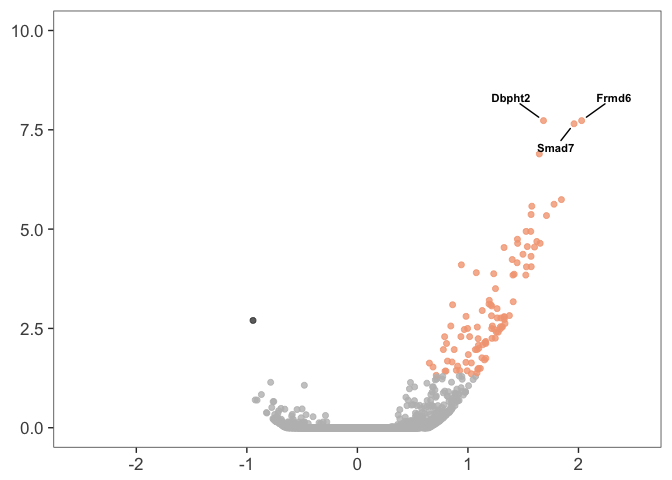

    library(dplyr) ## for filtering and selecting rows
    library(plyr) ## for renmaing factors
    library(reshape2) ## for melting dataframe
    library(DESeq2) ## for gene expression analysis
    library(edgeR)  ## for basic read counts status
    library(magrittr) ## to use the weird pipe
    library(genefilter)  ## for PCA fuction
    library(ggplot2) ## for awesome plots!
    library(pheatmap) ## awesome heatmaps
    library(VennDiagram)
    library(cowplot) # for fancy ggplot addons

    ## Functions
    source("functions_RNAseq.R")
    source("resvalsfunction.R")
    source("figureoptions.R")

    ## set output file for figures 
    knitr::opts_chunk$set(fig.path = '../figures/02_RNAseq/')

RNSeq data wranging and statistical analyses

    countData <- read.csv("../data/02a_countData.csv", header = T, check.names = F, row.names = 1)
    colData <- read.csv("../data/02a_colData.csv", header = T)
    colData$APA <- factor(colData$APA, levels=c("Control", "Consistent", "Conflict"))

    colData <- colData %>% 
      filter(Punch == "DG") 
    savecols <- as.character(colData$RNAseqID) 
    savecols <- as.vector(savecols) 
    countData <- countData %>% dplyr::select(one_of(savecols)) 

    dds <- DESeqDataSetFromMatrix(countData = countData,
                                  colData = colData,
                                  design = ~ APA )
    dds$APA <- factor(dds$APA, levels=c("Control", "Consistent", "Conflict"))
    dds <- dds[ rowSums(counts(dds)) > 1, ] 
    dds # dim: 16658 16  

    ## class: DESeqDataSet 
    ## dim: 16658 16 
    ## metadata(1): version
    ## assays(1): counts
    ## rownames(16658): 0610007P14Rik 0610009B22Rik ... Zzef1 Zzz3
    ## rowData names(0):
    ## colnames(16): 143A-DG-1 143B-DG-1 ... 148A-DG-3 148B-DG-4
    ## colData names(7): RNAseqID Mouse ... APA ID

    dds <- DESeq(dds)

    ## estimating size factors

    ## estimating dispersions

    ## gene-wise dispersion estimates

    ## mean-dispersion relationship

    ## final dispersion estimates

    ## fitting model and testing

    ## -- replacing outliers and refitting for 217 genes
    ## -- DESeq argument 'minReplicatesForReplace' = 7 
    ## -- original counts are preserved in counts(dds)

    ## estimating dispersions

    ## fitting model and testing

    rld <- rlog(dds, blind=FALSE)

    contrast4 <- resvals(contrastvector = c("APA", "Consistent", "Control"), mypval = 0.05) #101 or 105 106

    ## [1] 101

    contrast5 <- resvals(contrastvector = c("APA", "Conflict", "Control"), mypval = 0.05) #39 # or 34 or 49

    ## [1] 39

    contrast6 <- resvals(contrastvector = c("APA", "Conflict", "Consistent"), mypval = 0.05) # 0 

    ## [1] 0

DG Consistent versus Control

    res <- results(dds, contrast =c("APA", "Consistent", "Control"), independentFiltering = F)
    resOrdered <- res[order(res$padj),]
    head(resOrdered)

    ## log2 fold change (MAP): APA Consistent vs Control 
    ## Wald test p-value: APA Consistent vs Control 
    ## DataFrame with 6 rows and 6 columns
    ##         baseMean log2FoldChange     lfcSE      stat       pvalue
    ##        <numeric>      <numeric> <numeric> <numeric>    <numeric>
    ## Dbpht2 181.53137       1.683569 0.2398804  7.018368 2.244744e-12
    ## Frmd6  198.12270       2.028448 0.2851703  7.113109 1.134573e-12
    ## Smad7   43.60596       1.959971 0.2825822  6.935932 4.035513e-12
    ## Nptx2  290.83992       1.645930 0.2478177  6.641696 3.100944e-11
    ## Fzd5    13.76731       1.845721 0.2974478  6.205192 5.463003e-10
    ## Fbxo33 136.27874       1.778941 0.2900217  6.133819 8.579438e-10
    ##                padj
    ##           <numeric>
    ## Dbpht2 1.856178e-08
    ## Frmd6  1.856178e-08
    ## Smad7  2.224644e-08
    ## Nptx2  1.282085e-07
    ## Fzd5   1.806943e-06
    ## Fbxo33 2.364779e-06

    data <- data.frame(gene = row.names(res),
                       pvalue = -log10(res$padj), 
                       lfc = res$log2FoldChange)
    data <- na.omit(data)
    head(data)

    ##            gene pvalue         lfc
    ## 1 0610007P14Rik      0 -0.03291479
    ## 2 0610009B22Rik      0  0.33035450
    ## 3 0610009L18Rik      0 -0.19518724
    ## 4 0610009O20Rik      0  0.07372248
    ## 5 0610010F05Rik      0  0.13789974
    ## 6 0610010K14Rik      0 -0.30478554

    data <- data %>%
      mutate(color = ifelse(data$lfc > 0 & data$pvalue > 1.3, 
                            yes = "Consistent", 
                            no = ifelse(data$lfc < 0 & data$pvalue > 1.3, 
                                        yes = "Control", 
                                        no = "none")))

    # Color corresponds to fold change directionality
    colored <- ggplot(data, aes(x = lfc, y = pvalue)) + 
      geom_point(aes(color = factor(color)), size = 1.75, alpha = 0.8, na.rm = T) + # add gene points
      theme_bw(base_size = 16) + # clean up theme
      theme(legend.position = "none") + # remove legend 
      ggtitle(label = "Volcano Plot", subtitle = "Colored by directionality") +  # add title
      xlab(expression(log[2]("Consistent" / "Control"))) + # x-axis label
      ylab(expression(-log[10]("adjusted p-value"))) + # y-axis label
      geom_vline(xintercept = 0, colour = "black") + # add line at 0
      geom_hline(yintercept = 1.3, colour = "black") + # p(0.05) = 1.3
      xlim(c(-2.5, 2.5)) +  
      ylim(c(0, 10)) +  
      scale_color_manual(values = c("Consistent" = "#f4a582",
                                    "Control" = "#404040", 
                                    "none" = "#bdbdbd")) # change colors

    colored

    pdf(file="../figures/02_RNAseq/DGConsistentControl.pdf", width=3, height=3)
    plot(colored)
    dev.off()

    ## quartz_off_screen 
    ##                 2

DG Conflict vs. Control

    res <- results(dds, contrast =c("APA", "Conflict", "Control"), independentFiltering = F)
    resOrdered <- res[order(res$padj),]
    head(resOrdered)

    ## log2 fold change (MAP): APA Conflict vs Control 
    ## Wald test p-value: APA Conflict vs Control 
    ## DataFrame with 6 rows and 6 columns
    ##          baseMean log2FoldChange     lfcSE      stat       pvalue
    ##         <numeric>      <numeric> <numeric> <numeric>    <numeric>
    ## Smad7    43.60596       1.577382 0.2674566  5.897714 3.685717e-09
    ## Slc16a1  52.06814       1.462991 0.2556169  5.723373 1.044295e-08
    ## Acan     24.88123       1.426065 0.2579754  5.527911 3.240663e-08
    ## Fzd5     13.76731       1.514113 0.2920253  5.184868 2.161674e-07
    ## Frmd6   198.12270       1.396548 0.2716736  5.140537 2.739540e-07
    ## Ptgs2   108.75785       1.400222 0.2770016  5.054925 4.305609e-07
    ##                 padj
    ##            <numeric>
    ## Smad7   6.095439e-05
    ## Slc16a1 8.635273e-05
    ## Acan    1.786469e-04
    ## Fzd5    8.937443e-04
    ## Frmd6   9.061303e-04
    ## Ptgs2   1.186769e-03

    # more complicated but beautiful ggplot from https://twbattaglia.github.io/2016/12/17/volcano-plot/
    # Add gene names Add the -log10 pvalue Add the pre-calculated log2 fold change
    data <- data.frame(gene = row.names(res),
                       pvalue = -log10(res$padj), 
                       lfc = res$log2FoldChange)
    data <- na.omit(data)
    head(data)

    ##            gene pvalue         lfc
    ## 1 0610007P14Rik      0 -0.08607642
    ## 2 0610009B22Rik      0  0.06203906
    ## 3 0610009L18Rik      0 -0.12910088
    ## 4 0610009O20Rik      0  0.26619780
    ## 5 0610010F05Rik      0 -0.03799577
    ## 6 0610010K14Rik      0 -0.17209938

    # Modify dataset to add new coloumn of colors
    data <- data %>%
      mutate(color = ifelse(data$lfc > 0 & data$pvalue > 1.3, 
                            yes = "Conflict", 
                            no = ifelse(data$lfc < 0 & data$pvalue > 1.3, 
                                        yes = "Control", 
                                        no = "none")))

    # Color corresponds to fold change directionality
    colored <- ggplot(data, aes(x = lfc, y = pvalue)) + 
      geom_point(aes(color = factor(color)), size = 1.75, alpha = 0.8, na.rm = T) + # add gene points
      theme_bw(base_size = 16) + # clean up theme
      theme(legend.position = "none") + # remove legend 
      ggtitle(label = "Volcano Plot", subtitle = "Colored by directionality") +  # add title
      xlab(expression(log[2]("Conflict" / "Control"))) + # x-axis label
      ylab(expression(-log[10]("adjusted p-value"))) + # y-axis label
      geom_vline(xintercept = 0, colour = "black") + # add line at 0
      geom_hline(yintercept = 1.3, colour = "black") + # p(0.05) = 1.3
      xlim(c(-2.5, 2.5)) +  
      ylim(c(0, 10)) +    
      scale_color_manual(values = c("Conflict" = "#ca0020", 
                                    "Control" = "#404040", 
                                    "none" = "#bdbdbd")) # change colors

    colored

    pdf(file="../figures/02_RNAseq/DGConflictControl.pdf", width=3, height=3)
    plot(colored)
    dev.off()

    ## quartz_off_screen 
    ##                 2

    res <- results(dds, contrast =c("APA", "Conflict", "Consistent"), independentFiltering = F)
    resOrdered <- res[order(res$padj),]
    head(resOrdered)

    ## log2 fold change (MAP): APA Conflict vs Consistent 
    ## Wald test p-value: APA Conflict vs Consistent 
    ## DataFrame with 6 rows and 6 columns
    ##                baseMean log2FoldChange     lfcSE       stat    pvalue
    ##               <numeric>      <numeric> <numeric>  <numeric> <numeric>
    ## 0610007P14Rik 19.985725    -0.05316163 0.2729119 -0.1947941 0.8455541
    ## 0610009B22Rik  3.905466    -0.26831543 0.2860755 -0.9379182 0.3482864
    ## 0610009L18Rik  2.662007     0.06608636 0.2351167  0.2810790 0.7786498
    ## 0610009O20Rik 48.633267     0.19247532 0.2253767  0.8540160 0.3930961
    ## 0610010F05Rik  7.709806    -0.17589551 0.2913225 -0.6037829 0.5459880
    ## 0610010K14Rik  2.232061     0.13268616 0.2603819  0.5095829 0.6103437
    ##                    padj
    ##               <numeric>
    ## 0610007P14Rik         1
    ## 0610009B22Rik         1
    ## 0610009L18Rik         1
    ## 0610009O20Rik         1
    ## 0610010F05Rik         1
    ## 0610010K14Rik         1

    data <- data.frame(gene = row.names(res),
                       pvalue = -log10(res$padj), 
                       lfc = res$log2FoldChange)
    data <- na.omit(data)
    head(data)

    ##            gene pvalue         lfc
    ## 1 0610007P14Rik      0 -0.05316163
    ## 2 0610009B22Rik      0 -0.26831543
    ## 3 0610009L18Rik      0  0.06608636
    ## 4 0610009O20Rik      0  0.19247532
    ## 5 0610010F05Rik      0 -0.17589551
    ## 6 0610010K14Rik      0  0.13268616

    data <- data %>%
      mutate(color = ifelse(data$lfc > 0 & data$pvalue > 1.3, 
                            yes = "Conflict", 
                            no = ifelse(data$lfc < 0 & data$pvalue > 1.3, 
                                        yes = "Consistent", 
                                        no = "none")))

    # Color corresponds to fold change directionality
    colored <- ggplot(data, aes(x = lfc, y = pvalue)) + 
      geom_point(aes(color = factor(color)), size = 1.75, alpha = 0.8, na.rm = T) + # add gene points
      theme_bw(base_size = 16) + # clean up theme
      theme(legend.position = "none") + # remove legend 
      ggtitle(label = "Volcano Plot", subtitle = "Colored by directionality") +  # add title
      xlab(expression(log[2]("Conflict" / "Consistent"))) + # x-axis label
      ylab(expression(-log[10]("adjusted p-value"))) + # y-axis label
      geom_vline(xintercept = 0, colour = "black") + # add line at 0
      geom_hline(yintercept = 1.3, colour = "black") + # p(0.05) = 1.3
      xlim(c(-2.5, 2.5)) +  
      ylim(c(0, 10)) +  
      scale_color_manual(values = c("Conflict" = "#ca0020", 
                                    "Consistent" = "#f4a582", 
                                    "none" = "#bdbdbd")) # change colors

    colored

    pdf(file="../figures/02_RNAseq/DGConflictConsistent.pdf", width=3, height=3)
    plot(colored)
    dev.off()

    ## quartz_off_screen 
    ##                 2

    pcadata <- pcadataframe(rld, intgroup=c("Punch","APA"), returnData=TRUE)
    percentVar <- round(100 * attr(pcadata, "percentVar"))
    percentVar

    ## [1] 31 20 11  6  6  5  4  3  3

    pcadata <- pcadataframe(rld, intgroup=c("Punch","APA"), returnData=TRUE)
    percentVar <- round(100 * attr(pcadata, "percentVar"))
    aov1 <- aov(PC1 ~ APA, data=pcadata)
    summary(aov1) 

    ##             Df Sum Sq Mean Sq F value  Pr(>F)   
    ## APA          2  891.8   445.9   7.525 0.00675 **
    ## Residuals   13  770.3    59.3                   
    ## ---
    ## Signif. codes:  0 '***' 0.001 '**' 0.01 '*' 0.05 '.' 0.1 ' ' 1

    TukeyHSD(aov1, which = "APA")

    ##   Tukey multiple comparisons of means
    ##     95% family-wise confidence level
    ## 
    ## Fit: aov(formula = PC1 ~ APA, data = pcadata)
    ## 
    ## $APA
    ##                           diff       lwr       upr     p adj
    ## Consistent-Control  -16.911835 -30.67185 -3.151817 0.0163925
    ## Conflict-Control    -13.437796 -25.02477 -1.850824 0.0230507
    ## Conflict-Consistent   3.474039 -11.36916 18.317242 0.8129880

    pcadata$Punch <- factor(pcadata$APA, levels=c("Control", "Consistent", "Conflict"))
    plotPCs(pcadata, 1, 2, aescolor = pcadata$APA, colorname = "APA", aesshape = pcadata$APA, shapename = "APA",  colorvalues = colorvalAPA)

    ## Don't know how to automatically pick scale for object of type data.frame. Defaulting to continuous.
    ## Don't know how to automatically pick scale for object of type data.frame. Defaulting to continuous.

