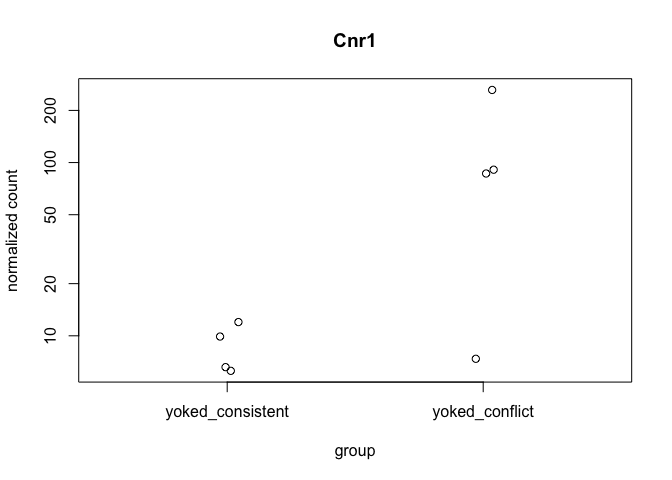

The figures made from this script were compiled in Adobe.

    library(ggplot2) ## for awesome plots!
    library(cowplot) ## for some easy to use themes
    library(dplyr) ## for filtering and selecting rows
    library(car) ## stats
    library(VennDiagram) ## venn diagrams
    library(pheatmap) ## awesome heatmaps
    library(viridis) # for awesome color pallette
    library(reshape2) ## for melting dataframe
    library(DESeq2) ## for gene expression analysis
    library(edgeR)  ## for basic read counts status
    library(magrittr) ## to use the weird pipe
    library(genefilter)  ## for PCA fuction
    library(ggrepel) ## for labeling volcano plot
    library(colorblindr) # simulates color-blind viewing 

    ## load functions 
    source("figureoptions.R")
    source("functions_RNAseq.R")

    ## set output file for figures 
    knitr::opts_chunk$set(fig.path = '../figures/02_RNAseq_YokedYoked/')

Design
------

The major comparision here is Hippocampal subfield: "DG","CA3", "CA1"
Behavioral Groups: "yoked\_consistent", "yoked\_conflict"

    ##                APA2    Punch  
    ##  yoked_conflict  :12   CA1:7  
    ##  yoked_consistent: 9   CA3:6  
    ##                        DG :8

    ## class: DESeqDataSet 
    ## dim: 16716 21 
    ## metadata(1): version
    ## assays(1): counts
    ## rownames(16716): 0610007P14Rik 0610009B22Rik ... Zzef1 Zzz3
    ## rowData names(0):
    ## colnames(21): 143B-CA1-1 143B-DG-1 ... 148B-CA3-4 148B-DG-4
    ## colData names(8): RNAseqID Mouse ... APA APA2

    ## estimating size factors

    ## estimating dispersions

    ## gene-wise dispersion estimates

    ## mean-dispersion relationship

    ## final dispersion estimates

    ## fitting model and testing

Principle component analysis
----------------------------

    # create the dataframe using my function pcadataframe
    pcadata <- pcadataframe(rld, intgroup=c("Punch","APA2"), returnData=TRUE)
    percentVar <- round(100 * attr(pcadata, "percentVar"))
    percentVar

    ## [1] 41 21  9  4  3  3  3  2  2

    aov1 <- aov(PC1 ~ Punch, data=pcadata)
    summary(aov1) 

    ##             Df Sum Sq Mean Sq F value   Pr(>F)    
    ## Punch        2   7919    3960   72.55 2.43e-09 ***
    ## Residuals   18    982      55                     
    ## ---
    ## Signif. codes:  0 '***' 0.001 '**' 0.01 '*' 0.05 '.' 0.1 ' ' 1

    TukeyHSD(aov1, which = "Punch") 

    ##   Tukey multiple comparisons of means
    ##     95% family-wise confidence level
    ## 
    ## Fit: aov(formula = PC1 ~ Punch, data = pcadata)
    ## 
    ## $Punch
    ##                diff       lwr       upr     p adj
    ## CA3-DG  -39.8703270 -50.05315 -29.68751 0.0000000
    ## CA1-DG  -40.0881217 -49.84647 -30.32977 0.0000000
    ## CA1-CA3  -0.2177948 -10.70770  10.27211 0.9984533

    aov2 <- aov(PC2 ~ Punch, data=pcadata)
    summary(aov2) 

    ##             Df Sum Sq Mean Sq F value Pr(>F)    
    ## Punch        2   4463  2231.3   524.9 <2e-16 ***
    ## Residuals   18     77     4.3                   
    ## ---
    ## Signif. codes:  0 '***' 0.001 '**' 0.01 '*' 0.05 '.' 0.1 ' ' 1

    TukeyHSD(aov2, which = "Punch") 

    ##   Tukey multiple comparisons of means
    ##     95% family-wise confidence level
    ## 
    ## Fit: aov(formula = PC2 ~ Punch, data = pcadata)
    ## 
    ## $Punch
    ##              diff       lwr       upr p adj
    ## CA3-DG   20.66527  17.82342  23.50712     0
    ## CA1-DG  -16.49108 -19.21447 -13.76769     0
    ## CA1-CA3 -37.15635 -40.08391 -34.22880     0

    aov3 <- aov(PC3 ~ APA2, data=pcadata)
    summary(aov3) 

    ##             Df Sum Sq Mean Sq F value Pr(>F)
    ## APA2         1      5    5.02   0.051  0.823
    ## Residuals   19   1861   97.96

    aov4 <- aov(PC4 ~ APA2, data=pcadata)
    summary(aov4) 

    ##             Df Sum Sq Mean Sq F value Pr(>F)  
    ## APA2         1  210.6  210.63   6.824 0.0171 *
    ## Residuals   19  586.5   30.87                 
    ## ---
    ## Signif. codes:  0 '***' 0.001 '**' 0.01 '*' 0.05 '.' 0.1 ' ' 1

    pcadata$Punch <- factor(pcadata$Punch, levels=c("DG","CA3", "CA1"))
    pcadata$APA2 <- factor(pcadata$APA2, levels=c("yoked_consistent", "yoked_conflict"))

    PCA12 <- plotPCs(pcadata, 1, 2, aescolor = pcadata$Punch, colorname = " ", aesshape = pcadata$APA, shapename = " ",  colorvalues = colorvalPunch)
    PCA12

    PCA42 <- plotPCs(pcadata, 4, 2, aescolor = pcadata$APA2, colorname = "APA2", aesshape = pcadata$Punch, shapename = "Punch",  colorvalues = colorvalAPA7)
    PCA42

    # pdf the same pca plots descripbed above of the above
    pdf(file="../figures/02_RNAseq_YokedYoked/PCA12.pdf", width=2.5, height=2.25)
    plot(PCA12)
    dev.off()

    ## quartz_off_screen 
    ##                 2

    pdf(file="../figures/02_RNAseq_YokedYoked/PCA42.pdf", width=2.5, height=2.25)
    plot(PCA42)
    dev.off()

    ## quartz_off_screen 
    ##                 2

Number of differentially expressed genes per two-way contrast
=============================================================

    #calculate significance of all two way comparisions
    # see source "functions_RNAseq.R" 

    contrast1 <- resvals(contrastvector = c("Punch", "CA1", "DG"), mypval = 0.05) # 797

    ## [1] 797

    contrast2 <- resvals(contrastvector = c("Punch", "CA1", "CA3"), mypval = 0.05) # 458

    ## [1] 458

    contrast3 <- resvals(contrastvector = c("Punch", "CA3", "DG"), mypval = 0.05) # 1436

    ## [1] 1436

    contrast4 <- resvals(contrastvector = c("APA2", "yoked_conflict", "yoked_consistent"), mypval = 0.05) # 6

    ## [1] 6

venn diagrams
-------------

    rldpadjs <- assay(rld)
    rldpadjs <- cbind(rldpadjs, contrast1, contrast2, contrast3, contrast4)
    rldpadjs <- as.data.frame(rldpadjs)
    rldpadjs <- rldpadjs[ , grepl( "padj" , names( rldpadjs ) ) ]

    venn1 <- row.names(rldpadjs[rldpadjs[1] <0.05 & !is.na(rldpadjs[1]),]) # CA1 DG
    venn2 <- row.names(rldpadjs[rldpadjs[2] <0.05 & !is.na(rldpadjs[2]),]) # CA1 CA3
    venn3 <- row.names(rldpadjs[rldpadjs[3] <0.05 & !is.na(rldpadjs[3]),]) # CA3 DG
    venn4 <- row.names(rldpadjs[rldpadjs[4] <0.05 & !is.na(rldpadjs[4]),]) 

heatmap
-------

Volcanos plots and and gene lists
---------------------------------

DG
--

    ##                APA2   Punch 
    ##  yoked_conflict  :4   DG:8  
    ##  yoked_consistent:4

    ## class: DESeqDataSet 
    ## dim: 22485 8 
    ## metadata(1): version
    ## assays(1): counts
    ## rownames(22485): 0610007P14Rik 0610009B22Rik ... Zzef1 Zzz3
    ## rowData names(0):
    ## colnames(8): 143B-DG-1 143D-DG-3 ... 147D-DG-1 148B-DG-4
    ## colData names(8): RNAseqID Mouse ... APA APA2

    ## class: DESeqDataSet 
    ## dim: 15735 8 
    ## metadata(1): version
    ## assays(1): counts
    ## rownames(15735): 0610007P14Rik 0610009B22Rik ... Zzef1 Zzz3
    ## rowData names(0):
    ## colnames(8): 143B-DG-1 143D-DG-3 ... 147D-DG-1 148B-DG-4
    ## colData names(8): RNAseqID Mouse ... APA APA2

    ## log2 fold change (MAP): APA2 yoked_conflict vs yoked_consistent 
    ## Wald test p-value: APA2 yoked_conflict vs yoked_consistent 
    ## DataFrame with 10 rows and 6 columns
    ##                baseMean log2FoldChange     lfcSE        stat       pvalue
    ##               <numeric>      <numeric> <numeric>   <numeric>    <numeric>
    ## Cnr1          59.752503    1.734827218 0.3528493  4.91662355 8.804964e-07
    ## Kcnc2         24.196277    1.441945888 0.3476831  4.14729929 3.364202e-05
    ## Gm2115        18.066991    1.390844621 0.3504965  3.96821273 7.241368e-05
    ## 0610007P14Rik 14.175793   -0.569257295 0.3507923 -1.62277590 1.046373e-01
    ## 0610009B22Rik  1.763288   -0.008577467 0.2648368 -0.03238774 9.741628e-01
    ## 0610009L18Rik  1.940594   -0.154615600 0.2674053 -0.57820693 5.631244e-01
    ## 0610009O20Rik 30.635044   -0.143783734 0.3094036 -0.46471249 6.421374e-01
    ## 0610010F05Rik  5.115026    0.050049574 0.3413071  0.14664090 8.834155e-01
    ## 0610010K14Rik  2.164094    0.085715197 0.2846360  0.30113972 7.633080e-01
    ## 0610012G03Rik 45.755256    0.545890612 0.3196365  1.70784801 8.766455e-02
    ##                    padj
    ##               <numeric>
    ## Cnr1          0.0137921
    ## Kcnc2         0.2634843
    ## Gm2115        0.3780960
    ## 0610007P14Rik 0.9999627
    ## 0610009B22Rik 0.9999627
    ## 0610009L18Rik 0.9999627
    ## 0610009O20Rik 0.9999627
    ## 0610010F05Rik 0.9999627
    ## 0610010K14Rik 0.9999627
    ## 0610012G03Rik 0.9999627

    ## 
    ## out of 15735 with nonzero total read count
    ## adjusted p-value < 0.05
    ## LFC > 0 (up)     : 1, 0.0064% 
    ## LFC < 0 (down)   : 0, 0% 
    ## outliers [1]     : 71, 0.45% 
    ## low counts [2]   : 0, 0% 
    ## (mean count < 0)
    ## [1] see 'cooksCutoff' argument of ?results
    ## [2] see 'independentFiltering' argument of ?results

    ## quartz_off_screen 
    ##                 2

CA3
---

    ##                APA2   Punch  
    ##  yoked_conflict  :3   CA3:6  
    ##  yoked_consistent:3

    ## class: DESeqDataSet 
    ## dim: 22485 6 
    ## metadata(1): version
    ## assays(1): counts
    ## rownames(22485): 0610007P14Rik 0610009B22Rik ... Zzef1 Zzz3
    ## rowData names(0):
    ## colnames(6): 144B-CA3-1 144D-CA3-2 ... 147D-CA3-1 148B-CA3-4
    ## colData names(8): RNAseqID Mouse ... APA APA2

    ## class: DESeqDataSet 
    ## dim: 15497 6 
    ## metadata(1): version
    ## assays(1): counts
    ## rownames(15497): 0610007P14Rik 0610009B22Rik ... Zzef1 Zzz3
    ## rowData names(0):
    ## colnames(6): 144B-CA3-1 144D-CA3-2 ... 147D-CA3-1 148B-CA3-4
    ## colData names(8): RNAseqID Mouse ... APA APA2

    ## log2 fold change (MAP): APA2 yoked_conflict vs yoked_consistent 
    ## Wald test p-value: APA2 yoked_conflict vs yoked_consistent 
    ## DataFrame with 10 rows and 6 columns
    ##            baseMean log2FoldChange     lfcSE      stat       pvalue
    ##           <numeric>      <numeric> <numeric> <numeric>    <numeric>
    ## Sco2       12.68721      1.3605395 0.2700867  5.037418 4.718546e-07
    ## Kif5a    4870.48859     -0.8684670 0.1799850 -4.825219 1.398493e-06
    ## Rapgef4   401.02837     -0.9594043 0.2331701 -4.114612 3.878320e-05
    ## Adgrf5     77.07304     -0.9737110 0.2561422 -3.801447 1.438536e-04
    ## Fads6      49.44114     -0.9713536 0.2637724 -3.682545 2.309175e-04
    ## mt-Nd5   6168.10763     -0.6964659 0.1875240 -3.714010 2.040010e-04
    ## Tbc1d16    29.99046     -1.0310211 0.2850829 -3.616566 2.985371e-04
    ## Ttbk1     351.00944     -0.7724351 0.2119654 -3.644157 2.682700e-04
    ## mt-Nd4  15055.81795     -0.6071691 0.1693297 -3.585721 3.361482e-04
    ## Efhd2     213.90623     -0.7183137 0.2022637 -3.551372 3.832279e-04
    ##               padj
    ##          <numeric>
    ## Sco2    0.00728921
    ## Kif5a   0.01080196
    ## Rapgef4 0.19970764
    ## Adgrf5  0.55556279
    ## Fads6   0.57647521
    ## mt-Nd5  0.57647521
    ## Tbc1d16 0.57647521
    ## Ttbk1   0.57647521
    ## mt-Nd4  0.57697965
    ## Efhd2   0.59201042

    ## 
    ## out of 15497 with nonzero total read count
    ## adjusted p-value < 0.05
    ## LFC > 0 (up)     : 1, 0.0065% 
    ## LFC < 0 (down)   : 1, 0.0065% 
    ## outliers [1]     : 49, 0.32% 
    ## low counts [2]   : 0, 0% 
    ## (mean count < 0)
    ## [1] see 'cooksCutoff' argument of ?results
    ## [2] see 'independentFiltering' argument of ?results

    ## quartz_off_screen 
    ##                 2

CA1
---

    ##                APA2   Punch  
    ##  yoked_conflict  :5   CA1:7  
    ##  yoked_consistent:2

    ## class: DESeqDataSet 
    ## dim: 22485 7 
    ## metadata(1): version
    ## assays(1): counts
    ## rownames(22485): 0610007P14Rik 0610009B22Rik ... Zzef1 Zzz3
    ## rowData names(0):
    ## colnames(7): 143B-CA1-1 143D-CA1-3 ... 146D-CA1-3 148B-CA1-4
    ## colData names(8): RNAseqID Mouse ... APA APA2

    ## class: DESeqDataSet 
    ## dim: 14667 7 
    ## metadata(1): version
    ## assays(1): counts
    ## rownames(14667): 0610007P14Rik 0610009B22Rik ... Zzef1 Zzz3
    ## rowData names(0):
    ## colnames(7): 143B-CA1-1 143D-CA1-3 ... 146D-CA1-3 148B-CA1-4
    ## colData names(8): RNAseqID Mouse ... APA APA2

    ## log2 fold change (MAP): APA2 yoked_conflict vs yoked_consistent 
    ## Wald test p-value: APA2 yoked_conflict vs yoked_consistent 
    ## DataFrame with 10 rows and 6 columns
    ##          baseMean log2FoldChange     lfcSE      stat       pvalue
    ##         <numeric>      <numeric> <numeric> <numeric>    <numeric>
    ## Gm6768   8.438137      -3.307263 0.5859346 -5.644424 1.657353e-08
    ## Srprb   27.455855       3.197207 0.5560026  5.750345 8.906142e-09
    ## Gm12184  6.273305      -2.991991 0.5836836 -5.126049 2.958857e-07
    ## Notch2  23.670426       2.742395 0.5507301  4.979563 6.372809e-07
    ## Adamts1 25.362297       2.312756 0.4770698  4.847836 1.248154e-06
    ## Pcdhb12 23.393865      -2.632166 0.5806742 -4.532949 5.816591e-06
    ## Gad2    67.309303       2.146483 0.4844276  4.430966 9.381171e-06
    ## Gm10146  4.739406      -2.484571 0.5712102 -4.349662 1.363477e-05
    ## Ercc6   37.568475       2.082984 0.4976750  4.185431 2.846260e-05
    ## Pnpla3  20.763939      -1.801926 0.4334091 -4.157565 3.216585e-05
    ##                 padj
    ##            <numeric>
    ## Gm6768  9.079807e-05
    ## Srprb   9.079807e-05
    ## Gm12184 1.080673e-03
    ## Notch2  1.745672e-03
    ## Adamts1 2.735205e-03
    ## Pcdhb12 1.062207e-02
    ## Gad2    1.468421e-02
    ## Gm10146 1.867453e-02
    ## Ercc6   2.937010e-02
    ## Pnpla3  2.937010e-02

    ## 
    ## out of 14667 with nonzero total read count
    ## adjusted p-value < 0.05
    ## LFC > 0 (up)     : 11, 0.075% 
    ## LFC < 0 (down)   : 6, 0.041% 
    ## outliers [1]     : 22, 0.15% 
    ## low counts [2]   : 3688, 25% 
    ## (mean count < 2)
    ## [1] see 'cooksCutoff' argument of ?results
    ## [2] see 'independentFiltering' argument of ?results

    ## quartz_off_screen 
    ##                 2
