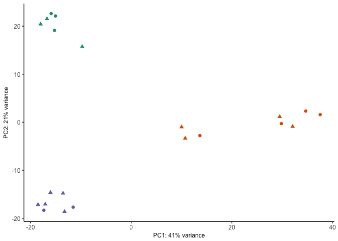
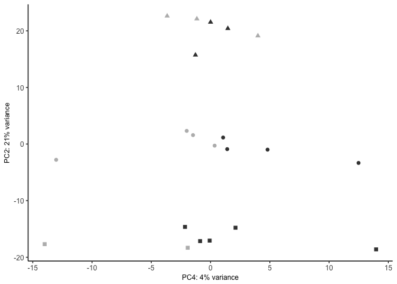

The figures made from this script were compiled in Adobe.

    library(ggplot2) ## for awesome plots!
    library(cowplot) ## for some easy to use themes
    library(dplyr) ## for filtering and selecting rows
    library(car) ## stats
    library(VennDiagram) ## venn diagrams
    library(pheatmap) ## awesome heatmaps
    library(viridis) # for awesome color pallette
    library(reshape2) ## for melting dataframe
    library(DESeq2) ## for gene expression analysis
    library(edgeR)  ## for basic read counts status
    library(magrittr) ## to use the weird pipe
    library(genefilter)  ## for PCA fuction
    library(ggrepel) ## for labeling volcano plot
    library(colorblindr) # simulates color-blind viewing 

    ## load functions 
    source("figureoptions.R")
    source("functions_RNAseq.R")

    ## set output file for figures 
    knitr::opts_chunk$set(fig.path = '../figures/02_RNAseq_YokedYoked/')

Design
------

The major comparision here is Hippocampal subfield: "DG","CA3", "CA1"
Behavioral Groups: "yoked\_conflict", "yoked\_consistent"

    colData <- read.csv("../data/02a_colData.csv", header = T)
    countData <- read.csv("../data/02a_countData.csv", header = T, check.names = F, row.names = 1)

    colData <- colData %>% 
      filter(APA2 %in% c("yoked_consistent", "yoked_conflict" ))  %>% 
      droplevels()

    savecols <- as.character(colData$RNAseqID) 
    savecols <- as.vector(savecols) 
    countData <- countData %>% dplyr::select(one_of(savecols)) 

    colData %>% select(APA2,Punch)  %>%  summary()

    ##                APA2    Punch  
    ##  yoked_conflict  :12   CA1:7  
    ##  yoked_consistent: 9   CA3:6  
    ##                        DG :8

    ## create DESeq object using the factors Punch and APA
    dds <- DESeqDataSetFromMatrix(countData = countData,
                                  colData = colData,
                                  design = ~ Punch + APA2 + Punch*APA2)

    dds$Punch <- factor(dds$Punch, levels=c("DG","CA3", "CA1")) ## specify the factor levels
    dds$APA2 <- factor(dds$APA2, levels=c("yoked_conflict", "yoked_consistent")) ## specify the factor levels

    dds # view the DESeq object - note numnber of genes

    ## class: DESeqDataSet 
    ## dim: 22485 21 
    ## metadata(1): version
    ## assays(1): counts
    ## rownames(22485): 0610007P14Rik 0610009B22Rik ... Zzef1 Zzz3
    ## rowData names(0):
    ## colnames(21): 143B-CA1-1 143B-DG-1 ... 148B-CA3-4 148B-DG-4
    ## colData names(8): RNAseqID Mouse ... APA APA2

    dds <- dds[ rowSums(counts(dds)) > 1, ]  # Pre-filtering genes with 0 counts
    dds # view number of genes afternormalization and the number of samples

    ## class: DESeqDataSet 
    ## dim: 16716 21 
    ## metadata(1): version
    ## assays(1): counts
    ## rownames(16716): 0610007P14Rik 0610009B22Rik ... Zzef1 Zzz3
    ## rowData names(0):
    ## colnames(21): 143B-CA1-1 143B-DG-1 ... 148B-CA3-4 148B-DG-4
    ## colData names(8): RNAseqID Mouse ... APA APA2

    dds <- DESeq(dds) # Differential expression analysis

    ## estimating size factors

    ## estimating dispersions

    ## gene-wise dispersion estimates

    ## mean-dispersion relationship

    ## final dispersion estimates

    ## fitting model and testing

    rld <- rlog(dds, blind=FALSE) ## log transformed data

Principle component analysis
----------------------------

    # create the dataframe using my function pcadataframe
    pcadata <- pcadataframe(rld, intgroup=c("Punch","APA2"), returnData=TRUE)
    percentVar <- round(100 * attr(pcadata, "percentVar"))
    percentVar

    ## [1] 41 21  9  4  3  3  3  2  2

    aov1 <- aov(PC1 ~ Punch, data=pcadata)
    summary(aov1) 

    ##             Df Sum Sq Mean Sq F value   Pr(>F)    
    ## Punch        2   7938    3969    72.7 2.39e-09 ***
    ## Residuals   18    983      55                     
    ## ---
    ## Signif. codes:  0 '***' 0.001 '**' 0.01 '*' 0.05 '.' 0.1 ' ' 1

    TukeyHSD(aov1, which = "Punch") 

    ##   Tukey multiple comparisons of means
    ##     95% family-wise confidence level
    ## 
    ## Fit: aov(formula = PC1 ~ Punch, data = pcadata)
    ## 
    ## $Punch
    ##               diff       lwr       upr     p adj
    ## CA3-DG  -39.936162 -50.12032 -29.75201 0.0000000
    ## CA1-DG  -40.121066 -49.88070 -30.36144 0.0000000
    ## CA1-CA3  -0.184904 -10.67619  10.30638 0.9988852

    aov2 <- aov(PC2 ~ Punch, data=pcadata)
    summary(aov2) 

    ##             Df Sum Sq Mean Sq F value Pr(>F)    
    ## Punch        2   4460  2229.8   530.8 <2e-16 ***
    ## Residuals   18     76     4.2                   
    ## ---
    ## Signif. codes:  0 '***' 0.001 '**' 0.01 '*' 0.05 '.' 0.1 ' ' 1

    TukeyHSD(aov2, which = "Punch") 

    ##   Tukey multiple comparisons of means
    ##     95% family-wise confidence level
    ## 
    ## Fit: aov(formula = PC2 ~ Punch, data = pcadata)
    ## 
    ## $Punch
    ##              diff       lwr       upr p adj
    ## CA3-DG   20.63579  17.81081  23.46077     0
    ## CA1-DG  -16.50866 -19.21588 -13.80144     0
    ## CA1-CA3 -37.14445 -40.05463 -34.23427     0

    aov3 <- aov(PC3 ~ APA2, data=pcadata)
    summary(aov3) 

    ##             Df Sum Sq Mean Sq F value Pr(>F)
    ## APA2         1    4.9    4.92    0.05  0.825
    ## Residuals   19 1861.1   97.95

    aov4 <- aov(PC4 ~ APA2, data=pcadata)
    summary(aov4) 

    ##             Df Sum Sq Mean Sq F value Pr(>F)  
    ## APA2         1  209.7  209.69   6.778 0.0175 *
    ## Residuals   19  587.8   30.94                 
    ## ---
    ## Signif. codes:  0 '***' 0.001 '**' 0.01 '*' 0.05 '.' 0.1 ' ' 1

    pcadata$Punch <- factor(pcadata$Punch, levels=c("DG","CA3", "CA1"))
    pcadata$APA2 <- factor(pcadata$APA2, levels=c("yoked_conflict", "yoked_consistent"))

    PCA12 <- plotPCs(pcadata, 1, 2, aescolor = pcadata$Punch, colorname = " ", aesshape = pcadata$APA, shapename = " ",  colorvalues = colorvalPunch)
    PCA12

    ## Don't know how to automatically pick scale for object of type data.frame. Defaulting to continuous.
    ## Don't know how to automatically pick scale for object of type data.frame. Defaulting to continuous.

    PCA42 <- plotPCs(pcadata, 4, 2, aescolor = pcadata$APA2, colorname = "APA2", aesshape = pcadata$Punch, shapename = "Punch",  colorvalues = colorvalAPA7)
    PCA42

    ## Don't know how to automatically pick scale for object of type data.frame. Defaulting to continuous.
    ## Don't know how to automatically pick scale for object of type data.frame. Defaulting to continuous.

    # pdf the same pca plots descripbed above of the above
    pdf(file="../figures/02_RNAseq_YokedYoked/PCA12.pdf", width=2.5, height=2.25)
    plot(PCA12)

    ## Don't know how to automatically pick scale for object of type data.frame. Defaulting to continuous.
    ## Don't know how to automatically pick scale for object of type data.frame. Defaulting to continuous.

    dev.off()

    ## quartz_off_screen 
    ##                 2

    pdf(file="../figures/02_RNAseq_YokedYoked/PCA42.pdf", width=2.5, height=2.25)
    plot(PCA42)

    ## Don't know how to automatically pick scale for object of type data.frame. Defaulting to continuous.
    ## Don't know how to automatically pick scale for object of type data.frame. Defaulting to continuous.

    dev.off()

    ## quartz_off_screen 
    ##                 2

Number of differentially expressed genes per two-way contrast
=============================================================

    #calculate significance of all two way comparisions
    # see source "functions_RNAseq.R" 

    contrast1 <- resvals(contrastvector = c("Punch", "CA1", "DG"), mypval = 0.05) # 2685

    ## [1] 872

    contrast2 <- resvals(contrastvector = c("Punch", "CA1", "CA3"), mypval = 0.05) # 1411

    ## [1] 685

    contrast3 <- resvals(contrastvector = c("Punch", "CA3", "DG"), mypval = 0.05) # 3902

    ## [1] 921

    contrast4 <- resvals(contrastvector = c("APA2", "yoked_consistent", "yoked_conflict"), mypval = 0.05) # 6

    ## [1] 6

venn diagrams
-------------

    rldpadjs <- assay(rld)
    rldpadjs <- cbind(rldpadjs, contrast1, contrast2, contrast3, contrast4)
    rldpadjs <- as.data.frame(rldpadjs)
    rldpadjs <- rldpadjs[ , grepl( "padj" , names( rldpadjs ) ) ]

    venn1 <- row.names(rldpadjs[rldpadjs[1] <0.05 & !is.na(rldpadjs[1]),]) # CA1 DG
    venn2 <- row.names(rldpadjs[rldpadjs[2] <0.05 & !is.na(rldpadjs[2]),]) # CA1 CA3
    venn3 <- row.names(rldpadjs[rldpadjs[3] <0.05 & !is.na(rldpadjs[3]),]) # CA3 DG
    venn4 <- row.names(rldpadjs[rldpadjs[4] <0.05 & !is.na(rldpadjs[4]),]) 

heatmap
-------

    DEGes <- assay(rld)
    DEGes <- cbind(DEGes, contrast1, contrast2, contrast3, contrast4)
    DEGes <- as.data.frame(DEGes) # convert matrix to dataframe
    DEGes$rownames <- rownames(DEGes)  # add the rownames to the dataframe
    DEGes$padjmin <- with(DEGes, pmin(padjPunchCA1DG, padjPunchCA1CA3, padjPunchCA3DG, padjAPA2yoked_consistentyoked_conflict)) 

    # create new col with min padj
    DEGes <- DEGes %>% filter(padjmin < 0.05)
    rownames(DEGes) <- DEGes$rownames
    drop.cols <-colnames(DEGes[,grep("padj|pval|rownames", colnames(DEGes))])
    DEGes <- DEGes %>% dplyr::select(-one_of(drop.cols))
    DEGes <- as.matrix(DEGes)
    DEGes <- DEGes - rowMeans(DEGes)
    head(DEGes)

    ##               143B-CA1-1  143B-DG-1 143D-CA1-3  143D-DG-3  144B-CA1-1
    ## 1110002E22Rik  0.3930960  2.0145763 -0.5206126  1.7021653 -0.94139263
    ## 1190002N15Rik  1.2540959 -0.4945681  1.1862515  0.7384476  1.40666449
    ## 1810041L15Rik -1.8583786  0.9270913 -1.4964453  1.0897491 -1.08496934
    ## 2010300C02Rik  0.3861176  0.6108626  0.4170768  0.7354277  0.61153395
    ## 2900026A02Rik  0.1123703 -0.6715581  0.3470695 -0.8625633  0.04654965
    ## 3110035E14Rik  1.2015230 -1.4563853  1.5479657 -1.1827916  1.27522888
    ##               144B-CA3-1 144D-CA3-2   144D-DG-2 145B-CA1-1  145B-DG-1
    ## 1110002E22Rik -0.9255789 -1.1942669  1.29345640 -1.1570308  1.9357949
    ## 1190002N15Rik -0.9499954 -0.6580894  0.03776601  0.9653497  0.3346911
    ## 1810041L15Rik -0.2346143  0.1136095  1.43332512 -1.1159696  1.5957033
    ## 2010300C02Rik -1.8412168 -1.5184064  0.72426932  0.6941986  0.8604288
    ## 2900026A02Rik  0.3728001  0.5555593 -0.84596539  0.3739483 -0.6090288
    ## 3110035E14Rik -1.8822949  0.6384282 -1.56127984  1.0871751 -1.9378533
    ##               146B-CA1-2 146B-CA3-2  146B-DG-2 146D-CA1-3 146D-CA3-3
    ## 1110002E22Rik  1.2356627 -1.1863140  0.6380774 -0.5734923 -1.2891972
    ## 1190002N15Rik  1.7569211 -0.5610537  1.5031966  0.1485850 -1.8581183
    ## 1810041L15Rik -1.0047602  0.2916771 -0.7756991  0.2069358  0.5897368
    ## 2010300C02Rik  0.6009774 -1.3350245  0.2719481  0.7978078 -0.6673077
    ## 2900026A02Rik  1.0941508  0.3708552 -0.2217586 -0.1131428  0.9353026
    ## 3110035E14Rik  1.4334836  0.7238985 -1.2672367  1.6546704  0.8408939
    ##                 146D-DG-3 147D-CA3-1   147D-DG-1  148B-CA1-4 148B-CA3-4
    ## 1110002E22Rik -0.06404503 -1.4159614  1.58636930 -0.47853835 -1.3328559
    ## 1190002N15Rik -1.23209001 -1.5393394 -0.03611157  0.11661914 -0.9798574
    ## 1810041L15Rik  0.54148484  0.5463729  1.36112527 -1.27752664 -0.1309805
    ## 2010300C02Rik  0.44256920 -1.9330831  1.00547925 -0.09845913 -1.4188643
    ## 2900026A02Rik -1.12261284  0.4921232 -1.02216813  0.45952730  0.4741559
    ## 3110035E14Rik -0.76238907 -0.4195851 -1.54877074  1.26968721  0.4146527
    ##                 148B-DG-4
    ## 1110002E22Rik  0.28008752
    ## 1190002N15Rik -1.13936480
    ## 1810041L15Rik  0.28253241
    ## 2010300C02Rik  0.65366467
    ## 2900026A02Rik -0.16561402
    ## 3110035E14Rik -0.06902057

    ## the heatmap annotation file
    df <- as.data.frame(colData(dds)[,c("Punch","APA2")]) ## matrix to df
    rownames(df) <- names(countData)

    ann_colors <- ann_colors7 # see color options 

    # make sure the data is a matrix
    DEGes <- as.matrix(DEGes) 

    # set color breaks
    paletteLength <- 30
    myBreaks <- c(seq(min(DEGes), 0, length.out=ceiling(paletteLength/2) + 1), 
                  seq(max(DEGes)/paletteLength, max(DEGes), length.out=floor(paletteLength/2)))

    pheatmap(DEGes, show_colnames=T, show_rownames = F,
             annotation_col=df, annotation_colors = ann_colors,
             treeheight_row = 0, treeheight_col = 25,
             fontsize = 11, 
             #width=4.5, height=3,
             border_color = "grey60" ,
             color = viridis(30),
             cellwidth = 8, 
             clustering_method="average",
             breaks=myBreaks,
             clustering_distance_cols="correlation" 
             )

    # for adobe
    pheatmap(DEGes, show_colnames=F, show_rownames = F,
             annotation_col=df, annotation_colors = ann_colors,
             treeheight_row = 0, treeheight_col = 50,
             fontsize = 10, 
             #width=4.5, height=3,
             border_color = "grey60" ,
             color = viridis(30),
             cellwidth = 8, 
             clustering_method="average",
             breaks=myBreaks,
             clustering_distance_cols="correlation",
             filename = "../figures/02_RNAseq_YokedYoked/pheatmap.pdf"
             )

    # no legends just the heatmap
    pheatmap(DEGes, show_colnames=F, show_rownames = F,
             annotation_col=df, annotation_colors = ann_colors, 
             annotation_row = NA, 
             annotation_legend = FALSE,
             annotation_names_row = FALSE, annotation_names_col = FALSE,
             treeheight_row = 0, treeheight_col = 50,
             fontsize = 11, 
             border_color = "grey60" ,
             color = viridis(30),
             #cellwidth = 7, 
             clustering_method="average",
             breaks=myBreaks,
             clustering_distance_cols="correlation" 
             )

    pheatmap(DEGes, show_colnames=F, show_rownames = F,
             annotation_col=df, annotation_colors = ann_colors, 
             annotation_row = NA, 
             annotation_legend = FALSE,
             annotation_names_row = FALSE, annotation_names_col = FALSE,
             treeheight_row = 0, treeheight_col = 50,
             fontsize = 11, 
             border_color = "grey60" ,
             color = viridis(30),
             #cellwidth = 7, 
             clustering_method="average",
             breaks=myBreaks,
             clustering_distance_cols="correlation", 
             filename = "../figures/02_RNAseq_YokedYoked/pheatmap_minimal.pdf"
             )

Volcanos plots and and gene lists
---------------------------------

    imgDG <- magick::image_read("../figures/00_schematics/DG.png")
    imgCA3 <- magick::image_read("../figures/00_schematics/CA3.png")
    imgCA1 <- magick::image_read("../figures/00_schematics/CA1.png")
    imgHippo <- magick::image_read("../figures/00_schematics/HippoSeq.png")

    imgDG 

    ##   format width height colorspace filesize
    ## 1    PNG   226    188       sRGB     6381

    imgCA3 

    ##   format width height colorspace filesize
    ## 1    PNG   227    185       sRGB     6623

    imgCA1 

    ##   format width height colorspace filesize
    ## 1    PNG   226    186       sRGB     6578

    imgHippo 

    ##   format width height colorspace filesize
    ## 1    PNG   306    213       sRGB     9761

    # gene lists
    res <- results(dds, contrast =c("Punch", "CA1", "DG"), independentFiltering = F)
    resOrdered <- res[order(res$padj),]
    head(resOrdered, 10)

    ## log2 fold change (MLE): Punch CA1 vs DG 
    ## Wald test p-value: Punch CA1 vs DG 
    ## DataFrame with 10 rows and 6 columns
    ##          baseMean log2FoldChange     lfcSE       stat       pvalue
    ##         <numeric>      <numeric> <numeric>  <numeric>    <numeric>
    ## Ncald   102.77845      -4.369462 0.2893668 -15.100080 1.617361e-51
    ## Kctd4    87.21767      -5.990171 0.4374242 -13.694194 1.099739e-42
    ## Fam163b 494.20098      -4.003315 0.3055502 -13.101986 3.207519e-39
    ## Stxbp6   48.54075      -5.493615 0.4643160 -11.831629 2.678904e-32
    ## Prox1    73.10307      -5.954719 0.5908693 -10.077895 6.919227e-24
    ## Fam19a2  85.40046      -4.597089 0.4598251  -9.997471 1.563384e-23
    ## Plk5     43.29762      -5.976606 0.5995402  -9.968650 2.090503e-23
    ## Pitpnm2 118.25428      -2.674895 0.2692395  -9.935006 2.931592e-23
    ## Pcp4     71.68767      -7.172692 0.7239947  -9.907106 3.877140e-23
    ## Islr2    43.43292      -4.085465 0.4173346  -9.789421 1.250095e-22
    ##                 padj
    ##            <numeric>
    ## Ncald   2.701963e-47
    ## Kctd4   9.186118e-39
    ## Fam163b 1.786160e-35
    ## Stxbp6  1.118844e-28
    ## Prox1   2.311852e-20
    ## Fam19a2 4.352983e-20
    ## Plk5    4.989134e-20
    ## Pitpnm2 6.121897e-20
    ## Pcp4    7.196833e-20
    ## Islr2   2.088409e-19

    data <- data.frame(gene = row.names(res), pvalue = -log10(res$padj), lfc = res$log2FoldChange)
    data <- na.omit(data)
    data <- data %>%
      mutate(color = ifelse(data$lfc > 0 & data$pvalue > 1.3, 
                            yes = "CA1", 
                            no = ifelse(data$lfc < 0 & data$pvalue > 1.3, 
                                        yes = "DG", 
                                        no = "none")))
    top_labelled <- top_n(data, n = 3, wt = pvalue)

    # Color corresponds to fold change directionality
    colored <- ggplot(data, aes(x = lfc, y = pvalue)) + 
      geom_point(aes(color = factor(color)), size = 1, alpha = 0.8, na.rm = T) + # add gene points
      theme_bw(base_size = 8) + # clean up theme
      theme(legend.position = "none") + # remove legend 
      scale_color_manual(values = c("CA1" = "#7570b3",
                                    "DG" = "#d95f02", 
                                    "none" = "#d9d9d9")) + theme(panel.grid.minor=element_blank(),
               panel.grid.major=element_blank()) + 
      scale_x_continuous(name="log2 (CA1/DG)",
                         limits=c(-10, 10)) +
      scale_y_continuous(name="-log10 (adjusted p-value",
                        limits= c(0, 70)) 
    colored

    #cvd_grid(colored) # to view plot for color blind 
    pdf(file="../figures/02_RNAseq_YokedYoked/AllCA1DG.pdf", width=1.5, height=1.75)
    plot(colored)
    dev.off()

    ## quartz_off_screen 
    ##                 2

    res <- results(dds, contrast =c("Punch", "CA1", "CA3"), independentFiltering = F)
    resOrdered <- res[order(res$padj),]
    head(resOrdered, 10)

    ## log2 fold change (MLE): Punch CA1 vs CA3 
    ## Wald test p-value: Punch CA1 vs CA3 
    ## DataFrame with 10 rows and 6 columns
    ##         baseMean log2FoldChange     lfcSE      stat       pvalue
    ##        <numeric>      <numeric> <numeric> <numeric>    <numeric>
    ## Ncald  102.77845      -4.213952 0.2915719 -14.45253 2.416447e-47
    ## Nptxr  783.30036      -2.815029 0.1950096 -14.43533 3.101489e-47
    ## Itpka  552.19533       2.703965 0.1939670  13.94034 3.602334e-44
    ## Fibcd1 307.21960       6.888802 0.5131266  13.42515 4.307130e-41
    ## Doc2b  267.97255       5.791382 0.4618280  12.54013 4.502686e-36
    ## Kctd4   87.21767      -5.354374 0.4417328 -12.12130 8.145936e-34
    ## Pou3f3 196.70255       2.705228 0.2293378  11.79583 4.101557e-32
    ## Bcr    261.35599       2.420763 0.2225501  10.87739 1.477374e-27
    ## Syn2   293.33055      -2.000346 0.1843048 -10.85347 1.920026e-27
    ## Cpne4   37.06778      -6.295272 0.5898971 -10.67181 1.379063e-26
    ##                padj
    ##           <numeric>
    ## Ncald  2.590674e-43
    ## Nptxr  2.590674e-43
    ## Itpka  2.006020e-40
    ## Fibcd1 1.798873e-37
    ## Doc2b  1.504437e-32
    ## Kctd4  2.268100e-30
    ## Pou3f3 9.788659e-29
    ## Bcr    3.085125e-24
    ## Syn2   3.563996e-24
    ## Cpne4  2.303863e-23

    data <- data.frame(gene = row.names(res), pvalue = -log10(res$padj), lfc = res$log2FoldChange)
    data <- na.omit(data)
    head(data)

    ##            gene     pvalue        lfc
    ## 1 0610007P14Rik 0.00000000 -0.2084838
    ## 2 0610009B22Rik 0.05187041 -1.0230930
    ## 3 0610009L18Rik 0.00000000 -0.6052794
    ## 4 0610009O20Rik 0.00000000  0.2654341
    ## 5 0610010F05Rik 0.03892231 -0.6662009
    ## 6 0610010K14Rik 0.00000000  0.1621150

    data <- data %>%
      mutate(color = ifelse(data$lfc > 0 & data$pvalue > 1.3, 
                            yes = "CA1", 
                            no = ifelse(data$lfc < 0 & data$pvalue > 1.3, 
                                        yes = "CA3", 
                                        no = "none")))
    top_labelled <- top_n(data, n = 3, wt = pvalue)
    colored <- ggplot(data, aes(x = lfc, y = pvalue)) + 
      geom_point(aes(color = factor(color)), size = 1, alpha = 0.8, na.rm = T) + # add gene points
      theme_bw(base_size = 8) + # clean up theme
      theme(legend.position = "none") + # remove legend 
      scale_color_manual(values = c("CA1" = "#7570b3",
                                    "CA3" = "#1b9e77", 
                                    "none" = "#d9d9d9")) + theme(panel.grid.minor=element_blank(),
               panel.grid.major=element_blank()) + 
      scale_x_continuous(name="log2 (CA1/CA3)",
                         limits=c(-10, 10)) +
      scale_y_continuous(name="-log10 (adjusted p-value",
                        limits= c(0, 70)) 
    colored

    pdf(file="../figures/02_RNAseq_YokedYoked/AllCA1CA3.pdf", width=1.5, height=1.75)
    plot(colored)
    dev.off()

    ## quartz_off_screen 
    ##                 2

    res <- results(dds, contrast =c("Punch", "CA3", "DG"), independentFiltering = F)
    resOrdered <- res[order(res$padj),]
    head(resOrdered, 10)

    ## log2 fold change (MLE): Punch CA3 vs DG 
    ## Wald test p-value: Punch CA3 vs DG 
    ## DataFrame with 10 rows and 6 columns
    ##            baseMean log2FoldChange     lfcSE       stat       pvalue
    ##           <numeric>      <numeric> <numeric>  <numeric>    <numeric>
    ## Fam163b   494.20098      -5.319913 0.3585292 -14.838156 8.300616e-50
    ## C1ql3     188.90951      -7.226755 0.5985918 -12.072926 1.468189e-33
    ## Stxbp6     48.54075      -4.288996 0.3990420 -10.748234 6.040737e-27
    ## Adcy1    1876.50778      -3.875834 0.3666816 -10.570024 4.103894e-26
    ## Doc2b     267.97255      -5.035579 0.4825213 -10.435972 1.698657e-25
    ## Calb1     133.23287      -6.698700 0.6979258  -9.598012 8.150120e-22
    ## Nptxr     783.30036       1.956066 0.2057481   9.507091 1.960687e-21
    ## Pitpnm2   118.25428      -2.853909 0.3010461  -9.479974 2.543462e-21
    ## Marcksl1  119.23613      -3.748928 0.3959976  -9.467046 2.878695e-21
    ## Syn2      293.33055       1.799221 0.1989108   9.045367 1.491637e-19
    ##                  padj
    ##             <numeric>
    ## Fam163b  1.386701e-45
    ## C1ql3    1.226378e-29
    ## Stxbp6   3.363885e-23
    ## Adcy1    1.713991e-22
    ## Doc2b    5.675552e-22
    ## Calb1    2.269265e-18
    ## Nptxr    4.679320e-18
    ## Pitpnm2  5.311385e-18
    ## Marcksl1 5.343498e-18
    ## Syn2     2.491929e-16

    data <- data.frame(gene = row.names(res), pvalue = -log10(res$padj), lfc = res$log2FoldChange)
    data <- na.omit(data)
    head(data)

    ##            gene      pvalue        lfc
    ## 1 0610007P14Rik 0.172153650  0.7418605
    ## 2 0610009B22Rik 0.316518913  1.6532460
    ## 3 0610009L18Rik 0.006878811  0.6559654
    ## 4 0610009O20Rik 0.006878811 -0.2946786
    ## 5 0610010F05Rik 0.006878811  0.1965131
    ## 6 0610010K14Rik 0.006878811 -0.8142678

    data <- data %>%
      mutate(color = ifelse(data$lfc > 0 & data$pvalue > 1.3, 
                            yes = "CA3", 
                            no = ifelse(data$lfc < 0 & data$pvalue > 1.3, 
                                        yes = "DG", 
                                        no = "none")))
    top_labelled <- top_n(data, n = 3, wt = pvalue)
    colored <- ggplot(data, aes(x = lfc, y = pvalue)) + 
      geom_point(aes(color = factor(color)), size = 1, alpha = 0.8, na.rm = T) + # add gene points
      theme_bw(base_size = 8) + # clean up theme
      theme(legend.position = "none") + # remove legend 
      scale_color_manual(values = c("CA3" = "#1b9e77",
                                    "DG" = "#d95f02", 
                                    "none" = "#d9d9d9")) + theme(panel.grid.minor=element_blank(),
               panel.grid.major=element_blank()) + 
      scale_x_continuous(name="log2 (CA3/DG)",
                         limits=c(-10, 10)) +
      scale_y_continuous(name="-log10 (adjusted p-value",
                        limits= c(0, 70)) 

    colored

    #cvd_grid(colored)
    pdf(file="../figures/02_RNAseq_YokedYoked/AllDGCA3.pdf", width=1.5, height=1.75)
    plot(colored)
    dev.off()

    ## quartz_off_screen 
    ##                 2

    res <- results(dds, contrast =c("APA2", "yoked_consistent", "yoked_conflict"), independentFiltering = F)
    resOrdered <- res[order(res$padj),]
    head(resOrdered, 10)

    ## log2 fold change (MLE): APA2 yoked_consistent vs yoked_conflict 
    ## Wald test p-value: APA2 yoked consistent vs yoked conflict 
    ## DataFrame with 10 rows and 6 columns
    ##           baseMean log2FoldChange     lfcSE      stat       pvalue
    ##          <numeric>      <numeric> <numeric> <numeric>    <numeric>
    ## Cnr1     121.97408     -3.8220598 0.6517152 -5.864616 4.501723e-09
    ## Kcnc2    111.47038     -3.9379246 0.6781761 -5.806640 6.373899e-09
    ## St8sia5   25.98087     -4.0242392 0.8380440 -4.801943 1.571336e-06
    ## Gm2115   190.35014     -3.4778259 0.7511142 -4.630222 3.652733e-06
    ## Sdc4      50.85034     -1.4819376 0.3327977 -4.452969 8.469111e-06
    ## Dner      39.41012     -1.7536274 0.4079261 -4.298885 1.716592e-05
    ## Elfn1     15.60990     -3.6524487 0.9211282 -3.965190 7.333740e-05
    ## Spock1    64.35805     -2.9965062 0.7776144 -3.853460 1.164601e-04
    ## Cpe     2281.00269     -0.9937569 0.2714451 -3.660987 2.512460e-04
    ## Fndc5    237.40223     -0.8397189 0.2273757 -3.693091 2.215450e-04
    ##                 padj
    ##            <numeric>
    ## Cnr1    5.324118e-05
    ## Kcnc2   5.324118e-05
    ## St8sia5 8.750246e-03
    ## Gm2115  1.525564e-02
    ## Sdc4    2.829699e-02
    ## Dner    4.779564e-02
    ## Elfn1   1.750249e-01
    ## Spock1  2.431979e-01
    ## Cpe     3.228704e-01
    ## Fndc5   3.228704e-01

    data <- data.frame(gene = row.names(res),
                       pvalue = -log10(res$padj), 
                       lfc = res$log2FoldChange)
    data <- na.omit(data)
    data <- data %>%
      mutate(color = ifelse(data$lfc > 0 & data$pvalue > 1.3, 
                            yes = "yoked_consistent", 
                            no = ifelse(data$lfc < 0 & data$pvalue > 1.3, 
                                        yes = "yoked_conflict", 
                                        no = "none")))
    top_labelled <- top_n(data, n = 3, wt = pvalue)
    # Color corresponds to fold change directionality
    colored <- ggplot(data, aes(x = lfc, y = pvalue)) + 
      geom_point(aes(color = factor(color)), size = 0.5, alpha = 0.8, na.rm = T) + # add gene points
      theme_bw(base_size = 8) + # clean up theme
      theme(legend.position = "none") + # remove legend 
      scale_color_manual(values = volcano3) + 
      theme(panel.grid.minor=element_blank(),
               panel.grid.major=element_blank()) + 
      scale_x_continuous(name="log2 (yoked_consistent/yoked_conflict)",
                         limits=c(-10, 10)) +
      scale_y_continuous(name="-log10 (adjusted p-value",
                        limits= c(0, 15)) +
      draw_image(imgHippo, scale = 9, x=-6.5, y=13)
    colored

    #cvd_grid(colored) # to view plot for color blind 
    pdf(file="../figures/02_RNAseq_YokedYoked/Allyoked_consistentyoked_conflict.pdf", width=1.5, height=1.75)
    plot(colored)
    dev.off()

    ## quartz_off_screen 
    ##                 2

    colData <- read.csv("../data/02a_colData.csv", header = T)
    countData <- read.csv("../data/02a_countData.csv", header = T, check.names = F, row.names = 1)

    colData <- colData %>% 
      filter(APA2 %in% c("yoked_consistent", "yoked_conflict" ))  %>%
      filter(Punch %in% c( "CA1")) %>%
      droplevels()

    savecols <- as.character(colData$RNAseqID) 
    savecols <- as.vector(savecols) 
    countData <- countData %>% dplyr::select(one_of(savecols)) 

    colData %>% select(APA2,Punch)  %>%  summary()

    ##                APA2   Punch  
    ##  yoked_conflict  :5   CA1:7  
    ##  yoked_consistent:2

    dds <- DESeqDataSetFromMatrix(countData = countData,
                                  colData = colData,
                                  design = ~ APA2 )

    dds$APA2 <- factor(dds$APA2, levels=c("yoked_conflict", "yoked_consistent")) ## specify the factor levels

    dds # view the DESeq object - note numnber of genes

    ## class: DESeqDataSet 
    ## dim: 22485 7 
    ## metadata(1): version
    ## assays(1): counts
    ## rownames(22485): 0610007P14Rik 0610009B22Rik ... Zzef1 Zzz3
    ## rowData names(0):
    ## colnames(7): 143B-CA1-1 143D-CA1-3 ... 146D-CA1-3 148B-CA1-4
    ## colData names(8): RNAseqID Mouse ... APA APA2

    dds <- dds[ rowSums(counts(dds)) > 1, ]  # Pre-filtering genes with 0 counts
    dds # view number of genes afternormalization and the number of samples

    ## class: DESeqDataSet 
    ## dim: 14667 7 
    ## metadata(1): version
    ## assays(1): counts
    ## rownames(14667): 0610007P14Rik 0610009B22Rik ... Zzef1 Zzz3
    ## rowData names(0):
    ## colnames(7): 143B-CA1-1 143D-CA1-3 ... 146D-CA1-3 148B-CA1-4
    ## colData names(8): RNAseqID Mouse ... APA APA2

    dds <- DESeq(dds) # Differential expression analysis

    res <- results(dds, contrast =c("APA2", "yoked_consistent", "yoked_conflict"), independentFiltering = F)
    resOrdered <- res[order(res$padj),]
    head(resOrdered, 10)

    ## log2 fold change (MAP): APA2 yoked_consistent vs yoked_conflict 
    ## Wald test p-value: APA2 yoked_consistent vs yoked_conflict 
    ## DataFrame with 10 rows and 6 columns
    ##          baseMean log2FoldChange     lfcSE      stat       pvalue
    ##         <numeric>      <numeric> <numeric> <numeric>    <numeric>
    ## Gm6768   8.438137       3.307258 0.5859338  5.644423 1.657360e-08
    ## Srprb   27.455855      -3.197203 0.5560019 -5.750345 8.906147e-09
    ## Gm12184  6.273305       2.991986 0.5836827  5.126049 2.958863e-07
    ## Notch2  23.670426      -2.742392 0.5507296 -4.979562 6.372819e-07
    ## Adamts1 25.362297      -2.312755 0.4770695 -4.847837 1.248151e-06
    ## Pcdhb12 23.393865       2.632164 0.5806735  4.532949 5.816579e-06
    ## Gad2    67.309303      -2.146481 0.4844273 -4.430966 9.381176e-06
    ## Gm10146  4.739406       2.484567 0.5712093  4.349661 1.363480e-05
    ## Ercc6   37.568475      -2.082983 0.4976746 -4.185431 2.846259e-05
    ## Pnpla3  20.763939       1.801926 0.4334089  4.157565 3.216585e-05
    ##                 padj
    ##            <numeric>
    ## Gm6768  0.0001213602
    ## Srprb   0.0001213602
    ## Gm12184 0.0014444184
    ## Notch2  0.0023332485
    ## Adamts1 0.0036558342
    ## Pcdhb12 0.0141973009
    ## Gad2    0.0196267607
    ## Gm10146 0.0249601985
    ## Ercc6   0.0392557336
    ## Pnpla3  0.0392557336

    data <- data.frame(gene = row.names(res),
                       pvalue = -log10(res$padj), 
                       lfc = res$log2FoldChange)
    data <- na.omit(data)
    data <- data %>%
      mutate(color = ifelse(data$lfc > 0 & data$pvalue > 1.3, 
                            yes = "yoked_consistent", 
                            no = ifelse(data$lfc < 0 & data$pvalue > 1.3, 
                                        yes = "yoked_conflict", 
                                        no = "none")))
    top_labelled <- top_n(data, n = 3, wt = pvalue)
    # Color corresponds to fold change directionality
    colored <- ggplot(data, aes(x = lfc, y = pvalue)) + 
      geom_point(aes(color = factor(color)), size = 0.5, alpha = 0.8, na.rm = T) + # add gene points
      theme_bw(base_size = 8) + # clean up theme
      theme(legend.position = "none") + # remove legend 
      scale_color_manual(values = volcano3) + 
      theme(panel.grid.minor=element_blank(),
               panel.grid.major=element_blank()) + 
      scale_x_continuous(name="log2 (yoked_consistent/yoked_conflict)",
                         limits=c(-10, 10)) +
      scale_y_continuous(name="-log10 (adjusted p-value",
                        limits= c(0, 15)) +
      draw_image(imgCA1, scale = 9, x=-6, y=12.75)
    colored

    #cvd_grid(colored) # to view plot for color blind 
    pdf(file="../figures/02_RNAseq_YokedYoked/CA1yoked_consistentyoked_conflict.pdf", width=1.5, height=1.75)
    plot(colored)
    dev.off()

    ## quartz_off_screen 
    ##                 2

    colData <- read.csv("../data/02a_colData.csv", header = T)
    countData <- read.csv("../data/02a_countData.csv", header = T, check.names = F, row.names = 1)

    colData <- colData %>% 
      filter(APA2 %in% c("yoked_consistent", "yoked_conflict" ))  %>%
      filter(Punch %in% c( "DG")) %>%
      droplevels()

    savecols <- as.character(colData$RNAseqID) 
    savecols <- as.vector(savecols) 
    countData <- countData %>% dplyr::select(one_of(savecols)) 

    colData %>% select(APA2,Punch)  %>%  summary()

    ##                APA2   Punch 
    ##  yoked_conflict  :4   DG:8  
    ##  yoked_consistent:4

    dds <- DESeqDataSetFromMatrix(countData = countData,
                                  colData = colData,
                                  design = ~ APA2 )

    dds$APA2 <- factor(dds$APA2, levels=c("yoked_conflict", "yoked_consistent")) ## specify the factor levels

    dds # view the DESeq object - note numnber of genes

    ## class: DESeqDataSet 
    ## dim: 22485 8 
    ## metadata(1): version
    ## assays(1): counts
    ## rownames(22485): 0610007P14Rik 0610009B22Rik ... Zzef1 Zzz3
    ## rowData names(0):
    ## colnames(8): 143B-DG-1 143D-DG-3 ... 147D-DG-1 148B-DG-4
    ## colData names(8): RNAseqID Mouse ... APA APA2

    dds <- dds[ rowSums(counts(dds)) > 1, ]  # Pre-filtering genes with 0 counts
    dds # view number of genes afternormalization and the number of samples

    ## class: DESeqDataSet 
    ## dim: 15735 8 
    ## metadata(1): version
    ## assays(1): counts
    ## rownames(15735): 0610007P14Rik 0610009B22Rik ... Zzef1 Zzz3
    ## rowData names(0):
    ## colnames(8): 143B-DG-1 143D-DG-3 ... 147D-DG-1 148B-DG-4
    ## colData names(8): RNAseqID Mouse ... APA APA2

    dds <- DESeq(dds) # Differential expression analysis

    res <- results(dds, contrast =c("APA2", "yoked_consistent", "yoked_conflict"), independentFiltering = F)
    resOrdered <- res[order(res$padj),]
    head(resOrdered, 10)

    ## log2 fold change (MAP): APA2 yoked_consistent vs yoked_conflict 
    ## Wald test p-value: APA2 yoked_consistent vs yoked_conflict 
    ## DataFrame with 10 rows and 6 columns
    ##                baseMean log2FoldChange     lfcSE        stat       pvalue
    ##               <numeric>      <numeric> <numeric>   <numeric>    <numeric>
    ## Cnr1          59.752503   -1.734826501 0.3528492 -4.91662319 8.804980e-07
    ## Kcnc2         24.196277   -1.441945174 0.3476830 -4.14729892 3.364207e-05
    ## Gm2115        18.066991   -1.390843994 0.3504964 -3.96821248 7.241376e-05
    ## 0610007P14Rik 14.175793    0.569257116 0.3507922  1.62277589 1.046373e-01
    ## 0610009B22Rik  1.763288    0.008577462 0.2648367  0.03238774 9.741628e-01
    ## 0610009L18Rik  1.940594    0.154615511 0.2674051  0.57820693 5.631244e-01
    ## 0610009O20Rik 30.635044    0.143783708 0.3094036  0.46471249 6.421374e-01
    ## 0610010F05Rik  5.115026   -0.050049552 0.3413069 -0.14664090 8.834155e-01
    ## 0610010K14Rik  2.164094   -0.085715148 0.2846358 -0.30113971 7.633080e-01
    ## 0610012G03Rik 45.755256   -0.545890500 0.3196365 -1.70784800 8.766455e-02
    ##                     padj
    ##                <numeric>
    ## Cnr1          0.01379212
    ## Kcnc2         0.26348470
    ## Gm2115        0.37809636
    ## 0610007P14Rik 0.99996274
    ## 0610009B22Rik 0.99996274
    ## 0610009L18Rik 0.99996274
    ## 0610009O20Rik 0.99996274
    ## 0610010F05Rik 0.99996274
    ## 0610010K14Rik 0.99996274
    ## 0610012G03Rik 0.99996274

    data <- data.frame(gene = row.names(res),
                       pvalue = -log10(res$padj), 
                       lfc = res$log2FoldChange)
    data <- na.omit(data)
    data <- data %>%
      mutate(color = ifelse(data$lfc > 0 & data$pvalue > 1.3, 
                            yes = "yoked_consistent", 
                            no = ifelse(data$lfc < 0 & data$pvalue > 1.3, 
                                        yes = "yoked_conflict", 
                                        no = "none")))
    top_labelled <- top_n(data, n = 3, wt = pvalue)
    # Color corresponds to fold change directionality
    colored <- ggplot(data, aes(x = lfc, y = pvalue)) + 
      geom_point(aes(color = factor(color)), size = 0.5, alpha = 0.8, na.rm = T) + # add gene points
      theme_bw(base_size = 8) + # clean up theme
      theme(legend.position = "none") + # remove legend 
      scale_color_manual(values = volcano3) + 
      theme(panel.grid.minor=element_blank(),
               panel.grid.major=element_blank()) + 
      scale_x_continuous(name="log2 (yoked_consistent/yoked_conflict)",
                         limits=c(-10, 10)) +
      scale_y_continuous(name="-log10 (adjusted p-value",
                        limits= c(0, 15)) +
      draw_image(imgDG, scale = 9, x=-6, y=12.75)
    colored

    #cvd_grid(colored) # to view plot for color blind 
    pdf(file="../figures/02_RNAseq_YokedYoked/DGyoked_consistentyoked_conflict.pdf", width=1.5, height=1.75)
    plot(colored)
    dev.off()

    ## quartz_off_screen 
    ##                 2

    colData <- read.csv("../data/02a_colData.csv", header = T)
    countData <- read.csv("../data/02a_countData.csv", header = T, check.names = F, row.names = 1)

    colData <- colData %>% 
      filter(APA2 %in% c("yoked_consistent", "yoked_conflict" ))  %>%
      filter(Punch %in% c( "CA3")) %>%
      droplevels()

    savecols <- as.character(colData$RNAseqID) 
    savecols <- as.vector(savecols) 
    countData <- countData %>% dplyr::select(one_of(savecols)) 

    colData %>% select(APA2,Punch)  %>%  summary()

    ##                APA2   Punch  
    ##  yoked_conflict  :3   CA3:6  
    ##  yoked_consistent:3

    dds <- DESeqDataSetFromMatrix(countData = countData,
                                  colData = colData,
                                  design = ~ APA2 )

    dds$APA2 <- factor(dds$APA2, levels=c("yoked_conflict", "yoked_consistent")) ## specify the factor levels

    dds # view the DESeq object - note numnber of genes

    ## class: DESeqDataSet 
    ## dim: 22485 6 
    ## metadata(1): version
    ## assays(1): counts
    ## rownames(22485): 0610007P14Rik 0610009B22Rik ... Zzef1 Zzz3
    ## rowData names(0):
    ## colnames(6): 144B-CA3-1 144D-CA3-2 ... 147D-CA3-1 148B-CA3-4
    ## colData names(8): RNAseqID Mouse ... APA APA2

    dds <- dds[ rowSums(counts(dds)) > 1, ]  # Pre-filtering genes with 0 counts
    dds # view number of genes afternormalization and the number of samples

    ## class: DESeqDataSet 
    ## dim: 15497 6 
    ## metadata(1): version
    ## assays(1): counts
    ## rownames(15497): 0610007P14Rik 0610009B22Rik ... Zzef1 Zzz3
    ## rowData names(0):
    ## colnames(6): 144B-CA3-1 144D-CA3-2 ... 147D-CA3-1 148B-CA3-4
    ## colData names(8): RNAseqID Mouse ... APA APA2

    dds <- DESeq(dds) # Differential expression analysis

    res <- results(dds, contrast =c("APA2", "yoked_consistent", "yoked_conflict"), independentFiltering = F)
    resOrdered <- res[order(res$padj),]
    head(resOrdered, 10)

    ## log2 fold change (MAP): APA2 yoked_consistent vs yoked_conflict 
    ## Wald test p-value: APA2 yoked_consistent vs yoked_conflict 
    ## DataFrame with 10 rows and 6 columns
    ##            baseMean log2FoldChange     lfcSE      stat       pvalue
    ##           <numeric>      <numeric> <numeric> <numeric>    <numeric>
    ## Sco2       12.68721     -1.3605408 0.2700869 -5.037419 4.718524e-07
    ## Kif5a    4870.48859      0.8684671 0.1799850  4.825219 1.398493e-06
    ## Rapgef4   401.02837      0.9594046 0.2331701  4.114612 3.878320e-05
    ## Adgrf5     77.07304      0.9737113 0.2561423  3.801447 1.438537e-04
    ## Fads6      49.44114      0.9713540 0.2637725  3.682545 2.309174e-04
    ## mt-Nd5   6168.10763      0.6964660 0.1875240  3.714010 2.040010e-04
    ## Tbc1d16    29.99046      1.0310216 0.2850830  3.616566 2.985371e-04
    ## Ttbk1     351.00944      0.7724352 0.2119654  3.644157 2.682700e-04
    ## mt-Nd4  15055.81795      0.6071691 0.1693297  3.585721 3.361482e-04
    ## Efhd2     213.90623      0.7183138 0.2022637  3.551372 3.832279e-04
    ##                padj
    ##           <numeric>
    ## Sco2    0.007289175
    ## Kif5a   0.010801959
    ## Rapgef4 0.199707637
    ## Adgrf5  0.555562803
    ## Fads6   0.576475093
    ## mt-Nd5  0.576475093
    ## Tbc1d16 0.576475093
    ## Ttbk1   0.576475093
    ## mt-Nd4  0.576979654
    ## Efhd2   0.592010425

    data <- data.frame(gene = row.names(res),
                       pvalue = -log10(res$padj), 
                       lfc = res$log2FoldChange)
    data <- na.omit(data)
    data <- data %>%
      mutate(color = ifelse(data$lfc > 0 & data$pvalue > 1.3, 
                            yes = "yoked_consistent", 
                            no = ifelse(data$lfc < 0 & data$pvalue > 1.3, 
                                        yes = "yoked_conflict", 
                                        no = "none")))
    top_labelled <- top_n(data, n = 3, wt = pvalue)
    # Color corresponds to fold change directionality
    colored <- ggplot(data, aes(x = lfc, y = pvalue)) + 
      geom_point(aes(color = factor(color)), size = 0.5, alpha = 0.8, na.rm = T) + # add gene points
      theme_bw(base_size = 8) + # clean up theme
      theme(legend.position = "none") + # remove legend 
      scale_color_manual(values = volcano3) + 
      theme(panel.grid.minor=element_blank(),
               panel.grid.major=element_blank()) + 
      scale_x_continuous(name="log2 (yoked_consistent/yoked_conflict)",
                         limits=c(-10, 10)) +
      scale_y_continuous(name="-log10 (adjusted p-value",
                        limits= c(0, 15)) +
      draw_image(imgCA3, scale = 9, x=-6.5, y=13)
    colored

    #cvd_grid(colored) # to view plot for color blind 
    pdf(file="../figures/02_RNAseq_YokedYoked/CA3yoked_consistentyoked_conflict.pdf", width=1.5, height=1.75)
    plot(colored)
    dev.off()

    ## quartz_off_screen 
    ##                 2

    #write.csv(rldpadjs, file = "../data/02b_rldpadjs.csv", row.names = T)
    #write.csv(DEGes, file = "../data/02b_DEGes.csv", row.names = T)
    #write.csv(df, file = "../data/02b_df.csv", row.names = F)
    #write.csv(pcadata, file = "../data/02b_pcadata.csv", row.names = F)
    #write.table(percentVar, file = "../data/02b_percentVar.txt")
