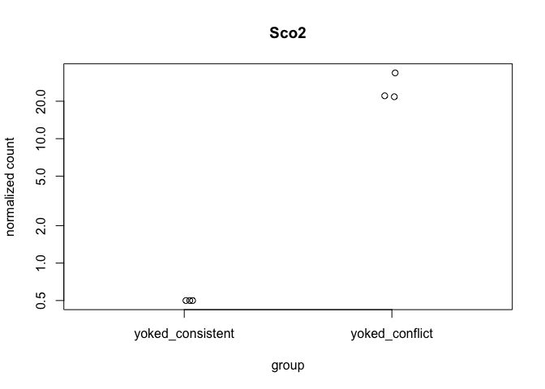

The figures made from this script were compiled in Adobe.

    library(ggplot2) ## for awesome plots!
    library(cowplot) ## for some easy to use themes
    library(dplyr) ## for filtering and selecting rows
    library(car) ## stats
    library(VennDiagram) ## venn diagrams
    library(pheatmap) ## awesome heatmaps
    library(viridis) # for awesome color pallette
    library(reshape2) ## for melting dataframe
    library(DESeq2) ## for gene expression analysis
    library(edgeR)  ## for basic read counts status
    library(magrittr) ## to use the weird pipe
    library(genefilter)  ## for PCA fuction
    library(ggrepel) ## for labeling volcano plot
    library(colorblindr) # simulates color-blind viewing 

    ## load functions 
    source("figureoptions.R")
    source("functions_RNAseq.R")

    ## set output file for figures 
    knitr::opts_chunk$set(fig.path = '../figures/02_RNAseq_YokedYoked/')

Design
------

The major comparision here is Hippocampal subfield: "DG","CA3", "CA1"
Behavioral Groups: "yoked\_consistent", "yoked\_conflict"

    ##                APA2    Punch  
    ##  yoked_conflict  :12   CA1:7  
    ##  yoked_consistent: 9   CA3:6  
    ##                        DG :8

    ## class: DESeqDataSet 
    ## dim: 16716 21 
    ## metadata(1): version
    ## assays(1): counts
    ## rownames(16716): 0610007P14Rik 0610009B22Rik ... Zzef1 Zzz3
    ## rowData names(0):
    ## colnames(21): 143B-CA1-1 143B-DG-1 ... 148B-CA3-4 148B-DG-4
    ## colData names(8): RNAseqID Mouse ... APA APA2

    ## estimating size factors

    ## estimating dispersions

    ## gene-wise dispersion estimates

    ## mean-dispersion relationship

    ## final dispersion estimates

    ## fitting model and testing

Principle component analysis
----------------------------

    # create the dataframe using my function pcadataframe
    pcadata <- pcadataframe(rld, intgroup=c("Punch","APA2"), returnData=TRUE)
    percentVar <- round(100 * attr(pcadata, "percentVar"))
    percentVar

    ## [1] 41 21  9  4  3  3  3  2  2

    aov1 <- aov(PC1 ~ Punch, data=pcadata)
    summary(aov1) 

    ##             Df Sum Sq Mean Sq F value   Pr(>F)    
    ## Punch        2   7919    3960   72.55 2.43e-09 ***
    ## Residuals   18    982      55                     
    ## ---
    ## Signif. codes:  0 '***' 0.001 '**' 0.01 '*' 0.05 '.' 0.1 ' ' 1

    TukeyHSD(aov1, which = "Punch") 

    ##   Tukey multiple comparisons of means
    ##     95% family-wise confidence level
    ## 
    ## Fit: aov(formula = PC1 ~ Punch, data = pcadata)
    ## 
    ## $Punch
    ##                diff       lwr       upr     p adj
    ## CA3-DG  -39.8703270 -50.05315 -29.68751 0.0000000
    ## CA1-DG  -40.0881217 -49.84647 -30.32977 0.0000000
    ## CA1-CA3  -0.2177948 -10.70770  10.27211 0.9984533

    aov2 <- aov(PC2 ~ Punch, data=pcadata)
    summary(aov2) 

    ##             Df Sum Sq Mean Sq F value Pr(>F)    
    ## Punch        2   4463  2231.3   524.9 <2e-16 ***
    ## Residuals   18     77     4.3                   
    ## ---
    ## Signif. codes:  0 '***' 0.001 '**' 0.01 '*' 0.05 '.' 0.1 ' ' 1

    TukeyHSD(aov2, which = "Punch") 

    ##   Tukey multiple comparisons of means
    ##     95% family-wise confidence level
    ## 
    ## Fit: aov(formula = PC2 ~ Punch, data = pcadata)
    ## 
    ## $Punch
    ##              diff       lwr       upr p adj
    ## CA3-DG   20.66527  17.82342  23.50712     0
    ## CA1-DG  -16.49108 -19.21447 -13.76769     0
    ## CA1-CA3 -37.15635 -40.08391 -34.22880     0

    aov3 <- aov(PC3 ~ APA2, data=pcadata)
    summary(aov3) 

    ##             Df Sum Sq Mean Sq F value Pr(>F)
    ## APA2         1      5    5.02   0.051  0.823
    ## Residuals   19   1861   97.96

    aov4 <- aov(PC4 ~ APA2, data=pcadata)
    summary(aov4) 

    ##             Df Sum Sq Mean Sq F value Pr(>F)  
    ## APA2         1  210.6  210.63   6.824 0.0171 *
    ## Residuals   19  586.5   30.87                 
    ## ---
    ## Signif. codes:  0 '***' 0.001 '**' 0.01 '*' 0.05 '.' 0.1 ' ' 1

    pcadata$Punch <- factor(pcadata$Punch, levels=c("DG","CA3", "CA1"))
    pcadata$APA2 <- factor(pcadata$APA2, levels=c("yoked_consistent", "yoked_conflict"))

    PCA12 <- plotPCs(pcadata, 1, 2, aescolor = pcadata$Punch, colorname = " ", aesshape = pcadata$APA, shapename = " ",  colorvalues = colorvalPunch)
    PCA12

    PCA42 <- plotPCs(pcadata, 4, 2, aescolor = pcadata$APA2, colorname = "APA2", aesshape = pcadata$Punch, shapename = "Punch",  colorvalues = colorvalAPA7)
    PCA42

    # pdf the same pca plots descripbed above of the above
    pdf(file="../figures/02_RNAseq_YokedYoked/PCA12.pdf", width=2.5, height=2.25)
    plot(PCA12)
    dev.off()

    ## quartz_off_screen 
    ##                 2

    pdf(file="../figures/02_RNAseq_YokedYoked/PCA42.pdf", width=2.5, height=2.25)
    plot(PCA42)
    dev.off()

    ## quartz_off_screen 
    ##                 2

Number of differentially expressed genes per two-way contrast
=============================================================

    #calculate significance of all two way comparisions
    # see source "functions_RNAseq.R" 

    contrast1 <- resvals(contrastvector = c("Punch", "CA1", "DG"), mypval = 0.05) # 797

    ## [1] 797

    contrast2 <- resvals(contrastvector = c("Punch", "CA1", "CA3"), mypval = 0.05) # 485

    ## [1] 458

    contrast3 <- resvals(contrastvector = c("Punch", "CA3", "DG"), mypval = 0.05) # 1436

    ## [1] 1436

    contrast4 <- resvals(contrastvector = c("APA2", "yoked_conflict", "yoked_consistent"), mypval = 0.05) # 6

    ## [1] 6

venn diagrams
-------------

    rldpadjs <- assay(rld)
    rldpadjs <- cbind(rldpadjs, contrast1, contrast2, contrast3, contrast4)
    rldpadjs <- as.data.frame(rldpadjs)
    rldpadjs <- rldpadjs[ , grepl( "padj" , names( rldpadjs ) ) ]

    venn1 <- row.names(rldpadjs[rldpadjs[1] <0.05 & !is.na(rldpadjs[1]),]) # CA1 DG
    venn2 <- row.names(rldpadjs[rldpadjs[2] <0.05 & !is.na(rldpadjs[2]),]) # CA1 CA3
    venn3 <- row.names(rldpadjs[rldpadjs[3] <0.05 & !is.na(rldpadjs[3]),]) # CA3 DG
    venn4 <- row.names(rldpadjs[rldpadjs[4] <0.05 & !is.na(rldpadjs[4]),]) 

heatmap
-------

    DEGes <- assay(rld)
    DEGes <- cbind(DEGes, contrast1, contrast2, contrast3, contrast4)
    DEGes <- as.data.frame(DEGes) # convert matrix to dataframe
    DEGes$rownames <- rownames(DEGes)  # add the rownames to the dataframe
    DEGes$padjmin <- with(DEGes, pmin(padjPunchCA1DG, padjPunchCA1CA3, padjPunchCA3DG, padjAPA2yoked_conflictyoked_consistent)) 

    # create new col with min padj
    DEGes <- DEGes %>% filter(padjmin < 0.05)
    rownames(DEGes) <- DEGes$rownames
    drop.cols <-colnames(DEGes[,grep("padj|pval|rownames", colnames(DEGes))])
    DEGes <- DEGes %>% dplyr::select(-one_of(drop.cols))
    DEGes <- as.matrix(DEGes)
    DEGes <- DEGes - rowMeans(DEGes)
    head(DEGes)

    ##               143B-CA1-1  143B-DG-1 143D-CA1-3  143D-DG-3  144B-CA1-1
    ## 1110002E22Rik  0.3930960  2.0145763 -0.5206126  1.7021653 -0.94139263
    ## 1190002N15Rik  1.2540959 -0.4945681  1.1862515  0.7384476  1.40666449
    ## 1700025G04Rik -0.2555176  0.1123933 -0.7695032  0.4458702 -0.93423903
    ## 1810041L15Rik -1.8583786  0.9270913 -1.4964453  1.0897491 -1.08496934
    ## 2010300C02Rik  0.3861176  0.6108626  0.4170768  0.7354277  0.61153395
    ## 2900026A02Rik  0.1123703 -0.6715581  0.3470695 -0.8625633  0.04654965
    ##               144B-CA3-1 144D-CA3-2   144D-DG-2 145B-CA1-1  145B-DG-1
    ## 1110002E22Rik -0.9255789 -1.1942669  1.29345640 -1.1570308  1.9357949
    ## 1190002N15Rik -0.9499954 -0.6580894  0.03776601  0.9653497  0.3346911
    ## 1700025G04Rik -0.2214469  0.2508072  0.85529296 -0.2491054  0.6017027
    ## 1810041L15Rik -0.2346143  0.1136095  1.43332512 -1.1159696  1.5957033
    ## 2010300C02Rik -1.8412168 -1.5184064  0.72426932  0.6941986  0.8604288
    ## 2900026A02Rik  0.3728001  0.5555593 -0.84596539  0.3739483 -0.6090288
    ##               146B-CA1-2 146B-CA3-2  146B-DG-2 146D-CA1-3  146D-CA3-3
    ## 1110002E22Rik  1.2356627 -1.1863140  0.6380774 -0.5734923 -1.28919719
    ## 1190002N15Rik  1.7569211 -0.5610537  1.5031966  0.1485850 -1.85811830
    ## 1700025G04Rik -0.2762981  0.1935342  0.2908768 -0.8990975  0.02682864
    ## 1810041L15Rik -1.0047602  0.2916771 -0.7756991  0.2069358  0.58973682
    ## 2010300C02Rik  0.6009774 -1.3350245  0.2719481  0.7978078 -0.66730771
    ## 2900026A02Rik  1.0941508  0.3708552 -0.2217586 -0.1131428  0.93530261
    ##                 146D-DG-3 147D-CA3-1   147D-DG-1  148B-CA1-4  148B-CA3-4
    ## 1110002E22Rik -0.06404503 -1.4159614  1.58636930 -0.47853835 -1.33285592
    ## 1190002N15Rik -1.23209001 -1.5393394 -0.03611157  0.11661914 -0.97985735
    ## 1700025G04Rik  0.97428649  0.7029053  0.40830850 -1.29535894  0.01918726
    ## 1810041L15Rik  0.54148484  0.5463729  1.36112527 -1.27752664 -0.13098054
    ## 2010300C02Rik  0.44256920 -1.9330831  1.00547925 -0.09845913 -1.41886434
    ## 2900026A02Rik -1.12261284  0.4921232 -1.02216813  0.45952730  0.47415588
    ##                 148B-DG-4
    ## 1110002E22Rik  0.28008752
    ## 1190002N15Rik -1.13936480
    ## 1700025G04Rik  0.01857337
    ## 1810041L15Rik  0.28253241
    ## 2010300C02Rik  0.65366467
    ## 2900026A02Rik -0.16561402

    ## the heatmap annotation file
    df <- as.data.frame(colData(dds)[,c("Punch","APA2")]) ## matrix to df
    rownames(df) <- names(countData)

    ann_colors <- ann_colors7 # see color options 

    # make sure the data is a matrix
    DEGes <- as.matrix(DEGes) 

    # set color breaks
    paletteLength <- 30
    myBreaks <- c(seq(min(DEGes), 0, length.out=ceiling(paletteLength/2) + 1), 
                  seq(max(DEGes)/paletteLength, max(DEGes), length.out=floor(paletteLength/2)))

    pheatmap(DEGes, show_colnames=T, show_rownames = F,
             annotation_col=df, annotation_colors = ann_colors,
             treeheight_row = 0, treeheight_col = 25,
             fontsize = 11, 
             #width=4.5, height=3,
             border_color = "grey60" ,
             color = viridis(30),
             cellwidth = 8, 
             clustering_method="average",
             breaks=myBreaks,
             clustering_distance_cols="correlation" 
             )

    # for adobe
    pheatmap(DEGes, show_colnames=F, show_rownames = F,
             annotation_col=df, annotation_colors = ann_colors,
             treeheight_row = 0, treeheight_col = 50,
             fontsize = 10, 
             #width=4.5, height=3,
             border_color = "grey60" ,
             color = viridis(30),
             cellwidth = 8, 
             clustering_method="average",
             breaks=myBreaks,
             clustering_distance_cols="correlation",
             filename = "../figures/02_RNAseq_YokedYoked/pheatmap.pdf"
             )

    # no legends just the heatmap
    pheatmap(DEGes, show_colnames=F, show_rownames = F,
             annotation_col=df, annotation_colors = ann_colors, 
             annotation_row = NA, 
             annotation_legend = FALSE,
             annotation_names_row = FALSE, annotation_names_col = FALSE,
             treeheight_row = 0, treeheight_col = 50,
             fontsize = 11, 
             border_color = "grey60" ,
             color = viridis(30),
             #cellwidth = 7, 
             clustering_method="average",
             breaks=myBreaks,
             clustering_distance_cols="correlation" 
             )

    pheatmap(DEGes, show_colnames=F, show_rownames = F,
             annotation_col=df, annotation_colors = ann_colors, 
             annotation_row = NA, 
             annotation_legend = FALSE,
             annotation_names_row = FALSE, annotation_names_col = FALSE,
             treeheight_row = 0, treeheight_col = 50,
             fontsize = 11, 
             border_color = "grey60" ,
             color = viridis(30),
             #cellwidth = 7, 
             clustering_method="average",
             breaks=myBreaks,
             clustering_distance_cols="correlation", 
             filename = "../figures/02_RNAseq_YokedYoked/pheatmap_minimal.pdf"
             )

Volcanos plots and and gene lists
---------------------------------

DG
--

    colData <- read.csv("../data/02a_colData.csv", header = T)
    countData <- read.csv("../data/02a_countData.csv", header = T, check.names = F, row.names = 1)

    colData <- colData %>% 
      filter(APA2 %in% c("yoked_consistent", "yoked_conflict" ))  %>%
      filter(Punch %in% c( "DG")) %>%
      droplevels()

    savecols <- as.character(colData$RNAseqID) 
    savecols <- as.vector(savecols) 
    countData <- countData %>% dplyr::select(one_of(savecols)) 

    colData %>% select(APA2,Punch)  %>%  summary()

    ##                APA2   Punch 
    ##  yoked_conflict  :4   DG:8  
    ##  yoked_consistent:4

    dds <- DESeqDataSetFromMatrix(countData = countData,
                                  colData = colData,
                                  design = ~ APA2 )

    dds$APA2 <- factor(dds$APA2, levels=c("yoked_consistent", "yoked_conflict")) ## specify the factor levels

    dds # view the DESeq object - note numnber of genes

    ## class: DESeqDataSet 
    ## dim: 22485 8 
    ## metadata(1): version
    ## assays(1): counts
    ## rownames(22485): 0610007P14Rik 0610009B22Rik ... Zzef1 Zzz3
    ## rowData names(0):
    ## colnames(8): 143B-DG-1 143D-DG-3 ... 147D-DG-1 148B-DG-4
    ## colData names(8): RNAseqID Mouse ... APA APA2

    dds <- dds[ rowSums(counts(dds)) > 1, ]  # Pre-filtering genes with 0 counts
    dds # view number of genes afternormalization and the number of samples

    ## class: DESeqDataSet 
    ## dim: 15735 8 
    ## metadata(1): version
    ## assays(1): counts
    ## rownames(15735): 0610007P14Rik 0610009B22Rik ... Zzef1 Zzz3
    ## rowData names(0):
    ## colnames(8): 143B-DG-1 143D-DG-3 ... 147D-DG-1 148B-DG-4
    ## colData names(8): RNAseqID Mouse ... APA APA2

    dds <- DESeq(dds) # Differential expression analysis

    res <- results(dds, contrast =c("APA2",  "yoked_conflict", "yoked_consistent"), independentFiltering = T, alpha = 0.05)
    resOrdered <- res[order(res$padj),]
    head(resOrdered, 10)

    ## log2 fold change (MAP): APA2 yoked_conflict vs yoked_consistent 
    ## Wald test p-value: APA2 yoked_conflict vs yoked_consistent 
    ## DataFrame with 10 rows and 6 columns
    ##                baseMean log2FoldChange     lfcSE        stat       pvalue
    ##               <numeric>      <numeric> <numeric>   <numeric>    <numeric>
    ## Cnr1          59.752503    1.734827218 0.3528493  4.91662355 8.804964e-07
    ## Kcnc2         24.196277    1.441945888 0.3476831  4.14729929 3.364202e-05
    ## Gm2115        18.066991    1.390844621 0.3504965  3.96821273 7.241368e-05
    ## 0610007P14Rik 14.175793   -0.569257295 0.3507923 -1.62277590 1.046373e-01
    ## 0610009B22Rik  1.763288   -0.008577467 0.2648368 -0.03238774 9.741628e-01
    ## 0610009L18Rik  1.940594   -0.154615600 0.2674053 -0.57820693 5.631244e-01
    ## 0610009O20Rik 30.635044   -0.143783734 0.3094036 -0.46471249 6.421374e-01
    ## 0610010F05Rik  5.115026    0.050049574 0.3413071  0.14664090 8.834155e-01
    ## 0610010K14Rik  2.164094    0.085715197 0.2846360  0.30113972 7.633080e-01
    ## 0610012G03Rik 45.755256    0.545890612 0.3196365  1.70784801 8.766455e-02
    ##                    padj
    ##               <numeric>
    ## Cnr1          0.0137921
    ## Kcnc2         0.2634843
    ## Gm2115        0.3780960
    ## 0610007P14Rik 0.9999627
    ## 0610009B22Rik 0.9999627
    ## 0610009L18Rik 0.9999627
    ## 0610009O20Rik 0.9999627
    ## 0610010F05Rik 0.9999627
    ## 0610010K14Rik 0.9999627
    ## 0610012G03Rik 0.9999627

    data <- data.frame(gene = row.names(res),
                       pvalue = -log10(res$padj), 
                       lfc = res$log2FoldChange)
    data <- na.omit(data)
    data <- data %>%
      mutate(color = ifelse(data$lfc > 0 & data$pvalue > 1.3, 
                            yes = "yoked_conflict", 
                            no = ifelse(data$lfc < 0 & data$pvalue > 1.3, 
                                        yes = "yoked_consistent", 
                                        no = "none")))
    top_labelled <- top_n(data, n = 3, wt = pvalue)
    # Color corresponds to fold change directionality
    colored <- ggplot(data, aes(x = lfc, y = pvalue)) + 
      geom_point(aes(color = factor(color)), size = 1, alpha = 0.8, na.rm = T) + # add gene points
      theme_bw(base_size = 8) + # clean up theme
      theme(legend.position = "none") + # remove legend 
      scale_color_manual(values = volcano3) + 
      theme(panel.grid.minor=element_blank(),
               panel.grid.major=element_blank()) + 
      scale_x_continuous(name="log2 (yoked conflict/ \n yoked conflict)",
                         limits=c(-4, 4)) +
      scale_y_continuous(name="-log10 (adjusted p-value",
                        limits= c(0, 6)) +
      draw_image(imgDG, scale = 4, x=-2.3, y=4.6)
    colored

    #cvd_grid(colored) # to view plot for color blind 
    pdf(file="../figures/02_RNAseq_YokedYoked/DGyoked_consistentyoked_conflict.pdf", width=1.5, height=1.75)
    plot(colored)
    dev.off()

    ## quartz_off_screen 
    ##                 2

CA3
---

    colData <- read.csv("../data/02a_colData.csv", header = T)
    countData <- read.csv("../data/02a_countData.csv", header = T, check.names = F, row.names = 1)

    colData <- colData %>% 
      filter(APA2 %in% c("yoked_consistent", "yoked_conflict" ))  %>%
      filter(Punch %in% c( "CA3")) %>%
      droplevels()

    savecols <- as.character(colData$RNAseqID) 
    savecols <- as.vector(savecols) 
    countData <- countData %>% dplyr::select(one_of(savecols)) 

    colData %>% select(APA2,Punch)  %>%  summary()

    ##                APA2   Punch  
    ##  yoked_conflict  :3   CA3:6  
    ##  yoked_consistent:3

    dds <- DESeqDataSetFromMatrix(countData = countData,
                                  colData = colData,
                                  design = ~ APA2 )

    dds$APA2 <- factor(dds$APA2, levels=c("yoked_consistent", "yoked_conflict")) ## specify the factor levels

    dds # view the DESeq object - note numnber of genes

    ## class: DESeqDataSet 
    ## dim: 22485 6 
    ## metadata(1): version
    ## assays(1): counts
    ## rownames(22485): 0610007P14Rik 0610009B22Rik ... Zzef1 Zzz3
    ## rowData names(0):
    ## colnames(6): 144B-CA3-1 144D-CA3-2 ... 147D-CA3-1 148B-CA3-4
    ## colData names(8): RNAseqID Mouse ... APA APA2

    dds <- dds[ rowSums(counts(dds)) > 1, ]  # Pre-filtering genes with 0 counts
    dds # view number of genes afternormalization and the number of samples

    ## class: DESeqDataSet 
    ## dim: 15497 6 
    ## metadata(1): version
    ## assays(1): counts
    ## rownames(15497): 0610007P14Rik 0610009B22Rik ... Zzef1 Zzz3
    ## rowData names(0):
    ## colnames(6): 144B-CA3-1 144D-CA3-2 ... 147D-CA3-1 148B-CA3-4
    ## colData names(8): RNAseqID Mouse ... APA APA2

    dds <- DESeq(dds) # Differential expression analysis

    res <- results(dds, contrast =c("APA2",  "yoked_conflict", "yoked_consistent"), independentFiltering = T, alpha = 0.05)
    resOrdered <- res[order(res$padj),]
    head(resOrdered, 10)

    ## log2 fold change (MAP): APA2 yoked_conflict vs yoked_consistent 
    ## Wald test p-value: APA2 yoked_conflict vs yoked_consistent 
    ## DataFrame with 10 rows and 6 columns
    ##            baseMean log2FoldChange     lfcSE      stat       pvalue
    ##           <numeric>      <numeric> <numeric> <numeric>    <numeric>
    ## Sco2       12.68721      1.3605395 0.2700867  5.037418 4.718546e-07
    ## Kif5a    4870.48859     -0.8684670 0.1799850 -4.825219 1.398493e-06
    ## Rapgef4   401.02837     -0.9594043 0.2331701 -4.114612 3.878320e-05
    ## Adgrf5     77.07304     -0.9737110 0.2561422 -3.801447 1.438536e-04
    ## Fads6      49.44114     -0.9713536 0.2637724 -3.682545 2.309175e-04
    ## mt-Nd5   6168.10763     -0.6964659 0.1875240 -3.714010 2.040010e-04
    ## Tbc1d16    29.99046     -1.0310211 0.2850829 -3.616566 2.985371e-04
    ## Ttbk1     351.00944     -0.7724351 0.2119654 -3.644157 2.682700e-04
    ## mt-Nd4  15055.81795     -0.6071691 0.1693297 -3.585721 3.361482e-04
    ## Efhd2     213.90623     -0.7183137 0.2022637 -3.551372 3.832279e-04
    ##               padj
    ##          <numeric>
    ## Sco2    0.00728921
    ## Kif5a   0.01080196
    ## Rapgef4 0.19970764
    ## Adgrf5  0.55556279
    ## Fads6   0.57647521
    ## mt-Nd5  0.57647521
    ## Tbc1d16 0.57647521
    ## Ttbk1   0.57647521
    ## mt-Nd4  0.57697965
    ## Efhd2   0.59201042

    summary(res)

    ## 
    ## out of 15497 with nonzero total read count
    ## adjusted p-value < 0.05
    ## LFC > 0 (up)     : 1, 0.0065% 
    ## LFC < 0 (down)   : 1, 0.0065% 
    ## outliers [1]     : 49, 0.32% 
    ## low counts [2]   : 0, 0% 
    ## (mean count < 0)
    ## [1] see 'cooksCutoff' argument of ?results
    ## [2] see 'independentFiltering' argument of ?results

    topGene <- rownames(res)[which.min(res$padj)]
    plotCounts(dds, gene = topGene, intgroup=c("APA2"))

    data <- data.frame(gene = row.names(res),
                       pvalue = -log10(res$padj), 
                       lfc = res$log2FoldChange)
    data <- na.omit(data)
    data <- data %>%
      mutate(color = ifelse(data$lfc > 0 & data$pvalue > 1.3, 
                            yes = "yoked_conflict", 
                            no = ifelse(data$lfc < 0 & data$pvalue > 1.3, 
                                        yes = "yoked_consistent", 
                                        no = "none")))
    top_labelled <- top_n(data, n = 3, wt = pvalue)
    # Color corresponds to fold change directionality
    colored <- ggplot(data, aes(x = lfc, y = pvalue)) + 
      geom_point(aes(color = factor(color)), size = 1, alpha = 0.8, na.rm = T) + # add gene points
      theme_bw(base_size = 8) + # clean up theme
      theme(legend.position = "none") + # remove legend 
      scale_color_manual(values = volcano3) + 
      theme(panel.grid.minor=element_blank(),
               panel.grid.major=element_blank()) + 
      scale_x_continuous(name="log2 (yoked conflict/ \n yoked consistent)",
                         limits=c(-4, 4)) +
      scale_y_continuous(name="-log10 (adjusted p-value",
                        limits= c(0, 6)) +
      draw_image(imgCA3, scale = 4, x=-2.3, y=4.6)
    colored

    pdf(file="../figures/02_RNAseq_YokedYoked/CA3yoked_consistentyoked_conflict.pdf", width=1.5, height=1.75)
    plot(colored)
    dev.off()

    ## quartz_off_screen 
    ##                 2

CA1
---

    colData <- read.csv("../data/02a_colData.csv", header = T)
    countData <- read.csv("../data/02a_countData.csv", header = T, check.names = F, row.names = 1)

    colData <- colData %>% 
      filter(APA2 %in% c("yoked_consistent", "yoked_conflict" ))  %>%
      filter(Punch %in% c( "CA1")) %>%
      droplevels()

    savecols <- as.character(colData$RNAseqID) 
    savecols <- as.vector(savecols) 
    countData <- countData %>% dplyr::select(one_of(savecols)) 

    colData %>% select(APA2,Punch)  %>%  summary()

    ##                APA2   Punch  
    ##  yoked_conflict  :5   CA1:7  
    ##  yoked_consistent:2

    dds <- DESeqDataSetFromMatrix(countData = countData,
                                  colData = colData,
                                  design = ~ APA2 )

    dds$APA2 <- factor(dds$APA2, levels=c("yoked_consistent", "yoked_conflict")) ## specify the factor levels

    dds # view the DESeq object - note numnber of genes

    ## class: DESeqDataSet 
    ## dim: 22485 7 
    ## metadata(1): version
    ## assays(1): counts
    ## rownames(22485): 0610007P14Rik 0610009B22Rik ... Zzef1 Zzz3
    ## rowData names(0):
    ## colnames(7): 143B-CA1-1 143D-CA1-3 ... 146D-CA1-3 148B-CA1-4
    ## colData names(8): RNAseqID Mouse ... APA APA2

    dds <- dds[ rowSums(counts(dds)) > 1, ]  # Pre-filtering genes with 0 counts
    dds # view number of genes afternormalization and the number of samples

    ## class: DESeqDataSet 
    ## dim: 14667 7 
    ## metadata(1): version
    ## assays(1): counts
    ## rownames(14667): 0610007P14Rik 0610009B22Rik ... Zzef1 Zzz3
    ## rowData names(0):
    ## colnames(7): 143B-CA1-1 143D-CA1-3 ... 146D-CA1-3 148B-CA1-4
    ## colData names(8): RNAseqID Mouse ... APA APA2

    dds <- DESeq(dds) # Differential expression analysis

    res <- results(dds, contrast =c("APA2",  "yoked_conflict", "yoked_consistent"), independentFiltering = T, alpha = 0.05)
    resOrdered <- res[order(res$padj),]
    head(resOrdered, 10)

    ## log2 fold change (MAP): APA2 yoked_conflict vs yoked_consistent 
    ## Wald test p-value: APA2 yoked_conflict vs yoked_consistent 
    ## DataFrame with 10 rows and 6 columns
    ##          baseMean log2FoldChange     lfcSE      stat       pvalue
    ##         <numeric>      <numeric> <numeric> <numeric>    <numeric>
    ## Gm6768   8.438137      -3.307263 0.5859346 -5.644424 1.657353e-08
    ## Srprb   27.455855       3.197207 0.5560026  5.750345 8.906142e-09
    ## Gm12184  6.273305      -2.991991 0.5836836 -5.126049 2.958857e-07
    ## Notch2  23.670426       2.742395 0.5507301  4.979563 6.372809e-07
    ## Adamts1 25.362297       2.312756 0.4770698  4.847836 1.248154e-06
    ## Pcdhb12 23.393865      -2.632166 0.5806742 -4.532949 5.816591e-06
    ## Gad2    67.309303       2.146483 0.4844276  4.430966 9.381171e-06
    ## Gm10146  4.739406      -2.484571 0.5712102 -4.349662 1.363477e-05
    ## Ercc6   37.568475       2.082984 0.4976750  4.185431 2.846260e-05
    ## Pnpla3  20.763939      -1.801926 0.4334091 -4.157565 3.216585e-05
    ##                 padj
    ##            <numeric>
    ## Gm6768  9.079807e-05
    ## Srprb   9.079807e-05
    ## Gm12184 1.080673e-03
    ## Notch2  1.745672e-03
    ## Adamts1 2.735205e-03
    ## Pcdhb12 1.062207e-02
    ## Gad2    1.468421e-02
    ## Gm10146 1.867453e-02
    ## Ercc6   2.937010e-02
    ## Pnpla3  2.937010e-02

    summary(res)

    ## 
    ## out of 14667 with nonzero total read count
    ## adjusted p-value < 0.05
    ## LFC > 0 (up)     : 11, 0.075% 
    ## LFC < 0 (down)   : 6, 0.041% 
    ## outliers [1]     : 22, 0.15% 
    ## low counts [2]   : 3688, 25% 
    ## (mean count < 2)
    ## [1] see 'cooksCutoff' argument of ?results
    ## [2] see 'independentFiltering' argument of ?results

    topGene <- rownames(res)[which.min(res$padj)]
    plotCounts(dds, gene = topGene, intgroup=c("APA2"))

    data <- data.frame(gene = row.names(res),
                       pvalue = -log10(res$padj), 
                       lfc = res$log2FoldChange)
    data <- na.omit(data)
    data <- data %>%
      mutate(color = ifelse(data$lfc > 0 & data$pvalue > 1.3, 
                            yes = "yoked_conflict", 
                            no = ifelse(data$lfc < 0 & data$pvalue > 1.3, 
                                        yes = "yoked_consistent", 
                                        no = "none")))
    top_labelled <- top_n(data, n = 3, wt = pvalue)
    # Color corresponds to fold change directionality
    colored <- ggplot(data, aes(x = lfc, y = pvalue)) + 
      geom_point(aes(color = factor(color)), size = 1, alpha = 0.8, na.rm = T) + # add gene points
      theme_bw(base_size = 8) + # clean up theme
      theme(legend.position = "none") + # remove legend 
      scale_color_manual(values = volcano3) + 
      theme(panel.grid.minor=element_blank(),
               panel.grid.major=element_blank()) + 
      scale_x_continuous(name="log2 (yoked consistent/ \n yoked conflict)",
                         limits=c(-4, 4)) +
      scale_y_continuous(name="-log10 (adjusted p-value",
                        limits= c(0, 6)) +
      draw_image(imgCA1, scale = 4, x=-2.3, y=4.6)
    colored

    #cvd_grid(colored) # to view plot for color blind 
    pdf(file="../figures/02_RNAseq_YokedYoked/CA1yoked_consistentyoked_conflict.pdf", width=1.5, height=1.75)
    plot(colored)
    dev.off()

    ## quartz_off_screen 
    ##                 2
