    library(ggplot2) ## for awesome plots!
    library(cowplot) ## for some easy to use themes
    library(dplyr) ## for filtering and selecting rows
    library(car) ## stats
    library(VennDiagram) ## venn diagrams
    library(pheatmap) ## awesome heatmaps
    library(viridis) # for awesome color pallette
    library(reshape2) ## for melting dataframe
    library(DESeq2) ## for gene expression analysis
    library(edgeR)  ## for basic read counts status
    library(magrittr) ## to use the weird pipe
    library(genefilter)  ## for PCA fuction

    ## load functions 
    source("figureoptions.R")
    source("functions_RNAseq.R")

    ## set output file for figures 
    knitr::opts_chunk$set(fig.path = '../figures/02c_rnaseqavoidance/')

DG
--

    colData <- read.csv("../data/02a_colData.csv", header = T)
    countData <- read.csv("../data/02a_countData.csv", header = T, check.names = F, row.names = 1)

    colData$avoidance <-  ifelse(grepl("Control", colData$APA), "no", "yes")

    colData <- colData %>% 
      filter(Punch %in% c("DG"))  %>% 
      droplevels()

    savecols <- as.character(colData$RNAseqID) 
    savecols <- as.vector(savecols) 
    countData <- countData %>% dplyr::select(one_of(savecols)) 

    colData %>% select(avoidance,Punch)  %>%  summary()

    ##   avoidance         Punch  
    ##  Length:16          DG:16  
    ##  Class :character          
    ##  Mode  :character

    ## create DESeq object using the factors Punch and APA
    dds <- DESeqDataSetFromMatrix(countData = countData,
                                  colData = colData,
                                  design = ~ avoidance)

    dds # view the DESeq object - note numnber of genes

    ## class: DESeqDataSet 
    ## dim: 22485 16 
    ## metadata(1): version
    ## assays(1): counts
    ## rownames(22485): 0610007P14Rik 0610009B22Rik ... Zzef1 Zzz3
    ## rowData names(0):
    ## colnames(16): 143A-DG-1 143B-DG-1 ... 148A-DG-3 148B-DG-4
    ## colData names(9): RNAseqID Mouse ... APA2 avoidance

    dds <- dds[ rowSums(counts(dds)) > 1, ]  # Pre-filtering genes with 0 counts
    dds # view number of genes afternormalization and the number of samples

    ## class: DESeqDataSet 
    ## dim: 16658 16 
    ## metadata(1): version
    ## assays(1): counts
    ## rownames(16658): 0610007P14Rik 0610009B22Rik ... Zzef1 Zzz3
    ## rowData names(0):
    ## colnames(16): 143A-DG-1 143B-DG-1 ... 148A-DG-3 148B-DG-4
    ## colData names(9): RNAseqID Mouse ... APA2 avoidance

    dds <- DESeq(dds) # Differential expression analysis
    rld <- rlog(dds, blind=FALSE) ## log transformed data

    # create the dataframe using my function pcadataframe
    pcadata <- pcadataframe(rld, intgroup=c("Punch","avoidance"), returnData=TRUE)
    percentVar <- round(100 * attr(pcadata, "percentVar"))
    percentVar

    ## [1] 31 20 10  6  6  5  4  3  3

    summary(aov(PC1 ~ avoidance, data=pcadata)) 

    ##             Df Sum Sq Mean Sq F value  Pr(>F)   
    ## avoidance    1  891.6   891.6   16.53 0.00116 **
    ## Residuals   14  755.1    53.9                   
    ## ---
    ## Signif. codes:  0 '***' 0.001 '**' 0.01 '*' 0.05 '.' 0.1 ' ' 1

    summary(aov(PC2 ~ avoidance, data=pcadata)) 

    ##             Df Sum Sq Mean Sq F value Pr(>F)
    ## avoidance    1  169.4  169.37   2.589   0.13
    ## Residuals   14  915.7   65.41

    summary(aov(PC3 ~ avoidance, data=pcadata)) 

    ##             Df Sum Sq Mean Sq F value Pr(>F)
    ## avoidance    1    7.1    7.09   0.184  0.674
    ## Residuals   14  539.0   38.50

    summary(aov(PC4 ~ avoidance, data=pcadata)) 

    ##             Df Sum Sq Mean Sq F value Pr(>F)
    ## avoidance    1    6.6   6.609   0.287  0.601
    ## Residuals   14  322.4  23.028

    pcadata$wrap <- "Principle Compent Analysis"

    #calculate significance of all two way comparisions
    # see source "functions_RNAseq.R" 
    contrast1 <- resvals(contrastvector = c("avoidance", "yes", "no"), mypval = 0.1) # 137

    ## [1] 137

    res <- results(dds, contrast =c("avoidance", "yes", "no"), independentFiltering = T, alpha = 0.1)
    summary(res)

    ## 
    ## out of 16629 with nonzero total read count
    ## adjusted p-value < 0.1
    ## LFC > 0 (up)     : 149, 0.9% 
    ## LFC < 0 (down)   : 9, 0.054% 
    ## outliers [1]     : 0, 0% 
    ## low counts [2]   : 5832, 35% 
    ## (mean count < 4)
    ## [1] see 'cooksCutoff' argument of ?results
    ## [2] see 'independentFiltering' argument of ?results

    resOrdered <- res[order(res$padj),]
    head(resOrdered, 10)

    ## log2 fold change (MAP): avoidance yes vs no 
    ## Wald test p-value: avoidance yes vs no 
    ## DataFrame with 10 rows and 6 columns
    ##          baseMean log2FoldChange     lfcSE      stat       pvalue
    ##         <numeric>      <numeric> <numeric> <numeric>    <numeric>
    ## Smad7    43.60596       1.843381 0.2556950  7.209295 5.624215e-13
    ## Acan     24.88123       1.588941 0.2386731  6.657394 2.787249e-11
    ## Slc16a1  52.06814       1.551300 0.2339245  6.631629 3.320025e-11
    ## Fzd5     13.76731       1.817548 0.2821048  6.442811 1.172807e-10
    ## Ptgs2   108.75785       1.607411 0.2602908  6.175444 6.597776e-10
    ## Errfi1   99.39152       1.355828 0.2210447  6.133725 8.584498e-10
    ## Otud1    54.34863       1.455531 0.2397298  6.071547 1.266840e-09
    ## Nptx2   290.83992       1.351980 0.2241319  6.032072 1.618704e-09
    ## Rgs2     86.11509       1.557959 0.2595154  6.003338 1.933013e-09
    ## Pcdh8   418.79485       1.303651 0.2182318  5.973700 2.319326e-09
    ##                 padj
    ##            <numeric>
    ## Smad7   6.088776e-09
    ## Acan    1.198086e-07
    ## Slc16a1 1.198086e-07
    ## Fzd5    3.174203e-07
    ## Ptgs2   1.428551e-06
    ## Errfi1  1.548930e-06
    ## Otud1   1.959259e-06
    ## Nptx2   2.190511e-06
    ## Rgs2    2.325200e-06
    ## Pcdh8   2.510902e-06

    topGene <- rownames(res)[which.min(res$padj)]
    plotCounts(dds, gene = topGene, intgroup=c("avoidance"))

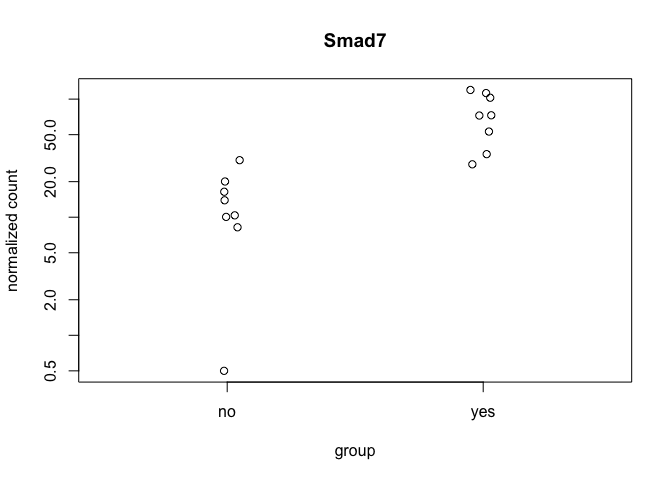

    data <- data.frame(gene = row.names(res),
                       pvalue = -log10(res$padj), 
                       lfc = res$log2FoldChange)
    data <- na.omit(data)
    data <- data %>%
      mutate(color = ifelse(data$lfc > 0 & data$pvalue > 1, 
                            yes = "yes", 
                            no = ifelse(data$lfc < 0 & data$pvalue > 1, 
                                        yes = "no", 
                                        no = "none")))
    top_labelled <- top_n(data, n = 5, wt = lfc)

    DGvolcano <- ggplot(data, aes(x = lfc, y = pvalue)) + 
      geom_point(aes(color = factor(color)), size = 1, alpha = 0.5, na.rm = T) + # add gene points
      scale_color_manual(values = volcano5)  + 
      scale_x_continuous(name="log2(consistent/yoked)") +
      scale_y_continuous(name=NULL) +
      theme_cowplot(font_size = 8, line_size = 0.25) +
      geom_hline(yintercept = 1,  size = 0.25, linetype = 2 )+ 
      theme(panel.grid.minor=element_blank(),
            legend.position = "none", # remove legend 
            panel.grid.major=element_blank())
    DGvolcano

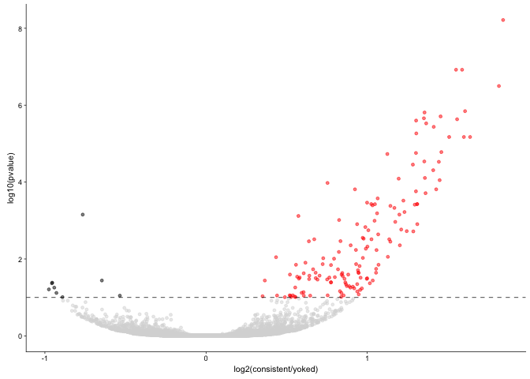

    pdf(file="../figures/02d_rnaseqavoidance/DGvolcano.pdf", width=1.25, height=2)
    plot(DGvolcano)
    dev.off()

    ## quartz_off_screen 
    ##                 2

    plotPCs <- function(df, xcol, ycol, aescolor, colorname, colorvalues){
      ggplot(df, aes(df[xcol], df[ycol], color=aescolor)) +
        geom_point(size=2) +
        xlab(paste0("PC", xcol, ": ", percentVar[xcol],"% variance")) +
        ylab(paste0("PC", ycol, ": ", percentVar[ycol],"% variance")) +
        stat_ellipse(level = 0.95, (aes(color=aescolor)),size=0.25) + 
        scale_colour_manual(name=colorname, values=c(colorvalues))+ 
        theme_cowplot(font_size = 8, line_size = 0.25)  +
        theme(legend.position="none")
    }

    PCA12 <- plotPCs(pcadata, 1, 2, aescolor = pcadata$avoidance, colorname = " ",  colorvalues = colorvalavoidance)
    PCA12

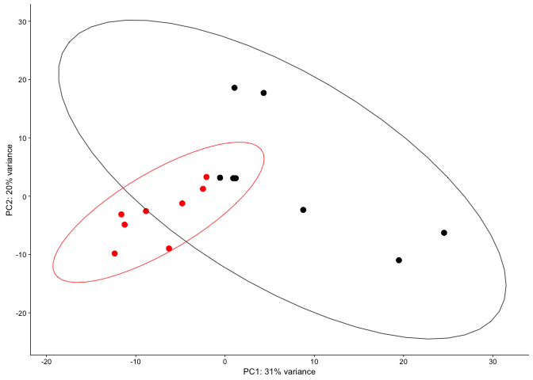

    pdf(file="../figures/02d_rnaseqavoidance/DGpca12.pdf", width=1.75, height=2)
    plot(PCA12)
    dev.off()

    ## quartz_off_screen 
    ##                 2

    scatter <- ggplot(pcadata, aes(PC1, PC2, color=avoidance)) + 
      geom_point(size = 2, alpha = 0.5) +
      scale_color_manual(values = colorvalavoidance) +
        theme_cowplot(font_size = 8, line_size = 0.25)  +
        theme(legend.position="none") +
        scale_x_continuous(name="PC1") +
         scale_y_continuous(name="PC2")  
    scatter

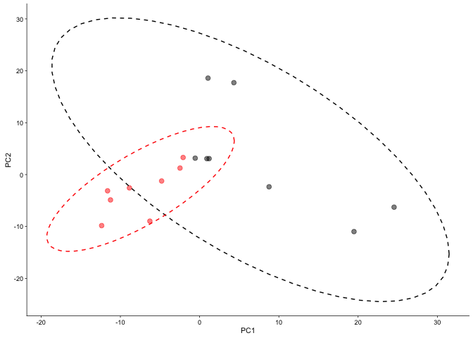

    scatter <- ggplot(pcadata, aes(PC1, PC2, color=avoidance)) + 
      geom_point(size = 2, alpha = 0.5) +
      scale_color_manual(values = colorvalavoidance) +
        theme_cowplot(font_size = 8, line_size = 0.25)  +
        theme(legend.position="none") +
        scale_x_continuous(name="PC1") +
         scale_y_continuous(name="PC2")  
    scatter

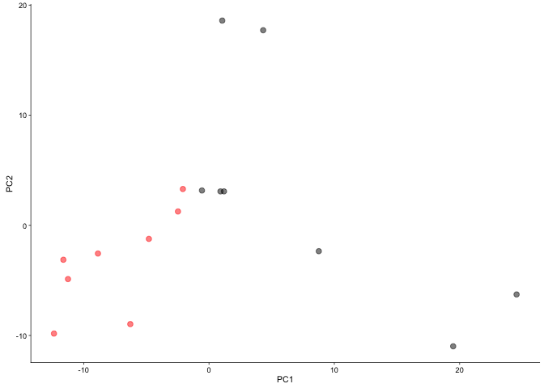

    pdf(file="../figures/02d_rnaseqavoidance/pc12avoidance.pdf", width=1.25, height=2)
    plot(scatter)
    dev.off()

    ## quartz_off_screen 
    ##                 2

    scatter <- ggplot(pcadata, aes(PC2, PC3, color=avoidance)) + 
      geom_point(size = 2, alpha = 0.5) +
      scale_color_manual(values = colorvalavoidance) +
        theme_cowplot(font_size = 8, line_size = 0.25)  +
        theme(legend.position="none") +
        scale_x_continuous(name="PC2") +
         scale_y_continuous(name="PC3")  
    scatter

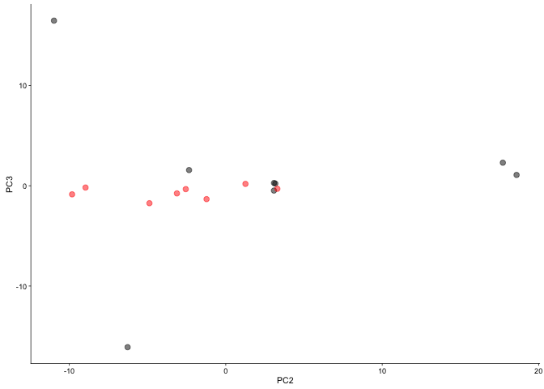

    pdf(file="../figures/02d_rnaseqavoidance/pc23avoidance.pdf", width=1.25, height=2)
    plot(scatter)
    dev.off()

    ## quartz_off_screen 
    ##                 2

CA3
---

    colData <- read.csv("../data/02a_colData.csv", header = T)
    countData <- read.csv("../data/02a_countData.csv", header = T, check.names = F, row.names = 1)

    colData$avoidance <-  ifelse(grepl("Control", colData$APA), "no", "yes")

    colData <- colData %>% 
      filter(Punch %in% c("CA3"))  %>% 
      droplevels()
    savecols <- as.character(colData$RNAseqID) 
    savecols <- as.vector(savecols) 
    countData <- countData %>% dplyr::select(one_of(savecols)) 
    colData %>% select(avoidance,Punch)  %>%  summary()

    ##   avoidance         Punch   
    ##  Length:13          CA3:13  
    ##  Class :character           
    ##  Mode  :character

    ## create DESeq object using the factors Punch and APA
    dds <- DESeqDataSetFromMatrix(countData = countData,
                                  colData = colData,
                                  design = ~ avoidance)

    dds # view the DESeq object - note numnber of genes

    ## class: DESeqDataSet 
    ## dim: 22485 13 
    ## metadata(1): version
    ## assays(1): counts
    ## rownames(22485): 0610007P14Rik 0610009B22Rik ... Zzef1 Zzz3
    ## rowData names(0):
    ## colnames(13): 143A-CA3-1 144A-CA3-2 ... 148A-CA3-3 148B-CA3-4
    ## colData names(9): RNAseqID Mouse ... APA2 avoidance

    dds <- dds[ rowSums(counts(dds)) > 1, ]  # Pre-filtering genes with 0 counts
    dds # view number of genes afternormalization and the number of samples

    ## class: DESeqDataSet 
    ## dim: 16208 13 
    ## metadata(1): version
    ## assays(1): counts
    ## rownames(16208): 0610007P14Rik 0610009B22Rik ... Zzef1 Zzz3
    ## rowData names(0):
    ## colnames(13): 143A-CA3-1 144A-CA3-2 ... 148A-CA3-3 148B-CA3-4
    ## colData names(9): RNAseqID Mouse ... APA2 avoidance

    dds <- DESeq(dds) # Differential expression analysis
    rld <- rlog(dds, blind=FALSE) ## log transformed data

    # create the dataframe using my function pcadataframe
    pcadata <- pcadataframe(rld, intgroup=c("Punch","avoidance"), returnData=TRUE)
    percentVar <- round(100 * attr(pcadata, "percentVar"))
    percentVar

    ## [1] 40 13 10  8  7  4  4  4  3

    summary(aov(PC1 ~ avoidance, data=pcadata))

    ##             Df Sum Sq Mean Sq F value Pr(>F)
    ## avoidance    1  151.6  151.57    2.28  0.159
    ## Residuals   11  731.2   66.48

    summary(aov(PC2 ~ avoidance, data=pcadata)) 

    ##             Df Sum Sq Mean Sq F value Pr(>F)
    ## avoidance    1  10.12   10.12   0.392  0.544
    ## Residuals   11 284.01   25.82

    summary(aov(PC3 ~ avoidance, data=pcadata)) 

    ##             Df Sum Sq Mean Sq F value Pr(>F)
    ## avoidance    1   1.69   1.694   0.085  0.776
    ## Residuals   11 219.47  19.951

    summary(aov(PC4 ~ avoidance, data=pcadata))

    ##             Df Sum Sq Mean Sq F value Pr(>F)
    ## avoidance    1  33.71   33.71   2.637  0.133
    ## Residuals   11 140.62   12.78

    summary(aov(PC4 ~ avoidance, data=pcadata)) 

    ##             Df Sum Sq Mean Sq F value Pr(>F)
    ## avoidance    1  33.71   33.71   2.637  0.133
    ## Residuals   11 140.62   12.78

    summary(aov(PC5 ~ avoidance, data=pcadata))

    ##             Df Sum Sq Mean Sq F value Pr(>F)
    ## avoidance    1    0.0   0.002       0  0.989
    ## Residuals   11  146.5  13.315

    summary(aov(PC6 ~ avoidance, data=pcadata))

    ##             Df Sum Sq Mean Sq F value Pr(>F)
    ## avoidance    1   0.68   0.684   0.077  0.787
    ## Residuals   11  97.78   8.889

    pcadata$wrap <- "Principle Compent Analysis"

    PCA12 <- plotPCs(pcadata, 1, 2, aescolor = pcadata$avoidance, colorname = " ",  colorvalues = colorvalavoidance)
    PCA12

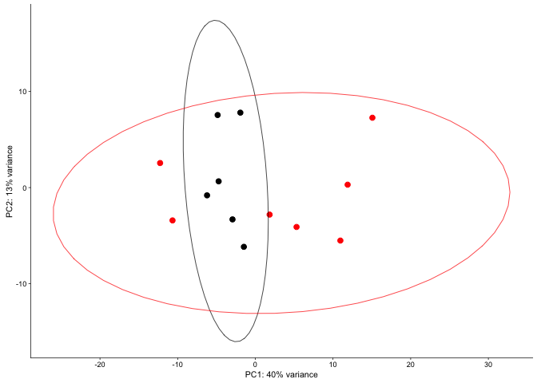

    pdf(file="../figures/02d_rnaseqavoidance/CA3pca12.pdf", width=1.75, height=2)
    plot(PCA12)
    dev.off()

    ## quartz_off_screen 
    ##                 2

    #calculate significance of all two way comparisions
    # see source "functions_RNAseq.R" 
    contrast1 <- resvals(contrastvector = c("avoidance", "yes", "no"), mypval = 0.1) # 0

    ## [1] 0

CA1
---

    colData <- read.csv("../data/02a_colData.csv", header = T)
    countData <- read.csv("../data/02a_countData.csv", header = T, check.names = F, row.names = 1)

    colData$avoidance <-  ifelse(grepl("Control", colData$APA), "no", "yes")

    colData <- colData %>% 
      filter(Punch %in% c("CA1"))  %>% 
      droplevels()
    savecols <- as.character(colData$RNAseqID) 
    savecols <- as.vector(savecols) 
    countData <- countData %>% dplyr::select(one_of(savecols)) 
    colData %>% select(avoidance,Punch)  %>%  summary()

    ##   avoidance         Punch   
    ##  Length:15          CA1:15  
    ##  Class :character           
    ##  Mode  :character

    dds <- DESeqDataSetFromMatrix(countData = countData,
                                  colData = colData,
                                  design = ~ avoidance)

    dds # view the DESeq object - note numnber of genes

    ## class: DESeqDataSet 
    ## dim: 22485 15 
    ## metadata(1): version
    ## assays(1): counts
    ## rownames(22485): 0610007P14Rik 0610009B22Rik ... Zzef1 Zzz3
    ## rowData names(0):
    ## colnames(15): 143B-CA1-1 143C-CA1-1 ... 148A-CA1-3 148B-CA1-4
    ## colData names(9): RNAseqID Mouse ... APA2 avoidance

    dds <- dds[ rowSums(counts(dds)) > 1, ]  # Pre-filtering genes with 0 counts
    dds # view number of genes afternormalization and the number of samples

    ## class: DESeqDataSet 
    ## dim: 16467 15 
    ## metadata(1): version
    ## assays(1): counts
    ## rownames(16467): 0610007P14Rik 0610009B22Rik ... Zzef1 Zzz3
    ## rowData names(0):
    ## colnames(15): 143B-CA1-1 143C-CA1-1 ... 148A-CA1-3 148B-CA1-4
    ## colData names(9): RNAseqID Mouse ... APA2 avoidance

    dds <- DESeq(dds) # Differential expression analysis
    rld <- rlog(dds, blind=FALSE) ## log transformed data

    # PCA analysis
    pcadata <- pcadataframe(rld, intgroup=c("Punch","avoidance"), returnData=TRUE)
    percentVar <- round(100 * attr(pcadata, "percentVar"))
    percentVar

    ## [1] 30 17 10  9  7  5  4  3  3

    summary(aov(PC1 ~ avoidance, data=pcadata)) 

    ##             Df Sum Sq Mean Sq F value Pr(>F)  
    ## avoidance    1  267.8  267.78   4.925 0.0449 *
    ## Residuals   13  706.8   54.37                 
    ## ---
    ## Signif. codes:  0 '***' 0.001 '**' 0.01 '*' 0.05 '.' 0.1 ' ' 1

    summary(aov(PC2 ~ avoidance, data=pcadata)) 

    ##             Df Sum Sq Mean Sq F value Pr(>F)
    ## avoidance    1    0.7    0.66   0.016  0.902
    ## Residuals   13  551.8   42.44

    summary(aov(PC3 ~ avoidance, data=pcadata))

    ##             Df Sum Sq Mean Sq F value Pr(>F)
    ## avoidance    1    6.9   6.864    0.27  0.612
    ## Residuals   13  330.4  25.419

    summary(aov(PC4 ~ avoidance, data=pcadata))

    ##             Df Sum Sq Mean Sq F value Pr(>F)  
    ## avoidance    1   70.4    70.4   4.094 0.0641 .
    ## Residuals   13  223.5    17.2                 
    ## ---
    ## Signif. codes:  0 '***' 0.001 '**' 0.01 '*' 0.05 '.' 0.1 ' ' 1

    pcadata$wrap <- "Principle Compent Analysis"

    PCA14 <- plotPCs(pcadata, 1, 4, aescolor = pcadata$avoidance, colorname = " ",  colorvalues = colorvalavoidance)
    PCA14

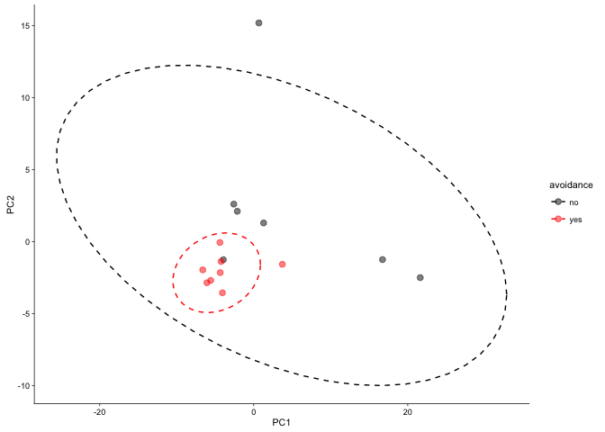

    pdf(file="../figures/02d_rnaseqavoidance/CA1pca14.pdf", width=1.75, height=2)
    plot(PCA14)
    dev.off()

    ## quartz_off_screen 
    ##                 2

    # calculate significance of all two way comparisions
    contrast1 <- resvals(contrastvector = c("avoidance", "yes", "no"), mypval = 0.1) # 9

    ## [1] 9

    res <- results(dds, contrast =c("avoidance", "yes", "no"), independentFiltering = T, alpha = 0.1)
    summary(res)

    ## 
    ## out of 16423 with nonzero total read count
    ## adjusted p-value < 0.1
    ## LFC > 0 (up)     : 3, 0.018% 
    ## LFC < 0 (down)   : 12, 0.073% 
    ## outliers [1]     : 0, 0% 
    ## low counts [2]   : 2910, 18% 
    ## (mean count < 1)
    ## [1] see 'cooksCutoff' argument of ?results
    ## [2] see 'independentFiltering' argument of ?results

    resOrdered <- res[order(res$padj),]
    head(resOrdered, 10)

    ## log2 fold change (MAP): avoidance yes vs no 
    ## Wald test p-value: avoidance yes vs no 
    ## DataFrame with 10 rows and 6 columns
    ##            baseMean log2FoldChange     lfcSE      stat       pvalue
    ##           <numeric>      <numeric> <numeric> <numeric>    <numeric>
    ## Ahdc1     96.421238     -0.9569078 0.2296433 -4.166932 3.087268e-05
    ## Ctcfl     42.289654     -1.0242058 0.2344386 -4.368760 1.249541e-05
    ## Dolk      15.738734      0.9965127 0.2199062  4.531534 5.855685e-06
    ## Gnaz    2111.356747     -0.9523448 0.2244308 -4.243379 2.201796e-05
    ## Pde6a   8313.616069     -0.9195553 0.2191239 -4.196508 2.710620e-05
    ## Tbc1d30   67.888380      0.6696923 0.1568631  4.269279 1.961059e-05
    ## Inhbb     18.952241     -0.9690058 0.2352498 -4.119051 3.804359e-05
    ## Glcci1     5.602879      0.9630417 0.2373737  4.057069 4.969236e-05
    ## Igf2bp2 4375.806074     -0.8460997 0.2096081 -4.036578 5.423639e-05
    ## Bmt2     330.943556     -0.8923242 0.2306374 -3.868948 1.093061e-04
    ##               padj
    ##          <numeric>
    ## Ahdc1   0.06975682
    ## Ctcfl   0.06975682
    ## Dolk    0.06975682
    ## Gnaz    0.06975682
    ## Pde6a   0.06975682
    ## Tbc1d30 0.06975682
    ## Inhbb   0.07367957
    ## Glcci1  0.08169808
    ## Igf2bp2 0.08169808
    ## Bmt2    0.09879088

    topGene <- rownames(res)[which.min(res$padj)]
    plotCounts(dds, gene = topGene, intgroup=c("avoidance"))

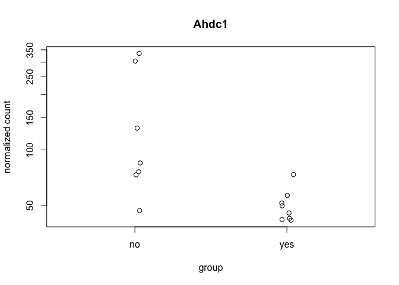

    data <- data.frame(gene = row.names(res),
                       pvalue = -log10(res$padj), 
                       lfc = res$log2FoldChange)
    data <- na.omit(data)
    data <- data %>%
      mutate(color = ifelse(data$lfc > 0 & data$pvalue > 1, 
                            yes = "consistent", 
                            no = ifelse(data$lfc < 0 & data$pvalue > 1, 
                                        yes = "yoked_consistent", 
                                        no = "none")))
    top_labelled <- top_n(data, n = 5, wt = lfc)

    # Color corresponds to fold change directionality
    CA1volcano <- ggplot(data, aes(x = lfc, y = pvalue)) + 
      geom_point(aes(color = factor(color)), size = 1, alpha = 0.5, na.rm = T) + # add gene points
      scale_color_manual(values = volcano1)  + 
      scale_x_continuous(name="log2 (consistent/yoked)") +
      scale_y_continuous(name=NULL) +
      theme_cowplot(font_size = 8, line_size = 0.25) +
      geom_hline(yintercept = 1,  size = 0.25, linetype = 2) + 
      theme(panel.grid.minor=element_blank(),
            legend.position = "none", # remove legend 
            panel.grid.major=element_blank())
    CA1volcano

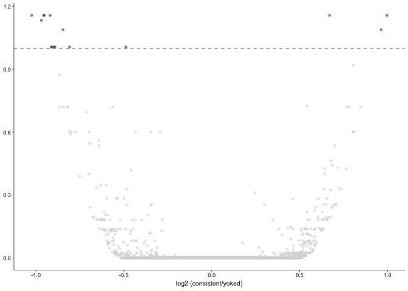

    pdf(file="../figures/02d_rnaseqavoidance/CA1volcano.pdf", width=1.25, height=2)
    plot(CA1volcano)
    dev.off()

    ## quartz_off_screen 
    ##                 2

All
---

    colData <- read.csv("../data/02a_colData.csv", header = T)
    countData <- read.csv("../data/02a_countData.csv", header = T, check.names = F, row.names = 1)

    colData$avoidance <-  ifelse(grepl("Control", colData$APA), "no", "yes")
    colData$avoidance <- as.factor(colData$avoidance )
    colData %>% select(avoidance,Punch)  %>%  summary()

    ##  avoidance Punch   
    ##  no :21    CA1:15  
    ##  yes:23    CA3:13  
    ##            DG :16

    ## create DESeq object using the factors Punch and APA
    dds <- DESeqDataSetFromMatrix(countData = countData,
                                  colData = colData,
                                  design = ~ avoidance*Punch)

    dds # view the DESeq object - note numnber of genes

    ## class: DESeqDataSet 
    ## dim: 22485 44 
    ## metadata(1): version
    ## assays(1): counts
    ## rownames(22485): 0610007P14Rik 0610009B22Rik ... Zzef1 Zzz3
    ## rowData names(0):
    ## colnames(44): 143A-CA3-1 143A-DG-1 ... 148B-CA3-4 148B-DG-4
    ## colData names(9): RNAseqID Mouse ... APA2 avoidance

    dds <- dds[ rowSums(counts(dds)) > 1, ]  # Pre-filtering genes with 0 counts
    dds # view number of genes afternormalization and the number of samples

    ## class: DESeqDataSet 
    ## dim: 17674 44 
    ## metadata(1): version
    ## assays(1): counts
    ## rownames(17674): 0610007P14Rik 0610009B22Rik ... Zzef1 Zzz3
    ## rowData names(0):
    ## colnames(44): 143A-CA3-1 143A-DG-1 ... 148B-CA3-4 148B-DG-4
    ## colData names(9): RNAseqID Mouse ... APA2 avoidance

    dds <- DESeq(dds) # Differential expression analysis

    ## estimating size factors

    ## estimating dispersions

    ## gene-wise dispersion estimates

    ## mean-dispersion relationship

    ## final dispersion estimates

    ## fitting model and testing

    ## -- replacing outliers and refitting for 13 genes
    ## -- DESeq argument 'minReplicatesForReplace' = 7 
    ## -- original counts are preserved in counts(dds)

    ## estimating dispersions

    ## fitting model and testing

    rld <- rlog(dds, blind=FALSE) ## log transformed data

    # create the dataframe using my function pcadataframe
    pcadata <- pcadataframe(rld, intgroup=c("Punch","avoidance"), returnData=TRUE)
    percentVar <- round(100 * attr(pcadata, "percentVar"))
    percentVar

    ## [1] 49 21  5  3  2  1  1  1  1

    summary(aov(PC1 ~ avoidance, data=pcadata)) 

    ##             Df Sum Sq Mean Sq F value Pr(>F)
    ## avoidance    1     50    49.5   0.114  0.737
    ## Residuals   42  18237   434.2

    summary(aov(PC2 ~ avoidance, data=pcadata)) 

    ##             Df Sum Sq Mean Sq F value Pr(>F)
    ## avoidance    1      7    7.34    0.04  0.842
    ## Residuals   42   7690  183.11

    summary(aov(PC3 ~ avoidance, data=pcadata)) 

    ##             Df Sum Sq Mean Sq F value Pr(>F)  
    ## avoidance    1  204.6  204.57    4.86  0.033 *
    ## Residuals   42 1767.7   42.09                 
    ## ---
    ## Signif. codes:  0 '***' 0.001 '**' 0.01 '*' 0.05 '.' 0.1 ' ' 1

    summary(aov(PC4 ~ avoidance, data=pcadata)) 

    ##             Df Sum Sq Mean Sq F value   Pr(>F)    
    ## avoidance    1  388.1   388.1   22.51 2.43e-05 ***
    ## Residuals   42  724.0    17.2                     
    ## ---
    ## Signif. codes:  0 '***' 0.001 '**' 0.01 '*' 0.05 '.' 0.1 ' ' 1

    summary(aov(PC5 ~ avoidance, data=pcadata)) 

    ##             Df Sum Sq Mean Sq F value Pr(>F)
    ## avoidance    1    0.2   0.213   0.014  0.905
    ## Residuals   42  622.1  14.813

    summary(aov(PC6 ~ avoidance, data=pcadata)) 

    ##             Df Sum Sq Mean Sq F value Pr(>F)
    ## avoidance    1    7.3   7.253   0.589  0.447
    ## Residuals   42  517.0  12.310

    pcadata$wrap <- "Principle Compent Analysis"

    #calculate significance of all two way comparisions
    # see source "functions_RNAseq.R" 
    contrast4 <- resvals(contrastvector = c("avoidance", "yes", "no"), mypval = 0.1) # 8

    ## [1] 8

    res <- results(dds, contrast =c("avoidance", "yes", "no"), independentFiltering = T, alpha = 0.1)
    summary(res)

    ## 
    ## out of 17673 with nonzero total read count
    ## adjusted p-value < 0.1
    ## LFC > 0 (up)     : 3, 0.017% 
    ## LFC < 0 (down)   : 10, 0.057% 
    ## outliers [1]     : 0, 0% 
    ## low counts [2]   : 3428, 19% 
    ## (mean count < 1)
    ## [1] see 'cooksCutoff' argument of ?results
    ## [2] see 'independentFiltering' argument of ?results

    resOrdered <- res[order(res$padj),]
    head(resOrdered, 10)

    ## log2 fold change (MLE): avoidance yes vs no 
    ## Wald test p-value: avoidance yes vs no 
    ## DataFrame with 10 rows and 6 columns
    ##            baseMean log2FoldChange     lfcSE      stat       pvalue
    ##           <numeric>      <numeric> <numeric> <numeric>    <numeric>
    ## Fam19a2  117.414499      2.0884941 0.3668390  5.693217 1.246678e-08
    ## Lars2   8539.186400     -3.8029892 0.6804434 -5.588986 2.283988e-08
    ## Dolk      19.083489      1.4831944 0.3462406  4.283711 1.838018e-05
    ## Stox2    645.609444     -3.7812695 0.8793112 -4.300263 1.705954e-05
    ## Tgm3       5.171494      4.2681844 0.9801805  4.354488 1.333782e-05
    ## Xkrx      16.303832     -4.2029336 0.9966299 -4.217146 2.474141e-05
    ## Igf2bp2 4417.948809     -3.8359260 0.9333639 -4.109786 3.960257e-05
    ## Sdhaf2    63.303594     -0.9091802 0.2203979 -4.125176 3.704507e-05
    ## Il4ra      2.679036     -3.5856865 0.8858019 -4.047955 5.166703e-05
    ## Gnaz    2150.758657     -3.0961834 0.7752850 -3.993607 6.507576e-05
    ##                 padj
    ##            <numeric>
    ## Fam19a2 0.0001626884
    ## Lars2   0.0001626884
    ## Dolk    0.0523688153
    ## Stox2   0.0523688153
    ## Tgm3    0.0523688153
    ## Xkrx    0.0587443600
    ## Igf2bp2 0.0705222730
    ## Sdhaf2  0.0705222730
    ## Il4ra   0.0817831725
    ## Gnaz    0.0927069333

    topGene <- rownames(res)[which.min(res$padj)]
    plotCounts(dds, gene = topGene, intgroup=c("avoidance"))

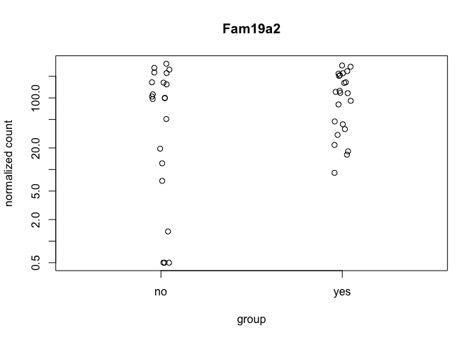

    data <- data.frame(gene = row.names(res),
                       pvalue = -log10(res$padj), 
                       lfc = res$log2FoldChange)
    data <- na.omit(data)
    data <- data %>%
      mutate(color = ifelse(data$lfc > 0 & data$pvalue > 1, 
                            yes = "yes", 
                            no = ifelse(data$lfc < 0 & data$pvalue > 1, 
                                        yes = "no", 
                                        no = "none")))
    top_labelled <- top_n(data, n = 5, wt = lfc)

    contrast1 <- resvals(contrastvector = c("Punch", "CA1", "DG"), mypval = 0.05) # 2556

    ## [1] 2556

    contrast2 <- resvals(contrastvector = c("Punch", "CA1", "CA3"), mypval = 0.05) # 1851

    ## [1] 1851

    contrast3 <- resvals(contrastvector = c("Punch", "CA3", "DG"), mypval = 0.05) # 23541

    ## [1] 3541

    DEGes <- assay(rld)
    DEGes <- cbind(DEGes, contrast1, contrast2, contrast3, contrast4)
    DEGes <- as.data.frame(DEGes) # convert matrix to dataframe
    DEGes$rownames <- rownames(DEGes)  # add the rownames to the dataframe
    DEGes$padjmin <- with(DEGes, pmin(padjPunchCA1DG, padjPunchCA1CA3, padjPunchCA3DG, padjavoidanceyesno)) 
    DEGes <- DEGes %>% filter(padjmin < 0.01)
    rownames(DEGes) <- DEGes$rownames
    drop.cols <-colnames(DEGes[,grep("padj|pval|rownames", colnames(DEGes))])
    DEGes <- DEGes %>% dplyr::select(-one_of(drop.cols))
    DEGes <- as.matrix(DEGes)
    DEGes <- DEGes - rowMeans(DEGes)

    df <- as.data.frame(colData(dds)[,c("avoidance", "Punch")]) ## matrix to df
    rownames(df) <- names(countData)
    ann_colors <- ann_colors8 # see color options 
    DEGes <- as.matrix(DEGes) 
    paletteLength <- 30
    myBreaks <- c(seq(min(DEGes), 0, length.out=ceiling(paletteLength/2) + 1), 
                  seq(max(DEGes)/paletteLength, max(DEGes), length.out=floor(paletteLength/2)))

    pheatmap(DEGes, show_colnames=T, show_rownames = F,
             annotation_col=df, annotation_colors = ann_colors,
             treeheight_row = 0, treeheight_col = 25,
             annotation_row = NA, 
             annotation_legend = FALSE,
             annotation_names_row = FALSE, annotation_names_col = FALSE,
             fontsize = 8, 
             border_color = "grey60" ,
             color = viridis(30),
             cellwidth = 6, 
             clustering_method="average",
             breaks=myBreaks,
             clustering_distance_cols="correlation" 
             )

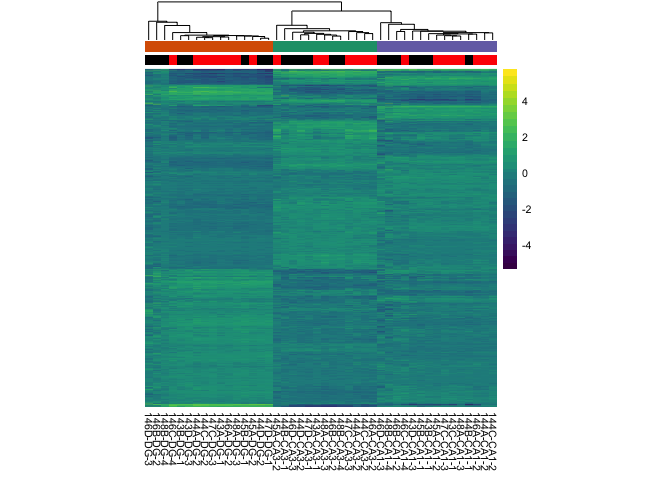

    pheatmap(DEGes, show_colnames=F, show_rownames = F,
             annotation_col=df, annotation_colors = ann_colors, 
             annotation_row = NA, 
             annotation_legend = FALSE,
             annotation_names_row = FALSE, annotation_names_col = FALSE,
             treeheight_row = 0, treeheight_col = 25,
             fontsize = 8, 
             border_color = "grey60" ,
             color = viridis(30),
             height = 3, 
             width = 3,
             clustering_method="average",
             breaks=myBreaks,
             clustering_distance_cols="correlation", 
             filename = "../figures/02d_rnaseqavoidance/pheatmap1.pdf"
             )

    pcadata <- pcadataframe(rld, intgroup=c("Punch","avoidance"), returnData=TRUE)
    percentVar <- round(100 * attr(pcadata, "percentVar"))
    percentVar

    ## [1] 49 21  5  3  2  1  1  1  1

    pcadata$PunchAPA <- as.factor(paste(pcadata$Punch, pcadata$APA2, sep="_"))

    summary(aov(PC1 ~ Punch, data=pcadata)) 

    ##             Df Sum Sq Mean Sq F value Pr(>F)    
    ## Punch        2  16911    8455     252 <2e-16 ***
    ## Residuals   41   1375      34                   
    ## ---
    ## Signif. codes:  0 '***' 0.001 '**' 0.01 '*' 0.05 '.' 0.1 ' ' 1

    TukeyHSD((aov(PC1 ~ Punch, data=pcadata)), which = "Punch") 

    ##   Tukey multiple comparisons of means
    ##     95% family-wise confidence level
    ## 
    ## Fit: aov(formula = PC1 ~ Punch, data = pcadata)
    ## 
    ## $Punch
    ##               diff       lwr      upr     p adj
    ## CA3-CA1 -0.9049664 -6.241943  4.43201 0.9107532
    ## DG-CA1  40.3267065 35.264862 45.38855 0.0000000
    ## DG-CA3  41.2316729 35.972700 46.49065 0.0000000

    summary(aov(PC2 ~ Punch, data=pcadata)) 

    ##             Df Sum Sq Mean Sq F value Pr(>F)    
    ## Punch        2   7529    3765   915.2 <2e-16 ***
    ## Residuals   41    169       4                   
    ## ---
    ## Signif. codes:  0 '***' 0.001 '**' 0.01 '*' 0.05 '.' 0.1 ' ' 1

    TukeyHSD((aov(PC2 ~ Punch, data=pcadata)), which = "Punch") 

    ##   Tukey multiple comparisons of means
    ##     95% family-wise confidence level
    ## 
    ## Fit: aov(formula = PC2 ~ Punch, data = pcadata)
    ## 
    ## $Punch
    ##              diff       lwr       upr p adj
    ## CA3-CA1 -32.87046 -34.73922 -31.00170     0
    ## DG-CA1  -15.92264 -17.69506 -14.15022     0
    ## DG-CA3   16.94782  15.10638  18.78926     0

    summary(aov(PC1 ~ avoidance, data=pcadata)) 

    ##             Df Sum Sq Mean Sq F value Pr(>F)
    ## avoidance    1     50    49.5   0.114  0.737
    ## Residuals   42  18237   434.2

    summary(aov(PC2 ~ avoidance, data=pcadata)) 

    ##             Df Sum Sq Mean Sq F value Pr(>F)
    ## avoidance    1      7    7.34    0.04  0.842
    ## Residuals   42   7690  183.11

    summary(aov(PC3 ~ avoidance, data=pcadata)) 

    ##             Df Sum Sq Mean Sq F value Pr(>F)  
    ## avoidance    1  204.6  204.57    4.86  0.033 *
    ## Residuals   42 1767.7   42.09                 
    ## ---
    ## Signif. codes:  0 '***' 0.001 '**' 0.01 '*' 0.05 '.' 0.1 ' ' 1

    summary(aov(PC4 ~ avoidance, data=pcadata)) 

    ##             Df Sum Sq Mean Sq F value   Pr(>F)    
    ## avoidance    1  388.1   388.1   22.51 2.43e-05 ***
    ## Residuals   42  724.0    17.2                     
    ## ---
    ## Signif. codes:  0 '***' 0.001 '**' 0.01 '*' 0.05 '.' 0.1 ' ' 1

    summary(aov(PC5 ~ avoidance, data=pcadata)) 

    ##             Df Sum Sq Mean Sq F value Pr(>F)
    ## avoidance    1    0.2   0.213   0.014  0.905
    ## Residuals   42  622.1  14.813

    summary(aov(PC6 ~ avoidance, data=pcadata)) 

    ##             Df Sum Sq Mean Sq F value Pr(>F)
    ## avoidance    1    7.3   7.253   0.589  0.447
    ## Residuals   42  517.0  12.310

    pcadata$Punch <- factor(pcadata$Punch, levels=c("DG","CA3", "CA1"))
    pcadata$APA2 <- factor(pcadata$avoidance, levels=c("no","yes"))

    plotPCs <- function(df, xcol, ycol, aescolor, colorname, colorvalues){
      ggplot(df, aes(df[xcol], df[ycol], color=aescolor)) +
        geom_point(size=3, aes(shape=APA2), alpha = 0.5) +
        xlab(paste0("PC", xcol, ": ", percentVar[xcol],"% variance")) +
        ylab(paste0("PC", ycol, ": ", percentVar[ycol],"% variance")) +
        #stat_ellipse(level = 0.95, (aes(color=avoidance)),size=0.25) + 
        scale_colour_manual(name=colorname, values=c(colorvalues))+ 
        theme_cowplot(font_size = 8, line_size = 0.25)  +
        theme(legend.position="none") +
        scale_shape_manual(values=c(16, 1, 15,2), aes(color=colorvalavoidance)) 
    }

    PCA12 <- plotPCs(pcadata, 1, 2, aescolor = pcadata$Punch, colorname = " ", colorvalues = colorvalPunch)
    PCA12

    ## Don't know how to automatically pick scale for object of type data.frame. Defaulting to continuous.

    ## Don't know how to automatically pick scale for object of type data.frame. Defaulting to continuous.

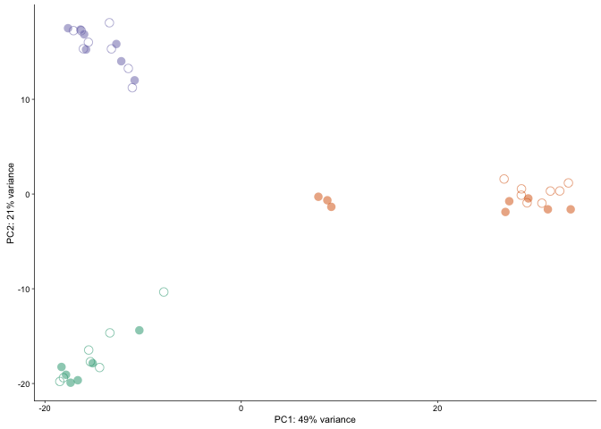

    PCA34 <- plotPCs(pcadata, 3, 4, aescolor = pcadata$Punch, colorname = " ", colorvalues = colorvalPunch)
    PCA34

    ## Don't know how to automatically pick scale for object of type data.frame. Defaulting to continuous.
    ## Don't know how to automatically pick scale for object of type data.frame. Defaulting to continuous.

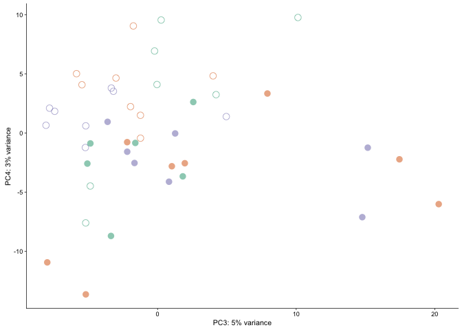

    plotPCs <- function(df, xcol, ycol, aescolor, colorname, colorvalues){
      ggplot(df, aes(df[xcol], df[ycol], color=aescolor)) +
        geom_point(size=3, alpha = 0.5) +
        xlab(paste0("PC", xcol, ": ", percentVar[xcol],"% variance")) +
        ylab(paste0("PC", ycol, ": ", percentVar[ycol],"% variance")) +
        #stat_ellipse(level = 0.95, (aes(color=avoidance)),size=0.25) + 
        scale_colour_manual(name=colorname, values=c(colorvalues))+ 
        theme_cowplot(font_size = 8, line_size = 0.25)  +
        theme(legend.position="none") 
    }

    PCA34 <- plotPCs(pcadata, 3, 4, aescolor = pcadata$avoidance, colorname = " ", colorvalues = colorvalavoidance)
    PCA34

    ## Don't know how to automatically pick scale for object of type data.frame. Defaulting to continuous.
    ## Don't know how to automatically pick scale for object of type data.frame. Defaulting to continuous.

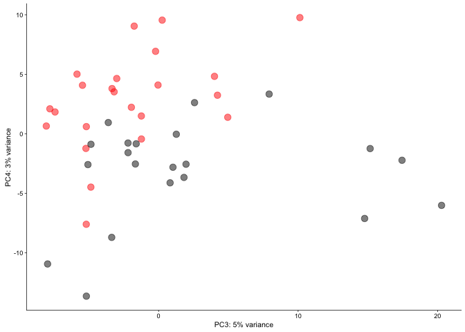

    pdf(file="../figures/02d_rnaseqavoidance/allPCA34.pdf", width=1.5, height=2.5)
    plot(PCA34)

    ## Don't know how to automatically pick scale for object of type data.frame. Defaulting to continuous.
    ## Don't know how to automatically pick scale for object of type data.frame. Defaulting to continuous.

    dev.off()

    ## quartz_off_screen 
    ##                 2

venn diagrams
-------------

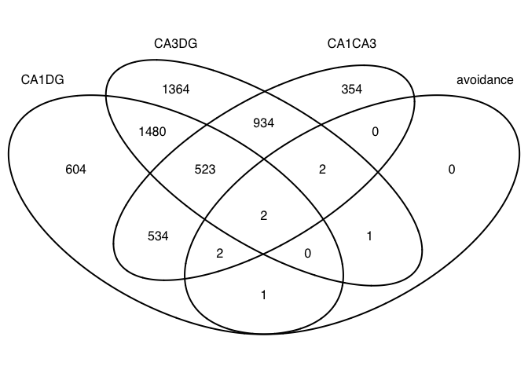
