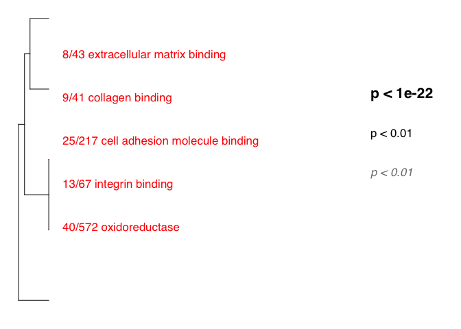
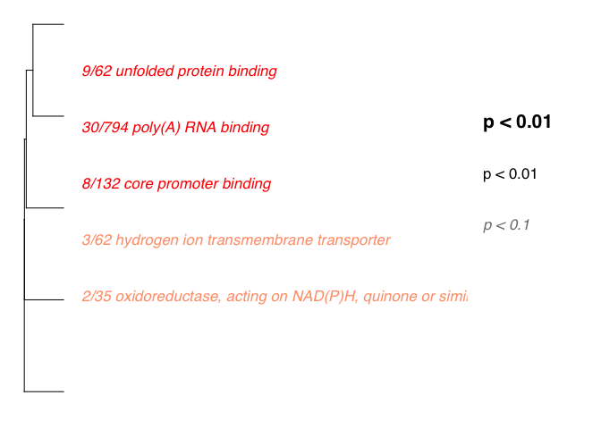

Summary from Mikhail V. Matz <https://github.com/z0on/GO_MWU>
-------------------------------------------------------------

GO\_MWU uses continuous measure of significance (such as fold-change or
-log(p-value) ) to identify GO categories that are significantly
enriches with either up- or down-regulated genes. The advantage - no
need to impose arbitrary significance cutoff.

If the measure is binary (0 or 1) the script will perform a typical "GO
enrichment" analysis based Fisher's exact test: it will show GO
categories over-represented among the genes that have 1 as their
measure. On the plot, different fonts are used to indicate significance
and color indicates enrichment with either up (red) or down (blue)
regulated genes. No colors are shown for binary measure analysis.The
tree on the plot is hierarchical clustering of GO categories based on
shared genes. Categories with no branch length between them are subsets
of each other. The fraction next to GO category name indicates the
fracton of "good" genes in it; "good" genes being the ones exceeding the
arbitrary absValue cutoff (option in gomwuPlot). For Fisher's based
test, specify absValue=0.5. This value does not affect statistics and is
used for plotting only.

NOTES: This program drains memory and creates some very large
intermediate files, especially for the biological process catagory.
First, I run the stats from the command line to make sure its working.
Once I've generated the temp files, I comment out then stats portions
and recreate the plots by kniting the rmd file.

    library(ape)
    source("gomwu.functions.R")

    # set output file for figures 
    knitr::opts_chunk$set(fig.path = '../../figures/02e_RNAseq_GO/')

DG consistent vs. yoked
-----------------------

    ## GO terms dispayed:  16 
    ## "Good genes" accounted for:  81 out of 217 ( 37% )

CA3 consistent yoked
--------------------

    ## GO terms dispayed:  10 
    ## "Good genes" accounted for:  87 out of 301 ( 29% )

CA1 consistent yoked
--------------------

    ## GO terms dispayed:  13 
    ## "Good genes" accounted for:  290 out of 819 ( 35% )

DG conflict vs consistent
-------------------------

    ## GO terms dispayed:  5 
    ## "Good genes" accounted for:  17 out of 133 ( 13% )

CA3 conflict consistent
-----------------------

    ## GO terms dispayed:  8 
    ## "Good genes" accounted for:  30 out of 137 ( 22% )

CA1 consistent yoked
--------------------

    ## GO terms dispayed:  11 
    ## "Good genes" accounted for:  236 out of 737 ( 32% )

DG yoked vs. yoked
------------------

    ## GO terms dispayed:  3 
    ## "Good genes" accounted for:  5 out of 84 ( 6% )

CA3 yoked vs. yoked
-------------------

    ## GO terms dispayed:  3 
    ## "Good genes" accounted for:  14 out of 229 ( 6% )

CA1 yoked vs. yoked
-------------------

    ## GO terms dispayed:  10 
    ## "Good genes" accounted for:  123 out of 429 ( 29% )
