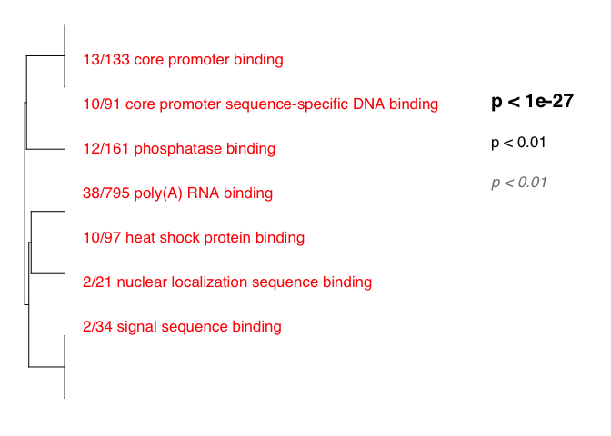
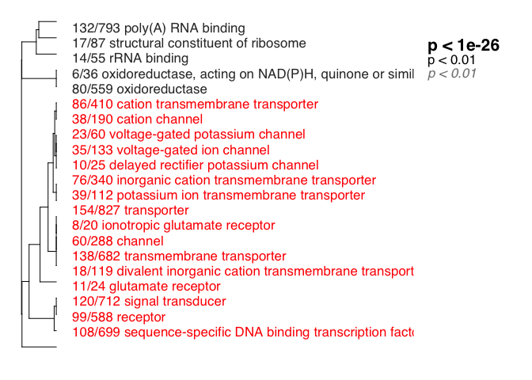
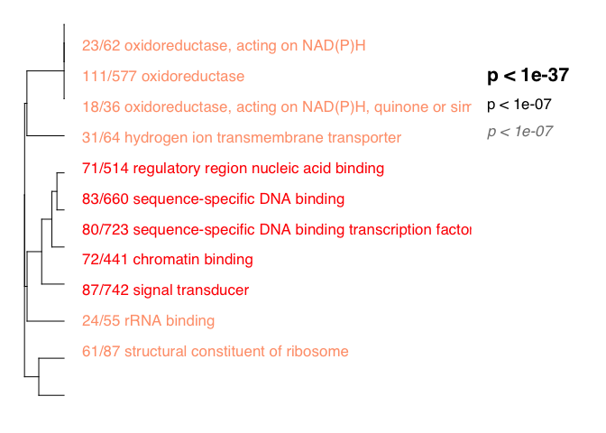
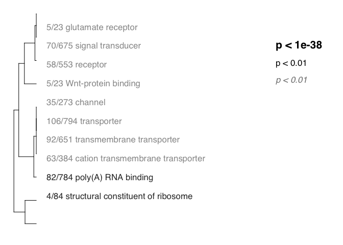

Summary
-------

#### From Mikhail V. Matz <https://github.com/z0on/GO_MWU>

GO\_MWU uses continuous measure of significance (such as fold-change or
-log(p-value) ) to identify GO categories that are significantly
enriches with either up- or down-regulated genes. The advantage - no
need to impose arbitrary significance cutoff.

If the measure is binary (0 or 1) the script will perform a typical "GO
enrichment" analysis based Fisher's exact test: it will show GO
categories over-represented among the genes that have 1 as their
measure. On the plot, different fonts are used to indicate significance
and color indicates enrichment with either up (red) or down (blue)
regulated genes. No colors are shown for binary measure analysis.The
tree on the plot is hierarchical clustering of GO categories based on
shared genes. Categories with no branch length between them are subsets
of each other. The fraction next to GO category name indicates the
fracton of "good" genes in it; "good" genes being the ones exceeding the
arbitrary absValue cutoff (option in results &lt;- gomwuPlot). For
Fisher's based test, specify absValue=0.5. This value does not affect
statistics and is used for plotting only.

NOTES: This program drains memory and creates some very large
intermediate files, especially for the biological process catagory.
First, I run the stats from the command line to make sure its working.
Once I've generated the temp files, I comment out then stats portions
and recreate the plots by kniting the rmd file.

    library(ape) # For GO analysis
    source("gomwu.functions.R")

    library(reshape2) # for splitting column

    # set output file for figures 
    knitr::opts_chunk$set(fig.path = '../../figures/02e_RNAseq_GO/')

DG consistent vs. yoked
-----------------------

    ## GO terms dispayed:  16 
    ## "Good genes" accounted for:  129 out of 439 ( 29% )

CA3 consistent yoked
--------------------

CA1 consistent yoked
--------------------

    ## GO terms dispayed:  13 
    ## "Good genes" accounted for:  498 out of 1511 ( 33% )

DG conflict vs consistent
-------------------------

    ## GO terms dispayed:  5 
    ## "Good genes" accounted for:  49 out of 378 ( 13% )

CA3 conflict consistent
-----------------------

    ## GO terms dispayed:  8 
    ## "Good genes" accounted for:  98 out of 426 ( 23% )

CA1 consistent yoked
--------------------

    ## GO terms dispayed:  11 
    ## "Good genes" accounted for:  433 out of 1430 ( 30% )

DG yoked vs. yoked
------------------

    ## GO terms dispayed:  3 
    ## "Good genes" accounted for:  21 out of 272 ( 8% )

CA3 yoked vs. yoked
-------------------

    ## GO terms dispayed:  3 
    ## "Good genes" accounted for:  28 out of 538 ( 5% )

CA1 yoked vs. yoked
-------------------

    ## GO terms dispayed:  10 
    ## "Good genes" accounted for:  261 out of 969 ( 27% )

GO summary
----------

Bash comands to combine files

    head -1 GO_DGyokedyoked.csv > GO_analysis.csv  #create new analysis by copying the header of a single file`
    cat GO_*.csv | grep -v 'pval' >> GO_analysis.csv # send the contents of each file through grep to remove the header and into the analysis file`

This will print the number of times a GO term appeared in any of the 9
two-way comparaisons.

    library(reshape2)
    GOterms <- read.csv('GO_analysis.csv', colClasses=c("NULL", NA, "NULL",NA, "NULL",NA, NA))
    GOterms$GOterm <- as.character(GOterms$GOterm)
    GOterms$group <- as.factor(paste(GOterms$Punch,GOterms$color,sep="_"))
    GOterms$Punch <- NULL  
    GOterms$color <- NULL
    GOtermsWide <- dcast(GOterms, GOterm ~ group , value.var = "pval")

    ## Aggregation function missing: defaulting to length

    GOtermsWide$rowsums <- rowSums(GOtermsWide[, -1])
    GOtermsWide <- GOtermsWide[c(1,13,2:12)]
    GOtermsWide <- GOtermsWide[order(-GOtermsWide$rowsums),] 
    rownames(GOtermsWide) <- c() #omit rownames
    GOtermsWide[c(1,2)]

    ##                                                                                 GOterm
    ## 1                                      hydrogen ion transmembrane transporter activity
    ## 2                                                                  poly(A) RNA binding
    ## 3                                                           signal transducer activity
    ## 4                                                   structural constituent of ribosome
    ## 5                                                       cell adhesion molecule binding
    ## 6                                                                core promoter binding
    ## 7                                                              oxidoreductase activity
    ## 8  oxidoreductase activity, acting on NAD(P)H, quinone or similar compound as acceptor
    ## 9                                                                    receptor activity
    ## 10                                              regulatory region nucleic acid binding
    ## 11                                                            unfolded protein binding
    ## 12                                                                       amide binding
    ## 13                                           cation transmembrane transporter activity
    ## 14                                                                    channel activity
    ## 15                                                                   chaperone binding
    ## 16                                                                   chromatin binding
    ## 17                                                                    collagen binding
    ## 18                                         core promoter sequence-specific DNA binding
    ## 19                                                                exonuclease activity
    ## 20                                                         glutamate receptor activity
    ## 21                                                          heat shock protein binding
    ## 22                                     mitogen-activated protein kinase kinase binding
    ## 23                                               nuclear localization sequence binding
    ## 24                                              nucleoside diphosphate kinase activity
    ## 25                                          oxidoreductase activity, acting on NAD(P)H
    ## 26                                                                 phosphatase binding
    ## 27                                                             protein complex binding
    ## 28                                                       RNA-dependent ATPase activity
    ## 29                                                                        rRNA binding
    ## 30                                                       sequence-specific DNA binding
    ## 31                         sequence-specific DNA binding transcription factor activity
    ## 32                                                             signal sequence binding
    ## 33                                                        structural molecule activity
    ## 34                                   translation factor activity, nucleic acid binding
    ## 35                                              translation initiation factor activity
    ## 36                                      transmembrane receptor protein kinase activity
    ## 37                                                  transmembrane transporter activity
    ## 38                                                                transporter activity
    ## 39                                                                 Wnt-protein binding
    ##    rowsums
    ## 1        4
    ## 2        4
    ## 3        3
    ## 4        3
    ## 5        2
    ## 6        2
    ## 7        2
    ## 8        2
    ## 9        2
    ## 10       2
    ## 11       2
    ## 12       1
    ## 13       1
    ## 14       1
    ## 15       1
    ## 16       1
    ## 17       1
    ## 18       1
    ## 19       1
    ## 20       1
    ## 21       1
    ## 22       1
    ## 23       1
    ## 24       1
    ## 25       1
    ## 26       1
    ## 27       1
    ## 28       1
    ## 29       1
    ## 30       1
    ## 31       1
    ## 32       1
    ## 33       1
    ## 34       1
    ## 35       1
    ## 36       1
    ## 37       1
    ## 38       1
    ## 39       1
