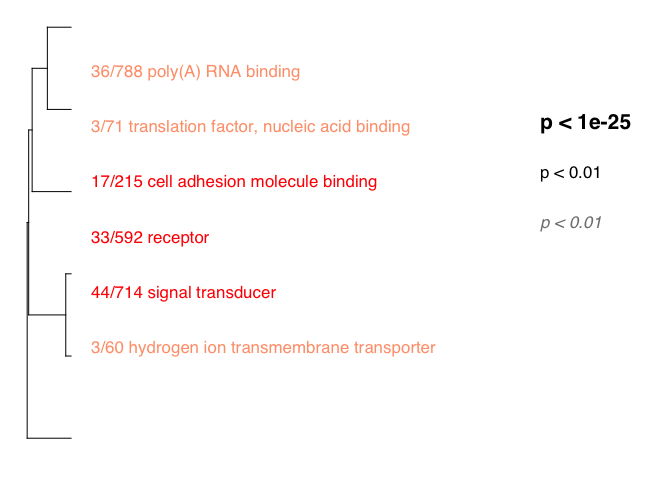
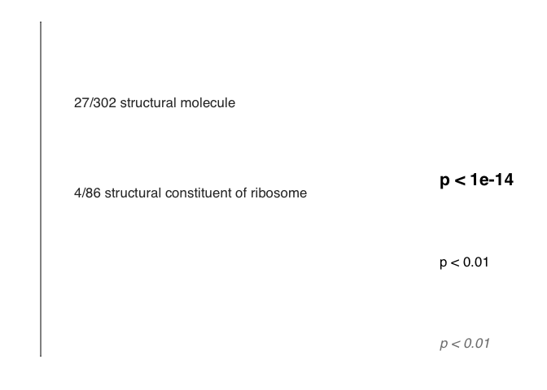

Summary from Mikhail V. Matz <https://github.com/z0on/GO_MWU>
-------------------------------------------------------------

GO\_MWU uses continuous measure of significance (such as fold-change or
-log(p-value) ) to identify GO categories that are significantly
enriches with either up- or down-regulated genes. The advantage - no
need to impose arbitrary significance cutoff.

If the measure is binary (0 or 1) the script will perform a typical "GO
enrichment" analysis based Fisher's exact test: it will show GO
categories over-represented among the genes that have 1 as their
measure. On the plot, different fonts are used to indicate significance
and color indicates enrichment with either up (red) or down (blue)
regulated genes. No colors are shown for binary measure analysis.The
tree on the plot is hierarchical clustering of GO categories based on
shared genes. Categories with no branch length between them are subsets
of each other. The fraction next to GO category name indicates the
fracton of "good" genes in it; "good" genes being the ones exceeding the
arbitrary absValue cutoff (option in results &lt;- gomwuPlot). For
Fisher's based test, specify absValue=0.5. This value does not affect
statistics and is used for plotting only.

NOTES: This program drains memory and creates some very large
intermediate files, especially for the biological process catagory.
First, I run the stats from the command line to make sure its working.
Once I've generated the temp files, I comment out then stats portions
and recreate the plots by kniting the rmd file.

    library(ape)
    source("gomwu.functions.R")

    # set output file for figures 
    knitr::opts_chunk$set(fig.path = '../../figures/02e_RNAseq_GO/')

DG consistent vs. yoked
-----------------------

    ## GO terms dispayed:  16 
    ## "Good genes" accounted for:  81 out of 217 ( 37% )

    ##                                                         pval direction
    ## 0/15 nucleoside diphosphate kinase activity      0.034400973         0
    ## 30/518 regulatory region nucleic acid binding    0.022715734         1
    ## 8/91 core promoter sequence-specific DNA binding 0.008264423         1
    ## 11/133 core promoter binding                     0.006771591         1
    ## 6/161 phosphatase binding                        0.008264423         1
    ## 12/224 cell adhesion molecule binding            0.012122136         1
    ## 3/42 collagen binding                            0.015742325         1
    ## 23/875 protein complex binding                   0.016953571         1
    ## 4/174 amide binding                              0.034400973         1
    ## 1/34 signal sequence binding                     0.008264423         1
    ## 1/21 nuclear localization sequence binding       0.008227883         1
    ## 3/57 RNA-dependent ATPase activity               0.025122183         1
    ## 19/795 poly(A) RNA binding                       0.008264423         1
    ## 9/62 unfolded protein binding                    0.022715734         1
    ## 7/97 heat shock protein binding                  0.008264423         1
    ## 7/57 chaperone binding                           0.038392506         1
    ##                                                   color
    ## 0/15 nucleoside diphosphate kinase activity      grey20
    ## 30/518 regulatory region nucleic acid binding       red
    ## 8/91 core promoter sequence-specific DNA binding    red
    ## 11/133 core promoter binding                        red
    ## 6/161 phosphatase binding                           red
    ## 12/224 cell adhesion molecule binding               red
    ## 3/42 collagen binding                               red
    ## 23/875 protein complex binding                      red
    ## 4/174 amide binding                                 red
    ## 1/34 signal sequence binding                        red
    ## 1/21 nuclear localization sequence binding          red
    ## 3/57 RNA-dependent ATPase activity                  red
    ## 19/795 poly(A) RNA binding                          red
    ## 9/62 unfolded protein binding                       red
    ## 7/97 heat shock protein binding                     red
    ## 7/57 chaperone binding                              red

CA3 consistent yoked
--------------------

CA1 consistent yoked
--------------------

DG conflict vs consistent
-------------------------

    ## GO terms dispayed:  5 
    ## "Good genes" accounted for:  17 out of 133 ( 13% )

    ##                                                                                                pval
    ## 1/35 oxidoreductase activity, acting on NAD(P)H, quinone or similar compound as acceptor 0.01342230
    ## 0/62 hydrogen ion transmembrane transporter activity                                     0.02138576
    ## 4/132 core promoter binding                                                              0.05927912
    ## 8/794 poly(A) RNA binding                                                                0.01342230
    ## 6/62 unfolded protein binding                                                            0.01342230
    ##                                                                                          direction
    ## 1/35 oxidoreductase activity, acting on NAD(P)H, quinone or similar compound as acceptor         1
    ## 0/62 hydrogen ion transmembrane transporter activity                                             1
    ## 4/132 core promoter binding                                                                      0
    ## 8/794 poly(A) RNA binding                                                                        0
    ## 6/62 unfolded protein binding                                                                    0
    ##                                                                                           color
    ## 1/35 oxidoreductase activity, acting on NAD(P)H, quinone or similar compound as acceptor salmon
    ## 0/62 hydrogen ion transmembrane transporter activity                                     salmon
    ## 4/132 core promoter binding                                                                 red
    ## 8/794 poly(A) RNA binding                                                                   red
    ## 6/62 unfolded protein binding                                                               red

CA3 conflict consistent
-----------------------

    ## GO terms dispayed:  8 
    ## "Good genes" accounted for:  30 out of 137 ( 22% )

    ##                                                                pval
    ## 1/60 hydrogen ion transmembrane transporter activity   0.0065328608
    ## 10/592 receptor activity                               0.0000249432
    ## 13/714 signal transducer activity                      0.0000249432
    ## 1/65 transmembrane receptor protein kinase activity    0.0213180794
    ## 7/215 cell adhesion molecule binding                   0.0021872699
    ## 9/788 poly(A) RNA binding                              0.0065328608
    ## 0/42 translation initiation factor activity            0.0205349356
    ## 1/71 translation factor activity, nucleic acid binding 0.0065328608
    ##                                                        direction  color
    ## 1/60 hydrogen ion transmembrane transporter activity           1 salmon
    ## 10/592 receptor activity                                       0    red
    ## 13/714 signal transducer activity                              0    red
    ## 1/65 transmembrane receptor protein kinase activity            0    red
    ## 7/215 cell adhesion molecule binding                           0    red
    ## 9/788 poly(A) RNA binding                                      1 salmon
    ## 0/42 translation initiation factor activity                    1 salmon
    ## 1/71 translation factor activity, nucleic acid binding         1 salmon

CA1 consistent yoked
--------------------

    ## GO terms dispayed:  11 
    ## "Good genes" accounted for:  236 out of 737 ( 32% )

    ##                                                                                                   pval
    ## 46/87 structural constituent of ribosome                                                  1.000000e-15
    ## 19/55 rRNA binding                                                                        2.295711e-08
    ## 42/742 signal transducer activity                                                         7.224174e-08
    ## 35/441 chromatin binding                                                                  6.578668e-09
    ## 39/723 sequence-specific DNA binding transcription factor activity                        1.009023e-11
    ## 37/660 sequence-specific DNA binding                                                      2.554106e-10
    ## 30/514 regulatory region nucleic acid binding                                             1.934084e-08
    ## 23/64 hydrogen ion transmembrane transporter activity                                     1.009023e-11
    ## 13/36 oxidoreductase activity, acting on NAD(P)H, quinone or similar compound as acceptor 1.024700e-11
    ## 54/577 oxidoreductase activity                                                            5.114413e-11
    ## 15/62 oxidoreductase activity, acting on NAD(P)H                                          3.133324e-10
    ##                                                                                           direction
    ## 46/87 structural constituent of ribosome                                                          1
    ## 19/55 rRNA binding                                                                                1
    ## 42/742 signal transducer activity                                                                 0
    ## 35/441 chromatin binding                                                                          0
    ## 39/723 sequence-specific DNA binding transcription factor activity                                0
    ## 37/660 sequence-specific DNA binding                                                              0
    ## 30/514 regulatory region nucleic acid binding                                                     0
    ## 23/64 hydrogen ion transmembrane transporter activity                                             1
    ## 13/36 oxidoreductase activity, acting on NAD(P)H, quinone or similar compound as acceptor         1
    ## 54/577 oxidoreductase activity                                                                    1
    ## 15/62 oxidoreductase activity, acting on NAD(P)H                                                  1
    ##                                                                                                 color
    ## 46/87 structural constituent of ribosome                                                  lightsalmon
    ## 19/55 rRNA binding                                                                        lightsalmon
    ## 42/742 signal transducer activity                                                                 red
    ## 35/441 chromatin binding                                                                          red
    ## 39/723 sequence-specific DNA binding transcription factor activity                                red
    ## 37/660 sequence-specific DNA binding                                                              red
    ## 30/514 regulatory region nucleic acid binding                                                     red
    ## 23/64 hydrogen ion transmembrane transporter activity                                     lightsalmon
    ## 13/36 oxidoreductase activity, acting on NAD(P)H, quinone or similar compound as acceptor lightsalmon
    ## 54/577 oxidoreductase activity                                                            lightsalmon
    ## 15/62 oxidoreductase activity, acting on NAD(P)H                                          lightsalmon

DG yoked vs. yoked
------------------

    ## GO terms dispayed:  3 
    ## "Good genes" accounted for:  5 out of 84 ( 6% )

    ##                                                            pval direction
    ## 0/66 exonuclease activity                            0.07326097         0
    ## 1/61 hydrogen ion transmembrane transporter activity 0.03870962         1
    ## 4/559 oxidoreductase activity                        0.03870962         1
    ##                                                       color
    ## 0/66 exonuclease activity                            grey20
    ## 1/61 hydrogen ion transmembrane transporter activity grey60
    ## 4/559 oxidoreductase activity                        grey60

CA3 yoked vs. yoked
-------------------

    ## GO terms dispayed:  3 
    ## "Good genes" accounted for:  14 out of 229 ( 6% )

    ##                                                              pval
    ## 0/19 mitogen-activated protein kinase kinase binding 6.761026e-02
    ## 0/86 structural constituent of ribosome              8.853225e-14
    ## 14/302 structural molecule activity                  6.359744e-09
    ##                                                      direction  color
    ## 0/19 mitogen-activated protein kinase kinase binding         0 grey20
    ## 0/86 structural constituent of ribosome                      0 grey20
    ## 14/302 structural molecule activity                          0 grey20

CA1 yoked vs. yoked
-------------------

    ## GO terms dispayed:  10 
    ## "Good genes" accounted for:  123 out of 429 ( 29% )

    ##                                                          pval direction
    ## 2/84 structural constituent of ribosome          0.0087913565         0
    ## 36/784 poly(A) RNA binding                       0.0031974326         0
    ## 28/384 cation transmembrane transporter activity 0.0061865781         1
    ## 46/651 transmembrane transporter activity        0.0007044533         1
    ## 54/794 transporter activity                      0.0019686127         1
    ## 17/273 channel activity                          0.0062180224         1
    ## 4/23 Wnt-protein binding                         0.0087913565         1
    ## 33/553 receptor activity                         0.0007044533         1
    ## 35/675 signal transducer activity                0.0061865781         1
    ## 4/23 glutamate receptor activity                 0.0040438334         1
    ##                                                   color
    ## 2/84 structural constituent of ribosome          grey20
    ## 36/784 poly(A) RNA binding                       grey20
    ## 28/384 cation transmembrane transporter activity grey60
    ## 46/651 transmembrane transporter activity        grey60
    ## 54/794 transporter activity                      grey60
    ## 17/273 channel activity                          grey60
    ## 4/23 Wnt-protein binding                         grey60
    ## 33/553 receptor activity                         grey60
    ## 35/675 signal transducer activity                grey60
    ## 4/23 glutamate receptor activity                 grey60
