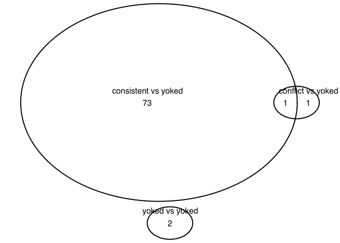
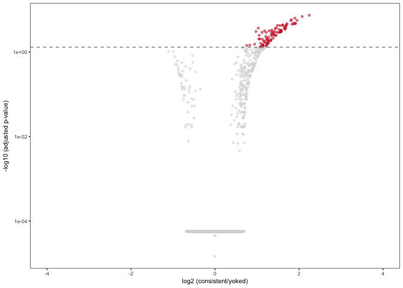
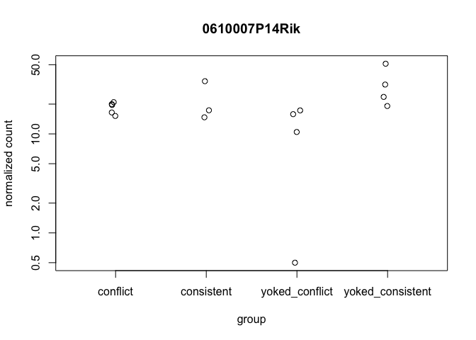
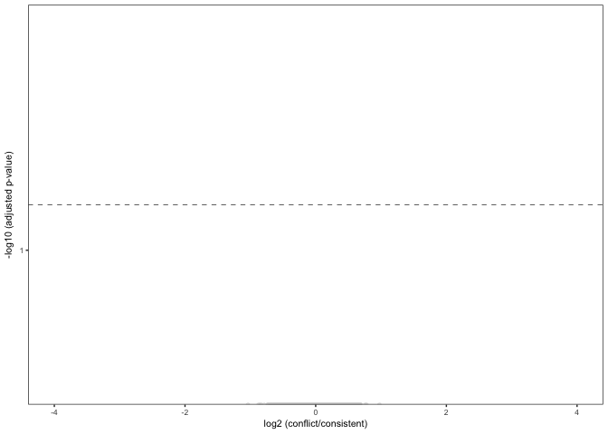
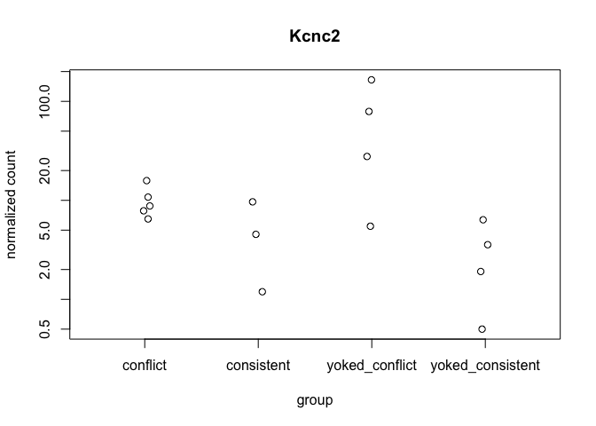
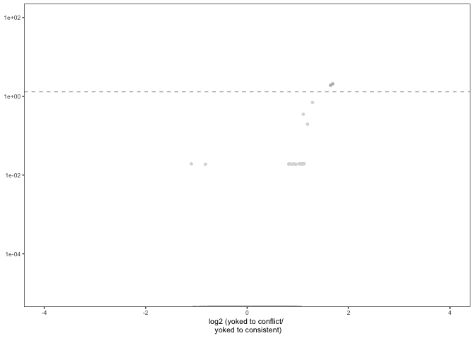

    library(ggplot2) ## for awesome plots!
    library(cowplot) ## for some easy to use themes
    library(dplyr) ## for filtering and selecting rows
    library(car) ## stats
    library(VennDiagram) ## venn diagrams
    library(pheatmap) ## awesome heatmaps
    library(viridis) # for awesome color pallette
    library(reshape2) ## for melting dataframe
    library(DESeq2) ## for gene expression analysis
    library(edgeR)  ## for basic read counts status
    library(magrittr) ## to use the weird pipe
    library(genefilter)  ## for PCA fuction

    ## load functions 
    source("figureoptions.R")
    source("functions_RNAseq.R")

    ## set output file for figures 
    knitr::opts_chunk$set(fig.path = '../figures/02g_RNAseqDG/')

Experimental Design
-------------------

Given the large variance due to hippocampal subfield, I will subset the
data by subfield to look for variation between behavioral treatment
groups. This script focuses on DG.

    ##                APA2   Punch  
    ##  conflict        :5   DG:16  
    ##  consistent      :3          
    ##  yoked_conflict  :4          
    ##  yoked_consistent:4

Overall differential Gene Expression analysis
---------------------------------------------

    ## class: DESeqDataSet 
    ## dim: 22485 16 
    ## metadata(1): version
    ## assays(1): counts
    ## rownames(22485): 0610007P14Rik 0610009B22Rik ... Zzef1 Zzz3
    ## rowData names(0):
    ## colnames(16): 143A-DG-1 143B-DG-1 ... 148A-DG-3 148B-DG-4
    ## colData names(8): RNAseqID Mouse ... APA APA2

    ## class: DESeqDataSet 
    ## dim: 16658 16 
    ## metadata(1): version
    ## assays(1): counts
    ## rownames(16658): 0610007P14Rik 0610009B22Rik ... Zzef1 Zzz3
    ## rowData names(0):
    ## colnames(16): 143A-DG-1 143B-DG-1 ... 148A-DG-3 148B-DG-4
    ## colData names(8): RNAseqID Mouse ... APA APA2

    ## estimating size factors

    ## estimating dispersions

    ## gene-wise dispersion estimates

    ## mean-dispersion relationship

    ## final dispersion estimates

    ## fitting model and testing

    ## class: DESeqTransform 
    ## dim: 6 16 
    ## metadata(1): version
    ## assays(1): ''
    ## rownames(6): 0610007P14Rik 0610009B22Rik ... 0610010F05Rik
    ##   0610010K14Rik
    ## rowData names(37): baseMean baseVar ... deviance maxCooks
    ## colnames(16): 143A-DG-1 143B-DG-1 ... 148A-DG-3 148B-DG-4
    ## colData names(9): RNAseqID Mouse ... APA2 sizeFactor

Principle component analysis
----------------------------

    ## [1] 32 19 12  6  6  4  4  3  3

    ##             Df Sum Sq Mean Sq F value Pr(>F)  
    ## APA2         3  813.7   271.2   3.132 0.0656 .
    ## Residuals   12 1039.2    86.6                 
    ## ---
    ## Signif. codes:  0 '***' 0.001 '**' 0.01 '*' 0.05 '.' 0.1 ' ' 1

    ##   Tukey multiple comparisons of means
    ##     95% family-wise confidence level
    ## 
    ## Fit: aov(formula = PC1 ~ APA2, data = pcadata)
    ## 
    ## $APA2
    ##                                       diff        lwr      upr     p adj
    ## consistent-conflict             -2.7689971 -22.945732 17.40774 0.9761261
    ## yoked_conflict-conflict         13.4961346  -5.037379 32.02965 0.1891702
    ## yoked_consistent-conflict       12.6753558  -5.858158 31.20887 0.2305853
    ## yoked_conflict-consistent       16.2651317  -4.836202 37.36647 0.1553505
    ## yoked_consistent-consistent     15.4443530  -5.656981 36.54569 0.1859964
    ## yoked_consistent-yoked_conflict -0.8207787 -20.356818 18.71526 0.9992658

    ##             Df Sum Sq Mean Sq F value Pr(>F)  
    ## APA2         3  534.4  178.15   3.646 0.0446 *
    ## Residuals   12  586.4   48.87                 
    ## ---
    ## Signif. codes:  0 '***' 0.001 '**' 0.01 '*' 0.05 '.' 0.1 ' ' 1

    ##   Tukey multiple comparisons of means
    ##     95% family-wise confidence level
    ## 
    ## Fit: aov(formula = PC2 ~ APA2, data = pcadata)
    ## 
    ## $APA2
    ##                                      diff        lwr      upr     p adj
    ## consistent-conflict             -4.272112 -19.428740 10.88452 0.8360728
    ## yoked_conflict-conflict          1.598600 -12.323652 15.52085 0.9856949
    ## yoked_consistent-conflict       12.020080  -1.902172 25.94233 0.0994976
    ## yoked_conflict-consistent        5.870712  -9.980469 21.72189 0.6964793
    ## yoked_consistent-consistent     16.292191   0.441010 32.14337 0.0433400
    ## yoked_consistent-yoked_conflict 10.421479  -4.253863 25.09682 0.2052640

    ##             Df Sum Sq Mean Sq F value Pr(>F)
    ## APA2         3  142.6   47.55   1.039   0.41
    ## Residuals   12  549.1   45.76

    ##             Df Sum Sq Mean Sq F value Pr(>F)
    ## APA2         3  54.68   18.23     0.7   0.57
    ## Residuals   12 312.56   26.05

Number of differentially expressed genes per two-way contrast
=============================================================

    #calculate significance of all two way comparisions
    # see source "functions_RNAseq.R" 
    contrast1 <- resvals(contrastvector = c("APA2", "consistent", "yoked_consistent"), mypval = 0.05) # 74

    ## [1] 74

    contrast2 <- resvals(contrastvector = c("APA2", "conflict", "yoked_conflict"), mypval = 0.05) # 2

    ## [1] 2

    contrast3 <- resvals(contrastvector = c("APA2", "conflict", "consistent"), mypval = 0.05) # 0

    ## [1] 0

    contrast4 <- resvals(contrastvector = c("APA2", "yoked_conflict", "yoked_consistent"), mypval = 0.05) # 2

    ## [1] 2

venn diagrams
-------------

Volcano plots
-------------

    ## 
    ## out of 16658 with nonzero total read count
    ## adjusted p-value < 0.05
    ## LFC > 0 (up)     : 90, 0.54% 
    ## LFC < 0 (down)   : 0, 0% 
    ## outliers [1]     : 243, 1.5% 
    ## low counts [2]   : 7555, 45% 
    ## (mean count < 8)
    ## [1] see 'cooksCutoff' argument of ?results
    ## [2] see 'independentFiltering' argument of ?results

    ## log2 fold change (MAP): APA2 consistent vs yoked_consistent 
    ## Wald test p-value: APA2 consistent vs yoked_consistent 
    ## DataFrame with 10 rows and 6 columns
    ##          baseMean log2FoldChange     lfcSE      stat       pvalue
    ##         <numeric>      <numeric> <numeric> <numeric>    <numeric>
    ## Smad7    43.60596       2.243934 0.3239297  6.927226 4.291731e-12
    ## Arc     451.43709       2.074914 0.3112036  6.667386 2.604001e-11
    ## Gm13889 211.75831       1.901352 0.2973011  6.395377 1.601516e-10
    ## Plk2    837.73989       1.817581 0.2943817  6.174232 6.648583e-10
    ## Tiparp   74.00353       1.953596 0.3222962  6.061493 1.348635e-09
    ## Egr1    717.66898       1.807453 0.3013659  5.997537 2.003331e-09
    ## Egr4    693.13346       1.914386 0.3367611  5.684701 1.310414e-08
    ## Homer1   62.85577       1.868668 0.3292508  5.675517 1.382708e-08
    ## Fzd5     13.76731       1.911668 0.3420215  5.589322 2.279580e-08
    ## Lmna     31.66528       1.714228 0.3063322  5.595976 2.193845e-08
    ##                 padj
    ##            <numeric>
    ## Smad7   3.802473e-08
    ## Arc     1.153573e-07
    ## Gm13889 4.729810e-07
    ## Plk2    1.472661e-06
    ## Tiparp  2.389782e-06
    ## Egr1    2.958252e-06
    ## Egr4    1.531349e-05
    ## Homer1  1.531349e-05
    ## Fzd5    2.019708e-05
    ## Lmna    2.019708e-05

    ## quartz_off_screen 
    ##                 2

    ## log2 fold change (MAP): APA2 conflict vs consistent 
    ## Wald test p-value: APA2 conflict vs consistent 
    ## DataFrame with 10 rows and 6 columns
    ##                 baseMean log2FoldChange     lfcSE        stat    pvalue
    ##                <numeric>      <numeric> <numeric>   <numeric> <numeric>
    ## 0610007P14Rik 19.9857247    -0.06960922 0.3076947 -0.22622821 0.8210239
    ## 0610009B22Rik  3.9054655    -0.28438965 0.3320810 -0.85638635 0.3917841
    ## 0610009L18Rik  2.6620072     0.08084757 0.2862827  0.28240468 0.7776332
    ## 0610009O20Rik 48.6332670     0.20335225 0.2497604  0.81418940 0.4155365
    ## 0610010F05Rik  7.7098060    -0.18593681 0.3329729 -0.55841432 0.5765615
    ## 0610010K14Rik  2.2320608     0.13603386 0.3021516  0.45021726 0.6525538
    ## 0610012G03Rik 54.2048370     0.04691216 0.2862676  0.16387518 0.8698294
    ## 0610030E20Rik 45.2268624    -0.07088693 0.2918365 -0.24289945 0.8080833
    ## 0610037L13Rik  9.1462863     0.00820131 0.3370921  0.02432959 0.9805897
    ## 0610040J01Rik  0.6723497    -0.09758928 0.2179934 -0.44767072 0.6543909
    ##                    padj
    ##               <numeric>
    ## 0610007P14Rik         1
    ## 0610009B22Rik         1
    ## 0610009L18Rik         1
    ## 0610009O20Rik         1
    ## 0610010F05Rik         1
    ## 0610010K14Rik         1
    ## 0610012G03Rik         1
    ## 0610030E20Rik         1
    ## 0610037L13Rik         1
    ## 0610040J01Rik         1

    ## 
    ## out of 16658 with nonzero total read count
    ## adjusted p-value < 0.05
    ## LFC > 0 (up)     : 0, 0% 
    ## LFC < 0 (down)   : 0, 0% 
    ## outliers [1]     : 243, 1.5% 
    ## low counts [2]   : 0, 0% 
    ## (mean count < 0)
    ## [1] see 'cooksCutoff' argument of ?results
    ## [2] see 'independentFiltering' argument of ?results

    ## quartz_off_screen 
    ##                 2

    ## log2 fold change (MAP): APA2 yoked_conflict vs yoked_consistent 
    ## Wald test p-value: APA2 yoked_conflict vs yoked_consistent 
    ## DataFrame with 10 rows and 6 columns
    ##         baseMean log2FoldChange     lfcSE      stat       pvalue
    ##        <numeric>      <numeric> <numeric> <numeric>    <numeric>
    ## Kcnc2   21.66879       1.688348 0.3364518  5.018098 5.218566e-07
    ## Gm2115  19.01205       1.647117 0.3421573  4.813917 1.480001e-06
    ## Cxcl14  59.02066       1.288228 0.3121196  4.127355 3.669591e-05
    ## Sdc4    49.08806       1.107216 0.2860926  3.870133 1.087762e-04
    ## Cnr1    59.69861       1.190983 0.3196014  3.726463 1.941856e-04
    ## Cpe    835.63422       0.840981 0.2516239  3.342214 8.311299e-04
    ## Csrnp1 100.83372       1.092850 0.3213831  3.400460 6.727256e-04
    ## Dner    16.46346       1.083347 0.3336218  3.247230 1.165340e-03
    ## Endod1  66.94762       1.054545 0.3195395  3.300204 9.661474e-04
    ## Ezr     59.17799       1.024955 0.2929115  3.499197 4.666610e-04
    ##               padj
    ##          <numeric>
    ## Kcnc2  0.008566277
    ## Gm2115 0.012147109
    ## Cxcl14 0.200787772
    ## Sdc4   0.446390373
    ## Cnr1   0.637511391
    ## Cpe    0.956453037
    ## Csrnp1 0.956453037
    ## Dner   0.956453037
    ## Endod1 0.956453037
    ## Ezr    0.956453037

    ## 
    ## out of 16658 with nonzero total read count
    ## adjusted p-value < 0.05
    ## LFC > 0 (up)     : 2, 0.012% 
    ## LFC < 0 (down)   : 0, 0% 
    ## outliers [1]     : 243, 1.5% 
    ## low counts [2]   : 0, 0% 
    ## (mean count < 0)
    ## [1] see 'cooksCutoff' argument of ?results
    ## [2] see 'independentFiltering' argument of ?results

    ## quartz_off_screen 
    ##                 2
