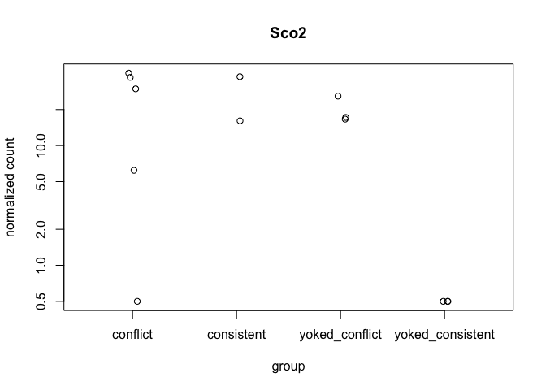
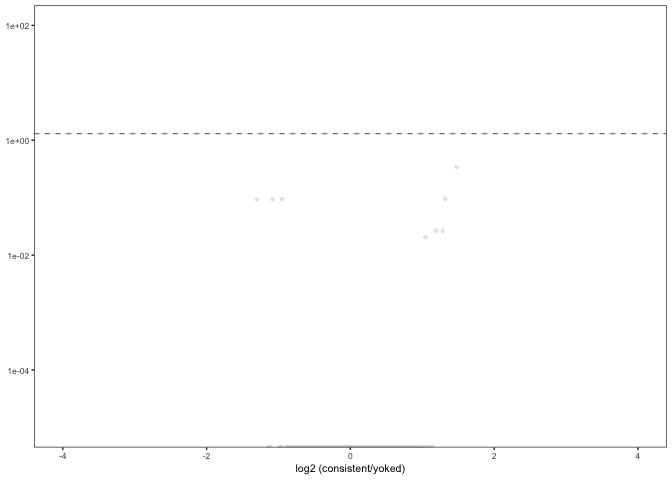
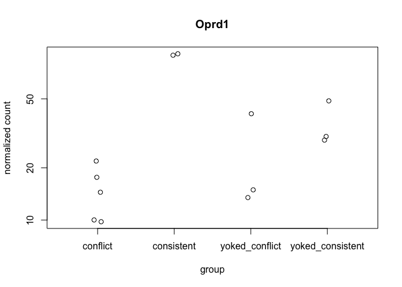
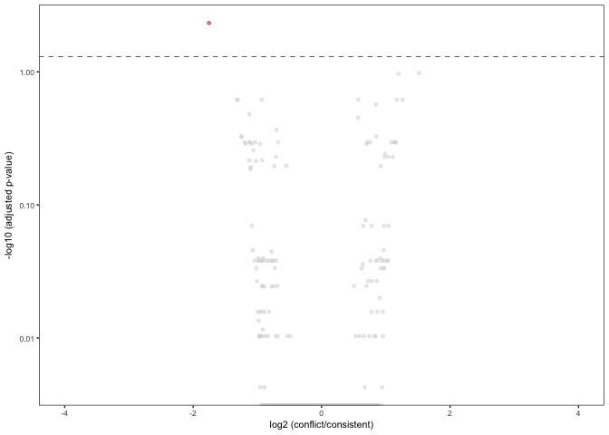
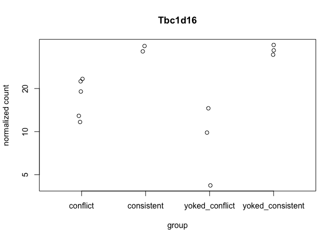
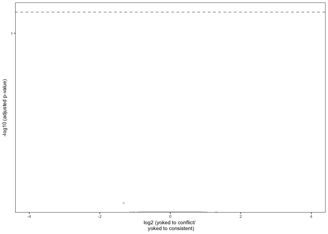

    library(ggplot2) ## for awesome plots!
    library(cowplot) ## for some easy to use themes
    library(dplyr) ## for filtering and selecting rows
    library(car) ## stats
    library(VennDiagram) ## venn diagrams
    library(pheatmap) ## awesome heatmaps
    library(viridis) # for awesome color pallette
    library(reshape2) ## for melting dataframe
    library(DESeq2) ## for gene expression analysis
    library(edgeR)  ## for basic read counts status
    library(magrittr) ## to use the weird pipe
    library(genefilter)  ## for PCA fuction

    ## load functions 
    source("figureoptions.R")
    source("functions_RNAseq.R")

    ## set output file for figures 
    knitr::opts_chunk$set(fig.path = '../figures/02h_RNAseqCA3/')

Experimental Design
-------------------

Given the large variance due to hippocampal subfield, I will subset the
data by subfield to look for variation between behavioral treatment
groups. This script focuses on DG.

    ##                APA2   Punch   
    ##  conflict        :5   CA3:13  
    ##  consistent      :2           
    ##  yoked_conflict  :3           
    ##  yoked_consistent:3

Overall differential Gene Expression analysis
---------------------------------------------

    ## class: DESeqDataSet 
    ## dim: 22485 13 
    ## metadata(1): version
    ## assays(1): counts
    ## rownames(22485): 0610007P14Rik 0610009B22Rik ... Zzef1 Zzz3
    ## rowData names(0):
    ## colnames(13): 143A-CA3-1 144A-CA3-2 ... 148A-CA3-3 148B-CA3-4
    ## colData names(8): RNAseqID Mouse ... APA APA2

    ## class: DESeqDataSet 
    ## dim: 16208 13 
    ## metadata(1): version
    ## assays(1): counts
    ## rownames(16208): 0610007P14Rik 0610009B22Rik ... Zzef1 Zzz3
    ## rowData names(0):
    ## colnames(13): 143A-CA3-1 144A-CA3-2 ... 148A-CA3-3 148B-CA3-4
    ## colData names(8): RNAseqID Mouse ... APA APA2

    ## estimating size factors

    ## estimating dispersions

    ## gene-wise dispersion estimates

    ## mean-dispersion relationship

    ## final dispersion estimates

    ## fitting model and testing

    ## class: DESeqTransform 
    ## dim: 6 13 
    ## metadata(1): version
    ## assays(1): ''
    ## rownames(6): 0610007P14Rik 0610009B22Rik ... 0610010F05Rik
    ##   0610010K14Rik
    ## rowData names(37): baseMean baseVar ... deviance maxCooks
    ## colnames(13): 143A-CA3-1 144A-CA3-2 ... 148A-CA3-3 148B-CA3-4
    ## colData names(9): RNAseqID Mouse ... APA2 sizeFactor

Principle component analysis
----------------------------

    ## [1] 40 14 10  8  7  4  4  3  3

    ##             Df Sum Sq Mean Sq F value Pr(>F)
    ## APA2         3  230.7   76.91   1.147  0.382
    ## Residuals    9  603.5   67.05

    ##             Df Sum Sq Mean Sq F value Pr(>F)
    ## APA2         3  27.13   9.045   0.313  0.815
    ## Residuals    9 259.81  28.868

    ##             Df Sum Sq Mean Sq F value Pr(>F)
    ## APA2         3   7.86   2.621    0.12  0.946
    ## Residuals    9 195.88  21.764

    ##             Df Sum Sq Mean Sq F value Pr(>F)  
    ## APA2         3 108.42   36.14   5.252 0.0228 *
    ## Residuals    9  61.94    6.88                 
    ## ---
    ## Signif. codes:  0 '***' 0.001 '**' 0.01 '*' 0.05 '.' 0.1 ' ' 1

    ##   Tukey multiple comparisons of means
    ##     95% family-wise confidence level
    ## 
    ## Fit: aov(formula = PC4 ~ APA2, data = pcadata)
    ## 
    ## $APA2
    ##                                       diff         lwr       upr     p adj
    ## consistent-conflict              6.1658825  -0.6859095 13.017675 0.0799758
    ## yoked_conflict-conflict          3.0772800  -2.9034544  9.058014 0.4218604
    ## yoked_consistent-conflict        6.8331673   0.8524329 12.813902 0.0256649
    ## yoked_conflict-consistent       -3.0886025 -10.5645205  4.387315 0.5910148
    ## yoked_consistent-consistent      0.6672848  -6.8086332  8.143203 0.9919192
    ## yoked_consistent-yoked_conflict  3.7558873  -2.9307770 10.442552 0.3532822

Number of differentially expressed genes per two-way contrast
=============================================================

    #calculate significance of all two way comparisions
    # see source "functions_RNAseq.R" 
    contrast1 <- resvals(contrastvector = c("APA2", "consistent", "yoked_consistent"), mypval = 0.05) # 0

    ## [1] 0

    contrast2 <- resvals(contrastvector = c("APA2", "conflict", "yoked_conflict"), mypval = 0.05) # 0

    ## [1] 0

    contrast3 <- resvals(contrastvector = c("APA2", "conflict", "consistent"), mypval = 0.05) # 1

    ## [1] 1

    contrast4 <- resvals(contrastvector = c("APA2", "yoked_conflict", "yoked_consistent"), mypval = 0.05) # 0

    ## [1] 0

Volcano plots
-------------

    ## 
    ## out of 16208 with nonzero total read count
    ## adjusted p-value < 0.05
    ## LFC > 0 (up)     : 0, 0% 
    ## LFC < 0 (down)   : 0, 0% 
    ## outliers [1]     : 253, 1.6% 
    ## low counts [2]   : 0, 0% 
    ## (mean count < 0)
    ## [1] see 'cooksCutoff' argument of ?results
    ## [2] see 'independentFiltering' argument of ?results

    ## log2 fold change (MAP): APA2 consistent vs yoked_consistent 
    ## Wald test p-value: APA2 consistent vs yoked_consistent 
    ## DataFrame with 10 rows and 6 columns
    ##                 baseMean log2FoldChange     lfcSE       stat       pvalue
    ##                <numeric>      <numeric> <numeric>  <numeric>    <numeric>
    ## Sco2           17.100564      1.4779957 0.3531628  4.1850261 2.851333e-05
    ## 2900026A02Rik 119.066102     -0.9501203 0.2555939 -3.7173047 2.013595e-04
    ## Slc9a2         55.359865     -1.0856815 0.2903181 -3.7396272 1.842934e-04
    ## Tiparp         24.632418      1.3201334 0.3527558  3.7423439 1.823118e-04
    ## Crnkl1         21.852103     -1.2980801 0.3547261 -3.6593871 2.528192e-04
    ## Rhpn2           5.547833      1.2865065 0.3604776  3.5688946 3.584906e-04
    ## Sod3           23.106068      1.1924079 0.3376223  3.5317802 4.127722e-04
    ## Ctsk            3.092865      1.0411666 0.2981028  3.4926428 4.782659e-04
    ## 0610007P14Rik  24.841302      0.1976711 0.3412308  0.5792885 5.623945e-01
    ## 0610009B22Rik  10.482645      0.2862644 0.3578940  0.7998581 4.237930e-01
    ##                    padj
    ##               <numeric>
    ## Sco2          0.4549302
    ## 2900026A02Rik 0.8031728
    ## Slc9a2        0.8031728
    ## Tiparp        0.8031728
    ## Crnkl1        0.8067461
    ## Rhpn2         0.9408258
    ## Sod3          0.9408258
    ## Ctsk          0.9538415
    ## 0610007P14Rik 1.0000000
    ## 0610009B22Rik 1.0000000

    ## quartz_off_screen 
    ##                 2

    ## log2 fold change (MAP): APA2 conflict vs consistent 
    ## Wald test p-value: APA2 conflict vs consistent 
    ## DataFrame with 10 rows and 6 columns
    ##            baseMean log2FoldChange     lfcSE      stat       pvalue
    ##           <numeric>      <numeric> <numeric> <numeric>    <numeric>
    ## Oprd1     32.675458     -1.7521606 0.3417454 -5.127093 2.942495e-07
    ## Crnkl1    21.852103      1.5190789 0.3485183  4.358678 1.308508e-05
    ## Slc9a2    55.359865      1.1984986 0.2811642  4.262630 2.020353e-05
    ## AI593442 185.690776     -0.9295524 0.2422477 -3.837198 1.244460e-04
    ## Arhgef25 402.229363      0.5706702 0.1495924  3.814834 1.362746e-04
    ## Lrrk2     41.083306     -1.3029995 0.3373856 -3.862049 1.124402e-04
    ## Mkrn2     67.469380      1.1705711 0.2965708  3.947021 7.912959e-05
    ## Rac2       5.627835     -1.3225855 0.3400107 -3.889835 1.003123e-04
    ## Zfp804a   44.225880      1.2615796 0.3272517  3.855074 1.156946e-04
    ## Vps52     88.938944      0.8445463 0.2246018  3.760195 1.697812e-04
    ##                 padj
    ##            <numeric>
    ## Oprd1    0.004694751
    ## Crnkl1   0.104386197
    ## Slc9a2   0.107449104
    ## AI593442 0.241584610
    ## Arhgef25 0.241584610
    ## Lrrk2    0.241584610
    ## Mkrn2    0.241584610
    ## Rac2     0.241584610
    ## Zfp804a  0.241584610
    ## Vps52    0.270885982

    ## 
    ## out of 16208 with nonzero total read count
    ## adjusted p-value < 0.05
    ## LFC > 0 (up)     : 0, 0% 
    ## LFC < 0 (down)   : 1, 0.0062% 
    ## outliers [1]     : 253, 1.6% 
    ## low counts [2]   : 0, 0% 
    ## (mean count < 0)
    ## [1] see 'cooksCutoff' argument of ?results
    ## [2] see 'independentFiltering' argument of ?results

    ## quartz_off_screen 
    ##                 2

    ## log2 fold change (MAP): APA2 yoked_conflict vs yoked_consistent 
    ## Wald test p-value: APA2 yoked_conflict vs yoked_consistent 
    ## DataFrame with 10 rows and 6 columns
    ##                baseMean log2FoldChange     lfcSE        stat      pvalue
    ##               <numeric>      <numeric> <numeric>   <numeric>   <numeric>
    ## Tbc1d16       23.017117    -1.32135164 0.3248120 -4.06805102 0.000047408
    ## 0610007P14Rik 24.841302     0.22745828 0.3296874  0.68992103 0.490243847
    ## 0610009B22Rik 10.482645     0.43231560 0.3620565  1.19405549 0.232456264
    ## 0610009L18Rik  5.960207    -0.02440046 0.3530251 -0.06911821 0.944895523
    ## 0610009O20Rik 55.086602    -0.05220060 0.2698375 -0.19345199 0.846605003
    ## 0610010F05Rik 10.326053    -0.09642005 0.3440866 -0.28022028 0.779308507
    ## 0610010K14Rik  1.461658     0.21828869 0.2883972  0.75690287 0.449108055
    ## 0610012G03Rik 69.921565    -0.30560142 0.3083870 -0.99096729 0.321701555
    ## 0610030E20Rik 33.109560     0.12596757 0.3593282  0.35056408 0.725915408
    ## 0610037L13Rik  7.365897     0.30777483 0.3565640  0.86316859 0.388044783
    ##                    padj
    ##               <numeric>
    ## Tbc1d16       0.7563947
    ## 0610007P14Rik 1.0000000
    ## 0610009B22Rik 1.0000000
    ## 0610009L18Rik 1.0000000
    ## 0610009O20Rik 1.0000000
    ## 0610010F05Rik 1.0000000
    ## 0610010K14Rik 1.0000000
    ## 0610012G03Rik 1.0000000
    ## 0610030E20Rik 1.0000000
    ## 0610037L13Rik 1.0000000

    ## 
    ## out of 16208 with nonzero total read count
    ## adjusted p-value < 0.05
    ## LFC > 0 (up)     : 0, 0% 
    ## LFC < 0 (down)   : 0, 0% 
    ## outliers [1]     : 253, 1.6% 
    ## low counts [2]   : 0, 0% 
    ## (mean count < 0)
    ## [1] see 'cooksCutoff' argument of ?results
    ## [2] see 'independentFiltering' argument of ?results

    ## quartz_off_screen 
    ##                 2
