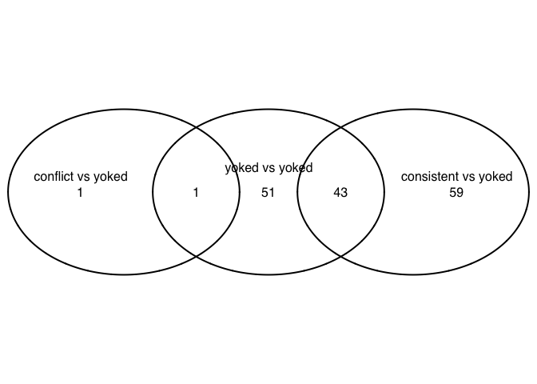
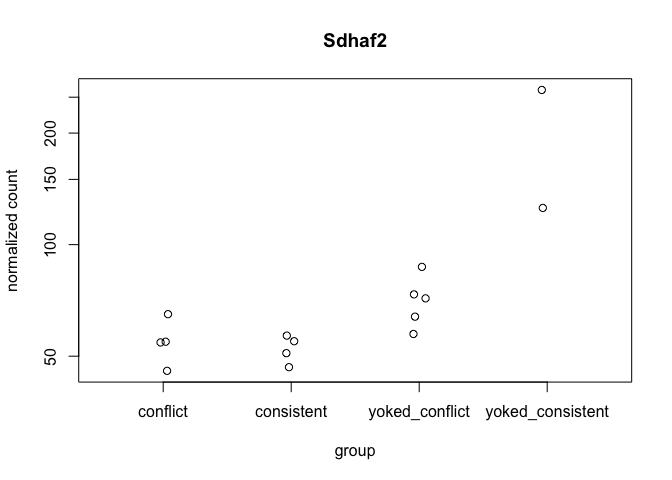
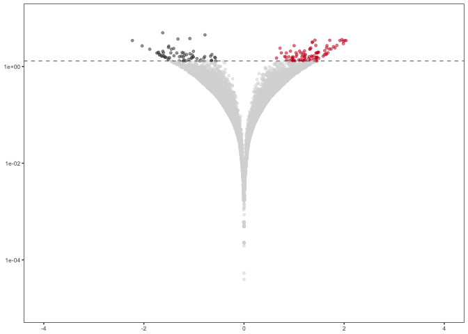
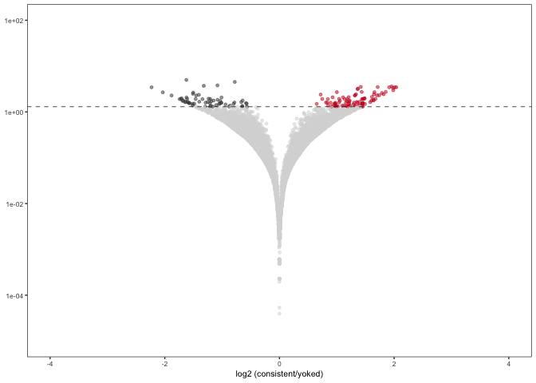
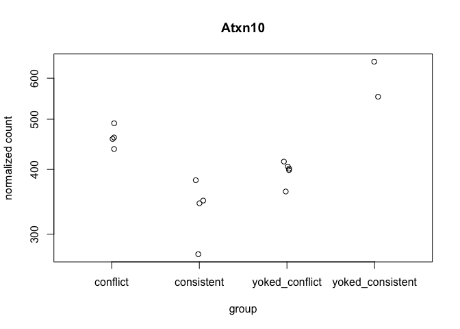
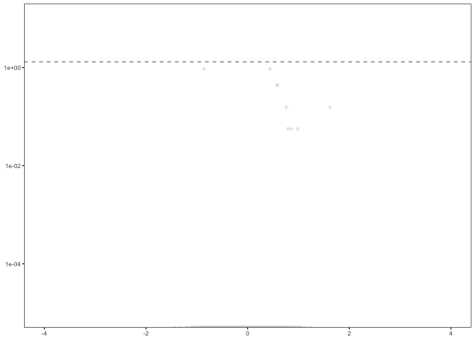
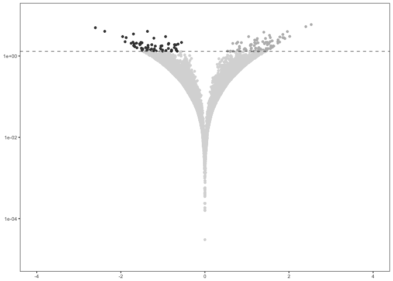
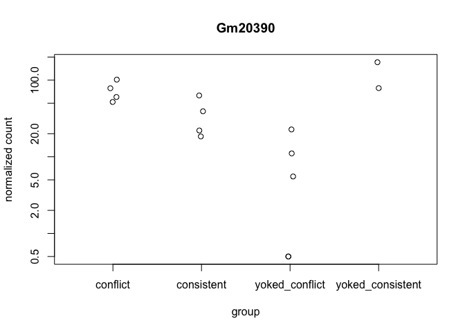
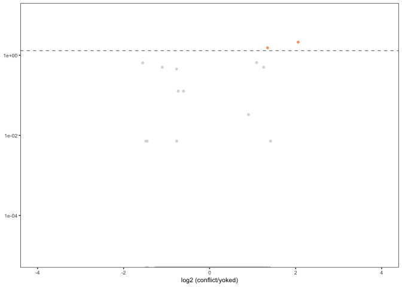

    library(ggplot2) ## for awesome plots!
    library(cowplot) ## for some easy to use themes
    library(dplyr) ## for filtering and selecting rows
    library(car) ## stats
    library(VennDiagram) ## venn diagrams
    library(pheatmap) ## awesome heatmaps
    library(viridis) # for awesome color pallette
    library(reshape2) ## for melting dataframe
    library(DESeq2) ## for gene expression analysis
    library(edgeR)  ## for basic read counts status
    library(magrittr) ## to use the weird pipe
    library(genefilter)  ## for PCA fuction

    ## load functions 
    source("figureoptions.R")
    source("functions_RNAseq.R")

    ## set output file for figures 
    knitr::opts_chunk$set(fig.path = '../figures/02i_RNAseqCA1/')

Experimental Design
-------------------

Given the large variance due to hippocampal subfield, I will subset the
data by subfield to look for variation between behavioral treatment
groups. This script focuses on DG.

    ##                APA2   Punch   
    ##  conflict        :4   CA1:15  
    ##  consistent      :4           
    ##  yoked_conflict  :5           
    ##  yoked_consistent:2

Overall differential Gene Expression analysis
---------------------------------------------

    ## create DESeq object using the factors Punch and APA
    dds <- DESeqDataSetFromMatrix(countData = countData,
                                  colData = colData,
                                  design = ~ APA2)

    dds # view the DESeq object - note numnber of genes

    ## class: DESeqDataSet 
    ## dim: 22485 15 
    ## metadata(1): version
    ## assays(1): counts
    ## rownames(22485): 0610007P14Rik 0610009B22Rik ... Zzef1 Zzz3
    ## rowData names(0):
    ## colnames(15): 143B-CA1-1 143C-CA1-1 ... 148A-CA1-3 148B-CA1-4
    ## colData names(8): RNAseqID Mouse ... APA APA2

    dds <- dds[ rowSums(counts(dds)) > 1, ]  # Pre-filtering genes with 0 counts
    dds # view number of genes afternormalization and the number of samples

    ## class: DESeqDataSet 
    ## dim: 16467 15 
    ## metadata(1): version
    ## assays(1): counts
    ## rownames(16467): 0610007P14Rik 0610009B22Rik ... Zzef1 Zzz3
    ## rowData names(0):
    ## colnames(15): 143B-CA1-1 143C-CA1-1 ... 148A-CA1-3 148B-CA1-4
    ## colData names(8): RNAseqID Mouse ... APA APA2

    dds <- DESeq(dds) # Differential expression analysis

    ## estimating size factors

    ## estimating dispersions

    ## gene-wise dispersion estimates

    ## mean-dispersion relationship

    ## final dispersion estimates

    ## fitting model and testing

    rld <- rlog(dds, blind=FALSE) ## log transformed data
    vsd <- varianceStabilizingTransformation(dds, blind=F) ## variance stabilized
    colnames(vsd) = colData$RNAseqID 
    head(vsd)

    ## class: DESeqTransform 
    ## dim: 6 15 
    ## metadata(1): version
    ## assays(1): ''
    ## rownames(6): 0610007P14Rik 0610009B22Rik ... 0610010F05Rik
    ##   0610010K14Rik
    ## rowData names(37): baseMean baseVar ... deviance maxCooks
    ## colnames(15): 143B-CA1-1 143C-CA1-1 ... 148A-CA1-3 148B-CA1-4
    ## colData names(9): RNAseqID Mouse ... APA2 sizeFactor

Number of differentially expressed genes per two-way contrast
=============================================================

    #calculate significance of all two way comparisions
    # see source "functions_RNAseq.R" 
    contrast1 <- resvals(contrastvector = c("APA2", "consistent", "yoked_consistent"), mypval = 0.05) # 102

    ## [1] 102

    contrast2 <- resvals(contrastvector = c("APA2", "conflict", "yoked_conflict"), mypval = 0.05) # 2

    ## [1] 2

    contrast3 <- resvals(contrastvector = c("APA2", "conflict", "consistent"), mypval = 0.05) # 0

    ## [1] 0

    contrast4 <- resvals(contrastvector = c("APA2", "yoked_conflict", "yoked_consistent"), mypval = 0.05) # 95

    ## [1] 95

    contrast5 <- resvals(contrastvector = c("APA2", "consistent", "yoked_conflict"), mypval = 0.05) # 0

    ## [1] 0

    contrast6 <- resvals(contrastvector = c("APA2", "conflict", "yoked_consistent"), mypval = 0.05) # 70

    ## [1] 70

venn diagrams
-------------

Volcano plots
-------------

    ## 
    ## out of 16467 with nonzero total read count
    ## adjusted p-value < 0.05
    ## LFC > 0 (up)     : 92, 0.56% 
    ## LFC < 0 (down)   : 61, 0.37% 
    ## outliers [1]     : 224, 1.4% 
    ## low counts [2]   : 7777, 47% 
    ## (mean count < 10)
    ## [1] see 'cooksCutoff' argument of ?results
    ## [2] see 'independentFiltering' argument of ?results

    ## log2 fold change (MAP): APA2 consistent vs yoked_consistent 
    ## Wald test p-value: APA2 consistent vs yoked_consistent 
    ## DataFrame with 10 rows and 6 columns
    ##          baseMean log2FoldChange     lfcSE      stat       pvalue
    ##         <numeric>      <numeric> <numeric> <numeric>    <numeric>
    ## Sdhaf2   77.47573     -1.6237013 0.2671405 -6.078080 1.216304e-09
    ## Atxn10  424.62222     -0.7796777 0.1348263 -5.782831 7.345397e-09
    ## Gpd1    125.03372     -1.0809972 0.1990914 -5.429654 5.646341e-08
    ## Tmem199  46.86081     -1.3196054 0.2470488 -5.341477 9.219227e-08
    ## Scn4b   127.70755      1.9556735 0.3721138  5.255580 1.475590e-07
    ## Nek9     97.20999      1.4182583 0.2734691  5.186174 2.146587e-07
    ## Dcaf12   57.49751      1.7126952 0.3327790  5.146644 2.651880e-07
    ## Adamts1  57.33093      1.9135891 0.3767008  5.079864 3.777042e-07
    ## Fbxo32   29.74609      2.0375774 0.4031630  5.053979 4.326984e-07
    ## Inhbb    18.95224     -2.2297740 0.4421761 -5.042728 4.589410e-07
    ##                 padj
    ##            <numeric>
    ## Sdhaf2  1.029723e-05
    ## Atxn10  3.109306e-05
    ## Gpd1    1.593397e-04
    ## Tmem199 1.951249e-04
    ## Scn4b   2.498469e-04
    ## Nek9    3.028835e-04
    ## Dcaf12  3.207260e-04
    ## Adamts1 3.532177e-04
    ## Fbxo32  3.532177e-04
    ## Inhbb   3.532177e-04

    ## quartz_off_screen 
    ##                 2

    ## quartz_off_screen 
    ##                 2

    ## log2 fold change (MAP): APA2 conflict vs consistent 
    ## Wald test p-value: APA2 conflict vs consistent 
    ## DataFrame with 10 rows and 6 columns
    ##                 baseMean log2FoldChange     lfcSE       stat       pvalue
    ##                <numeric>      <numeric> <numeric>  <numeric>    <numeric>
    ## Atxn10        424.622216      0.4366100 0.1005423  4.3425509 1.408378e-05
    ## Csmd2         143.985087     -0.8608025 0.1984326 -4.3380099 1.437787e-05
    ## Atp6v0c       236.464913      0.5837507 0.1472534  3.9642593 7.362418e-05
    ## Pebp1         233.464322      0.5837170 0.1490405  3.9164991 8.984416e-05
    ## Gm527           7.378619      1.6190437 0.4431466  3.6535170 2.586727e-04
    ## Rps3           82.173297      0.7601365 0.2077222  3.6593894 2.528169e-04
    ## Psmb3          79.909536      0.7888939 0.2261600  3.4882117 4.862629e-04
    ## Rpl36          96.378329      0.9851858 0.2824526  3.4879685 4.867054e-04
    ## Znhit2         47.306160      0.8548162 0.2415927  3.5382536 4.027830e-04
    ## 0610007P14Rik  20.262198      0.1937278 0.2905131  0.6668472 5.048697e-01
    ##                    padj
    ##               <numeric>
    ## Atxn10        0.1167699
    ## Csmd2         0.1167699
    ## Atp6v0c       0.3648347
    ## Pebp1         0.3648347
    ## Gm527         0.7002700
    ## Rps3          0.7002700
    ## Psmb3         0.8783951
    ## Rpl36         0.8783951
    ## Znhit2        0.8783951
    ## 0610007P14Rik 1.0000000

    ## 
    ## out of 16467 with nonzero total read count
    ## adjusted p-value < 0.05
    ## LFC > 0 (up)     : 0, 0% 
    ## LFC < 0 (down)   : 0, 0% 
    ## outliers [1]     : 224, 1.4% 
    ## low counts [2]   : 0, 0% 
    ## (mean count < 0)
    ## [1] see 'cooksCutoff' argument of ?results
    ## [2] see 'independentFiltering' argument of ?results

    ## quartz_off_screen 
    ##                 2

    ## log2 fold change (MAP): APA2 yoked_conflict vs yoked_consistent 
    ## Wald test p-value: APA2 yoked_conflict vs yoked_consistent 
    ## DataFrame with 10 rows and 6 columns
    ##          baseMean log2FoldChange     lfcSE      stat       pvalue
    ##         <numeric>      <numeric> <numeric> <numeric>    <numeric>
    ## Srprb    46.99449       2.529191 0.3940987  6.417660 1.383848e-10
    ## Notch2   36.69887       2.399579 0.3948938  6.076517 1.228209e-09
    ## Pcdhb12  27.64061      -2.605094 0.4420604 -5.893074 3.790773e-09
    ## Gm20390  47.85241      -2.382653 0.4346132 -5.482239 4.199763e-08
    ## Tmem199  46.86081      -1.366337 0.2512065 -5.439100 5.355028e-08
    ## Ercc6    61.68620       1.961837 0.3642248  5.386335 7.190873e-08
    ## Tgoln1  255.45054       1.400754 0.2642180  5.301507 1.148506e-07
    ## Mars2    41.65167      -1.699460 0.3320317 -5.118366 3.081946e-07
    ## Scn4b   127.70755       1.854646 0.3668301  5.055871 4.284302e-07
    ## Cog3     64.12741       1.536606 0.3096145  4.962965 6.942508e-07
    ##                 padj
    ##            <numeric>
    ## Srprb   1.215572e-06
    ## Notch2  5.394295e-06
    ## Pcdhb12 1.109938e-05
    ## Gm20390 9.222679e-05
    ## Tmem199 9.407713e-05
    ## Ercc6   1.052744e-04
    ## Tgoln1  1.441211e-04
    ## Mars2   3.383977e-04
    ## Scn4b   4.181479e-04
    ## Cog3    6.098299e-04

    ## 
    ## out of 16467 with nonzero total read count
    ## adjusted p-value < 0.05
    ## LFC > 0 (up)     : 91, 0.55% 
    ## LFC < 0 (down)   : 61, 0.37% 
    ## outliers [1]     : 224, 1.4% 
    ## low counts [2]   : 7459, 45% 
    ## (mean count < 9)
    ## [1] see 'cooksCutoff' argument of ?results
    ## [2] see 'independentFiltering' argument of ?results

    ## quartz_off_screen 
    ##                 2

    ## log2 fold change (MAP): APA2 conflict vs yoked_conflict 
    ## Wald test p-value: APA2 conflict vs yoked_conflict 
    ## DataFrame with 10 rows and 6 columns
    ##            baseMean log2FoldChange     lfcSE      stat       pvalue
    ##           <numeric>      <numeric> <numeric> <numeric>    <numeric>
    ## Gm20390   47.852413      2.0596134 0.4085225  5.041615 4.616188e-07
    ## Tdp2      20.648084      1.3482906 0.2911227  4.631348 3.632928e-06
    ## Irak1bp1  18.846951      1.0930667 0.2664169  4.102843 4.081050e-05
    ## Itga10     9.836368     -1.5553823 0.3860040 -4.029446 5.590855e-05
    ## Notch2    36.698870     -1.1018922 0.2836778 -3.884309 1.026213e-04
    ## Otulin    14.218996      1.2572463 0.3262154  3.854038 1.161858e-04
    ## Golt1b    56.322500     -0.7686995 0.2028763 -3.789007 1.512508e-04
    ## Kdm6b    277.863545     -0.6077865 0.1718155 -3.537436 4.040324e-04
    ## Ppp1r10   41.725387     -0.7314064 0.2071264 -3.531208 4.136664e-04
    ## B3galnt1  38.932246      0.9033947 0.2622179  3.445206 5.706244e-04
    ##                 padj
    ##            <numeric>
    ## Gm20390  0.007498073
    ## Tdp2     0.029504822
    ## Irak1bp1 0.220961627
    ## Itga10   0.227030659
    ## Notch2   0.314534269
    ## Otulin   0.314534269
    ## Golt1b   0.350966571
    ## Kdm6b    0.746575908
    ## Ppp1r10  0.746575908
    ## B3galnt1 0.926865198

    ## 
    ## out of 16467 with nonzero total read count
    ## adjusted p-value < 0.05
    ## LFC > 0 (up)     : 2, 0.012% 
    ## LFC < 0 (down)   : 0, 0% 
    ## outliers [1]     : 224, 1.4% 
    ## low counts [2]   : 0, 0% 
    ## (mean count < 0)
    ## [1] see 'cooksCutoff' argument of ?results
    ## [2] see 'independentFiltering' argument of ?results

    ## quartz_off_screen 
    ##                 2

Principle component analysis
----------------------------

    ## [1] 31 19 10  9  6  5  4  3  3

    ##             Df Sum Sq Mean Sq F value Pr(>F)
    ## APA2         3  413.5  137.84   2.451  0.118
    ## Residuals   11  618.7   56.25

    ##   Tukey multiple comparisons of means
    ##     95% family-wise confidence level
    ## 
    ## Fit: aov(formula = PC1 ~ APA2, data = pcadata)
    ## 
    ## $APA2
    ##                                      diff        lwr      upr     p adj
    ## consistent-conflict              2.178081 -13.781827 18.13799 0.9754843
    ## yoked_conflict-conflict          6.825132  -8.315767 21.96603 0.5490634
    ## yoked_consistent-conflict       16.511944  -3.034871 36.05876 0.1074012
    ## yoked_conflict-consistent        4.647051 -10.493848 19.78795 0.7930593
    ## yoked_consistent-consistent     14.333863  -5.212952 33.88068 0.1810838
    ## yoked_consistent-yoked_conflict  9.686813  -9.197205 28.57083 0.4463635

    ##             Df Sum Sq Mean Sq F value Pr(>F)
    ## APA2         3  224.3   74.78   2.129  0.154
    ## Residuals   11  386.3   35.12

    ##   Tukey multiple comparisons of means
    ##     95% family-wise confidence level
    ## 
    ## Fit: aov(formula = PC2 ~ APA2, data = pcadata)
    ## 
    ## $APA2
    ##                                      diff        lwr       upr     p adj
    ## consistent-conflict             -2.763694 -15.374718  9.847329 0.9099928
    ## yoked_conflict-conflict         -5.396850 -17.360717  6.567017 0.5485137
    ## yoked_consistent-conflict        6.665564  -8.779722 22.110850 0.5821746
    ## yoked_conflict-consistent       -2.633156 -14.597023  9.330712 0.9089763
    ## yoked_consistent-consistent      9.429258  -6.016028 24.874544 0.3078021
    ## yoked_consistent-yoked_conflict 12.062413  -2.859150 26.983977 0.1277694

    ##             Df Sum Sq Mean Sq F value Pr(>F)
    ## APA2         3   74.6   24.87   1.041  0.413
    ## Residuals   11  262.8   23.89

    ##             Df Sum Sq Mean Sq F value Pr(>F)  
    ## APA2         3  128.2   42.73   3.088 0.0719 .
    ## Residuals   11  152.2   13.84                 
    ## ---
    ## Signif. codes:  0 '***' 0.001 '**' 0.01 '*' 0.05 '.' 0.1 ' ' 1

    ##   Tukey multiple comparisons of means
    ##     95% family-wise confidence level
    ## 
    ## Fit: aov(formula = PC4 ~ APA2, data = pcadata)
    ## 
    ## $APA2
    ##                                      diff        lwr       upr     p adj
    ## consistent-conflict              2.039058  -5.876463 9.9545793 0.8639960
    ## yoked_conflict-conflict         -1.761905  -9.271228 5.7474182 0.8925811
    ## yoked_consistent-conflict       -7.494760 -17.189254 2.1997340 0.1508085
    ## yoked_conflict-consistent       -3.800963 -11.310286 3.7083603 0.4571465
    ## yoked_consistent-consistent     -9.533818 -19.228312 0.1606761 0.0543179
    ## yoked_consistent-yoked_conflict -5.732855 -15.098627 3.6329157 0.3057888
