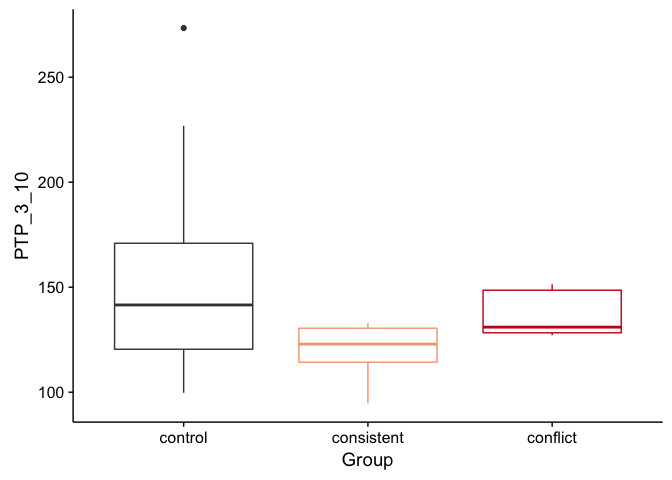
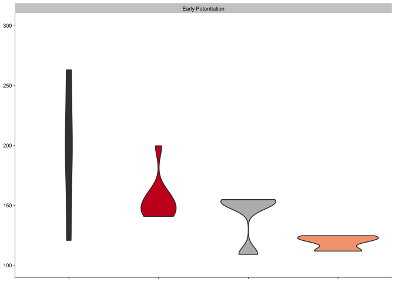
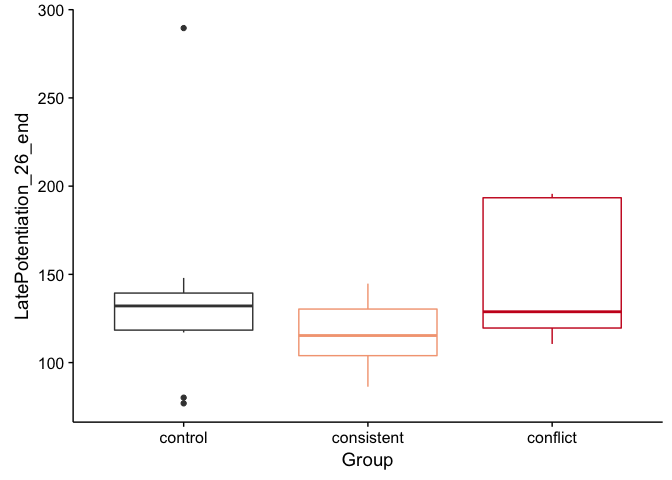
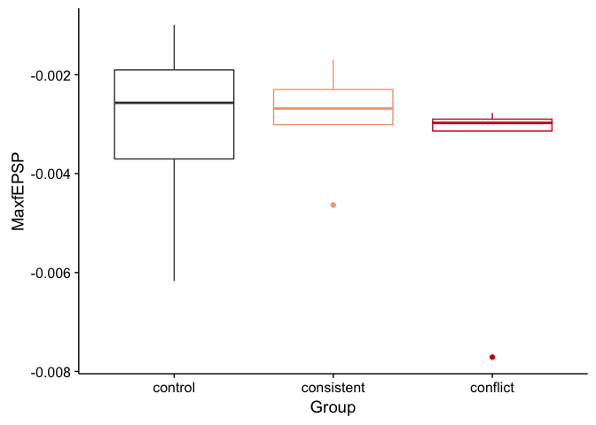
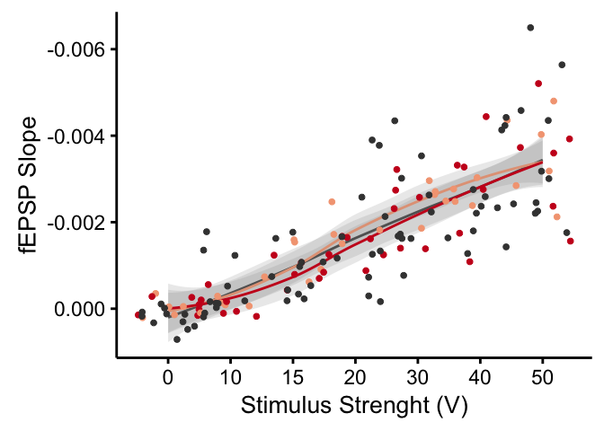

``` r
## load libraries 
library(ggplot2) ## for awesome plots!
library(cowplot) ## for some easy to use themes
library(tidyr) ## for respahing data
library(plyr) ## for renmaing factors
library(dplyr) ## for filtering and selecting rows
library(reshape)  ## widen a
library(car) ## for statistics

## load functions 
source("figureoptions.R")

## set output file for figures 
knitr::opts_chunk$set(fig.path = '../figures/03_ephys/')
```

``` r
## read summarized ephys data and relevel factors
colData <- read.csv("../data/02a_colData.csv", header = T) # for better group names

ephys <- read.csv("../data/03_ephys.csv", header = T)
ephys$Group <- factor(ephys$Group, levels = c("control", "consistent", "conflict"))
ephyslong <- melt(ephys)

## read voltage response data
ephys2 <- read.csv("../data/03_ephys2.csv", header = T)
ephys2long <- read.csv("../data/03_ephys3.csv", header = T)

ephys2$APA <- factor(ephys2$APA, levels = c("control", "consistent", "conflict"))
ephys2long$APA <- factor(ephys2long$APA, levels = c("control", "consistent", "conflict"))
ephys2long$APA2 <- factor(ephys2long$APA2, levels = c("control-consistent", "consistent",  "control-conflict","conflict"))

ephys3 <- left_join(ephys, colData, by = "Mouse")
```

    ## Warning in left_join_impl(x, y, by$x, by$y, suffix$x, suffix$y): joining
    ## factors with different levels, coercing to character vector

``` r
ephys3 <- na.omit(ephys3)

ephys3$APA2 <- factor(ephys3$APA2, levels = c("yoked_consistent", "consistent",  "yoked_conflict", "conflict"))
ephys3$one <- "Pre-Potentiation"
ephys3$two <- "Early Potentiation"
ephys3$three <- "Late Potentiation"
ephys3$four <- "Max fEPSP"
```

the data
--------

``` r
one <- ephys3 %>%
  ggplot(aes(x=APA2, y=PTP_3_10, fill=APA2)) +  
  geom_violin() + 
  scale_fill_manual(values = colorvalAPA00) + 
  scale_y_continuous(name=NULL,
                     limits = c(100, 300)) + 
  theme_cowplot(font_size = 8, line_size = 0.25)   + 
  theme(axis.title.x = element_blank(), 
        axis.text.x = element_blank(),
        legend.position="none") +
  facet_wrap(~one)
one
```

    ## Warning: Removed 5 rows containing non-finite values (stat_ydensity).



``` r
leveneTest(PTP_3_10~APA2, data=ephys3)
```

    ## Levene's Test for Homogeneity of Variance (center = median)
    ##       Df F value    Pr(>F)    
    ## group  3  8.1062 0.0002972 ***
    ##       36                      
    ## ---
    ## Signif. codes:  0 '***' 0.001 '**' 0.01 '*' 0.05 '.' 0.1 ' ' 1

``` r
summary(aov(ephys3$PTP_3_10 ~ ephys3$APA2))
```

    ##             Df Sum Sq Mean Sq F value   Pr(>F)    
    ## ephys3$APA2  3  47989   15996   16.46 6.73e-07 ***
    ## Residuals   36  34991     972                     
    ## ---
    ## Signif. codes:  0 '***' 0.001 '**' 0.01 '*' 0.05 '.' 0.1 ' ' 1

``` r
TukeyHSD(aov(ephys3$PTP_3_10 ~ ephys3$APA2))
```

    ##   Tukey multiple comparisons of means
    ##     95% family-wise confidence level
    ## 
    ## Fit: aov(formula = ephys3$PTP_3_10 ~ ephys3$APA2)
    ## 
    ## $`ephys3$APA2`
    ##                                        diff        lwr        upr
    ## consistent-yoked_consistent      -72.978095 -115.29288 -30.663309
    ## yoked_conflict-yoked_consistent  -79.043929 -118.97763 -39.110225
    ## conflict-yoked_consistent       -102.478929 -142.41263 -62.545225
    ## yoked_conflict-consistent         -6.065833  -43.09127  30.959604
    ## conflict-consistent              -29.500833  -66.52627   7.524604
    ## conflict-yoked_conflict          -23.435000  -57.71389  10.843894
    ##                                     p adj
    ## consistent-yoked_consistent     0.0002494
    ## yoked_conflict-yoked_consistent 0.0000313
    ## conflict-yoked_consistent       0.0000003
    ## yoked_conflict-consistent       0.9708791
    ## conflict-consistent             0.1582225
    ## conflict-yoked_conflict         0.2712862

``` r
two <- ephys3 %>%
  ggplot(aes(x=APA2, y=EarlyPotentiation_11_20, fill=APA2)) +  
  geom_violin() + 
  scale_fill_manual(values = colorvalAPA00) + 
  scale_y_continuous(name=NULL,
                     limits = c(100, 300)) + 
  theme_cowplot(font_size = 8, line_size = 0.25)   + 
  theme(axis.title.x = element_blank(), 
        axis.text.x = element_blank(),
        legend.position="none") +
  facet_wrap(~two)
two
```

    ## Warning: Removed 7 rows containing non-finite values (stat_ydensity).



``` r
leveneTest(EarlyPotentiation_11_20~APA2, data=ephys3)
```

    ## Levene's Test for Homogeneity of Variance (center = median)
    ##       Df F value   Pr(>F)   
    ## group  3  5.3252 0.003852 **
    ##       36                    
    ## ---
    ## Signif. codes:  0 '***' 0.001 '**' 0.01 '*' 0.05 '.' 0.1 ' ' 1

``` r
summary(aov(ephys3$EarlyPotentiation_11_20 ~ ephys3$APA2))
```

    ##             Df Sum Sq Mean Sq F value   Pr(>F)    
    ## ephys3$APA2  3  34404   11468   11.55 1.89e-05 ***
    ## Residuals   36  35755     993                     
    ## ---
    ## Signif. codes:  0 '***' 0.001 '**' 0.01 '*' 0.05 '.' 0.1 ' ' 1

``` r
TukeyHSD(aov(ephys3$EarlyPotentiation_11_20 ~ ephys3$APA2))
```

    ##   Tukey multiple comparisons of means
    ##     95% family-wise confidence level
    ## 
    ## Fit: aov(formula = ephys3$EarlyPotentiation_11_20 ~ ephys3$APA2)
    ## 
    ## $`ephys3$APA2`
    ##                                      diff        lwr        upr     p adj
    ## consistent-yoked_consistent     -39.15619  -81.93035   3.617966 0.0828785
    ## yoked_conflict-yoked_consistent -69.56786 -109.93508 -29.200632 0.0002520
    ## conflict-yoked_consistent       -81.54036 -121.90758 -41.173132 0.0000224
    ## yoked_conflict-consistent       -30.41167  -67.83905   7.015720 0.1458452
    ## conflict-consistent             -42.38417  -79.81155  -4.956780 0.0212699
    ## conflict-yoked_conflict         -11.97250  -46.62353  22.678527 0.7887202

``` r
three <- ephys3 %>%
  ggplot(aes(x=APA2, y=LatePotentiation_26_end, fill=APA2)) +  
  geom_violin() + 
  scale_fill_manual(values = colorvalAPA00) + 
  scale_y_continuous(name=NULL,
                     limits = c(100, 300)) + 
  theme_cowplot(font_size = 8, line_size = 0.25)   + 
  theme(axis.title.x = element_blank(), 
        axis.text.x = element_blank(),
        legend.position="none") +
  facet_wrap(~three)
three
```

    ## Warning: Removed 7 rows containing non-finite values (stat_ydensity).



``` r
leveneTest(LatePotentiation_26_end~APA2, data=ephys3)
```

    ## Levene's Test for Homogeneity of Variance (center = median)
    ##       Df F value Pr(>F)
    ## group  3  1.2844 0.2945
    ##       36

``` r
summary(aov(ephys3$LatePotentiation_26_end ~ ephys3$APA2))
```

    ##             Df Sum Sq Mean Sq F value  Pr(>F)   
    ## ephys3$APA2  3  28015    9338   6.229 0.00161 **
    ## Residuals   36  53971    1499                   
    ## ---
    ## Signif. codes:  0 '***' 0.001 '**' 0.01 '*' 0.05 '.' 0.1 ' ' 1

``` r
TukeyHSD(aov(ephys3$LatePotentiation_26_end ~ ephys3$APA2))
```

    ##   Tukey multiple comparisons of means
    ##     95% family-wise confidence level
    ## 
    ## Fit: aov(formula = ephys3$LatePotentiation_26_end ~ ephys3$APA2)
    ## 
    ## $`ephys3$APA2`
    ##                                         diff        lwr       upr
    ## consistent-yoked_consistent     -33.88793651  -86.44036  18.66449
    ## yoked_conflict-yoked_consistent -68.52488095 -118.12015 -18.92961
    ## conflict-yoked_consistent       -68.53821429 -118.13348 -18.94295
    ## yoked_conflict-consistent       -34.63694444  -80.62032  11.34643
    ## conflict-consistent             -34.65027778  -80.63365  11.33310
    ## conflict-yoked_conflict          -0.01333333  -42.58567  42.55900
    ##                                     p adj
    ## consistent-yoked_consistent     0.3201956
    ## yoked_conflict-yoked_consistent 0.0036078
    ## conflict-yoked_consistent       0.0036006
    ## yoked_conflict-consistent       0.1965601
    ## conflict-consistent             0.1962837
    ## conflict-yoked_conflict         1.0000000

``` r
four <- ephys3 %>%
  ggplot(aes(x=APA2, y=MaxfEPSP, fill=APA2)) +  
  geom_violin() +
  scale_fill_manual(values = colorvalAPA00) + 
  scale_y_continuous(name= NULL) +
  theme_cowplot(font_size = 8, line_size = 0.25)   + 
  theme(axis.title.x = element_blank(), 
        axis.text.x = element_blank(),
        legend.position="none") +
  facet_wrap(~four)
four
```



``` r
leveneTest(MaxfEPSP~APA2, data=ephys3)
```

    ## Levene's Test for Homogeneity of Variance (center = median)
    ##       Df F value Pr(>F)
    ## group  3  1.0881 0.3666
    ##       36

``` r
summary(aov(ephys3$MaxfEPSP ~ ephys3$APA2))
```

    ##             Df    Sum Sq   Mean Sq F value Pr(>F)
    ## ephys3$APA2  3 4.850e-06 1.617e-06   0.857  0.472
    ## Residuals   36 6.793e-05 1.887e-06

``` r
TukeyHSD(aov(ephys3$MaxfEPSP ~ ephys3$APA2))
```

    ##   Tukey multiple comparisons of means
    ##     95% family-wise confidence level
    ## 
    ## Fit: aov(formula = ephys3$MaxfEPSP ~ ephys3$APA2)
    ## 
    ## $`ephys3$APA2`
    ##                                          diff           lwr         upr
    ## consistent-yoked_consistent     -0.0006618619 -0.0025262648 0.001202541
    ## yoked_conflict-yoked_consistent  0.0000307381 -0.0017287535 0.001790230
    ## conflict-yoked_consistent        0.0002898964 -0.0014695952 0.002049388
    ## yoked_conflict-consistent        0.0006926000 -0.0009387525 0.002323953
    ## conflict-consistent              0.0009517583 -0.0006795942 0.002583111
    ## conflict-yoked_conflict          0.0002591583 -0.0012511806 0.001769497
    ##                                     p adj
    ## consistent-yoked_consistent     0.7748636
    ## yoked_conflict-yoked_consistent 0.9999619
    ## conflict-yoked_consistent       0.9704051
    ## yoked_conflict-consistent       0.6655363
    ## conflict-consistent             0.4073343
    ## conflict-yoked_conflict         0.9667914

``` r
pdf(file="../figures/03_ephys/1pre.pdf", width=2, height=3)
plot(one)
```

    ## Warning: Removed 5 rows containing non-finite values (stat_ydensity).

``` r
dev.off()
```

    ## quartz_off_screen 
    ##                 2

``` r
pdf(file="../figures/03_ephys/2early.pdf", width=2, height=3)
plot(two)
```

    ## Warning: Removed 7 rows containing non-finite values (stat_ydensity).

``` r
dev.off()
```

    ## quartz_off_screen 
    ##                 2

``` r
pdf(file="../figures/03_ephys/3late.pdf", width=2, height=3)
plot(three)
```

    ## Warning: Removed 7 rows containing non-finite values (stat_ydensity).

``` r
dev.off()
```

    ## quartz_off_screen 
    ##                 2

``` r
pdf(file="../figures/03_ephys/4max.pdf", width=2, height=3)
plot(four)
dev.off()
```

    ## quartz_off_screen 
    ##                 2

one way anova
-------------

``` r
ephys2long %>% 
  ggplot(aes(x=variablenumeric, y=value, color=APA )) + 
  stat_smooth(alpha=0.2, size=1) +
  geom_jitter(size=2, width = 0.5) +
  background_grid(major = "xy", minor = "none") + 
  theme_cowplot(font_size = 20, line_size = 1) + 
  scale_y_continuous(trans = "reverse") + 
  scale_x_continuous(breaks=c(1,2,3,4,5,6,7),
                     labels=c("0", "10", "15", "20", "30", "40", "50")) +
  scale_color_manual(values = colorvalAPA) + 
  labs(x = "Stimulus Strenght (V)", y = "fEPSP Slope") + 
  theme(legend.position="none")
```

    ## `geom_smooth()` using method = 'loess'


