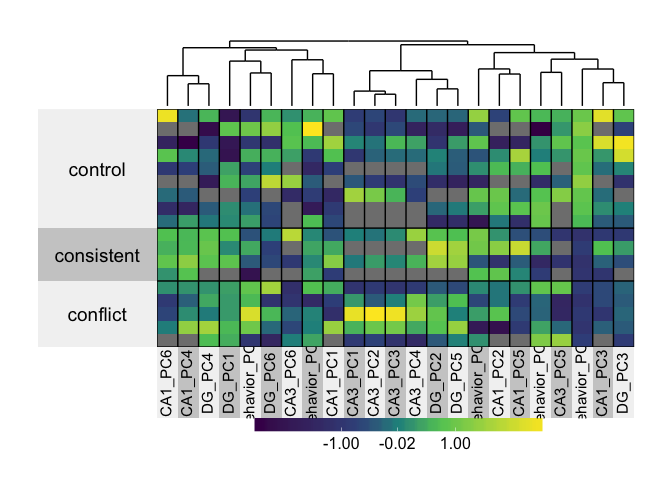

Setup
-----

``` r
library(plyr)
library(dplyr)
library(reshape2)
library(superheat)

knitr::opts_chunk$set(fig.path = '../figures/04_integration/')
```

Import Data
-----------

``` r
behaviorpca <- read.csv("../data/01a_scoresdf.csv", header = T)
behavior <- read.csv("../data/01a_behavior.csv", header = T)
ephys <- read.csv("../data/03_ephys.csv", header = T)
pcadata <- read.csv("../data/02a_pcadata.csv", header = T)
rossetta <- read.csv("../data/00_rossettastone.csv", header = F)
```

``` r
# clearnup the rosetts data and filter extraneous samples
names(rossetta)[1] <- "organism"
names(rossetta)[2] <- "ID"
names(rossetta)[3] <- "Region"
names(rossetta)[4] <- "RNAseqID"
names(rossetta)[5] <- "R1filename"
rossetta$R2filename <- rossetta$R1filename
rossetta$R2filename <- gsub("R1", "R2", rossetta$R2filename)

## previously used for the Dissocation Test. No longer functional
#rossetta$Mouse <- gsub("15-101", "15-100", rossetta$Mouse)
#write.csv(rossetta, "../../DissociationTest/data/00_metadata.csv")

colData <- read.csv("../data/IntegrativeWT2015ColData.csv", header = T)
colData$RNAseqID <- revalue(colData$RNAseqID, c("142C_CA1" = "142C-CA1-S")) 
colData$RNAseqID <- revalue(colData$RNAseqID, c("142C_DG" = "142C-DG-S")) 
colData$RNAseqID <- revalue(colData$RNAseqID, c("143C_CA1" = "143C-CA1-S")) 
colData$RNAseqID <- revalue(colData$RNAseqID, c("143C_DG" = "143C-DG-S"))

metadata <- full_join(colData, rossetta)
```

    ## Joining, by = c("RNAseqID", "Region")

    ## Warning in full_join_impl(x, y, by$x, by$y, suffix$x, suffix$y): joining
    ## factors with different levels, coercing to character vector

``` r
names(metadata)[1] <- "samplename"
metadata$title <- as.factor(paste(metadata$ID,metadata$Region, metadata$Group, sep=" "))
names(metadata)[6] <- "sourcename"
metadata$char1 <- "Mus musculus"
metadata$char2 <- "C57BL/6"
metadata$mol <- "RNA"
metadata$des <- " "
metadata$processes <- as.factor(paste(metadata$samplename,"/abundance.txt"))
metadata$process2 <- "IntegrativeWT2015ColData.csv"
str(metadata)
```

    ## 'data.frame':    54 obs. of  22 variables:
    ##  $ samplename  : chr  "142C-CA1-S" "142C-DG-S" "143A-CA3-1" "143A-DG-1" ...
    ##  $ Mouse       : Factor w/ 21 levels "15-142C","15-143A",..: 1 1 2 2 3 3 4 4 4 5 ...
    ##  $ year        : int  2015 2015 2015 2015 2015 2015 2015 2015 2015 2015 ...
    ##  $ Genotype    : Factor w/ 1 level "WT": 1 1 1 1 1 1 1 1 1 1 ...
    ##  $ Region      : Factor w/ 3 levels "CA1","CA3","DG": 1 3 2 3 1 3 1 3 1 1 ...
    ##  $ sourcename  : Factor w/ 2 levels "JA16268","JA16444": 1 1 2 2 2 2 1 1 2 2 ...
    ##  $ Group       : Factor w/ 4 levels "conflict","consistent",..: 2 2 1 1 3 3 2 2 2 3 ...
    ##  $ APA         : Factor w/ 2 levels "Trained","Yoked": 1 1 1 1 2 2 1 1 1 2 ...
    ##  $ Conflict    : Factor w/ 2 levels "Conflict","NoConflict": 2 2 1 1 1 1 2 2 2 2 ...
    ##  $ APA_Conflict: Factor w/ 5 levels "NA_NA","Trained_Conflict",..: 3 3 2 2 4 4 3 3 3 5 ...
    ##  $ Treatment   : Factor w/ 5 levels "conflict","homecage",..: 4 4 1 1 3 3 4 4 4 5 ...
    ##  $ organism    : Factor w/ 21 levels "15-142C","15-143A",..: 1 1 2 2 3 3 4 4 4 5 ...
    ##  $ ID          : Factor w/ 21 levels "15142C","15143A",..: 1 1 2 2 3 3 4 4 4 5 ...
    ##  $ R1filename  : Factor w/ 54 levels "142C_CA1_S_S19_L003_R1_001.fastq.gz",..: 1 2 3 4 5 6 8 9 7 10 ...
    ##  $ R2filename  : chr  "142C_CA1_S_S19_L003_R2_001.fastq.gz" "142C_DG_S_S21_L003_R2_001.fastq.gz" "143A_CA3_1_S35_L002_R2_001.fastq.gz" "143A_DG_1_S36_L002_R2_001.fastq.gz" ...
    ##  $ title       : Factor w/ 53 levels "15142C CA1 consistent",..: 1 2 3 4 5 6 7 8 7 9 ...
    ##  $ char1       : chr  "Mus musculus" "Mus musculus" "Mus musculus" "Mus musculus" ...
    ##  $ char2       : chr  "C57BL/6" "C57BL/6" "C57BL/6" "C57BL/6" ...
    ##  $ mol         : chr  "RNA" "RNA" "RNA" "RNA" ...
    ##  $ des         : chr  " " " " " " " " ...
    ##  $ processes   : Factor w/ 54 levels "142C-CA1-S /abundance.txt",..: 1 2 3 4 5 6 8 9 7 10 ...
    ##  $ process2    : chr  "IntegrativeWT2015ColData.csv" "IntegrativeWT2015ColData.csv" "IntegrativeWT2015ColData.csv" "IntegrativeWT2015ColData.csv" ...

``` r
metadata <- select(metadata, samplename, title, sourcename, organism, char1, char2, mol, des, Group, processes, R1filename, R2filename, process2)

write.csv(metadata, "../data/00_metadata.csv")
```

Wrangle Data
------------

``` r
# clearnup the rosetts data and filter extraneous samples
rossetta <- read.csv("../data/00_rossettastone.csv", header = F)
names(rossetta)[1] <- "Mouse"
names(rossetta)[2] <- "ID"
names(rossetta)[3] <- "Region"
names(rossetta)[4] <- "RNAseqID"
names(rossetta)[5] <- "R1filename"
rossetta$R1filename <- NULL
rossetta <- rossetta %>% dplyr::filter(Mouse != "15-100", Mouse != "15-101", Mouse != "15-147")
head(rossetta) # dictionary of names
```

    ##     Mouse     ID Region   RNAseqID
    ## 1 15-142C 15142C    CA1 142C-CA1-S
    ## 2 15-142C 15142C     DG  142C-DG-S
    ## 3 15-143A 15143A    CA3 143A-CA3-1
    ## 4 15-143A 15143A     DG  143A-DG-1
    ## 5 15-143B 15143B    CA1 143B-CA1-1
    ## 6 15-143B 15143B     DG  143B-DG-1

``` r
## slim behavior ephy to top 5 pcs and rename the columsn
behaviorpca <- behaviorpca[(c(1:5,35:36))]
names(behaviorpca)[names(behaviorpca)=="PC1"] <- "Behavior_PC1"
names(behaviorpca)[names(behaviorpca)=="PC2"] <- "Behavior_PC2"
names(behaviorpca)[names(behaviorpca)=="PC3"] <- "Behavior_PC3"
names(behaviorpca)[names(behaviorpca)=="PC4"] <- "Behavior_PC4"
names(behaviorpca)[names(behaviorpca)=="PC5"] <- "Behavior_PC5"


behaviorpca <- behaviorpca %>% dplyr::filter(ID != "15148", ID !=  "15140A", ID !=  "15140B", ID !=  "15140C", ID !=  "15140D", ID !=  "15141C", ID !=  "15141D", ID !=  "15142C", ID !=  "15142D", ID !=  "15142A", ID !=  "15142B", ID !=  "15145C", ID !=  "15145C", ID !=  "15145D", ID !=  "15147A", ID !=  "15147B", ID !=  "15148C", ID !=  "15148D")

pcadata <- pcadata[(c(1:9,11,13))]
names(pcadata)[names(pcadata)=="name"] <- "RNAseqID"

#wident then length RNAseq data so each row is an animals
pcadatabyregion <- left_join(pcadata, rossetta)
```

    ## Joining, by = "RNAseqID"

    ## Warning in left_join_impl(x, y, by$x, by$y, suffix$x, suffix$y): joining
    ## factors with different levels, coercing to character vector

``` r
pcadatabyregion <- melt(pcadatabyregion, id = c(10:14))
pcadatabyregion$RegionPC <- as.factor(paste(pcadatabyregion$Region, pcadatabyregion$variable, sep="_"))
pcadatabyregion <- dcast(pcadatabyregion, Mouse + ID ~ RegionPC)


alldata <- left_join(behaviorpca, pcadatabyregion)
```

    ## Joining, by = "ID"

    ## Warning in left_join_impl(x, y, by$x, by$y, suffix$x, suffix$y): joining
    ## factors with different levels, coercing to character vector

``` r
sh2 <- superheat(X = alldata[,-c(6:8,15:17,24:26,33:35)],
                #yr = behaviorpca[,10],
                #yr.axis.name = "PC10",
                membership.rows = alldata$APA,
                pretty.order.cols = TRUE,
                col.dendrogram = TRUE,
                bottom.label.size = 0.3,
                bottom.label.text.size = 4,
                bottom.label.text.angle = 90,
                scale = TRUE)
```


