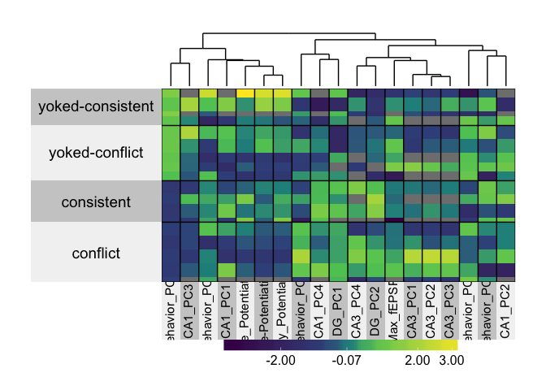
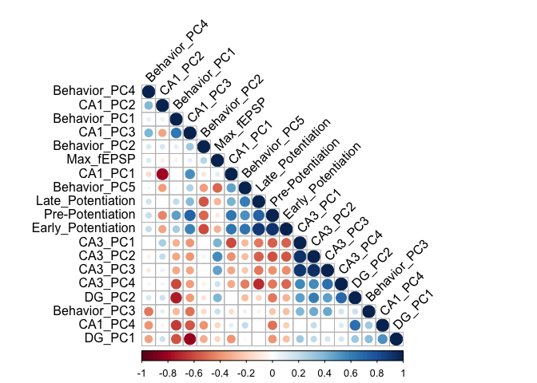
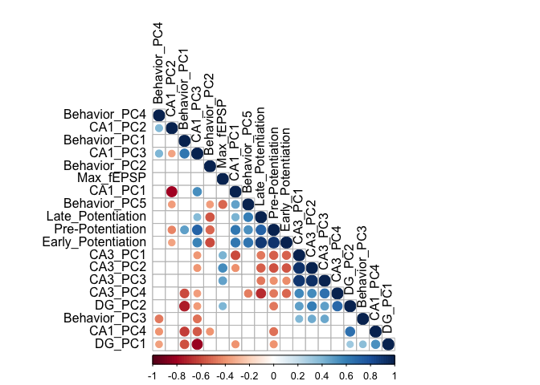
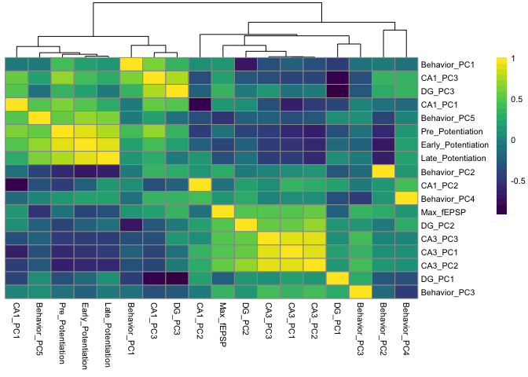
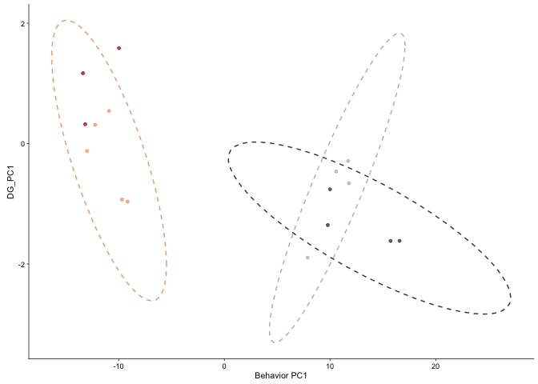
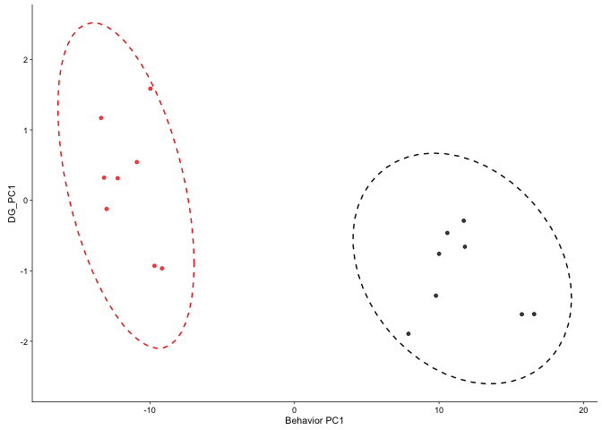
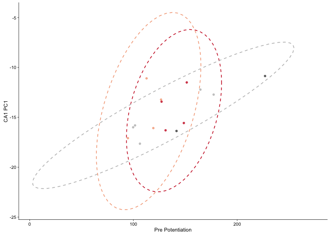
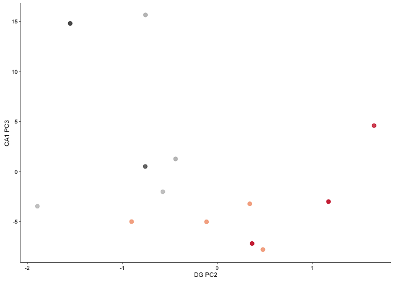
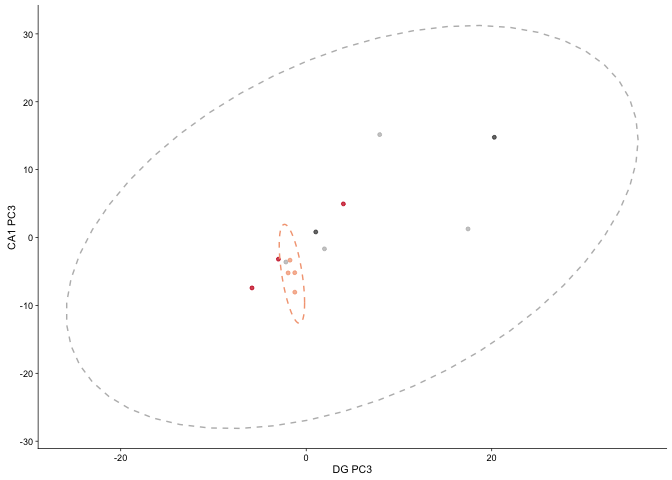
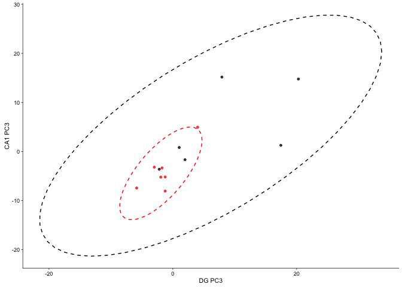

Setup
-----

``` r
library(plyr)
library(dplyr)
library(reshape2)
library(superheat)
library("Hmisc")
library("corrplot")
library("PerformanceAnalytics")
library(viridis)
library(cowplot)
library(pheatmap)

source("figureoptions.R")

knitr::opts_chunk$set(fig.path = '../figures/04_integration/')
```

Import Data
-----------

``` r
behaviorpca <- read.csv("../data/01a_scoresdf.csv", header = T)
behavior <- read.csv("../data/01a_behavior.csv", header = T)

pcadata <- read.csv("../data/02a_pcadata.csv", header = T)
pcadata$Punch <- ifelse(grepl("DG", pcadata$group), "DG", 
                                        ifelse(grepl("CA3", pcadata$group), "CA3","CA1"))
names(pcadata)[names(pcadata)=="name"] <- "RNAseqID"

rossetta <- read.csv("../data/00_rossettastone.csv", header = F)

colData <- read.csv("../data/02a_colData.csv", header = T) # for better group names

ephys3 <- read.csv("../data/03_ephys.csv", header = T)
ephys3 <- ephys3[,(c(1:6))]

names(ephys3)[3] <- "Pre_Potentiation"
names(ephys3)[4] <- "Early_Potentiation"
names(ephys3)[5] <- "Late_Potentiation"
names(ephys3)[6] <- "Max_fEPSP"
```

``` r
# clearnup the rosetts data and filter extraneous samples
names(rossetta)[1] <- "organism"
names(rossetta)[2] <- "ID"
names(rossetta)[3] <- "Region"
names(rossetta)[4] <- "RNAseqID"
names(rossetta)[5] <- "R1filename"
rossetta$R2filename <- rossetta$R1filename
rossetta$R2filename <- gsub("R1", "R2", rossetta$R2filename)

## previously used for the Dissocation Test. No longer functional
#rossetta$Mouse <- gsub("15-101", "15-100", rossetta$Mouse)
#write.csv(rossetta, "../../DissociationTest/data/00_metadata.csv")

colData$RNAseqID <- revalue(colData$RNAseqID, c("142C_CA1" = "142C-CA1-S")) 
```

    ## The following `from` values were not present in `x`: 142C_CA1

``` r
colData$RNAseqID <- revalue(colData$RNAseqID, c("142C_DG" = "142C-DG-S")) 
```

    ## The following `from` values were not present in `x`: 142C_DG

``` r
colData$RNAseqID <- revalue(colData$RNAseqID, c("143C_CA1" = "143C-CA1-S")) 
```

    ## The following `from` values were not present in `x`: 143C_CA1

``` r
colData$RNAseqID <- revalue(colData$RNAseqID, c("143C_DG" = "143C-DG-S"))
```

    ## The following `from` values were not present in `x`: 143C_DG

``` r
metadata <- full_join(colData, rossetta)
```

    ## Joining, by = c("RNAseqID", "ID")

    ## Warning in full_join_impl(x, y, by$x, by$y, suffix$x, suffix$y): joining
    ## factors with different levels, coercing to character vector

    ## Warning in full_join_impl(x, y, by$x, by$y, suffix$x, suffix$y): joining
    ## factors with different levels, coercing to character vector

``` r
names(metadata)[1] <- "samplename"
metadata$title <- as.factor(paste(metadata$ID,metadata$Region, metadata$Group, sep=" "))
names(metadata)[6] <- "sourcename"
metadata$char1 <- "Mus musculus"
metadata$char2 <- "C57BL/6"
metadata$mol <- "RNA"
metadata$des <- " "
metadata$processes <- as.factor(paste(metadata$samplename,"/abundance.txt"))
metadata$process2 <- "IntegrativeWT2015ColData.csv"
str(metadata)
```

    ## 'data.frame':    54 obs. of  19 variables:
    ##  $ samplename: chr  "143A-CA3-1" "143A-DG-1" "143B-CA1-1" "143B-DG-1" ...
    ##  $ Mouse     : Factor w/ 18 levels "15-143A","15-143B",..: 1 1 2 2 3 4 4 5 5 5 ...
    ##  $ Conflict  : Factor w/ 2 levels "Conflict","NoConflict": 1 1 1 1 2 2 2 1 1 1 ...
    ##  $ Punch     : Factor w/ 3 levels "CA1","CA3","DG": 2 3 1 3 1 1 3 1 2 3 ...
    ##  $ Slice     : int  1 1 1 1 1 3 3 2 2 2 ...
    ##  $ sourcename: chr  "15143A" "15143A" "15143B" "15143B" ...
    ##  $ APA       : Factor w/ 3 levels "Conflict","Consistent",..: 1 1 3 3 2 3 3 1 1 1 ...
    ##  $ APA2      : Factor w/ 4 levels "conflict","consistent",..: 1 1 3 3 2 4 4 1 1 1 ...
    ##  $ organism  : Factor w/ 21 levels "15-142C","15-143A",..: 2 2 3 3 4 5 5 6 6 6 ...
    ##  $ Region    : Factor w/ 3 levels "CA1","CA3","DG": 2 3 1 3 1 1 3 1 2 3 ...
    ##  $ R1filename: Factor w/ 54 levels "142C_CA1_S_S19_L003_R1_001.fastq.gz",..: 3 4 5 6 7 10 11 12 13 14 ...
    ##  $ R2filename: chr  "143A_CA3_1_S35_L002_R2_001.fastq.gz" "143A_DG_1_S36_L002_R2_001.fastq.gz" "143B_CA1_1_S37_L002_R2_001.fastq.gz" "143B_DG_1_S38_L002_R2_001.fastq.gz" ...
    ##  $ title     : Factor w/ 53 levels "15142C CA1 ",..: 3 4 5 6 7 9 10 11 12 13 ...
    ##  $ char1     : chr  "Mus musculus" "Mus musculus" "Mus musculus" "Mus musculus" ...
    ##  $ char2     : chr  "C57BL/6" "C57BL/6" "C57BL/6" "C57BL/6" ...
    ##  $ mol       : chr  "RNA" "RNA" "RNA" "RNA" ...
    ##  $ des       : chr  " " " " " " " " ...
    ##  $ processes : Factor w/ 54 levels "142C-CA1-S /abundance.txt",..: 3 4 5 6 7 10 11 12 13 14 ...
    ##  $ process2  : chr  "IntegrativeWT2015ColData.csv" "IntegrativeWT2015ColData.csv" "IntegrativeWT2015ColData.csv" "IntegrativeWT2015ColData.csv" ...

``` r
metadata <- select(metadata, samplename, title, sourcename, organism, char1, char2, mol, des, processes, R1filename, R2filename, process2)

#write.csv(metadata, "../data/00_metadata.csv")
```

Wrangle Data
------------

``` r
# clearnup the rosetts data and filter extraneous samples
names(rossetta)[1] <- "Mouse"
names(rossetta)[2] <- "ID"
names(rossetta)[3] <- "Region"
names(rossetta)[4] <- "RNAseqID"
names(rossetta)[5] <- "R1filename"
rossetta$R1filename <- NULL
rossetta <- rossetta %>% dplyr::filter(Mouse != "15-100", Mouse != "15-101", Mouse != "15-147")
head(rossetta) # dictionary of names
```

    ##     Mouse     ID Region   RNAseqID                          R2filename
    ## 1 15-142C 15142C    CA1 142C-CA1-S 142C_CA1_S_S19_L003_R2_001.fastq.gz
    ## 2 15-142C 15142C     DG  142C-DG-S  142C_DG_S_S21_L003_R2_001.fastq.gz
    ## 3 15-143A 15143A    CA3 143A-CA3-1 143A_CA3_1_S35_L002_R2_001.fastq.gz
    ## 4 15-143A 15143A     DG  143A-DG-1  143A_DG_1_S36_L002_R2_001.fastq.gz
    ## 5 15-143B 15143B    CA1 143B-CA1-1 143B_CA1_1_S37_L002_R2_001.fastq.gz
    ## 6 15-143B 15143B     DG  143B-DG-1  143B_DG_1_S38_L002_R2_001.fastq.gz

``` r
## slim behavior ephy to top 5 pcs and rename the columsn
behaviorpca <- behaviorpca[(c(1:5,35:36))]
names(behaviorpca)[names(behaviorpca)=="PC1"] <- "Behavior_PC1"
names(behaviorpca)[names(behaviorpca)=="PC2"] <- "Behavior_PC2"
names(behaviorpca)[names(behaviorpca)=="PC3"] <- "Behavior_PC3"
names(behaviorpca)[names(behaviorpca)=="PC4"] <- "Behavior_PC4"
names(behaviorpca)[names(behaviorpca)=="PC5"] <- "Behavior_PC5"

behaviorpca <- behaviorpca %>% dplyr::filter(ID != "15148", ID !=  "15140A", ID !=  "15140B", ID !=  "15140C", ID !=  "15140D", ID !=  "15141C", ID !=  "15141D", ID !=  "15142C", ID !=  "15142D", ID !=  "15142A", ID !=  "15142B", ID !=  "15145C", ID !=  "15145C", ID !=  "15145D", ID !=  "15147A", ID !=  "15147B", ID !=  "15148C", ID !=  "15148D")

pcadata <- pcadata[(c(11:17,2:10))]

#widen then length RNAseq data so each row is an animals
pcadatabyregion <- left_join(pcadata, rossetta)
```

    ## Joining, by = "RNAseqID"

    ## Warning in left_join_impl(x, y, by$x, by$y, suffix$x, suffix$y): joining
    ## factors with different levels, coercing to character vector

``` r
pcadatabyregion <- pcadatabyregion[(c(17:19,2:16))]
pcadatabyregion <- melt(pcadatabyregion, id = c(1:9))
pcadatabyregion$RegionPC <- as.factor(paste(pcadatabyregion$Punch, pcadatabyregion$variable, sep="_"))
pcadatabyregion <- dcast(pcadatabyregion, Mouse ~ RegionPC)
```

``` r
rossetta <- unique(rossetta[ , 1:2 ]) # for joining keop only
alldata <- left_join(pcadatabyregion, rossetta , by="Mouse")
alldata <- left_join(alldata, behaviorpca, by="ID")
```

    ## Warning in left_join_impl(x, y, by$x, by$y, suffix$x, suffix$y): joining
    ## factors with different levels, coercing to character vector

``` r
alldata <- left_join(alldata, ephys3, by="Mouse")
```

    ## Warning in left_join_impl(x, y, by$x, by$y, suffix$x, suffix$y): joining
    ## factors with different levels, coercing to character vector

``` r
alldataslim <- alldata[,-c(1, 5:10,14:19,23:29,35:36)]
alldataslim <- sapply( alldataslim, as.numeric )
```

``` r
sh2 <- superheat(X = alldataslim,
                #yr = behaviorpca[,10],
                #yr.axis.name = "PC10",
                membership.rows = alldata$APA2,
                pretty.order.cols = TRUE,
                col.dendrogram = TRUE,
                bottom.label.size = 0.3,
                bottom.label.text.size = 4,
                bottom.label.text.angle = 90,
                scale = TRUE)
```



``` r
cormat <- rcorr(as.matrix(alldataslim))
res2 <- rcorr(as.matrix(alldataslim))

corrplot(res2$r, type = "lower", order = "hclust", 
        tl.col = "black", tl.srt = 45)
```



``` r
corrplot(res2$r, type="lower", order="hclust",  tl.col = "black", 
        p.mat = res2$P, sig.level = 0.05, insig = "blank")
```



``` r
paletteLength <- 30
myBreaks <- c(seq(min(cormat$r), 0, length.out=ceiling(paletteLength/2) + 1),
              seq(max(cormat$r)/paletteLength, max(cormat$r), length.out=floor(paletteLength/2)))
pheatmap(cormat$r, show_colnames=T, show_rownames = T,
         #annotation_col=df, annotation_colors = ann_colors,
         treeheight_row = 0, treeheight_col = 50,
         fontsize = 8, 
         width=4, height=3.5,
         border_color = "grey60" ,
         color = viridis(30),
         #cellwidth = 10, 
         clustering_method="average",
         breaks=myBreaks,
         clustering_distance_cols="correlation" 
         )
```



``` r
pheatmap(cormat$r, show_colnames=F, show_rownames = T,
         #annotation_col=df, annotation_colors = ann_colors,
         treeheight_row = 0, treeheight_col = 25,
         fontsize = 8, 
         width=3, height=3,
         border_color = "grey60" ,
         color = viridis(30),
         #cellwidth = 10, 
         clustering_method="average",
         breaks=myBreaks,
         clustering_distance_cols="correlation",
         filename = "../figures/04_integration/correlation.pdf"
         )

alldata$APA2 <- factor(alldata$APA2, levels = c("yoked-consistent", "consistent",  "yoked-conflict", "conflict"))

alldata$avoidance <-  ifelse(grepl("yoked", alldata$APA), "no", "yes")


scatter <- ggplot(alldata, aes(Behavior_PC1, as.numeric(DG_PC2), color=APA2)) + 
  geom_point(size = 1, alpha = 0.75) +
  scale_color_manual(values = colorvalAPA00) +
    theme_cowplot(font_size = 8, line_size = 0.25)  +
    theme(legend.position="none") +
    stat_ellipse(level = 0.95, linetype =2) + 
    scale_x_continuous(name="Behavior PC1") +
    scale_y_continuous(name="DG_PC1")  
scatter
```

    ## Too few points to calculate an ellipse



``` r
pdf(file="../figures/04_integration/scatter1.pdf", width=1.5, height=1.5)
plot(scatter)
```

    ## Too few points to calculate an ellipse

``` r
dev.off()
```

    ## quartz_off_screen 
    ##                 2

``` r
scatter <- ggplot(alldata, aes(Behavior_PC1, as.numeric(DG_PC2), color=avoidance)) + 
  geom_point(size = 1, alpha = 0.75) +
  scale_color_manual(values = colorvalavoidance) +
    theme_cowplot(font_size = 8, line_size = 0.25)  +
    theme(legend.position="none") +
    stat_ellipse(level = 0.95, linetype =2) + 
    scale_x_continuous(name="Behavior PC1") +
     scale_y_continuous(name="DG_PC1")  
scatter
```



``` r
pdf(file="../figures/04_integration/scatter5.pdf", width=1.5, height=1.5)
plot(scatter)
dev.off()
```

    ## quartz_off_screen 
    ##                 2

``` r
scatter <- ggplot(alldata, aes(Pre_Potentiation, as.numeric(CA1_PC1), color=APA2)) + 
  geom_point(size = 1, alpha = 0.75) +
  scale_color_manual(values = colorvalAPA00) +
    theme_cowplot(font_size = 8, line_size = 0.25)  +
    theme(legend.position="none") +
      stat_ellipse(level = 0.95, linetype =2) + 
    scale_x_continuous(name="Pre Potentiation") +
     scale_y_continuous(name="CA1 PC1")  
scatter
```

    ## Too few points to calculate an ellipse



``` r
pdf(file="../figures/04_integration/scatter2.pdf", width=1.5, height=1.5)
plot(scatter)
```

    ## Too few points to calculate an ellipse

``` r
dev.off()
```

    ## quartz_off_screen 
    ##                 2

``` r
scatter <- ggplot(alldata, aes(Pre_Potentiation, as.numeric(CA1_PC1), color=avoidance)) + 
  geom_point(size = 1, alpha = 0.75) +
  scale_color_manual(values = colorvalavoidance) +
    theme_cowplot(font_size = 8, line_size = 0.25)  +
    theme(legend.position="none") +
      stat_ellipse(level = 0.95, linetype =2) + 
    scale_x_continuous(name="Pre Potentiation") +
     scale_y_continuous(name="CA1 PC1")  
scatter
```



``` r
pdf(file="../figures/04_integration/scatter6.pdf", width=1.5, height=1.5)
plot(scatter)
dev.off()
```

    ## quartz_off_screen 
    ##                 2

``` r
scatter <- ggplot(alldata, aes(as.numeric(DG_PC3), as.numeric(CA1_PC3), color=APA2)) + 
  geom_point(size = 1, alpha = 0.75) +
  scale_color_manual(values = colorvalAPA00) +
    theme_cowplot(font_size = 8, line_size = 0.25)  +
        stat_ellipse(level = 0.95, linetype =2) + 
    theme(legend.position="none") +
    scale_x_continuous(name="DG PC3") +
     scale_y_continuous(name="CA1 PC3")  
scatter
```

    ## Too few points to calculate an ellipse
    ## Too few points to calculate an ellipse



``` r
pdf(file="../figures/04_integration/scatter3.pdf", width=1.5, height=1.5)
plot(scatter)
```

    ## Too few points to calculate an ellipse
    ## Too few points to calculate an ellipse

``` r
dev.off()
```

    ## quartz_off_screen 
    ##                 2

``` r
scatter <- ggplot(alldata, aes(as.numeric(DG_PC3), as.numeric(CA1_PC3), color=avoidance)) + 
  geom_point(size = 1, alpha = 0.75) +
  scale_color_manual(values = colorvalavoidance) +
    theme_cowplot(font_size = 8, line_size = 0.25)  +
        stat_ellipse(level = 0.95, linetype =2) + 
    theme(legend.position="none") +
    scale_x_continuous(name="DG PC3") +
     scale_y_continuous(name="CA1 PC3")  
scatter
```



``` r
pdf(file="../figures/04_integration/scatter7.pdf", width=1.5, height=1.5)
plot(scatter)
dev.off()
```

    ## quartz_off_screen 
    ##                 2
