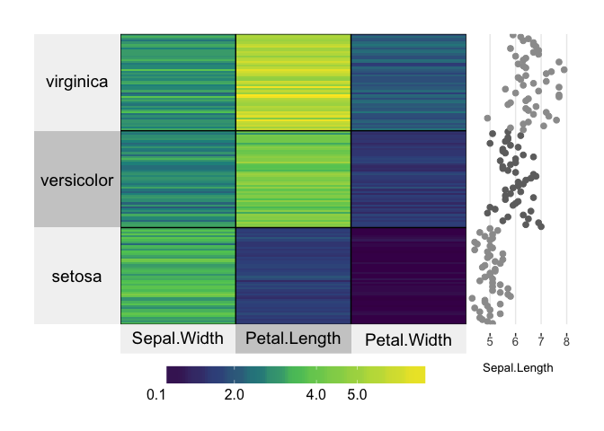
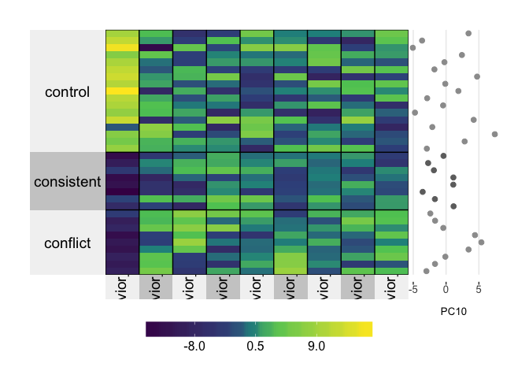

Setup
-----

Import Data
-----------

``` r
behaviorpca <- read.csv("../data/01a_scoresdf.csv", header = T)
behavior <- read.csv("../data/01a_behavior.csv", header = T)
ephys <- read.csv("../data/03_ephys.csv", header = T)
pcadata <- read.csv("../data/02a_pcadata.csv", header = T)

head(behaviorpca)  # behavior pcas
```

    ##         PC1       PC2        PC3        PC4        PC5       PC6
    ## 1 -9.173789  5.626257 -4.9377409  1.7977557 -0.5607946  8.604727
    ## 2  8.134048  2.188903  0.6283492  0.6135153 -7.4271551  2.952845
    ## 3 -7.077697 -2.841096 -7.6668189  2.8446936  1.3114111 -4.680233
    ## 4  5.573614  2.366312  2.2397296  1.1443530 -1.4787987 -2.040160
    ## 5 -2.807846  3.007263  2.0008763  5.3126054  4.8687955 -1.919291
    ## 6  6.968907  6.858661 -3.2037368 -2.4019104  6.4129923 -2.869517
    ##          PC7       PC8       PC9      PC10       PC11       PC12
    ## 1 -2.2096714  3.794523  2.699405 -2.993326  0.5128087  1.5546507
    ## 2  5.3842405  3.290012 -3.106847 -2.929033  4.0205590  4.0716268
    ## 3  1.1202901 -2.322107  1.311724  1.145050  3.0956118  1.5200275
    ## 4  0.5429054 -3.274455 -1.840279  2.831179  0.2337072 -7.3911449
    ## 5  2.9118846 -1.708383  1.343320 -1.704329 -1.7378731  1.5294406
    ## 6  1.7444199 -1.032049 -2.387111  7.426499 -3.1569388 -0.8994683
    ##         PC13       PC14       PC15       PC16       PC17      PC18
    ## 1 -0.7441958 -0.4328937 -0.3974696 -3.0039792  0.4040468 2.4162390
    ## 2  1.7325919 -3.8668483  3.6610718 -0.4453994  5.7025165 0.4508511
    ## 3  4.9181552  4.8563378  4.3204101 -2.1082017 -0.1534344 3.0022277
    ## 4 -1.2369407 -1.8579321  0.4854466 -3.3901980  0.4925930 2.2139067
    ## 5 -0.8011367  1.8468629 -0.7252440 -1.5535949 -0.9112234 4.2353465
    ## 6  2.6415997 -7.3054520  0.6278574  2.3382197 -1.0903878 2.7292683
    ##         PC19       PC20       PC21       PC22       PC23       PC24
    ## 1  0.2841679 -1.9656530 -0.6751626 -1.5319687  0.7541132  1.8491354
    ## 2  0.7600815  3.2219630  1.5402033  2.9586741 -0.1775777 -1.5906208
    ## 3  0.6228445 -1.7620988 -0.9387566 -1.5504877 -1.8337878  4.0021470
    ## 4 -2.6829926 -0.8684701 -0.3885442 -2.9705911  0.5856965 -2.4612994
    ## 5 -0.8445835  5.2101486 -1.0469574  1.2244062 -2.1491939 -0.1083888
    ## 6 -1.2499505 -0.7655886  1.9375270  0.9921244 -0.3774440  0.1052562
    ##        PC25      PC26        PC27       PC28       PC29       PC30
    ## 1 0.7908297  4.245254  0.94255509 -1.3644322 -2.2093868  3.6856470
    ## 2 3.1669350 -1.638834 -0.45275285 -1.0439688 -0.4657009 -0.7793793
    ## 3 2.2826370 -2.041189 -1.42918076  0.5691956 -2.5761219 -0.6194657
    ## 4 1.0681587 -1.389045  3.53794698 -2.5129334 -3.0183135 -1.6348989
    ## 5 1.0066847  1.877439 -0.05377367 -1.0286958  5.2220696  1.0186478
    ## 6 2.0497319  2.619380 -1.40497597  0.8296614 -0.1483693  0.8079943
    ##         PC31        PC32         PC33          PC34     ID        APA
    ## 1 -0.1400067 -2.38194758  0.605419169  9.783840e-16 15140A   conflict
    ## 2  0.3012234 -0.01463747  0.006165117  2.051094e-15 15140B    control
    ## 3  0.5323780  1.63060698 -0.869862800 -3.670675e-15 15140C consistent
    ## 4 -2.8671786 -1.35495852 -1.516902479  3.250872e-15 15140D    control
    ## 5 -1.9675888  0.10780503 -2.778741128  2.733924e-15 15141C consistent
    ## 6  1.6068014  0.54780996  1.307383054  2.371367e-15 15141D    control

``` r
head(ephys) # beahvior pcas with ephys
```

    ##      Group   Mouse PTP_3_10 EarlyPotentiation_11_20
    ## 1 conflict 15-143C   130.98                  199.54
    ## 2 conflict 15-144C   151.40                  149.93
    ## 3 conflict 15-145C   128.29                  118.72
    ## 4 conflict 15-146C   127.11                  160.00
    ## 5 conflict 15-147C   148.58                  140.74
    ## 6  control 15-146D   226.84                  196.43
    ##   LatePotentiation_26_end   MaxfEPSP
    ## 1                  195.64 -0.0077112
    ## 2                  128.81 -0.0027726
    ## 3                  110.56 -0.0029735
    ## 4                  193.41 -0.0031377
    ## 5                  119.59 -0.0028979
    ## 6                  142.12 -0.0025674

``` r
head(pcadata)  # rnaseq pcas
```

    ##         PC1         PC2        PC3        PC4         PC5        PC6
    ## 1 -17.93407 -18.8688076 -5.0202813 -7.1132068  6.99843739 -0.1660293
    ## 2  29.99333  -0.9161546 -5.5087158  3.9135866  0.16493368 -3.5213513
    ## 3 -15.47783  15.1404991 -3.4816484  0.6877435 -4.02173972 -0.8033509
    ## 4  26.50703  -1.8941816 -2.0841404 -0.8600513 -4.09501246 -1.5478544
    ## 5 -15.85888  17.0959087 -7.9343816  1.8721047  0.09664931  1.1358210
    ## 6 -16.03751  17.0610357  0.4973349 -4.2052048  2.54308425 -5.5013241
    ##          PC7         PC8        PC9            group Punch        APA
    ## 1  0.2035862 -0.06549266  1.1776414   CA3 : Conflict   CA3   Conflict
    ## 2  0.2666853  0.54539679  0.4291486    DG : Conflict    DG   Conflict
    ## 3  0.1331410  2.59248919  0.2984306    CA1 : Control   CA1    Control
    ## 4  2.4909525 -1.47676182 -1.6939315     DG : Control    DG    Control
    ## 5  0.4974889  2.34523639  0.1332042 CA1 : Consistent   CA1 Consistent
    ## 6 -1.9173392 -3.06032100 -3.2474474    CA1 : Control   CA1    Control
    ##         name
    ## 1 143A-CA3-1
    ## 2  143A-DG-1
    ## 3 143B-CA1-1
    ## 4  143B-DG-1
    ## 5 143C-CA1-1
    ## 6 143D-CA1-3

Wrangle Data
------------

``` r
## slim behavior ephy to top 10 pcs
behaviorpca <- behaviorpca[(c(1:10,35:36))]
## rename the columsn
names(behaviorpca)[names(behaviorpca)=="ID"] <- "Mouse"
names(behaviorpca)[names(behaviorpca)=="PC1"] <- "Behavior_PC1"
names(behaviorpca)[names(behaviorpca)=="PC2"] <- "Behavior_PC2"
names(behaviorpca)[names(behaviorpca)=="PC3"] <- "Behavior_PC3"
names(behaviorpca)[names(behaviorpca)=="PC4"] <- "Behavior_PC4"
names(behaviorpca)[names(behaviorpca)=="PC5"] <- "Behavior_PC5"
names(behaviorpca)[names(behaviorpca)=="PC6"] <- "Behavior_PC6"
names(behaviorpca)[names(behaviorpca)=="PC7"] <- "Behavior_PC7"
names(behaviorpca)[names(behaviorpca)=="PC8"] <- "Behavior_PC8"
names(behaviorpca)[names(behaviorpca)=="PC9"] <- "Behavior_PC9"
names(behaviorpca)[names(behaviorpca)=="PC10"] <- "Behavior_PC10"
```

``` r
library(superheat)
# plot a heatmap of the numerical iris variables
# cluster by species and plot Sepal.Length on the right
# save the superheat object to access the membership vectors
sh <- superheat(X = iris[,-c(1, 5)],
                yr = iris[,1],
                yr.axis.name = "Sepal.Length",
                membership.rows = iris$Species)
```



``` r
head(iris)
```

    ##   Sepal.Length Sepal.Width Petal.Length Petal.Width Species
    ## 1          5.1         3.5          1.4         0.2  setosa
    ## 2          4.9         3.0          1.4         0.2  setosa
    ## 3          4.7         3.2          1.3         0.2  setosa
    ## 4          4.6         3.1          1.5         0.2  setosa
    ## 5          5.0         3.6          1.4         0.2  setosa
    ## 6          5.4         3.9          1.7         0.4  setosa

``` r
sh2 <- superheat(X = behaviorpca[,-c(10,11,12)],
                yr = behaviorpca[,10],
                yr.axis.name = "PC10",
                membership.rows = behaviorpca$APA,
                pretty.order.cols = TRUE,
                bottom.label.size = 0.2,
                bottom.label.text.angle = 90)
```


