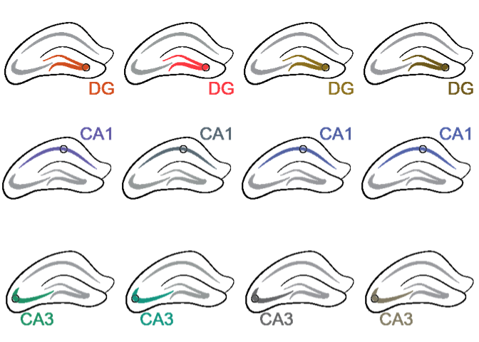
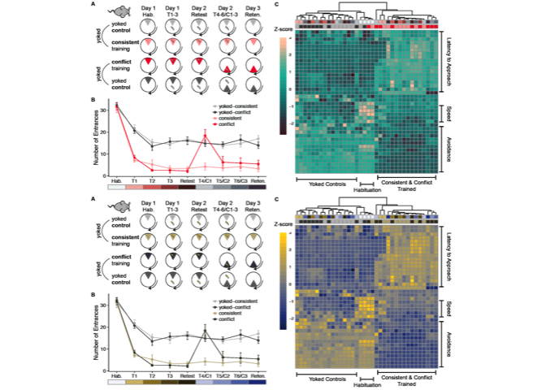

    #devtools::install_github("wilkelab/cowplot")
    #install.packages("colorspace", repos = "http://R-Forge.R-project.org")
    #devtools::install_github("clauswilke/colorblindr")
    #install.packages("magick")

    library(ggplot2)
    library(colorblindr)

    ## Loading required package: colorspace

    library(cowplot)

    ## 
    ## Attaching package: 'cowplot'

    ## The following object is masked from 'package:ggplot2':
    ## 
    ##     ggsave

    library(magick)

    ## Linking to ImageMagick 6.9.6.6
    ## Enabled features: cairo, fontconfig, freetype, pango, rsvg, webp
    ## Disabled features: fftw, ghostscript, lcms, x11

    ## set output file for figures 
    knitr::opts_chunk$set(fig.path = '../figures/09_colorblindr/')

    imgDG <- magick::image_read("../figures/00_schematics/DG.png")
    imgCA3 <- magick::image_read("../figures/00_schematics/CA3.png")
    imgCA1 <- magick::image_read("../figures/00_schematics/CA1.png")

    p <- ggdraw() + draw_image(imgDG) # turn png into ggplot object
    p2 <- edit_colors(p, tritan, sev = 1.0)
    p3 <- edit_colors(p, deutan, sev = 1.0)
    p4 <- edit_colors(p, protan, sev = 1.0)

    q <- ggdraw() + draw_image(imgCA1) # turn png into ggplot object
    q2 <- edit_colors(q, tritan, sev = 1.0)
    q3 <- edit_colors(q, deutan, sev = 1.0)
    q4 <- edit_colors(q, protan, sev = 1.0)

    r <- ggdraw() + draw_image(imgCA3) # turn png into ggplot object
    r2 <- edit_colors(r, tritan, sev = 1.0)
    r3 <- edit_colors(r, deutan, sev = 1.0)
    r4 <- edit_colors(r, protan, sev = 1.0)
    plot_grid(p, p2, p3, p4, q, q2, q3, q4, r, r2, r3, r4, nrow=3)

Figure 1
--------

    fig1 <- magick::image_read("../figures/02_RNAseq_ConsistentConflict/02_RNAseq_Conflict-01.png")
    fig1

    ##   format width height colorspace filesize
    ## 1    PNG  1252   1987       sRGB   237491

    r <- ggdraw() + draw_image(fig1) # turn png into ggplot object
    r2 <- edit_colors(r, tritan, sev = 1.0)
    r4 <- edit_colors(r, protan, sev = 1.0)
    plot_grid(r2, r4, nrow=2)

Figure 2
--------

    fig2 <- magick::image_read("../figures/02_RNAseq_ConsistentYoked/02_RNAseq_ConsistentYoked-01.png")
    fig2

    ##   format width height colorspace filesize
    ## 1    PNG  2072   1389       sRGB   247148

    r <- ggdraw() + draw_image(fig2) # turn png into ggplot object
    r2 <- edit_colors(r, tritan, sev = 1.0)
    r4 <- edit_colors(r, protan, sev = 1.0)
    plot_grid(r2, r4, nrow=2)

Supplementray behavior
----------------------

    behavior <- magick::image_read("../figures/01_behavior/01_avoidancebehvaior-01.png")
    behavior

    ##   format width height colorspace filesize
    ## 1    PNG  2245   1190       sRGB   226683

    r <- ggdraw() + draw_image(behavior) # turn png into ggplot object
    r2 <- edit_colors(r, tritan, sev = 1.0)
    r4 <- edit_colors(r, protan, sev = 1.0)
    plot_grid(r2, r4, nrow=2)

