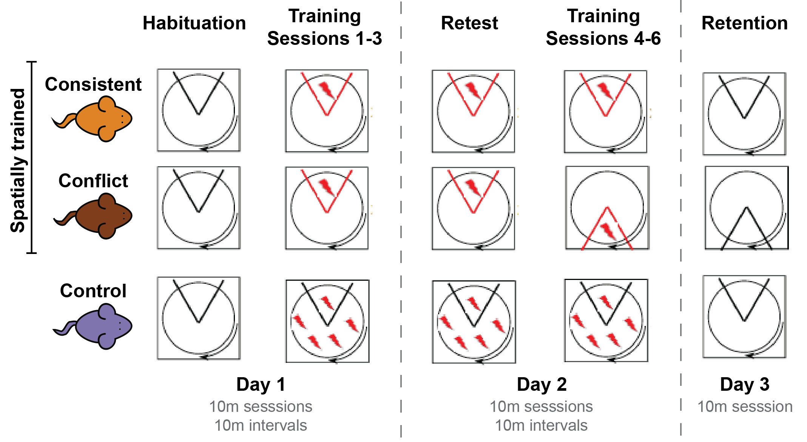
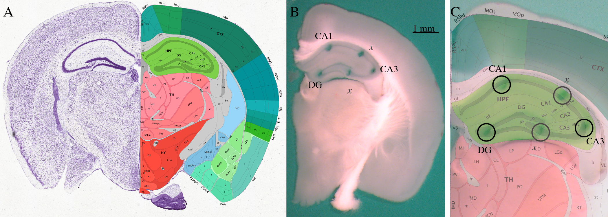

## Methods Overview

### Animals
The animals used in the following experiments were 11 week old male C57BL/6 mice. All animals were generously donated by The Jackson Laboratory. All experimental animal procedures complied with NIH and institutional guidelines, and were approved by the Institutional Animal Care and Use Committee of the Woods Hole Marine Biology Laboratory.

### Leanring and Memory Beahvioral Task
We trained mice in the hippocampus-dependent active place avoidance task. using two spatial **Same** and **Conflict** and one non-spatial **Yoked** variant. The active place avoidance task consisted of nine "sessions" where a single mouse is on the rotating arena for 10 minutes per session spread across three days. We have two Active Place Avoidance arenas for simulating running the spatial and non-spatial variants in parallel (Same and Yoked or Conflict and Yoked). The location of the shock zone remained constant for 3 days for the “Same” group; however the shock zone was rotated 180 degrees on Day 2 for the "Conflict" animals. For the “Yoked” group was not subject to a stationary shock zone, rather these animals were shocked whenever their partner was shocked. These yoked animals there for control for the stress of being shocked, but they do not have any spatial learning.

On Day 1, each mouse was placed on the slowly rotating arena and allowed to explore during a 10-min habituation session. After a 2-h rest in the home cage, each mouse was returned to the identical rotating arena for the initial training phase. During training, spatially trained "Same" and "Conflict" mice receive a mild (0.2 mA, 500 ms, 60 Hz constant current) unpleasant foot shock when it enters the stationary 60 degree shock zone. This shock zone itself is unmarked but can be located using its relationship to the stationary extra-maze landmarks. The non-spatially trained "Yoked" mice receive the same mildly unpleasant foot shock at the exact moment when the spaitially trained mouse is shocked; thus, the non-spatially trained mouse is shocked randomly and without respected to any spatial cues. Two more 10-min training sessions are given, each after a 2-h rest in the home cage. The three training sessions are referred to as T1, T2, and T3. On Day 2, a he conditioned avoidance is tested in a "Retest" session in the identical, initial conditions. After a 2-h rest in the home cage, the mouse was returned to the identical rotating arena for either a fourth training session (T4) with the shock zone in the same place for "Same animals" or the first conflict session (C1) with the shock zone rotated 180 degrees for the "Conflict" animals. Rotation of the shock zone presents a memory conflict, because the animals have to learn that there is a new shock zone and that the old zone is now shock free. Two more 10-min training or conflict sessions were given, each after a 2-h rest in the home cage. The two addition training sessions were referred to as T5 and T6, which the two additional conflict sessions were referred to ad C2 and C3. On the third and final day, animals are returned to the testing room for a "Retention" session. During this session, the shock zone is inactive and we test whether or not the animal has retained a memory of the shock zone location. After this 10 minute session, the animals are retuned to their cage. During all sessions, behavior was quantified using automated video tracking. Measures reflective of locomotor activity, learning, and memory were quantified. Data were imported in R for analysis and visualization.

### Hippocampus tissue collection

Thirty minutes after the Retention session, mice were deeply anesthetized with 5% vaporized isoflurane in oxygen then killed via decapitation. The brain was rapidly dissected, and the hippocampus was removed. Transverse hippocampal slices were cut down the midline in ice cold artificial cerebrospinal fluid (ACSF). Slices were cut down the midline so that the left hemisphere could be used for neurophysiology and the right for RNA-sequencing. Then, slices were warmed in oxygenated ACSF to for 45 min. Slices were then allowed to equilibrate for at least 60 min in oxygenated ACSF at room temperature. I microdissected the CA1, CA2, CA3, CA4, and dentate gyrus (DG) regions from multiple slices using  using a 0.25 mm punch (Electron Microscopy Systems) and a dissecting scope (Zeiss). A photograph of the slice was taken before and after microdissection to maintaing a neuroanotimical record. 

### Transcriptomic analysis 

Each punch was homogenized in homogenization buffer from the Maxwell 16 LEV RNA isolation kit (Promega). RNA from CA1, CA3, and from DG from dorsal hippocampal slices was isolated using the Maxwell 16 LEV RNA isolation kit. RNA was sent to the Genomic Sequencing and Analysis Facility at The University of Texas at Austin for library preparation and sequencing. The librarys were prepared with the \textit{insert name of illumina kit} to generate 150 bp paired-end fragments. Librarires were sequenced on the Illumina Hi-Seq with a target 50 million reads per samples. Raw reads were downloaded from the Amazon cloud server to the Stampede Cluster at the Texas Advanced Computing Facility for processing and anlaysis. RNA quality was checked using the bioinformatic program FASTQC. Low quality reads and adapter sequences were removed using the program Cutadapt. Read alignment and counting was performed using the bioinformatic program Kallisto  and the mouse reference genome M10. Then, data were imported into R for anlaysis and vizualization. Counts were calculated at the transcript level with Kallisto and collapsed into gene-level counts with user defined functions. Differential gene expression was quantified using the program DESeq2. Results were visualized in R.
