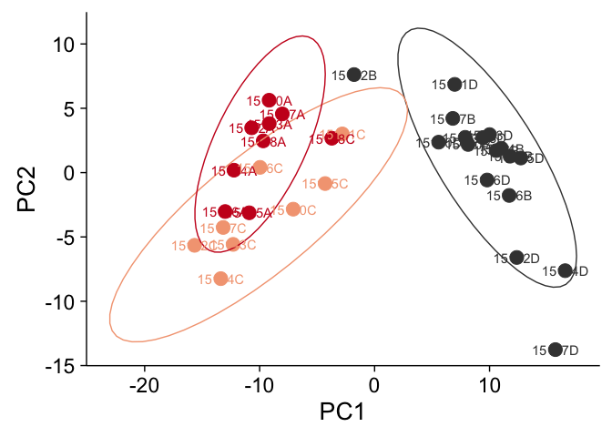
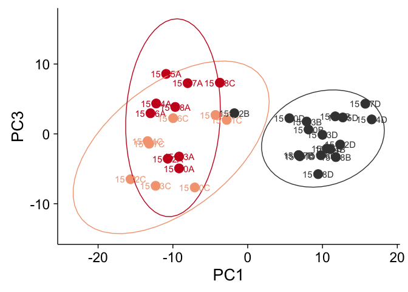
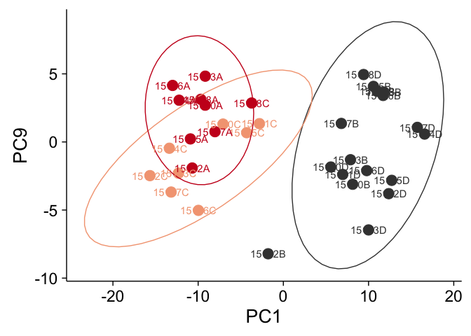
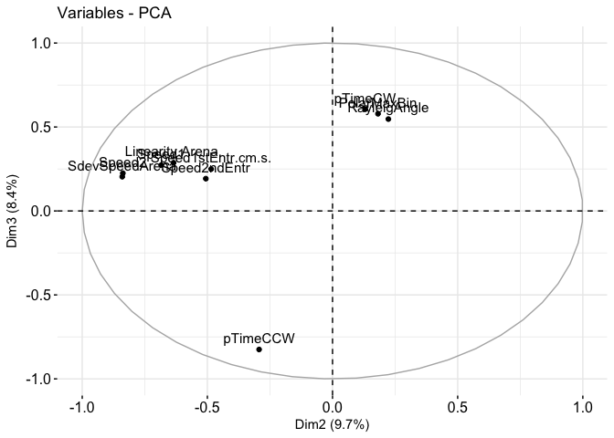
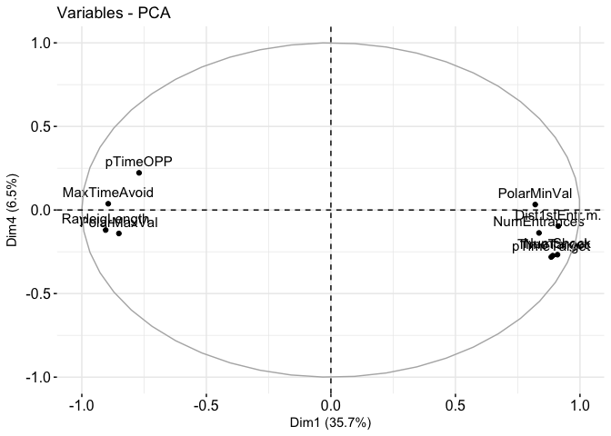
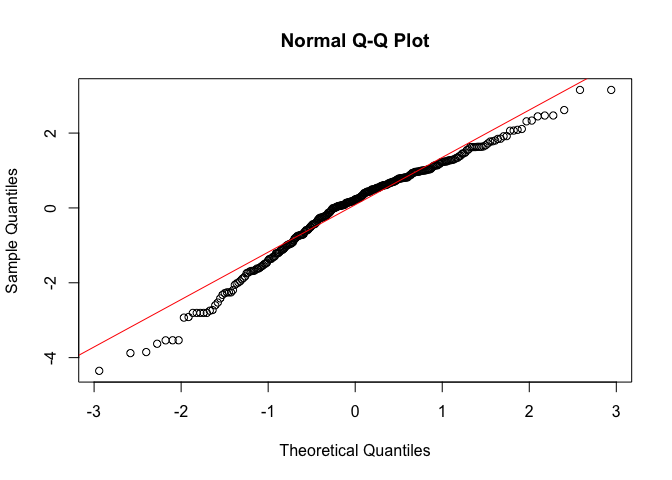

This R Markdown document will create the behavioral analysis figures

``` r
## load libraries 
library(magrittr) ## to use the weird pipe
library(ggplot2) ## for awesome plots!
```

    ## Warning: package 'ggplot2' was built under R version 3.3.2

``` r
library(gplots) ##for making awesome plots
library(cowplot) ## for some easy to use themes
library(tidyr) ## for respahing data
```

    ## Warning: package 'tidyr' was built under R version 3.3.2

``` r
library(plyr) ## for renmaing factors
library(dplyr) ## for filtering and selecting rows
library(reshape2) ## for melting dataframe
library(pheatmap) ## for pretty heat maps
library(car) ## for statistics
```

    ## Warning: package 'car' was built under R version 3.3.2

``` r
library(relaimpo) ## for linear model predictions
```

    ## Warning: package 'Matrix' was built under R version 3.3.2

``` r
# install.packages("devtools")
#library("devtools")
#install_github("kassambara/factoextra")
library("factoextra") # for fancy pca plots
```

    ## Warning: package 'factoextra' was built under R version 3.3.2

``` r
## load functions 
source("functions_behavior.R")

## set output file for figures 
knitr::opts_chunk$set(fig.path = '../figures/Fig2/')
```

``` r
## read intermediate data (raw data from video tracker program analyzed in matlab)
behavior <- read.csv("../data/01_behaviordata.csv", header = T)

## relevel factors
behavior$APA <- factor(behavior$APA, levels = c("Yoked", "Same", "Conflict"))
behavior$APA2 <- factor(behavior$APA2, levels = c("YokedSame", "YokedConflict","Same", "Conflict"))

## create a log transformed time for first entrance
behavior$Time1stEntrLog <- log(behavior$Time1stEntr)

## subset to view just the data from the retention session
retention <- behavior %>% filter(TrainSessionCombo == "Retention") %>%  droplevels() 
```

``` r
behaviorsummary <- summarise(group_by(behavior, APA), m = mean(Time1stEntr), se = sd(Time1stEntr)/sqrt(length(Time1stEntr)))
A <- ggplot(behaviorsummary, aes(x=APA, y=m, color=APA)) + 
    geom_errorbar(aes(ymin=m-se, ymax=m+se, color=APA), width=.1) +
    geom_point(size = 2) +
    scale_y_continuous(name="Time to First Entrance (s)") +
    scale_x_discrete(name=NULL) +
  theme_cowplot(font_size = 16, line_size = 1) +
  background_grid(major = "xy", minor = "none") +
  scale_color_manual(values = colorvalAPA) +
  theme(legend.position="none") 

behaviorsummary <- summarise(group_by(behavior, APA), m = mean(NumEntrances), se = sd(NumEntrances)/sqrt(length(NumEntrances)))

B <- ggplot(behaviorsummary, aes(x=APA, y=m, color=APA)) + 
    geom_errorbar(aes(ymin=m-se, ymax=m+se), width=.1) +
    geom_point(size = 2) +
    scale_y_continuous(name="Number of Entrances") +
    scale_x_discrete(name=NULL) +
  theme_cowplot(font_size = 16, line_size = 1) +
  background_grid(major = "xy", minor = "none") +
  scale_color_manual(values = colorvalAPA) +
  theme(legend.position="none")

plot_grid(A,B, nrow=1, labels=c("A", "B"))
```


``` r
meansem <- plot_grid(A,B, nrow=1, labels=c("A", "B"))

pdf(file="../figures/Fig1/meansem.pdf", width=6, height=3)
plot(meansem)
dev.off()
```

    ## quartz_off_screen 
    ##                 2

Behavior Data Visualization
---------------------------

### Box Plots

The next three plots show that spatially trained show increased latency to enter the shock zone (A) and avoid the shock zone (B) on the retention session when compared to yoked aniamals that were not spatially trained. A closer inspection of the behavior of each individual shows that trained mice spend most of their time opposite of the shock zone (C), with the exception of the conflict trained mice on conflict session 1 the the shock zone is rotated 180C.

``` r
A <- myboxplotnolegend(data = behavior,xcol = "TrainSessionCombo", 
                ycol = "Time1stEntr", colorcode = "APA", session ="Retention",
                yaxislabel="\n Time to 1st Entrance (s)")

B <- myboxplot(data = behavior, xcol = "TrainSessionCombo", 
                ycol = "NumEntrances", colorcode = "APA", 
                session ="Retention",
                yaxislabel="\n Number of Entrances") 

plot_grid(A,B, nrow=1, rel_widths=c(0.45, 0.55), labels=c("A", "B"))
```


``` r
boxplot <- plot_grid(A,B, nrow=1, rel_widths=c(0.45, 0.55), labels=c("A", "B"))

pdf(file="../figures/Fig1/boxplot.pdf", width=6, height=3)
plot(boxplot)
dev.off()
```

    ## quartz_off_screen 
    ##                 2

``` r
C <- onebehavior(data=behavior, xcol="TrainSessionComboNum", ycol="pTimeOPP",
                  yaxislabel=" Proportion of time spent\n opposite the shock zone",
                  colorcode="APA")

pdf(file="../figures/Fig1/onebehavior.pdf", width=6, height=4)
plot(C)
```

    ## `geom_smooth()` using method = 'loess'

``` r
dev.off()
```

    ## quartz_off_screen 
    ##                 2

### Heatmap

The next image shows how all the behaviors measured change over time. Here, the data are normalized to a z-score with more positive values shown in red and negative values show in blue. Each row contains value for each behavioral measurement. Each column is the average value for a group of animals as specific by APA group (purple, orange, brown) and training session (from white to black according to increasing time spend in the active place avoidance group).

``` r
## see the makesessionheatmap documentataion for data tidying and plot specifications
makesessionheatmap(behavior)
```


### Principle component analysis (PCA)

Given the correlational structure of the data, I next reduced the dimentionality with a PCA anlaysis. You can see that PC1 speparates trained and untraned animals (D,E) but neither PC2 (D) nor PC3 (E) separate same and conflict aniamls. Elipses show 95% confidence interval.

``` r
scoresdf <- makepcadf(behavior) #create the 

makepcaplot(data=scoresdf,xcol="PC1",ycol="PC2",colorcode="APA")
```



``` r
makepcaplot(data=scoresdf,xcol="PC1",ycol="PC3",colorcode="APA")
```



``` r
makepcaplot(data=scoresdf,xcol="PC2",ycol="PC3",colorcode="APA")
```


``` r
makepcaplot(data=scoresdf,xcol="PC1",ycol="PC4",colorcode="APA")
```


``` r
makepcaplot(data=scoresdf,xcol="PC1",ycol="PC5",colorcode="APA")
```


``` r
makepcaplot(data=scoresdf,xcol="PC1",ycol="PC6",colorcode="APA")
```


``` r
makepcaplot(data=scoresdf,xcol="PC1",ycol="PC7",colorcode="APA")
```


``` r
makepcaplot(data=scoresdf,xcol="PC1",ycol="PC8",colorcode="APA")
```


``` r
makepcaplot(data=scoresdf,xcol="PC1",ycol="PC9",colorcode="APA")
```



``` r
makepcaplot(data=scoresdf,xcol="PC1",ycol="PC10",colorcode="APA")
```


``` r
source("functions_behavior.R")

# capture the rotation matrix in a data frame
rotation_data <- mkrotationdata(behavior)
```

    ## 'data.frame':    360 obs. of  35 variables:
    ##  $ PC1     : num  -0.0441 -0.049 -0.0233 -0.0414 -0.017 ...
    ##  $ PC2     : num  0.0231 -0.0202 0.0262 -0.0455 0.0466 ...
    ##  $ PC3     : num  0.0757 0.0738 0.0351 0.0183 0.012 ...
    ##  $ PC4     : num  -0.0987 -0.1047 -0.0887 -0.071 -0.0571 ...
    ##  $ PC5     : num  -0.02711 -0.02321 -0.02452 -0.00852 -0.07279 ...
    ##  $ PC6     : num  -0.0215 -0.0179 -0.0305 -0.0114 0.0113 ...
    ##  $ PC7     : num  -0.01731 -0.06523 0.06213 -0.10985 0.00896 ...
    ##  $ PC8     : num  -0.1057 -0.0675 -0.1347 0.0086 0.0485 ...
    ##  $ PC9     : num  0.0408 0.0561 0.0339 0.0312 0.1213 ...
    ##  $ PC10    : num  0.0115 0.0532 -0.0177 0.0375 -0.0291 ...
    ##  $ PC11    : num  -0.13857 -0.0563 -0.13212 0.00426 -0.13492 ...
    ##  $ PC12    : num  -0.0358 -0.0116 -0.0637 -0.0132 -0.0184 ...
    ##  $ PC13    : num  -0.00952 -0.03178 0.0117 0.07186 -0.06115 ...
    ##  $ PC14    : num  0.02667 0.05893 -0.00494 0.10288 0.04849 ...
    ##  $ PC15    : num  -0.0486 -0.0975 0.0156 -0.1 0.017 ...
    ##  $ PC16    : num  0.0126 0.0338 0.0188 0.0495 -0.0434 ...
    ##  $ PC17    : num  0.02118 0.02026 0.07371 -0.06109 0.00136 ...
    ##  $ PC18    : num  0.0474 0.0369 0.0461 0.0291 0.0213 ...
    ##  $ PC19    : num  0.00154 -0.03977 -0.02195 -0.09976 -0.03083 ...
    ##  $ PC20    : num  -0.006 0.0534 -0.1055 0.0741 -0.0121 ...
    ##  $ PC21    : num  0.0838 0.0272 0.0806 -0.0904 0.0954 ...
    ##  $ PC22    : num  0.01047 0.09824 0.06281 -0.02868 -0.00431 ...
    ##  $ PC23    : num  0.03905 -0.01752 -0.00796 -0.07779 0.08059 ...
    ##  $ PC24    : num  -0.0424 -0.0148 -0.0056 0.0215 0.1458 ...
    ##  $ PC25    : num  0.0334 0.0125 -0.0428 -0.0477 0.0806 ...
    ##  $ PC26    : num  -0.0887 -0.0712 -0.0675 -0.1032 0.0442 ...
    ##  $ PC27    : num  -0.013009 0.008914 0.000234 0.081901 -0.047246 ...
    ##  $ PC28    : num  -0.0156 0.0372 -0.07 0.0401 -0.0193 ...
    ##  $ PC29    : num  0.04799 0.00863 0.000895 0.045915 -0.044004 ...
    ##  $ PC30    : num  -0.04214 -0.03311 0.04827 0.01359 0.00935 ...
    ##  $ PC31    : num  -0.00415 -0.0528 0.05691 -0.04775 0.10618 ...
    ##  $ PC32    : num  -0.0168 0.0344 -0.1252 0.0473 -0.1981 ...
    ##  $ PC33    : num  0.0338 0.0536 0.066 0.0211 -0.0472 ...
    ##  $ PC34    : num  -0.22674 0.00302 0.33786 -0.06677 0.08603 ...
    ##  $ variable: Factor w/ 360 levels "Hab_AnnularAvg",..: 1 2 3 4 5 6 7 8 9 10 ...

``` r
# define a pleasing arrow style
arrow_style <- arrow(length = unit(0.05, "inches"),
                     type = "closed")
# now plot, using geom_segment() for arrows and geom_text for labels
ggplot(rotation_data) + 
  geom_segment(aes(xend=PC1, yend=PC2), x=0, y=0, arrow=arrow_style) + 
  geom_text(aes(x=PC1, y=PC2, label=variable), hjust=0, size=3, color='red') + 
  coord_fixed() # fix aspect ratio to 1:1
```


``` r
library("factoextra")
res.pca <- behavior[c(20:58)]  
res.pca <- prcomp(res.pca,  scale = TRUE)
fviz_pca_ind(res.pca)
```


``` r
fviz_pca_ind(res.pca, label="none", habillage=behavior$APA,
             addEllipses=TRUE, ellipse.level=0.95) + scale_color_manual(values=colorvalAPA)
```


``` r
fviz_pca_var(res.pca, select.var = list(contrib = 20))
```


``` r
fviz_pca_var(res.pca, geom = c("point", "text"), select.var = list(contrib = 20))
```


``` r
frizvectors <- fviz_pca_var(res.pca, geom = c("point", "text"), select.var = list(contrib = 20), axes = c(2, 3))


fviz_pca_var(res.pca, geom = c("point", "text"), select.var = list(contrib = 10), axes = c(2, 3))
```



``` r
fviz_pca_var(res.pca, geom = c("point", "text"), select.var = list(contrib = 10), axes = c(1, 4))
```



``` r
pdf(file="../figures/Fig1/frizvectors.pdf", width=4, height=4)
plot(frizvectors)
dev.off()
```

    ## quartz_off_screen 
    ##                 2

### stats

``` r
##  Leven Test
## is variance signficant? Yes. Not conna be able to use anova
leveneTest(Time1stEntr~APA, data=retention)
```

    ## Levene's Test for Homogeneity of Variance (center = median)
    ##       Df F value  Pr(>F)  
    ## group  2  5.3551 0.01005 *
    ##       31                  
    ## ---
    ## Signif. codes:  0 '***' 0.001 '**' 0.01 '*' 0.05 '.' 0.1 ' ' 1

``` r
## group  2  5.3551 0.01005 *  ==> significant, need to transform
leveneTest(Time1stEntrLog~APA, data=retention)
```

    ## Levene's Test for Homogeneity of Variance (center = median)
    ##       Df F value Pr(>F)
    ## group  2    0.23 0.7959
    ##       31

``` r
## group  2    0.23 0.7959  ==>  yeah, no longer signfifcant. can do anova
leveneTest(NumEntrances~APA, data=retention)
```

    ## Levene's Test for Homogeneity of Variance (center = median)
    ##       Df F value Pr(>F)
    ## group  2  0.8582 0.4337
    ##       31

``` r
## group  2  0.8582 0.4337  ==> not significant, can do anova

##  one way anova on retention
avoTime <- aov(retention$Time1stEntrLog ~ retention$APA)
summary(avoTime)
```

    ##               Df Sum Sq Mean Sq F value  Pr(>F)    
    ## retention$APA  2  31.44  15.718   9.435 0.00063 ***
    ## Residuals     31  51.64   1.666                    
    ## ---
    ## Signif. codes:  0 '***' 0.001 '**' 0.01 '*' 0.05 '.' 0.1 ' ' 1

``` r
TukeyHSD(avoTime)
```

    ##   Tukey multiple comparisons of means
    ##     95% family-wise confidence level
    ## 
    ## Fit: aov(formula = retention$Time1stEntrLog ~ retention$APA)
    ## 
    ## $`retention$APA`
    ##                      diff        lwr       upr     p adj
    ## Same-Yoked      2.2196969  0.8577240 3.5816697 0.0010054
    ## Conflict-Yoked  1.5470339  0.2375238 2.8565440 0.0178203
    ## Conflict-Same  -0.6726629 -2.2162321 0.8709063 0.5378898

``` r
avoNum <- aov(retention$NumEntrances ~ retention$APA)
summary(avoNum)
```

    ##               Df Sum Sq Mean Sq F value   Pr(>F)    
    ## retention$APA  2 1048.9   524.4   25.33 3.02e-07 ***
    ## Residuals     31  641.8    20.7                     
    ## ---
    ## Signif. codes:  0 '***' 0.001 '**' 0.01 '*' 0.05 '.' 0.1 ' ' 1

``` r
TukeyHSD(avoNum)
```

    ##   Tukey multiple comparisons of means
    ##     95% family-wise confidence level
    ## 
    ## Fit: aov(formula = retention$NumEntrances ~ retention$APA)
    ## 
    ## $`retention$APA`
    ##                      diff        lwr       upr     p adj
    ## Same-Yoked     -12.161765 -16.963276 -7.360253 0.0000019
    ## Conflict-Yoked  -9.967320 -14.583879 -5.350761 0.0000255
    ## Conflict-Same    2.194444  -3.247269  7.636158 0.5870227

``` r
### liear model
mymodel <- lm(behavior$Time1stEntrLog ~ behavior$APA * behavior$TrainSessionCombo)
qqnorm(mymodel$residuals)
qqline(mymodel$residuals,col='red')
```



``` r
plot(mymodel$fitted.values,mymodel$residuals)
abline(h=0, col='red')
```


``` r
summary(mymodel)
```

    ## 
    ## Call:
    ## lm(formula = behavior$Time1stEntrLog ~ behavior$APA * behavior$TrainSessionCombo)
    ## 
    ## Residuals:
    ##     Min      1Q  Median      3Q     Max 
    ## -4.3532 -0.7696  0.2256  0.9386  3.1523 
    ## 
    ## Coefficients:
    ##                                                          Estimate
    ## (Intercept)                                                1.9666
    ## behavior$APASame                                          -0.9795
    ## behavior$APAConflict                                      -0.2423
    ## behavior$TrainSessionComboRetention                        1.2497
    ## behavior$TrainSessionComboRetest                           0.2042
    ## behavior$TrainSessionComboT1                              -0.3448
    ## behavior$TrainSessionComboT2                               1.4157
    ## behavior$TrainSessionComboT3                               0.9370
    ## behavior$TrainSessionComboT4_C1                            1.2522
    ## behavior$TrainSessionComboT5_C2                            0.3861
    ## behavior$TrainSessionComboT6_C3                            0.9347
    ## behavior$APASame:behavior$TrainSessionComboRetention       3.1992
    ## behavior$APAConflict:behavior$TrainSessionComboRetention   1.7894
    ## behavior$APASame:behavior$TrainSessionComboRetest          3.6340
    ## behavior$APAConflict:behavior$TrainSessionComboRetest      3.4683
    ## behavior$APASame:behavior$TrainSessionComboT1              0.6541
    ## behavior$APAConflict:behavior$TrainSessionComboT1          0.3512
    ## behavior$APASame:behavior$TrainSessionComboT2              1.6076
    ## behavior$APAConflict:behavior$TrainSessionComboT2          0.3632
    ## behavior$APASame:behavior$TrainSessionComboT3              2.2559
    ## behavior$APAConflict:behavior$TrainSessionComboT3          2.5333
    ## behavior$APASame:behavior$TrainSessionComboT4_C1           3.0166
    ## behavior$APAConflict:behavior$TrainSessionComboT4_C1      -1.9268
    ## behavior$APASame:behavior$TrainSessionComboT5_C2           1.8714
    ## behavior$APAConflict:behavior$TrainSessionComboT5_C2       1.7169
    ## behavior$APASame:behavior$TrainSessionComboT6_C3           2.8489
    ## behavior$APAConflict:behavior$TrainSessionComboT6_C3       2.4153
    ##                                                          Std. Error
    ## (Intercept)                                                  0.3419
    ## behavior$APASame                                             0.6044
    ## behavior$APAConflict                                         0.5812
    ## behavior$TrainSessionComboRetention                          0.4835
    ## behavior$TrainSessionComboRetest                             0.4835
    ## behavior$TrainSessionComboT1                                 0.4835
    ## behavior$TrainSessionComboT2                                 0.4835
    ## behavior$TrainSessionComboT3                                 0.4835
    ## behavior$TrainSessionComboT4_C1                              0.4835
    ## behavior$TrainSessionComboT5_C2                              0.4835
    ## behavior$TrainSessionComboT6_C3                              0.4835
    ## behavior$APASame:behavior$TrainSessionComboRetention         0.8548
    ## behavior$APAConflict:behavior$TrainSessionComboRetention     0.8219
    ## behavior$APASame:behavior$TrainSessionComboRetest            0.8548
    ## behavior$APAConflict:behavior$TrainSessionComboRetest        0.8219
    ## behavior$APASame:behavior$TrainSessionComboT1                0.8548
    ## behavior$APAConflict:behavior$TrainSessionComboT1            0.8219
    ## behavior$APASame:behavior$TrainSessionComboT2                0.8548
    ## behavior$APAConflict:behavior$TrainSessionComboT2            0.8219
    ## behavior$APASame:behavior$TrainSessionComboT3                0.8548
    ## behavior$APAConflict:behavior$TrainSessionComboT3            0.8219
    ## behavior$APASame:behavior$TrainSessionComboT4_C1             0.8548
    ## behavior$APAConflict:behavior$TrainSessionComboT4_C1         0.8219
    ## behavior$APASame:behavior$TrainSessionComboT5_C2             0.8548
    ## behavior$APAConflict:behavior$TrainSessionComboT5_C2         0.8219
    ## behavior$APASame:behavior$TrainSessionComboT6_C3             0.8548
    ## behavior$APAConflict:behavior$TrainSessionComboT6_C3         0.8219
    ##                                                          t value Pr(>|t|)
    ## (Intercept)                                                5.752 2.32e-08
    ## behavior$APASame                                          -1.621 0.106240
    ## behavior$APAConflict                                      -0.417 0.677014
    ## behavior$TrainSessionComboRetention                        2.584 0.010261
    ## behavior$TrainSessionComboRetest                           0.422 0.673108
    ## behavior$TrainSessionComboT1                              -0.713 0.476354
    ## behavior$TrainSessionComboT2                               2.928 0.003697
    ## behavior$TrainSessionComboT3                               1.938 0.053661
    ## behavior$TrainSessionComboT4_C1                            2.590 0.010110
    ## behavior$TrainSessionComboT5_C2                            0.798 0.425323
    ## behavior$TrainSessionComboT6_C3                            1.933 0.054255
    ## behavior$APASame:behavior$TrainSessionComboRetention       3.743 0.000221
    ## behavior$APAConflict:behavior$TrainSessionComboRetention   2.177 0.030305
    ## behavior$APASame:behavior$TrainSessionComboRetest          4.251 2.90e-05
    ## behavior$APAConflict:behavior$TrainSessionComboRetest      4.220 3.31e-05
    ## behavior$APASame:behavior$TrainSessionComboT1              0.765 0.444802
    ## behavior$APAConflict:behavior$TrainSessionComboT1          0.427 0.669496
    ## behavior$APASame:behavior$TrainSessionComboT2              1.881 0.061051
    ## behavior$APAConflict:behavior$TrainSessionComboT2          0.442 0.658932
    ## behavior$APASame:behavior$TrainSessionComboT3              2.639 0.008778
    ## behavior$APAConflict:behavior$TrainSessionComboT3          3.082 0.002259
    ## behavior$APASame:behavior$TrainSessionComboT4_C1           3.529 0.000488
    ## behavior$APAConflict:behavior$TrainSessionComboT4_C1      -2.344 0.019757
    ## behavior$APASame:behavior$TrainSessionComboT5_C2           2.189 0.029400
    ## behavior$APAConflict:behavior$TrainSessionComboT5_C2       2.089 0.037607
    ## behavior$APASame:behavior$TrainSessionComboT6_C3           3.333 0.000976
    ## behavior$APAConflict:behavior$TrainSessionComboT6_C3       2.939 0.003571
    ##                                                             
    ## (Intercept)                                              ***
    ## behavior$APASame                                            
    ## behavior$APAConflict                                        
    ## behavior$TrainSessionComboRetention                      *  
    ## behavior$TrainSessionComboRetest                            
    ## behavior$TrainSessionComboT1                                
    ## behavior$TrainSessionComboT2                             ** 
    ## behavior$TrainSessionComboT3                             .  
    ## behavior$TrainSessionComboT4_C1                          *  
    ## behavior$TrainSessionComboT5_C2                             
    ## behavior$TrainSessionComboT6_C3                          .  
    ## behavior$APASame:behavior$TrainSessionComboRetention     ***
    ## behavior$APAConflict:behavior$TrainSessionComboRetention *  
    ## behavior$APASame:behavior$TrainSessionComboRetest        ***
    ## behavior$APAConflict:behavior$TrainSessionComboRetest    ***
    ## behavior$APASame:behavior$TrainSessionComboT1               
    ## behavior$APAConflict:behavior$TrainSessionComboT1           
    ## behavior$APASame:behavior$TrainSessionComboT2            .  
    ## behavior$APAConflict:behavior$TrainSessionComboT2           
    ## behavior$APASame:behavior$TrainSessionComboT3            ** 
    ## behavior$APAConflict:behavior$TrainSessionComboT3        ** 
    ## behavior$APASame:behavior$TrainSessionComboT4_C1         ***
    ## behavior$APAConflict:behavior$TrainSessionComboT4_C1     *  
    ## behavior$APASame:behavior$TrainSessionComboT5_C2         *  
    ## behavior$APAConflict:behavior$TrainSessionComboT5_C2     *  
    ## behavior$APASame:behavior$TrainSessionComboT6_C3         ***
    ## behavior$APAConflict:behavior$TrainSessionComboT6_C3     ** 
    ## ---
    ## Signif. codes:  0 '***' 0.001 '**' 0.01 '*' 0.05 '.' 0.1 ' ' 1
    ## 
    ## Residual standard error: 1.41 on 279 degrees of freedom
    ## Multiple R-squared:  0.4816, Adjusted R-squared:  0.4333 
    ## F-statistic: 9.968 on 26 and 279 DF,  p-value: < 2.2e-16

``` r
mymodel2 <- lm(behavior$NumEntrances ~ behavior$APA * behavior$TrainSessionCombo)
qqnorm(mymodel2$residuals)
qqline(mymodel2$residuals,col='red')
```


``` r
plot(mymodel2$fitted.values,mymodel2$residuals)
abline(h=0, col='red')
```


``` r
summary(mymodel2)
```

    ## 
    ## Call:
    ## lm(formula = behavior$NumEntrances ~ behavior$APA * behavior$TrainSessionCombo)
    ## 
    ## Residuals:
    ##      Min       1Q   Median       3Q      Max 
    ## -12.8824  -3.1176  -0.8529   2.7396  21.7778 
    ## 
    ## Coefficients:
    ##                                                          Estimate
    ## (Intercept)                                               31.8824
    ## behavior$APASame                                          -0.7574
    ## behavior$APAConflict                                      -0.2157
    ## behavior$TrainSessionComboRetention                      -16.4706
    ## behavior$TrainSessionComboRetest                         -15.4118
    ## behavior$TrainSessionComboT1                             -10.8235
    ## behavior$TrainSessionComboT2                             -17.4706
    ## behavior$TrainSessionComboT3                             -16.7647
    ## behavior$TrainSessionComboT4_C1                          -16.9412
    ## behavior$TrainSessionComboT5_C2                          -17.7059
    ## behavior$TrainSessionComboT6_C3                          -16.1176
    ## behavior$APASame:behavior$TrainSessionComboRetention     -11.4044
    ## behavior$APAConflict:behavior$TrainSessionComboRetention  -9.7516
    ## behavior$APASame:behavior$TrainSessionComboRetest        -12.3382
    ## behavior$APAConflict:behavior$TrainSessionComboRetest    -14.0327
    ## behavior$APASame:behavior$TrainSessionComboT1            -13.1765
    ## behavior$APAConflict:behavior$TrainSessionComboT1        -12.5098
    ## behavior$APASame:behavior$TrainSessionComboT2             -8.4044
    ## behavior$APAConflict:behavior$TrainSessionComboT2        -11.6405
    ## behavior$APASame:behavior$TrainSessionComboT3            -10.9853
    ## behavior$APAConflict:behavior$TrainSessionComboT3        -12.3464
    ## behavior$APASame:behavior$TrainSessionComboT4_C1          -9.9338
    ## behavior$APAConflict:behavior$TrainSessionComboT4_C1       3.7190
    ## behavior$APASame:behavior$TrainSessionComboT5_C2          -9.7941
    ## behavior$APAConflict:behavior$TrainSessionComboT5_C2      -7.7386
    ## behavior$APASame:behavior$TrainSessionComboT6_C3         -10.7574
    ## behavior$APAConflict:behavior$TrainSessionComboT6_C3      -9.6601
    ##                                                          Std. Error
    ## (Intercept)                                                  1.1776
    ## behavior$APASame                                             2.0818
    ## behavior$APAConflict                                         2.0016
    ## behavior$TrainSessionComboRetention                          1.6654
    ## behavior$TrainSessionComboRetest                             1.6654
    ## behavior$TrainSessionComboT1                                 1.6654
    ## behavior$TrainSessionComboT2                                 1.6654
    ## behavior$TrainSessionComboT3                                 1.6654
    ## behavior$TrainSessionComboT4_C1                              1.6654
    ## behavior$TrainSessionComboT5_C2                              1.6654
    ## behavior$TrainSessionComboT6_C3                              1.6654
    ## behavior$APASame:behavior$TrainSessionComboRetention         2.9441
    ## behavior$APAConflict:behavior$TrainSessionComboRetention     2.8307
    ## behavior$APASame:behavior$TrainSessionComboRetest            2.9441
    ## behavior$APAConflict:behavior$TrainSessionComboRetest        2.8307
    ## behavior$APASame:behavior$TrainSessionComboT1                2.9441
    ## behavior$APAConflict:behavior$TrainSessionComboT1            2.8307
    ## behavior$APASame:behavior$TrainSessionComboT2                2.9441
    ## behavior$APAConflict:behavior$TrainSessionComboT2            2.8307
    ## behavior$APASame:behavior$TrainSessionComboT3                2.9441
    ## behavior$APAConflict:behavior$TrainSessionComboT3            2.8307
    ## behavior$APASame:behavior$TrainSessionComboT4_C1             2.9441
    ## behavior$APAConflict:behavior$TrainSessionComboT4_C1         2.8307
    ## behavior$APASame:behavior$TrainSessionComboT5_C2             2.9441
    ## behavior$APAConflict:behavior$TrainSessionComboT5_C2         2.8307
    ## behavior$APASame:behavior$TrainSessionComboT6_C3             2.9441
    ## behavior$APAConflict:behavior$TrainSessionComboT6_C3         2.8307
    ##                                                          t value Pr(>|t|)
    ## (Intercept)                                               27.073  < 2e-16
    ## behavior$APASame                                          -0.364 0.716282
    ## behavior$APAConflict                                      -0.108 0.914266
    ## behavior$TrainSessionComboRetention                       -9.890  < 2e-16
    ## behavior$TrainSessionComboRetest                          -9.254  < 2e-16
    ## behavior$TrainSessionComboT1                              -6.499 3.71e-10
    ## behavior$TrainSessionComboT2                             -10.490  < 2e-16
    ## behavior$TrainSessionComboT3                             -10.066  < 2e-16
    ## behavior$TrainSessionComboT4_C1                          -10.172  < 2e-16
    ## behavior$TrainSessionComboT5_C2                          -10.631  < 2e-16
    ## behavior$TrainSessionComboT6_C3                           -9.678  < 2e-16
    ## behavior$APASame:behavior$TrainSessionComboRetention      -3.874 0.000134
    ## behavior$APAConflict:behavior$TrainSessionComboRetention  -3.445 0.000659
    ## behavior$APASame:behavior$TrainSessionComboRetest         -4.191 3.73e-05
    ## behavior$APAConflict:behavior$TrainSessionComboRetest     -4.957 1.24e-06
    ## behavior$APASame:behavior$TrainSessionComboT1             -4.476 1.11e-05
    ## behavior$APAConflict:behavior$TrainSessionComboT1         -4.419 1.42e-05
    ## behavior$APASame:behavior$TrainSessionComboT2             -2.855 0.004631
    ## behavior$APAConflict:behavior$TrainSessionComboT2         -4.112 5.16e-05
    ## behavior$APASame:behavior$TrainSessionComboT3             -3.731 0.000231
    ## behavior$APAConflict:behavior$TrainSessionComboT3         -4.362 1.82e-05
    ## behavior$APASame:behavior$TrainSessionComboT4_C1          -3.374 0.000845
    ## behavior$APAConflict:behavior$TrainSessionComboT4_C1       1.314 0.189991
    ## behavior$APASame:behavior$TrainSessionComboT5_C2          -3.327 0.000997
    ## behavior$APAConflict:behavior$TrainSessionComboT5_C2      -2.734 0.006661
    ## behavior$APASame:behavior$TrainSessionComboT6_C3          -3.654 0.000308
    ## behavior$APAConflict:behavior$TrainSessionComboT6_C3      -3.413 0.000739
    ##                                                             
    ## (Intercept)                                              ***
    ## behavior$APASame                                            
    ## behavior$APAConflict                                        
    ## behavior$TrainSessionComboRetention                      ***
    ## behavior$TrainSessionComboRetest                         ***
    ## behavior$TrainSessionComboT1                             ***
    ## behavior$TrainSessionComboT2                             ***
    ## behavior$TrainSessionComboT3                             ***
    ## behavior$TrainSessionComboT4_C1                          ***
    ## behavior$TrainSessionComboT5_C2                          ***
    ## behavior$TrainSessionComboT6_C3                          ***
    ## behavior$APASame:behavior$TrainSessionComboRetention     ***
    ## behavior$APAConflict:behavior$TrainSessionComboRetention ***
    ## behavior$APASame:behavior$TrainSessionComboRetest        ***
    ## behavior$APAConflict:behavior$TrainSessionComboRetest    ***
    ## behavior$APASame:behavior$TrainSessionComboT1            ***
    ## behavior$APAConflict:behavior$TrainSessionComboT1        ***
    ## behavior$APASame:behavior$TrainSessionComboT2            ** 
    ## behavior$APAConflict:behavior$TrainSessionComboT2        ***
    ## behavior$APASame:behavior$TrainSessionComboT3            ***
    ## behavior$APAConflict:behavior$TrainSessionComboT3        ***
    ## behavior$APASame:behavior$TrainSessionComboT4_C1         ***
    ## behavior$APAConflict:behavior$TrainSessionComboT4_C1        
    ## behavior$APASame:behavior$TrainSessionComboT5_C2         ***
    ## behavior$APAConflict:behavior$TrainSessionComboT5_C2     ** 
    ## behavior$APASame:behavior$TrainSessionComboT6_C3         ***
    ## behavior$APAConflict:behavior$TrainSessionComboT6_C3     ***
    ## ---
    ## Signif. codes:  0 '***' 0.001 '**' 0.01 '*' 0.05 '.' 0.1 ' ' 1
    ## 
    ## Residual standard error: 4.856 on 279 degrees of freedom
    ## Multiple R-squared:  0.7802, Adjusted R-squared:  0.7597 
    ## F-statistic: 38.08 on 26 and 279 DF,  p-value: < 2.2e-16

``` r
## predictions
(m1relaimpo <- calc.relimp(mymodel, type = "lmg", rela = TRUE))
```

    ## Response variable: behavior$Time1stEntrLog 
    ## Total response variance: 3.506843 
    ## Analysis based on 306 observations 
    ## 
    ## 26 Regressors: 
    ## Some regressors combined in groups: 
    ##         Group  behavior$APA : behavior$APASame behavior$APAConflict 
    ##         Group  behavior$TrainSessionCombo : behavior$TrainSessionComboRetention behavior$TrainSessionComboRetest behavior$TrainSessionComboT1 behavior$TrainSessionComboT2 behavior$TrainSessionComboT3 behavior$TrainSessionComboT4_C1 behavior$TrainSessionComboT5_C2 behavior$TrainSessionComboT6_C3 
    ##         Group  behavior$APA:behavior$TrainSessionCombo : behavior$APASame:behavior$TrainSessionComboRetention behavior$APAConflict:behavior$TrainSessionComboRetention behavior$APASame:behavior$TrainSessionComboRetest behavior$APAConflict:behavior$TrainSessionComboRetest behavior$APASame:behavior$TrainSessionComboT1 behavior$APAConflict:behavior$TrainSessionComboT1 behavior$APASame:behavior$TrainSessionComboT2 behavior$APAConflict:behavior$TrainSessionComboT2 behavior$APASame:behavior$TrainSessionComboT3 behavior$APAConflict:behavior$TrainSessionComboT3 behavior$APASame:behavior$TrainSessionComboT4_C1 behavior$APAConflict:behavior$TrainSessionComboT4_C1 behavior$APASame:behavior$TrainSessionComboT5_C2 behavior$APAConflict:behavior$TrainSessionComboT5_C2 behavior$APASame:behavior$TrainSessionComboT6_C3 behavior$APAConflict:behavior$TrainSessionComboT6_C3 
    ## 
    ##  Relative importance of 3 (groups of) regressors assessed: 
    ##  behavior$APA behavior$TrainSessionCombo behavior$APA:behavior$TrainSessionCombo 
    ##  
    ## Proportion of variance explained by model: 48.16%
    ## Metrics are normalized to sum to 100% (rela=TRUE). 
    ## 
    ## Relative importance metrics: 
    ## 
    ##                                               lmg
    ## behavior$APA                            0.1630560
    ## behavior$TrainSessionCombo              0.4716985
    ## behavior$APA:behavior$TrainSessionCombo 0.3652455
    ## 
    ## Average coefficients for different model sizes: 
    ## 
    ##                                                               1group
    ## behavior$APASame                                          1.14134076
    ## behavior$APAConflict                                      0.94775358
    ## behavior$TrainSessionComboRetention                       2.47611734
    ## behavior$TrainSessionComboRetest                          1.97736151
    ## behavior$TrainSessionComboT1                             -0.09797554
    ## behavior$TrainSessionComboT2                              1.89005138
    ## behavior$TrainSessionComboT3                              2.13839545
    ## behavior$TrainSessionComboT4_C1                           1.45197804
    ## behavior$TrainSessionComboT5_C2                           1.28088422
    ## behavior$TrainSessionComboT6_C3                           2.24433083
    ## behavior$APASame:behavior$TrainSessionComboRetention             NaN
    ## behavior$APAConflict:behavior$TrainSessionComboRetention         NaN
    ## behavior$APASame:behavior$TrainSessionComboRetest                NaN
    ## behavior$APAConflict:behavior$TrainSessionComboRetest            NaN
    ## behavior$APASame:behavior$TrainSessionComboT1                    NaN
    ## behavior$APAConflict:behavior$TrainSessionComboT1                NaN
    ## behavior$APASame:behavior$TrainSessionComboT2                    NaN
    ## behavior$APAConflict:behavior$TrainSessionComboT2                NaN
    ## behavior$APASame:behavior$TrainSessionComboT3                    NaN
    ## behavior$APAConflict:behavior$TrainSessionComboT3                NaN
    ## behavior$APASame:behavior$TrainSessionComboT4_C1                 NaN
    ## behavior$APAConflict:behavior$TrainSessionComboT4_C1             NaN
    ## behavior$APASame:behavior$TrainSessionComboT5_C2                 NaN
    ## behavior$APAConflict:behavior$TrainSessionComboT5_C2             NaN
    ## behavior$APASame:behavior$TrainSessionComboT6_C3                 NaN
    ## behavior$APAConflict:behavior$TrainSessionComboT6_C3             NaN
    ##                                                              2groups
    ## behavior$APASame                                          1.14134076
    ## behavior$APAConflict                                      0.94775358
    ## behavior$TrainSessionComboRetention                       2.47611734
    ## behavior$TrainSessionComboRetest                          1.97736151
    ## behavior$TrainSessionComboT1                             -0.09797554
    ## behavior$TrainSessionComboT2                              1.89005138
    ## behavior$TrainSessionComboT3                              2.13839545
    ## behavior$TrainSessionComboT4_C1                           1.45197804
    ## behavior$TrainSessionComboT5_C2                           1.28088422
    ## behavior$TrainSessionComboT6_C3                           2.24433083
    ## behavior$APASame:behavior$TrainSessionComboRetention             NaN
    ## behavior$APAConflict:behavior$TrainSessionComboRetention         NaN
    ## behavior$APASame:behavior$TrainSessionComboRetest                NaN
    ## behavior$APAConflict:behavior$TrainSessionComboRetest            NaN
    ## behavior$APASame:behavior$TrainSessionComboT1                    NaN
    ## behavior$APAConflict:behavior$TrainSessionComboT1                NaN
    ## behavior$APASame:behavior$TrainSessionComboT2                    NaN
    ## behavior$APAConflict:behavior$TrainSessionComboT2                NaN
    ## behavior$APASame:behavior$TrainSessionComboT3                    NaN
    ## behavior$APAConflict:behavior$TrainSessionComboT3                NaN
    ## behavior$APASame:behavior$TrainSessionComboT4_C1                 NaN
    ## behavior$APAConflict:behavior$TrainSessionComboT4_C1             NaN
    ## behavior$APASame:behavior$TrainSessionComboT5_C2                 NaN
    ## behavior$APAConflict:behavior$TrainSessionComboT5_C2             NaN
    ## behavior$APASame:behavior$TrainSessionComboT6_C3                 NaN
    ## behavior$APAConflict:behavior$TrainSessionComboT6_C3             NaN
    ##                                                             3groups
    ## behavior$APASame                                         -0.9795238
    ## behavior$APAConflict                                     -0.2423279
    ## behavior$TrainSessionComboRetention                       1.2497049
    ## behavior$TrainSessionComboRetest                          0.2042168
    ## behavior$TrainSessionComboT1                             -0.3448374
    ## behavior$TrainSessionComboT2                              1.4156545
    ## behavior$TrainSessionComboT3                              0.9369974
    ## behavior$TrainSessionComboT4_C1                           1.2522443
    ## behavior$TrainSessionComboT5_C2                           0.3860584
    ## behavior$TrainSessionComboT6_C3                           0.9346675
    ## behavior$APASame:behavior$TrainSessionComboRetention      3.1992207
    ## behavior$APAConflict:behavior$TrainSessionComboRetention  1.7893619
    ## behavior$APASame:behavior$TrainSessionComboRetest         3.6340121
    ## behavior$APAConflict:behavior$TrainSessionComboRetest     3.4683138
    ## behavior$APASame:behavior$TrainSessionComboT1             0.6540869
    ## behavior$APAConflict:behavior$TrainSessionComboT1         0.3511788
    ## behavior$APASame:behavior$TrainSessionComboT2             1.6076399
    ## behavior$APAConflict:behavior$TrainSessionComboT2         0.3631528
    ## behavior$APASame:behavior$TrainSessionComboT3             2.2559484
    ## behavior$APAConflict:behavior$TrainSessionComboT3         2.5333272
    ## behavior$APASame:behavior$TrainSessionComboT4_C1          3.0165531
    ## behavior$APAConflict:behavior$TrainSessionComboT4_C1     -1.9268308
    ## behavior$APASame:behavior$TrainSessionComboT5_C2          1.8714465
    ## behavior$APAConflict:behavior$TrainSessionComboT5_C2      1.7169449
    ## behavior$APASame:behavior$TrainSessionComboT6_C3          2.8488735
    ## behavior$APAConflict:behavior$TrainSessionComboT6_C3      2.4152849
