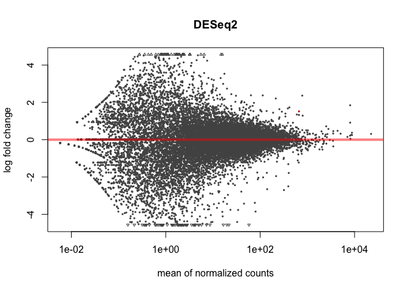
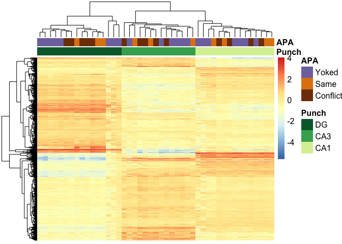
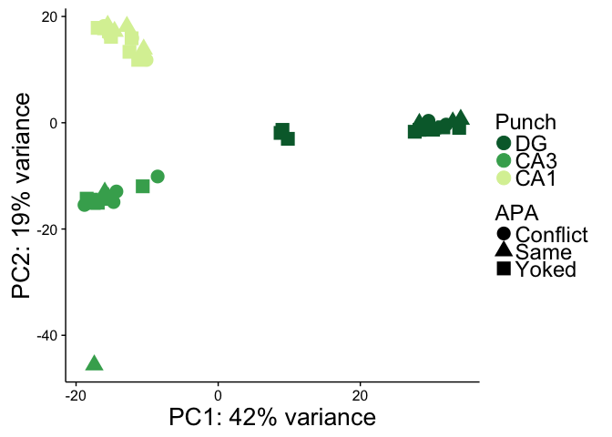
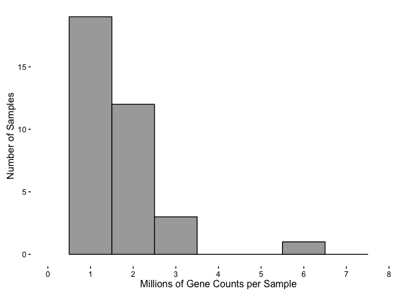

RNAseq gene expression analysis with DESeq2
-------------------------------------------

``` r
library(dplyr)
```

    ## 
    ## Attaching package: 'dplyr'

    ## The following objects are masked from 'package:stats':
    ## 
    ##     filter, lag

    ## The following objects are masked from 'package:base':
    ## 
    ##     intersect, setdiff, setequal, union

``` r
library(reshape2)

## set output file for figures 
knitr::opts_chunk$set(fig.path = '../figures/Fig3/')
```

``` r
#run kallisto.Rmd to create your own interemediate files or read these files
count <- read.csv("../data/02_count.csv", row.names=1, check.names=FALSE )
geneids <- read.csv("../data/02_geneids.csv")
```

``` r
# merge count and gene id dataframes
countbygene <- full_join(geneids, count)
```

    ## Joining, by = "id"

``` r
str(countbygene)
```

    ## 'data.frame':    58716 obs. of  79 variables:
    ##  $ id               : Factor w/ 58716 levels "ENSMUST00000000001.4|ENSMUSG00000000001.4|OTTMUSG00000007197.1|OTTMUST00000016610.1|Gnai3-001|Gnai3|3262|UTR5:1-141|CDS:142-120"| __truncated__,..: 14181 57109 4200 53023 4201 53137 52527 28406 52315 52373 ...
    ##  $ ENSMUST          : Factor w/ 58716 levels "ENSMUST00000000001.4",..: 14181 57109 4200 53023 4201 53137 52527 28406 52315 52373 ...
    ##  $ ENSMUSG          : Factor w/ 22532 levels "ENSMUSG00000000001.4",..: 14866 5208 5208 22400 5209 5209 5209 5209 5209 5209 ...
    ##  $ OTTMUSG          : Factor w/ 18872 levels "-","OTTMUSG00000000001.6",..: 9288 15665 15665 1 15668 15668 15668 15668 15668 15668 ...
    ##  $ OTTMUST          : Factor w/ 50541 levels "-","OTTMUST00000000091.1",..: 21804 47981 41691 1 41701 41705 41703 41702 41709 41708 ...
    ##  $ transcript       : Factor w/ 58696 levels "0610007P14Rik-001",..: 56584 43145 43144 43146 47702 47706 47705 47703 47708 47707 ...
    ##  $ gene             : Factor w/ 22485 levels "0610007P14Rik",..: 21745 16813 16813 16813 18427 18427 18427 18427 18427 18427 ...
    ##  $ length           : int  3634 4170 6869 858 3127 1977 3242 1512 406 840 ...
    ##  $ structure1       : Factor w/ 3743 levels "CDS:1-10","CDS:1-100",..: 2690 3263 2592 2258 2469 3369 2797 2919 3584 3021 ...
    ##  $ structure2       : Factor w/ 50500 levels "CDS:10-1068",..: 8204 35803 4828 NA 1567 38165 12658 19789 42483 26341 ...
    ##  $ structure3       : Factor w/ 39529 levels "UTR3:1000-1040",..: 16083 NA 32759 NA 18266 8564 22035 8538 NA NA ...
    ##  $ transcript_lenght: Factor w/ 58716 levels "0610007P14Rik-001_1169",..: 56602 43155 43154 43156 47712 47716 47715 47713 47718 47717 ...
    ##  $ 100_CA1_1_S21    : num  80 0 0 0 0 0 0 0 0 1 ...
    ##  $ 100_CA1_2_S22    : num  266 0 0 0 0 0 0 13 0 0 ...
    ##  $ 100_CA1_3_S23    : num  87 0 0 0 0 0 0 0 0 0 ...
    ##  $ 100_CA3_1_S24    : num  86 0 0 0 0 0 0 5 0 0 ...
    ##  $ 100_CA3_4_S25    : num  35 0 0 0 0 ...
    ##  $ 100_DG_2_S26     : num  45 0 0 0 0 0 0 2 0 1 ...
    ##  $ 100_DG_3_S27     : num  68 0 0 0 0 3 0 0 0 0 ...
    ##  $ 101_CA1_1_S28    : num  42 0 0 0 35 ...
    ##  $ 101_CA1_2_S29    : num  1 0 0 0 0 0 0 1 0 0 ...
    ##  $ 101_CA1_3_S30    : num  2 0 0 0 0 0 0 0 0 0 ...
    ##  $ 101_CA3_1_S31    : num  62 0 0 0 0 3 0 0 0 0 ...
    ##  $ 101_CA3_4_S32    : num  30 0 0 0 5 ...
    ##  $ 101_DG_3_S33     : num  2 0 0 0 0 0 0 0 0 0 ...
    ##  $ 101_DG_4_S34     : num  3 0 0 0 0 0 0 0 0 0 ...
    ##  $ 143A_CA3_1_S35   : num  98 0 0 0 0 0 0 0 0 1 ...
    ##  $ 143A_DG_1_S36    : num  81 0 0 0 0 0 0 7 0 0 ...
    ##  $ 143B_CA1_1_S37   : num  29 0 0 0 0 0 0 0 0 0 ...
    ##  $ 143B_DG_1_S38    : num  35 0 0 0 0 0 0 0 0 0 ...
    ##  $ 143C_CA1_1_S39   : num  99 0 0 0 0 0 0 7 0 0 ...
    ##  $ 143D_CA1_3_S40   : num  39 0 0 0 0 0 0 0 0 0 ...
    ##  $ 143D_DG_3_S41    : num  12 0 0 0 0 0 0 0 0 0 ...
    ##  $ 144A_CA1_2_S42   : num  73 0 0 0 0 9 0 0 0 11 ...
    ##  $ 144A_CA3_2_S43   : num  1 0 0 0 0 0 0 0 0 0 ...
    ##  $ 144A_DG_2_S44    : num  88 0 0 0 0 15 0 0 0 6 ...
    ##  $ 144B_CA1_1_S45   : num  47 0 0 0 0 0 0 0 0 0 ...
    ##  $ 144B_CA3_1_S46   : num  23 0 0 0 0 0 0 1 0 0 ...
    ##  $ 144C_CA1_2_S47   : num  173 0 0 0 0 1 0 0 0 5 ...
    ##  $ 144C_CA3_2_S48   : num  17 0 0 0 2 0 0 0 0 0 ...
    ##  $ 144C_DG_2_S49    : num  60 0 0 0 0 0 0 0 0 0 ...
    ##  $ 144D_CA3_2_S50   : num  60 0 0 0 0 4 0 0 2 11 ...
    ##  $ 144D_DG_2_S51    : num  115 0 3 0 5.12 ...
    ##  $ 145A_CA1_2_S52   : num  133 0 0 0 44 0 0 0 0 0 ...
    ##  $ 145A_CA3_2_S53   : num  3 0 0 0 0 0 0 2 0 0 ...
    ##  $ 145A_DG_2_S54    : num  46 0 0 0 0 0 0 0 0 0 ...
    ##  $ 145B_CA1_1_S55   : num  60 0 0 0 0 0 0 0 0 0 ...
    ##  $ 145B_CA3_1_S56   : num  0 0 0 0 0 0 0 0 0 0 ...
    ##  $ 145B_DG_1_S57    : num  27 0 0 0 0 0 0 0 0 2 ...
    ##  $ 146A_CA1_2_S58   : num  20 0 0 0 0 0 0 6 0 2 ...
    ##  $ 146A_CA3_2_S59   : num  8 0 0 0 0 26 0 0 0 7 ...
    ##  $ 146A_DG_2_S60    : num  10 0 0 0 0 0 0 0 0 1 ...
    ##  $ 146B_CA1_2_S61   : num  48 0 0 0 0 9 0 0 0 0 ...
    ##  $ 146B_CA3_2_S62   : num  48 0 0 0 0 0 0 0 0 8 ...
    ##  $ 146B_DG_2_S63    : num  1 0 0 0 0 0 0 0 0 0 ...
    ##  $ 146C_CA1_4_S64   : num  93 0 0 0 0 ...
    ##  $ 146C_CA3_4_S65   : num  1 0 0 0 0 0 0 3 0 0 ...
    ##  $ 146C_DG_4_S66    : num  2 2 0 0 0 0 0 0 0 0 ...
    ##  $ 146D_CA1_3_S67   : num  15 0 0 0 0 0 0 0 0 0 ...
    ##  $ 146D_CA3_3_S68   : num  53 0 0 0 0 1 0 0 0 9 ...
    ##  $ 146D_DG_3_S69    : num  0 0 0 0 0 0 0 0 0 0 ...
    ##  $ 147_CA1_4_S76    : num  1 0 0 0 0 0 0 0 0 0 ...
    ##  $ 147_CA3_4_S77    : num  11 0 0 0 0 0 0 0 0 0 ...
    ##  $ 147_DG_4_S78     : num  0 0 0 0 0 0 0 0 0 0 ...
    ##  $ 147C_CA1_3_S70   : num  106 0 0 0 5.09 ...
    ##  $ 147C_CA3_3_S71   : num  237 0 0 0 10.9 ...
    ##  $ 147C_DG_3_S72    : num  104 0 0 0 0 ...
    ##  $ 147D_CA1_1_S73   : num  0 0 0 0 0 0 0 0 0 0 ...
    ##  $ 147D_CA3_1_S74   : num  160 0 0 0 0 0 0 0 0 0 ...
    ##  $ 147D_DG_1_S75    : num  227 0 0 0 1.8 ...
    ##  $ 148_CA1_2_S85    : num  54 0 0 0 0 0 0 0 0 0 ...
    ##  $ 148_CA3_2_S86    : num  49 0 0 0 0 ...
    ##  $ 148_DG_2_S87     : num  34 0 0 0 0 0 0 0 0 0 ...
    ##  $ 148A_CA1_3_S79   : num  253 0 0 0 0 0 0 0 0 4 ...
    ##  $ 148A_CA3_3_S80   : num  39 7 0 0 0 1 0 0 0 0 ...
    ##  $ 148A_DG_3_S81    : num  108 0 0 0 0 0 0 9 0 0 ...
    ##  $ 148B_CA1_4_S82   : num  5 0 0 0 3 0 0 0 0 0 ...
    ##  $ 148B_CA3_4_S83   : num  73 0 0 0 1 0 0 0 0 0 ...
    ##  $ 148B_DG_4_S84    : num  17 0 0 0 1 0 0 0 0 0 ...

``` r
head(countbygene)
```

    ##                                                                                                                                                    id
    ## 1      ENSMUST00000070533.4|ENSMUSG00000051951.5|OTTMUSG00000026353.2|OTTMUST00000065166.1|Xkr4-001|Xkr4|3634|UTR5:1-150|CDS:151-2094|UTR3:2095-3634|
    ## 2                        ENSMUST00000208660.1|ENSMUSG00000025900.11|OTTMUSG00000049985.3|OTTMUST00000145515.1|Rp1-003|Rp1|4170|UTR5:1-54|CDS:55-4170|
    ## 3       ENSMUST00000027032.5|ENSMUSG00000025900.11|OTTMUSG00000049985.3|OTTMUST00000127195.2|Rp1-001|Rp1|6869|UTR5:1-127|CDS:128-6415|UTR3:6416-6869|
    ## 4                                                                            ENSMUST00000194992.6|ENSMUSG00000109048.1|-|-|Rp1-201|Rp1|858|CDS:1-858|
    ## 5 ENSMUST00000027035.9|ENSMUSG00000025902.13|OTTMUSG00000050014.7|OTTMUST00000127245.2|Sox17-001|Sox17|3127|UTR5:1-1082|CDS:1083-2342|UTR3:2343-3127|
    ## 6   ENSMUST00000195555.1|ENSMUSG00000025902.13|OTTMUSG00000050014.7|OTTMUST00000127249.1|Sox17-005|Sox17|1977|UTR5:1-635|CDS:636-1511|UTR3:1512-1977|
    ##                ENSMUST               ENSMUSG              OTTMUSG
    ## 1 ENSMUST00000070533.4  ENSMUSG00000051951.5 OTTMUSG00000026353.2
    ## 2 ENSMUST00000208660.1 ENSMUSG00000025900.11 OTTMUSG00000049985.3
    ## 3 ENSMUST00000027032.5 ENSMUSG00000025900.11 OTTMUSG00000049985.3
    ## 4 ENSMUST00000194992.6  ENSMUSG00000109048.1                    -
    ## 5 ENSMUST00000027035.9 ENSMUSG00000025902.13 OTTMUSG00000050014.7
    ## 6 ENSMUST00000195555.1 ENSMUSG00000025902.13 OTTMUSG00000050014.7
    ##                OTTMUST transcript  gene length  structure1    structure2
    ## 1 OTTMUST00000065166.1   Xkr4-001  Xkr4   3634  UTR5:1-150  CDS:151-2094
    ## 2 OTTMUST00000145515.1    Rp1-003   Rp1   4170   UTR5:1-54   CDS:55-4170
    ## 3 OTTMUST00000127195.2    Rp1-001   Rp1   6869  UTR5:1-127  CDS:128-6415
    ## 4                    -    Rp1-201   Rp1    858   CDS:1-858          <NA>
    ## 5 OTTMUST00000127245.2  Sox17-001 Sox17   3127 UTR5:1-1082 CDS:1083-2342
    ## 6 OTTMUST00000127249.1  Sox17-005 Sox17   1977  UTR5:1-635  CDS:636-1511
    ##       structure3 transcript_lenght 100_CA1_1_S21 100_CA1_2_S22
    ## 1 UTR3:2095-3634     Xkr4-001_3634            80           266
    ## 2           <NA>      Rp1-003_4170             0             0
    ## 3 UTR3:6416-6869      Rp1-001_6869             0             0
    ## 4           <NA>       Rp1-201_858             0             0
    ## 5 UTR3:2343-3127    Sox17-001_3127             0             0
    ## 6 UTR3:1512-1977    Sox17-005_1977             0             0
    ##   100_CA1_3_S23 100_CA3_1_S24 100_CA3_4_S25 100_DG_2_S26 100_DG_3_S27
    ## 1            87            86      35.00000           45           68
    ## 2             0             0       0.00000            0            0
    ## 3             0             0       0.00000            0            0
    ## 4             0             0       0.00000            0            0
    ## 5             0             0       0.00000            0            0
    ## 6             0             0       3.98714            0            3
    ##   101_CA1_1_S28 101_CA1_2_S29 101_CA1_3_S30 101_CA3_1_S31 101_CA3_4_S32
    ## 1   4.20000e+01             1             2            62   3.00000e+01
    ## 2   0.00000e+00             0             0             0   0.00000e+00
    ## 3   0.00000e+00             0             0             0   0.00000e+00
    ## 4   0.00000e+00             0             0             0   0.00000e+00
    ## 5   3.50000e+01             0             0             0   5.00000e+00
    ## 6   7.46976e-07             0             0             3   4.80866e-08
    ##   101_DG_3_S33 101_DG_4_S34 143A_CA3_1_S35 143A_DG_1_S36 143B_CA1_1_S37
    ## 1            2            3             98            81             29
    ## 2            0            0              0             0              0
    ## 3            0            0              0             0              0
    ## 4            0            0              0             0              0
    ## 5            0            0              0             0              0
    ## 6            0            0              0             0              0
    ##   143B_DG_1_S38 143C_CA1_1_S39 143D_CA1_3_S40 143D_DG_3_S41 144A_CA1_2_S42
    ## 1            35             99             39            12             73
    ## 2             0              0              0             0              0
    ## 3             0              0              0             0              0
    ## 4             0              0              0             0              0
    ## 5             0              0              0             0              0
    ## 6             0              0              0             0              9
    ##   144A_CA3_2_S43 144A_DG_2_S44 144B_CA1_1_S45 144B_CA3_1_S46
    ## 1              1            88             47             23
    ## 2              0             0              0              0
    ## 3              0             0              0              0
    ## 4              0             0              0              0
    ## 5              0             0              0              0
    ## 6              0            15              0              0
    ##   144C_CA1_2_S47 144C_CA3_2_S48 144C_DG_2_S49 144D_CA3_2_S50 144D_DG_2_S51
    ## 1            173             17            60             60      115.0000
    ## 2              0              0             0              0        0.0000
    ## 3              0              0             0              0        3.0000
    ## 4              0              0             0              0        0.0000
    ## 5              0              2             0              0        5.1248
    ## 6              1              0             0              4        0.0000
    ##   145A_CA1_2_S52 145A_CA3_2_S53 145A_DG_2_S54 145B_CA1_1_S55
    ## 1            133              3            46             60
    ## 2              0              0             0              0
    ## 3              0              0             0              0
    ## 4              0              0             0              0
    ## 5             44              0             0              0
    ## 6              0              0             0              0
    ##   145B_CA3_1_S56 145B_DG_1_S57 146A_CA1_2_S58 146A_CA3_2_S59 146A_DG_2_S60
    ## 1              0            27             20              8            10
    ## 2              0             0              0              0             0
    ## 3              0             0              0              0             0
    ## 4              0             0              0              0             0
    ## 5              0             0              0              0             0
    ## 6              0             0              0             26             0
    ##   146B_CA1_2_S61 146B_CA3_2_S62 146B_DG_2_S63 146C_CA1_4_S64
    ## 1             48             48             1       93.00000
    ## 2              0              0             0        0.00000
    ## 3              0              0             0        0.00000
    ## 4              0              0             0        0.00000
    ## 5              0              0             0        0.00000
    ## 6              9              0             0        4.37439
    ##   146C_CA3_4_S65 146C_DG_4_S66 146D_CA1_3_S67 146D_CA3_3_S68 146D_DG_3_S69
    ## 1              1             2             15             53             0
    ## 2              0             2              0              0             0
    ## 3              0             0              0              0             0
    ## 4              0             0              0              0             0
    ## 5              0             0              0              0             0
    ## 6              0             0              0              1             0
    ##   147_CA1_4_S76 147_CA3_4_S77 147_DG_4_S78 147C_CA1_3_S70 147C_CA3_3_S71
    ## 1             1            11            0      106.00000       237.0000
    ## 2             0             0            0        0.00000         0.0000
    ## 3             0             0            0        0.00000         0.0000
    ## 4             0             0            0        0.00000         0.0000
    ## 5             0             0            0        5.09227        10.8636
    ## 6             0             0            0        1.90773         0.0000
    ##   147C_DG_3_S72 147D_CA1_1_S73 147D_CA3_1_S74 147D_DG_1_S75 148_CA1_2_S85
    ## 1     104.00000              0            160     227.00000            54
    ## 2       0.00000              0              0       0.00000             0
    ## 3       0.00000              0              0       0.00000             0
    ## 4       0.00000              0              0       0.00000             0
    ## 5       0.00000              0              0       1.80308             0
    ## 6       7.10077              0              0       0.00000             0
    ##   148_CA3_2_S86 148_DG_2_S87 148A_CA1_3_S79 148A_CA3_3_S80 148A_DG_3_S81
    ## 1            49           34            253             39           108
    ## 2             0            0              0              7             0
    ## 3             0            0              0              0             0
    ## 4             0            0              0              0             0
    ## 5             0            0              0              0             0
    ## 6             0            0              0              1             0
    ##   148B_CA1_4_S82 148B_CA3_4_S83 148B_DG_4_S84
    ## 1              5             73            17
    ## 2              0              0             0
    ## 3              0              0             0
    ## 4              0              0             0
    ## 5              3              1             1
    ## 6              0              0             0

``` r
## remove unnecesary columns (aka, keep gene name and counts for samples)
countbygene <- countbygene[-c(1:6,8:12)]  

## lenghten 
countbygene <- melt(countbygene, id=c("gene"))
head(countbygene)
```

    ##    gene      variable value
    ## 1  Xkr4 100_CA1_1_S21    80
    ## 2   Rp1 100_CA1_1_S21     0
    ## 3   Rp1 100_CA1_1_S21     0
    ## 4   Rp1 100_CA1_1_S21     0
    ## 5 Sox17 100_CA1_1_S21     0
    ## 6 Sox17 100_CA1_1_S21     0

``` r
## string split to remove last for characters aka "_S##"
countbygene$variable <- gsub('.{4}$', '', countbygene$variable)
head(countbygene)
```

    ##    gene  variable value
    ## 1  Xkr4 100_CA1_1    80
    ## 2   Rp1 100_CA1_1     0
    ## 3   Rp1 100_CA1_1     0
    ## 4   Rp1 100_CA1_1     0
    ## 5 Sox17 100_CA1_1     0
    ## 6 Sox17 100_CA1_1     0

``` r
#replace _ with - in name
countbygene$variable <- gsub("\\_", "-", countbygene$variable)
head(countbygene)
```

    ##    gene  variable value
    ## 1  Xkr4 100-CA1-1    80
    ## 2   Rp1 100-CA1-1     0
    ## 3   Rp1 100-CA1-1     0
    ## 4   Rp1 100-CA1-1     0
    ## 5 Sox17 100-CA1-1     0
    ## 6 Sox17 100-CA1-1     0

``` r
#then widen by sum
countbygene  <- dcast(countbygene, gene ~ variable, value.var= "value", fun.aggregate=mean)

## make gene the row name 
row.names(countbygene) <- countbygene$gene
countbygene[1] <- NULL

## round all value to nearest 1s place
countbygene <- round(countbygene)
summary(countbygene)
```

    ##    100-CA1-1          100-CA1-2         100-CA1-3       
    ##  Min.   :    0.00   Min.   :    0.0   Min.   :    0.00  
    ##  1st Qu.:    0.00   1st Qu.:    0.0   1st Qu.:    0.00  
    ##  Median :    4.00   Median :   12.0   Median :    4.00  
    ##  Mean   :   50.55   Mean   :  147.3   Mean   :   49.58  
    ##  3rd Qu.:   29.00   3rd Qu.:   91.0   3rd Qu.:   30.00  
    ##  Max.   :31720.00   Max.   :95996.0   Max.   :24445.00  
    ##    100-CA3-1          100-CA3-4           100-DG-2       
    ##  Min.   :    0.00   Min.   :    0.00   Min.   :    0.00  
    ##  1st Qu.:    0.00   1st Qu.:    0.00   1st Qu.:    0.00  
    ##  Median :    4.00   Median :    5.00   Median :    3.00  
    ##  Mean   :   42.98   Mean   :   53.61   Mean   :   29.28  
    ##  3rd Qu.:   29.00   3rd Qu.:   33.00   3rd Qu.:   19.00  
    ##  Max.   :24878.00   Max.   :42838.00   Max.   :22711.00  
    ##     100-DG-3          101-CA1-1          101-CA1-2       
    ##  Min.   :     0.0   Min.   :     0.0   Min.   :   0.000  
    ##  1st Qu.:     0.0   1st Qu.:     0.0   1st Qu.:   0.000  
    ##  Median :    14.0   Median :     9.0   Median :   0.000  
    ##  Mean   :   135.9   Mean   :   118.7   Mean   :   3.204  
    ##  3rd Qu.:    92.0   3rd Qu.:    58.0   3rd Qu.:   2.000  
    ##  Max.   :100671.0   Max.   :183815.0   Max.   :3478.000  
    ##    101-CA1-3          101-CA3-1          101-CA3-4       
    ##  Min.   :   0.000   Min.   :    0.00   Min.   :    0.00  
    ##  1st Qu.:   0.000   1st Qu.:    0.00   1st Qu.:    0.00  
    ##  Median :   0.000   Median :    5.00   Median :    2.00  
    ##  Mean   :   6.868   Mean   :   60.53   Mean   :   28.46  
    ##  3rd Qu.:   4.000   3rd Qu.:   34.00   3rd Qu.:   15.00  
    ##  Max.   :6174.000   Max.   :86004.00   Max.   :37665.00  
    ##     101-DG-3           101-DG-4         143A-CA3-1         143A-DG-1      
    ##  Min.   :   0.000   Min.   :   0.00   Min.   :    0.00   Min.   :    0.0  
    ##  1st Qu.:   0.000   1st Qu.:   0.00   1st Qu.:    0.00   1st Qu.:    0.0  
    ##  Median :   0.000   Median :   0.00   Median :    5.00   Median :   10.0  
    ##  Mean   :   1.623   Mean   :  13.37   Mean   :   71.18   Mean   :  118.4  
    ##  3rd Qu.:   1.000   3rd Qu.:   8.00   3rd Qu.:   42.00   3rd Qu.:   75.0  
    ##  Max.   :2351.000   Max.   :9988.00   Max.   :23989.00   Max.   :76185.0  
    ##    143B-CA1-1        143B-DG-1          143C-CA1-1      
    ##  Min.   :    0.0   Min.   :    0.00   Min.   :    0.00  
    ##  1st Qu.:    0.0   1st Qu.:    0.00   1st Qu.:    0.00  
    ##  Median :    3.0   Median :    4.00   Median :    4.00  
    ##  Mean   :   38.9   Mean   :   45.32   Mean   :   48.31  
    ##  3rd Qu.:   23.0   3rd Qu.:   32.00   3rd Qu.:   30.00  
    ##  Max.   :30026.0   Max.   :21691.00   Max.   :21143.00  
    ##    143D-CA1-3         143D-DG-3          144A-CA1-2      
    ##  Min.   :    0.00   Min.   :    0.00   Min.   :    0.00  
    ##  1st Qu.:    0.00   1st Qu.:    0.00   1st Qu.:    0.00  
    ##  Median :    1.00   Median :    2.00   Median :    6.00  
    ##  Mean   :   24.05   Mean   :   22.28   Mean   :   66.91  
    ##  3rd Qu.:   15.00   3rd Qu.:   16.00   3rd Qu.:   43.00  
    ##  Max.   :12512.00   Max.   :10111.00   Max.   :44270.00  
    ##    144A-CA3-2         144A-DG-2          144B-CA1-1      
    ##  Min.   :    0.00   Min.   :    0.00   Min.   :    0.00  
    ##  1st Qu.:    0.00   1st Qu.:    0.00   1st Qu.:    0.00  
    ##  Median :    1.00   Median :    6.00   Median :    4.00  
    ##  Mean   :   10.14   Mean   :   70.08   Mean   :   56.71  
    ##  3rd Qu.:    5.00   3rd Qu.:   45.00   3rd Qu.:   35.00  
    ##  Max.   :12302.00   Max.   :33414.00   Max.   :35177.00  
    ##    144B-CA3-1         144C-CA1-2         144C-CA3-2     
    ##  Min.   :    0.00   Min.   :    0.00   Min.   :    0.0  
    ##  1st Qu.:    0.00   1st Qu.:    0.00   1st Qu.:    0.0  
    ##  Median :    1.00   Median :    6.00   Median :    2.0  
    ##  Mean   :   22.54   Mean   :   71.77   Mean   :   28.8  
    ##  3rd Qu.:   13.00   3rd Qu.:   46.00   3rd Qu.:   16.0  
    ##  Max.   :12714.00   Max.   :35028.00   Max.   :26898.0  
    ##    144C-DG-2          144D-CA3-2         144D-DG-2         145A-CA1-2     
    ##  Min.   :    0.00   Min.   :    0.00   Min.   :    0.0   Min.   :    0.0  
    ##  1st Qu.:    0.00   1st Qu.:    0.00   1st Qu.:    0.0   1st Qu.:    0.0  
    ##  Median :    4.00   Median :    4.00   Median :    9.0   Median :    8.0  
    ##  Mean   :   48.18   Mean   :   53.78   Mean   :  100.3   Mean   :  105.6  
    ##  3rd Qu.:   32.00   3rd Qu.:   29.00   3rd Qu.:   67.0   3rd Qu.:   62.0  
    ##  Max.   :15607.00   Max.   :46442.00   Max.   :39287.0   Max.   :73533.0  
    ##    145A-CA3-2         145A-DG-2          145B-CA1-1      
    ##  Min.   :   0.000   Min.   :    0.00   Min.   :    0.00  
    ##  1st Qu.:   0.000   1st Qu.:    0.00   1st Qu.:    0.00  
    ##  Median :   0.000   Median :    2.00   Median :    3.00  
    ##  Mean   :   8.004   Mean   :   30.73   Mean   :   45.99  
    ##  3rd Qu.:   4.000   3rd Qu.:   21.00   3rd Qu.:   26.00  
    ##  Max.   :7739.000   Max.   :11567.00   Max.   :39155.00  
    ##    145B-CA3-1         145B-DG-1          146A-CA1-2      
    ##  Min.   :0.000000   Min.   :    0.00   Min.   :    0.00  
    ##  1st Qu.:0.000000   1st Qu.:    0.00   1st Qu.:    0.00  
    ##  Median :0.000000   Median :    3.00   Median :    3.00  
    ##  Mean   :0.003514   Mean   :   32.06   Mean   :   39.06  
    ##  3rd Qu.:0.000000   3rd Qu.:   22.00   3rd Qu.:   24.00  
    ##  Max.   :3.000000   Max.   :15903.00   Max.   :28994.00  
    ##    146A-CA3-2         146A-DG-2          146B-CA1-2       146B-CA3-2      
    ##  Min.   :    0.00   Min.   :    0.00   Min.   :   0.0   Min.   :    0.00  
    ##  1st Qu.:    0.00   1st Qu.:    0.00   1st Qu.:   0.0   1st Qu.:    0.00  
    ##  Median :    5.00   Median :    2.00   Median :   2.0   Median :    4.00  
    ##  Mean   :   67.24   Mean   :   26.33   Mean   :  22.5   Mean   :   46.97  
    ##  3rd Qu.:   36.00   3rd Qu.:   18.00   3rd Qu.:  14.0   3rd Qu.:   29.00  
    ##  Max.   :89329.00   Max.   :13368.00   Max.   :7314.0   Max.   :23297.00  
    ##    146B-DG-2         146C-CA1-4         146C-CA3-4         146C-DG-4      
    ##  Min.   :   0.00   Min.   :    0.00   Min.   :   0.000   Min.   :   0.00  
    ##  1st Qu.:   0.00   1st Qu.:    0.00   1st Qu.:   0.000   1st Qu.:   0.00  
    ##  Median :   0.00   Median :    2.00   Median :   0.000   Median :   0.00  
    ##  Mean   :   2.47   Mean   :   29.48   Mean   :   5.964   Mean   :  10.56  
    ##  3rd Qu.:   1.00   3rd Qu.:   18.00   3rd Qu.:   3.000   3rd Qu.:   7.00  
    ##  Max.   :3901.00   Max.   :15918.00   Max.   :5751.000   Max.   :2745.00  
    ##    146D-CA1-3         146D-CA3-3         146D-DG-3       
    ##  Min.   :   0.000   Min.   :    0.00   Min.   :   0.000  
    ##  1st Qu.:   0.000   1st Qu.:    0.00   1st Qu.:   0.000  
    ##  Median :   0.000   Median :    5.00   Median :   0.000  
    ##  Mean   :   8.644   Mean   :   65.28   Mean   :   1.934  
    ##  3rd Qu.:   4.000   3rd Qu.:   40.00   3rd Qu.:   0.000  
    ##  Max.   :9683.000   Max.   :38276.00   Max.   :3002.000  
    ##    147-CA1-4         147-CA3-4           147-DG-4          147C-CA1-3   
    ##  Min.   :   0.00   Min.   :    0.00   Min.   :   0.000   Min.   :    0  
    ##  1st Qu.:   0.00   1st Qu.:    0.00   1st Qu.:   0.000   1st Qu.:    0  
    ##  Median :   0.00   Median :    0.00   Median :   0.000   Median :    6  
    ##  Mean   :   3.59   Mean   :   15.32   Mean   :   3.098   Mean   :   67  
    ##  3rd Qu.:   1.00   3rd Qu.:    7.00   3rd Qu.:   0.000   3rd Qu.:   43  
    ##  Max.   :5374.00   Max.   :14487.00   Max.   :3772.000   Max.   :37687  
    ##    147C-CA3-3         147C-DG-3          147D-CA1-1        147D-CA3-1     
    ##  Min.   :     0.0   Min.   :    0.00   Min.   :0.00000   Min.   :    0.0  
    ##  1st Qu.:     0.0   1st Qu.:    0.00   1st Qu.:0.00000   1st Qu.:    0.0  
    ##  Median :    13.0   Median :   10.00   Median :0.00000   Median :    8.0  
    ##  Mean   :   134.3   Mean   :   94.22   Mean   :0.00378   Mean   :  105.7  
    ##  3rd Qu.:    79.0   3rd Qu.:   66.00   3rd Qu.:0.00000   3rd Qu.:   59.0  
    ##  Max.   :150301.0   Max.   :46988.00   Max.   :6.00000   Max.   :95754.0  
    ##    147D-DG-1         148-CA1-2          148-CA3-2       
    ##  Min.   :    0.0   Min.   :    0.00   Min.   :    0.00  
    ##  1st Qu.:    0.0   1st Qu.:    0.00   1st Qu.:    0.00  
    ##  Median :   24.0   Median :    2.00   Median :    4.00  
    ##  Mean   :  249.9   Mean   :   41.76   Mean   :   51.06  
    ##  3rd Qu.:  176.0   3rd Qu.:   24.00   3rd Qu.:   31.00  
    ##  Max.   :91299.0   Max.   :24841.00   Max.   :23437.00  
    ##     148-DG-2          148A-CA1-3        148A-CA3-3      
    ##  Min.   :    0.00   Min.   :    0.0   Min.   :    0.00  
    ##  1st Qu.:    0.00   1st Qu.:    0.0   1st Qu.:    0.00  
    ##  Median :    3.00   Median :    9.0   Median :    4.00  
    ##  Mean   :   47.46   Mean   :  115.2   Mean   :   60.18  
    ##  3rd Qu.:   33.00   3rd Qu.:   72.0   3rd Qu.:   34.00  
    ##  Max.   :15414.00   Max.   :52783.0   Max.   :32891.00  
    ##    148A-DG-3          148B-CA1-4         148B-CA3-4      
    ##  Min.   :    0.00   Min.   :    0.00   Min.   :    0.00  
    ##  1st Qu.:    0.00   1st Qu.:    0.00   1st Qu.:    0.00  
    ##  Median :    9.00   Median :    0.00   Median :    6.00  
    ##  Mean   :   85.29   Mean   :    8.26   Mean   :   76.68  
    ##  3rd Qu.:   60.00   3rd Qu.:    3.00   3rd Qu.:   45.00  
    ##  Max.   :31971.00   Max.   :33665.00   Max.   :37680.00  
    ##    148B-DG-4       
    ##  Min.   :    0.00  
    ##  1st Qu.:    0.00  
    ##  Median :    2.00  
    ##  Mean   :   17.71  
    ##  3rd Qu.:   12.00  
    ##  Max.   :10089.00

``` r
library(ggdendro) ## for dendrograms!!
library(magrittr) ## to use the weird pipe
library(gplots) ##for making awesome plots
```

    ## 
    ## Attaching package: 'gplots'

    ## The following object is masked from 'package:stats':
    ## 
    ##     lowess

``` r
library(cowplot) ## for some easy to use themes
```

    ## Loading required package: ggplot2

    ## 
    ## Attaching package: 'cowplot'

    ## The following object is masked from 'package:ggplot2':
    ## 
    ##     ggsave

``` r
library(tidyr)
```

    ## 
    ## Attaching package: 'tidyr'

    ## The following object is masked from 'package:magrittr':
    ## 
    ##     extract

    ## The following object is masked from 'package:reshape2':
    ## 
    ##     smiths

``` r
library(dplyr) ## for filtering and selecting rows
library(reshape2) #@ for melting dataframe
library(plyr) ## for renmaing factors
```

    ## -------------------------------------------------------------------------

    ## You have loaded plyr after dplyr - this is likely to cause problems.
    ## If you need functions from both plyr and dplyr, please load plyr first, then dplyr:
    ## library(plyr); library(dplyr)

    ## -------------------------------------------------------------------------

    ## 
    ## Attaching package: 'plyr'

    ## The following objects are masked from 'package:dplyr':
    ## 
    ##     arrange, count, desc, failwith, id, mutate, rename, summarise,
    ##     summarize

``` r
library(ggplot2) ## for awesome plots!

## start after 02c_tpmbygene

Traits <- read.csv("../data/02_JA16444samples.csv", sep=",", header = TRUE, stringsAsFactors=FALSE, na.string = "NA")
rownames(Traits) <- Traits$RNAseqID    # set $genoAPAsessionInd as rownames
names(Traits)
```

    ##  [1] "RNAseqID"  "Tube"      "Mouse"     "Genotype"  "Conflict" 
    ##  [6] "APA"       "Group"     "Behavior"  "E.phy"     "Punch"    
    ## [11] "Slice"     "Date"      "jobnumber"

``` r
#keeping informative volumns
Traits <- Traits[c(1,3,5:6,10:11)] 
tail(Traits)
```

    ##              RNAseqID   Mouse Conflict     APA Punch Slice
    ## 148A-DG-3   148A-DG-3 15-148A Conflict Trained    DG     3
    ## 148A-CA1-3 148A-CA1-3 15-148A Conflict Trained   CA1     3
    ## 148A-CA3-3 148A-CA3-3 15-148A Conflict Trained   CA3     3
    ## 148B-CA3-4 148B-CA3-4 15-148B Conflict   Yoked   CA3     4
    ## 148B-CA1-4 148B-CA1-4 15-148B Conflict   Yoked   CA1     4
    ## 148B-DG-4   148B-DG-4 15-148B Conflict   Yoked    DG     4

``` r
str(Traits)
```

    ## 'data.frame':    67 obs. of  6 variables:
    ##  $ RNAseqID: chr  "100-CA1-1" "100-CA3-1" "100-CA1-2" "100-DG-2" ...
    ##  $ Mouse   : chr  "15-100" "15-100" "15-100" "15-100" ...
    ##  $ Conflict: chr  NA NA NA NA ...
    ##  $ APA     : chr  NA NA NA NA ...
    ##  $ Punch   : chr  "CA1" "CA3" "CA1" "DG" ...
    ##  $ Slice   : int  1 1 2 2 3 3 4 1 1 2 ...

``` r
## remove 100 and 100 animals because they aren't APA trained
## remove 147 and 148 because they are home cage animals
## remove mice 147D_CA1_1 and 145B_CA3_1 because these were bad samples with no reads

Traits <- Traits %>% dplyr::filter(!grepl("100|101|147-|148-|147D-CA1-1|145B-CA3-1|147-|148-", RNAseqID)) 

## adding combinatorial traits
Traits$APAconflict <- as.factor(paste(Traits$APA, Traits$Conflict, sep="_")) 
summary(Traits)
```

    ##    RNAseqID            Mouse             Conflict        
    ##  Length:45          Length:45          Length:45         
    ##  Class :character   Class :character   Class :character  
    ##  Mode  :character   Mode  :character   Mode  :character  
    ##                                                          
    ##                                                          
    ##                                                          
    ##      APA               Punch               Slice      
    ##  Length:45          Length:45          Min.   :1.000  
    ##  Class :character   Class :character   1st Qu.:2.000  
    ##  Mode  :character   Mode  :character   Median :2.000  
    ##                                        Mean   :2.267  
    ##                                        3rd Qu.:3.000  
    ##                                        Max.   :4.000  
    ##              APAconflict
    ##  Trained_Conflict  :14  
    ##  Trained_NoConflict:10  
    ##  Yoked_Conflict    :12  
    ##  Yoked_NoConflict  : 9  
    ##                         
    ## 

``` r
#make a column that thas id without the dash
Traits$ID <- gsub("[[:punct:]]", "", Traits$Mouse)


## make gene the row name then round all value to nearest 1s place
row.names(Traits) <- Traits$RNAseqID

## delete old APA column. rename APAconflict APA (for simplicity)
Traits$APA <- NULL
names(Traits)[names(Traits)=="APAconflict"] <- "APA"


## rename factors
Traits$APA <- revalue(Traits$APA, c("Trained_Conflict" = "Conflict")) 
Traits$APA <- revalue(Traits$APA, c("Trained_NoConflict" = "Same")) 
Traits$APA <- revalue(Traits$APA, c("Yoked_Conflict" = "Yoked")) 
Traits$APA <- revalue(Traits$APA, c("Yoked_NoConflict" = "Yoked")) 
```

``` r
## continue from 02d_JA16444byregion

library("DESeq2")
```

    ## Loading required package: S4Vectors

    ## Loading required package: stats4

    ## Loading required package: BiocGenerics

    ## Loading required package: parallel

    ## 
    ## Attaching package: 'BiocGenerics'

    ## The following objects are masked from 'package:parallel':
    ## 
    ##     clusterApply, clusterApplyLB, clusterCall, clusterEvalQ,
    ##     clusterExport, clusterMap, parApply, parCapply, parLapply,
    ##     parLapplyLB, parRapply, parSapply, parSapplyLB

    ## The following objects are masked from 'package:dplyr':
    ## 
    ##     combine, intersect, setdiff, union

    ## The following objects are masked from 'package:stats':
    ## 
    ##     IQR, mad, xtabs

    ## The following objects are masked from 'package:base':
    ## 
    ##     anyDuplicated, append, as.data.frame, cbind, colnames,
    ##     do.call, duplicated, eval, evalq, Filter, Find, get, grep,
    ##     grepl, intersect, is.unsorted, lapply, lengths, Map, mapply,
    ##     match, mget, order, paste, pmax, pmax.int, pmin, pmin.int,
    ##     Position, rank, rbind, Reduce, rownames, sapply, setdiff,
    ##     sort, table, tapply, union, unique, unsplit, which, which.max,
    ##     which.min

    ## 
    ## Attaching package: 'S4Vectors'

    ## The following object is masked from 'package:plyr':
    ## 
    ##     rename

    ## The following object is masked from 'package:tidyr':
    ## 
    ##     expand

    ## The following object is masked from 'package:gplots':
    ## 
    ##     space

    ## The following objects are masked from 'package:dplyr':
    ## 
    ##     first, rename

    ## The following objects are masked from 'package:base':
    ## 
    ##     colMeans, colSums, expand.grid, rowMeans, rowSums

    ## Loading required package: IRanges

    ## 
    ## Attaching package: 'IRanges'

    ## The following object is masked from 'package:plyr':
    ## 
    ##     desc

    ## The following objects are masked from 'package:dplyr':
    ## 
    ##     collapse, desc, regroup, slice

    ## Loading required package: GenomicRanges

    ## Loading required package: GenomeInfoDb

    ## Loading required package: SummarizedExperiment

    ## Loading required package: Biobase

    ## Welcome to Bioconductor
    ## 
    ##     Vignettes contain introductory material; view with
    ##     'browseVignettes()'. To cite Bioconductor, see
    ##     'citation("Biobase")', and for packages 'citation("pkgname")'.

``` r
library("ggplot2")
library("dplyr")
library("plyr")
library("magrittr")


# 1.3.3 Count matrix input ----
countData <- countbygene 
colData <- Traits %>%
  arrange(RNAseqID)
head(countData)
```

    ##               100-CA1-1 100-CA1-2 100-CA1-3 100-CA3-1 100-CA3-4 100-DG-2
    ## 0610007P14Rik        21        78        28        32        40       24
    ## 0610009B22Rik         7        43         6        12         6        8
    ## 0610009L18Rik         3        35         2        11         8        2
    ## 0610009O20Rik        44       225        66        87        88       58
    ## 0610010F05Rik        10        35        11         8        12        7
    ## 0610010K14Rik         2         7         2         1         3        1
    ##               100-DG-3 101-CA1-1 101-CA1-2 101-CA1-3 101-CA3-1 101-CA3-4
    ## 0610007P14Rik       95        58         0         0        38        16
    ## 0610009B22Rik       30        16         2         0        18         5
    ## 0610009L18Rik       40        12         0         0        10         2
    ## 0610009O20Rik      200       165         3         8       100        34
    ## 0610010F05Rik       28        13         1         1         6         6
    ## 0610010K14Rik        9         7         0         0         0         0
    ##               101-DG-3 101-DG-4 143A-CA3-1 143A-DG-1 143B-CA1-1 143B-DG-1
    ## 0610007P14Rik        2        3         42        56         30        24
    ## 0610009B22Rik        1        0         12        17         10         5
    ## 0610009L18Rik        2        8          4         9         10         8
    ## 0610009O20Rik        4       13         85       185         44        72
    ## 0610010F05Rik        0        1         18        19          7        15
    ## 0610010K14Rik        0        2          2         7          1         2
    ##               143C-CA1-1 143D-CA1-3 143D-DG-3 144A-CA1-2 144A-CA3-2
    ## 0610007P14Rik         19         14        22         40         10
    ## 0610009B22Rik         10          0         0         15          4
    ## 0610009L18Rik          2          0         2          9          5
    ## 0610009O20Rik         76         25        38         95         20
    ## 0610010F05Rik          7          5         8         15          2
    ## 0610010K14Rik          2          2         1          3          1
    ##               144A-DG-2 144B-CA1-1 144B-CA3-1 144C-CA1-2 144C-CA3-2
    ## 0610007P14Rik        40         36         17         32         14
    ## 0610009B22Rik         4          7          4          8         12
    ## 0610009L18Rik         0          1          4          2          4
    ## 0610009O20Rik        82         49         24         89         48
    ## 0610010F05Rik        17          9          3         12          7
    ## 0610010K14Rik         2          4          1          3          1
    ##               144C-DG-2 144D-CA3-2 144D-DG-2 145A-CA1-2 145A-CA3-2
    ## 0610007P14Rik        25         22        75         66          2
    ## 0610009B22Rik         8          6        12         18          3
    ## 0610009L18Rik         6          9        13         21          0
    ## 0610009O20Rik        85         46       151         96         12
    ## 0610010F05Rik        12         14        18         22          1
    ## 0610010K14Rik         2          2         6          3          0
    ##               145A-DG-2 145B-CA1-1 145B-CA3-1 145B-DG-1 146A-CA1-2
    ## 0610007P14Rik        20         26          0        10         14
    ## 0610009B22Rik         7          8          0         5          8
    ## 0610009L18Rik         1          3          0         0          8
    ## 0610009O20Rik        52        124          0        46         68
    ## 0610010F05Rik         6          4          0         5          9
    ## 0610010K14Rik         2          2          0         2          3
    ##               146A-CA3-2 146A-DG-2 146B-CA1-2 146B-CA3-2 146B-DG-2
    ## 0610007P14Rik         44        12          6         16         0
    ## 0610009B22Rik          4         3          3         22         0
    ## 0610009L18Rik          9         6          0          2         0
    ## 0610009O20Rik        102        44         16         46         2
    ## 0610010F05Rik         10         6          7         14         1
    ## 0610010K14Rik          1         2          1          1         1
    ##               146C-CA1-4 146C-CA3-4 146C-DG-4 146D-CA1-3 146D-CA3-3
    ## 0610007P14Rik         19          2        11          6         44
    ## 0610009B22Rik          4          4         3          2         12
    ## 0610009L18Rik          9          0         0          0          7
    ## 0610009O20Rik         31          3        10          1         83
    ## 0610010F05Rik          5          1         4          1         18
    ## 0610010K14Rik          1          0         0          1          1
    ##               146D-DG-3 147-CA1-4 147-CA3-4 147-DG-4 147C-CA1-3 147C-CA3-3
    ## 0610007P14Rik         3         1        46        0         34         82
    ## 0610009B22Rik         0         1        10        4          8         15
    ## 0610009L18Rik         0         0         0        0          2         11
    ## 0610009O20Rik         3         0        29        0         58        191
    ## 0610010F05Rik         0         2         0        2         19         41
    ## 0610010K14Rik         0         0         1        0          4          3
    ##               147C-DG-3 147D-CA1-1 147D-CA3-1 147D-DG-1 148-CA1-2
    ## 0610007P14Rik        41          0         40       152        24
    ## 0610009B22Rik        20          0         20        52         3
    ## 0610009L18Rik         3          0          9        67        13
    ## 0610009O20Rik       145          0         88       377        27
    ## 0610010F05Rik        23          0         28        56         9
    ## 0610010K14Rik         2          0          0        16         0
    ##               148-CA3-2 148-DG-2 148A-CA1-3 148A-CA3-3 148A-DG-3
    ## 0610007P14Rik        29       21         68         28        52
    ## 0610009B22Rik        23        8         30         12         8
    ## 0610009L18Rik         0        0         16          7        11
    ## 0610009O20Rik        91      164        162         65       226
    ## 0610010F05Rik        19        7         25         19        22
    ## 0610010K14Rik         2        1          5          4         2
    ##               148B-CA1-4 148B-CA3-4 148B-DG-4
    ## 0610007P14Rik          2         61         8
    ## 0610009B22Rik          0         22         1
    ## 0610009L18Rik          0         11         1
    ## 0610009O20Rik          0         70        18
    ## 0610010F05Rik          0         22         3
    ## 0610010K14Rik          0          4         1

``` r
head(colData)
```

    ##     RNAseqID   Mouse   Conflict Punch Slice      APA     ID
    ## 1 143A-CA3-1 15-143A   Conflict   CA3     1 Conflict 15143A
    ## 2  143A-DG-1 15-143A   Conflict    DG     1 Conflict 15143A
    ## 3 143B-CA1-1 15-143B   Conflict   CA1     1    Yoked 15143B
    ## 4  143B-DG-1 15-143B   Conflict    DG     1    Yoked 15143B
    ## 5 143C-CA1-1 15-143C NoConflict   CA1     1     Same 15143C
    ## 6 143D-CA1-3 15-143D NoConflict   CA1     3    Yoked 15143D

``` r
savecols <- as.character(colData$RNAseqID) #select the sample name column that corresponds to row names
savecols <- as.vector(savecols) # make it a vector
countData <- countData %>% dplyr::select(one_of(savecols)) # select just the columns that match the samples in colData
## remove counts with count value  < 2
countData[countData < 2] <- 0


# factors must be factors
cols = c(1:4,7)
colData[,cols] %<>% lapply(function(x) as.factor(as.character(x)))
colData$Slice <- as.factor(colData$Slice)
str(colData)
```

    ## 'data.frame':    45 obs. of  7 variables:
    ##  $ RNAseqID: Factor w/ 45 levels "143A-CA3-1","143A-DG-1",..: 1 2 3 4 5 6 7 8 9 10 ...
    ##  $ Mouse   : Factor w/ 18 levels "15-143A","15-143B",..: 1 1 2 2 3 4 4 5 5 5 ...
    ##  $ Conflict: Factor w/ 2 levels "Conflict","NoConflict": 1 1 1 1 2 2 2 1 1 1 ...
    ##  $ Punch   : Factor w/ 3 levels "CA1","CA3","DG": 2 3 1 3 1 1 3 1 2 3 ...
    ##  $ Slice   : Factor w/ 4 levels "1","2","3","4": 1 1 1 1 1 3 3 2 2 2 ...
    ##  $ APA     : Factor w/ 3 levels "Conflict","Same",..: 1 1 3 3 2 3 3 1 1 1 ...
    ##  $ ID      : Factor w/ 18 levels "15143A","15143B",..: 1 1 2 2 3 4 4 5 5 5 ...

``` r
## create DESeq object
dds <- DESeqDataSetFromMatrix(countData = countData,
                              colData = colData,
                              design = ~ Punch + APA + Punch*APA)
```

    ## converting counts to integer mode

``` r
dds
```

    ## class: DESeqDataSet 
    ## dim: 22485 45 
    ## metadata(1): version
    ## assays(1): counts
    ## rownames(22485): 0610007P14Rik 0610009B22Rik ... Zzef1 Zzz3
    ## rowData names(0):
    ## colnames(45): 143A-CA3-1 143A-DG-1 ... 148B-CA3-4 148B-DG-4
    ## colData names(7): RNAseqID Mouse ... APA ID

``` r
#class: DESeqDataSet 
#dim: 22485 45 
#metadata(1): version
#assays(1): counts
#rownames(22485): 0610007P14Rik 0610009B22Rik ... Zzef1 Zzz3
#rowData names(0):
#  colnames(42): 143A-CA3-1 143A-DG-1 ... 148B-CA3-4 148B-DG-4
#colData names(7): Mouse Conflict ... APAconflict ID


## 1.3.6 Pre-filtering

dds <- dds[ rowSums(counts(dds)) > 1, ]

## 1.3.7 Note on factor levels
dds$Punch <- factor(dds$Punch, levels=c("DG","CA3", "CA1"))
#dds$APA <- factor(dds$APA, levels=c("Yoked", "Same", "Conflict"))


## 1.4  Differential expression analysi

dds <- DESeq(dds)
```

    ## estimating size factors

    ## estimating dispersions

    ## gene-wise dispersion estimates

    ## mean-dispersion relationship

    ## final dispersion estimates

    ## fitting model and testing

    ## -- replacing outliers and refitting for 21 genes
    ## -- DESeq argument 'minReplicatesForReplace' = 7 
    ## -- original counts are preserved in counts(dds)

    ## estimating dispersions

    ## fitting model and testing

``` r
# general deseq
res <- results(dds, independentFiltering = F)
resOrdered <- res[order(res$padj),]
summary(res)
```

    ## 
    ## out of 17526 with nonzero total read count
    ## adjusted p-value < 0.1
    ## LFC > 0 (up)     : 1, 0.0057% 
    ## LFC < 0 (down)   : 0, 0% 
    ## outliers [1]     : 20, 0.11% 
    ## low counts [2]   : 0, 0% 
    ## (mean count < 0)
    ## [1] see 'cooksCutoff' argument of ?results
    ## [2] see 'independentFiltering' argument of ?results

``` r
sum(res$padj < 0.1, na.rm = TRUE) #14
```

    ## [1] 1

``` r
res05 <- results(dds, alpha=0.05)
summary(res05) #23
```

    ## 
    ## out of 17526 with nonzero total read count
    ## adjusted p-value < 0.05
    ## LFC > 0 (up)     : 0, 0% 
    ## LFC < 0 (down)   : 0, 0% 
    ## outliers [1]     : 20, 0.11% 
    ## low counts [2]   : 0, 0% 
    ## (mean count < 0)
    ## [1] see 'cooksCutoff' argument of ?results
    ## [2] see 'independentFiltering' argument of ?results

``` r
sum(res05$padj < 0.05, na.rm=TRUE)
```

    ## [1] 0

``` r
## 1.5 exploring and reporting results

plotMA(res, main="DESeq2")
resMLE <- results(dds)
head(resMLE, 4)
```

    ## log2 fold change (MLE): PunchCA1.APAYoked 
    ## Wald test p-value: PunchCA1.APAYoked 
    ## DataFrame with 4 rows and 6 columns
    ##                baseMean log2FoldChange     lfcSE         stat    pvalue
    ##               <numeric>      <numeric> <numeric>    <numeric> <numeric>
    ## 0610007P14Rik 20.534686   -0.013525104 0.4058524 -0.033325179 0.9734153
    ## 0610009B22Rik  6.617067   -0.438325246 0.8251838 -0.531185011 0.5952906
    ## 0610009L18Rik  3.585262   -1.922631550 1.3784477 -1.394780166 0.1630821
    ## 0610009O20Rik 46.129509    0.001800353 0.4704275  0.003827058 0.9969465
    ##                    padj
    ##               <numeric>
    ## 0610007P14Rik 0.9999947
    ## 0610009B22Rik 0.9999947
    ## 0610009L18Rik 0.9999947
    ## 0610009O20Rik 0.9999947

``` r
## 1.5 more info
mcols(res)$description
```

    ## [1] "mean of normalized counts for all samples"
    ## [2] "log2 fold change (MLE): PunchCA1.APAYoked"
    ## [3] "standard error: PunchCA1.APAYoked"        
    ## [4] "Wald statistic: PunchCA1.APAYoked"        
    ## [5] "Wald test p-value: PunchCA1.APAYoked"     
    ## [6] "BH adjusted p-values"

``` r
## for variance stablized gene expression and log transformed data
rld <- rlog(dds, blind=FALSE)
vsd <- varianceStabilizingTransformation(dds, blind=FALSE)
vsd.fast <- vst(dds, blind=FALSE)
head(assay(rld), 3)
```

    ##               143A-CA3-1 143A-DG-1 143B-CA1-1 143B-DG-1 143C-CA1-1
    ## 0610007P14Rik   4.306857  4.130856   4.641344  4.198251   3.921941
    ## 0610009B22Rik   2.536757  2.465482   2.850304  2.308178   2.664135
    ## 0610009L18Rik   1.491720  1.607438   2.234898  1.973493   1.418275
    ##               143D-CA1-3 143D-DG-3 144A-CA1-2 144A-CA3-2 144A-DG-2
    ## 0610007P14Rik   4.331138  4.808997   4.358567   5.024281  4.338846
    ## 0610009B22Rik   1.778619  1.785098   2.744181   3.204156  2.045525
    ## 0610009L18Rik   1.222953  1.657595   1.857936   2.705552  1.122921
    ##               144B-CA1-1 144B-CA3-1 144C-CA1-2 144C-CA3-2 144C-DG-2
    ## 0610007P14Rik   4.425088   4.596396   4.043011   4.263072  4.182392
    ## 0610009B22Rik   2.387059   2.597390   2.310828   3.260818  2.528736
    ## 0610009L18Rik   1.137301   1.985117   1.324884   1.912067  1.799039
    ##               144D-CA3-2 144D-DG-2 145A-CA1-2 145A-CA3-2 145A-DG-2
    ## 0610007P14Rik   4.089877  4.506997   4.425941   3.892925  4.387280
    ## 0610009B22Rik   2.386131  2.317322   2.581112   3.141505  2.711237
    ## 0610009L18Rik   2.025192  1.804289   2.091648   1.409227  1.188770
    ##               145B-CA1-1 145B-DG-1 146A-CA1-2 146A-CA3-2 146A-DG-2
    ## 0610007P14Rik   4.383002  3.748417   3.907187   4.688990  4.083184
    ## 0610009B22Rik   2.629061  2.505500   2.699696   2.153543  2.349581
    ## 0610009L18Rik   1.586186  1.187940   2.095171   1.976847  2.115142
    ##               146B-CA1-2 146B-CA3-2 146B-DG-2 146C-CA1-4 146C-CA3-4
    ## 0610007P14Rik   3.641066   3.819865  3.639952   4.461553   4.070273
    ## 0610009B22Rik   2.425450   3.281530  2.354358   2.459675   3.538247
    ## 0610009L18Rik   1.227884   1.433686  1.653317   2.339369   1.469578
    ##               146C-DG-4 146D-CA1-3 146D-CA3-3 146D-DG-3 147C-CA1-3
    ## 0610007P14Rik  4.849454   4.545588   4.507990  5.023148   4.181869
    ## 0610009B22Rik  2.830104   2.754446   2.632394  2.387866   2.355090
    ## 0610009L18Rik  1.328920   1.373301   1.762551  1.681310   1.343320
    ##               147C-CA3-3 147C-DG-3 147D-CA3-1 147D-DG-1 148A-CA1-3
    ## 0610007P14Rik   4.557854  4.039699   3.984796  4.304612   4.299653
    ## 0610009B22Rik   2.418121  2.705046   2.683618  2.651056   2.819937
    ## 0610009L18Rik   1.708569  1.348844   1.682733  2.228359   1.854964
    ##               148A-CA3-3 148A-DG-3 148B-CA1-4 148B-CA3-4 148B-DG-4
    ## 0610007P14Rik   4.166001  4.334373   3.956226   4.695544  4.103052
    ## 0610009B22Rik   2.701010  2.215142   2.113580   2.951578  1.848437
    ## 0610009L18Rik   1.811769  1.817370   1.430697   1.915416  1.261977

``` r
#####save data space!! ####
#save.image("~/Github/BehavEphyRNAseq/bin/deseq.Rdata")

## DEG by contrasts

resAPASC <- results(dds, contrast = c("APA", "Same", "Conflict"), independentFiltering = F) 
sum(resAPASC$padj < 0.1, na.rm = TRUE) #0
```

    ## [1] 0

``` r
resAPAYS <- results(dds, contrast = c("APA", "Yoked", "Same"), independentFiltering = F)
sum(resAPAYS$padj < 0.1, na.rm = TRUE) #103
```

    ## [1] 103

``` r
resAPAYC <- results(dds, contrast = c("APA", "Yoked", "Conflict"), independentFiltering = F)
sum(resAPAYC$padj < 0.1, na.rm = TRUE) #58
```

    ## [1] 58

``` r
resPunchCA1DG <- results(dds, contrast = c("Punch", "CA1", "DG"), independentFiltering = F)
sum(resPunchCA1DG$padj < 0.1, na.rm = TRUE) #2872
```

    ## [1] 2613

``` r
resPunchCA1CA3 <- results(dds, contrast = c("Punch", "CA1", "CA3"), independentFiltering = F)
sum(resPunchCA1CA3$padj < 0.1, na.rm = TRUE) #2078
```

    ## [1] 1350

``` r
resPunchCA3DG <- results(dds, contrast = c("Punch", "CA3", "DG"), independentFiltering = F)
sum(resPunchCA3DG$padj < 0.1, na.rm = TRUE) #3833
```

    ## [1] 3969

``` r
##  now bind the table of 

valsAPAYS <- cbind(resAPAYS$pvalue, resAPAYS$padj) 
valsAPAYC <- cbind(resAPAYC$pvalue, resAPAYC$padj) 
valsPunchCA1DG <- cbind(resPunchCA1DG$pvalue, resPunchCA1DG$padj) 
valsPunchCA1CA3 <- cbind(resPunchCA1CA3$pvalue, resPunchCA1CA3$padj) 
valsPunchCA3DG <- cbind(resPunchCA3DG$pvalue, resPunchCA3DG$padj) 


colnames(valsAPAYS)=c("pval.APAYS", "padj.APAYS")
colnames(valsAPAYC)=c("pval.APAYC", "padj.APAYC")
colnames(valsPunchCA1DG)=c("pval.CA1DG", "padj.CA1DG")
colnames(valsPunchCA1CA3)=c("pval.CA1CA3", "padj.CA1CA3")
colnames(valsPunchCA3DG)=c("pval.CA3DG", "padj.CA3DG")


rldd <- assay(rld)
rldpvals <- cbind(rldd, valsAPAYS, valsAPAYC, valsPunchCA1DG, valsPunchCA1CA3, valsPunchCA3DG)

head(rldpvals)
```

    ##               143A-CA3-1 143A-DG-1 143B-CA1-1 143B-DG-1 143C-CA1-1
    ## 0610007P14Rik  4.3068573 4.1308563  4.6413439 4.1982509  3.9219414
    ## 0610009B22Rik  2.5367566 2.4654821  2.8503040 2.3081784  2.6641353
    ## 0610009L18Rik  1.4917199 1.6074382  2.2348985 1.9734932  1.4182751
    ## 0610009O20Rik  5.3494723 5.7206787  5.3667217 5.6819690  5.6753279
    ## 0610010F05Rik  2.9567573 2.6971283  2.7849935 3.1331497  2.6250078
    ## 0610010K14Rik  0.2025802 0.3435863  0.0762575 0.2698098  0.2596471
    ##               143D-CA1-3 143D-DG-3 144A-CA1-2 144A-CA3-2 144A-DG-2
    ## 0610007P14Rik  4.3311379 4.8089970  4.3585668  5.0242812 4.3388463
    ## 0610009B22Rik  1.7786191 1.7850981  2.7441813  3.2041564 2.0455255
    ## 0610009L18Rik  1.2229534 1.6575947  1.8579357  2.7055525 1.1229208
    ## 0610009O20Rik  5.2397285 5.7567408  5.5999466  6.2056095 5.4025714
    ## 0610010F05Rik  2.8541428 3.1722835  2.9027380  2.9310868 2.9723253
    ## 0610010K14Rik  0.4122357 0.0883168  0.2815806  0.1833516 0.2132796
    ##               144B-CA1-1 144B-CA3-1 144C-CA1-2 144C-CA3-2 144C-DG-2
    ## 0610007P14Rik  4.4250885  4.5963964  4.0430110 4.26307183 4.1823924
    ## 0610009B22Rik  2.3870594  2.5973898  2.3108277 3.26081808 2.5287358
    ## 0610009L18Rik  1.1373011  1.9851173  1.3248838 1.91206696 1.7990394
    ## 0610009O20Rik  5.0282995  5.2830448  5.4050163 5.91461923 5.8119353
    ## 0610010F05Rik  2.6971567  2.6291059  2.7038869 3.01887681 2.9453088
    ## 0610010K14Rik  0.3836144  0.0897623  0.2636415 0.08547344 0.2601143
    ##               144D-CA3-2 144D-DG-2 145A-CA1-2 145A-CA3-2 145A-DG-2
    ## 0610007P14Rik  4.0898771 4.5069971  4.4259410  3.8929247  4.387280
    ## 0610009B22Rik  2.3861308 2.3173217  2.5811124  3.1415054  2.711237
    ## 0610009L18Rik  2.0251923 1.8042891  2.0916482  1.4092273  1.188770
    ## 0610009O20Rik  5.1273619 5.5774673  5.1002622  5.8893144  5.741256
    ## 0610010F05Rik  3.0684189 2.7147150  2.8698110  2.3338900  2.785056
    ## 0610010K14Rik  0.2652807 0.3268317  0.2115472  0.2137087  0.342826
    ##               145B-CA1-1 145B-DG-1 146A-CA1-2 146A-CA3-2 146A-DG-2
    ## 0610007P14Rik  4.3830022  3.748417  3.9071870 4.68898988 4.0831837
    ## 0610009B22Rik  2.6290613  2.505500  2.6996965 2.15354275 2.3495811
    ## 0610009L18Rik  1.5861856  1.187940  2.0951706 1.97684710 2.1151418
    ## 0610009O20Rik  6.4678722  5.587639  5.8776451 5.96045030 5.7642417
    ## 0610010F05Rik  2.4517609  2.680610  2.9384157 2.79345814 2.8966704
    ## 0610010K14Rik  0.2893652  0.341161  0.4079912 0.06985459 0.3851141
    ##               146B-CA1-2 146B-CA3-2 146B-DG-2 146C-CA1-4 146C-CA3-4
    ## 0610007P14Rik 3.64106613 3.81986498 3.6399524 4.46155269  4.0702735
    ## 0610009B22Rik 2.42545019 3.28152970 2.3543584 2.45967471  3.5382470
    ## 0610009L18Rik 1.22788439 1.43368644 1.6533171 2.33936887  1.4695780
    ## 0610009O20Rik 4.79694722 5.15488266 5.1766018 5.28756104  4.8125390
    ## 0610010F05Rik 3.09030183 3.08431265 2.5809158 2.75534008  2.3924485
    ## 0610010K14Rik 0.08863986 0.07180683 0.3402553 0.08282855  0.2449971
    ##               146C-DG-4 146D-CA1-3 146D-CA3-3 146D-DG-3 147C-CA1-3
    ## 0610007P14Rik  4.849454  4.5455876 4.50798955 5.0231477  4.1818693
    ## 0610009B22Rik  2.830104  2.7544461 2.63239448 2.3878658  2.3550902
    ## 0610009L18Rik  1.328920  1.3733009 1.76255097 1.6813103  1.3433198
    ## 0610009O20Rik  5.116430  3.5253801 5.50315159 5.5934086  5.0030990
    ## 0610010F05Rik  3.186285  2.2827416 3.05998378 2.6149562  3.0495772
    ## 0610010K14Rik  0.148828  0.1862407 0.06710959 0.3547682  0.3385136
    ##               147C-CA3-3 147C-DG-3 147D-CA3-1 147D-DG-1 148A-CA1-3
    ## 0610007P14Rik  4.5578536 4.0396989 3.98479577 4.3046123  4.2996529
    ## 0610009B22Rik  2.4181210 2.7050462 2.68361836 2.6510560  2.8199375
    ## 0610009L18Rik  1.7085687 1.3488439 1.68273296 2.2283594  1.8549638
    ## 0610009O20Rik  5.8110746 5.6884379 5.06099469 5.5881432  5.5337900
    ## 0610010F05Rik  3.2348819 2.9555165 3.06766571 2.8566540  2.8519945
    ## 0610010K14Rik  0.1998099 0.1734404 0.06187386 0.3465688  0.2680786
    ##               148A-CA3-3 148A-DG-3 148B-CA1-4 148B-CA3-4  148B-DG-4
    ## 0610007P14Rik  4.1660008 4.3343726  3.9562261  4.6955435 4.10305158
    ## 0610009B22Rik  2.7010099 2.2151419  2.1135799  2.9515776 1.84843730
    ## 0610009L18Rik  1.8117693 1.8173704  1.4306972  1.9154162 1.26197731
    ## 0610009O20Rik  5.3415770 6.2986053  3.7437847  5.1336786 5.21938686
    ## 0610010F05Rik  3.1694904 2.9672636  2.3547636  3.0994846 2.74502836
    ## 0610010K14Rik  0.3806054 0.1802496  0.2248397  0.3220694 0.09698203
    ##               pval.APAYS padj.APAYS pval.APAYC padj.APAYC pval.CA1DG
    ## 0610007P14Rik  0.8170407          1  0.6975527          1  0.9222927
    ## 0610009B22Rik  0.1871652          1  0.8430050          1  0.1592111
    ## 0610009L18Rik  0.4377741          1  0.6399959          1  0.3007438
    ## 0610009O20Rik  0.8991109          1  0.3263194          1  0.3500513
    ## 0610010F05Rik  0.5131731          1  0.9744287          1  0.9136910
    ## 0610010K14Rik  0.4700064          1  0.9912694          1  0.9831724
    ##               padj.CA1DG pval.CA1CA3 padj.CA1CA3 pval.CA3DG padj.CA3DG
    ## 0610007P14Rik  1.0000000   0.4227051   0.9951647  0.3565938  0.7102945
    ## 0610009B22Rik  0.5237109   0.9757279   1.0000000  0.1593368  0.4208111
    ## 0610009L18Rik  0.7484818   0.9717253   1.0000000  0.2793335  0.6084235
    ## 0610009O20Rik  0.8053617   0.4781129   1.0000000  0.8375193  0.9865708
    ## 0610010F05Rik  1.0000000   0.7190823   1.0000000  0.6392640  0.9679408
    ## 0610010K14Rik  1.0000000   0.5782270   1.0000000  0.5543534  0.9093555

``` r
dim(rldpvals)
```

    ## [1] 17526    55

``` r
#14347    56
table(complete.cases(rldpvals))
```

    ## 
    ## FALSE  TRUE 
    ##    20 17506

``` r
#   TRUE 
#  17422 

### venn diagram


# 2.2.1 Heatmap of the count matrix
#install.packages("pheatmap")
library("pheatmap")
nt <- normTransform(dds) # defaults to log2(x+1) 

## making pheatmaps annoations
df <- as.data.frame(colData(dds)[,c("Punch","APA")])
str(df)
```

    ## 'data.frame':    45 obs. of  2 variables:
    ##  $ Punch: Factor w/ 3 levels "DG","CA3","CA1": 2 1 3 1 3 3 1 3 2 1 ...
    ##  $ APA  : Factor w/ 3 levels "Conflict","Same",..: 1 1 3 3 2 3 3 1 1 1 ...

``` r
ann_colors = list(
  APA =  c(Yoked = (values=c("#8073ac")), Same = (values=c("#e08214")), Conflict = (values=c("#7f3b08"))),
  Punch =  c(DG = (values=c("#006837")),  CA3 = (values=c("#41ab5d")), 
             CA1 = (values=c("#d9f0a3"))))


#### top variance genes des by brain region
DEGes <- as.data.frame(rldpvals) # convert matrix to dataframe
DEGes$rownames <- rownames(DEGes)  # add the rownames to the dataframe
#DEGes$padjmin <- with(DEGes, pmin(padj.APATY, padj.CA1DG, padj.CA1CA3, padj.CA3DG)) # put the min pvalue in a new column
DEGes$padjmin <- with(DEGes, pmin(padj.APAYS, padj.APAYC, padj.CA1DG, padj.CA1CA3, padj.CA3DG)) # put the min pvalue in a new column
DEGes <- DEGes %>% filter(padjmin < 0.000001)
rownames(DEGes) <- DEGes$rownames
#drop.cols <- c("padj.APATY", "padj.CA1DG" , "padj.CA1CA3" , "padj.CA3DG" , "pval.APATY", "pval.CA1DG" , "pval.CA1CA3" , "pval.CA3DG" , "rownames", "padjmin")
drop.cols <- c("padj.APAYS", "padj.APAYC","padj.CA1DG" , "padj.CA1CA3" , "padj.CA3DG" , "pval.APAYS","pval.APAYC", "pval.CA1DG" , "pval.CA1CA3" , "pval.CA3DG" , "rownames", "padjmin")

DEGes <- DEGes %>% select(-one_of(drop.cols))
DEGes <- as.matrix(DEGes)
DEGes <- DEGes - rowMeans(DEGes)


pheatmap(DEGes, show_colnames=F, show_rownames = F,
         annotation_col=df, annotation_colors = ann_colors,
         fontsize = 12, fontsize_row = 10, 
         #cellwidth=10, cellheight=10,
         #width = 10,
         border_color = "grey60"
)
```



``` r
#### top variance genes des by brain region
DEGes <- as.data.frame(rldpvals) # convert matrix to dataframe
DEGes$rownames <- rownames(DEGes)  # add the rownames to the dataframe
#DEGes$padjmin <- with(DEGes, pmin(padj.APATY, padj.CA1DG, padj.CA1CA3, padj.CA3DG)) # put the min pvalue in a new column
DEGes$padjmin <- with(DEGes, pmin(padj.APAYS, padj.APAYC)) # put the min pvalue in a new column
DEGes <- DEGes %>% filter(padjmin < 0.01)
rownames(DEGes) <- DEGes$rownames
#drop.cols <- c("padj.APATY", "padj.CA1DG" , "padj.CA1CA3" , "padj.CA3DG" , "pval.APATY", "pval.CA1DG" , "pval.CA1CA3" , "pval.CA3DG" , "rownames", "padjmin")
drop.cols <- c("padj.APAYS", "padj.APAYC","padj.CA1DG" , "padj.CA1CA3" , "padj.CA3DG" , "pval.APAYS","pval.APAYC", "pval.CA1DG" , "pval.CA1CA3" , "pval.CA3DG" , "rownames", "padjmin")

DEGes <- DEGes %>% select(-one_of(drop.cols))
DEGes <- as.matrix(DEGes)
DEGes <- DEGes - rowMeans(DEGes)


pheatmap(DEGes, show_colnames=F, show_rownames = F,
         annotation_col=df, annotation_colors = ann_colors,
         fontsize = 12, fontsize_row = 10, 
         #cellwidth=10, cellheight=10,
         #width = 10,
         border_color = "grey60"
)
```


``` r
## regular pca

plotPCA(rld, intgroup=c("APA", "Punch"), returnData=TRUE)
```

    ##                   PC1         PC2          group      APA Punch       name
    ## 143A-CA3-1 -18.259102 -14.3645411 Conflict : CA3 Conflict   CA3 143A-CA3-1
    ## 143A-DG-1   30.988791  -0.9452056  Conflict : DG Conflict    DG  143A-DG-1
    ## 143B-CA1-1 -15.083103  16.1646958    Yoked : CA1    Yoked   CA1 143B-CA1-1
    ## 143B-DG-1   27.658632  -1.6942389     Yoked : DG    Yoked    DG  143B-DG-1
    ## 143C-CA1-1 -15.549513  18.3127801     Same : CA1     Same   CA1 143C-CA1-1
    ## 143D-CA1-3 -16.057653  17.7806266    Yoked : CA1    Yoked   CA1 143D-CA1-3
    ## 143D-DG-3   28.323039  -1.3342818     Yoked : DG    Yoked    DG  143D-DG-3
    ## 144A-CA1-2 -10.082008  11.8169470 Conflict : CA1 Conflict   CA1 144A-CA1-2
    ## 144A-CA3-2 -14.320657 -12.9347933 Conflict : CA3 Conflict   CA3 144A-CA3-2
    ## 144A-DG-2   32.077978  -0.3404241  Conflict : DG Conflict    DG  144A-DG-2
    ## 144B-CA1-1 -16.957679  17.8563620    Yoked : CA1    Yoked   CA1 144B-CA1-1
    ## 144B-CA3-1 -10.618028 -11.9628931    Yoked : CA3    Yoked   CA3 144B-CA3-1
    ## 144C-CA1-2 -10.485209  13.8455372     Same : CA1     Same   CA1 144C-CA1-2
    ## 144C-CA3-2 -15.958718 -13.0791424     Same : CA3     Same   CA3 144C-CA3-2
    ## 144C-DG-2   34.131803   0.6241270      Same : DG     Same    DG  144C-DG-2
    ## 144D-CA3-2 -16.942764 -15.0524674    Yoked : CA3    Yoked   CA3 144D-CA3-2
    ## 144D-DG-2   31.684398  -0.8697082     Yoked : DG    Yoked    DG  144D-DG-2
    ## 145A-CA1-2 -16.083965  18.2124242 Conflict : CA1 Conflict   CA1 145A-CA1-2
    ## 145A-CA3-2  -8.518273 -10.1140679 Conflict : CA3 Conflict   CA3 145A-CA3-2
    ## 145A-DG-2   29.595671   0.3702438  Conflict : DG Conflict    DG  145A-DG-2
    ## 145B-CA1-1 -15.379873  17.2328878    Yoked : CA1    Yoked   CA1 145B-CA1-1
    ## 145B-DG-1   30.234541  -1.3037730     Yoked : DG    Yoked    DG  145B-DG-1
    ## 146A-CA1-2 -15.285385  16.4180392 Conflict : CA1 Conflict   CA1 146A-CA1-2
    ## 146A-CA3-2 -14.725552 -14.9329472 Conflict : CA3 Conflict   CA3 146A-CA3-2
    ## 146A-DG-2   29.454724  -0.5107959  Conflict : DG Conflict    DG  146A-DG-2
    ## 146B-CA1-2 -12.184586  15.8923245    Yoked : CA1    Yoked   CA1 146B-CA1-2
    ## 146B-CA3-2 -18.503605 -14.2900434    Yoked : CA3    Yoked   CA3 146B-CA3-2
    ## 146B-DG-2    8.782652  -1.9123697     Yoked : DG    Yoked    DG  146B-DG-2
    ## 146C-CA1-4 -12.844888  18.1185499     Same : CA1     Same   CA1 146C-CA1-4
    ## 146C-CA3-4 -17.436321 -45.5969039     Same : CA3     Same   CA3 146C-CA3-4
    ## 146C-DG-4   28.305959  -0.1474468      Same : DG     Same    DG  146C-DG-4
    ## 146D-CA1-3 -11.254350  11.8391165    Yoked : CA1    Yoked   CA1 146D-CA1-3
    ## 146D-CA3-3 -15.232045 -14.3322773    Yoked : CA3    Yoked   CA3 146D-CA3-3
    ## 146D-DG-3    9.803137  -3.0250796     Yoked : DG    Yoked    DG  146D-DG-3
    ## 147C-CA1-3 -14.587977  17.1736804     Same : CA1     Same   CA1 147C-CA1-3
    ## 147C-CA3-3 -15.476546 -14.0483296     Same : CA3     Same   CA3 147C-CA3-3
    ## 147C-DG-3   33.010721   0.1297212      Same : DG     Same    DG  147C-DG-3
    ## 147D-CA3-1 -17.507297 -15.0786322    Yoked : CA3    Yoked   CA3 147D-CA3-1
    ## 147D-DG-1   33.910821  -0.9729207     Yoked : DG    Yoked    DG  147D-DG-1
    ## 148A-CA1-3 -12.096608  15.9276565 Conflict : CA1 Conflict   CA1 148A-CA1-3
    ## 148A-CA3-3 -18.816897 -15.4733968 Conflict : CA3 Conflict   CA3 148A-CA3-3
    ## 148A-DG-3   29.598500  -0.9350860  Conflict : DG Conflict    DG  148A-DG-3
    ## 148B-CA1-4 -12.485097  13.3476529    Yoked : CA1    Yoked   CA1 148B-CA1-4
    ## 148B-CA3-4 -17.870718 -14.4727967    Yoked : CA3    Yoked   CA3 148B-CA3-4
    ## 148B-DG-4    9.043050  -1.3388099     Yoked : DG    Yoked    DG  148B-DG-4

``` r
pcadata <- plotPCA(rld, intgroup=c("APA", "Punch"), returnData=TRUE)
percentVar <- round(100 * attr(pcadata, "percentVar"))


ggplot(pcadata, aes(PC1, PC2, color=Punch, shape=APA)) +
  geom_point(size=5) +
  xlab(paste0("PC1: ",percentVar[1],"% variance")) +
  ylab(paste0("PC2: ",percentVar[2],"% variance")) +  
  #stat_ellipse(level = 0.95, (aes(color=Punch)),size=1.5)   + 
  scale_color_manual(values=c("#006837", "#41ab5d", "#d9f0a3")) + 
  theme(axis.title.x = element_text(size=20),
        axis.title.y = element_text(size=20),
        legend.title = element_text(size=18),
        legend.text = element_text(size=18))
```



``` r
## stats
library(edgeR)
```

    ## Warning: package 'edgeR' was built under R version 3.3.2

    ## Loading required package: limma

    ## 
    ## Attaching package: 'limma'

    ## The following object is masked from 'package:DESeq2':
    ## 
    ##     plotMA

    ## The following object is masked from 'package:BiocGenerics':
    ## 
    ##     plotMA

``` r
counts <- countData
dim( counts )
```

    ## [1] 22485    45

``` r
colSums( counts ) / 1e06  # in millions of reads
```

    ## 143A-CA3-1  143A-DG-1 143B-CA1-1  143B-DG-1 143C-CA1-1 143D-CA1-3 
    ##   1.599972   2.661837   0.873799   1.018348   1.085433   0.539998 
    ##  143D-DG-3 144A-CA1-2 144A-CA3-2  144A-DG-2 144B-CA1-1 144B-CA3-1 
    ##   0.499805   1.503581   0.226067   1.575113   1.274568   0.505721 
    ## 144C-CA1-2 144C-CA3-2  144C-DG-2 144D-CA3-2  144D-DG-2 145A-CA1-2 
    ##   1.612952   0.646592   1.082095   1.208522   2.253433   2.374788 
    ## 145A-CA3-2  145A-DG-2 145B-CA1-1  145B-DG-1 146A-CA1-2 146A-CA3-2 
    ##   0.178436   0.689855   1.033523   0.719956   0.877217   1.511382 
    ##  146A-DG-2 146B-CA1-2 146B-CA3-2  146B-DG-2 146C-CA1-4 146C-CA3-4 
    ##   0.590624   0.504825   1.055302   0.053444   0.661946   0.132270 
    ##  146C-DG-4 146D-CA1-3 146D-CA3-3  146D-DG-3 147C-CA1-3 147C-CA3-3 
    ##   0.236130   0.193206   1.467400   0.041940   1.505571   3.020406 
    ##  147C-DG-3 147D-CA3-1  147D-DG-1 148A-CA1-3 148A-CA3-3  148A-DG-3 
    ##   2.117823   2.377058   5.618224   2.590087   1.352485   1.917332 
    ## 148B-CA1-4 148B-CA3-4  148B-DG-4 
    ##   0.184543   1.723378   0.396831

``` r
table( rowSums( counts ) )[ 1:30 ] # Number of genes with low counts
```

    ## 
    ##    0    2    3    4    5    6    7    8    9   10   11   12   13   14   15 
    ## 4959  462  185  260  141  177  126  136   94  102   83  107   78   79   64 
    ##   16   17   18   19   20   21   22   23   24   25   26   27   28   29   30 
    ##   81   74   63   63   60   64   60   54   52   52   44   40   34   44   43

``` r
rowsum <- as.data.frame(colSums( counts ) / 1e06 )
names(rowsum)[1] <- "millioncounts"
rowsum$sample <- row.names(rowsum)

ggplot(rowsum, aes(x=millioncounts)) + 
  geom_histogram(binwidth = 1, colour = "black", fill = "darkgrey") +
  theme_classic() +
  scale_x_continuous(name = "Millions of Gene Counts per Sample",
                     breaks = seq(0, 8, 1),
                     limits=c(0, 8)) +
  scale_y_continuous(name = "Number of Samples")
```


