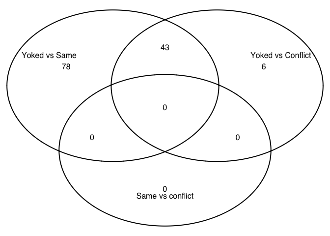
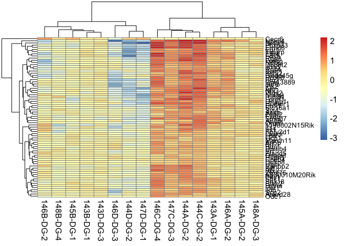
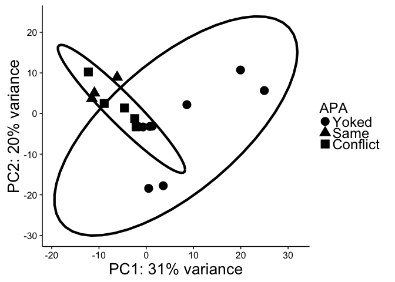
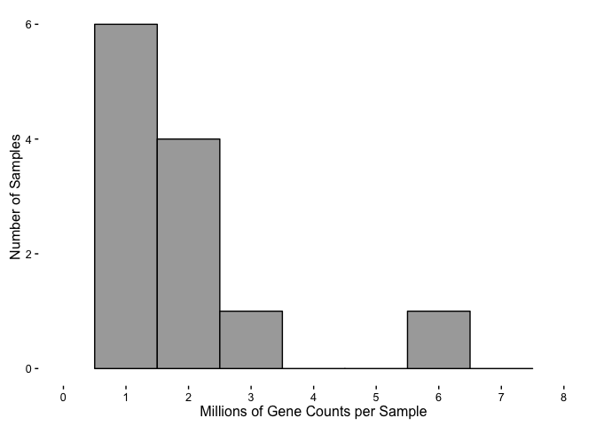

RNAseq gene expression analysis with DESeq2
-------------------------------------------

This workflow was modified from the DESeq2 tutorial found at: <https://www.bioconductor.org/packages/release/bioc/vignettes/DESeq2/inst/doc/DESeq2.pdf>

First I load a handful of packages for data wrangling, gene expression analysis, data visualization, and statistics.

``` r
library(dplyr) ## for filtering and selecting rows
library(plyr) ## for renmaing factors
library(reshape2) ## for melting dataframe
library(magrittr) ## to use the weird pipe
library(gplots) ##for making awesome plots
library(cowplot) ## for some easy to use themes
library(ggplot2) ## for awesome plots!
library(DESeq2) ## for gene expression analysis
library(pheatmap) ## for awesome heatmaps
library(edgeR)  ## for basic read counts status
library(VennDiagram) ## for Venn Diagrams
```

Then, I set all path so that all the figures are saved in the specified subdirectory.

``` r
## set output file for figures 
knitr::opts_chunk$set(fig.path = '../figures/FigDGonly/')
```

Now, I create data frames from three csv files - count: Contains counts for all transcripts generated from the program Kallisto. This data can be reproducibed from the file kallisto.Rmd - geneids: Contains the ensemble ids and gene names for all the transcripts in the counts data frame. This file will be used to convert transcipt counts to gene counts. This file was also created via kallisto.Rmd file - Traits: This file contains all the information I collected for each sample that was sequenced. Not all columns will be needed, so some are removed later.

``` r
count <- read.csv("../data/02_count.csv", row.names=1, check.names=FALSE )
geneids <- read.csv("../data/02_geneids.csv")
Traits <- read.csv("../data/02_JA16444samples.csv", sep=",", header = TRUE, stringsAsFactors=FALSE, na.string = "NA")
```

Rather than analyze transcript level counts, I want to examine gene-level counts. In this next section, I do some data wrangling to tidy the data and summarize the counts for all transcripts belonging to the same gene.

``` r
countbygene <- full_join(geneids, count) # merge count and gene id dataframes
```

    ## Joining, by = "id"

``` r
countbygene <- countbygene[-c(1:6,8:12)] # remove unnecesary columns (aka, keep gene name and counts for samples)
countbygene <- melt(countbygene, id=c("gene")) # lenghten 
countbygene$variable <- gsub('.{4}$', '', countbygene$variable) # string split to remove last for characters aka "_S##"
countbygene$variable <- gsub("\\_", "-", countbygene$variable) #replace _ with - in name
countbygene  <- dcast(countbygene, gene ~ variable, value.var= "value", fun.aggregate=mean) # widen by sum
row.names(countbygene) <- countbygene$gene # make gene the row name 
countbygene[1] <- NULL # now remove the gene name from the df
countbygene <- round(countbygene) # round all value to nearest 1s place
head(countbygene)
```

    ##               100-CA1-1 100-CA1-2 100-CA1-3 100-CA3-1 100-CA3-4 100-DG-2
    ## 0610007P14Rik        21        78        28        32        40       24
    ## 0610009B22Rik         7        43         6        12         6        8
    ## 0610009L18Rik         3        35         2        11         8        2
    ## 0610009O20Rik        44       225        66        87        88       58
    ## 0610010F05Rik        10        35        11         8        12        7
    ## 0610010K14Rik         2         7         2         1         3        1
    ##               100-DG-3 101-CA1-1 101-CA1-2 101-CA1-3 101-CA3-1 101-CA3-4
    ## 0610007P14Rik       95        58         0         0        38        16
    ## 0610009B22Rik       30        16         2         0        18         5
    ## 0610009L18Rik       40        12         0         0        10         2
    ## 0610009O20Rik      200       165         3         8       100        34
    ## 0610010F05Rik       28        13         1         1         6         6
    ## 0610010K14Rik        9         7         0         0         0         0
    ##               101-DG-3 101-DG-4 143A-CA3-1 143A-DG-1 143B-CA1-1 143B-DG-1
    ## 0610007P14Rik        2        3         42        56         30        24
    ## 0610009B22Rik        1        0         12        17         10         5
    ## 0610009L18Rik        2        8          4         9         10         8
    ## 0610009O20Rik        4       13         85       185         44        72
    ## 0610010F05Rik        0        1         18        19          7        15
    ## 0610010K14Rik        0        2          2         7          1         2
    ##               143C-CA1-1 143D-CA1-3 143D-DG-3 144A-CA1-2 144A-CA3-2
    ## 0610007P14Rik         19         14        22         40         10
    ## 0610009B22Rik         10          0         0         15          4
    ## 0610009L18Rik          2          0         2          9          5
    ## 0610009O20Rik         76         25        38         95         20
    ## 0610010F05Rik          7          5         8         15          2
    ## 0610010K14Rik          2          2         1          3          1
    ##               144A-DG-2 144B-CA1-1 144B-CA3-1 144C-CA1-2 144C-CA3-2
    ## 0610007P14Rik        40         36         17         32         14
    ## 0610009B22Rik         4          7          4          8         12
    ## 0610009L18Rik         0          1          4          2          4
    ## 0610009O20Rik        82         49         24         89         48
    ## 0610010F05Rik        17          9          3         12          7
    ## 0610010K14Rik         2          4          1          3          1
    ##               144C-DG-2 144D-CA3-2 144D-DG-2 145A-CA1-2 145A-CA3-2
    ## 0610007P14Rik        25         22        75         66          2
    ## 0610009B22Rik         8          6        12         18          3
    ## 0610009L18Rik         6          9        13         21          0
    ## 0610009O20Rik        85         46       151         96         12
    ## 0610010F05Rik        12         14        18         22          1
    ## 0610010K14Rik         2          2         6          3          0
    ##               145A-DG-2 145B-CA1-1 145B-CA3-1 145B-DG-1 146A-CA1-2
    ## 0610007P14Rik        20         26          0        10         14
    ## 0610009B22Rik         7          8          0         5          8
    ## 0610009L18Rik         1          3          0         0          8
    ## 0610009O20Rik        52        124          0        46         68
    ## 0610010F05Rik         6          4          0         5          9
    ## 0610010K14Rik         2          2          0         2          3
    ##               146A-CA3-2 146A-DG-2 146B-CA1-2 146B-CA3-2 146B-DG-2
    ## 0610007P14Rik         44        12          6         16         0
    ## 0610009B22Rik          4         3          3         22         0
    ## 0610009L18Rik          9         6          0          2         0
    ## 0610009O20Rik        102        44         16         46         2
    ## 0610010F05Rik         10         6          7         14         1
    ## 0610010K14Rik          1         2          1          1         1
    ##               146C-CA1-4 146C-CA3-4 146C-DG-4 146D-CA1-3 146D-CA3-3
    ## 0610007P14Rik         19          2        11          6         44
    ## 0610009B22Rik          4          4         3          2         12
    ## 0610009L18Rik          9          0         0          0          7
    ## 0610009O20Rik         31          3        10          1         83
    ## 0610010F05Rik          5          1         4          1         18
    ## 0610010K14Rik          1          0         0          1          1
    ##               146D-DG-3 147-CA1-4 147-CA3-4 147-DG-4 147C-CA1-3 147C-CA3-3
    ## 0610007P14Rik         3         1        46        0         34         82
    ## 0610009B22Rik         0         1        10        4          8         15
    ## 0610009L18Rik         0         0         0        0          2         11
    ## 0610009O20Rik         3         0        29        0         58        191
    ## 0610010F05Rik         0         2         0        2         19         41
    ## 0610010K14Rik         0         0         1        0          4          3
    ##               147C-DG-3 147D-CA1-1 147D-CA3-1 147D-DG-1 148-CA1-2
    ## 0610007P14Rik        41          0         40       152        24
    ## 0610009B22Rik        20          0         20        52         3
    ## 0610009L18Rik         3          0          9        67        13
    ## 0610009O20Rik       145          0         88       377        27
    ## 0610010F05Rik        23          0         28        56         9
    ## 0610010K14Rik         2          0          0        16         0
    ##               148-CA3-2 148-DG-2 148A-CA1-3 148A-CA3-3 148A-DG-3
    ## 0610007P14Rik        29       21         68         28        52
    ## 0610009B22Rik        23        8         30         12         8
    ## 0610009L18Rik         0        0         16          7        11
    ## 0610009O20Rik        91      164        162         65       226
    ## 0610010F05Rik        19        7         25         19        22
    ## 0610010K14Rik         2        1          5          4         2
    ##               148B-CA1-4 148B-CA3-4 148B-DG-4
    ## 0610007P14Rik          2         61         8
    ## 0610009B22Rik          0         22         1
    ## 0610009L18Rik          0         11         1
    ## 0610009O20Rik          0         70        18
    ## 0610010F05Rik          0         22         3
    ## 0610010K14Rik          0          4         1

``` r
summary(countbygene)
```

    ##    100-CA1-1          100-CA1-2         100-CA1-3       
    ##  Min.   :    0.00   Min.   :    0.0   Min.   :    0.00  
    ##  1st Qu.:    0.00   1st Qu.:    0.0   1st Qu.:    0.00  
    ##  Median :    4.00   Median :   12.0   Median :    4.00  
    ##  Mean   :   50.55   Mean   :  147.3   Mean   :   49.58  
    ##  3rd Qu.:   29.00   3rd Qu.:   91.0   3rd Qu.:   30.00  
    ##  Max.   :31720.00   Max.   :95996.0   Max.   :24445.00  
    ##    100-CA3-1          100-CA3-4           100-DG-2       
    ##  Min.   :    0.00   Min.   :    0.00   Min.   :    0.00  
    ##  1st Qu.:    0.00   1st Qu.:    0.00   1st Qu.:    0.00  
    ##  Median :    4.00   Median :    5.00   Median :    3.00  
    ##  Mean   :   42.98   Mean   :   53.61   Mean   :   29.28  
    ##  3rd Qu.:   29.00   3rd Qu.:   33.00   3rd Qu.:   19.00  
    ##  Max.   :24878.00   Max.   :42838.00   Max.   :22711.00  
    ##     100-DG-3          101-CA1-1          101-CA1-2       
    ##  Min.   :     0.0   Min.   :     0.0   Min.   :   0.000  
    ##  1st Qu.:     0.0   1st Qu.:     0.0   1st Qu.:   0.000  
    ##  Median :    14.0   Median :     9.0   Median :   0.000  
    ##  Mean   :   135.9   Mean   :   118.7   Mean   :   3.204  
    ##  3rd Qu.:    92.0   3rd Qu.:    58.0   3rd Qu.:   2.000  
    ##  Max.   :100671.0   Max.   :183815.0   Max.   :3478.000  
    ##    101-CA1-3          101-CA3-1          101-CA3-4       
    ##  Min.   :   0.000   Min.   :    0.00   Min.   :    0.00  
    ##  1st Qu.:   0.000   1st Qu.:    0.00   1st Qu.:    0.00  
    ##  Median :   0.000   Median :    5.00   Median :    2.00  
    ##  Mean   :   6.868   Mean   :   60.53   Mean   :   28.46  
    ##  3rd Qu.:   4.000   3rd Qu.:   34.00   3rd Qu.:   15.00  
    ##  Max.   :6174.000   Max.   :86004.00   Max.   :37665.00  
    ##     101-DG-3           101-DG-4         143A-CA3-1         143A-DG-1      
    ##  Min.   :   0.000   Min.   :   0.00   Min.   :    0.00   Min.   :    0.0  
    ##  1st Qu.:   0.000   1st Qu.:   0.00   1st Qu.:    0.00   1st Qu.:    0.0  
    ##  Median :   0.000   Median :   0.00   Median :    5.00   Median :   10.0  
    ##  Mean   :   1.623   Mean   :  13.37   Mean   :   71.18   Mean   :  118.4  
    ##  3rd Qu.:   1.000   3rd Qu.:   8.00   3rd Qu.:   42.00   3rd Qu.:   75.0  
    ##  Max.   :2351.000   Max.   :9988.00   Max.   :23989.00   Max.   :76185.0  
    ##    143B-CA1-1        143B-DG-1          143C-CA1-1      
    ##  Min.   :    0.0   Min.   :    0.00   Min.   :    0.00  
    ##  1st Qu.:    0.0   1st Qu.:    0.00   1st Qu.:    0.00  
    ##  Median :    3.0   Median :    4.00   Median :    4.00  
    ##  Mean   :   38.9   Mean   :   45.32   Mean   :   48.31  
    ##  3rd Qu.:   23.0   3rd Qu.:   32.00   3rd Qu.:   30.00  
    ##  Max.   :30026.0   Max.   :21691.00   Max.   :21143.00  
    ##    143D-CA1-3         143D-DG-3          144A-CA1-2      
    ##  Min.   :    0.00   Min.   :    0.00   Min.   :    0.00  
    ##  1st Qu.:    0.00   1st Qu.:    0.00   1st Qu.:    0.00  
    ##  Median :    1.00   Median :    2.00   Median :    6.00  
    ##  Mean   :   24.05   Mean   :   22.28   Mean   :   66.91  
    ##  3rd Qu.:   15.00   3rd Qu.:   16.00   3rd Qu.:   43.00  
    ##  Max.   :12512.00   Max.   :10111.00   Max.   :44270.00  
    ##    144A-CA3-2         144A-DG-2          144B-CA1-1      
    ##  Min.   :    0.00   Min.   :    0.00   Min.   :    0.00  
    ##  1st Qu.:    0.00   1st Qu.:    0.00   1st Qu.:    0.00  
    ##  Median :    1.00   Median :    6.00   Median :    4.00  
    ##  Mean   :   10.14   Mean   :   70.08   Mean   :   56.71  
    ##  3rd Qu.:    5.00   3rd Qu.:   45.00   3rd Qu.:   35.00  
    ##  Max.   :12302.00   Max.   :33414.00   Max.   :35177.00  
    ##    144B-CA3-1         144C-CA1-2         144C-CA3-2     
    ##  Min.   :    0.00   Min.   :    0.00   Min.   :    0.0  
    ##  1st Qu.:    0.00   1st Qu.:    0.00   1st Qu.:    0.0  
    ##  Median :    1.00   Median :    6.00   Median :    2.0  
    ##  Mean   :   22.54   Mean   :   71.77   Mean   :   28.8  
    ##  3rd Qu.:   13.00   3rd Qu.:   46.00   3rd Qu.:   16.0  
    ##  Max.   :12714.00   Max.   :35028.00   Max.   :26898.0  
    ##    144C-DG-2          144D-CA3-2         144D-DG-2         145A-CA1-2     
    ##  Min.   :    0.00   Min.   :    0.00   Min.   :    0.0   Min.   :    0.0  
    ##  1st Qu.:    0.00   1st Qu.:    0.00   1st Qu.:    0.0   1st Qu.:    0.0  
    ##  Median :    4.00   Median :    4.00   Median :    9.0   Median :    8.0  
    ##  Mean   :   48.18   Mean   :   53.78   Mean   :  100.3   Mean   :  105.6  
    ##  3rd Qu.:   32.00   3rd Qu.:   29.00   3rd Qu.:   67.0   3rd Qu.:   62.0  
    ##  Max.   :15607.00   Max.   :46442.00   Max.   :39287.0   Max.   :73533.0  
    ##    145A-CA3-2         145A-DG-2          145B-CA1-1      
    ##  Min.   :   0.000   Min.   :    0.00   Min.   :    0.00  
    ##  1st Qu.:   0.000   1st Qu.:    0.00   1st Qu.:    0.00  
    ##  Median :   0.000   Median :    2.00   Median :    3.00  
    ##  Mean   :   8.004   Mean   :   30.73   Mean   :   45.99  
    ##  3rd Qu.:   4.000   3rd Qu.:   21.00   3rd Qu.:   26.00  
    ##  Max.   :7739.000   Max.   :11567.00   Max.   :39155.00  
    ##    145B-CA3-1         145B-DG-1          146A-CA1-2      
    ##  Min.   :0.000000   Min.   :    0.00   Min.   :    0.00  
    ##  1st Qu.:0.000000   1st Qu.:    0.00   1st Qu.:    0.00  
    ##  Median :0.000000   Median :    3.00   Median :    3.00  
    ##  Mean   :0.003514   Mean   :   32.06   Mean   :   39.06  
    ##  3rd Qu.:0.000000   3rd Qu.:   22.00   3rd Qu.:   24.00  
    ##  Max.   :3.000000   Max.   :15903.00   Max.   :28994.00  
    ##    146A-CA3-2         146A-DG-2          146B-CA1-2       146B-CA3-2      
    ##  Min.   :    0.00   Min.   :    0.00   Min.   :   0.0   Min.   :    0.00  
    ##  1st Qu.:    0.00   1st Qu.:    0.00   1st Qu.:   0.0   1st Qu.:    0.00  
    ##  Median :    5.00   Median :    2.00   Median :   2.0   Median :    4.00  
    ##  Mean   :   67.24   Mean   :   26.33   Mean   :  22.5   Mean   :   46.97  
    ##  3rd Qu.:   36.00   3rd Qu.:   18.00   3rd Qu.:  14.0   3rd Qu.:   29.00  
    ##  Max.   :89329.00   Max.   :13368.00   Max.   :7314.0   Max.   :23297.00  
    ##    146B-DG-2         146C-CA1-4         146C-CA3-4         146C-DG-4      
    ##  Min.   :   0.00   Min.   :    0.00   Min.   :   0.000   Min.   :   0.00  
    ##  1st Qu.:   0.00   1st Qu.:    0.00   1st Qu.:   0.000   1st Qu.:   0.00  
    ##  Median :   0.00   Median :    2.00   Median :   0.000   Median :   0.00  
    ##  Mean   :   2.47   Mean   :   29.48   Mean   :   5.964   Mean   :  10.56  
    ##  3rd Qu.:   1.00   3rd Qu.:   18.00   3rd Qu.:   3.000   3rd Qu.:   7.00  
    ##  Max.   :3901.00   Max.   :15918.00   Max.   :5751.000   Max.   :2745.00  
    ##    146D-CA1-3         146D-CA3-3         146D-DG-3       
    ##  Min.   :   0.000   Min.   :    0.00   Min.   :   0.000  
    ##  1st Qu.:   0.000   1st Qu.:    0.00   1st Qu.:   0.000  
    ##  Median :   0.000   Median :    5.00   Median :   0.000  
    ##  Mean   :   8.644   Mean   :   65.28   Mean   :   1.934  
    ##  3rd Qu.:   4.000   3rd Qu.:   40.00   3rd Qu.:   0.000  
    ##  Max.   :9683.000   Max.   :38276.00   Max.   :3002.000  
    ##    147-CA1-4         147-CA3-4           147-DG-4          147C-CA1-3   
    ##  Min.   :   0.00   Min.   :    0.00   Min.   :   0.000   Min.   :    0  
    ##  1st Qu.:   0.00   1st Qu.:    0.00   1st Qu.:   0.000   1st Qu.:    0  
    ##  Median :   0.00   Median :    0.00   Median :   0.000   Median :    6  
    ##  Mean   :   3.59   Mean   :   15.32   Mean   :   3.098   Mean   :   67  
    ##  3rd Qu.:   1.00   3rd Qu.:    7.00   3rd Qu.:   0.000   3rd Qu.:   43  
    ##  Max.   :5374.00   Max.   :14487.00   Max.   :3772.000   Max.   :37687  
    ##    147C-CA3-3         147C-DG-3          147D-CA1-1        147D-CA3-1     
    ##  Min.   :     0.0   Min.   :    0.00   Min.   :0.00000   Min.   :    0.0  
    ##  1st Qu.:     0.0   1st Qu.:    0.00   1st Qu.:0.00000   1st Qu.:    0.0  
    ##  Median :    13.0   Median :   10.00   Median :0.00000   Median :    8.0  
    ##  Mean   :   134.3   Mean   :   94.22   Mean   :0.00378   Mean   :  105.7  
    ##  3rd Qu.:    79.0   3rd Qu.:   66.00   3rd Qu.:0.00000   3rd Qu.:   59.0  
    ##  Max.   :150301.0   Max.   :46988.00   Max.   :6.00000   Max.   :95754.0  
    ##    147D-DG-1         148-CA1-2          148-CA3-2       
    ##  Min.   :    0.0   Min.   :    0.00   Min.   :    0.00  
    ##  1st Qu.:    0.0   1st Qu.:    0.00   1st Qu.:    0.00  
    ##  Median :   24.0   Median :    2.00   Median :    4.00  
    ##  Mean   :  249.9   Mean   :   41.76   Mean   :   51.06  
    ##  3rd Qu.:  176.0   3rd Qu.:   24.00   3rd Qu.:   31.00  
    ##  Max.   :91299.0   Max.   :24841.00   Max.   :23437.00  
    ##     148-DG-2          148A-CA1-3        148A-CA3-3      
    ##  Min.   :    0.00   Min.   :    0.0   Min.   :    0.00  
    ##  1st Qu.:    0.00   1st Qu.:    0.0   1st Qu.:    0.00  
    ##  Median :    3.00   Median :    9.0   Median :    4.00  
    ##  Mean   :   47.46   Mean   :  115.2   Mean   :   60.18  
    ##  3rd Qu.:   33.00   3rd Qu.:   72.0   3rd Qu.:   34.00  
    ##  Max.   :15414.00   Max.   :52783.0   Max.   :32891.00  
    ##    148A-DG-3          148B-CA1-4         148B-CA3-4      
    ##  Min.   :    0.00   Min.   :    0.00   Min.   :    0.00  
    ##  1st Qu.:    0.00   1st Qu.:    0.00   1st Qu.:    0.00  
    ##  Median :    9.00   Median :    0.00   Median :    6.00  
    ##  Mean   :   85.29   Mean   :    8.26   Mean   :   76.68  
    ##  3rd Qu.:   60.00   3rd Qu.:    3.00   3rd Qu.:   45.00  
    ##  Max.   :31971.00   Max.   :33665.00   Max.   :37680.00  
    ##    148B-DG-4       
    ##  Min.   :    0.00  
    ##  1st Qu.:    0.00  
    ##  Median :    2.00  
    ##  Mean   :   17.71  
    ##  3rd Qu.:   12.00  
    ##  Max.   :10089.00

In this next section, I tidy the trait data for each sample so that I can calculate differential gene expression for the traits of interest. I also remove some samples for reasons described within the code blocks.

``` r
rownames(Traits) <- Traits$RNAseqID    # set $genoAPAsessionInd as rownames
Traits <- Traits[c(1,3,5:6,10:11)]  #keeping informative volumns
Traits <- Traits %>% dplyr::filter(!grepl("100|101|147-|148-|147D-CA1-1|145B-CA3-1|CA1|CA3", RNAseqID))  # remove 100, 100, 147, and 148 animals because we aren't interested in these homecage animals that were not trained in the active place avoidance experiement. Remove mice 147D_CA1_1 and 145B_CA3_1 because these were bad samples with no reads
Traits$APAconflict <- as.factor(paste(Traits$APA, Traits$Conflict, sep="_")) # adding combinatorial traits columns
Traits$ID <- gsub("[[:punct:]]", "", Traits$Mouse) #make a column that thas id without the dash
row.names(Traits) <- Traits$RNAseqID # make gene the row name 
Traits$APA <- NULL ## delete old APA column
names(Traits)[names(Traits)=="APAconflict"] <- "APA" #rename APAconflict APA (for simplicity)

# rename factors & group all yoked animals into 1 group
Traits$APA <- revalue(Traits$APA, c("Trained_Conflict" = "Conflict")) 
Traits$APA <- revalue(Traits$APA, c("Trained_NoConflict" = "Same")) 
Traits$APA <- revalue(Traits$APA, c("Yoked_Conflict" = "Yoked")) 
Traits$APA <- revalue(Traits$APA, c("Yoked_NoConflict" = "Yoked")) 
head(Traits)
```

    ##            RNAseqID   Mouse   Conflict Punch Slice      APA     ID
    ## 143A-DG-1 143A-DG-1 15-143A   Conflict    DG     1 Conflict 15143A
    ## 143B-DG-1 143B-DG-1 15-143B   Conflict    DG     1    Yoked 15143B
    ## 143D-DG-3 143D-DG-3 15-143D NoConflict    DG     3    Yoked 15143D
    ## 144A-DG-2 144A-DG-2 15-144A   Conflict    DG     2 Conflict 15144A
    ## 144C-DG-2 144C-DG-2 15-144C NoConflict    DG     2     Same 15144C
    ## 144D-DG-2 144D-DG-2 15-144D NoConflict    DG     2    Yoked 15144D

Now, we are ready to calculate differential gene expression using the DESeq package. For simplicity, I will use the standard nameing of "countData" and "colData" for the gene counts and gene information, respectively.

``` r
countData <- countbygene #set the countdata to be the countbygene df
colData <- Traits %>% arrange(RNAseqID) #set the coldata to be the countbygene df

## colData and countData must contain the exact same sample. I'll use the next three lines to make that happen
savecols <- as.character(colData$RNAseqID) #select the sample name column that corresponds to row names
savecols <- as.vector(savecols) # make it a vector
countData <- countData %>% dplyr::select(one_of(savecols)) # select just the columns that match the samples in colData


# colData must be factors
cols = c(1:4,7)
colData[,cols] %<>% lapply(function(x) as.factor(as.character(x)))
colData$Slice <- as.factor(colData$Slice)
str(colData)
```

    ## 'data.frame':    16 obs. of  7 variables:
    ##  $ RNAseqID: Factor w/ 16 levels "143A-DG-1","143B-DG-1",..: 1 2 3 4 5 6 7 8 9 10 ...
    ##  $ Mouse   : Factor w/ 16 levels "15-143A","15-143B",..: 1 2 3 4 5 6 7 8 9 10 ...
    ##  $ Conflict: Factor w/ 2 levels "Conflict","NoConflict": 1 1 2 1 2 2 1 1 1 1 ...
    ##  $ Punch   : Factor w/ 1 level "DG": 1 1 1 1 1 1 1 1 1 1 ...
    ##  $ Slice   : Factor w/ 4 levels "1","2","3","4": 1 1 3 2 2 2 2 1 2 2 ...
    ##  $ APA     : Factor w/ 3 levels "Conflict","Same",..: 1 3 3 1 2 3 1 3 1 3 ...
    ##  $ ID      : Factor w/ 16 levels "15143A","15143B",..: 1 2 3 4 5 6 7 8 9 10 ...

Now, we are create differential gene expression object and remove genes with 0 counts. Before filtering, there are 22,485 genes in the object. After filtering genes with 0 counts, we will be left with 17,746 genes that are expressed in a least 1 sample. Then, we can caluate the size factors, estimate gene dispersion estimates, fit a model, test for outliers, and remove outliers.

``` r
## create DESeq object using the factors Punch and APA
dds <- DESeqDataSetFromMatrix(countData = countData,
                              colData = colData,
                              design = ~ APA)
```

    ## converting counts to integer mode

``` r
## DESeq2 1.3.7 specify the factor levels
#dds$Punch <- factor(dds$Punch, levels=c("DG","CA3", "CA1"))
dds$APA <- factor(dds$APA, levels=c("Yoked", "Same", "Conflict"))


dds # view the DESeq object - note numnber of genes
```

    ## class: DESeqDataSet 
    ## dim: 22485 16 
    ## metadata(1): version
    ## assays(1): counts
    ## rownames(22485): 0610007P14Rik 0610009B22Rik ... Zzef1 Zzz3
    ## rowData names(0):
    ## colnames(16): 143A-DG-1 143B-DG-1 ... 148A-DG-3 148B-DG-4
    ## colData names(7): RNAseqID Mouse ... APA ID

``` r
## DESeq2 1.3.6 Pre-filtering genes with 0 counts
dds <- dds[ rowSums(counts(dds)) > 1, ] 

dds # view the DESeq object - note numnber of genes
```

    ## class: DESeqDataSet 
    ## dim: 16658 16 
    ## metadata(1): version
    ## assays(1): counts
    ## rownames(16658): 0610007P14Rik 0610009B22Rik ... Zzef1 Zzz3
    ## rowData names(0):
    ## colnames(16): 143A-DG-1 143B-DG-1 ... 148A-DG-3 148B-DG-4
    ## colData names(7): RNAseqID Mouse ... APA ID

``` r
## DESeq2 1.4  Differential expression analysi
dds <- DESeq(dds)
```

    ## estimating size factors

    ## estimating dispersions

    ## gene-wise dispersion estimates

    ## mean-dispersion relationship

    ## final dispersion estimates

    ## fitting model and testing

    ## -- replacing outliers and refitting for 217 genes
    ## -- DESeq argument 'minReplicatesForReplace' = 7 
    ## -- original counts are preserved in counts(dds)

    ## estimating dispersions

    ## fitting model and testing

``` r
## for variance stablized gene expression and log transformed data
rld <- rlog(dds, blind=FALSE)
#vsd <- varianceStabilizingTransformation(dds, blind=FALSE)
#vsd.fast <- vst(dds, blind=FALSE)
```

Now, we can calculate the number of differentiall expressed genes for each contrast. See the function in "resvalsfunction.R" for details.

``` r
source("resvalsfunction.R")
contrast4 <- resvals(contrastvector = c("APA", "Yoked", "Same"), mypadj = 0.1)
```

    ## [1] 121

``` r
contrast5 <- resvals(contrastvector = c("APA", "Yoked", "Conflict"), mypadj = 0.1)
```

    ## [1] 49

``` r
contrast6 <- resvals(contrastvector = c("APA", "Same", "Conflict"), mypadj = 0.1)
```

    ## [1] 0

``` r
#create a new DF with the gene counts
## note: contrast1 had 0 differentially expressed genes, so it is not included 
rldpadjs <- assay(rld)
rldpadjs <- cbind(rldpadjs, contrast4, contrast5, contrast6)
rldpadjs <- as.data.frame(rldpadjs)
rldpadjs <- rldpadjs[ , grepl( "padj" , names( rldpadjs ) ) ]
head(rldpadjs)
```

    ##               padjAPAYokedSame padjAPAYokedConflict padjAPASameConflict
    ## 0610007P14Rik                1                    1                   1
    ## 0610009B22Rik                1                    1                   1
    ## 0610009L18Rik                1                    1                   1
    ## 0610009O20Rik                1                    1                   1
    ## 0610010F05Rik                1                    1                   1
    ## 0610010K14Rik                1                    1                   1

Now, we count the number of differnetially expressed genes (according to padj) and plot some venn diagrams.

``` r
venn1 <- row.names(rldpadjs[rldpadjs[1] <0.1 & !is.na(rldpadjs[1]),])
venn2 <- row.names(rldpadjs[rldpadjs[2] <0.1 & !is.na(rldpadjs[2]),])
venn3 <- row.names(rldpadjs[rldpadjs[3] <0.1 & !is.na(rldpadjs[3]),])

## check order for correctness
candidates <- list("Yoked vs Same" = venn1, "Yoked vs Conflict" = venn2,"Same vs conflict" = venn3)


prettyvenn <- venn.diagram(
  scaled=T,
  x = candidates, filename=NULL, 
  col = "black",
  fill = c( "white", "white", "white"),
  alpha = 0.5,
  cex = 1, fontfamily = "sans", #fontface = "bold",
  cat.default.pos = "text",
  #cat.dist = c(0.08, 0.08, 0.08), cat.pos = 1,
  cat.cex = 1, cat.fontfamily = "sans")
grid.draw(prettyvenn)
```



Now let's look at a heat map of the data

``` r
## set coloring for heat map anntations
df <- as.data.frame(colData(dds)[,c("APA")]) ## matrix to df
ann_colors = list(
  APA =  c(Yoked = (values=c("#8073ac")), Same = (values=c("#e08214")), Conflict = (values=c("#7f3b08"))))

DEGes <- assay(rld)
DEGes <- cbind(DEGes, contrast4, contrast5, contrast6)
DEGes <- as.data.frame(DEGes) # convert matrix to dataframe
DEGes$rownames <- rownames(DEGes)  # add the rownames to the dataframe
DEGes$padjmin <- with(DEGes, pmin(padjAPAYokedSame, padjAPAYokedConflict, padjAPAYokedConflict)) # create new col with min padj
DEGes <- DEGes %>% filter(padjmin < 0.01)
rownames(DEGes) <- DEGes$rownames
drop.cols <-colnames(DEGes[,grep("padj|pval|rownames", colnames(DEGes))])
DEGes <- DEGes %>% dplyr::select(-one_of(drop.cols))
DEGes <- as.matrix(DEGes)
DEGes <- DEGes - rowMeans(DEGes)
head(DEGes)
```

    ##               143A-DG-1  143B-DG-1   143D-DG-3 144A-DG-2 144C-DG-2
    ## 1190002N15Rik 0.4455570 -1.2157030 -0.03475106 1.5977000 1.3458024
    ## A830010M20Rik 0.1635088 -0.6078429 -0.33894975 1.1392292 0.9555086
    ## Acan          0.8068617 -0.6044171 -0.55024770 1.0278367 0.5205708
    ## Ankrd28       0.4531462 -0.3024109 -0.32540927 1.0142646 0.4702013
    ## Arc           1.1604161 -0.7219387 -0.32721112 1.3778265 1.9855491
    ## Arl4d         0.6078297 -0.2269070 -0.59505236 0.5217915 1.4831267
    ##                144D-DG-2   145A-DG-2  145B-DG-1   146A-DG-2   146B-DG-2
    ## 1190002N15Rik -0.7292517  0.16765646 -0.4307213  0.38895475  0.66573864
    ## A830010M20Rik -0.4386699 -0.07480234 -0.4229666  0.27064657 -0.13171398
    ## Acan          -0.8016263  0.49549568 -0.1804890  0.01206221 -0.52452040
    ## Ankrd28       -0.2616318 -0.37720419 -0.6823164 -0.38907739 -0.05811206
    ## Arc           -1.8027171  0.09813946 -0.3341147  0.96853380 -0.84340626
    ## Arl4d         -0.8200731 -0.29017079 -0.4289052  0.96536091 -0.35252007
    ##               146C-DG-4  146D-DG-3 147C-DG-3  147D-DG-1  148A-DG-3
    ## 1190002N15Rik 0.8285891 -1.1320414 0.7129418 -0.8091523 -0.1496625
    ## A830010M20Rik 1.0159530 -0.7108966 0.6500946 -0.7030243 -0.1319986
    ## Acan          0.7003147 -0.4840008 1.0180239 -1.2202602  0.2933325
    ## Ankrd28       1.0828383 -1.1383214 1.0082297 -0.6743511  0.4182167
    ## Arc           0.9282108 -1.1627532 1.0877477 -2.3179783  0.1526797
    ## Arl4d         0.2600697  0.1025520 0.5019863 -1.0649056 -0.3060988
    ##                148B-DG-4
    ## 1190002N15Rik -1.6516569
    ## A830010M20Rik -0.6340759
    ## Acan          -0.5089366
    ## Ankrd28       -0.2380624
    ## Arc           -0.2489839
    ## Arl4d         -0.3580839

``` r
pheatmap(DEGes, show_colnames=T, show_rownames = T,
         #annotation_col=df, annotation_colors = ann_colors,
         fontsize = 12, fontsize_row = 10, 
         border_color = "grey60"
)
```



Now lets look at a principle component analysis of the data

``` r
plotPCA(rld, intgroup=c("APA"), returnData=TRUE)
```

    ##                   PC1        PC2    group      APA      name
    ## 143A-DG-1  -8.8938903   2.478465 Conflict Conflict 143A-DG-1
    ## 143B-DG-1  -0.6869945  -3.303022    Yoked    Yoked 143B-DG-1
    ## 143D-DG-3   0.7646245  -3.179603    Yoked    Yoked 143D-DG-3
    ## 144A-DG-2 -12.2420285  10.232089 Conflict Conflict 144A-DG-2
    ## 144C-DG-2 -10.9674037   5.052723     Same     Same 144C-DG-2
    ## 144D-DG-2   0.5091917 -18.423547    Yoked    Yoked 144D-DG-2
    ## 145A-DG-2  -2.1413082  -3.263472 Conflict Conflict 145A-DG-2
    ## 145B-DG-1   1.2792685  -3.111477    Yoked    Yoked 145B-DG-1
    ## 146A-DG-2  -4.6150207   1.365447 Conflict Conflict 146A-DG-2
    ## 146B-DG-2  19.9360609  10.716574    Yoked    Yoked 146B-DG-2
    ## 146C-DG-4  -6.1635651   8.933753     Same     Same 146C-DG-4
    ## 146D-DG-3  24.9739344   5.660100    Yoked    Yoked 146D-DG-3
    ## 147C-DG-3 -11.4936944   3.677315     Same     Same 147C-DG-3
    ## 147D-DG-1   3.5943584 -17.772788    Yoked    Yoked 147D-DG-1
    ## 148A-DG-3  -2.4453308  -1.242435 Conflict Conflict 148A-DG-3
    ## 148B-DG-4   8.5917978   2.179877    Yoked    Yoked 148B-DG-4

``` r
pcadata <- plotPCA(rld, intgroup=c("APA"), returnData=TRUE)
percentVar <- round(100 * attr(pcadata, "percentVar"))


ggplot(pcadata, aes(PC1, PC2, shape=APA)) +
  geom_point(size=5) +
  xlab(paste0("PC1: ",percentVar[1],"% variance")) +
  ylab(paste0("PC2: ",percentVar[2],"% variance")) +  
  stat_ellipse(level = 0.95,size=1.5)   + 
  scale_color_manual(values=c("#006837", "#41ab5d", "#d9f0a3")) + 
  theme(axis.title.x = element_text(size=20),
        axis.title.y = element_text(size=20),
        legend.title = element_text(size=18),
        legend.text = element_text(size=18))
```

    ## Too few points to calculate an ellipse



Now for some basic stats about the read and gene counts

``` r
## stats

counts <- countData
dim( counts )
```

    ## [1] 22485    16

``` r
colSums( counts ) / 1e06  # in millions of reads
```

    ## 143A-DG-1 143B-DG-1 143D-DG-3 144A-DG-2 144C-DG-2 144D-DG-2 145A-DG-2 
    ##  2.662497  1.019113  0.500935  1.575766  1.083336  2.254320  0.690882 
    ## 145B-DG-1 146A-DG-2 146B-DG-2 146C-DG-4 146D-DG-3 147C-DG-3 147D-DG-1 
    ##  0.720798  0.591933  0.055549  0.237419  0.043490  2.118624  5.618550 
    ## 148A-DG-3 148B-DG-4 
    ##  1.917857  0.398258

``` r
table( rowSums( counts ) )[ 1:30 ] # Number of genes with low counts
```

    ## 
    ##    0    1    2    3    4    5    6    7    8    9   10   11   12   13   14 
    ## 5319  508  372  284  222  191  173  158  135  117  122  114  123  108  114 
    ##   15   16   17   18   19   20   21   22   23   24   25   26   27   28   29 
    ##   86  102   80   74   75   74   73   72   70   69   50   44   56   55   49

``` r
rowsum <- as.data.frame(colSums( counts ) / 1e06 )
names(rowsum)[1] <- "millioncounts"
rowsum$sample <- row.names(rowsum)

ggplot(rowsum, aes(x=millioncounts)) + 
  geom_histogram(binwidth = 1, colour = "black", fill = "darkgrey") +
  theme_classic() +
  scale_x_continuous(name = "Millions of Gene Counts per Sample",
                     breaks = seq(0, 8, 1),
                     limits=c(0, 8)) +
  scale_y_continuous(name = "Number of Samples")
```


